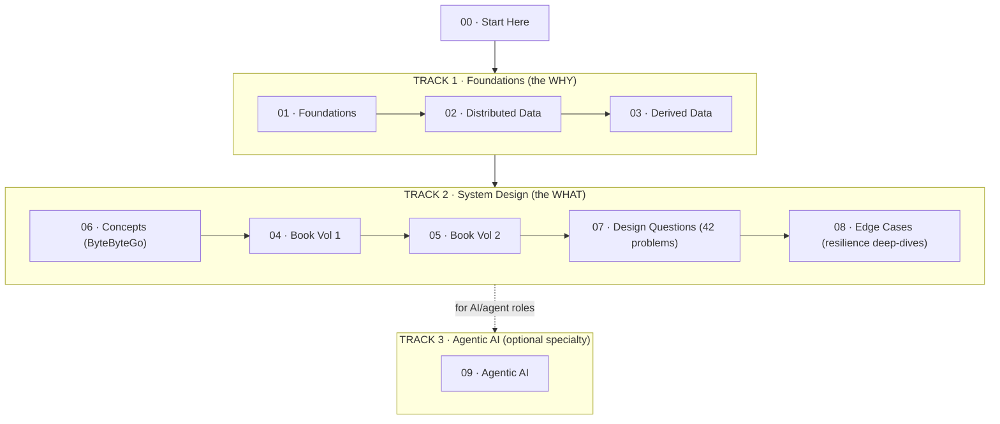
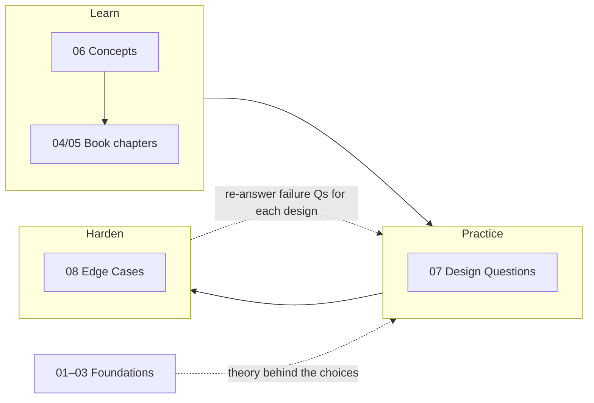

# Start Here — How to Use This Study Guide

This repository is **three courses in one**, ordered as a single curriculum. This page is the map: what each track is, what order to read them in, and which path fits your goal.

---

## The three tracks



| Track | Folders | What it gives you |
|-------|---------|-------------------|
| **1 · Foundations** | `01-foundations`, `02-distributed-data`, `03-derived-data` | The *why* behind every design decision — storage engines, replication, partitioning, transactions, consistency, consensus, batch/stream. Built on *Designing Data-Intensive Applications*. |
| **2 · System Design** | `04-book-vol-1`, `05-book-vol-2`, `06-concepts-bytebytego`, `07-design-questions`, `08-edge-cases` | The *what* — apply the theory to real interview problems, plus the failure-mode reasoning that separates senior from staff. |
| **3 · Agentic AI** | `09-agentic-ai` | A self-contained course for AI/agent roles. Only needed if you're targeting those. |

---

## Folder order at a glance

```
00-start-here          ← you are here
01-foundations         ┐
02-distributed-data    │  Track 1 — theory
03-derived-data        ┘
04-book-vol-1          ┐
05-book-vol-2          │
06-concepts-bytebytego │  Track 2 — system design
07-design-questions    │
08-edge-cases          ┘
09-agentic-ai          ← Track 3 — AI specialty
```

---

## How the Track 2 folders relate

This is the part people miss, so it's worth stating plainly:

- **`06-concepts-bytebytego`** — quick refreshers (networking, databases, caching, security, payments). Read when you need a concept fast.
- **`04-book-vol-1` / `05-book-vol-2`** — the Alex Xu book chapters, one concept per file. Teaches the *design method* on canonical problems.
- **`07-design-questions`** — 42 fully worked problems in the house style. This is your main **practice** surface.
- **`08-edge-cases`** — six resilience tiers (production failures, Redis, consistency, Kafka, high scale, advanced distributed systems). This is **not** a separate topic set — it's the failure-mode layer that applies to *every* design in `07`. Read it after you're comfortable with a few `07` chapters, then loop back and ask each design's failure questions.



---

## Pick your path

### Path A — Full study (do it properly)

Go in folder order, `01 → 09` (skip `09` unless you want the AI track). Track 1 first: don't skip it because it looks basic — its vocabulary (percentiles, replication lag, isolation levels) is used constantly later. Then Track 2 in order.

### Path B — Interview sprint (2 weeks)

You have interviews soon and limited time.

**Week 1 — highest-yield theory + core designs**
1. `01-foundations` → scalability/percentiles, LSM vs B-tree, encoding.
2. `02-distributed-data` → single-leader replication + replication lag, partitioning, weak isolation.
3. `07-design-questions` → the five to master first: **05 Rate Limiter, 01 Payment, 02 Ticket Booking, 03 Twitter Feed, 04 Task Scheduler**.

**Week 2 — depth that separates senior from staff**
4. `02-distributed-data` → linearizability/CAP, unreliable networks & clocks, consensus.
5. `08-edge-cases` → all six tiers (this is where most candidates hand-wave and get caught).
6. `07-design-questions` → 6–10 more chapters across Groups B–D matched to your target company.

### Path C — AI / agent role

Do Path B's Week 1, then `09-agentic-ai` in full, then `07-design-questions` Group D (chapters 31–42, the agent designs).

### Path D — "I have a specific problem at work"

Jump straight to the relevant `07-design-questions` chapter, then follow its "How this connects to other topics" links back into Track 1 theory and `08-edge-cases`.

---

## The house style (what every file gives you)

Teaching-first: each concept starts from **the failure that forced it to exist**, then the mechanism, then trade-offs, then the interview answer. Real Mermaid diagrams (not ASCII), trade-off tables, failure scenarios, 3-level interview Q&A, a 30-second spoken answer, and a compressed mental model.

**The recommended per-topic loop:**
1. Read "what is it / why does it exist" — state the problem in your own words before reading the solution.
2. Read the mechanism + diagram.
3. Cover the trade-off table and reconstruct it from memory — this is what interviews test.
4. Say the 30-second answer **out loud**. The gap between "I understand this" and "I can explain this under pressure" is larger than it feels.

---

## The one sentence that makes you sound senior

> "Let me clarify the requirements and scale first. Then I'll identify the critical business invariant, because that drives my consistency and database choices."

Everything in this guide is, ultimately, about being able to defend that sentence with specifics.
