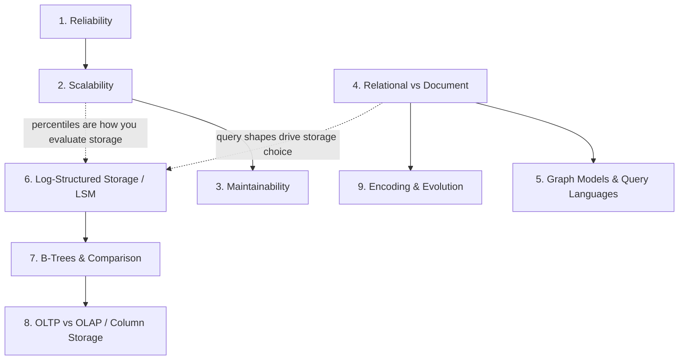

# 00 - Part I: Foundations of Data Systems

**Covers:** Chapters 1–4 of DDIA
**Scope:** everything here works on a *single machine*. No network partitions, no replication, no consensus. That comes in Part II.

---

## Chapter Overview

Part I answers four questions, in order:

1. **What are we even optimizing for?** (Ch. 1 — reliability, scalability, maintainability)
2. **How do we describe our data?** (Ch. 2 — relational, document, graph)
3. **How does the database physically store and find it?** (Ch. 3 — LSM-trees, B-trees, column storage)
4. **How does data survive being moved between processes and versions?** (Ch. 4 — encoding, schema evolution)

There's a logic to that order. You can't evaluate a storage engine without knowing what "good" means (Ch. 1). You can't choose a storage engine without knowing your query shapes, which come from your data model (Ch. 2). And once your data leaves one process, all of it becomes bytes, and bytes have compatibility problems (Ch. 4).

---

## What You Will Learn

By the end of Part I you should be able to:

- Describe load and performance **quantitatively** — and explain why the average response time is close to useless.
- Explain why p99 matters more than p50, and what tail latency amplification does to a microservice architecture.
- Argue relational vs. document with actual reasons, not preferences.
- Explain from first principles why Cassandra is fast at writes and Postgres is predictable at reads.
- Explain what a write amplification is and why it decides your storage choice.
- Explain why analytics queries destroyed row-oriented databases and produced column stores.
- Explain forward and backward compatibility, and why rolling upgrades force you to care about both.

---

## Prerequisites

None. This is the entry point. Some familiarity with SQL and with having operated *any* database will make it land harder.

---

## Topics

| # | File | Difficulty | Interview Importance |
|---|------|-----------|---------------------|
| 1 | `01-reliability.md` | Beginner | High |
| 2 | `02-scalability.md` | Beginner | **Critical** |
| 3 | `03-maintainability.md` | Beginner | Medium |
| 4 | `04-relational-vs-document.md` | Beginner | High |
| 5 | `05-graph-models-and-query-languages.md` | Intermediate | Medium |
| 6 | `06-log-structured-storage.md` | Intermediate | **Critical** |
| 7 | `07-b-trees-and-comparison.md` | Intermediate | **Critical** |
| 8 | `08-oltp-olap-column-storage.md` | Intermediate | High |
| 9 | `09-encoding-and-evolution.md` | Intermediate | High |

---

## Concept Dependency Diagram

The dotted arrows are the ones people miss. Your data model determines your query shapes, and your query shapes determine which storage engine is sane. And you can't tell whether a storage engine is working without percentile-based measurement.

---

## Recommended Learning Order

**Straight through (1 → 9)** is correct for a first pass.

**If you're short on time**, the highest-yield subset is: **2 (scalability) → 6 (LSM) → 7 (B-trees) → 8 (OLAP)**. Those four come up constantly in interviews and constantly at work.

**Topic 5 (graph models)** is the one you can defer. It's intellectually interesting and occasionally decisive — social graphs, recommendation systems, fraud rings — but it comes up least often. Read it after everything else in Part I.

---

## Chapter Summary — the argument of Part I in six lines

1. Reliability, scalability, and maintainability are the three axes; everything is a trade among them.
2. Load and performance must be described with numbers, and percentiles rather than averages.
3. Data models are not interchangeable: relational for many-to-many, document for self-contained trees, graph for arbitrary connections.
4. All storage engines trade **read cost, write cost, and space**. You cannot optimize all three.
5. Log-structured (LSM) favours writes; update-in-place (B-tree) favours predictable reads. That's the central storage trade-off in the book.
6. Once data leaves a process it's bytes, and both **backward** and **forward** compatibility are needed for anything to be deployable without downtime.

---

## What Part I Deliberately Does Not Cover

No replication. No partitioning. No network failures. No clocks.

Everything here assumes one reliable machine with one process. It's worth noticing how much complexity is *already* present under that assumption — because Part II adds a network, and the network is where it gets genuinely hard.
