# 01 - What Is a Data-Intensive Application?

**Prerequisites:** none
**Difficulty:** Beginner
**Source:** Chapter 1, "Thinking About Data Systems"

---

## 1. What Is It?

An application is **compute-intensive** when the CPU is the thing you run out of first. Think video encoding, or a physics simulation.

An application is **data-intensive** when the *data* is the thing that limits you — its amount, its complexity, or the speed at which it changes. Almost every backend system you have ever worked on is data-intensive. Nobody's e-commerce checkout is slow because the CPU can't multiply fast enough. It's slow because of a database query, a lock, a network hop, or a cache miss.

That distinction matters because it tells you where to look. In a data-intensive system, the interesting engineering is in **how data moves, where it rests, and what guarantees hold while it's in flight**.

---

## 2. Why Does It Exist? (the framing problem)

Here's the situation that forced this framing.

Ten years ago you'd say "we use a database" and that told the listener almost everything. One box, one product, one set of guarantees.

Today, a single "application" is more like this: Postgres holds the source of truth. Redis caches the expensive reads. Elasticsearch serves the search box. Kafka carries events to three downstream consumers. A nightly Spark job builds the analytics tables. An S3 bucket holds the raw uploads.

None of those tools are "the database." But your users experience all of them as one system, and they will blame you for all of them.

So the question "is Redis a database or a cache?" turns out to be the wrong question. The right question is: **what does the composite system guarantee, and where does it break?** The book's opening move is to stop thinking in product categories and start thinking in properties.

---

## 3. Simple Explanation

You are no longer choosing a database. You are **designing a data system** out of parts, and you become responsible for the seams between the parts.

If Redis serves a stale value because the invalidation message was lost, your user sees a bug. Redis worked correctly. Postgres worked correctly. The *system* was wrong. Nobody owns that seam except you.

That's the whole reason this book exists.

---

## 4. Real-World Analogy

**A restaurant kitchen.**

The walk-in fridge is long-term storage. The line cook's small under-counter fridge is the cache. The ticket rail is the message queue. The prep list is the batch job that ran this morning. The expediter is the API gateway coordinating everything.

Each station works fine alone. Dinner service fails at the *seams*: the ticket that fell off the rail, the prepped sauce that ran out and nobody told the line, the fridge that was restocked with the wrong item.

A head chef doesn't just pick good equipment. They design the flow between stations and decide what happens when a station fails. That's your job in a data system.

---

## 5. Technical Explanation

The book introduces three properties that recur through all 12 chapters. Everything else is in service of these:

**Reliability** — the system continues to work *correctly* (right function, right performance) even when things go wrong. Things going wrong are called **faults**; a system that anticipates them is **fault-tolerant**. Note the vocabulary carefully:

- A **fault** is one component deviating from spec (a disk dies).
- A **failure** is the system as a whole stopping service to the user.

The entire discipline is about *preventing faults from becoming failures*. You cannot reduce faults to zero, so you build so that faults don't propagate.

**Scalability** — you have strategies for keeping performance acceptable as load grows. Note it's phrased as a *strategy*, not a property. "Is this system scalable?" is a badly formed question. "Can this system handle 10× writes with a linear cost increase?" is a well-formed one.

**Maintainability** — the system remains workable for the people who operate and extend it. Three sub-parts: operability (easy to run), simplicity (easy to understand), evolvability (easy to change).

---

## 6. How Does It Work? — the shape of a real data system

```mermaid
flowchart TD
    Client[Client] --> API[Application Code]
    API -->|read| Cache["(Cache — Redis)"]
    Cache -.cache miss.-> DB["(Primary DB — Postgres)"]
    API -->|write| DB
    DB -->|change log| Q[Event Log — Kafka]
    Q --> SI[Search Index — Elasticsearch]
    Q --> W[Async Workers]
    Q --> DW[("Warehouse — batch/analytics")]
    API -->|search query| SI
```



Walk the diagram:

1. A write goes to the **primary database**. This is the *system of record* — the authoritative copy.
2. The change is emitted to an **event log**.
3. Consumers build **derived data**: a search index, an analytics table, an aggregate cache. Derived data can always be rebuilt from the system of record. That's the definition.
4. Reads are served from whichever store is cheapest for that query shape.

The single most useful distinction in the whole book appears right here, and it's worth internalizing early:

> **System of record** = the authoritative data. If it's lost, it's gone.
> **Derived data** = a transformation of the system of record. If it's lost, you rebuild it.

Almost every architectural argument in Part III comes down to being clear about which is which. Teams get into trouble when derived data quietly becomes authoritative — when someone starts writing directly to the search index, say, and now there are two sources of truth and no way to rebuild.

---

## 7. Concrete Example

**An e-commerce order system.**

- Order rows in Postgres → system of record.
- "Number of orders today" in Redis → derived.
- Product search index → derived.
- The email confirmation that was sent → *not* derived, and not in the database either. It's an external side effect you cannot un-send. This category is what makes exactly-once semantics hard (Topic 33).

If Redis is wiped, you recompute. If the search index is corrupt, you reindex from Postgres. If Postgres is lost and the backup is bad, the business has a very bad day.

That asymmetry should drive where you spend your reliability budget. It's remarkable how often teams have five-nines infrastructure for a cache and an untested backup for the system of record.

---

## 8. When Does This Framing Help / Not Help?

**Helps when:** you have more than one datastore; you're debugging inconsistency between systems; you're deciding what to make durable; you're being asked "why do we need Kafka here?"

**Doesn't help when:** you have one Postgres and 500 requests/second. Then you don't have a data system, you have a database, and adding components will make things worse, not better. The book is quite firm about this — if you can keep things on a single machine, generally do.

---

## 9. Advantages & Disadvantages of Composed Data Systems

**Advantages**
- Each workload gets a tool actually suited to it (search on a search engine, analytics on a column store).
- Failure of a derived system degrades one feature instead of the whole product.
- You can add capabilities without redesigning the core.

**Disadvantages**
- The seams are yours to own, and they have no vendor support.
- Consistency between stores becomes an application concern.
- Operational surface area grows roughly linearly with component count; on-call pain grows faster.
- Debugging spans systems with different logs, clocks, and mental models.

---

## 10. Trade-off Table

| Approach | Advantages | Disadvantages | When to Use |
|---|---|---|---|
| Single database, everything in it | Transactions across all data; one thing to operate; strong guarantees for free | Poor fit for search/analytics; scaling ceiling; one failure domain | Early stage, moderate load, until it actually hurts |
| Database + cache | Cheap read scaling | Invalidation bugs; stale reads; cache stampedes | Read-heavy with tolerable staleness |
| Database + derived systems via event log | Right tool per job; rebuildable; loosely coupled | Async lag; more moving parts; operational cost | Multiple distinct query shapes at real scale |
| Multiple independent write masters | Team autonomy | No single source of truth; reconciliation hell | Rarely a good idea; usually an org chart leaking into architecture |

That last row is worth sitting with. A surprising amount of bad architecture is Conway's law in disguise.

---

## 11. Failure Scenarios

| What goes wrong | What the user sees | How it's handled |
|---|---|---|
| Cache node dies | Latency spike, possible thundering herd on DB | Multiple cache nodes; request coalescing; graceful degradation |
| Invalidation message lost | Stale data indefinitely | TTLs as a backstop; rebuild from log |
| Search index consumer lags | New products don't appear in search | Lag monitoring and alerting; the log lets you catch up |
| System of record corrupted | Everything downstream is wrong | Backups, point-in-time recovery, audit trails (Topic 35) |
| One derived system is slow | Only that feature degrades — *if* you designed it that way | Async boundaries; timeouts; circuit breakers |

The last one is the design goal. Loose coupling exists so that a problem in one area doesn't spread.

---

## 12. Production Considerations

- **Monitoring must span seams,** not just components. Every dashboard green while users see stale data is the classic composed-system failure.
- **Measure lag explicitly** between system of record and each derived store. This one metric prevents an enormous class of confusing bugs.
- **Know your rebuild time.** "We can reindex from Postgres" is only true if you've tried it and it takes 40 minutes, not 9 days.
- **Cost:** every additional system is licensing, hardware, *and* a person's attention.

---

## ❌ 13. Common Mistakes

- **Treating a cache as a source of truth.** If you can't rebuild it, it isn't a cache — it's an undocumented database with no backups.
- **Adding Kafka because the architecture diagram looks better.** A queue is a tool for decoupling and buffering, not a status symbol. It has real operational cost.
- **Assuming components compose their guarantees.** Two linearizable systems used together are not linearizable. Guarantees do not add up; they have to be reasoned about at the seam.
- **Confusing fault with failure.** "We had a failure — a disk died." No: you had a fault. If a dead disk takes the system down, *that's* the failure, and it's a design problem, not a hardware problem.

---

## 🧠 14. Think Like an Engineer

```
What data exists?
      ↓
Which store is authoritative for each piece?
      ↓
What is derived, and can it actually be rebuilt?
      ↓
What are the query shapes, and their volumes?
      ↓
Where does data cross a boundary? (that's where bugs live)
      ↓
What breaks if each component fails, one at a time?
      ↓
Is the operational cost worth the capability?
```

The step people skip is the third one. "Can it be rebuilt?" is a question with a *testable* answer, and most teams have never tested it.

---

## 15. Mental Model

```
One source of truth
      +
Many derived views
      +
A reliable way to propagate changes
      =
A data system you can reason about
```

Anything that violates the first line — two systems both claiming authority over the same fact — is where you'll spend your weekends.

---

## 🔗 16. How This Connects to Other Concepts

- **Reliability (Topic 1)** gives you the fault/failure vocabulary this topic uses.
- **Encoding & Evolution (Topic 9)** is about what happens at the seams between components when versions differ.
- **Replication (Topic 10)** is one specific way to keep copies in sync; here it's the general case.
- **CDC & Event Sourcing (Topic 31)** and **Data Integration (Topic 34)** are the full treatment of the "system of record + derived data" idea. This file is the seed; Chapter 12 is the harvest.

---

## 17. Interview Questions & Answers

**Beginner**

**Q: What's the difference between a fault and a failure?**
A fault is one component deviating from spec — a disk dies, a network link drops packets, a process pauses. A failure is the system as a whole no longer providing service to users. The goal of fault tolerance is to stop faults from becoming failures. It's a useful distinction in postmortems because it separates "hardware broke" from "our design let hardware breaking take us down."

**Q: What is derived data?**
Data that's a transformation of some other data and can be recreated from it. A search index, a cache, an aggregate table. The test is: if you deleted it, could you rebuild it exactly from the source? If yes, it's derived, and you can treat it as disposable. If no, it's a system of record and it needs backups.

**Intermediate**

**Q: Why not just use one database for everything?**
Often you should — for a long time. But access patterns diverge: full-text search wants an inverted index, analytics wants column storage and full scans, sessions want fast key-value lookups. One engine tuned for all of them is tuned for none. The trade is that each additional system adds an integration seam you now own, and those seams are where consistency bugs live. So the rule of thumb is: stay on one database until a specific workload is demonstrably badly served, then add exactly one thing.

**Q: Your cache and database disagree. How do you think about it?**
First, decide which is authoritative — that's the database, by definition. Then ask how the disagreement arose: was the invalidation lost, was there a race between a read-through populate and a write, or is there a TTL that's too long? The structural fix is to stop invalidating imperatively and instead drive the cache from the database's change log, so the cache is a proper derived view rather than something maintained by scattered application code. And keep a TTL anyway, as a backstop for the bugs you haven't found.

**Advanced / Staff**

**Q: How do you decide whether to add a new datastore?**
I'd want to see a specific workload that the current system serves badly, with numbers — a query pattern that's slow and can't be indexed away, or a volume that doesn't fit. Then I'd cost the alternative honestly: not just the infrastructure, but the integration code, the lag monitoring, the runbooks, the on-call load, and the rebuild path. I'd also ask whether the data going into it is derived. If it's derived, the risk is bounded — worst case we rebuild. If it becomes a second source of truth, the risk is unbounded, and I'd push hard against that. The decision usually isn't "is this tool good" but "are we prepared to own this seam for three years."

**Q: How do you make a composed system debuggable?**
Propagate a request ID end to end, through the synchronous path and into the event log, so a single user complaint can be traced across every component. Expose lag as a first-class metric per derived system, not just liveness — a consumer that's up but 40 minutes behind is a worse failure than one that's down, because nothing alerts. And make rebuild a routine operation, not an emergency procedure; if reindexing is something you do monthly, you'll know it works when you need it.

---

## 🎯 30-Second Interview Answer

> "A data-intensive application is one where the limits are data volume, complexity, or rate of change — not CPU. In practice that means you're not choosing a database, you're composing several systems, and you own the seams between them. The key distinction is system of record versus derived data: the system of record is authoritative and needs real durability guarantees; derived data — caches, search indexes, analytics tables — can always be rebuilt from it. Most production incidents I've seen come from that line getting blurred, where something derived quietly becomes authoritative and now there's no way to rebuild it."

---

## ⚡ Quick Revision

- **Data-intensive** = limited by data, not CPU.
- **Fault** = component deviates. **Failure** = system stops serving. Fault tolerance prevents the first becoming the second.
- Three properties run through the whole book: **Reliability, Scalability, Maintainability**.
- **System of record** is authoritative; **derived data** is rebuildable. Never let derived data become authoritative.
- Composed systems fail **at the seams**, not inside components.
- Adding a datastore buys capability and costs an integration you own forever.
- Most important question to be able to answer: *if this store were wiped, could we rebuild it — and have we tested that?*
