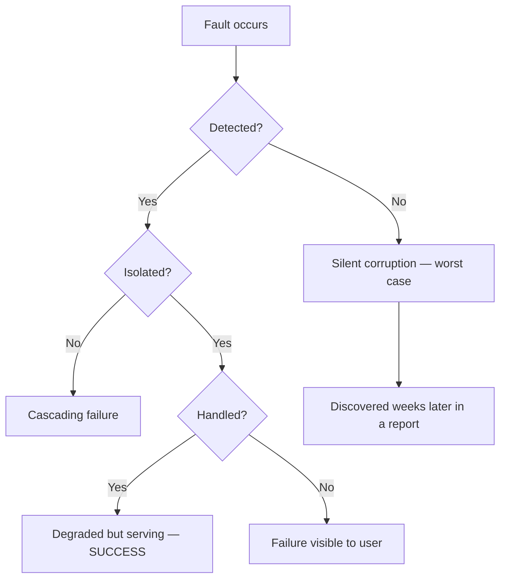

# 02 - Reliability & Fault Tolerance

**Prerequisites:** none
**Difficulty:** Beginner
**Interview importance:** High
**Source:** Chapter 1 — "Reliability"

---

## 1. What Is It?

Reliability means: **the system keeps doing the right thing even when something goes wrong.**

"The right thing" is more than "it's up." The book's working definition covers four things:

- It performs the function the user expected.
- It tolerates the user making mistakes or using it in unexpected ways.
- Its performance is good enough for the required load and data volume, under the expected conditions.
- It prevents unauthorized access and abuse.

Notice that a system returning correct answers 400× slower than usual is *unreliable*, even though it's "up." Performance is part of correctness.

---

## 2. Why Does It Exist?

Here's the problem that forces the idea.

You deploy a service on one machine. It works. Then, over the course of a year:

- A disk in the RAID array dies. (Hard drives have a mean time to failure of roughly 10–50 years, which sounds fine — until you have 10,000 of them, at which point you expect one death per day.)
- A kernel bug corrupts a page of memory.
- Someone deploys a config change with a typo at 4 p.m. on a Friday.
- A leap second is inserted and half your Java processes hang.
- A dependency you call starts responding in 30 seconds instead of 30 milliseconds.

None of these are exotic. All of them happen. And you cannot prevent any of them.

So the engineering question is not *"how do we stop things from breaking?"* It's **"how do we build so that things breaking doesn't reach the user?"**

That reframing is the whole of reliability engineering.

---

## 3. Simple Explanation

Two words do a lot of work here, and they're constantly confused:

- A **fault** is one component behaving badly — a disk dies, a process pauses, a packet is dropped.
- A **failure** is the *whole system* stopping service to users.

Faults are inevitable. Failures are a design outcome.

A fault-tolerant system is one where faults **do not become** failures. You will never get the fault count to zero. You can get the failure count very close to zero.

One counterintuitive consequence: to build a fault-tolerant system, you should **deliberately cause faults**, frequently, in production. Netflix's Chaos Monkey does exactly this — it kills instances at random during working hours. If your failover path is only ever exercised during a real outage at 3 a.m., it doesn't work. You just haven't found out yet.

---

## 4. Real-World Analogy

**A commercial airliner.**

A plane has two or four engines, two pilots, redundant hydraulics, and multiple independent instrument systems. Engines still fail. That's a *fault*. The plane still lands. That would be a *failure*.

Two features of the analogy carry over precisely:

- **Redundancy is only useful if the failures are independent.** Two engines fed by the same contaminated fuel tank is one failure domain wearing a costume. Same as two "redundant" database replicas in the same rack on the same power supply.
- **Crews rehearse engine-out procedures constantly.** Not because engines fail often — because the procedure has to be automatic when it happens. That's Chaos Monkey.

---

## 5. Technical Explanation — the three fault categories

The book divides faults into three kinds, and they behave *very* differently.

### Hardware faults

Disks die, RAM develops bit errors, power supplies fail, someone unplugs the wrong cable.

**Characteristic:** random and largely **uncorrelated**. Two disks in the same machine dying the same day is coincidence, not causation.

**Because they're uncorrelated, redundancy works well.** RAID, dual power supplies, hot-swappable components. This is the *easy* category, which is why the industry solved it first.

There's a shift worth noting: as data volumes and machine counts grew, the industry moved from "make each machine reliable" toward "assume machines die, tolerate it in software." That shift is what makes rolling upgrades and elastic cloud capacity possible.

### Software faults

A bug triggered by a specific input. A runaway process consuming all CPU. A shared dependency slowing down. Cascading failures where one degraded service takes out its callers.

**Characteristic:** **systematic and correlated**. This is the crucial difference. The same bug is present on every node. Redundancy does not help at all — you just have five machines running the same broken code, all failing at the same instant on the same input.

This category causes far more serious outages than hardware. There's no clean fix; the book's suggestions are: careful assumption-checking, thorough testing, process isolation, allowing crash-and-restart, and measuring behaviour in production so you notice divergence early.

### Human errors

Configuration errors by operators are the leading cause of outages in large internet services — ahead of hardware, by a wide margin.

**Characteristic:** guaranteed, because humans are unreliable, and blaming them is useless.

Approaches that actually work:
- Design interfaces where the easy path is the correct path — but avoid being so restrictive that people route around them.
- Provide sandboxes with real data where people can experiment without consequence.
- Test thoroughly at every level, especially the corner cases automated tests usually skip.
- Make recovery fast: quick config rollback, gradual rollout, tools to recompute data.
- Set up detailed monitoring — performance metrics and error rates, sometimes called telemetry. Metrics show problems early and help diagnose after.
- Good management practice and training.

The word "blameless" isn't in the book, but the posture is: if a human error took you down, the interesting question is what made that error possible and undetectable.

---

## 6. How Does It Work? — fault tolerance mechanically



The three gates are **detect → isolate → handle**, and they fail in that order of severity.

Undetected faults are the worst outcome, and the least discussed. A replication bug that silently drops 0.1% of writes doesn't page anyone. You find out when finance asks why the numbers don't reconcile. That's the argument for auditing and end-to-end verification (Topic 35).

---

## 7. Concrete Example

**A payments service processing 5,000 transactions per second.**

| Fault | Category | Effect without tolerance | With tolerance |
|---|---|---|---|
| One app server's disk dies | Hardware | 1/N of requests fail | Load balancer health check ejects it; capacity drops, service continues |
| Memory leak in new release | Software | All servers OOM within 6 hours — *simultaneously*, since they all deployed together | Canary deployment catches it on 1% of traffic; auto-rollback |
| Ops runs a migration against prod instead of staging | Human | Table locked, writes stall | Separate credentials per environment; migrations gated; fast rollback |
| Downstream bank API slows from 50ms to 20s | Software (external) | Threads exhausted, whole service hangs | Timeouts, bulkheads, circuit breaker; that one payment method degrades |

Look at the second row carefully. Redundancy made the memory leak *worse*, not better — all five servers had the same bug and died together. Only the canary (which deliberately breaks the uniformity) helps. That's the software-fault lesson in one row.

---

## 8. When Should We Invest Heavily in Reliability?

**Invest heavily:**
- Money, health, or safety is involved.
- Data loss is unrecoverable (photos, medical records, financial ledgers).
- Downtime has direct revenue or reputational cost.
- Regulatory or contractual obligations exist.

**Invest less:**
- Prototypes and internal tools with a handful of users.
- Non-critical features where degradation is genuinely acceptable.
- Products where you're still testing whether anyone wants this at all.

The book is explicit that there are situations where you may choose to sacrifice reliability to reduce development cost — for an unproven product — or operational cost, for a service with a very narrow margin. But it also says: *be very conscious of when you are cutting corners.* The problem isn't cutting corners. The problem is cutting them accidentally and discovering it in an incident.

---

## 9. Advantages & Disadvantages of Fault-Tolerance Mechanisms

**Advantages**
- Faults stay invisible to users.
- Enables routine maintenance without downtime (patch one node at a time).
- Reduces on-call load — automatic recovery beats human recovery at 3 a.m.

**Disadvantages**
- Redundancy costs hardware, directly.
- Fault-tolerance machinery is itself code, and can itself be buggy. A failover mechanism that triggers spuriously is worse than none.
- Increased complexity makes the system harder to reason about.
- Automatic recovery can mask a real problem until it's very large.

That third point deserves emphasis because it's the most common way this goes wrong: automatic retry that hides a downstream degradation until the retry storm itself takes down the dependency.

---

## 10. Trade-off Table

| Approach | Advantages | Disadvantages | When to Use |
|---|---|---|---|
| Hardware redundancy (RAID, dual PSU) | Simple, well-understood, handles uncorrelated faults | Doesn't help with software or human faults; cost | Always, for anything with a system of record |
| Software fault tolerance (multi-node, failover) | Handles whole-machine loss; enables rolling upgrades | Complex; failover itself can fail; split-brain risk | Systems needing high availability |
| Canary / gradual rollout | Catches correlated software faults before full blast radius | Slower deploys; needs good metrics to be meaningful | Any service deployed more than weekly |
| Chaos engineering | Proves recovery paths work | Requires organizational nerve and good observability | Mature systems where downtime is expensive |
| Accept the fault, recover fast | Cheap; simple; no false failovers | Visible downtime during recovery | Non-critical systems; when MTTR is genuinely low |

The last row is underrated. For many systems, "detect fast and restart fast" beats "never go down," because it's simpler and the simplicity itself prevents bugs.

---

## 11. Failure Scenarios

| Scenario | Handling |
|---|---|
| Disk fails | RAID / replicas; monitor rebuild time, which is when you're most vulnerable |
| Whole machine dies | Health checks eject it; capacity headroom absorbs the load |
| Bad deploy | Canary + fast rollback; feature flags to kill a code path without a deploy |
| Downstream slow (not down) | **Harder than down.** Timeouts, circuit breakers, bulkheads |
| Cascading failure from retries | Exponential backoff with jitter; retry budgets; load shedding |
| Silent data corruption | Checksums; periodic audits; end-to-end verification |
| Correlated failure (same bug everywhere) | Canary; heterogeneity where feasible; the honest answer is that this is hard |

**"Slow, not down" is worth its own note.** A dead dependency returns an error immediately and you handle it. A dependency that takes 30 seconds holds your threads hostage, and thread exhaustion takes down every endpoint, including the ones that don't use that dependency at all. Timeouts are not optional.

---

## 12. Production Considerations

- **Measure MTTR, not just MTBF.** How fast you recover usually matters more than how rarely you break.
- **Alert on symptoms, not causes.** "p99 latency > 2s" is actionable. "CPU > 80%" is noise.
- **Test your recovery paths on a schedule.** Restore a backup quarterly. If you haven't restored it, you don't have a backup — you have a file.
- **Blast radius:** ask of every change, "what fraction of users does this affect if it's wrong?"
- **Cost:** full redundancy roughly doubles infrastructure cost. That's a business decision, and it should be made explicitly.

---

## ❌ 13. Common Mistakes

- **Assuming redundancy helps with software bugs.** It doesn't. Five nodes with the same bug fail identically and simultaneously. This is probably the single most common misconception in this area.
- **Untested backups.** Extremely common; catastrophic when discovered.
- **Retrying without backoff.** Turns a brief degradation into a self-inflicted DDoS.
- **No timeouts on network calls.** The default in many HTTP clients is *infinite*. Check yours.
- **Treating human error as a people problem.** If a single typo can take down production, the system design is the defect.
- **Optimizing MTBF, ignoring MTTR.** Heroic effort to reduce incidents from 4/year to 3/year, while each one lasts 6 hours.
- **Failover that's never been exercised.** It will not work. It has never worked. It will not work this time either.

---

## 🧠 14. Think Like an Engineer

```
What can fail? (enumerate: hardware, software, human, dependency)
        ↓
For each: is it correlated or independent?
        ↓
Independent → redundancy helps
Correlated  → redundancy does NOT help; need canary/isolation
        ↓
Can I detect it? (if not, that's the first problem to solve)
        ↓
Can I isolate it? (bulkheads, timeouts, circuit breakers)
        ↓
Can I recover automatically? What's the MTTR?
        ↓
Have I actually tested this path?
        ↓
Is the cost justified by the consequence of failure?
```

The correlated/independent split at step two is the highest-value question. It tells you immediately whether redundancy is the answer or a waste of money.

---

## 15. Mental Model

```
Faults are certain
      ↓
Detect them (or they become silent corruption)
      ↓
Isolate them (or they cascade)
      ↓
Handle them (or they become user-visible failures)
      ↓
Practice the handling (or it doesn't actually work)
```

---

## 🔗 16. How This Connects to Other Concepts

- **Scalability (Topic 2)** — an overloaded system is an unreliable one. Load and reliability aren't separable.
- **Replication (Topic 10)** — the main mechanism for tolerating whole-machine loss, and the source of new faults of its own.
- **Unreliable Networks (Topic 20)** — the distributed-systems chapter is essentially "reliability, but now you can't even detect the fault." Timeouts can't distinguish a dead node from a slow one, which makes everything here harder.
- **Transactions (Topic 17)** — an abstraction that converts a broad class of faults into a single retryable outcome: the abort.
- **End-to-End Correctness (Topic 35)** — the answer to silent corruption: don't trust components, verify outcomes.

---

## 17. Interview Questions & Answers

**Beginner**

**Q: What is reliability?**
The system continues to work correctly even when things go wrong. "Correctly" includes performance — a system that's up but 100× slower has failed its users. The core distinction is between a fault, which is one component misbehaving, and a failure, which is the system stopping service. You can't eliminate faults, so you design so faults don't become failures.

**Q: Give an example of a fault that isn't a failure.**
A disk in a RAID array dies. The array rebuilds from parity, the application never notices, users see nothing. Fault, no failure. If that same disk death took the service down, the fault would have become a failure, and that's a design problem rather than a hardware problem.

**Intermediate**

**Q: Why doesn't redundancy help with software faults?**
Because hardware faults are largely independent and software faults are correlated. If a disk dies, the other disk is unaffected — so a second copy genuinely helps. If there's a bug that crashes on a malformed input, every replica has the same bug and every replica crashes on the same input at the same moment. Adding nodes just means more things failing simultaneously. What helps for software faults is breaking the uniformity: canary deploys, gradual rollout, process isolation, and good monitoring so you catch divergence early.

**Q: How would you handle a downstream dependency that's slow rather than down?**
Slow is harder than down, because down fails fast and slow ties up resources. I'd set an aggressive timeout based on the dependency's actual p99, not on hope. Then bulkhead it — a separate connection pool or thread pool — so exhausting that resource can't starve unrelated endpoints. Then a circuit breaker so that after a threshold of failures we stop calling it entirely for a while, which both protects us and gives the dependency room to recover. And finally, define the degraded behaviour explicitly: serve a cached value, queue for later, or return a clear partial response. The failure mode should be a product decision, not an accident.

**Advanced / Staff**

**Q: How do you reliability-engineer a system where you can't afford full redundancy?**
I'd start by separating what must never be lost from what can be rebuilt, and spend almost the whole budget on the first category. The system of record gets replication and tested backups; caches and indexes get nothing, because they're rebuildable. Then I'd optimize MTTR rather than MTBF — fast detection, one-command rollback, rehearsed recovery — because for a cost-constrained system, recovering in four minutes is much cheaper than never going down. I'd also be explicit with the business about the resulting availability target, so the trade-off is a decision rather than a surprise.

**Q: How do you detect silent data corruption?**
By not trusting any single component to report its own health. Checksums at rest and in transit catch storage and network corruption. Beyond that, I'd run periodic reconciliation jobs that recompute derived data from the source and compare — if the search index and the database disagree about how many active products exist, something is wrong even though every service is green. For financial data I'd want an append-only audit trail so you can replay and verify, rather than just trusting the current row values. The general principle is the end-to-end argument: correctness has to be checked at the level where it actually matters, because every layer beneath can be individually correct while the composition is wrong.

**Q: Chaos engineering — is it worth it?**
It's worth it once your recovery paths are complex enough that you can't verify them by reading the code, and once downtime is expensive enough to justify the discipline. The value isn't in finding exotic failures; it's in the boring discovery that your failover has been broken for eight months and nobody knew. The prerequisite is observability — running chaos experiments without good metrics just creates outages you can't explain. I'd start in staging with a realistic load, then move to production during business hours with a small blast radius and a kill switch.

---

## 🎯 30-Second Interview Answer

> "Reliability means the system keeps working correctly when things go wrong — including performance, not just uptime. The key distinction is fault versus failure: a fault is one component misbehaving, a failure is users losing service. You can't eliminate faults, so you design so they don't propagate. The nuance most people miss is that hardware faults are independent, so redundancy fixes them, but software faults are correlated — every replica runs the same bug — so redundancy makes no difference there, and you need canary deploys and isolation instead. And human config error is actually the biggest cause of outages in practice, which means the fix is usually better tooling and fast rollback rather than better people."

---

## ⚡ Quick Revision

- **Fault** = component deviates from spec. **Failure** = system stops serving users.
- Reliability includes **performance**, not just availability.
- Three fault types: **hardware** (random, uncorrelated), **software** (systematic, correlated), **human** (constant, the biggest cause of large outages).
- **Redundancy fixes uncorrelated faults only.** Software bugs are correlated — canary instead.
- **Slow is worse than down.** Timeouts, bulkheads, circuit breakers.
- **MTTR often matters more than MTBF.**
- Untested recovery paths don't work. Test them deliberately (Chaos Monkey).
- Most important question: *is this fault correlated or independent?* That determines whether redundancy is the answer.
