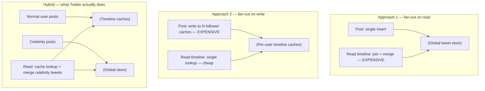
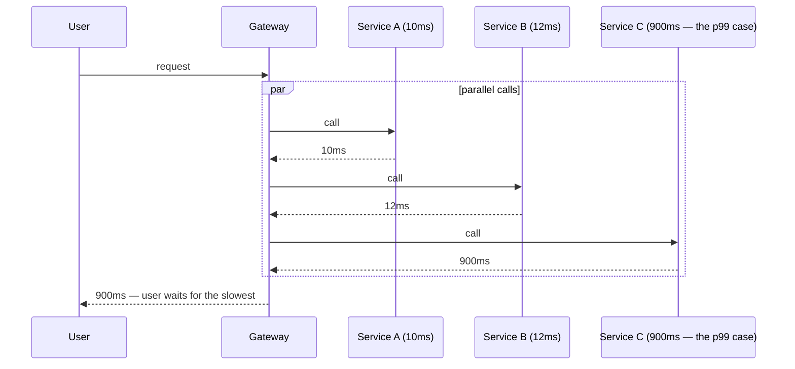

# 03 - Scalability, Load & Percentiles

**Prerequisites:** Topic 1 (Reliability)
**Difficulty:** Beginner (but the ideas are used constantly at every level)
**Interview importance:** ⭐ **Critical**
**Source:** Chapter 1 — "Scalability"

---

## 1. What Is It?

Scalability is **the system's ability to cope with increased load.**

The book is careful about the phrasing, and the care matters: scalability is *not* a one-dimensional label. "This system is scalable" is a meaningless sentence. The meaningful questions are:

> "If the system grows in a particular way, what are our options for coping with the growth?"
> "How can we add computing resources to handle the additional load?"

To ask either, you need to be able to say **what "load" means here** and **what "performance" means here**, in numbers.

---

## 2. Why Does It Exist?

Consider what happens without this vocabulary.

Your service handles 1,000 requests per second happily. Someone asks: "can we handle Diwali sale traffic?" You say "probably, we'll add servers." The sale arrives. The service falls over.

The post-mortem finds that the problem was never requests per second at all. It was that a small number of extremely popular products caused a hot database partition, and 40 servers all queued behind the same row lock. Adding servers made it *worse*, because more servers meant more concurrent lock contention.

The failure was in the question. "Can we handle more traffic?" didn't identify **which parameter** grows and **what breaks first**. Without that, capacity planning is guessing.

Hence the book's two-step: describe load with the right parameters, then describe performance with the right statistics.

---

## 3. Simple Explanation

**Step 1: Describe load with load parameters.**

A load parameter is a number that captures what's actually straining your system. The right choice depends entirely on the architecture. Candidates:

- Requests per second to a web server
- Ratio of reads to writes in a database
- Number of simultaneously active users in a chat room
- Cache hit rate
- Fan-out — how many downstream operations one incoming request generates

Sometimes the average is what matters. Sometimes your bottleneck is dominated by a handful of extreme cases, and the average tells you nothing.

**Step 2: Describe performance.**

Then ask two questions:

1. When you increase a load parameter and keep resources unchanged, how does performance change?
2. When you increase a load parameter, how much extra resource do you need to keep performance unchanged?

Question 2 is the one that matters for planning, because it's the one with a cost attached.

---

## 4. Real-World Analogy

**A restaurant on a Saturday night.**

"Can this restaurant handle more customers?" is unanswerable. The useful parameters are different, and each has a different bottleneck:

- More customers ordering *the same dish* → one station melts, the rest idle. (Hot partition.)
- More customers ordering *different dishes* → the kitchen as a whole saturates. (General capacity.)
- More large parties → tables become the constraint, not the kitchen. (Different resource entirely.)
- One customer orders a dish requiring 40 minutes of prep → everyone behind them waits. (Head-of-line blocking.)

And for measuring service: the *average* wait time is useless to the customer who waited 50 minutes. What they experienced is the tail. A restaurant with a 12-minute average and a 50-minute worst case will get worse reviews than one with a 15-minute average and a 20-minute worst case — even though the second is "slower."

That's percentiles, and it's why the restaurant analogy is worth keeping in mind.

---

## 5. Technical Explanation — the Twitter example

The book's worked example is Twitter, using data published in November 2012. Two main operations:

- **Post tweet:** ~4.6k requests/sec on average, over 12k requests/sec at peak.
- **Home timeline:** ~300k requests/sec.

The naive read is "12,000 writes per second — that's easy." And it is. The scaling challenge isn't tweet volume. It's **fan-out**: each user follows many people and is followed by many people.

Two implementations:

**Approach 1 — fan-out on read.** Posting just inserts into a global collection. Reading the timeline joins across follows and merges by time:

```sql
SELECT tweets.*, users.*
FROM tweets
  JOIN users   ON tweets.sender_id    = users.id
  JOIN follows ON follows.followee_id = users.id
WHERE follows.follower_id = current_user
```

**Approach 2 — fan-out on write.** Maintain a cache of each user's home timeline, like a mailbox. When someone posts, look up all their followers and insert the tweet into each follower's timeline cache. Reads become a simple lookup of a precomputed result.

Twitter started with approach 1 and switched to approach 2. Why? Because the read rate is almost **two orders of magnitude higher** than the write rate. When reads outnumber writes 65:1, you want to do more work at write time and less at read time.

**But approach 2 has a cost.** A tweet reaches about 75 followers on average, so 4.6k tweets/sec becomes **345k writes/sec** to timeline caches. And that average hides everything important: some users have over 30 million followers, so one tweet can mean **30 million writes**. Twitter targets delivering tweets to followers within five seconds, which makes that a serious problem.

So the load parameter that actually matters here is not "tweets per second." It's **the distribution of followers per user, weighted by how often those users tweet** — because that's what determines fan-out load.

**The resolution is hybrid.** Most users' tweets are fanned out on write. Celebrities are exempted; their tweets are fetched separately at read time and merged into the timeline. Best of both, at the cost of two code paths.

This example is worth memorizing. It appears in interviews constantly, and it demonstrates the whole method: find the real parameter, notice the distribution is skewed, handle the head of the distribution differently.



---

## 6. How Does It Work? — describing performance properly

### Throughput vs. response time

In a **batch** system, you care about throughput: records per second, or total job runtime.

In an **online** system, you care about **response time** — the time between the client sending a request and receiving a response.

**Latency and response time are not synonyms**, though they're used that way constantly. Response time is what the client sees: actual processing time (service time) *plus* network delays *plus* queueing delays. Latency is the duration a request spends waiting to be handled — latent, awaiting service.

### Response time is a distribution, not a number

Even identical requests take different times. Causes include: a context switch to a background process, a lost network packet and TCP retransmission, a garbage collection pause, a page fault forcing a disk read, even mechanical vibration in the server rack.

So report **percentiles**, not averages.

- **p50 (median)** — half of requests are faster. This is the "typical" experience.
- **p95, p99, p999** — the thresholds below which 95%, 99%, 99.9% of requests fall.

High percentiles are called **tail latencies**, and they matter more than their frequency suggests.

**Why the mean is bad:** it doesn't tell you how many users actually experienced that delay. One 30-second request among a thousand 10ms requests moves the mean by 30ms — invisible — while one user had a terrible time.

### Why the tail matters commercially

Amazon specifies internal service response times at **p99.9**, even though that's 1 in 1,000 requests. The reason is a genuinely interesting inversion: **customers with the slowest requests are often those with the most data — because they've made the most purchases.** Your slowest requests belong to your most valuable customers.

Amazon also observed that a **100 ms increase in response time reduces sales by 1%**, and others report a 1-second slowdown reducing a customer satisfaction metric by 16%.

But Amazon deliberately does *not* optimize p99.99. It was judged too expensive for the benefit — very high percentiles are dominated by random events outside your control, and the returns diminish sharply.

### Queueing delay and head-of-line blocking

Queueing delay often accounts for most of the response time at high percentiles.

A server processes only a few things in parallel — bounded by CPU cores. It takes only a small number of slow requests to hold up everything behind them. Subsequent requests may be fast to *process* but still slow to *return*, because they waited. This is **head-of-line blocking**.

Two consequences that bite people:

1. **Measure response times on the client side.** Server-side timing excludes the queueing that the client actually experienced.
2. **When load testing, keep sending requests independently of response time.** If your load generator waits for the previous response before sending the next, it artificially shortens the queues and your results are meaningless. This is a very common benchmarking error (sometimes called coordinated omission).

### Tail latency amplification

This one is critical for microservice architectures.

If one user request fans out to multiple backend calls, the user waits for the **slowest** one — even if the calls are parallel. So the probability of a slow user-facing request grows with the number of backend calls.

Concretely: if each backend has a 1% chance of being slow (p99), and a user request touches 100 backends, the chance that *at least one* is slow is roughly 1 − 0.99¹⁰⁰ ≈ **63%**. Your p99 backend produces a p37 user experience.



> 💡 **Additional Context (not from the book):** the common mitigations are hedged requests (send to two replicas, take the first response) and tied requests. Google's "The Tail at Scale" paper — which the book cites — is the standard reference.

### SLOs and SLAs

Percentiles are how service level objectives and agreements are written. An SLA might state that the service is up if median response time is under 200ms and p99 is under 1s, and must be up 99.9% of the time — with refunds if not.

### Computing percentiles in practice

Naively: keep all response times in the window, sort every minute. Often too expensive. Approximation algorithms exist — forward decay, t-digest, HdrHistogram.

**One rule worth burning in:** **averaging percentiles is mathematically meaningless.** You cannot take the p99 from each of ten servers and average them to get the fleet p99. The correct approach is to **add the histograms**. This error is extremely common in monitoring dashboards, and it silently understates your tail.

---

## 7. Approaches for Coping with Load

**Scaling up (vertical)** — a more powerful machine.
**Scaling out (horizontal)** — distribute across many machines, a *shared-nothing* architecture.

Good architectures usually mix both. Several fairly powerful machines can be simpler and cheaper than a large number of small virtual machines.

Two further distinctions:

- **Elastic** systems add resources automatically on detecting load increase. Useful when load is unpredictable, but they carry more operational surprise.
- **Manually scaled** systems are simpler and hold fewer operational surprises.

An important corrective from the book: **distributing stateless services across machines is fairly straightforward; taking stateful data systems from a single node to distributed can introduce a lot of additional complexity.** Until recently, common wisdom was to keep your database on one node until cost or availability requirements forced you to distribute. (Tooling has improved since, but the underlying advice — don't distribute state until you must — still holds.)

Finally, and this is the part people quote least and need most:

> **There is no such thing as a generic, one-size-fits-all scalable architecture.** An architecture that scales well for a particular application is built around assumptions about which operations will be common and which will be rare — the load parameters. If those assumptions are wrong, the engineering effort is at best wasted and at worst counterproductive.

---

## 8. When Should We Scale? When Should We Not?

**Scale when:** you have measurements showing a specific parameter approaching a specific limit; latency percentiles are degrading; you have a known growth trajectory.

**Don't scale when:**
- You haven't found the actual bottleneck. Adding servers to a database-bound system does nothing.
- The problem is a missing index, an N+1 query, or a bad algorithm. Fix the work before buying capacity.
- You're at an early stage and the load parameters aren't stable yet — you'll optimize for assumptions that turn out wrong.
- Vertical scaling is still cheap. A single large machine is dramatically simpler than a cluster.

---

## 9. Advantages & Disadvantages

**Vertical scaling — advantages:** no distribution complexity; transactions still work normally; simple to operate; often the fastest fix.
**Vertical scaling — disadvantages:** hard ceiling; cost grows non-linearly at the high end; single failure domain; requires downtime to resize.

**Horizontal scaling — advantages:** near-unlimited headroom; commodity hardware; fault tolerance comes along for free; elastic.
**Horizontal scaling — disadvantages:** distributed-systems complexity (all of Part II); cross-node transactions become hard or impossible; operational burden; harder to debug.

---

## 10. Trade-off Table

| Approach | Advantages | Disadvantages | When to Use |
|---|---|---|---|
| Scale up (vertical) | Simple; keeps single-node guarantees | Ceiling; cost curve; single failure domain | Default first move, especially for databases |
| Scale out, stateless tier | Easy; elastic; fault-tolerant | Requires state to live elsewhere | Almost always for app servers |
| Scale out, stateful (partition/replicate) | Handles data volume beyond one machine | Very large complexity increase | Only when a single node genuinely can't cope |
| Fan-out on read | Cheap writes; always fresh; no duplication | Expensive reads; gets worse as fan-out grows | Write-heavy, or very high fan-out (celebrities) |
| Fan-out on write | Cheap, precomputed reads | Expensive writes; storage duplication; skew is brutal | Read-heavy with bounded fan-out |
| Hybrid fan-out | Handles both the common case and the skewed tail | Two code paths; more complexity | When the distribution has a long tail — which is most real systems |
| Elastic auto-scaling | Handles unpredictable load | Operational surprises; lag behind spikes; cost spikes | Genuinely unpredictable load |

---

## 11. Failure Scenarios

| Scenario | What happens | Handling |
|---|---|---|
| Traffic spike beyond capacity | Queues grow, tail latency explodes, then timeouts cascade | Load shedding, rate limiting, autoscaling with headroom |
| Hot key / celebrity user | One partition saturates while others idle | Hybrid fan-out; key splitting; dedicated handling for the head of the distribution |
| Slow request blocks queue | Head-of-line blocking; fast requests appear slow | Separate queues per request class; timeouts; bounded concurrency |
| One slow backend among many | Tail latency amplification | Timeouts, hedged requests, degraded responses |
| Autoscaler reacts too late | Degradation during the scale-up window | Pre-scale for known events; keep headroom; scale on leading indicators |
| Cache cold after restart | Thundering herd onto the database | Warm-up; request coalescing; gradual traffic ramp |

---

## 12. Production Considerations

- **Instrument percentiles, never averages.** p50, p95, p99, p999 at minimum.
- **Aggregate by adding histograms**, never by averaging percentiles.
- **Measure client-side**, not just server-side.
- **Set SLOs in percentile terms**, and make them the thing you alert on.
- **Know your headroom.** "We're at 40% CPU" means nothing without knowing where the knee of the latency curve is. Latency degrades non-linearly — usually fine until suddenly it isn't.
- **Load test correctly** — open-loop generation, not closed-loop.
- **Cost per request** is the number that makes scaling conversations concrete for non-engineers.

---

## ❌ 13. Common Mistakes

- **Reporting the mean response time.** Hides exactly the users who are suffering.
- **Averaging percentiles across servers.** Mathematically invalid. Add histograms.
- **Closed-loop load testing** — the generator waits for each response, queues stay artificially short, results are optimistic.
- **Assuming linear scaling.** Doubling servers rarely doubles throughput; the bottleneck usually moves.
- **Scaling before profiling.** Most "we need more servers" problems are one missing index.
- **Ignoring the distribution.** The Twitter case is entirely about the average being 75 followers while the maximum is 30 million.
- **Treating scalability as a property rather than a set of assumptions.** An architecture is scalable *with respect to specific load parameters*. Change the parameters and it may not be.

---

## 🧠 14. Think Like an Engineer

```
What is the load parameter that actually matters here?
(not "requests/sec" by reflex — what strains THIS system?)
        ↓
What does its distribution look like? Is it skewed?
        ↓
Measure current performance in percentiles (p50/p95/p99)
        ↓
Where is the bottleneck? (CPU / IO / lock / network / a single hot key)
        ↓
Can I remove the work entirely? (better query, better algorithm, cache)
        ↓
If not: scale up first — it's simpler
        ↓
If that's exhausted: scale out — stateless tier first, state last
        ↓
Does the head of the distribution need a different code path?
        ↓
Re-measure. The bottleneck has moved.
```

The last line is the one experience teaches. Fixing a bottleneck doesn't end the exercise; it relocates it.

---

## 15. Mental Model

```
Define the load parameter
      ↓
Look at its distribution (the tail is where the pain is)
      ↓
Measure in percentiles, client-side
      ↓
Find the bottleneck
      ↓
Remove work → cache work → scale up → scale out
      ↓
Handle the skewed head separately
      ↓
Re-measure: the bottleneck has moved
```

---

## 🔗 16. How This Connects to Other Concepts

- **Reliability (Topic 1)** — a system past its load limit is unreliable. They're the same conversation.
- **Partitioning (Topic 14)** — hot spots and skew are the partitioning chapter's central problem, foreshadowed here by the celebrity case.
- **Replication (Topic 10)** — the standard way to scale reads, at the cost of staleness.
- **Storage engines (Topics 6–8)** — write amplification and read amplification are load parameters at the storage layer.
- **Unreliable Networks (Topic 20)** — network queueing is a major source of tail latency, and it's variable in ways you don't control.
- **Data Integration (Topic 34)** — the book explicitly returns to the Twitter fan-out example in Chapter 12, reframing timeline caches as a materialized view maintained by a stream processor. Worth reading those two passages together.

---

## 17. Interview Questions & Answers

**Beginner**

**Q: What's the difference between latency and response time?**
Response time is what the client experiences: service time plus network delay plus queueing delay. Latency is specifically the time a request spends waiting to be served. They get used interchangeably, but the distinction matters because queueing dominates the tail — so the client's response time can be much worse than the server's processing time, and if you only measure server-side you'll never see it.

**Q: Why use percentiles instead of averages?**
Because the average hides the users who are suffering. One thirty-second request among a thousand fast ones barely moves the mean, but that user had a terrible experience. Percentiles tell you what fraction of users experienced what. And in practice the tail is disproportionately your most valuable users — Amazon's observation was that the slowest requests tend to belong to accounts with the most data, which are the customers who've bought the most.

**Intermediate**

**Q: Walk me through Twitter's timeline problem.**
Twitter has about 4.6k tweets per second but 300k timeline reads per second. The naive design does the work at read time — join follows and tweets and merge — but that's expensive and reads dominate 65:1. So they moved to fan-out on write: when you post, the tweet is pushed into a precomputed timeline cache for each of your followers, making reads a cheap lookup. The cost is that the average tweet reaches 75 followers, so writes go from 4.6k/sec to about 345k/sec. And the average is misleading — some accounts have 30 million followers, so a single tweet becomes 30 million writes, which is very hard to deliver within their five-second target. The resolution is hybrid: fan out on write for ordinary users, and for celebrities skip the fan-out and merge their tweets in at read time. The general lesson is that the load parameter wasn't tweets per second at all — it was the distribution of follower counts.

**Q: What's tail latency amplification?**
When one user request fans out to many backend calls, the user waits for the slowest one, even if the calls are parallel. So if each backend is slow 1% of the time and you make 100 calls, roughly 63% of user requests hit at least one slow backend. Your p99 backend becomes a much worse user-facing experience. It's a strong argument against very chatty microservice designs, and the mitigations are tight timeouts, hedged requests to replicas, and reducing fan-out.

**Q: A dashboard shows p99 latency averaged across 20 servers. What's wrong?**
Averaging percentiles is mathematically meaningless — there's no way to combine them into a fleet-wide percentile. The correct approach is to export histograms from each server and add them, then compute the percentile from the merged histogram. The practical consequence is that the averaged number systematically understates your tail, so you think you're fine when you aren't.

**Advanced / Staff**

**Q: Design the capacity plan for a flash sale expecting 10× normal traffic.**
First I'd want to know which parameter actually goes up 10×. In a flash sale it's usually not uniform — it's concentrated reads on a handful of product pages plus a spike in checkout writes, which are two completely different bottlenecks. The read side is mostly cacheable, so I'd pre-warm caches and serve product pages from a CDN or edge cache with a short TTL, which flattens most of the volume. The write side is the hard part, because inventory decrement on a hot SKU is a single-row contention problem — adding servers makes it worse, not better. I'd handle that with either a queue in front of checkout to serialize per-SKU, or by sharding the inventory counter into N sub-counters. Then I'd load test open-loop at 10×, find where the latency knee actually is, pre-scale rather than relying on the autoscaler to react, and define load-shedding behaviour in advance so that under overload we degrade deliberately — a queue page rather than timeouts. And I'd agree the degraded experience with the business beforehand, because that's a product decision.

**Q: When would you deliberately choose fan-out on read despite heavy read traffic?**
When fan-out is extreme or unbounded. Fan-out on write is a bet that write cost times fan-out is cheaper than read cost times read rate. For a celebrity with 30 million followers, that bet loses badly — you'd do 30 million writes to serve a fraction of them. I'd also choose read-time computation when the data changes very frequently relative to how often it's read, since precomputing something that's invalidated before anyone reads it is pure waste. And when storage cost of duplication is prohibitive. In practice the answer is nearly always hybrid, which is worth saying explicitly in an interview because it shows you're thinking about the distribution rather than picking one design.

**Q: How would you find the bottleneck in a system you've never seen?**
Start from the user-visible symptom and percentiles, not from resource graphs — I want to know whether it's all requests degrading or a subset, because those have different causes. Then trace a slow request end to end to find which hop consumes the time; distributed tracing makes this quick, and if it doesn't exist that's the first thing to fix. Then check whether the slow hop is CPU-bound, IO-bound, or waiting on a lock, because the remedies are completely different. A common finding is that the resource graphs all look healthy and the problem is contention or queueing, which averages hide entirely. I'd also check whether the slowness correlates with a particular key or tenant, since skew is a very common cause and it looks like a general capacity problem until you segment the data.

---

## 🎯 30-Second Interview Answer

> "Scalability isn't a property, it's a question: if load grows in a specific way, what are our options? So first you name the load parameter that actually strains your system — which is often not requests per second. Twitter's was the distribution of follower counts, not tweet volume. Then you measure performance in percentiles rather than averages, because averages hide the users who are suffering, and the tail tends to be your heaviest users. The trap in microservices is tail latency amplification: if a request fans out to a hundred backends, a 1% slow rate per backend means roughly 63% of user requests hit something slow. And there's no generic scalable architecture — it's always built around assumptions about which operations are common, so if those assumptions are wrong the effort is wasted."

---

## ⚡ Quick Revision

- **Load parameter** — the number that captures the strain. Choose it deliberately.
- **Twitter:** 4.6k writes/sec vs 300k reads/sec → fan-out on write → 345k writes/sec average, 30M for celebrities → **hybrid**.
- **Response time ≠ latency.** Response time = service + network + queueing.
- **Percentiles, not averages.** p50/p95/p99/p999. Tail = your most valuable users.
- **Amazon: p99.9 targeted, p99.99 deliberately not** — diminishing returns.
- **Never average percentiles. Add histograms.**
- **Head-of-line blocking** — a few slow requests make fast ones look slow. Measure client-side.
- **Tail latency amplification** — 100 calls × 1% slow ≈ 63% of user requests slow.
- **Load test open-loop**, or your queues are fake.
- **Scale up before out**; distribute stateless before stateful.
- **No generic scalable architecture** — it's always assumption-specific.
