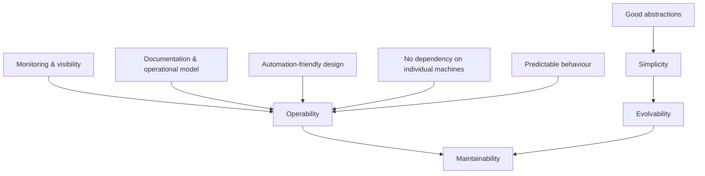

# 04 - Maintainability, Simplicity & Evolvability

**Prerequisites:** Topics 1, 2
**Difficulty:** Beginner
**Interview importance:** Medium (but disproportionately important in staff-level behavioural and design rounds)
**Source:** Chapter 1 — "Maintainability"

---

## 1. What Is It?

Maintainability is designing so that the people who work on the system later — including operators, and including you in eighteen months — can do so without misery.

The book breaks it into three parts:

- **Operability** — make it easy for operations teams to keep the system running smoothly.
- **Simplicity** — make it easy for new engineers to understand, by removing as much complexity as possible.
- **Evolvability** — make it easy to make changes in the future, for unanticipated use cases. Also called extensibility, modifiability, or plasticity.

---

## 2. Why Does It Exist?

The majority of the cost of software is not in its initial development. It's in ongoing maintenance: fixing bugs, keeping systems operational, investigating failures, adapting to new platforms, modifying for new use cases, repaying technical debt, adding features.

Yet most engineers dislike maintaining legacy systems — someone else's mistakes, outdated platforms, being forced to do things the system wasn't built for. Every legacy system is unpleasant in its own way.

So the argument is: since we spend most of our money and most of our careers on maintenance, we should design so that we don't create our own legacy problem. This is a discipline of empathy for future engineers, and the book states it that way explicitly.

---

## 3. Simple Explanation

Three questions, one for each property:

- **Operability:** can someone on-call understand what's happening at 3 a.m. without waking you up?
- **Simplicity:** can a new hire understand this module in a day?
- **Evolvability:** when a requirement changes, does the change touch one place or forty?

If any answer is no, you have maintainability debt, and it will be paid with interest.

---

## 4. Real-World Analogy

**A building.**

- **Operability** — are the electrical panels labelled? Is there an access hatch to the plumbing, or do you break a wall to fix a leak?
- **Simplicity** — is the layout comprehensible, or was it extended six times by different owners so that the only route to the kitchen goes through a bedroom?
- **Evolvability** — can you add a floor, or would that require rebuilding the foundation?

A beautiful building that requires demolishing a wall to change a fuse is a bad building. Engineers systematically undervalue the equivalent property in software, because the beauty is visible and the maintenance cost is deferred.

---

## 5. Technical Explanation

### Operability: making life easy for operations

Good operations can work around bad software; good software cannot survive bad operations. Operations teams typically handle monitoring and restoring service, tracing causes of problems, keeping software and platforms up to date, watching how systems affect each other, anticipating future problems (like capacity), establishing deployment and config practices, performing complex migrations, maintaining security, defining processes, and preserving organizational knowledge about the system.

Data systems can make routine tasks easy by:

- Providing visibility into runtime behaviour and internals, with good monitoring.
- Supporting automation and integration with standard tools.
- Avoiding dependency on individual machines — allowing machines to be taken down for maintenance while the system as a whole continues.
- Providing good documentation and an easy-to-understand operational model ("if I do X, Y will happen").
- Providing good default behaviour, while giving administrators freedom to override.
- Self-healing where appropriate, while giving administrators manual control.
- Exhibiting predictable behaviour, minimizing surprises.

That last point is easy to skim past and is arguably the most important. **Predictability beats cleverness.** A system that's slightly slower but always behaves the same way is easier to run than one that's fast except in circumstances nobody can characterize.

### Simplicity: managing complexity

Small projects can have simple, expressive code. As projects grow, they often become very complex and difficult to understand — the "big ball of mud."

Symptoms of accidental complexity: explosion of state space, tight coupling of modules, tangled dependencies, inconsistent naming and terminology, hacks aimed at solving performance problems, special-casing to work around issues.

Complexity slows everyone working on the system, increasing the cost of maintenance. Budgets and schedules are often overrun. There's a greater risk of introducing bugs when making a change: hidden assumptions, unintended consequences, and unexpected interactions are more easily overlooked.

The key distinction:

> **Essential complexity** is inherent in the problem. **Accidental complexity** arises only from the implementation.

You cannot remove essential complexity — a payment system that must handle 40 currencies and 6 regulatory regimes is genuinely complicated. You can and should remove accidental complexity.

The best tool for removing accidental complexity is **abstraction**. A good abstraction hides implementation detail behind a clean facade and can be reused. High-level programming languages are abstractions that hide machine code and CPU registers; SQL is an abstraction that hides on-disk and in-memory data structures and concurrent requests.

Note that simplicity is not the same as *reducing functionality*. It means removing complexity that isn't inherent to the problem.

### Evolvability: making change easy

Requirements change constantly. You learn new facts, use cases emerge, business priorities shift, users request features, platforms get replaced, legal requirements arrive, growth forces architectural changes.

Agile working patterns provide a framework for adapting to change, and the community has developed tools and processes — TDD and refactoring — that help. Most of that discussion focuses on a fairly small, local scale: a couple of source files in one application.

The book's interest is in agility at the level of a **larger data system**, possibly consisting of several applications or services with different characteristics. Its concrete example: how would you "refactor" Twitter's architecture for assembling home timelines from approach 1 (fan-out on read) to approach 2 (fan-out on write)?

The key insight is that **the ease of modifying a data system is closely linked to its simplicity and its abstractions.** Simple, easy-to-understand systems are usually easier to modify than complex ones. Evolvability isn't a separate property you bolt on; it's what you get from the other two.

---

## 6. How Does It Work? — where maintainability comes from



The dependency worth noting: **evolvability is downstream of simplicity.** You cannot make a system easy to change by wishing for it. You make it easy to change by making it easy to understand.

---

## 7. Concrete Example

**A billing system that must support a new pricing model.**

*Poorly maintained version:* pricing logic is scattered across the invoice generator, the API layer, three scheduled jobs, and several stored procedures. Nobody knows all the places. Adding usage-based pricing means finding all of them, and the team discovers the fifth one in production, in the form of a customer being double-charged.

*Well-maintained version:* pricing is one module with a defined interface — given a customer, a period, and usage events, return line items. Adding a pricing model means adding an implementation behind that interface. The blast radius is one file, and the test suite covers it.

The difference is not effort or intelligence. It's whether someone drew a boundary early. Boundaries drawn later cost 10× more, because by then there are dependencies across them.

---

## 8. When to Invest / When Not To

**Invest when:** the system will live for years; multiple people will work on it; requirements are known to be unstable; the domain is genuinely complex; on-call cost is real.

**Invest less when:** it's a genuine prototype with a scheduled death date; a one-off migration script; an experiment where the main risk is that nobody wants the product.

The failure mode is misclassification. Prototypes become production systems constantly. The honest question is not "is this a prototype?" but "what happens if this is still running in three years?" — because it probably will be.

---

## 9. Advantages & Disadvantages of Investing in Maintainability

**Advantages**
- Lower total cost of ownership — most cost is maintenance.
- Faster feature delivery over time; the velocity curve doesn't collapse.
- Lower on-call burden and less burnout.
- Onboarding is faster.
- Fewer bugs, because fewer hidden assumptions.

**Disadvantages**
- Slower initially. Abstractions take time to design.
- **Wrong abstractions are worse than none** — they add indirection while leaking the thing they were supposed to hide.
- Over-abstraction is itself accidental complexity. Six layers of interface for one implementation is not simplicity.
- Hard to justify to stakeholders, because the benefit is a cost that doesn't happen.

---

## 10. Trade-off Table

| Approach | Advantages | Disadvantages | When to Use |
|---|---|---|---|
| Ship fast, refactor later | Fastest to first value; learns from real usage | "Later" often never arrives; complexity compounds | Genuine experiments with a kill date |
| Design abstractions up front | Clean boundaries; cheap to change | Risk of abstracting the wrong thing before you understand the domain | Well-understood domains |
| Extract abstractions after the third repetition | Grounded in real usage; low risk of wrong abstraction | Requires discipline to actually do it | Default for most work |
| Heavy automation & self-healing | Low operational toil | Complex; can mask problems; harder to debug | Large fleets |
| Manual with excellent runbooks | Simple; transparent | Doesn't scale with fleet size; human error | Small fleets, critical operations |

The third row is the pragmatic default and worth stating in interviews: extract the abstraction when you've seen the pattern three times, not the first time.

---

## 11. Failure Scenarios

| Scenario | Consequence | Mitigation |
|---|---|---|
| Only one person understands a subsystem | Bus factor 1; that person can't take leave | Documentation, pairing, rotation of ownership |
| No runbook for a rare failure | On-call improvises under pressure at 3 a.m. | Write the runbook when you fix it, not later |
| Config change with no rollback path | Extended outage | Version-controlled config; one-command rollback |
| Leaky abstraction | Engineers must understand both layers; worse than one | Fix or remove the abstraction |
| Silent behaviour change on upgrade | Subtle data corruption | Predictable behaviour; changelogs; canary |
| Undocumented tribal knowledge leaves | Institutional memory loss | Preserving organizational knowledge is an explicit ops responsibility |

---

## 12. Production Considerations

- **Observability is a feature**, not overhead. Budget for it in estimates.
- **Runbooks live next to the code**, and are updated in the same PR that changes behaviour.
- **No machine should be irreplaceable.** If a node can't be taken down for maintenance, you have an operability defect.
- **Good defaults, overridable.** Most operators should never need to tune; experts should be able to.
- **Predictability over peak performance** for anything on-call has to reason about.
- **Track onboarding time** as a metric. If it's getting longer, complexity is winning.

---

## ❌ 13. Common Mistakes

- **Treating maintainability as separate from "real" engineering.** It's where most of the money goes.
- **Confusing simple with easy.** Easy means familiar. Simple means fewer interleaved concerns. They're different, and a lot of "easy" tooling is deeply un-simple.
- **Abstracting too early.** You need three examples before you can see the shape of the abstraction.
- **Leaky abstractions left in place.** Worse than no abstraction, because now there are two things to understand.
- **Clever code in the hot path of on-call.** Cleverness costs at 3 a.m.
- **Assuming the prototype won't survive.** It will.
- **Documentation written once and never updated.** Wrong documentation is more dangerous than none.

---

## 🧠 14. Think Like an Engineer

```
Who will operate this, and what will they need to see?
        ↓
What is essential complexity vs accidental complexity here?
        ↓
Can I remove accidental complexity with an abstraction?
        ↓
Have I seen this pattern enough times to know the right abstraction?
        ↓
If the requirement changes in the obvious direction, how many files change?
        ↓
Can any single machine be taken down without ceremony?
        ↓
What would a new hire find confusing? (ask one)
```

---

## 15. Mental Model

```
Most cost is maintenance
      ↓
Remove accidental complexity (abstraction)
      ↓
Simplicity produces evolvability
      ↓
Visibility + predictability produce operability
      ↓
Both together = a system people can live with
```

---

## 🔗 16. How This Connects to Other Concepts

- **Reliability (Topic 1)** — human/operator error is the leading cause of outages, so operability *is* reliability work.
- **Scalability (Topic 2)** — the Twitter refactor from approach 1 to approach 2 is the book's own example of large-scale evolvability.
- **Encoding & Evolution (Topic 9)** — the concrete mechanics of evolvability at the data layer: schema changes and rolling upgrades.
- **Data Integration (Topic 34)** — Chapter 12's argument for derived data is fundamentally a maintainability argument: if you can rederive everything from an event log, you can change your mind about schemas and indexes cheaply.

---

## 17. Interview Questions & Answers

**Beginner**

**Q: What are the three aspects of maintainability?**
Operability — making it easy for operations to keep the system running. Simplicity — making it easy for new engineers to understand by removing complexity. Evolvability — making it easy to change for use cases you didn't anticipate. They're not independent: evolvability mostly falls out of simplicity, and operability comes from visibility and predictability.

**Q: What's the difference between essential and accidental complexity?**
Essential complexity is inherent to the problem — a tax system that genuinely has to handle 40 jurisdictions is complicated no matter how well you write it. Accidental complexity comes only from the implementation: tangled dependencies, inconsistent naming, hacks bolted on for performance, special cases. You can only remove the second kind, and the main tool for removing it is a good abstraction.

**Intermediate**

**Q: When would you deliberately not invest in maintainability?**
For a genuine experiment with a scheduled end date, where the dominant risk is that nobody wants the thing. Spending two weeks on abstractions for code that gets deleted in a month is waste. But I'd be honest about how often that classification is wrong — prototypes become production systems routinely — so the question I'd actually ask is what happens if this is still running in three years, and if the answer is "we'd be in trouble," I'd treat it as production from the start.

**Q: What makes an abstraction bad?**
Leaking is the main one: if you have to understand both the abstraction and the thing underneath it, you've added work rather than removed it. Being premature is the other — abstractions built from one example usually encode the accidents of that example, and then everything else has to be bent to fit. My rule of thumb is to wait until I've seen the pattern three times, because at that point the shape is visible and the abstraction is likely to be the right one.

**Advanced / Staff**

**Q: You've inherited a system with a bus factor of one and no documentation. What's your plan?**
First I'd stop the bleeding: the person who holds the knowledge should be writing runbooks for the failure modes they know about, and pairing on incidents rather than resolving them alone, because that transfers knowledge as a side effect of work that's happening anyway. Then I'd invest in observability before refactoring — you can't safely change a system you can't see, and good instrumentation also externalizes some of the tribal knowledge into dashboards. Then I'd refactor along the boundaries the incidents reveal, since those are the places where the coupling is actually hurting. What I wouldn't do is a big rewrite, because the tribal knowledge includes all the undocumented edge cases the system handles, and a rewrite discards exactly that.

**Q: How do you justify maintainability work to stakeholders?**
By converting it into numbers they already care about. Time-to-onboard, mean time to recovery, and the fraction of engineering time going to unplanned work are all measurable and all improve with maintainability. I'd frame it as velocity rather than quality — the argument that lands is "features currently take six weeks and used to take two, and here's the specific coupling causing that." It also helps to attach the work to a feature they want, so it's not a separate line item competing with delivery.

---

## 🎯 30-Second Interview Answer

> "Maintainability is three things: operability, simplicity, and evolvability. It matters because most of the cost of software is maintenance, not initial development. The core distinction is essential versus accidental complexity — you can't remove complexity inherent in the problem, but you can remove complexity you created, and the main tool for that is a good abstraction. Evolvability isn't a separate thing you add; it mostly falls out of simplicity, because systems that are easy to understand are easy to change. And operability is largely about visibility and predictability — a system that's slightly slower but always behaves the same way is much easier to run than one that's fast except under conditions nobody can characterize."

---

## ⚡ Quick Revision

- Three parts: **operability, simplicity, evolvability**.
- **Most software cost is maintenance**, not initial build.
- **Essential vs accidental complexity.** Only the second is removable.
- **Abstraction** is the main tool against accidental complexity. But wrong abstractions are worse than none.
- **Simplicity → evolvability.** Not independent properties.
- **Predictability beats cleverness** for anything on-call touches.
- Good ops can save bad software; good software can't survive bad ops.
- No system should depend on an individual machine staying up.
- The book's own evolvability example: refactoring Twitter's timeline from fan-out-on-read to fan-out-on-write.
