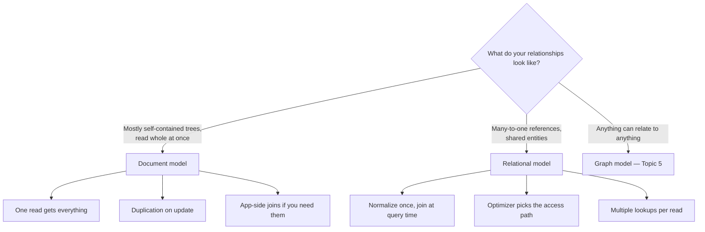

# 05 - Relational vs Document Data Models

**Prerequisites:** none
**Difficulty:** Beginner
**Interview importance:** High
**Source:** Chapter 2 — "Relational Model Versus Document Model"

---

## 1. What Is It?

A **data model** is how you describe your data's shape and the relationships within it. It's the most important choice you make about a system, because it shapes not just the database but how you *think* about the problem.

- **Relational model:** data as tables of rows; relationships expressed as foreign keys; joins performed at query time.
- **Document model:** data as self-contained nested documents (typically JSON); relationships expressed either by nesting or by document references resolved by the application.

---

## 2. Why Does It Exist?

The relational model was proposed by Edgar Codd in 1970 to solve a specific problem: the models that came before it — the hierarchical model (IMS) and the network model (CODASYL) — handled **many-to-many relationships** badly.

The hierarchical model stored everything as one big tree. Trees are great for one-to-many. They're hopeless when the same entity needs to appear in several places, because you either duplicate it or you start manually maintaining pointers.

The network model fixed that by allowing multiple parents — but at a terrible cost. To access a record you had to follow an **access path** from a root, and the application code had to keep track of where it was in the database, in effect navigating an n-dimensional data space manually. Changing your query pattern meant rewriting navigation code.

The relational model's radical move was: **just lay out all the data in relations, and let a query optimizer figure out the access path.** You declare what you want; the optimizer decides how. If you want to query in a new way, you declare an index and the optimizer uses it — no application changes.

Then, around 2010, NoSQL arrived. The drivers were: a need for greater scalability than relational databases could easily achieve (very large datasets, very high write throughput), widespread preference for free and open source software, specialized query operations not well supported by the relational model, and frustration with the restrictiveness of relational schemas.

---

## 3. Simple Explanation

The core tension is **locality vs. duplication**.

If your data is a self-contained tree — a résumé, an invoice, a blog post with comments — a document is a natural fit. One read gets everything. No joins.

If entities are referenced from many places — a company that many people work at, a city many people live in — a document forces a choice: duplicate the company name into every profile (and update thousands of documents when it changes), or store an ID and do a join in application code.

The relational model handles the second case natively. That's what it was invented for.

---

## 4. Real-World Analogy

**A paper filing cabinet vs. a card index.**

A document database is a filing cabinet of folders. Each folder holds everything about one customer — contract, correspondence, invoices. Pulling one customer's file gives you their whole story in one motion. But if the company changes its address, you must open every folder that mentions it.

A relational database is a card index with cross-references. The company address lives on exactly one card; every other card points to it. Change it once and everything is correct. The cost is that answering a question requires pulling several cards and combining them.

Neither is right. If you almost always want the whole folder, the cabinet wins. If facts are shared and change independently, the index wins.

---

## 5. Technical Explanation

### The object-relational mismatch

Application code uses objects; relational databases use tables. The translation layer between them is awkward enough to have a name: **impedance mismatch**. ORMs reduce the boilerplate but don't eliminate the conceptual gap.

For a self-contained document like a LinkedIn-style profile — with positions, education, contact info — the JSON representation has **better locality**: a relational version needs multiple queries or multiple joins, while the document is fetched in one read. The JSON also makes the tree structure explicit rather than hidden behind foreign keys.

### The relationship spectrum — this is the decision

| Relationship type | Example | Document model | Relational model |
|---|---|---|---|
| **One-to-many** | User → their positions | Excellent — just nest it | Fine — separate table + join |
| **Many-to-one** | Many people → one city | Awkward — duplicate or app-side join | Excellent — foreign key |
| **Many-to-many** | People ↔ organizations | Poor — app-side joins get ugly fast | Excellent — join table |

Notice **many-to-one is where documents start to hurt**, and that's more common than people expect. Consider why you'd store `region_id` rather than the string "Greater Seattle Area": consistent styling across profiles, avoiding ambiguity, ease of updating (the name lives in one place), localization support, and better search. This is normalization, and normalizing requires many-to-one relationships, which don't fit the document model well.

The book's memorable framing: as you add features, data tends to become *more* interconnected over time. A résumé starts as a self-contained tree, then organizations become entities with their own pages, then recommendations reference the recommender's profile. The tree acquires cross-links, and now you have a graph.

### Schema-on-read vs. schema-on-write

Document databases are often called "schemaless," which is misleading. There is always an implicit schema — the application code assumes the data has a certain structure. The real distinction is:

- **Schema-on-write** (relational): the schema is explicit and the database enforces it on write.
- **Schema-on-read** (document): structure is implicit and interpreted when read.

The book's analogy is dynamic vs. static type checking. Neither is universally better.

Schema-on-read is advantageous when items don't all have the same structure — either because there are many different types of object, or because the structure is determined by external systems you don't control.

The practical difference appears when changing the format. In a document database you just start writing new documents with new fields, and application code handles old ones (`if old_format then split name`). In a relational database you run `ALTER TABLE` and `UPDATE`. It's worth being accurate about the cost here: `ALTER TABLE` is usually fast in most databases (MySQL is a notable exception — it often copies the whole table), and a large `UPDATE` is slow in any database, which is why tools exist to do it online.

### Data locality

A document is typically stored as one contiguous string (JSON, BSON, XML). If your application needs the *whole* document, this locality is a real performance win — a relational split across tables requires multiple index lookups, more disk seeks, more time.

But the advantage only applies **if you need most of the document**. The database typically loads the entire document even if you access a small part, which is wasteful on large documents. And updates usually rewrite the entire document — only modifications that don't change the encoded size can be done in place. **The general recommendation is to keep documents fairly small and avoid writes that grow them.**

> 💡 **Additional Context (not from the book):** the same locality idea appears elsewhere — Google's Spanner allows table interleaving, Oracle has multi-table index cluster tables, and Bigtable's column-family concept groups related columns. So "locality" is a storage strategy, not a document-database exclusive.

### Convergence

Most relational databases (PostgreSQL since 9.3, MySQL 5.7, IBM DB2 10.5) now support JSON columns with indexing and querying. Most document databases (RethinkDB, MongoDB) support relational-like joins, though MongoDB's are performed client-side with multiple requests. A hybrid model is the likely future for both.

---

## 6. How Does It Work?



---

## 7. Concrete Example

**An e-commerce order.**

*Document approach:* an order document with line items nested inside — product ID, name, price at time of purchase, quantity.

This is actually the **right** call, and the reason is subtle and worth knowing: the line item's price and product name are **historical facts**, not references. You want the price *as it was when the order was placed*, not the current price. Denormalization here isn't a shortcut, it's semantically correct. An order is a genuinely self-contained document.

*Relational approach for the same catalogue:* the product catalogue itself should be relational. Products belong to categories, have suppliers, appear in many orders. Change a product description and you want it changed once.

So a real system uses both, and the boundary is drawn along a meaningful line: **immutable historical records lean document; mutable current-state entities lean relational.** That framing is worth carrying into interviews because it explains *why* rather than reciting preferences.

---

## 8. When to Use / Not Use

**Document model — use when:** data is self-contained trees; you read whole documents at a time; the structure varies between records or is set by external systems; relationships between documents are rare; you're recording immutable historical events.

**Document model — avoid when:** you have many-to-many relationships; you need joins the database performs efficiently; multiple documents must be updated atomically; data is highly interconnected; you need strong cross-entity constraints.

**Relational — use when:** relationships are many-to-one or many-to-many; you need joins; you want the database to enforce constraints and referential integrity; query patterns will evolve unpredictably (the optimizer adapts; you just add indexes).

**Relational — avoid when:** the impedance mismatch dominates and the data really is a tree; each record's structure genuinely differs; write throughput exceeds what one node can handle and the data partitions cleanly by document.

---

## 9. Advantages & Disadvantages

**Document — advantages:** schema flexibility; better locality for whole-document reads; closer to application object structures; usually simpler to shard because documents are natural partition units.
**Document — disadvantages:** poor many-to-one/many-to-many support; app-side joins; whole-document read/write overhead; no enforced schema means bad data can land silently; cross-document atomicity is limited.

**Relational — advantages:** joins the database optimizes; constraints and referential integrity; mature optimizers and tooling; declarative queries adapt as data grows; new query patterns need only new indexes.
**Relational — disadvantages:** impedance mismatch; schema changes need migrations; deeply nested structures are awkward to represent; scaling writes across nodes is harder.

---

## 10. Trade-off Table

| Model | Advantages | Disadvantages | Best Use Case |
|---|---|---|---|
| Relational | Joins, constraints, optimizer, flexible querying | Migrations, impedance mismatch, harder write scaling | Interconnected data, evolving query patterns, financial/transactional |
| Document | Locality, flexible structure, natural for trees | Weak on many-to-many, app-side joins, silent bad data | Self-contained documents, event/history records, varying structure |
| Graph | Natural for arbitrary relationships, traversal queries | Niche tooling, unfamiliar query languages | Social graphs, recommendations, fraud detection |
| Hybrid (JSON in relational) | Both, in one system | Query semantics can be surprising; indexing subtleties | Mostly-relational data with some flexible attributes — very common in practice |

That last row is where most real systems land, and saying so in an interview reads as experience rather than fence-sitting.

---

## 11. Failure Scenarios

| Scenario | Consequence | Mitigation |
|---|---|---|
| Document grows unbounded (comments nested in a post) | Every read loads megabytes; updates rewrite everything | Keep documents small; move growing collections to separate documents |
| Denormalized value changes (company renames) | Thousands of documents need updating; some get missed | Use references for mutable shared data; async background update jobs |
| Schema drift with no enforcement | Application crashes on unexpected shapes | Validate at write time in the app; schema registry; defensive reads |
| App-side join across many documents | N+1 request pattern; latency explodes | Restructure the model, or move to relational |
| Relational schema migration on a huge table | Long lock, downtime | Online schema change tools (gh-ost, pt-online-schema-change); backfill in batches |
| Data becomes interconnected over time | Document model fights you on every feature | Recognize it early; migrate the connected parts to relational or graph |

---

## 12. Production Considerations

- **Document size limits** are real (MongoDB caps at 16MB). Design for growth, not just for today.
- **Validate on write even without an enforced schema.** Schema-on-read means the *application* is the schema; make that explicit and centralized.
- **Migrations:** document DBs let you avoid the migration by handling both shapes in code — but that code accumulates. Have a plan to backfill and delete the compatibility branch.
- **Index whatever you filter on**, in both models. Document databases don't exempt you from indexing.
- **Watch for the N+1 application-side join.** It's the most common document-model performance bug.

---

## ❌ 13. Common Mistakes

- **"NoSQL scales, SQL doesn't."** Wrong on both sides. Postgres scales a very long way vertically, and document databases have their own scaling limits. The original NoSQL drivers were scalability, open source, specialized queries, and schema flexibility — not a blanket performance win.
- **"Schemaless means no schema."** There's always a schema. It's just in your application code, uncentralized and unenforced.
- **Choosing by team preference rather than relationship shape.** The relationship structure is the actual input to this decision.
- **Nesting unbounded collections.** Comments inside a post is the canonical mistake.
- **Denormalizing mutable data.** Denormalize historical facts (order line prices). Don't denormalize things that change (user's current email).
- **Assuming documents avoid joins.** They move joins into your application, where they're slower and hand-written.

---

## 🧠 14. Think Like an Engineer

```
What are the entities, and how do they relate?
        ↓
Classify: one-to-many / many-to-one / many-to-many
        ↓
Many-to-many present? → relational (or graph)
        ↓
Mostly self-contained trees read whole? → document
        ↓
Is this data immutable history, or mutable current state?
   (history → denormalize freely; state → normalize)
        ↓
Will documents grow without bound? → they will; plan for it
        ↓
How stable are the query patterns?
   (unstable → relational, because the optimizer adapts)
```

---

## 15. Mental Model

```
Relationships determine the model
      ↓
Trees → documents (locality wins)
      ↓
Graphs of shared entities → relational (normalization wins)
      ↓
Everything connected to everything → graph model
      ↓
Data gets MORE connected over time — plan for that direction
```

---

## 🔗 16. How This Connects to Other Concepts

- **Graph Models (Topic 5)** — the third point of the triangle, for when everything relates to everything.
- **Storage Engines (Topics 6–8)** — the data model determines query shape; query shape determines which storage engine makes sense.
- **Encoding & Evolution (Topic 9)** — schema-on-read vs schema-on-write is the same debate at the wire-format level.
- **Partitioning (Topic 14)** — documents are natural partition units, which is why document stores often shard more easily.
- **Transactions (Topic 17)** — single-document atomicity is usually free; cross-document atomicity is where you need real transactions.

---

## 17. Interview Questions & Answers

**Beginner**

**Q: When would you choose a document database?**
When the data is self-contained trees that I read as a whole — an order with its line items, a user profile with its sections. I get locality, so one read fetches everything, and I get flexibility if the structure varies between records. The signal against it is many-to-many relationships, because then I'm writing joins in application code, which is slower and more error-prone than letting the database do it.

**Q: Is a document database schemaless?**
Not really. The schema exists — it's just implicit in the application code rather than enforced by the database. The accurate framing is schema-on-read versus schema-on-write. It's the same trade-off as dynamic versus static typing: more flexibility when records genuinely differ in structure, less safety because bad data lands silently and you find out at read time.

**Intermediate**

**Q: Why was the relational model invented?**
To solve many-to-many relationships. The hierarchical model stored everything as one tree, which forced duplication whenever an entity belonged in multiple places. The network model allowed multiple parents but required the application to navigate access paths manually — you effectively tracked your position in the database by hand, and changing your query pattern meant rewriting navigation code. Codd's insight was to lay data out in relations and let a query optimizer choose the access path, so new query patterns just need a new index rather than new application code.

**Q: What's the trade-off with data locality in documents?**
Locality helps when you need most of the document — one contiguous read instead of several index lookups and seeks. It hurts when you don't, because the database typically loads the whole document regardless, and updates usually rewrite the whole thing since only same-size modifications can be done in place. So the practical rule is keep documents small and avoid writes that grow them. It's also worth knowing this isn't document-specific — Spanner's interleaved tables and Bigtable's column families are the same idea in other systems.

**Advanced / Staff**

**Q: You have a document-based system where data has become highly interconnected. What now?**
First I'd confirm it with evidence rather than intuition — application-side joins showing up as N+1 patterns in traces, denormalized fields that are frequently stale, and update jobs that fan out across many documents. Those are the symptoms of a model that no longer fits. Then I'd separate the data into what's genuinely immutable history and what's mutable current state. History can stay as documents, because denormalized values there are semantically correct — an order line should record the price at purchase time. Mutable shared entities should move to a relational representation, or at least become references rather than copies. I'd migrate incrementally by introducing the reference alongside the denormalized copy, backfilling, moving reads over, then dropping the copy. What I'd avoid is a wholesale rewrite, because the parts that fit the document model are fine and there's no value in disturbing them.

**Q: Design the data model for an invoicing system.**
I'd split it along the mutable/immutable line. The invoice itself is an immutable historical record once issued — it should capture the customer's name and address, the line item descriptions, the rates, and the tax treatment *as they were at issue time*, because that's a legal document and it must not change when the customer updates their address next year. So the invoice is naturally document-shaped, or at least heavily denormalized. The customer, product catalogue, and tax rules are mutable current state with many-to-one relationships, so they're relational, and the invoice references them by ID only for lineage, not for display. The mistake I'd specifically avoid is joining to the customer table to render a historical invoice — that produces a document that changes retroactively, which is a compliance problem rather than just a design preference.

---

## 🎯 30-Second Interview Answer

> "The choice is driven by relationship shape, not preference. Documents are good for self-contained trees you read as a whole — you get locality, one read fetches everything. Relational is better the moment you have many-to-one or many-to-many relationships, because normalization needs those and documents force you to either duplicate data or join in application code. The relational model was invented specifically to solve many-to-many, which the hierarchical and network models handled badly. The practical heuristic I use is mutable versus immutable: immutable historical records like an issued invoice should denormalize, because you want the values as they were, and mutable shared entities should normalize. And data tends to get more interconnected over time, so I'd design expecting to move in that direction."

---

## ⚡ Quick Revision

- **Relational** invented (Codd, 1970) to fix **many-to-many**, which hierarchical/network models handled badly.
- Network model required manual **access path** navigation; relational hands that to the **query optimizer**.
- **NoSQL drivers:** scalability, open source, specialized queries, schema flexibility.
- **Document:** great for one-to-many trees, poor for many-to-one/many-to-many.
- **Locality** is the document advantage — but only if you read most of the document. Keep documents small; avoid growth.
- **Schema-on-read vs schema-on-write** ≈ dynamic vs static typing. "Schemaless" is a misnomer.
- **Data becomes more interconnected over time.**
- **Convergence:** relational DBs support JSON, document DBs support joins.
- Best heuristic: **immutable history → denormalize; mutable state → normalize.**
