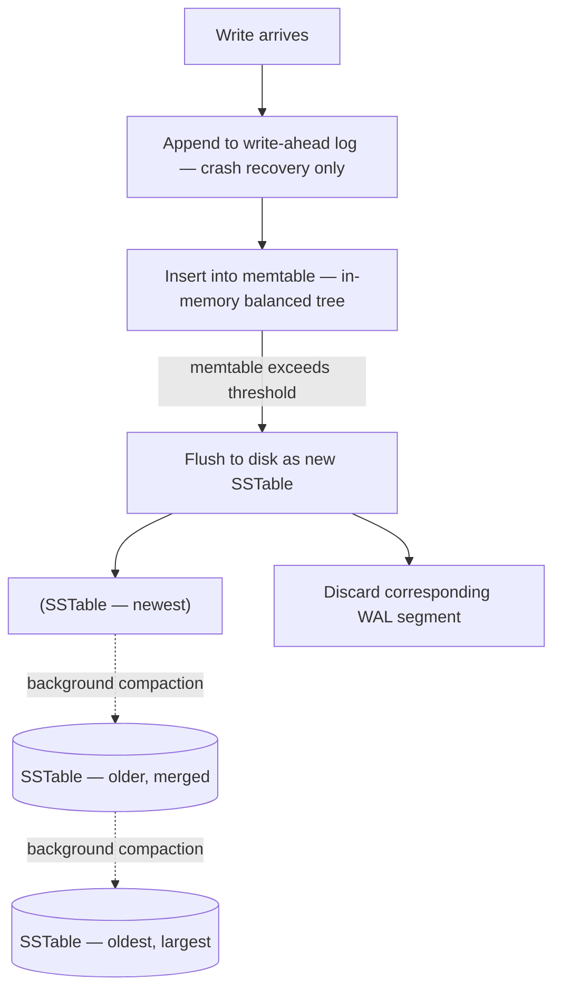
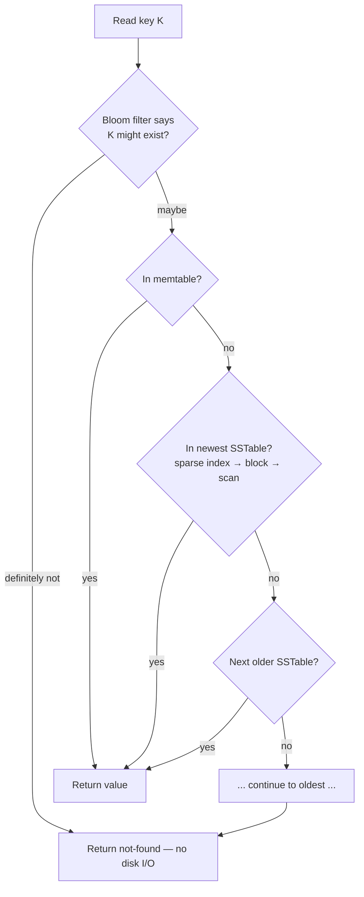

# 07 - Log-Structured Storage: Hash Indexes, SSTables & LSM-Trees

**Prerequisites:** none (helps to know what an index is)
**Difficulty:** Intermediate
**Interview importance:** ⭐ **Critical**
**Source:** Chapter 3 — "Data Structures That Power Your Database"

---

## 1. What Is It?

Log-structured storage is a family of storage engine designs built on one rule:

> **Only ever append to files. Never modify data that has already been written.**

Updates append a new version. Deletes append a tombstone marker. Old data is cleaned up later by a background process.

This one constraint produces LSM-trees, and LSM-trees are why Cassandra, RocksDB, LevelDB, HBase, and Lucene are fast at writes.

---

## 2. Why Does It Exist?

Start with the simplest database possible. Two bash functions: `db_set` appends `key,value` to a file; `db_get` greps the file and takes the last match.

Writes are extremely fast — appending to a file is about the cheapest operation a computer does. Reads are terrible: O(n) scan of the whole file.

So you add an index. But every index slows down writes, because you must update the index on every write. **This is the fundamental trade-off in storage systems: well-chosen indexes speed up reads, but every index slows down writes.**

Now, why *append-only* rather than updating in place? Three reasons, and they're all about disk physics:

- **Appending and segment merging are sequential writes, which are much faster than random writes** — dramatically so on spinning disks, and still significantly so on SSDs.
- **Concurrency and crash recovery are much simpler** if segment files are append-only or immutable. You never have the case of a crash while overwriting a value, leaving a file containing part of the old and part of the new value spliced together.
- **Merging old segments avoids the fragmentation** that accumulates when data files are overwritten over time.

That second point deserves emphasis. If you overwrite a record in place and lose power halfway, you have a corrupted record. If you only ever append, the worst case is a partial record at the end of the file, which you detect with a checksum and discard.

---

## 3. Simple Explanation

Think of it as a diary rather than a whiteboard.

A whiteboard (update-in-place) shows current state. To change something you erase and rewrite. If you're interrupted mid-erase, you have neither the old nor the new value.

A diary (log-structured) only gets new entries. To find the current value, read the most recent entry about it. Nothing is ever destroyed at write time. Periodically you copy the still-relevant entries into a fresh diary and throw the old ones away.

Writes are fast because appending is easy. Reads need help, because you might have to search back through many entries. The whole design is about making that read cheap.

---

## 4. Real-World Analogy

**A restaurant's order tickets.**

Orders are written on tickets and spiked in sequence. Nobody erases a ticket to modify it — an amendment is a new ticket. At the end of service, someone reconciles the spike into a clean summary and discards the individual tickets.

Fast during service (append-only, no coordination) and tidied up when there's slack (compaction). Trying to maintain a perfectly current summary *during* service would slow the whole line down. That's exactly the argument for LSM over B-tree in write-heavy workloads.

---

## 5. Technical Explanation

### Step 1: Hash indexes (Bitcask)

Keep an **in-memory hash map** where every key maps to a **byte offset** in the data file. On write: append to file, update the hash map. On read: look up the offset, seek, read.

This is what Bitcask (the default engine in Riak) does. It offers high-performance reads and writes, subject to one requirement: **all keys must fit in available RAM**, since the hash map is kept in memory. Values can use more space than there is memory, since they're loaded from disk with one seek — and if that part of the data file is already in the filesystem cache, no disk I/O at all.

It's well suited to a workload where **the value for each key is updated frequently** — many writes, but not too many distinct keys. A canonical example: a key is a cat video URL and the value is the number of times it's been played. Lots of writes per key, a bounded number of keys.

**Compaction** keeps disk usage bounded: break the log into segments of a certain size, close a segment when it reaches that size, and write subsequent writes to a new one. Then throw away duplicate keys in the log, keeping only the most recent update for each key. Since compaction makes segments smaller, several segments can be merged at the same time, and merging happens in a background thread while reads and writes continue against the old segments as normal. Each segment has its own in-memory hash table; lookups check the most recent segment first, then the next, and so on.

**Practical issues** the book highlights:

- **File format:** binary is simpler and faster than CSV — encode the length of a string in bytes, then the raw string.
- **Deleting records:** append a special deletion record (a **tombstone**). Merging discards previous values for that key.
- **Crash recovery:** in-memory maps are lost on restart. Rebuilding by reading whole segments is slow, so Bitcask speeds it up by storing snapshots of each segment's hash map on disk.
- **Partially written records:** a crash can happen mid-append. Checksums detect and ignore corrupted parts.
- **Concurrency control:** writes go to the log in strict sequential order, so a common implementation is **one writer thread**. Segments are immutable, so they can be read concurrently by many threads.

**Limitations:** the hash table must fit in memory — an on-disk hash map performs badly, requiring lots of random I/O, expensive growth, and hash collision logic. And **range queries are not efficient** — you can't scan `kitty00000` to `kitty99999` without looking up each key individually.

### Step 2: SSTables — sort the segments

Change one thing: require that **the sequence of key-value pairs is sorted by key**. Call this a **Sorted String Table (SSTable)**. Each key appears only once within a merged segment file, which compaction already guarantees.

Three advantages follow, and they're substantial:

**1. Merging is simple and efficient**, even for files larger than memory. It's a mergesort: read input files side by side, look at the first key in each, copy the lowest key to the output, repeat. When the same key appears in several inputs, keep the value from the most recent segment.

**2. You don't need an index of all keys in memory.** Because keys are sorted, to find `handiwork` you can use offsets for `handbag` and `handsome` to know the range to scan. **You still need an in-memory index, but it can be sparse** — one key for every few kilobytes of segment file is sufficient, since a few kilobytes can be scanned very quickly.

**3. Compression.** Since read requests scan several key-value pairs anyway, those records can be grouped into a **block and compressed before writing to disk**. Each entry of the sparse in-memory index points at the start of a compressed block. This saves disk space *and* reduces I/O bandwidth.

### Step 3: Constructing and maintaining SSTables

Maintaining sorted structure on disk is possible (B-trees do it), but it's **much easier in memory** — a red-black tree or AVL tree lets you insert keys in any order and read them back in sorted order.

The storage engine works like this:

1. A write goes to an **in-memory balanced tree** — the **memtable**.
2. When the memtable exceeds a threshold (a few megabytes), write it to disk as an **SSTable file**. This is efficient because the tree already maintains sorted order. The new file becomes the most recent segment. While it's being written, writes continue to a new memtable instance.
3. A read checks the **memtable first**, then the **most recent on-disk segment**, then the next-older, and so on.
4. From time to time, run **merging and compaction** in the background to combine segment files and discard overwritten or deleted values.

**One problem:** if the database crashes, the memtable — the most recent writes — is lost. The fix: keep a **separate append-only log on disk** to which every write is immediately appended. It doesn't need to be sorted, because its only purpose is restoring the memtable after a crash. Each time the memtable is written to an SSTable, the corresponding log can be discarded.

This is exactly how **LevelDB and RocksDB** work, and the same scheme is used by **Cassandra and HBase**, both inspired by Google's **Bigtable** paper. The indexing structure was originally described as a **Log-Structured Merge-Tree (LSM-Tree)** by Patrick O'Neil et al. in 1996, building on log-structured filesystems.

**Lucene**, used by Elasticsearch and Solr, uses a similar method for its term dictionary — the mapping from a word to the list of documents containing it is kept in SSTable-like sorted files, merged in the background.

### Step 4: Performance optimizations

**The Bloom filter.** Looking up a key that **does not exist** is expensive: you check the memtable, then every segment all the way back to the oldest, possibly reading from disk for each. A **Bloom filter** is a memory-efficient probabilistic structure for approximating set contents. It can tell you if a key does not appear in the database, saving many unnecessary disk reads.

The important property: it can return false positives ("might be present" when it isn't) but never false negatives. So a "not present" answer is definitive and lets you skip the segment entirely.

**Compaction strategies.** The two most common:

- **Size-tiered** (used by HBase, and available in Cassandra): newer and smaller SSTables are successively merged into older and larger ones.
- **Leveled** (used by LevelDB — hence the name — RocksDB, and available in Cassandra): the key range is split into smaller SSTables and older data is moved into separate "levels," which allows compaction to proceed more incrementally and use less disk space.

Even though there are many subtleties, **the basic idea is simple and effective: keep a cascade of SSTables merged in the background.** It works well even when the dataset is much bigger than available memory. Since data is stored in sorted order, range queries work efficiently. And because disk writes are sequential, LSM-trees can support **remarkably high write throughput**.

---

## 6. Flow Diagram





**Reading the second diagram is the key to understanding LSM read cost.** A read may have to check several SSTables. That's **read amplification** — one logical read becomes multiple physical reads. The Bloom filter is what keeps it tolerable, especially for keys that don't exist.

---

## 7. Concrete Example

**A time-series metrics store ingesting 500,000 data points per second.**

Writes dominate overwhelmingly, keys are timestamped (so mostly increasing), and reads are range scans over time windows.

This is close to an ideal LSM workload:

- Writes are sequential appends to the memtable and WAL — no random I/O, no page splits.
- Flushes are sequential writes of already-sorted data.
- Range queries work well because SSTables are sorted.
- Compression is effective because adjacent values in a block are similar.

Trying this on a B-tree engine means random writes scattered across the tree, page splits, and a write throughput ceiling roughly an order of magnitude lower. This is why the time-series and metrics world (Cassandra, InfluxDB, RocksDB-backed systems) is dominated by LSM designs.

---

## 8. When to Use / Not Use

**Use log-structured storage when:** write throughput is the binding constraint; writes are much more frequent than reads; you need efficient range scans; the workload can tolerate variable read latency; storage cost matters (better compression, less fragmentation).

**Avoid when:** you need **predictable, low-latency reads** — compaction can interfere at unpredictable moments; the workload is read-dominated with random access; you need strong transactional isolation with range locks, which is easier on B-trees; the same key is read far more often than written and you can't afford checking multiple segments.

---

## 9. Advantages & Disadvantages

**Advantages**
- Very high **write throughput** — all disk writes are sequential.
- **Lower write amplification** than B-trees in many workloads: one logical write causes fewer physical writes over the lifetime of the data.
- **Better compression**, so smaller files on disk.
- Lower fragmentation — periodic merging rewrites data compactly, whereas B-tree page splits leave unused space in pages.
- Simpler crash recovery — nothing is ever overwritten in place.

**Disadvantages**
- **Compaction competes with live requests** for disk bandwidth. The bigger the database, the more bandwidth compaction needs.
- **Read amplification** — a read may check several SSTables.
- **Latency is less predictable.** At high percentiles, LSM response times can be quite high, and this is a real operational issue.
- **Compaction can fall behind.** If write throughput is high and compaction isn't configured well, unmerged segments accumulate until you run out of disk. Reads also slow down as they check more files. **A good storage engine will not throttle incoming writes even if compaction can't keep up, so you need explicit monitoring for this.**
- **A key can exist in multiple segments**, so there's no single place enforcing uniqueness — which makes strong transactional guarantees harder.

---

## 10. Trade-off Table

| Design choice | Advantages | Disadvantages | When to Use |
|---|---|---|---|
| Hash index (Bitcask) | Simplest; very fast point reads and writes | All keys must fit in RAM; no range queries | Small key space, high update rate per key |
| SSTable + LSM | High write throughput; range queries; compression | Read amplification; compaction interference | Write-heavy workloads at scale |
| Size-tiered compaction | Fewer, larger merges; simpler | More space amplification; large bursts of I/O | Write-heavy, disk space available |
| Leveled compaction | Incremental; less disk space used; better read amplification | More total compaction I/O | Read-sensitive workloads on LSM |
| Bloom filters | Kills the cost of non-existent key lookups | Extra memory; false positives | Almost always worth it |

---

## 11. Failure Scenarios

| Scenario | Consequence | Handling |
|---|---|---|
| Crash before memtable flush | Recent writes lost | **Write-ahead log** replayed on restart |
| Crash mid-append | Partially written record | **Checksums** detect and discard it |
| Compaction falls behind | Disk fills; reads slow as segments accumulate | **Monitor explicitly** — the engine won't throttle writes for you |
| Compaction saturates disk I/O | Live request latency spikes at high percentiles | Rate-limit compaction; provision I/O headroom; leveled compaction |
| Lookup of non-existent key | Scans every segment | Bloom filters |
| Tombstone not yet compacted | Deleted data still on disk, consuming space | Understand tombstone GC and grace periods |
| Disk full during compaction | Compaction cannot proceed; situation worsens | Keep substantial free space — LSM needs headroom to merge |

The "compaction falls behind" row is the classic production LSM incident, and the detail that makes it dangerous is that the engine keeps accepting writes. Nothing pushes back until the disk is full.

---

## 12. Production Considerations

- **Monitor compaction lag and pending compactions.** This is the single most important LSM-specific metric.
- **Provision disk headroom.** Compaction needs space to write merged output before deleting inputs.
- **Watch p99 and p999 read latency**, not the average — compaction interference shows up in the tail.
- **Tune Bloom filter memory** against your read pattern. Heavy negative lookups justify more memory.
- **Choose the compaction strategy deliberately.** Size-tiered for write-heavy, leveled for read-sensitive and space-constrained.
- **Understand tombstone lifetime.** Deletes don't free space until compaction, and in distributed stores there's a grace period to prevent deleted data resurrecting.
- **Sequential I/O assumption:** the advantage is largest on spinning disks, but still meaningful on SSDs, where sequential writes also reduce write amplification and wear.

---

## ❌ 13. Common Mistakes

- **"LSM is always faster."** It's faster at *writes*. Reads often check several files, and read latency is less predictable.
- **Not monitoring compaction.** The engine keeps accepting writes while falling behind. You find out when the disk fills.
- **Running at 90% disk utilization.** Compaction needs room to work.
- **Ignoring tail latency.** Averages look fine while p999 is terrible because of compaction I/O.
- **Assuming deletes free space immediately.** They append a tombstone; space returns after compaction.
- **Using an LSM store for a read-heavy random-access workload** and being surprised by read amplification.
- **Forgetting the WAL exists.** People are sometimes surprised that "log-structured" storage still needs a separate write-ahead log — it does, because the memtable is in memory.

---

## 🧠 14. Think Like an Engineer

```
What is the read:write ratio?
        ↓
Writes dominate → LSM territory
        ↓
Are reads point lookups or range scans?
   (LSM handles ranges well because SSTables are sorted)
        ↓
How much do I care about p99 read latency?
   (very much → LSM's compaction interference is a real risk)
        ↓
How many lookups are for keys that don't exist?
   (many → Bloom filters are essential)
        ↓
Do I have disk headroom and I/O bandwidth for compaction?
        ↓
Am I monitoring compaction lag? (if not, that's the first task)
```

---

## 15. Mental Model

```
Appending is cheap; overwriting is expensive
      ↓
So never overwrite — append and sort (memtable → SSTable)
      ↓
Reads now check several files → read amplification
      ↓
Bloom filters cut the cost of misses
      ↓
Compaction cleans up in the background
      ↓
Compaction is the price you pay, and it's paid at
read-latency percentiles and disk bandwidth
```

---

## 🔗 16. How This Connects to Other Concepts

- **B-Trees (Topic 7)** — the opposing philosophy, update-in-place, and the direct comparison.
- **Column Storage (Topic 8)** — column stores also write via an in-memory sorted structure flushed to disk in bulk, essentially the LSM approach applied to columnar data.
- **Replication (Topic 10)** — the replication log is the same "append-only log as source of truth" idea at the cluster level.
- **Log-Based Brokers (Topic 30)** — Kafka is an append-only log with compaction. Same primitive, different layer. Once you see this, Chapter 11 becomes much easier.
- **Event Sourcing (Topic 31)** — the application-level version: never mutate state, append events, derive current state.

The recurrence of "immutable append-only log plus a derived view" across storage engines, replication, messaging, and application architecture is arguably the central idea of the entire book.

---

## 17. Interview Questions & Answers

**Beginner**

**Q: What is an LSM-tree?**
A storage engine design where writes go to an in-memory sorted structure called a memtable, and when that gets large enough it's flushed to disk as an immutable sorted file called an SSTable. Reads check the memtable first, then the SSTables from newest to oldest. A background compaction process merges SSTables and discards overwritten or deleted values. The payoff is that all disk writes are sequential, which is much faster than random writes.

**Q: Why are appends faster than updates in place?**
Three reasons. Sequential writes are much faster than random writes on both spinning disks and SSDs. Crash recovery is simpler, because you never have a half-overwritten record — the worst case is a partial record at the end of a file, which a checksum catches. And merging avoids the fragmentation you get from overwriting files repeatedly.

**Intermediate**

**Q: What's the point of the sparse index in an SSTable?**
Because the file is sorted, you don't need an in-memory entry for every key. If you know the offsets of `handbag` and `handsome`, you know `handiwork` is between them, so you seek to the first offset and scan. That means one index entry per few kilobytes is enough, which keeps the index small enough to hold in memory even for very large datasets. It also enables block compression — each sparse index entry points at the start of a compressed block, which saves both disk space and I/O bandwidth.

**Q: Why does an LSM engine still need a write-ahead log?**
Because the memtable lives in memory, and a crash loses it. So every write is also appended to a separate unsorted log on disk purely for recovery. It doesn't need sorting because its only job is to rebuild the memtable after a restart, and once the memtable is flushed to an SSTable the corresponding log segment can be discarded. People find this surprising — "isn't the whole thing a log?" — but the SSTables are the sorted durable form and the WAL protects the window before a flush.

**Q: What does a Bloom filter do here?**
It answers "is this key definitely absent?" cheaply and in memory. Without it, a lookup for a key that doesn't exist has to check the memtable and then every SSTable down to the oldest, which is the most expensive read path there is. A Bloom filter can have false positives but never false negatives, so a negative answer lets you skip a segment with certainty. For workloads with many lookups of missing keys — a cache-miss check, for instance — it's the difference between usable and not.

**Advanced / Staff**

**Q: Your Cassandra cluster's p99 read latency has tripled but the average is unchanged. What's your hypothesis?**
My first hypothesis is compaction. Compaction competes with live requests for disk bandwidth, and it runs in bursts, so it shows up in the tail while leaving the average alone — which is exactly the signature described. I'd check pending compaction tasks and SSTable count per read: if compaction has fallen behind, reads are touching more files, which raises read amplification and tail latency together. The second hypothesis is that tombstones have accumulated — reads scanning over large numbers of deleted rows are slow, and that's also tail-weighted. I'd also want to rule out GC pauses, since those produce a similar tail-only signature. The fixes differ: rate-limiting or rescheduling compaction, switching compaction strategy, adding I/O headroom, or fixing a delete-heavy access pattern.

**Q: How do you decide between size-tiered and leveled compaction?**
It's a space-and-write-amplification trade against read amplification. Size-tiered merges newer, smaller tables into older, larger ones — fewer merges overall, so less total write I/O, but more space amplification and more SSTables to check on a read. Leveled splits the key range into smaller tables organized into levels, which keeps read amplification low and uses less disk space, at the cost of doing more compaction I/O overall. So write-heavy workloads with disk to spare favour size-tiered, and read-sensitive or space-constrained workloads favour leveled. I'd also weigh how bursty the I/O can be — size-tiered's large merges produce bigger latency spikes, which matters if you have tight tail-latency requirements.

**Q: When would you deliberately choose a B-tree engine over an LSM engine?**
When read latency predictability matters more than write throughput. LSM reads may touch several files, and compaction interferes at unpredictable moments, so the tail is inherently noisier. B-trees give you one place per key, which also makes strong transactional isolation easier — range locks attach naturally to the tree, whereas in an LSM a key can exist in several segments simultaneously and there's no single point of enforcement. So for an OLTP system with real transactional requirements and a read-heavy random-access pattern, I'd take the B-tree. For a write-dominated ingest pipeline, the LSM.

---

## 🎯 30-Second Interview Answer

> "Log-structured storage never modifies data in place — writes append, updates append a new version, deletes append a tombstone. In an LSM-tree, writes go to an in-memory sorted memtable, which is flushed to disk as an immutable sorted file called an SSTable; a background compaction process merges those files and discards superseded values. The reason it's fast is that every disk write is sequential, which is far cheaper than random writes, and crash recovery is simple because nothing is half-overwritten. The cost is read amplification — a read might check several SSTables, which is why Bloom filters matter — and compaction competing with live traffic, which shows up as bad tail latency rather than a bad average. That trade is why Cassandra and RocksDB are excellent at write-heavy ingest and why B-trees remain better where predictable read latency matters."

---

## ⚡ Quick Revision

- **Rule:** append only, never overwrite. Updates append; deletes append a **tombstone**.
- **Why:** sequential writes are much faster; crash recovery is simpler; less fragmentation.
- **Bitcask (hash index):** in-memory hash map key → byte offset. **All keys must fit in RAM.** No range queries.
- **SSTable:** segment sorted by key. Gives efficient **mergesort compaction**, a **sparse in-memory index**, and **block compression**.
- **LSM pipeline:** write → WAL + memtable → flush to SSTable → background compaction.
- **WAL still needed** because the memtable is in memory.
- **Bloom filter** eliminates the cost of looking up keys that don't exist.
- **Compaction strategies:** size-tiered (HBase, Cassandra) vs leveled (LevelDB, RocksDB, Cassandra).
- **Users:** LevelDB, RocksDB, Cassandra, HBase, Lucene. Origin: O'Neil et al. 1996; Bigtable.
- **Main operational risk:** compaction falling behind — the engine won't throttle writes, so **monitor it**.
- **Biggest interview point:** LSM optimizes **writes**; the price is **read amplification and tail latency**.
