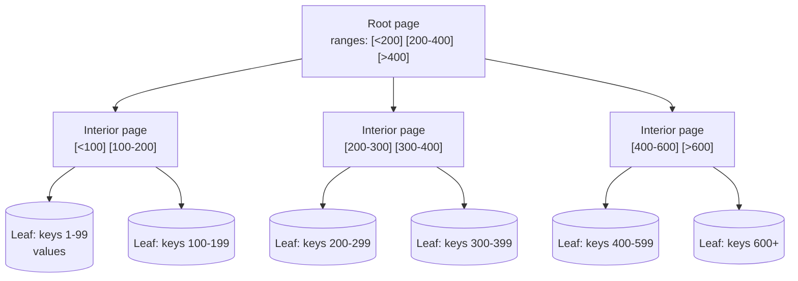
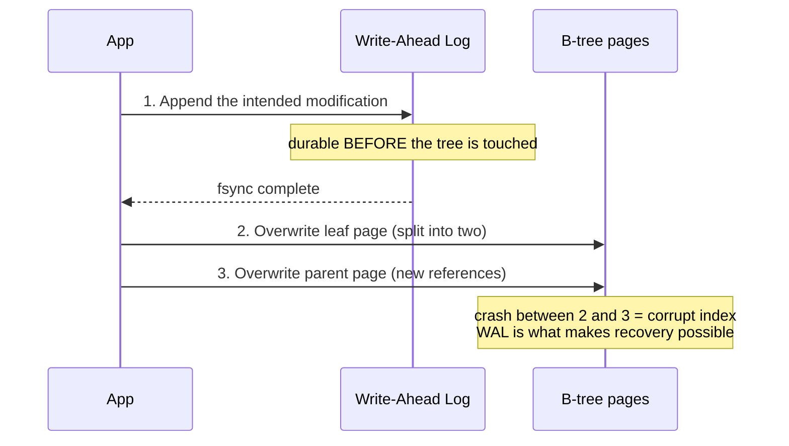

# 08 - B-Trees & Storage Engine Trade-offs

**Prerequisites:** Topic 6 (Log-Structured Storage)
**Difficulty:** Intermediate
**Interview importance:** ⭐ **Critical**
**Source:** Chapter 3 — "B-Trees", "Comparing B-Trees and LSM-Trees", "Other Indexing Structures"

---

## 1. What Is It?

The **B-tree** is the update-in-place storage philosophy: treat the disk as a set of fixed-size **pages** (traditionally 4 KB) that can be **overwritten**.

It's the opposite bet from LSM-trees. Introduced in 1970, described as "ubiquitous" nine years later, and still the standard index implementation in almost every relational database and many non-relational ones. It has aged extraordinarily well.

---

## 2. Why Does It Exist?

LSM-trees answer "how do I make writes fast?" B-trees answer a different question: **"how do I find any key in a large sorted structure with a small, predictable number of disk reads — and update it in place?"**

The problem with the log-structured approach, from the perspective of a traditional database, is that there's no single location for a key. A key can live in the memtable and in several SSTables. That's fine for throughput and awkward for everything else: enforcing uniqueness, taking a lock on a key or range, and giving predictable read latency all get harder.

B-trees make a different trade: **one key, one place.** That single property is what makes strong transactional semantics natural, and it's why relational databases picked B-trees and never left.

---

## 3. Simple Explanation

A B-tree is a sorted tree of fixed-size pages.

- One page is the **root**. Reading it gives you a set of key ranges, each with a pointer to a child page.
- Each child covers a narrower range, again with pointers.
- Eventually you reach a **leaf page** containing the actual values (or pointers to them).

To find a key, you walk from root to leaf. The number of pages you touch is the **depth** of the tree — and because each page holds many child references (the **branching factor**, typically several hundred), the tree is very shallow.

A four-level tree of 4 KB pages with a branching factor of 500 can store **256 TB**. That's the whole point: any key in a quarter-petabyte dataset is four disk reads away, and it's always four — not one sometimes and eleven other times.

---

## 4. Real-World Analogy

**A library catalogue with drawers.**

The top drawer says: A–F in cabinet 1, G–M in cabinet 2, N–S in cabinet 3. Cabinet 2's top drawer subdivides further. Three or four lookups and you have the exact shelf, whether the library holds 10,000 books or 10 million.

To add a book you go to the right drawer and insert a card. If the drawer is full, you split it in two and add an entry to the drawer above. **That's a page split, and it's the expensive operation** — because now you're modifying two or three physical places rather than one.

Contrast the LSM library, which just piles new acquisitions by the door in sorted batches and reorganizes at night. Faster to accept books, slower and less predictable to find one.

---

## 5. Technical Explanation

### Structure and lookup

B-trees break the database into fixed-size **blocks or pages**, traditionally 4 KB (sometimes larger), and read or write one page at a time. This design corresponds more closely to the underlying hardware, since disks are also arranged in fixed-size blocks.

Each page can be identified using an address or location, which allows one page to refer to another — like a pointer, but on disk instead of in memory.

- One page is designated the **root**; lookups start here.
- The page contains several keys and references to child pages. Each child is responsible for a **continuous range of keys**, and the keys between the references indicate where the boundaries lie.
- Eventually you reach a **leaf page**, which either contains the value for each key inline or contains references to the pages where the values can be found.

The number of references to child pages in one page is the **branching factor**. In practice it depends on the space required to store page references and range boundaries, but is **typically several hundred**.

### Updating and inserting

**To update the value for an existing key:** search for the leaf page containing that key, change the value in that page, and write the page back to disk. Any references to that page remain valid.

**To add a new key:** find the page whose range encompasses the new key and add it there. **If there isn't enough free space in the page, it is split into two half-full pages, and the parent page is updated** to account for the new subdivision of key ranges.

This algorithm ensures the tree remains **balanced**: a B-tree with *n* keys always has a depth of **O(log n)**. Most databases fit into a B-tree that is **three or four levels deep**, so you don't need to follow many page references to find what you're looking for. A four-level tree of 4 KB pages with a branching factor of 500 can store up to 256 TB.

> 💡 **Additional Context:** deletion in a B-tree is noticeably more involved than insertion, because keeping the tree balanced requires merging or redistributing underfull pages. The book notes this in a footnote; in practice many engines defer or simplify this work.

### Making B-trees reliable

Here's the crucial difference from LSM-trees, and it's the source of most of the complexity:

> **The basic underlying write operation of a B-tree is to overwrite a page on disk with new data.**

The assumption is that the overwrite does not change the location of the page — all references remain intact. This is in stark contrast to log-structured indexes such as LSM-trees, which only append to files and never modify files in place.

Some operations require **several different pages to be overwritten**. When you split a page because an insertion made it overfull, you write the two pages that were split, **and** you overwrite their parent page to update the references. **This is a dangerous operation: if the database crashes after only some of the pages have been written, you end up with a corrupted index** — for example, an orphan page that is not a child of any parent.

The solution is a **write-ahead log (WAL)**, also known as a redo log: an append-only file to which every B-tree modification must be written **before** it can be applied to the pages of the tree itself. When the database comes back after a crash, this log is used to restore the B-tree to a consistent state.

Note the irony worth savouring: **the B-tree, the update-in-place design, requires an append-only log to be safe.** Both philosophies end up writing an append-only log. They differ in what the log is *for* — for LSM it protects the in-memory memtable, for B-trees it protects multi-page updates.

An additional complication: **concurrency control**. If multiple threads access the tree at the same time, a thread could see the tree in an inconsistent state. This is typically handled by protecting the tree's data structures with **latches** (lightweight locks). Log-structured approaches are simpler here, because merging happens in the background without interfering with incoming queries, and segments are swapped atomically.

### B-tree optimizations

The book lists several, and they're worth knowing because they explain how modern B-trees stay competitive:

- **Copy-on-write instead of a WAL.** Some databases (LMDB) write a modified page to a different location, with a new version of the parent pages created to point at it. This is also useful for concurrency control.
- **Abbreviating keys.** Save space by storing not the entire key but an abbreviated version, particularly in interior pages where keys only need to provide enough information to act as **boundaries** between ranges. Packing more keys into a page allows a higher branching factor and thus fewer levels. (This is sometimes called a B+ tree — the optimization is so common it's often not distinguished.)
- **Laying out leaf pages sequentially on disk.** Since pages can be positioned anywhere on disk, a tree that has grown over time may have leaves scattered around, making range scans require many seeks. Many engines try to keep leaves in sequential key order, though this is difficult to maintain as the tree grows. LSM-trees have an advantage here — they rewrite large segments in one go during merging, so it's easier to keep sequential keys close on disk.
- **Sibling pointers.** Additional pointers in leaf pages to their left and right siblings allow scanning keys in order without jumping back to parent pages.
- **Fractal trees** — variants that borrow log-structured ideas to reduce disk seeks. (Nothing to do with fractals.)

### Other indexing structures

**Secondary indexes** are built the same way (B-tree or log-structured); the difference is that indexed values are not necessarily unique. Two solutions: make each value in the index a list of matching row identifiers, or make each key unique by appending a row identifier.

**Storing values within the index.** The key in an index is what queries search for, but the value can be either the actual row, or a **reference to the row stored elsewhere**. When rows are stored elsewhere, that place is called a **heap file**, which stores data in no particular order. The heap file avoids duplicating data when multiple secondary indexes are present — each index references a location in the heap file, and the actual data is kept in one place.

Updating a value without changing the key is efficient with a heap file: the record can be overwritten in place, provided the new value is not larger. If it is larger, it must move to a new location with enough space, and then either all indexes are updated to point at the new heap location, or a forwarding pointer is left behind in the old record.

Sometimes the extra hop from index to heap file is too expensive for reads, so the indexed row can be stored **directly within the index**: a **clustered index**. In MySQL's InnoDB, the primary key of a table is always a clustered index, and secondary indexes refer to the primary key rather than a heap file location.

A compromise is a **covering index** (or index with included columns), which stores *some* of a table's columns within the index, allowing some queries to be answered by the index alone — the index *covers* the query. As with any duplication, these speed up reads but require additional storage and add overhead on writes. Databases also need extra effort to enforce transactional guarantees, because applications should not see inconsistencies due to duplication.

**Multi-column indexes.** The most common type is a **concatenated index**, which combines several fields into one key by appending one column to another. Order matters: an index on (lastname, firstname) can find all people with a given last name, or a given last name and first name, but is useless for finding all people with a given *first* name.

Multi-dimensional indexes generalize this to querying several columns at once — important for geospatial data. A two-dimensional range query (`WHERE latitude BETWEEN … AND longitude BETWEEN …`) is not efficiently served by a standard B-tree or LSM index: it can give you all restaurants in a latitude range, or all in a longitude range, but not both simultaneously. One option is to translate a two-dimensional location into a single number using a space-filling curve, then use a regular B-tree. More commonly, specialized structures like **R-trees** are used. And it's not just maps: an e-commerce site could index products on (red, green, blue) to search for products in a colour range, or a weather database could index (date, temperature) to efficiently find all observations in 2013 where the temperature was between 25 and 30°C — which a one-dimensional index would require scanning all of 2013 or all temperature readings to answer.

**Full-text search and fuzzy indexes.** All the indexes discussed so far assume exact data and let you query for exact values or a range with a sort order. They don't allow searching for *similar* keys, such as misspelled words. Lucene is able to search text for words within a certain edit distance. Its in-memory index is a finite state automaton over the characters in the keys, similar to a **trie**, which can be transformed into a **Levenshtein automaton** supporting efficient search for words within a given edit distance.

**Keeping everything in memory.** Disks are awkward — they require care to get acceptable performance for reads and writes. We tolerate them because they're durable and cheaper per gigabyte than RAM. As RAM gets cheaper, the cost-per-gigabyte argument erodes, and for many datasets it's feasible to keep everything in memory, potentially distributed across several machines. This has led to **in-memory databases**.

Some, like Memcached, are intended purely for caching, where losing data on restart is acceptable. Others aim for durability via special hardware (battery-powered RAM), by writing a log of changes to disk, by writing periodic snapshots, or by replicating in-memory state to other machines. When an in-memory database restarts, it needs to reload state either from disk or over the network from a replica. Despite writing to disk, it's still an in-memory database, because the disk is used only as an append-only log for durability, and reads are served entirely from memory. Redis and Couchbase provide weak durability by writing to disk asynchronously.

Counterintuitively, **the performance advantage of in-memory databases is not primarily that they don't need to read from disk** — even a disk-based engine may never need to read, if you have enough memory, because the OS caches recently used blocks. Rather, they're faster because they **avoid the overhead of encoding in-memory data structures in a form that can be written to disk.**

Besides performance, another advantage is providing data models that are difficult to implement with disk-based indexes — Redis offers a database-like interface to priority queues and sets, and because it keeps all data in memory, its implementation is comparatively simple.

Recent research suggests an in-memory architecture could be extended to support datasets larger than available memory, without bringing back the overheads of a disk-centric architecture: an **anti-caching** approach evicts the least recently used data to disk when there isn't enough memory and loads it back when accessed again. This is similar to what operating systems do with virtual memory and swap files, but the database can work at the granularity of individual records rather than whole memory pages, and so can be more efficient. It still requires indexes to fit in memory. Further changes may be needed as non-volatile memory technologies develop.

---

## 6. Diagram — B-tree structure and a page split





The second diagram is the whole reliability story. A page split touches multiple pages; a crash between them corrupts the index; the WAL is the only thing standing between you and an orphan page.

---

## 7. Comparing B-Trees and LSM-Trees — the central trade-off

The book's summary is direct: **LSM-trees are typically faster for writes, whereas B-trees are thought to be faster for reads.** Reads are typically slower on LSM-trees because they have to check several different data structures and SSTables at different stages of compaction. But benchmarks are often inconclusive and sensitive to workload details, so **you need to test systems with your particular workload** in order to make a valid comparison.

### Advantages of LSM-trees

**Write amplification.** A B-tree index must write every piece of data at least twice: once to the write-ahead log, and once to the tree page itself (and again when pages are split). There's also overhead from having to write an entire page at a time, even if only a few bytes changed. Some engines even overwrite the same page twice to avoid ending up with a partially updated page in the event of a power failure.

Log-structured indexes also rewrite data multiple times due to repeated compaction and merging. **This effect — one write to the database resulting in multiple writes to the disk over the course of the database's lifetime — is known as write amplification.** It's of particular concern on SSDs, which can only overwrite blocks a limited number of times before wearing out.

In write-heavy applications, the performance bottleneck might be the rate at which the database can write to disk. In that case, write amplification has a direct performance cost: the more the engine writes to disk, the fewer writes per second it can handle within the available bandwidth.

**LSM-trees are typically able to sustain higher write throughput than B-trees**, partly because they sometimes have lower write amplification (depending on configuration and workload), and partly because they **write compact SSTable files sequentially rather than having to overwrite several pages in the tree.** This difference is particularly important on magnetic hard drives, where sequential writes are much faster than random writes.

**Compression and space.** LSM-trees can be compressed better, and thus often produce smaller files on disk than B-trees. B-tree storage engines leave some disk space unused due to fragmentation: when a page is split, or when a row cannot fit into an existing page, some space in a page remains unused. Since LSM-trees are not page-oriented and periodically rewrite SSTables to remove fragmentation, they have **lower storage overheads**, especially with leveled compaction.

On many SSDs, the firmware internally uses a log-structured algorithm to turn random writes into sequential writes on the underlying storage chips, so the storage engine's write pattern has less of an effect there. But **lower write amplification and reduced fragmentation are still advantageous on SSDs: representing data more compactly allows more read and write requests within the available I/O bandwidth.**

### Downsides of LSM-trees

**Compaction interferes with performance.** The compaction process can interfere with the performance of ongoing reads and writes. Even though storage engines try to perform compaction incrementally and without affecting concurrent access, disks have limited resources, so it can easily happen that a request needs to wait while the disk finishes an expensive compaction operation. The impact on throughput and average response time is usually small, but **at higher percentiles the response time of queries to log-structured storage engines can sometimes be quite high, and B-trees can be more predictable.**

**Compaction can starve.** Another issue arises at high write throughput: the disk's finite write bandwidth is shared between the initial write (logging and flushing a memtable) and the compaction threads running in the background. **The bigger the database gets, the more disk bandwidth is required for compaction.**

If write throughput is high and compaction is not configured carefully, it can happen that **compaction cannot keep up with the rate of incoming writes**. The number of unmerged segments on disk keeps growing until you run out of disk space, and reads also slow down because they need to check more segment files. **Typically, SSTable-based storage engines do not throttle the rate of incoming writes even if compaction cannot keep up, so you need explicit monitoring to detect this situation.**

**Transactional advantages of B-trees.** An advantage of B-trees is that **each key exists in exactly one place in the index, whereas a log-structured storage engine may have multiple copies of the same key in different segments.** This aspect makes B-trees attractive in databases that want to offer strong transactional semantics: in many relational databases, transaction isolation is implemented using locks on ranges of keys, and in a B-tree index those locks can be directly attached to the tree.

**Bottom line.** B-trees remain deeply ingrained in the architecture of databases and provide consistently good performance for many workloads, so it's unlikely they'll go away. In new datastores, log-structured indexes are increasingly popular. **There is no quick and easy rule for determining which type of storage engine is better for your use case, so it is worth testing empirically.**

---

## 8. Comparison Table

| Dimension | B-Tree (update-in-place) | LSM-Tree (log-structured) |
|---|---|---|
| Write path | Overwrite pages; WAL first; page splits | Append to WAL + memtable; sequential flush |
| Write throughput | Lower | **Higher** |
| Write amplification | ≥2× (WAL + page), whole-page writes, splits | Multiple rewrites via compaction; often lower overall |
| Read path | Fixed depth, 3–4 page reads | Check memtable + several SSTables |
| Read latency | **More predictable** | Variable; Bloom filters help |
| Tail latency (p99+) | **Better** | Worse — compaction interference |
| Range scans | Good; better with sibling pointers and sequential leaf layout | Good; SSTables are sorted |
| Disk space | Fragmentation from splits and partial pages | **Lower overhead**; compaction removes fragmentation |
| Compression | Page-level, less effective | **Better** — block compression |
| Uniqueness / locking | **One key, one place** — natural for range locks and transactions | Key can exist in several segments — harder |
| Concurrency | Latches on tree structures | Simpler — background merges, atomic segment swap |
| Main operational risk | Fragmentation, page-split I/O | **Compaction falling behind — no automatic throttling** |
| Typical systems | PostgreSQL, MySQL/InnoDB, Oracle, SQL Server | Cassandra, HBase, RocksDB, LevelDB, Lucene |

---

## 9. When to Use Which

**Choose a B-tree engine when:** reads dominate, or read latency must be predictable; you need real transactional isolation with range locks; you need uniqueness enforcement; the workload is random-access OLTP; operational predictability matters more than peak write throughput.

**Choose an LSM engine when:** writes dominate; you're ingesting time-series, logs, or events; disk space and compression matter; sequential range scans over recent data are the main read pattern; you can provision I/O headroom for compaction and monitor it.

**And in both cases:** test with your workload. The book is explicit that benchmarks are inconclusive and sensitive to details.

---

## 10. Failure Scenarios

| Scenario | Consequence | Handling |
|---|---|---|
| Crash mid page-split | Orphan page; corrupt index | **WAL** replayed on restart |
| Power loss during page overwrite | Partially updated page | WAL; some engines write the page twice (double-write buffer) |
| Concurrent access during split | Thread sees inconsistent tree | **Latches** |
| Fragmentation over time | Wasted space; scattered leaves; slow range scans | Periodic rebuild/`VACUUM`; sequential leaf layout optimizations |
| Row grows beyond page space in a heap file | Must move; all indexes must be updated | Forwarding pointer left behind |
| Hot page contention | Latch contention limits throughput | Partition the key space; reduce contention at the schema level |
| SSD wear from write amplification | Device wears out early | Prefer lower write amplification; monitor endurance |

---

## 11. Production Considerations

- **The WAL is not optional.** Understand your `fsync` policy — it's the actual durability knob, and it's often quietly relaxed for performance.
- **Watch index bloat and fragmentation.** Long-lived B-trees degrade; periodic rebuilds recover space and locality.
- **Every index costs writes.** Adding an index to speed up a query slows down every write to that table. This is the single most common self-inflicted performance problem.
- **Clustered vs covering indexes** are the practical tuning levers — they trade write cost and storage for avoiding the heap-file hop.
- **Concatenated index column order matters.** (lastname, firstname) doesn't help a firstname query.
- **For in-memory stores, be precise about durability.** Redis's asynchronous persistence is *weak* durability. Know whether you're relying on it.

---

## ❌ 12. Common Mistakes

- **"B-trees don't need a log."** They do — page splits touch multiple pages, and a crash between them corrupts the index.
- **Thinking write amplification is an LSM-only problem.** B-trees write at least twice, in whole pages, plus splits.
- **Adding indexes without accounting for write cost.**
- **Wrong column order in a concatenated index**, then concluding the index "doesn't work."
- **Assuming in-memory databases are fast because they avoid disk reads.** They're mostly fast because they avoid the encoding overhead of disk formats — the OS page cache already prevents most reads in a well-provisioned disk-based system.
- **Expecting a B-tree to serve two-dimensional range queries.** It can't do both dimensions at once; you need R-trees or a space-filling curve.
- **Choosing an engine from a blog benchmark.** Test your workload.

---

## 🧠 13. Think Like an Engineer

```
What dominates: reads or writes?
        ↓
How much does READ LATENCY PREDICTABILITY matter?
   (a lot → B-tree; compaction makes LSM tails noisy)
        ↓
Do I need range locks / uniqueness / strong isolation?
   (yes → B-tree's one-key-one-place is a real advantage)
        ↓
Is disk write bandwidth the bottleneck?
   (yes → write amplification is the number that matters)
        ↓
Am I on SSD? (then wear and bandwidth both favour lower amplification)
        ↓
Do I have I/O headroom and monitoring for compaction?
        ↓
Test empirically. Benchmarks from elsewhere won't transfer.
```

---

## 14. Mental Model

```
Every storage engine trades READ cost, WRITE cost, and SPACE.
You cannot optimize all three.

B-tree:  pay on writes (amplification, splits, whole pages)
         to get predictable reads and one-key-one-place

LSM:     pay on reads (amplification, tail latency, compaction)
         to get sequential writes and compact storage
```

That three-way trade — read, write, space — is sometimes called the RUM conjecture, and it's the single most portable idea in this chapter. It applies to caches, to indexes, to materialized views, to replication.

---

## 🔗 15. How This Connects to Other Concepts

- **Log-Structured Storage (Topic 6)** — the direct counterpart; read them as a pair.
- **OLTP vs OLAP (Topic 8)** — both designs here are OLTP-oriented; analytics needs a different shape entirely.
- **Replication (Topic 10)** — WAL shipping is one of the replication log implementations, and it inherits the B-tree's coupling to storage internals, which is why it makes version upgrades harder.
- **Transactions & Isolation (Topics 17–19)** — range locks attaching to B-tree nodes is exactly how index-range locking is implemented in 2PL.
- **Scalability (Topic 2)** — compaction interference is a textbook cause of tail latency.

---

## 16. Interview Questions & Answers

**Beginner**

**Q: How does a B-tree find a key?**
It walks from the root page down through interior pages to a leaf. Each page holds key ranges and pointers to child pages covering narrower ranges. Because the branching factor is typically several hundred, the tree is only three or four levels deep even for very large datasets — a four-level tree of 4 KB pages with branching factor 500 holds around 256 TB. So a lookup is a small, *fixed* number of page reads, which is where the predictability comes from.

**Q: Why does a B-tree need a write-ahead log?**
Because some operations modify multiple pages. When a page overflows it splits into two, and the parent must be updated to point at both. If the database crashes after writing some of those pages but not others, you get a corrupted index — an orphan page with no parent. The WAL records the intended modification durably before the tree is touched, so recovery can replay it and restore consistency.

**Intermediate**

**Q: What is write amplification, and how do the two designs compare?**
Write amplification is one logical write causing multiple physical writes over the data's lifetime. B-trees write at least twice — once to the WAL and once to the page — and they write whole pages even when a few bytes changed, plus extra writes on splits. LSM-trees write once initially but then rewrite data repeatedly through compaction. Which is worse depends on workload and configuration, but LSM-trees often come out lower, and they also write sequentially rather than overwriting scattered pages. It matters most on SSDs, where writes wear the device, and in write-bound systems, where physical write volume directly caps throughput.

**Q: Why are B-trees better suited to strong transactional semantics?**
Because each key exists in exactly one place in the index. Many relational databases implement isolation with locks on key ranges, and in a B-tree those locks attach naturally to tree nodes. In a log-structured engine the same key may exist in the memtable and several SSTables simultaneously, so there's no single structure to attach a range lock to, and enforcing uniqueness requires checking multiple places.

**Q: What's a clustered index versus a covering index?**
A clustered index stores the actual row inside the index rather than a reference to a heap file — InnoDB's primary key works this way, and secondary indexes then reference the primary key rather than a physical location. A covering index stores only some columns alongside the key, enough that certain queries can be answered from the index alone without touching the row. Both trade extra storage and write overhead for avoiding the extra hop, and both create duplication the database has to keep consistent.

**Advanced / Staff**

**Q: You're choosing storage for a high-volume event ingestion system with occasional point lookups. Walk me through it.**
The write-dominated ingest pattern points strongly at an LSM engine: writes are sequential, throughput is high, and compression is good, which matters at event volumes. The occasional point lookups are the thing to check — if they're frequently for keys that don't exist, Bloom filters make that cheap, and if they're for recent data they'll usually hit the memtable or the newest SSTables. I'd worry about two things. First, compaction capacity: I'd size disk I/O with headroom and monitor pending compactions explicitly, because the engine won't throttle writes when it falls behind and the failure mode is a full disk. Second, tail latency on the lookups, since compaction bursts will show up there — if there's a strict p99 requirement on reads I'd want to validate it under sustained write load, not on an idle cluster. And I'd test with the real workload rather than trusting a benchmark, because this comparison is notoriously workload-sensitive.

**Q: Your Postgres table has eight indexes and write latency has degraded. How do you approach it?**
Every index has to be updated on every write, so eight indexes means a single insert is doing nine structural updates plus WAL. I'd start by measuring which indexes are actually used — Postgres tracks index scan counts, and it's common to find several that have never been scanned, usually left over from a query that no longer exists. Dropping unused indexes is free performance. Then I'd look for redundancy: an index on (a) is redundant if an index on (a, b) exists, since the concatenated index serves prefix queries. Then I'd consider whether a covering index could replace two separate ones. I'd also check index bloat, because long-lived B-trees fragment and a rebuild can recover both space and locality. The general principle is that indexes are a read-write trade, and the read side is usually well-measured while the write side is invisible until it isn't.

**Q: Is the LSM-vs-B-tree distinction still meaningful on SSDs?**
Partly. The original argument was largely about sequential versus random writes on spinning disks, and SSD firmware internally uses a log-structured algorithm to turn random writes into sequential ones on the underlying chips, so the storage engine's write pattern matters less than it used to. But two things still hold. Write amplification affects device endurance, since flash cells have limited overwrite cycles, and it consumes I/O bandwidth that could serve requests. And lower fragmentation means data is represented more compactly, so more useful work fits in the same bandwidth. So the gap narrows on SSDs but doesn't close, and the transactional and tail-latency arguments are unaffected by storage medium entirely.

---

## 🎯 30-Second Interview Answer

> "B-trees treat the disk as fixed-size pages that get overwritten in place, organized as a shallow sorted tree — branching factor of several hundred means three or four levels covers hundreds of terabytes, so lookups are a small and *fixed* number of page reads. That predictability, plus the fact that each key lives in exactly one place, is why relational databases use them: range locks for transaction isolation attach directly to tree nodes. The cost is write amplification — every write hits the WAL and then a full page, plus more on splits — and the fact that page splits touch multiple pages, so a crash mid-split corrupts the index, which is why B-trees need a write-ahead log despite being the update-in-place design. Versus LSM-trees, the summary is: LSM wins on write throughput and space, B-trees win on read predictability and transactional semantics. And the book is explicit that benchmarks are workload-sensitive, so you test rather than assume."

---

## ⚡ Quick Revision

- **B-tree = update in place.** Fixed-size pages (typically 4 KB), overwritten.
- **Branching factor** several hundred → depth 3–4 → **256 TB in four levels**. Fixed, predictable read cost.
- **Page split** touches multiple pages → crash risk → **WAL is mandatory**.
- **Latches** for concurrency (LSM is simpler here — background merges, atomic swap).
- **Optimizations:** copy-on-write (LMDB), abbreviated keys (B+ tree), sequential leaf layout, sibling pointers, fractal trees.
- **Heap file / clustered index / covering index** — where the row actually lives.
- **Concatenated index:** column order decides which queries it serves.
- **Multi-dimensional queries** need R-trees or space-filling curves, not plain B-trees.
- **In-memory DBs are fast mainly because they skip disk-format encoding**, not because they skip reads.
- **The trade:** LSM = faster writes, better compression, worse tail latency, harder transactions. B-tree = predictable reads, one key one place, higher write amplification.
- **RUM:** read cost, write cost, space — pick two.
- **Test empirically.** Benchmarks don't transfer between workloads.
