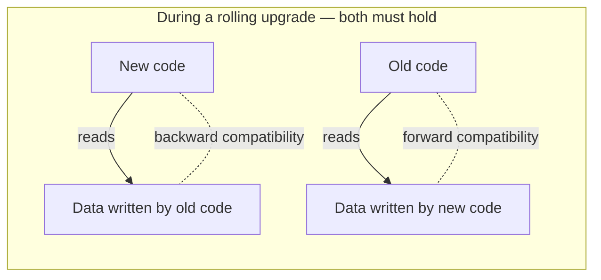
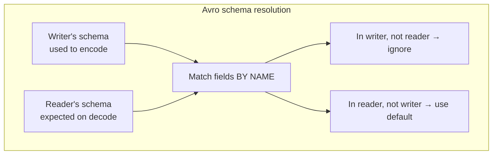

# 10 - Encoding, Schemas & Evolution

**Prerequisites:** Topic 4 (data models)
**Difficulty:** Intermediate
**Interview importance:** High
**Source:** Chapter 4 — "Formats for Encoding Data", "Modes of Dataflow"

---

## 1. What Is It?

**Encoding** (also serialization or marshalling) is turning in-memory data structures into a sequence of bytes for storage or transmission. **Decoding** (parsing, deserialization, unmarshalling) is the reverse.

**Evolution** is the harder half: how do you change the shape of your data over time while old and new code, and old and new data, all coexist?

---

## 2. Why Does It Exist?

The forcing problem is the **rolling upgrade**.

You have a service on 20 machines. You deploy a new version. You cannot flip all 20 at once — that's downtime, and it's risky, because if the new version is broken you've broken everything. So you deploy to a few nodes at a time, check they're healthy, and continue.

For a period — sometimes a long period — **old and new code run simultaneously**, reading and writing the same data and talking to each other.

This creates two directions of compatibility, and you need both:

- **Backward compatibility:** newer code can read data written by older code. (Usually easy — you know the old format.)
- **Forward compatibility:** older code can read data written by newer code. (Harder — old code must gracefully ignore fields it doesn't understand.)

Get either wrong and a rolling upgrade corrupts data or crashes nodes. These properties are, as the book puts it, hugely beneficial for **evolvability** — the ease of making changes.

---

## 3. Simple Explanation

Two people who speak slightly different dialects need to exchange letters, and neither can wait for the other to upgrade their vocabulary.

- **Backward compatible:** the newer speaker understands older words. Natural.
- **Forward compatible:** the older speaker receives a letter using a word they don't know, and instead of throwing the whole letter away, they **keep the unknown word intact and pass it along.** Unnatural — you have to design for it.

Forward compatibility is the one people forget, and it's the one rolling upgrades actually require.

---

## 4. Real-World Analogy

**A government form that gets revised.**

The 2024 version adds a field for email. Now:

- A clerk trained on 2024 (new code) reading a 2020 form (old data) → backward compatible: they know email is optional and move on.
- A clerk trained on 2020 (old code) reading a 2024 form (new data) → forward compatibility test: do they choke on the email field, or do they ignore it and process the rest? A well-designed form makes the extra field ignorable.

The whole discipline is designing the form so both clerks can process both versions without a coordinated retraining day.

---

## 5. Technical Explanation

### Language-specific formats (avoid)

Java Serializable, Python pickle, Ruby Marshal. Convenient — one line to save an object. But:

- **Tied to one language.** Reading in another language is very hard.
- **Security holes.** Decoding arbitrary byte sequences lets an attacker instantiate arbitrary classes — a well-known remote-code-execution vector.
- **Versioning is an afterthought**, so forward/backward compatibility is neglected.
- **Efficiency is poor.**

Use these only for very transient purposes.

### Textual formats: JSON, XML, CSV

Widespread and human-readable. Their compatibility depends on how you use them. But they have real problems:

- **Ambiguity around numbers.** XML and CSV can't distinguish a number from a string of digits. JSON distinguishes strings from numbers but not integers from floats, and specifies no precision. Numbers greater than 2⁵³ can't be exactly represented in a double-precision float — so large integers get corrupted in languages that parse JSON numbers as floats. (Twitter's API returns tweet IDs both as a number *and* as a decimal string, precisely to work around JavaScript losing precision.)
- **No binary support.** JSON and XML don't support binary strings — people work around it with Base64, which inflates size by 33% and is a hack.
- **Optional schemas** exist (XML Schema, JSON Schema) but are complicated to use, and many tools don't bother.

For all their flaws, they're good enough for many purposes — especially as an interchange format between organizations — as long as people agree on the format. The pain of getting different organizations to agree on anything usually outweighs most other concerns.

### Binary encoding

For data used only internally, you can choose a more compact and faster binary format. MessagePack is a binary JSON variant, but the field names are still encoded in every message, so the savings are modest. The real wins come from **schema-driven** formats.

### Thrift and Protocol Buffers

Both (Facebook and Google respectively) require a **schema** — an interface definition language (IDL) — that you compile into code.

The key mechanism is the **field tag**: each field in the schema has a *number*. **The encoded data refers to fields by tag number, not by name.** Names appear in the schema only, never on the wire. This is what makes both compact and evolvable.

**Field tags and schema evolution — the rules:**

- **You can add a field**, giving it a new tag number. Old code reading new data sees a tag it doesn't recognize and **skips it** (the wire format includes a type annotation telling the parser how many bytes to skip). That's forward compatibility.
- **New code reading old data:** the old data simply lacks the new field. So **every new field you add must be optional or have a default value** — otherwise new code fails when the field is missing. That's the constraint for backward compatibility.
- **You can never reuse a tag number**, because existing data still refers to the old meaning of that tag.
- **You can only remove a field that is optional**, and you can never reuse its tag.

**Datatype changes** are riskier — changing a 32-bit integer to 64-bit is backward compatible (new code reads old data fine) but not forward compatible (old code truncates the value it can't fit).

### Avro

Avro (from the Hadoop project, because Thrift didn't fit its needs well) takes a different, cleverer approach. **The encoding contains no field tags and no field names at all — just concatenated values.** To parse it, you go through the fields in the order they appear in the schema.

This means the reader must know the exact schema used to write the data. Avro's solution is the distinction between:

- **The writer's schema** — what the application used to encode the data.
- **The reader's schema** — what the application expects when decoding.

**They don't have to be the same — only compatible.** Avro resolves the differences by matching fields **by name**:

- A field in the writer's schema but not the reader's → **ignored**.
- A field in the reader's schema but not the writer's → filled with the **default value** declared in the reader's schema.

So with Avro: to maintain compatibility, **you may only add or remove a field that has a default value.**

The catch: how does the reader learn the writer's schema? It depends on context:

- **Large files with many records** (Hadoop): include the writer's schema once at the start.
- **A database with individually written records:** tag each record with a **version number** and keep a schema registry.
- **Sending records over a network:** negotiate the schema version on connection setup.

**Avro's standout advantage: it's friendlier to dynamically generated schemas.** Because there are no tag numbers to manage, you can generate a fresh Avro schema from a database table's columns every time the table changes, and old data remains readable via schema resolution. With Thrift or Protobuf, someone would have to hand-assign tag numbers to new columns and be careful never to reuse them.

### The merits of schemas

Schema-driven binary formats give you: compact encoding (no field names on the wire); the schema itself as valuable, always-up-to-date documentation; a **schema registry** that lets you check compatibility before deploying; and, for statically typed languages, compile-time type checking from generated code.

The book's summary: they're **much better than the language-specific formats** and offer better compatibility guarantees than JSON/XML, while being far more compact.

---

## 6. Modes of Dataflow — where encoding matters

Encoding shows up in three places, and each has a different compatibility story.

### Dataflow through databases

The process writing to the database encodes; the process reading decodes. Both directions of compatibility are needed, because a database may contain data written months or years ago by code that no longer runs.

A subtle failure the book highlights: **an older version of the application reads a record, then writes it back.** If the record contains a field the old code doesn't know about (written by newer code), a naive read-modify-write **silently drops the unknown field.** The encoding formats above preserve unknown fields on the wire, but if your application decodes to an object and re-encodes, you can lose the field unless you're careful. This is a genuine data-loss bug, and it's easy to introduce.

**Archival storage:** taking a snapshot for backup or a warehouse. Since you're copying it anyway, encode it in the latest schema, often in an analytics-friendly column format like Parquet.

### Dataflow through services: REST and RPC

Clients and servers exchange requests and responses. **REST** is a design philosophy built on HTTP — URLs, methods, status codes. **RPC** (remote procedure call) tries to make a network call look like a local function call.

The book is pointed about why that abstraction is **flawed** and leaky:

- A local call is predictable (succeeds or fails based on your control); a network call is unpredictable — it may time out with no result.
- A local function returns a result, throws, or never returns. A network call can also return **nothing due to a timeout** — and you have no idea whether the request got through. Retrying a request that actually succeeded causes duplicates, unless you build in **idempotence**.
- Latency is wildly variable — local calls are nanoseconds; network calls are milliseconds and vary enormously.
- You must encode all parameters to send them over the network, which is trivial for primitives and problematic for large objects.
- Client and server may be in different languages, so the framework must translate datatypes.

Despite this, RPC isn't going away; newer frameworks (gRPC, Finagle, Rest.li) are more honest about the difference — supporting streams, service discovery, and explicit failure handling.

**Compatibility for RPC:** servers are usually updated before clients, so requests need backward compatibility and responses need forward compatibility. The compatibility properties are inherited from whatever encoding is used. For public APIs, you generally can't force clients to upgrade, so you maintain **multiple API versions** simultaneously.

### Message-passing dataflow (asynchronous)

A sender sends a message to a **message broker** (queue/log), which delivers it to one or more consumers. This sits between RPC (a message is like a one-way request) and databases (the broker stores the message temporarily).

Advantages over direct RPC: the broker **buffers** if the recipient is unavailable or overloaded (improving reliability); it **redelivers** to crashed consumers (preventing message loss); the sender needn't know the recipient's address (decoupling); one message can go to **several recipients**; and it **decouples** sender from receiver — the sender just publishes and doesn't wait.

The communication is usually **one-way and asynchronous** — the sender doesn't wait for a response. If a reply is needed, it comes on a separate channel.

**Distributed actor frameworks** (Akka, Orleans, Erlang OTP) integrate the actor programming model with message-passing. Each actor is a single-threaded entity with local state, communicating only via asynchronous messages, and location transparency means the same model works across nodes. Because messages may be lost even within one actor, the actor model already assumes it — which makes it a decent fit for distribution. But rolling upgrades still require forward and backward compatibility, since a message sent by a new node may be read by an old one.

---

## 7. Diagrams





---

## 8. Concrete Example

**An events pipeline emitting `user_signup` events to Kafka.**

v1: `{user_id, email, timestamp}`. Three consumers: analytics, email service, fraud detection.

You add `referral_code`. If you encode with Avro/Protobuf and follow the rules:

- **Producer deploys first** with the new field. Old consumers (forward compatibility) skip/ignore `referral_code` and keep working. No coordinated deploy.
- Consumers upgrade at their own pace; new consumers read old events (backward compatibility) via the default value.

If instead you'd used naive JSON with a consumer that did read-modify-write on stored events, the old consumer could **silently drop `referral_code`** when it rewrote a record — and the fraud team's referral signal vanishes, with no error anywhere. That's the read-modify-write hazard, made concrete.

---

## 9. When to Use What

**JSON/XML:** public APIs, cross-organization interchange, human-debuggable data, config. When agreement between parties matters more than efficiency.
**Protocol Buffers / Thrift:** internal service-to-service RPC in statically typed languages; when you control both ends and want compact, evolvable messages.
**Avro:** big data pipelines; when schemas are generated from database tables and change often; Hadoop/Kafka ecosystems.
**Language-specific (pickle, etc.):** genuinely transient, single-language, single-process caching only. Never across a trust or version boundary.

---

## 10. Trade-off Table

| Format | Advantages | Disadvantages | Best Use Case |
|---|---|---|---|
| JSON/XML | Human-readable; universal; no compile step | Verbose; number ambiguity; no binary; weak schema | Public APIs, interchange, config |
| Language-specific | One-line convenience | Single language; insecure; poor versioning | Transient in-process only |
| Protobuf/Thrift | Compact; strong evolution via tags; codegen | Requires schema + compile; tag management | Internal RPC, typed languages |
| Avro | No tags; great for generated schemas; compact | Reader needs writer's schema; less obvious | Data pipelines, evolving DB-derived schemas |
| Message broker (async) | Buffering, redelivery, decoupling, fan-out | Extra infra; eventual delivery; still needs compat | Decoupled event-driven systems |
| RPC (sync) | Familiar call model; low latency | Leaky abstraction; timeout ambiguity; needs idempotence | Tightly coupled internal calls |

---

## 11. Failure Scenarios

| Scenario | Consequence | Handling |
|---|---|---|
| Required field added, old data lacks it | New code crashes reading old data | New fields **optional / default** always |
| Tag number reused | Old data misinterpreted | **Never reuse tags**; treat as permanently retired |
| Read-modify-write by old code | Unknown field silently dropped | Preserve unknown fields; avoid full decode-reencode |
| JSON large integer | Precision lost (>2⁵³ as float) | Send as string; use fixed-width types |
| RPC timeout | Unknown if request succeeded | **Idempotent operations + retry**; request IDs |
| Retried non-idempotent RPC | Duplicate side effect (double charge) | Idempotency keys; dedup |
| Rolling upgrade without forward compat | New-written data crashes old nodes mid-deploy | Enforce forward compatibility before deploying |
| Broker down | Messages undeliverable | Broker HA; producer buffering; backpressure |

---

## 12. Production Considerations

- **Run a schema registry.** It lets CI reject an incompatible schema *before* it ships, which is far cheaper than a corrupted-data incident.
- **Test both compatibility directions in CI** — decode new data with old code and vice versa.
- **Prefer schema-driven binary formats internally**; keep JSON at the public edge.
- **Design RPCs to be idempotent** so retries are safe — this is the single most important resilience property for network calls.
- **Beware read-modify-write** on records that may carry unknown fields.
- **Version public APIs explicitly** and keep old versions alive; you can't force external clients to upgrade.

---

## ❌ 13. Common Mistakes

- **Forgetting forward compatibility.** People design for "new code reads old data" and neglect "old code reads new data," which is exactly what a rolling upgrade needs.
- **Making a new field required.** Breaks backward compatibility instantly.
- **Reusing a field tag.** Silent, insidious corruption.
- **Decode-reencode dropping unknown fields.** Real data loss, no error.
- **Trusting JSON with big integers.** Twitter's tweet-ID workaround exists for a reason.
- **Assuming RPC is like a local call.** Timeouts mean you may not know if it ran. Build idempotence.
- **Pickle across process/trust boundaries.** Remote code execution.

---

## 🧠 14. Think Like an Engineer

```
Who writes this data, who reads it, and in what languages?
        ↓
Will old and new code coexist? (rolling upgrade → yes, always)
        ↓
Do I need BOTH backward AND forward compatibility? (usually yes)
        ↓
Is this internal (efficiency, control) or external (agreement, stability)?
        ↓
Internal → schema-driven binary; External → JSON + explicit versioning
        ↓
Is any call over a network? → make it idempotent so retries are safe
        ↓
Can a schema registry catch incompatibility in CI before it ships?
```

---

## 15. Mental Model

```
Once data leaves a process, it's just bytes.
Bytes outlive the code that wrote them.
So:
  new code must read old bytes (backward)
  old code must survive new bytes (forward)
  every network call may be retried → make it idempotent
```

---

## 🔗 16. How This Connects to Other Concepts

- **Relational vs Document (Topic 4)** — schema-on-read vs schema-on-write is this same debate at the storage layer.
- **Replication (Topic 10)** — WAL shipping ships storage bytes and so is version-fragile; logical (row-based) log replication decouples format from storage, which is why it enables zero-downtime upgrades.
- **Messaging & Logs (Topic 30)** — the async dataflow section here is the seed of the whole streaming chapter.
- **Consensus / RPC (Topic 26)** — the timeout ambiguity introduced here is the core difficulty of distributed systems, developed fully in Topic 20.
- **End-to-End Correctness (Topic 35)** — idempotence and request IDs, introduced here, are the backbone of exactly-once semantics.

---

## 17. Interview Questions & Answers

**Beginner**

**Q: What's the difference between backward and forward compatibility?**
Backward compatibility means new code can read data written by old code — usually easy, because you know the old format. Forward compatibility means old code can read data written by new code — harder, because the old code has to gracefully ignore fields it doesn't understand. Rolling upgrades need both, because for a while old and new versions run at the same time and read each other's data.

**Q: Why avoid language-specific serialization like pickle?**
It's tied to one language, so anything else struggles to read it. It's a security risk, because decoding arbitrary bytes can instantiate arbitrary classes — a classic remote-code-execution vector. Versioning and compatibility are afterthoughts, and efficiency is poor. It's only acceptable for transient, single-process data.

**Intermediate**

**Q: How do Protocol Buffers support schema evolution?**
Fields are identified on the wire by numeric tags, not names, so names can change freely. To add a field you assign a new tag; old code hits an unknown tag and skips it using the length information in the encoding, which gives forward compatibility. New code reading old data finds the field missing, so every new field must be optional or have a default — that's backward compatibility. The two hard rules are never reuse a tag number and only remove optional fields, because existing data still refers to those tags.

**Q: How does Avro differ, and when is it a better fit?**
Avro puts no tags or field names in the encoded data at all — just values in schema order — so it's very compact, but the reader must know the schema that wrote the data. It handles evolution by matching the writer's schema against the reader's schema by field name: fields only in the writer are ignored, fields only in the reader get their default. The rule is you can only add or remove fields with defaults. Its advantage shows up with dynamically generated schemas — because there are no tag numbers to hand-manage, you can regenerate a schema from a database table whenever the columns change, and old data still reads via schema resolution. That's why it dominates Hadoop and Kafka pipelines.

**Q: What's the read-modify-write hazard in schema evolution?**
When old code reads a record that contains a field written by newer code, decodes it to an object, and writes it back, it can silently drop the field it didn't understand. The wire formats preserve unknown fields, but if the application fully decodes and re-encodes, the field is gone with no error anywhere. It's genuine data loss, and it's easy to introduce during a rolling upgrade where old and new code both write the same records.

**Advanced / Staff**

**Q: Why is RPC a leaky abstraction, and how do you design around it?**
It pretends a network call is a local function call, but the failure modes are different in kind. A local call succeeds or throws; a network call can time out, meaning you genuinely don't know whether the request executed. Latency is unpredictable and orders of magnitude higher, and everything has to be encoded to cross the wire. The design consequence I care about most is idempotence: because a timeout leaves the outcome unknown, the client must be able to retry safely, which means either the operation is naturally idempotent or you attach an idempotency key so the server can dedupe. Without that, retrying a request that actually succeeded produces a duplicate — a double charge, a double order. I'd also set explicit timeouts, surface failure rather than hiding it behind the call, and version the interface so clients and servers can evolve independently.

**Q: Design the schema evolution strategy for an event pipeline with many independent consumers.**
The core requirement is that producers and consumers deploy independently, so I need both compatibility directions enforced, not just hoped for. I'd use a schema-driven format — Avro fits well because the schemas are often derived from data models and change often — and run a schema registry that CI checks against before any deploy, so an incompatible change is rejected at build time rather than discovered as corrupted data. The rules I'd enforce are: new fields always have defaults, fields are never removed unless they have defaults, and tag numbers or names are never reused. Deploy order is producer-first for additive changes, because old consumers ignoring a new field is safe, whereas the reverse can break. And I'd guard specifically against consumers doing read-modify-write on stored events, since that's where fields silently vanish. The whole point is to make "deploy anything at any time" safe, because with many independent teams you cannot coordinate deploys.

---

## 🎯 30-Second Interview Answer

> "Encoding is turning in-memory structures into bytes; the hard part is evolution. Because rolling upgrades run old and new code simultaneously, you need backward compatibility — new code reads old data — and forward compatibility — old code survives new data by ignoring fields it doesn't understand. Schema-driven binary formats handle this cleanly: Protobuf and Thrift use numeric field tags so names can change and unknown tags get skipped, with the rules that new fields need defaults and tags are never reused. Avro goes further with writer-schema versus reader-schema resolution by name, which is ideal when schemas are generated from database tables. The other big idea is that any network call can time out, so you never know if it ran — which means RPCs must be idempotent so retries are safe. That idempotence requirement comes back everywhere, all the way to exactly-once processing."

---

## ⚡ Quick Revision

- **Backward compat:** new code reads old data (easy). **Forward compat:** old code reads new data (hard, and what rolling upgrades need).
- **Avoid language-specific formats** — single language, insecure, poor versioning.
- **JSON/XML:** universal but verbose, number ambiguity (>2⁵³ breaks), no binary. Good for public/interchange.
- **Protobuf/Thrift:** numeric **field tags** on the wire, names in schema only. New fields need defaults; never reuse tags; only remove optional fields.
- **Avro:** no tags/names in data; **writer's schema vs reader's schema**, matched by name; add/remove only fields with defaults; best for **generated schemas**.
- **Schema registry** catches incompatibility in CI.
- **Read-modify-write** by old code silently drops unknown fields — real data loss.
- **Three dataflows:** databases (both directions, long-lived data), services (REST/RPC), async messaging (broker: buffering, redelivery, fan-out, decoupling).
- **RPC is leaky:** timeouts mean unknown outcome → **make operations idempotent** so retries are safe.
