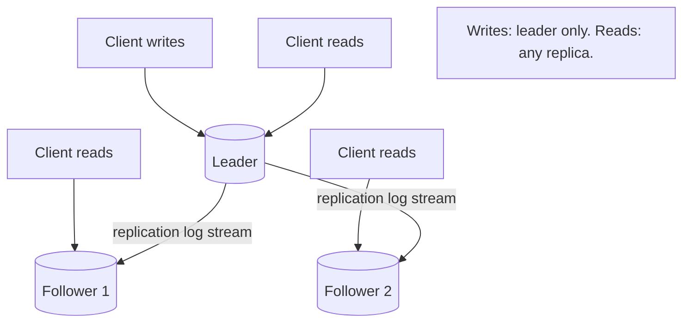
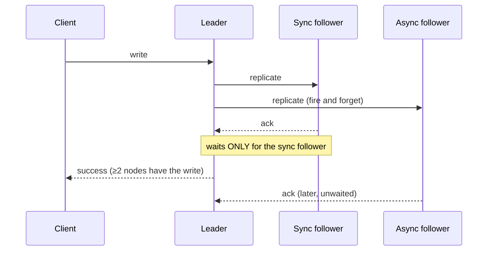

# Single-Leader Replication

**Prerequisites:** Topic 1 (reliability), Topic 6 (the log idea)
**Difficulty:** Intermediate
**Interview importance:** ⭐ **Critical**
**Source:** Chapter 5 — "Leaders and Followers", "Handling Node Outages", "Implementation of Replication Logs"

---

## 1. What Is It?

Replication means keeping a copy of the same data on multiple machines connected by a network. **Single-leader replication** (also master–slave, primary–replica, active/passive) is the most common approach:

- One replica is the **leader**. All writes go to it.
- The others are **followers**. They receive the leader's stream of changes (the **replication log**) and apply them in order.
- **Reads** can go to any replica; **writes** must go to the leader.

This is what PostgreSQL, MySQL, MongoDB, SQL Server, and most managed databases do by default. It's the workhorse.

---

## 2. Why Does It Exist?

Three reasons to replicate at all, and they're distinct:

1. **High availability** — keep serving even if one machine (or datacenter) dies.
2. **Read scaling** — spread read queries across many replicas.
3. **Latency** — put a replica geographically near users.

And a fourth practical one: taking backups or running analytics without loading the primary.

Now, *why single-leader specifically?* Because the alternative — letting any node accept writes — creates **write conflicts**: two nodes independently accept conflicting writes to the same data, and now you must reconcile them (Topics 12, 13). Funneling all writes through one leader means writes are **totally ordered**, so there are no conflicts to resolve. That single property — one place decides the order — is why single-leader is the default, and it's the same property that makes it a bottleneck and a single point of failure.

Note: the difficulty of replication isn't storing copies. It's handling **changes** to replicated data, and everything that can go wrong while changes propagate.

---

## 3. Simple Explanation

One authority, many copies.

Every change is decided by the leader and then broadcast, in order, to the followers. Followers are read-only mirrors that trail slightly behind. If you want to change something, you ask the leader. If you just want to read, any mirror will do — accepting that a mirror might be a moment out of date.

The two big questions this raises, which drive the rest of the chapter:

- **How current are the followers?** (synchronous vs asynchronous — Section 5)
- **What happens when the leader dies?** (failover — Section 6)

---

## 4. Real-World Analogy

**A newspaper's editor-in-chief and regional printing presses.**

The editor (leader) decides the final content and the order of stories. That decision is wired to regional presses (followers), which print identical copies. Readers pick up the paper from whichever press is nearest (read from any replica) — usually current, occasionally a few minutes behind the latest edit (replication lag).

If the editor is unreachable, someone must be promoted to editor. Promote too fast and you might get two people both claiming to be editor, publishing contradictory papers (split-brain). Promote too slow and no new editions go out (downtime). That promotion problem is failover, and it's genuinely hard.

---

## 5. Technical Explanation

### Synchronous vs asynchronous replication

When the leader gets a write, it must send the change to followers — but **does it wait for followers to confirm before telling the client the write succeeded?**

- **Synchronous:** the leader waits for the follower to confirm before reporting success. Guarantee: the follower has an up-to-date copy consistent with the leader. Problem: if the follower doesn't respond (crashed, network, overload), **the write cannot proceed — the leader must block all writes until the follower recovers.**
- **Asynchronous:** the leader sends the change and doesn't wait. Fast, and writes proceed even if all followers are behind. Problem: if the leader fails before a write has propagated, **that write is lost** — even though it was confirmed to the client.

Because fully synchronous is impractical (any one slow follower stalls everything), the common configuration is **semi-synchronous**: **one** follower is synchronous, the rest asynchronous. If the sync follower slows down, another async follower is promoted to sync. This guarantees at least two nodes have every write.

But often replication is **fully asynchronous** for performance. This is a widely used and controversial trade-off: writes are fast, but a leader failure means **confirmed writes can be permanently lost.** The weakened durability sounds bad, but async is used anyway, especially with many followers or geographically distributed ones — because the alternative is that a single slow replica anywhere can halt writes everywhere.

### Setting up new followers

You can't just copy files from the leader — clients keep writing and the data is a moving target, and locking the whole database for a copy would violate high availability. The process:

1. Take a **consistent snapshot** of the leader's database at some point, without locking (most databases support this).
2. Copy the snapshot to the new follower.
3. The follower connects to the leader and requests **all changes since the snapshot**. This requires the snapshot to be associated with an exact position in the leader's replication log (PostgreSQL calls this the log sequence number; MySQL calls it the binlog coordinates).
4. The follower processes the backlog of changes since the snapshot, and is then **caught up**. It continues to process the leader's stream as new changes arrive.

### Handling node outages — the whole point of replication

**Follower failure: catch-up recovery.** Easy. Each follower keeps a log of the changes it has received. On recovery, it knows the last transaction it processed before the fault, requests everything since from the leader, applies it, and it's caught up.

**Leader failure: failover.** Hard. One follower must be promoted to leader, clients reconfigured to send writes there, and other followers set to follow the new leader. This can be manual or automatic. Automatic failover typically:

1. **Determines the leader has failed.** There's no foolproof way to detect this — so most systems use a **timeout**: if a node doesn't respond for, say, 30 seconds, assume it's dead. (This is the network/clock problem of Topic 20 in disguise, and it's why failover is fundamentally hard.)
2. **Chooses a new leader** — via election (majority of remaining replicas) or by a previously designated controller node. The best candidate is usually the one with the most up-to-date data, to minimize loss.
3. **Reconfigures the system** to use the new leader. Clients redirect their writes; the old leader, if it comes back, must be forced to become a follower.

**Failover is fraught with things that can go wrong**, and the book lists them because they're exactly the interview material:

- With **asynchronous** replication, the new leader may not have received all writes from the old leader. If the old leader rejoins, what happens to those writes? The usual approach is to **discard** them — which violates clients' durability expectations. Committed data, gone.
- Discarding writes is **especially dangerous if other storage systems must coordinate**. The book's real example: a GitHub incident where an out-of-date MySQL follower was promoted, the database used autoincrementing primary keys, and the new leader **reused primary keys the old leader had already assigned** — keys that were also referenced in a Redis store — causing some private data to be disclosed to the wrong users.
- **Split brain:** two nodes both believe they're leader, both accept writes, and there's no conflict resolution → data lost or corrupted. Some systems shut one down if two leaders are detected — but if designed carelessly, both can be shut down.
- **Choosing the right timeout is hard.** Too long → longer recovery time after a real failure. Too short → **unnecessary failovers** on a temporary load spike or network blip. And an unnecessary failover during a period of high load makes things *worse*, not better, potentially cascading.

These problems have no easy solutions, which is why some operations teams **prefer to perform failovers manually** even when the software supports automation. The underlying issues — node failure, unreliable networks, and the trade-offs around consistency, durability, availability, and latency — are fundamental problems of distributed systems, developed in Topics 20–26.

### Implementation of replication logs

*How* is the change stream represented? Four methods, worth knowing because they explain why some databases can do zero-downtime version upgrades and others can't.

1. **Statement-based replication.** The leader logs every write *statement* (the SQL) and sends it to followers. Compact, but **fragile**: any nondeterministic function (`NOW()`, `RAND()`) produces different values on each replica; statements with autoincrement or that depend on existing data must execute in exactly the same order; statements with side effects may differ. Workarounds exist (the leader replaces nondeterministic calls with fixed values), but there are many edge cases, so this is now generally avoided.

2. **Write-ahead log (WAL) shipping.** The leader ships its storage-engine WAL (Topics 6, 7) — the exact low-level record of which bytes changed on which disk pages. Followers build an identical copy. **Downside: it's tightly coupled to the storage engine's internal format.** If a version change alters that format, the leader and followers can't run different versions — which means a version upgrade requires **downtime**, because you can't do a rolling upgrade of the database itself.

3. **Logical (row-based) log replication.** Use a *different* log format for replication than for storage, decoupling the two. A logical log describes writes at the granularity of a row: inserts record all new column values; deletes record enough to identify the row; updates record the identity plus new values. **Because it's decoupled from storage internals, it can more easily be kept backward-compatible, allowing the leader and followers to run different database versions — even different storage engines — enabling rolling upgrades.** A logical log is also **easier for external systems to parse**, which is exactly what makes **change data capture** possible (Topic 31). This is a big deal.

4. **Trigger-based replication.** Move replication into the application via database triggers or tools that register custom code on data changes. More flexible (you can replicate a subset, or transform data), but greater overhead, more bugs, and more limitations than built-in replication. Used when you need something the built-in mechanisms can't do.

---

## 6. Diagrams





---

## 7. Concrete Example

**A read-heavy product catalogue for an e-commerce site.**

Reads (browsing) hugely outnumber writes (catalogue updates). Single-leader is ideal:

- Writes (admin edits) go to the leader — infrequent, no contention.
- The read fleet (product pages) scales by adding followers.
- If a follower dies, traffic shifts to others; it catches up on return.
- If the leader dies, failover promotes a follower — with a window where writes are unavailable, which is acceptable since catalogue edits aren't urgent.

The reason it fits: **the write-conflict problem never arises** (one leader), and the read-scaling need is exactly what followers provide. Contrast a collaborative document editor, where every user writes constantly — single-leader would funnel all edits through one node and add latency for distant users, which is why those systems reach for multi-leader (Topic 12).

---

## 8. When to Use / Not Use

**Use single-leader when:** reads dominate writes; you want strong-ish consistency and no conflict resolution; write volume fits one machine; a brief write-unavailability window during failover is acceptable; you value operational simplicity (this is the well-trodden path).

**Avoid / look elsewhere when:** you need multi-datacenter *writes* with low latency everywhere (→ multi-leader); you need to accept writes during network partitions on both sides (→ leaderless); write throughput exceeds one machine (→ partitioning, Topic 14, on top); you cannot tolerate any write-unavailability during failover.

---

## 9. Advantages & Disadvantages

**Advantages**
- **No write conflicts** — writes are totally ordered by the leader.
- Simple to understand and operate; the default, so tooling is mature.
- Reads scale horizontally by adding followers.
- Consistency is easy to reason about relative to the alternatives.

**Disadvantages**
- The **leader is a single point of failure** for writes; failover is hard and dangerous.
- **Write throughput is capped** by one machine (until you partition).
- **Async replication can lose confirmed writes** on failover.
- **Replication lag** causes read anomalies (Topic 11).
- Failover risks: split brain, discarded writes, timeout tuning, the GitHub-style cascade.

---

## 10. Trade-off Table

| Choice | Advantages | Disadvantages | When to Use |
|---|---|---|---|
| Synchronous replication | No data loss on leader failure; follower guaranteed current | One slow follower stalls all writes | When durability is non-negotiable and followers are few/close |
| Asynchronous replication | Fast writes; unaffected by slow/distant followers | Confirmed writes lost on leader failure | High throughput, many/distant followers (very common) |
| Semi-synchronous (one sync) | ≥2 nodes have every write; not stalled by all followers | Still some coordination cost | Sensible middle ground for durability |
| Automatic failover | Fast recovery, no human at 3 a.m. | Split brain, wrong-node promotion, spurious failover | Mature setups with good fencing |
| Manual failover | Human judgment avoids the worst mistakes | Slow; needs someone available | When the failover edge cases are too risky to automate |
| Statement-based log | Compact | Nondeterminism breaks it | Legacy; largely avoided |
| WAL shipping | Efficient; exact | Storage-coupled → **no rolling version upgrades** | Same-version clusters |
| Logical (row-based) log | Version-independent; **enables CDC** and rolling upgrades | Slightly more overhead | Modern default; anything feeding downstream systems |

---

## 11. Failure Scenarios

| Scenario | Consequence | Handling |
|---|---|---|
| Follower crashes | Falls behind | **Catch-up recovery** from its own log |
| Leader crashes (async) | Unacked *and acked-but-unpropagated* writes lost | **Failover**; accept possible loss, or use semi-sync |
| Split brain (two leaders) | Conflicting writes, corruption | Fencing (Topic 22); shut down one leader; STONITH |
| Old leader rejoins after failover | Its extra writes conflict with new leader | Discard them (data loss) or reconcile |
| Failover timeout too short | Spurious failover during a load spike → cascade | Tune timeout; back off under load |
| Reused autoincrement keys (GitHub case) | Cross-system corruption; data disclosed to wrong users | Coordinate ID generation; don't reuse keys; test failover |
| WAL-shipping cluster mid-version-upgrade | Followers can't read leader's new WAL format | Use logical log replication for rolling upgrades |

---

## 12. Production Considerations

- **Know your replication mode.** "We have replicas" doesn't tell you whether a leader failure loses data. Async does; find out.
- **Prefer logical replication** if anything downstream needs the change stream (CDC, search index, cache), or if you want rolling database upgrades.
- **Monitor replication lag per follower** — it's the metric that predicts both stale reads and how much data you'd lose on failover.
- **Test failover deliberately**, on a schedule. Failover paths that are only exercised in real incidents don't work.
- **Have a fencing story** for the old leader so a rejoin can't cause split brain (Topic 22).
- **Don't read-scale into staleness blindly** — moving reads to followers introduces lag anomalies (Topic 11). Route consistency-sensitive reads to the leader.

---

## ❌ 13. Common Mistakes

- **Assuming replicas mean zero data loss.** With async replication, a leader failure loses confirmed writes.
- **Setting the failover timeout too short**, causing spurious failovers that make load spikes catastrophic.
- **No fencing for the old leader** → split brain when it rejoins.
- **WAL shipping when you need rolling upgrades.** You've coupled your cluster to one database version.
- **Statement-based replication with `NOW()`/`RAND()`.** Replicas diverge silently.
- **Reading from followers for something that must be current** (e.g., "show the profile I just saved") without a read-your-writes strategy (Topic 11).
- **Never testing failover.** The GitHub incident is what untested failover looks like.

---

## 🧠 14. Think Like an Engineer

```
Do reads dominate writes? → single-leader fits
        ↓
Can I tolerate ANY confirmed-write loss on leader failure?
   no  → synchronous / semi-synchronous
   some→ asynchronous (accept the risk explicitly)
        ↓
Does anything downstream need the change stream? → logical log
Do I need rolling DB version upgrades?            → logical log
        ↓
Automatic or manual failover? (how good is my fencing?)
        ↓
What's my failover timeout, and does it back off under load?
        ↓
Which reads MUST be current, and how do I route those to the leader?
        ↓
Have I actually tested a failover this quarter?
```

---

## 15. Mental Model

```
One leader orders all writes → no conflicts (the whole reason it's the default)
      ↓
Followers trail behind → lag → stale reads (Topic 11)
      ↓
Async = fast but can lose confirmed writes on failover
      ↓
Failover is the hard part: detect (timeout), elect, reconfigure, fence
      ↓
Every failover failure mode = "we can't detect failure reliably" (Topic 20)
```

---

## 🔗 16. How This Connects to Other Concepts

- **Replication Lag (Topic 11)** — the direct consequence of followers trailing; the read guarantees that fix it.
- **Multi-Leader / Leaderless (Topics 12, 13)** — what you reach for when single-leader's constraints don't fit.
- **Partitioning (Topic 14)** — replicate *and* partition; each partition typically has its own leader.
- **Unreliable Networks (Topic 20)** — failover detection via timeout is the network problem; this is where "why is failover hard" gets its real answer.
- **Truth & Fencing (Topic 22)** — split-brain prevention; fencing tokens stop a resurrected old leader.
- **Consensus (Topic 26)** — leader election *is* consensus. Single-leader "kicks the can" — it still needs consensus for leadership changes.
- **CDC & Event Sourcing (Topic 31)** — the logical replication log is what CDC taps into.

---

## 17. Interview Questions & Answers

**Beginner**

**Q: What is single-leader replication?**
One replica is the leader and takes all writes; the others are followers that receive the leader's stream of changes and apply them in order. Reads can go to any replica, writes must go to the leader. The reason writes funnel through one node is that it gives a single, total order of writes, so there are no conflicts to resolve — which is why it's the default in most databases.

**Q: What's the difference between synchronous and asynchronous replication?**
Synchronous means the leader waits for a follower to confirm before telling the client the write succeeded, so that follower is guaranteed current — but if it's slow or down, writes stall. Asynchronous means the leader doesn't wait, so writes are fast and unaffected by slow followers, but if the leader fails before a write propagates, that write is lost even though the client was told it succeeded. Most systems run a semi-synchronous middle ground: one follower synchronous, the rest async.

**Intermediate**

**Q: Why is failover hard?**
Because the first step — deciding the leader is actually dead — has no reliable answer. You can't distinguish a dead leader from a slow one or a network blip, so you use a timeout, and both directions of tuning are bad: too short causes spurious failovers, which during a load spike make things worse; too long means long outages. Then, with async replication, the promoted follower may be missing writes the old leader had confirmed, so you either lose them or face reconciliation. And if the old leader comes back thinking it's still leader, you get split brain. GitHub had an incident where a stale follower was promoted and reused autoincrement keys that a Redis store still referenced, disclosing data to the wrong users — that's the failure mode made concrete.

**Q: What's split brain and how do you prevent it?**
Split brain is two nodes both believing they're leader and both accepting writes, with no conflict resolution, so data gets lost or corrupted. Prevention is fencing: ensure the old leader can't keep acting as leader after a new one is chosen — for example by requiring a majority to elect a leader so a minority-side old leader can't get quorum, and by using fencing tokens so storage rejects writes from a deposed leader. Some systems will shut a node down if they detect two leaders, though you have to design that carefully so you don't shut down both.

**Q: Why does the choice of replication log format matter?**
Because it determines whether you can do rolling upgrades and whether downstream systems can consume the change stream. Statement-based replication breaks on nondeterministic functions. WAL shipping is efficient but tied to the storage engine's internal format, so the leader and followers must run the same version — which means version upgrades need downtime. Logical, row-based replication decouples the replication format from storage, so different versions and even different storage engines can interoperate, enabling rolling upgrades — and because it's a clean, parseable format, it's exactly what change data capture taps into to feed search indexes and caches.

**Advanced / Staff**

**Q: You're designing failover for a payments database. Auto or manual, and why?**
For payments I'd lean toward not fully automating the promotion decision, or at least gating it heavily, because the cost of a wrong failover — split brain or discarded confirmed writes — is a financial correctness problem, not just downtime. I'd run semi-synchronous replication so every confirmed write is on at least two nodes, which bounds the data-loss risk if a promotion does happen. I'd require majority-based election so a partitioned minority can't promote a stale node, and fencing tokens so a deposed leader's writes are rejected by storage. If I did automate, I'd make the timeout adaptive and back off under high load, since that's exactly when spurious failovers cascade. And I'd rehearse failover regularly, because an untested path is the actual risk. The general principle is that for payments I'd rather be down for a bounded window than up with two leaders.

**Q: How would you scale a single-leader system whose writes have outgrown one machine?**
Single-leader caps write throughput at one node, so read replicas won't help — the fix is partitioning on top of replication. I'd shard the data by a key that spreads write load evenly and keeps related data that's written together in the same partition, so most transactions stay single-partition. Each partition gets its own leader and its own followers, so writes scale with partition count and reads still scale with followers. The costs I'd be explicit about: cross-partition transactions become hard (Topic 25), secondary indexes now span partitions with an unavoidable trade-off (Topic 15), and rebalancing becomes an operational concern (Topic 16). I'd choose the partition key to minimize cross-partition operations, because that's what keeps the system reasoning-about-able. If the write scaling need is modest, I'd first check whether it's really throughput or just a hot row, because the latter is a schema problem, not a sharding one.

---

## 🎯 30-Second Interview Answer

> "Single-leader replication routes all writes through one leader, which streams its changes to read-only followers. The reason it's the default is that one leader gives a total order of writes, so there are no conflicts to resolve. The two hard problems are lag and failover. Async replication is fast but means a leader failure can lose confirmed writes, so people run semi-synchronous — one follower sync — to bound that. Failover is genuinely hard because you can't reliably tell a dead leader from a slow one, so you use timeouts, and both a stale-node promotion and a returning old leader can cause data loss or split brain. And the replication log format matters more than people expect: logical row-based replication decouples from storage internals, which is what enables rolling upgrades and change data capture, versus WAL shipping which locks you to one database version."

---

## ⚡ Quick Revision

- **Single-leader:** all writes → leader; followers apply the replication log in order; reads from any replica.
- **Why default:** one leader = total write order = **no conflicts**.
- **Sync:** follower guaranteed current, but a slow follower stalls writes. **Async:** fast, but confirmed writes can be **lost on failover**. **Semi-sync:** one sync follower → ≥2 copies.
- **New follower:** snapshot + log position → copy → replay backlog → caught up.
- **Follower failure:** easy — catch-up recovery. **Leader failure:** hard — failover.
- **Failover dangers:** can't detect failure (timeout), lost writes, **split brain**, wrong-node promotion, GitHub-style cross-system corruption, spurious failover under load.
- **Log formats:** statement-based (fragile), **WAL shipping** (storage-coupled, no rolling upgrades), **logical/row-based** (version-independent, enables CDC — the modern default), trigger-based (flexible, costly).
- Leader election **is consensus** (Topic 26).
