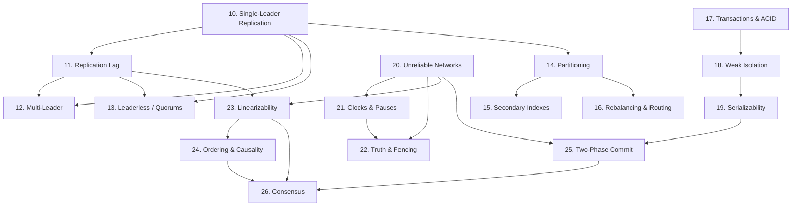

# 00 - Part II: Distributed Data Systems

**Covers:** Chapters 5–9 of DDIA
**Scope:** what changes when data lives on **more than one machine**. This is the hard part of the book, and the highest-yield part for senior/staff interviews.

---

## Chapter Overview

Part I lived on one machine. Part II asks: why leave it, and what does it cost?

**Why distribute at all** (three reasons, from the Part II intro):

1. **Scalability** — the data or load exceeds one machine.
2. **Fault tolerance / high availability** — survive a machine (or datacenter) dying.
3. **Latency** — put data geographically close to users.

**Two ways to distribute:**

- **Replication** — keep a copy of the *same* data on several machines. (Chapter 5)
- **Partitioning (sharding)** — split the data into subsets, each on a different machine. (Chapter 6)

These are orthogonal and usually combined: partition the data, then replicate each partition.

Then Part II confronts the consequences:

- **Transactions** (Chapter 7) — the abstraction that hides concurrency and faults. Mostly single-node, but the foundation for what follows.
- **The Trouble with Distributed Systems** (Chapter 8) — the reality: unreliable networks, unreliable clocks, process pauses, and the defining property that **partial failure is undetectable**.
- **Consistency and Consensus** (Chapter 9) — what guarantees you can buy back, and their price. The intellectual peak of the book.

---

## The One Idea That Organizes Everything Here

> **On one machine, an operation either happens or it doesn't, and you know which. Across a network, an operation may have happened, may not have, and you cannot tell — because a request that times out is indistinguishable from one that succeeded but whose reply was lost.**

That single uncertainty — **partial failure you can't detect** — is the source of nearly every difficulty in Part II. Replication conflicts, split-brain, the need for fencing tokens, the impossibility results, the reason consensus is hard — all of it traces back to "I sent a message and I don't know what happened."

Keep that sentence in mind and the whole of Part II hangs together.

---

## What You Will Learn

- The three replication architectures (single-leader, multi-leader, leaderless) and exactly when each fits.
- Why asynchronous replication can lose committed data on failover, and the read guarantees (read-your-writes, monotonic reads, consistent prefix) that paper over lag.
- Quorums: the `w + r > n` rule, and why it does *not* actually guarantee you read fresh data.
- Partitioning strategies, hot spots, and the two ways to partition a secondary index (and why both hurt).
- ACID precisely — including that "consistency" is the odd one out — and the race conditions weak isolation lets through: dirty reads/writes, lost updates, write skew, phantoms.
- The three ways to implement serializability, and their trade-offs.
- Why you can't trust clocks for ordering, why timeouts can't detect failure, and what a **fencing token** is.
- Linearizability, why CAP is a poor framing, and what causality buys you more cheaply.
- Two-phase commit, why it blocks, and what consensus actually is — plus the surprising list of problems that all reduce to consensus.

---

## Prerequisites

Part I, especially: Reliability (Topic 1), Scalability (Topic 2), Storage/LSM (Topic 6 — the replication log is the same append-only-log idea), and Encoding (Topic 9 — the timeout/idempotence discussion).

---

## Topics

| # | File | Difficulty | Interview Importance |
|---|------|-----------|---------------------|
| 10 | `01-single-leader-replication.md` | Intermediate | **Critical** |
| 11 | `02-replication-lag.md` | Intermediate | **Critical** |
| 12 | `03-multi-leader-replication.md` | Advanced | High |
| 13 | `04-leaderless-replication.md` | Advanced | **Critical** |
| 14 | `05-partitioning-strategies.md` | Intermediate | **Critical** |
| 15 | `06-secondary-indexes.md` | Advanced | High |
| 16 | `07-rebalancing-and-routing.md` | Intermediate | High |
| 17 | `08-transactions-acid.md` | Intermediate | **Critical** |
| 18 | `09-weak-isolation.md` | Advanced | **Critical** |
| 19 | `10-serializability.md` | Advanced | High |
| 20 | `11-unreliable-networks.md` | Intermediate | **Critical** |
| 21 | `12-clocks-and-pauses.md` | Advanced | High |
| 22 | `13-truth-and-fencing.md` | Advanced | High |
| 23 | `14-linearizability.md` | Advanced | **Critical** |
| 24 | `15-ordering-and-causality.md` | Advanced | High |
| 25 | `16-two-phase-commit.md` | Advanced | High |
| 26 | `17-consensus.md` | Advanced | **Critical** |

---

## Concept Dependency Diagram

Everything drains into **Consensus (26)**. That's not an accident — Chapter 9's thesis is that a startling range of distributed problems are all the same problem wearing different clothes.

---

## Recommended Learning Order

**Straight through (10 → 26)** is the intended path and it builds carefully.

**Interview sprint order** (if short on time): 10 → 11 (replication + lag are the highest-yield pair in the book) → 14 (partitioning) → 17 → 18 (transactions + write skew) → 20 (networks) → 23 (linearizability + CAP) → 26 (consensus). That subset covers the questions that actually get asked.

**The two "aha" files:** Topic 20 (unreliable networks) reframes everything — read it slowly. Topic 23 (linearizability/CAP) is where most candidates either sound senior or sound like they memorized a blog post; the difference is being able to say *why CAP is a bad frame.*

---

## Chapter Summary — Part II in seven lines

1. Replication keeps the same data on many machines; three architectures, each with a distinct conflict/consistency profile.
2. Asynchronous replication is fast but lags, and lag causes anomalies you patch with specific read guarantees.
3. Partitioning splits data for scale; the enemy is skew (hot spots), and secondary indexes force an unavoidable choice.
4. Transactions convert a mess of failure cases into a single retryable abort.
5. Weak isolation levels are fast and let subtle race conditions through — write skew is the one people miss.
6. The network is unreliable, clocks lie, and processes pause — so **you cannot detect failure**, only suspect it.
7. Linearizability and consensus are the strong guarantees; they're expensive, they're equivalent to many other problems, and often you can get by with less.
