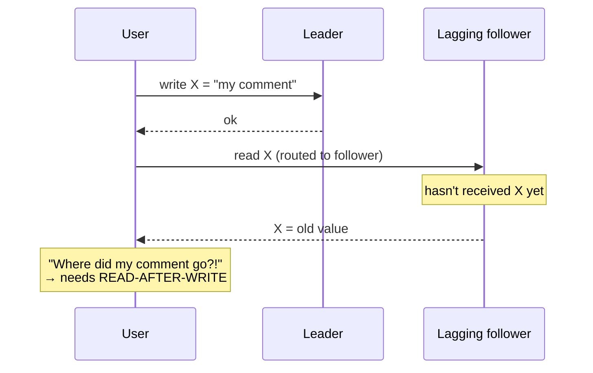
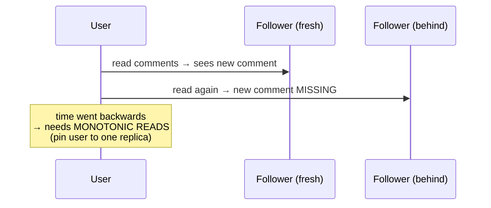
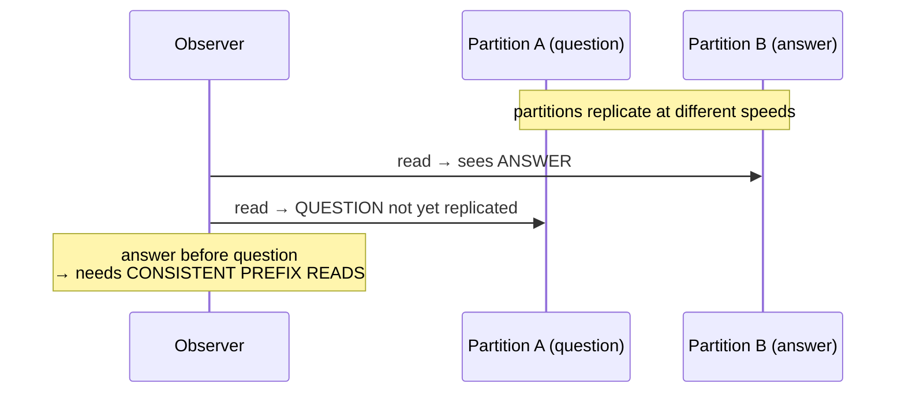

# 02 - Replication Lag & Consistency Guarantees

**Prerequisites:** Topic 10 (single-leader replication)
**Difficulty:** Intermediate
**Interview importance:** ⭐ **Critical**
**Source:** Chapter 5 — "Problems with Replication Lag"

---

## 1. What Is It?

**Replication lag** is the delay between a write being applied on the leader and that same write appearing on a follower.

When you read from a follower, you might read data that's out of date — because the write hasn't caught up yet. The lag might be a fraction of a second (unnoticeable) or several seconds/minutes (very noticeable) if the system is near capacity or the network is degraded.

The read guarantees in this file — **read-after-write**, **monotonic reads**, **consistent prefix reads** — are the specific consistency properties you add back to hide specific anomalies caused by lag.

---

## 2. Why Does It Exist?

Recall from Topic 10: to scale reads, you route them to followers. And to keep writes fast, you replicate asynchronously.

Both are good decisions. Together they produce a system that is **eventually consistent**: if writes stop, followers eventually catch up and all replicas converge. "Eventually" is deliberately vague — there's no bound.

The problem is what happens *before* eventually. A user does something, the write lands on the leader, then the user immediately reads — and gets routed to a follower that hasn't caught up. They see stale data. Worse, the stale data is often *their own recent action missing*, which reads as a bug: "I just posted that comment, where did it go?"

So the guarantees exist because **eventual consistency is too weak for specific, common user interactions**, and full strong consistency is too expensive. Each guarantee is a targeted patch for one class of anomaly, bought cheaply.

---

## 3. Simple Explanation

Three distinct anomalies, three distinct fixes. This structure is the whole file — learn the pairing:

| Anomaly | What the user sees | The guarantee that fixes it |
|---|---|---|
| Read your own write is missing | "I saved it and it's gone" | **Read-after-write consistency** |
| Data goes *backwards* on refresh | Comment appears, then vanishes | **Monotonic reads** |
| Effect appears before its cause | Answer shown before its question | **Consistent prefix reads** |

Each is caused by lag. Each is fixed by controlling *which replica* a read goes to, or by tracking *how current* a read must be.

---

## 4. Real-World Analogy

**A group chat mirrored across noticeboards in different rooms.**

- **Read-after-write:** you pin a note in room A, then walk to room B and it's not there yet. You expect to see your own note. Fix: always check the board where you posted, or wait until it's synced everywhere.
- **Monotonic reads:** you check board A (updated), then board B (behind), and a note you already saw has *disappeared*. Time went backwards. Fix: always read from the *same* board, so you never move to a more-stale one.
- **Consistent prefix reads:** on board B you see "Answer: 42" before "Question: what's 6×7?" because the answer note arrived first. Cause and effect scrambled. Fix: ensure related notes appear in causal order.

---

## 5. Technical Explanation

### Anomaly 1: Reading your own writes → read-after-write consistency

The user submits data (a comment), then views it. If the view reads from a lagging follower, the data appears lost. **Read-after-write consistency** (a.k.a. read-your-writes) guarantees that a user *always sees updates they themselves submitted* — though it says nothing about *other* users' writes.

Implementation techniques from the book:

- **Read things the user may have modified from the leader; everything else from followers.** E.g., always read a user's *own* profile from the leader, others' profiles from followers. Simple when most things aren't user-editable.
- **If most things are potentially editable**, that approach negates the read-scaling benefit. Instead, track the **time of the last update** and, for one minute after, serve all reads from the leader. Also monitor follower lag and stop serving from any follower more than a minute behind.
- **The client remembers the timestamp of its most recent write.** The system ensures the replica serving that user's reads reflects updates at least until that timestamp. If a replica isn't current enough, either route to another replica or wait. The timestamp can be a **logical timestamp** (something that orders writes, like a log sequence number) or the actual system clock (which needs clock sync — Topic 21).

An extra wrinkle: **cross-device** read-after-write. If the user writes on their phone and reads on their laptop, the laptop doesn't know the phone's timestamp — so metadata must be centralized. And the two devices may hit different datacenters, so if your approach requires reading from the leader you must route both devices' requests to the same datacenter.

### Anomaly 2: Moving backward in time → monotonic reads

A user makes several reads. First read hits a fresh follower and sees a new comment; a subsequent read hits a more-behind follower and the comment is **gone**. The user sees time move backwards. This is possible when reading from *multiple* replicas, each at a different lag.

**Monotonic reads** is a guarantee weaker than strong consistency but stronger than eventual consistency: when a user makes several reads in sequence, **they will not see time go backward** — they won't read older data after previously reading newer data.

Implementation: **each user always reads from the same replica** (different users can use different replicas). The replica can be chosen by a hash of the user ID rather than randomly. If that replica fails, the user's queries must be rerouted.

### Anomaly 3: Cause before effect → consistent prefix reads

A conversation: Mr. Poons asks "how far into the future can you see?" and Mrs. Cake answers "about ten seconds." An observer reading a lagging replica might see the *answer* before the *question* — nonsense, because the answer causally depends on the question.

This is a specific violation of **causality**. It happens especially in **partitioned (sharded) databases**, where different partitions replicate independently at different speeds — there's no global write order, so one partition's writes can be visible while a causally-earlier write on another partition isn't yet.

**Consistent prefix reads** guarantees: if a sequence of writes happens in a certain order, anyone reading them sees them in the same order. Causally-related writes are never seen out of order.

Implementation: ensure causally-related writes are written to the same partition, so they replicate together and can't be reordered. But this can't always be done efficiently, so some systems track causal dependencies explicitly (an area of research the book returns to in Topic 24).

### The overarching tension

Working with an eventually-consistent system requires you to **constantly think about how the code behaves when replication lag increases to minutes or hours.** If that's a bad user experience, design the system to provide a stronger guarantee — but pretending replicas are current when they're not ("weak lies") is a recipe for subtle bugs found only under load or partition.

The book's forward-looking point: transactions are the traditional way databases provide stronger guarantees, but in the move to distributed (especially multi-leader/leaderless) systems, many have abandoned them, claiming they're too expensive for performance and availability, and asserting eventual consistency is inevitable at scale. That's partly true and partly an overstatement — richer guarantees are explored in Topics 17–26.

---

## 6. Diagrams







---

## 7. Concrete Example

**A social feed on a read-replica architecture.**

- **User posts a comment, then their page reloads.** Without read-after-write, the reload hits a lagging follower and the comment is missing → support ticket. Fix: for 60 seconds after a user's write, route *their* reads to the leader (or a sufficiently-current follower), keyed by the user's last-write timestamp.
- **User refreshes twice quickly**, hitting two followers at different lag. A reply they saw vanishes → confusing. Fix: hash the user ID to a fixed replica (monotonic reads).
- **A threaded discussion sharded by thread.** A reply on one shard is visible before the parent comment on another shard → nonsensical order. Fix: keep a thread's writes on one partition (consistent prefix), or track causal dependencies.

The instructive part: these are three *different* bugs with three *different* fixes, all from the same root cause. Interviewers like this because a candidate who lumps them into "eventual consistency is bad" hasn't understood it; one who names the specific anomaly and its specific fix has.

---

## 8. When to Use / Accept What

**Accept plain eventual consistency when:** staleness of a few seconds is harmless (view counts, non-critical analytics, most public content); the read-scaling benefit is worth it; users don't expect to see their own writes reflected instantly in that view.

**Add read-after-write when:** users edit their own data and immediately view it (profiles, settings, posts). Nearly always needed for anything user-editable.

**Add monotonic reads when:** users make repeated reads and backward-moving data would confuse or alarm them.

**Add consistent prefix reads when:** there are causal relationships across writes (conversations, event sequences), especially in partitioned systems.

**Reach for stronger consistency (Topics 17–26) when:** the anomalies matter enough that per-anomaly patches become unmanageable, or correctness (not just UX) is at stake.

---

## 9. Advantages & Disadvantages

**Eventual consistency + targeted guarantees — advantages:** keeps async replication's speed and read scaling; each guarantee is cheap and targeted; you pay only for the consistency you actually need.

**Disadvantages:** application complexity — you must reason about lag everywhere; read-after-write via leader-routing erodes read-scaling gains; cross-device and cross-datacenter cases are genuinely fiddly; the anomalies are intermittent and load-dependent, so they're hard to reproduce and easy to ship.

---

## 10. Trade-off Table

| Guarantee | Fixes | Typical implementation | Cost |
|---|---|---|---|
| Eventual consistency (none) | — | Read any replica | Cheapest; all three anomalies possible |
| Read-after-write | "my write vanished" | Read own recent writes from leader; last-write timestamp | Some reads go to leader → less scaling |
| Monotonic reads | "data went backwards" | Pin user to one replica (hash user ID) | Uneven replica load; reroute on failure |
| Consistent prefix reads | "effect before cause" | Same partition for causal writes; or track causality | Partitioning constraint; complexity |
| Strong consistency (Topics 17–26) | all of the above | Read from leader / consensus / linearizable store | Latency, availability, cost |

---

## 11. Failure Scenarios

| Scenario | Consequence | Handling |
|---|---|---|
| Follower far behind under load | Very stale reads | Monitor lag; remove followers past a threshold from the read pool |
| Read-after-write via clock timestamp, clocks skewed | Wrong "is this replica current?" decision | Use logical timestamps (LSN), not wall clock (Topic 21) |
| Pinned replica (monotonic) dies | User's reads fail | Reroute to another replica; may briefly break monotonicity |
| Cross-device read-after-write | Laptop can't see phone's write | Centralize last-write metadata; route both to same DC |
| Partition-independent lag | Consistent-prefix violation | Co-locate causal writes; causal tracking |
| Lag spikes silently | Widespread stale reads, no alert | Alert on lag, not just replica liveness |

---

## 12. Production Considerations

- **Monitor replication lag per follower** and expose it. This one metric predicts every anomaly here and how much data a failover would lose.
- **Use logical positions (LSN/binlog coordinates), not wall-clock time**, for "is this replica current enough" — clocks are unreliable (Topic 21).
- **Eject lagging followers from the read pool** automatically past a threshold.
- **Decide read routing per query class**, not globally: consistency-sensitive reads → leader/current follower; the rest → any follower.
- **Test under induced lag.** Anomalies only appear when lag is nonzero; a healthy cluster hides them.
- **Document which reads have which guarantee.** Otherwise a future change silently downgrades a read that needed read-after-write.

---

## ❌ 13. Common Mistakes

- **Assuming "eventually consistent" is good enough** without checking the specific user interactions. It fails read-your-writes constantly.
- **Using wall-clock timestamps** for read-after-write routing across machines. Clock skew makes the decision wrong.
- **Random replica selection** breaking monotonic reads. Pin the user.
- **Forgetting the cross-device case.** The phone-write/laptop-read gap surprises people.
- **Ignoring partitioned consistent-prefix.** Independent per-partition lag reorders causal events.
- **Only alerting on replica liveness.** A follower that's up but 5 minutes behind is a worse failure and pages nobody.
- **Solving lag by "just read from the leader everywhere,"** which throws away the entire reason you added followers.

---

## 🧠 14. Think Like an Engineer

```
For this specific read, does the user expect to see THEIR OWN recent write?
   yes → read-after-write (route own recent reads to leader/current follower)
        ↓
Will the user make repeated reads where backward motion would confuse?
   yes → monotonic reads (pin to one replica)
        ↓
Are there causal relationships across writes / across partitions?
   yes → consistent prefix (co-locate causal writes / track causality)
        ↓
Is any of this a correctness issue, not just UX?
   yes → consider strong consistency (Topics 17–26)
        ↓
Am I using logical positions, not wall clocks, to judge freshness?
Am I monitoring per-follower lag and ejecting stale ones?
```

---

## 15. Mental Model

```
Async replication + read from followers = eventual consistency
      ↓
Three anomalies from lag:
   my write vanished      → read-after-write   (which replica for MY reads)
   data went backwards    → monotonic reads    (same replica each time)
   effect before cause    → consistent prefix  (causal writes together)
      ↓
Each patch buys ONE guarantee cheaply.
Pay for strong consistency only when patches stop being enough.
```

---

## 🔗 16. How This Connects to Other Concepts

- **Single-Leader Replication (Topic 10)** — lag is the direct cost of async replication and follower reads.
- **Partitioning (Topic 14)** — consistent-prefix violations are worst in partitioned systems with independent per-partition lag.
- **Clocks & Pauses (Topic 21)** — why you must use logical timestamps, not wall clocks, to judge replica freshness.
- **Linearizability (Topic 23)** — the strong guarantee that eliminates all three anomalies at once, and its price.
- **Ordering & Causality (Topic 24)** — consistent prefix reads are a causality guarantee; Chapter 9 develops causality fully.
- **Transactions (Topic 17)** — the classic mechanism for stronger guarantees that many distributed systems abandoned.

---

## 17. Interview Questions & Answers

**Beginner**

**Q: What is replication lag?**
The delay between a write being applied on the leader and appearing on a follower. Because followers usually replicate asynchronously, a read from a follower can return stale data during that window. The lag is normally sub-second but can grow to seconds or minutes under load or network trouble.

**Q: What is read-after-write consistency?**
A guarantee that a user always sees their own recent writes, even reading from a replica. It says nothing about seeing other users' writes promptly — just that your own edits don't appear to vanish. It's the fix for the "I saved it and it's gone" bug that pure eventual consistency causes.

**Intermediate**

**Q: Name the three anomalies caused by replication lag and their fixes.**
Reading your own writes and finding them missing, fixed by read-after-write consistency — route the user's own recent reads to the leader or a sufficiently current follower. Data appearing to move backwards across successive reads, fixed by monotonic reads — pin each user to a single replica, usually by hashing their ID. And seeing an effect before its cause, which happens across partitions replicating at different speeds, fixed by consistent prefix reads — keep causally related writes in the same partition or track causal dependencies explicitly. They're three distinct bugs with three distinct fixes, all from the same root cause.

**Q: How do you implement read-after-write when most data is user-editable?**
Routing all editable reads to the leader would kill read scaling, so instead you track the timestamp of the user's last write and only route reads to the leader — or to a follower known to be current past that timestamp — for a short window afterward, say a minute. The timestamp should be a logical position like a log sequence number rather than wall-clock time, because comparing wall clocks across machines is unreliable. And you monitor follower lag so you never serve a user's post-write read from a replica that's behind their last write.

**Q: Why is consistent prefix reads specifically a partitioning problem?**
Because in a single-partition system there's one replication stream in a fixed order, so a follower can be behind but never reordered. Once you partition, each partition replicates independently at its own speed, so one partition's write can be visible while a causally earlier write on another partition hasn't arrived — the answer shows up before the question. There's no global order to lean on, which is why the fix is either co-locating causal writes on one partition or tracking causality explicitly.

**Advanced / Staff**

**Q: Design read consistency for a system where users post content and immediately view it, on multiple devices, across two datacenters.**
The base need is read-after-write for the poster's own content. Within one device I'd track the user's last-write logical position and, for a window after a write, only serve their reads from a replica current past that position, ejecting lagging followers from the pool. The cross-device case breaks the naive approach, because the laptop doesn't know the phone's write position, so I'd centralize the last-write metadata per user in a store both devices consult. The cross-datacenter case adds two problems: replication between datacenters lags more, and if my freshness strategy relies on reading from the leader, both devices need to route to the datacenter holding that leader — so I'd pin a user's requests to one datacenter for the post-write window. For reads of *other* users' content I'd accept eventual consistency and add monotonic reads by pinning each user to one replica, so their feed doesn't flicker backwards. I'd only escalate to a linearizable read path for content where staleness is a correctness issue rather than a UX one, because that path is much more expensive.

**Q: When would you stop patching anomalies and move to strong consistency?**
When the patches start interacting and the per-query routing logic becomes a source of bugs in its own right, or when an anomaly stops being a UX annoyance and becomes a correctness problem — for instance, a balance check that reads stale data and lets an overdraw through. At that point the cost of reasoning about lag everywhere exceeds the cost of a linearizable read path or a transaction, and I'd rather pay a known latency cost than keep chasing intermittent, load-dependent bugs. I'd still scope it narrowly — make the specific correctness-critical reads strong and leave the rest eventually consistent — because making everything linearizable throws away the scaling and availability that async replication bought.

---

## 🎯 30-Second Interview Answer

> "Replication lag is the window where a follower hasn't caught up to the leader, so follower reads can be stale. It produces three specific anomalies, each with its own fix. Reading your own write and finding it missing — fixed by read-after-write consistency, routing your own recent reads to the leader. Data appearing to go backwards across reads — fixed by monotonic reads, pinning each user to one replica. And seeing an effect before its cause, which happens across partitions replicating at different rates — fixed by consistent prefix reads, keeping causal writes together. The key judgment is that these are cheap, targeted patches, and you add only the ones a given interaction needs; you escalate to full strong consistency only when the anomaly becomes a correctness issue rather than a UX one."

---

## ⚡ Quick Revision

- **Replication lag** = leader-to-follower delay → stale follower reads → **eventual consistency**.
- **Three anomalies, three fixes:**
  - Own write missing → **read-after-write** (route own recent reads to leader; track last-write **logical** position).
  - Data goes backwards → **monotonic reads** (pin user to one replica, e.g. hash user ID).
  - Effect before cause → **consistent prefix reads** (co-locate causal writes; worst in **partitioned** systems).
- **Use logical timestamps (LSN), not wall clocks**, to judge replica freshness.
- **Cross-device / cross-datacenter** read-after-write needs centralized last-write metadata and DC pinning.
- **Monitor per-follower lag**; eject stale followers from the read pool.
- Escalate to **strong consistency** only when an anomaly is a correctness (not UX) problem.
