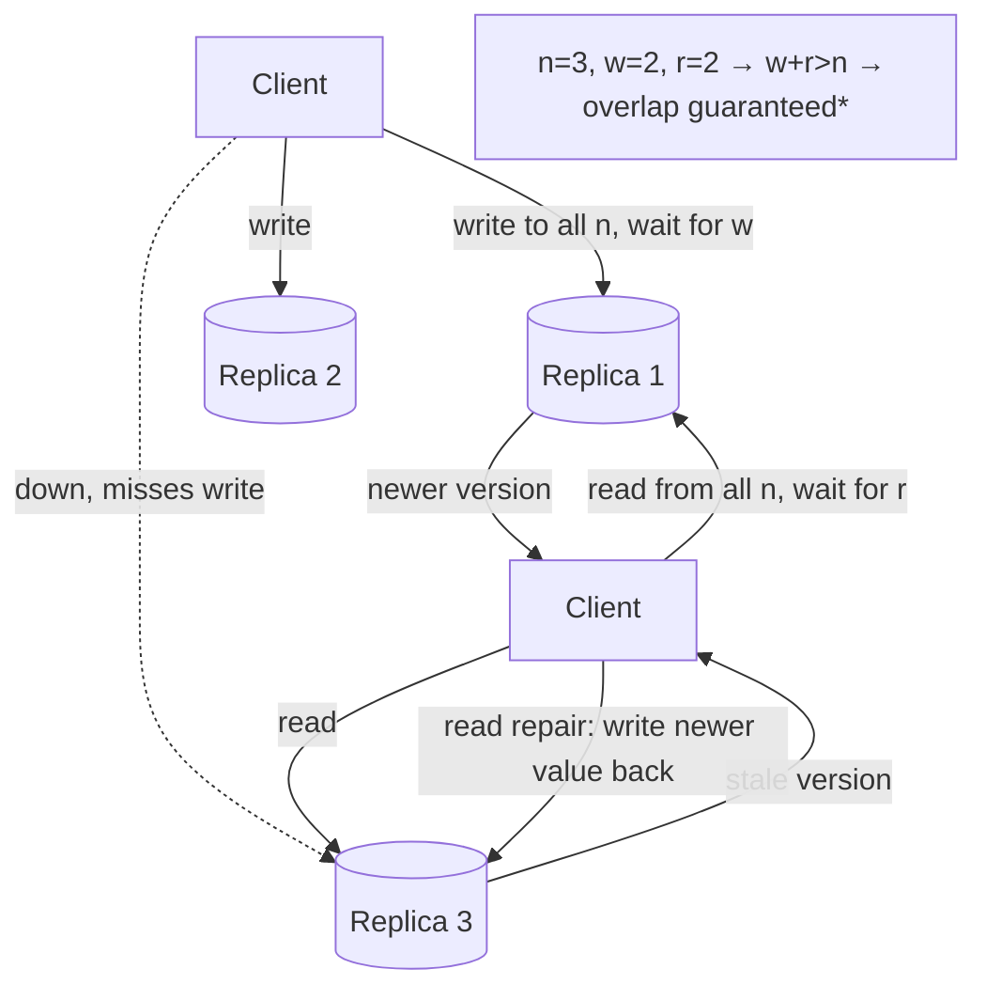
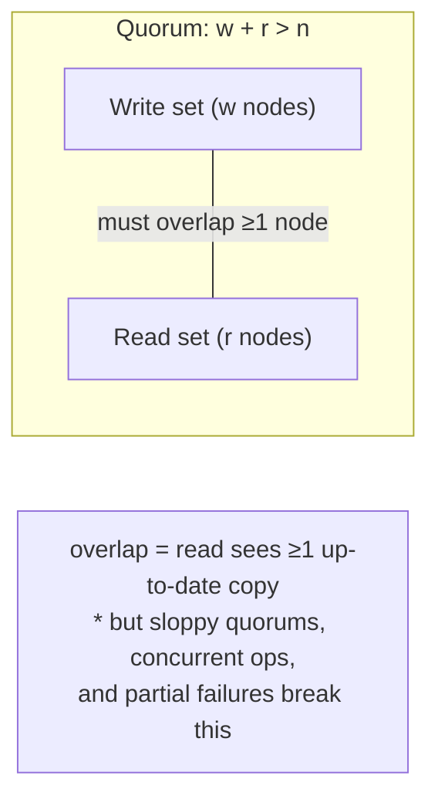
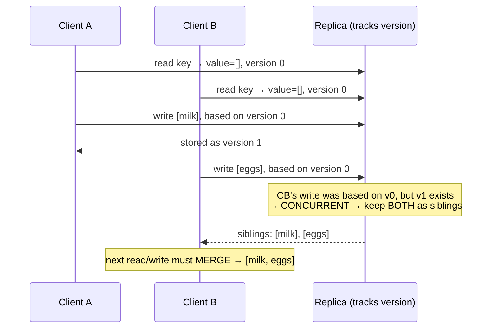

# 04 - Leaderless Replication & Quorums

**Prerequisites:** Topics 10, 11, 12
**Difficulty:** Advanced
**Interview importance:** ⭐ **Critical**
**Source:** Chapter 5 — "Leaderless Replication"

---

## 1. What Is It?

**Leaderless replication** abandons the leader entirely. **Any replica accepts writes directly from clients.** There's no designated node that orders writes and no failover, because there's no leader to fail.

This is the Amazon Dynamo model, adopted by Riak, Cassandra, and Voldemort — often called **Dynamo-style** databases. (Note: DynamoDB, the AWS product, is *not* leaderless; the Dynamo *paper* inspired these open-source systems.)

The mechanism that makes it work — reading and writing to multiple replicas and using **quorums** to overlap them — is the heart of this file, and one of the most-tested ideas in the book.

---

## 2. Why Does It Exist?

Single-leader and multi-leader both have a leader, and a leader is a point of coordination that can fail, requiring failover — which, as Topic 10 showed, is genuinely hard and dangerous.

Leaderless asks: what if we just **don't have a leader**, and instead make availability the first-class goal?

The payoff: leaderless systems can keep processing both reads and writes **during network partitions and node failures** with no failover step at all. If a node is down, a write just goes to the other replicas; when the node returns, it catches up. There's no moment where the system is "electing a new leader" and unable to serve writes. This is why Dynamo-style databases are chosen for use cases requiring **high availability and low latency, tolerating occasional stale reads.**

The cost is weak consistency and the need to reason carefully about quorums — which is what makes this the hard, interview-heavy topic it is.

---

## 3. Simple Explanation

Write to several replicas at once; read from several at once. Make the write set and the read set **overlap**, and you're guaranteed at least one replica in your read set has the latest write.

That overlap is the **quorum**. With *n* replicas, if every write goes to *w* of them and every read consults *r* of them, then **if `w + r > n`**, the read and write sets must share at least one node — so a read sees at least one up-to-date copy.

Then two background mechanisms — **read repair** and **anti-entropy** — fix the replicas that fell behind.

That's the entire model: overlapping quorums for freshness, background processes for convergence.

---

## 4. Real-World Analogy

**Asking several friends to remember a fact for you.**

You tell the fact to 2 of your 3 friends (a write to *w* = 2). Later you ask 2 of the 3 friends what the fact is (a read from *r* = 2). Since you told 2 and asked 2 out of 3, **at least one friend you asked is one you told** — so someone in your read set knows the current answer. You pick the answer with the most recent timestamp.

If instead you told only 1 friend and asked only 1, you might ask the two who *don't* know — and get a stale or missing answer. That's `w + r ≤ n`: no guaranteed overlap.

The friends who missed the update? Occasionally, when they overhear the right answer from someone who knows, they update themselves (read repair). And now and then they compare notes to sync up (anti-entropy).

---

## 5. Technical Explanation

### Writing when a node is down

There's no failover. The client sends the write to **all replicas in parallel**, and the write is considered successful once a sufficient number (*w*) acknowledge. A down replica simply misses the write — that's fine, as long as *w* others accepted it.

When the down node comes back, it's now stale. Two mechanisms bring it current:

- **Read repair.** When a client reads from several nodes in parallel, it can detect stale responses (by comparing version numbers). If node 3 returns an older value than nodes 1 and 2, the client (or a coordinator) **writes the newer value back to node 3.** Works well for values that are read frequently.
- **Anti-entropy process.** A background process constantly looks for differences between replicas and copies missing data from one to another. Unlike replication logs, it doesn't copy writes in any particular order, and there may be significant delay. Some systems (Cassandra, Voldemort) don't have anti-entropy and rely on read repair alone — which means **rarely-read values may be missing from some replicas for a long time**, reducing durability, because read repair only happens on read.

### Quorums for reading and writing — the `w + r > n` rule

If there are *n* replicas, every write must be confirmed by *w* nodes, and every read must query at least *r* nodes. **As long as `w + r > n`, you expect a read to return an up-to-date value**, because the read set and write set overlap in at least one node. These are **quorum reads and writes.** Think of *r* and *w* as the minimum number of votes required for the operation to be valid.

A common choice: *n* odd (3 or 5), with `w = r = (n+1)/2` (rounded up) — a **majority**. But quorums don't *have* to be majorities; it only matters that the read and write sets overlap in at least one node. Other assignments are possible for design flexibility.

The quorum condition lets the system tolerate unavailable nodes:

- If `w < n`, a write can still succeed with some nodes down.
- If `r < n`, a read can still succeed with some nodes down.
- With *n* = 3, *w* = 2, *r* = 2: tolerate one unavailable node.
- With *n* = 5, *w* = 3, *r* = 3: tolerate two unavailable nodes.

Normally reads and writes are sent to all *n* replicas in parallel; *w* and *r* determine how many responses we **wait for**.

You can also tune for the workload: a **read-heavy** workload might set `w = n, r = 1` — fast reads, but a single failed node makes all writes fail. Usually *w* and *r* are more than half, so the system tolerates up to `n/2` failures while keeping `w + r > n`.

### Limitations of quorum consistency — the crucial caveat

Here's the part candidates miss: **`w + r > n` does NOT actually guarantee you always read fresh data.** It's a probabilistic improvement, not an absolute guarantee. Edge cases where a stale value can still be returned:

- **Sloppy quorum** (below): the *w* writes and *r* reads may land on **different sets of nodes**, so overlap isn't guaranteed.
- **Concurrent writes:** if two writes happen concurrently, it's unclear which is "later"; if you resolve by LWW based on timestamps, writes can be lost due to clock skew (Topic 21).
- **Concurrent read and write:** a read happening at the same time as a write may or may not see the new value.
- **Partial write failure:** a write succeeds on fewer than *w* nodes and isn't rolled back on the ones that did accept it. A subsequent read *may or may not* return that value — it's not deterministic.
- **A restored-from-backup node** that reverted its data can drop below the required copies of a value, breaking the quorum condition.

So even with `w + r > n`, Dynamo-style databases are generally optimized for eventually-consistent use cases. **The parameters allow you to adjust the probability of reading stale values, but it's wise not to take them as absolute guarantees.** In particular, you usually don't get read-after-write, monotonic reads, or consistent prefix reads (Topic 11) — those require transactions or consensus.

**Monitoring staleness.** For leader-based replication, you can monitor replication lag by subtracting a follower's position from the leader's. For leaderless, there's no fixed order of writes, so monitoring is harder. And if the system uses only read repair (no anti-entropy), there's no upper bound on how stale a value might get — a value read only rarely could be very old. This is an area where the book notes operational visibility is weaker than it should be.

### Sloppy quorums and hinted handoff

What if a client can reach *some* nodes, but not the specific *n* "home" nodes for a key (due to a network partition)? Two choices:

- **Strict quorum:** return errors for all requests that can't reach a quorum of the *home* nodes.
- **Sloppy quorum:** accept writes on **other, reachable nodes** that aren't among the key's designated home nodes. The write is stored on whatever *w* nodes are reachable. Once the network heals, those nodes forward the writes to the proper home nodes — this is **hinted handoff** (like a neighbor accepting your mail while you're away, then handing it over when you return).

Sloppy quorums **increase write availability** — a write can succeed as long as *any* *w* nodes are reachable. But they **weaken the guarantee**: even with `w + r > n`, you can't be sure a read reaches a node with the latest value, because the write may have been stored on nodes outside the read's set until handoff completes. So a sloppy quorum isn't a real quorum in the overlap sense — it's an availability assurance, not a freshness one. It's optional in most Dynamo implementations; in Riak it's on by default, in Cassandra/Voldemort it's off by default.

**Multi-datacenter operation** works naturally in leaderless: *n* includes nodes across datacenters, and you can configure how many acknowledgments must be local, so a write returns quickly to the client while replicating across datacenters in the background.

### Detecting concurrent writes

Because clients write to nodes in any order, and nodes can go down and recover, **the same key can end up with different values on different nodes**, and events can arrive in different orders. If replicas just overwrote with whatever they received last, they'd become permanently inconsistent. So the system must detect and resolve concurrency — the same problem as multi-leader.

- **Last write wins (LWW):** attach a timestamp to each write, keep the highest, discard the rest. Achieves **convergence** but at the cost of **durability**: concurrent writes are silently dropped, and even non-concurrent writes can be dropped due to clock skew. If losing data is unacceptable, LWW is a poor choice. **The only safe way to use LWW is to ensure a key is written only once and thereafter immutable** (e.g., a UUID key), avoiding concurrent updates entirely. Cassandra recommends exactly this.

- **The "happens-before" relationship and concurrency.** Two operations are **concurrent** if neither *happened before* the other — that is, neither knew about the other. If operation A happened before B (B is aware of A, or depends on it, or builds on it), then B should win, as it's the newer/causal successor. If they're concurrent, we have a genuine conflict to resolve. **Concurrent doesn't mean "at the same instant" — it means neither is causally aware of the other**, regardless of physical timing. (Because of clocks and relativity-of-simultaneity, "at the same time" isn't even well-defined across machines.)

- **Capturing the happens-before relationship.** The server can track causality using **version numbers**: it assigns a version number to every key, increments it on each write, and stores the version alongside the value. When a client reads, the server returns all values not yet overwritten, along with the latest version number. A client must read before writing. When writing, it must include the version number from its prior read, and **merge** all values it received in that read. The server can then tell that the new write supersedes the values that were read (those with an equal or lower version) but must keep concurrent values (higher versions, written by others in the meantime, that this client didn't see).

- **Merging concurrently written values (siblings).** When there are concurrent writes, the system keeps all of them as **siblings**, and it's up to the client to merge them on the next read/write. Merging can be done by taking a union — but you must be careful with deletions: you can't just remove an item, because a concurrent write might re-add it. So a deleted item is marked with a **tombstone** (a deletion marker with a version number), so the merge logic knows it was deliberately removed. Doing this correctly in application code is error-prone, which motivates **CRDTs** (Topic 12) that handle merging automatically.

- **Version vectors.** With multiple replicas but no leader, a single version number isn't enough — you need a version number **per replica per key**. Each replica increments its own version and tracks the versions it has seen from others. This collection of version numbers is a **version vector.** It lets the system distinguish concurrent writes from causally-ordered ones across all replicas, and tells clients which values to overwrite and which to keep as siblings. (Riak uses a variant called *dotted version vectors*.) Version vectors are sent to clients on read and must be sent back on write; they ensure it's safe to read from one replica and write to another.

**A note on version vectors vs vector clocks:** the terms are often conflated. A vector clock is a general mechanism for comparing the state of nodes; a version vector is the specific application of it to tracking replica states for conflict detection. The distinction is minor for practical purposes — both let you tell "newer" from "concurrent."

---

## 6. Diagrams







---

## 7. Concrete Example

**Amazon's shopping cart (the original Dynamo use case).**

Requirements: the "Add to Cart" button must *always* work — an unavailable cart directly loses sales. Occasional staleness is acceptable. This is the exact profile leaderless targets: **maximize write availability, tolerate stale reads.**

- Writes go to *w* replicas; with a node down, the write still succeeds on the others — the button always works.
- Two devices add different items concurrently → concurrent writes → kept as **siblings**.
- On the next read, the app **merges** the siblings: union of items. This is why the famous Dynamo failure mode is a *resurrected* deleted item — if you remove an item and a concurrent write re-adds it, a naive union brings it back. The fix is tombstones for deletions.
- Version vectors track which writes are causally ordered vs concurrent across replicas.

The design lesson: leaderless pushes conflict resolution to the application, and for a shopping cart "merge by union with tombstones" is a sensible, business-appropriate rule — losing an item is worse than showing a spurious one.

---

## 8. When to Use / Not Use

**Use leaderless when:** availability is paramount — writes must succeed through node failures and partitions with no failover pause; you can tolerate eventual consistency and occasional stale reads; your data has a sensible merge rule (or is write-once immutable); low, predictable write latency matters; you operate across datacenters and want tunable local-ack.

**Avoid leaderless when:** you need read-after-write, monotonic reads, or consistent prefix reads out of the box (you don't get them); you need real uniqueness constraints or atomic multi-key operations (require consensus — Topic 26); LWW's data loss is unacceptable and you can't write a correct merge; you need strong consistency for correctness.

---

## 9. Advantages & Disadvantages

**Advantages**
- **No failover** — no leader to fail, so no election pause; excellent availability.
- **Tolerates node failures and partitions** while still serving reads and writes.
- **Tunable consistency vs latency vs durability** via *n*, *w*, *r*.
- **Low, predictable latency** — no leader hop; write to nearest replicas.
- Naturally multi-datacenter.

**Disadvantages**
- **Weak consistency** — `w + r > n` is not an absolute freshness guarantee.
- **No read-after-write / monotonic / consistent-prefix** without extra work.
- **Concurrent writes create siblings** that the application must merge — error-prone.
- **LWW loses data**; correct merging needs tombstones and often CRDTs.
- **Staleness is hard to monitor**; read-repair-only systems have unbounded staleness for cold data.
- **No uniqueness constraints / cross-key atomicity** (needs consensus).

---

## 10. Trade-off Table

| Parameter setting | Effect | When to Use |
|---|---|---|
| `w = r = (n+1)/2` (majority) | Balanced; tolerates ⌊n/2⌋ failures; `w+r>n` | Default |
| `w = n, r = 1` | Fast reads; any failed node blocks writes | Read-heavy, writes rare, availability of writes less critical |
| `w = 1, r = n` | Fast, highly available writes; slow reads | Write-heavy, availability of writes critical |
| `w + r ≤ n` | No overlap; more availability, likely stale reads | When staleness is fully acceptable |
| Strict quorum | Freshness bias; errors when home nodes unreachable | Consistency-leaning |
| Sloppy quorum + hinted handoff | Max write availability; weaker freshness | Availability-critical (carts, sessions) |

| Conflict handling | Preserves data? | When |
|---|---|---|
| LWW (timestamps) | **No** | Only for write-once immutable keys |
| Siblings + app merge | Yes | When you can write a correct merge |
| Tombstones for deletes | Yes | Always, if merging (prevents resurrection) |
| CRDTs | Yes, automatically | When data maps to a CRDT |

---

## 11. Failure Scenarios

| Scenario | Consequence | Handling |
|---|---|---|
| Node down during write | Node misses the write, becomes stale | Write succeeds on other *w*; **read repair** / **anti-entropy** later |
| Cold value + read-repair-only system | Value stays stale indefinitely (never read) | Enable anti-entropy; don't rely on read repair alone for durability |
| Concurrent writes to same key | Divergent values | Keep as **siblings**; merge on read; version vectors |
| LWW + clock skew | Silent loss of a "later" write | Avoid LWW except for immutable keys |
| Partial write (< w succeeded, not rolled back) | Nondeterministic reads | Understand this is not atomic; design around it |
| Partition splits home nodes off | Writes would fail (strict) | **Sloppy quorum + hinted handoff** (weaker freshness) |
| Deleted item re-added by concurrent write | Resurrected item (Dynamo cart) | **Tombstones** in the merge logic |
| Node restored from backup | Reverts values; drops below required copies | Careful recovery; anti-entropy to re-replicate |

---

## 12. Production Considerations

- **`w + r > n` is a probability knob, not a guarantee.** Design for the edge cases (sloppy quorum, concurrency, partial failure) rather than assuming freshness.
- **Enable anti-entropy** unless you fully accept unbounded staleness for cold data — read repair alone under-replicates rarely-read values.
- **Avoid LWW for mutable data.** Use it only for write-once immutable keys (Cassandra's own advice).
- **Implement deletes as tombstones** in any merge logic, or you'll resurrect data.
- **Prefer CRDTs** where the data fits — they remove the error-prone hand-written merge.
- **Staleness monitoring is weak** — build application-level checks if freshness matters.
- **Know your sloppy-quorum default** (on in Riak, off in Cassandra/Voldemort) — it changes your freshness guarantees.
- **Don't expect uniqueness constraints or multi-key atomicity** — those need consensus/transactions.

---

## ❌ 13. Common Mistakes

- **Treating `w + r > n` as an absolute freshness guarantee.** It isn't — sloppy quorums, concurrent ops, and partial writes all break it.
- **Confusing Dynamo-style (leaderless) with AWS DynamoDB.** The paper inspired the former; the product isn't leaderless.
- **Using LWW for mutable data.** Silent data loss, worsened by clock skew.
- **Relying on read repair alone** and being surprised that cold values are stale or under-replicated.
- **Naive sibling merge without tombstones** → resurrected deleted items.
- **Expecting read-after-write / monotonic reads for free.** You don't get them.
- **Assuming a sloppy quorum is a real quorum.** It's an availability mechanism, not a freshness one.
- **Trying to enforce uniqueness** (usernames, etc.) in a leaderless store — needs consensus.

---

## 🧠 14. Think Like an Engineer

```
Is availability (writes always succeed) the top priority?
   yes → leaderless is a candidate
        ↓
Can I tolerate eventual consistency + occasional stale reads?
   no → wrong model; use single-leader / consensus
        ↓
Choose n, then w and r:
   default majority (w+r>n) unless workload skews read/write
        ↓
Does my data have a safe conflict rule?
   immutable key → LWW ok
   mergeable     → siblings + tombstones, or CRDT
   neither       → reconsider leaderless
        ↓
Sloppy quorum? (max write availability, weaker freshness)
        ↓
Anti-entropy on? (or cold data rots)
        ↓
Do I need uniqueness / cross-key atomicity? → NOT here (consensus)
```

---

## 15. Mental Model

```
No leader → any replica takes writes → max availability, no failover
      ↓
Overlap read & write sets: w + r > n → read sees ≥1 fresh copy
      ↓
...but overlap is not guaranteed (sloppy quorum, concurrency, partial writes)
      ↓
Repair drift: read repair (on read) + anti-entropy (background)
      ↓
Concurrent writes = siblings → merge (tombstones!) → version vectors track causality
      ↓
LWW converges but LOSES DATA — only safe for immutable keys
```

---

## 🔗 16. How This Connects to Other Concepts

- **Multi-Leader (Topic 12)** — shares concurrent-write detection, convergence, siblings, and version vectors; leaderless has no leader at all.
- **Replication Lag (Topic 11)** — leaderless generally gives you *none* of those read guarantees for free.
- **Clocks (Topic 21)** — why LWW-by-timestamp is unsafe; version vectors sidestep clocks.
- **Ordering & Causality (Topic 24)** — happens-before, defined here, is the foundation of the whole causality chapter.
- **Linearizability & CAP (Topic 23)** — leaderless is the archetypal "AP" (available-under-partition) system; the CAP trade-off is exactly its design choice.
- **Consensus (Topic 26)** — the thing leaderless deliberately avoids; uniqueness constraints, which leaderless can't do, are reducible to consensus.

---

## 17. Interview Questions & Answers

**Beginner**

**Q: What is leaderless replication?**
There's no leader — clients send writes and reads directly to multiple replicas. A write succeeds once enough replicas acknowledge it, and a read consults several replicas and takes the newest value. Because there's no leader, there's no failover: if a node is down, writes just go to the others, and it catches up later. It's the Dynamo model used by Cassandra and Riak, chosen when availability matters most.

**Q: What is the quorum rule?**
With n replicas, if every write goes to w of them and every read consults r of them, then w + r > n means the read set and write set must overlap in at least one node, so a read sees at least one up-to-date copy. A common choice is a majority for both. The rule lets you tolerate failures — with n=3, w=2, r=2 you survive one node down — and lets you tune toward faster reads or faster writes.

**Intermediate**

**Q: Does `w + r > n` guarantee you read fresh data?**
No, and this is the key subtlety. It improves the probability but isn't an absolute guarantee. Sloppy quorums can land the writes and reads on different node sets, so they don't overlap. Concurrent reads and writes may or may not see each other. A partial write that succeeded on fewer than w nodes and wasn't rolled back gives nondeterministic reads. And a node restored from backup can drop the number of up-to-date copies below the requirement. So the parameters tune staleness probability, but you shouldn't treat the quorum as a hard freshness guarantee, and you don't get read-after-write or monotonic reads for free.

**Q: How do leaderless systems detect concurrent writes?**
By tracking causality with version numbers rather than trusting time. The server keeps a version number per key, increments it on each write, and returns the current version on reads. A client reads before writing and includes the version it saw when it writes back, merging any values it received. That lets the server tell whether a new write supersedes what was read — same or lower version — or is concurrent with writes it never saw — higher version — in which case both are kept as siblings. Across multiple replicas you need a version number per replica, a version vector, to do this correctly. "Concurrent" here means neither write was causally aware of the other, not that they happened at the same instant.

**Q: What are read repair and anti-entropy?**
Both fix replicas that fell behind. Read repair happens on reads: when a client reads from several replicas and sees one returning a stale version, it writes the newer value back to the stale replica. It's effective for frequently-read data. Anti-entropy is a background process that continuously compares replicas and copies missing data regardless of whether anyone reads it. The important consequence is that a system relying on read repair alone, with no anti-entropy, leaves rarely-read values stale and under-replicated indefinitely, which hurts durability.

**Advanced / Staff**

**Q: Walk me through designing a highly available shopping cart on a leaderless store.**
The requirement is that writes always succeed, because an unavailable cart loses sales directly, and occasional staleness is fine — that's exactly what leaderless targets. I'd set n across replicas and pick w and r so writes remain available under node failure, likely with a sloppy quorum and hinted handoff so a write succeeds as long as any w nodes are reachable, accepting weaker freshness. The interesting part is conflicts: two devices adding items concurrently produce siblings, and I'd merge by union so no item is silently lost. The trap is deletion — a naive union resurrects an item that was removed concurrently with a re-add, which is the classic Dynamo cart bug — so deletes must be tombstones carried in the merge. I'd track causality with version vectors so I can tell supersession from concurrency across replicas. And I'd choose the merge rule to match the business cost: for a cart, showing a spurious item is better than dropping a real one, so union-with-tombstones is right. What I would not do is use LWW, because it would silently drop concurrent additions.

**Q: When is leaderless the wrong choice?**
When correctness depends on guarantees leaderless doesn't provide. Uniqueness constraints — a unique username, no double-spend — fundamentally require agreement across nodes, which is consensus, and leaderless deliberately avoids consensus, so you can't enforce them correctly. Anything needing read-after-write or monotonic reads out of the box is a poor fit, since you'd be bolting those on. And if your data has no safe merge rule and LWW's data loss is unacceptable, leaderless leaves you resolving siblings by hand, which is error-prone. For those cases I'd use single-leader for a total write order, or a consensus-backed system for the constraints. The honest framing is that leaderless buys availability by giving up ordering, so it's right when availability is the priority and wrong when a global invariant is.

---

## 🎯 30-Second Interview Answer

> "Leaderless replication drops the leader — clients write and read directly to multiple replicas, and there's no failover because there's nothing to fail over. The mechanism is quorums: with n replicas, if writes go to w and reads consult r, then w + r > n forces the read and write sets to overlap, so a read sees at least one fresh copy. The catch most people miss is that this isn't an absolute guarantee — sloppy quorums, concurrent operations, and partial writes all break the overlap, so you're really tuning staleness probability. Concurrent writes create siblings the application must merge, and you track causality with version vectors, not clocks. Last-write-wins converges but silently loses data, so it's only safe for immutable keys. It's the right model when availability is the priority and you can tolerate eventual consistency, and the wrong model when you need uniqueness constraints or read-your-writes, which require consensus."

---

## ⚡ Quick Revision

- **Leaderless:** any replica accepts writes; **no leader, no failover**. Dynamo-style: Cassandra, Riak, Voldemort. (≠ AWS DynamoDB.)
- **Quorum:** n replicas, write to w, read from r; **`w + r > n`** → read/write sets overlap → read sees ≥1 fresh copy.
- Majority (`w=r=(n+1)/2`) is the default; tolerate ⌊n/2⌋ failures. Tune `w=n,r=1` (read-heavy) or `w=1,r=n` (write-heavy).
- **`w + r > n` is NOT an absolute guarantee** — sloppy quorums, concurrent ops, partial writes break it. No read-after-write/monotonic/consistent-prefix for free.
- **Repair:** read repair (on read) + anti-entropy (background). Read-repair-only → cold data stays stale.
- **Sloppy quorum + hinted handoff:** max write availability, weaker freshness. On in Riak, off in Cassandra/Voldemort.
- **Concurrent writes → siblings → merge** (with **tombstones** to avoid resurrection); track with **version vectors**.
- **"Concurrent" = neither happened-before the other**, not "same instant."
- **LWW converges but loses data** — only safe for **immutable/write-once keys**.
- **No uniqueness / cross-key atomicity** — those need consensus (Topic 26).
