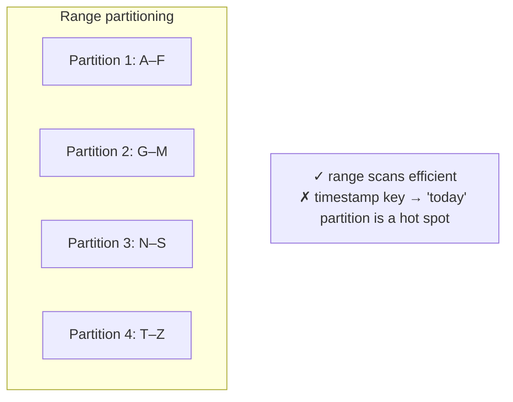
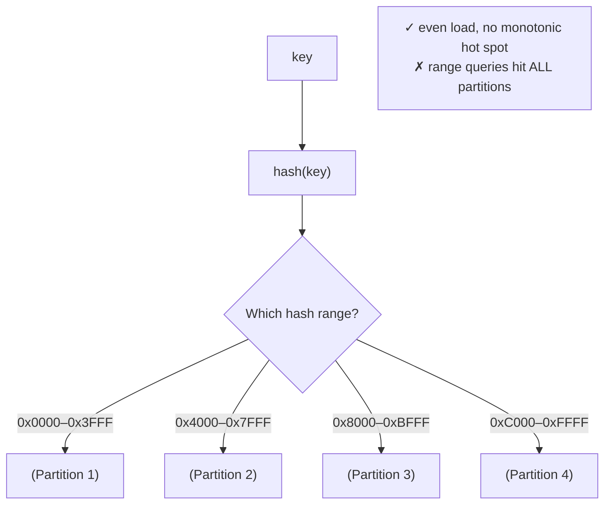
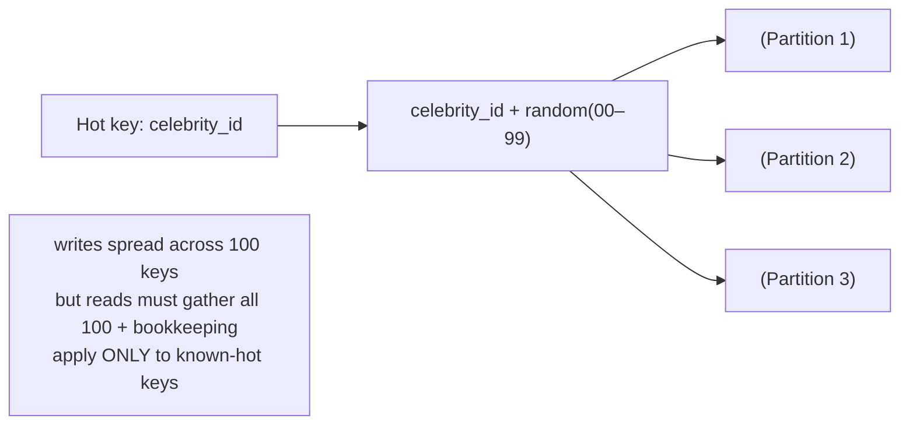

# 05 - Partitioning Strategies

**Prerequisites:** Topic 10 (replication)
**Difficulty:** Intermediate
**Interview importance:** ⭐ **Critical**
**Source:** Chapter 6 — "Partitioning of Key-Value Data"

---

## 1. What Is It?

**Partitioning** (also **sharding**) splits a large dataset into subsets called **partitions**, each stored on a different machine. Each piece of data belongs to exactly one partition.

Replication (Topics 10–13) keeps *copies of the same data* on many machines. Partitioning keeps *different data* on different machines. They're orthogonal and almost always combined: partition the data, then replicate each partition.

> **Terminology note:** what this book calls a *partition* is called a *shard* in MongoDB/Elasticsearch/SolrCloud, a *region* in HBase, a *tablet* in Bigtable, a *vnode* in Cassandra/Riak, a *vBucket* in Couchbase. Same concept, different names — worth knowing so you're not thrown in an interview.

---

## 2. Why Does It Exist?

Replication alone doesn't solve everything. If your dataset is 50 TB, every replica must hold all 50 TB — replication multiplies storage but doesn't reduce it. And if your write volume exceeds what one machine can handle, adding read replicas doesn't help, because every write still hits every replica's copy.

Partitioning exists to break both ceilings:

- **Scalability of data volume:** each partition holds only its slice, so total data can exceed any single machine's capacity.
- **Scalability of write/query throughput:** queries and writes spread across partitions running in parallel on different machines.

The stated goal: **spread data and query load evenly across nodes.** If perfectly even, 10 nodes handle 10× the data and throughput of 1. The enemy of this is **skew** — an uneven distribution that concentrates load on a few nodes. A partition with disproportionately high load is a **hot spot**, and a hot spot means you've bought 10 machines but one of them is the bottleneck, so you're getting the throughput of 1.

Everything in partitioning is really about **avoiding hot spots.**

---

## 3. Simple Explanation

Cut the data into pieces so each machine owns one piece. The whole trick is cutting it so the pieces are **even** — even in size *and* even in how much traffic they get.

Two ways to cut:

- **By key range:** partition 1 owns keys A–F, partition 2 owns G–M, etc. Keeps keys sorted → range scans work → but popular ranges become hot spots.
- **By hash of key:** hash the key, and the hash determines the partition. Spreads load evenly → but destroys sort order → range scans become expensive.

That's the core trade: **range partitioning gives you range queries but risks hot spots; hash partitioning avoids hot spots but loses range queries.**

---

## 4. Real-World Analogy

**A library splitting its books across several buildings.**

**By range (alphabetical):** Building 1 holds authors A–F, Building 2 G–M, etc. Finding "all books by authors D through F" means visiting one building — great for range queries. But if there's a run on a bestselling author whose surname starts with S, Building 4 is mobbed while the others sit empty. That's a hot spot.

**By hash:** run each author's name through a formula that scatters them; "Rowling" might land in Building 2, "Rowlands" in Building 5. Load is beautifully even — no building gets mobbed. But "all authors D through F" now means visiting *every* building, because the alphabetical adjacency is gone. That's the lost range query.

Neither building layout is right. It depends on whether you do range queries (choose alphabetical) or fear hot spots (choose hash).

---

## 5. Technical Explanation

### Partitioning and replication combined

Partitioning is usually combined with replication so each partition's data is stored on multiple nodes for fault tolerance. A node may store several partitions. With a leader–follower model, each partition has a leader on one node and followers on others; a node can be leader for some partitions and follower for others. The two schemes are independent — you reason about them separately.

### Partitioning by key range

Assign a continuous range of keys (from some minimum to some maximum) to each partition. Like the volumes of a paper encyclopedia — knowing the key tells you which partition (which volume) to look in, and if you know which node holds which range, you go straight there.

**The ranges need not be evenly spaced**, because data may not be evenly distributed. (An encyclopedia volume for letters T–Z might be thinner than A–B.) Partition boundaries are chosen to balance the data, either by an administrator or automatically.

**Advantage:** within each partition, keys are **sorted** (using an SSTable/LSM-tree from Topic 6). This makes **range scans efficient** — you can fetch a range of related keys with one query. E.g., if keys are timestamps, you can query all readings in a time window easily.

**Disadvantage — hot spots:** certain access patterns lead to hot spots. If the key is a timestamp and you write sensor data, the partition owning "today" receives **all** the writes while the others sit idle — the write load is not spread. **Fix:** prefix the key with something other than the timestamp — e.g., prefix by sensor name, so each sensor's data is a separate key range. Now writes spread across sensors. But then, to fetch a time range across all sensors, you must do a separate range query per sensor. This is the recurring tension: solving the hot spot reintroduces a scatter across partitions.

### Partitioning by hash of key

Because of the skew and hot-spot risk, many systems use a **hash function** to determine the partition for a key. A good hash function takes skewed data and makes it **uniformly distributed** — even keys that are very similar (like consecutive timestamps) hash to values scattered across the whole range. (The hash needn't be cryptographically strong; MongoDB uses MD5, Cassandra Murmur3, Voldemort a Fowler–Noll–Vo function. Note: many languages' built-in hash functions aren't suitable — Java's `Object.hashCode()` and Ruby's `Object#hash` may return different values for the same key in different processes.)

Assign each partition a **range of hashes**; every key whose hash falls in a partition's range belongs to it. This distributes keys fairly among partitions, and partition boundaries can be evenly spaced or chosen pseudorandomly (**consistent hashing** — though the book notes the term is used loosely and consistent hashing as originally defined often doesn't work well for databases, so many systems use their own scheme).

**Advantage:** load spreads evenly — the hot-spot problem of monotonically-increasing keys goes away.

**Disadvantage:** we **lose the sort order**. Range queries become inefficient — keys that were once adjacent are now scattered across all partitions, so a range query must be sent to *all* partitions. MongoDB with hash-based sharding sends range queries to all partitions; Riak, Couchbase, and Voldemort don't support range queries on the primary key at all.

**A hybrid** (Cassandra's **compound primary key**) gets some of both: the key has several columns; only the **first** column is hashed to determine the partition, and the remaining columns are used as a **concatenated index for sorting within the partition.** So a query can't range over the first column, but if it fixes the first column, it can do an efficient range scan over the others. Example: a social media schema with `(user_id, update_timestamp)` — updates for one user are stored together, sorted by time, so you fetch one user's updates in a time range efficiently. Different users may be on different partitions.

### Skewed workloads and relieving hot spots

Hashing keys reduces hot spots, but **can't eliminate them entirely.** In the extreme, all reads and writes target the *same key* — e.g., a celebrity with millions of followers doing something that causes a storm of activity, or a hot product in a flash sale. Hashing the key doesn't help, because it's the **same key** — it hashes to the same partition every time.

Today, most systems can't automatically compensate for such a highly skewed workload, so **it's the application's responsibility.** The book's technique: if one key is known to be very hot, **add a random number** (say, a two-digit decimal, giving 100 variants) to the beginning or end of the key. That splits the writes for that key across 100 different keys, distributed to different partitions.

But this has a cost: **reads now have to do additional work**, because they have to read from all 100 keys and combine the results. So this technique should be applied only to the few keys that are actually hot — appending a random number to the millions of keys that aren't hot would be wasteful. You also need **bookkeeping** to track which keys are being split. (This is structurally the same as Twitter's celebrity fan-out in Topic 2 — skewed distributions break naive schemes, everywhere.)

---

## 6. Diagrams







---

## 7. Concrete Example

**A ride-sharing app storing trip records.**

*Attempt 1 — range partition by `trip_id` (timestamp-based).* All new trips have the latest timestamp, so every write lands on the "now" partition. One partition is saturated with writes; the rest idle. Classic monotonic-key hot spot.

*Attempt 2 — hash partition by `trip_id`.* Writes spread evenly. But the analytics team's query "all trips between 2pm and 3pm today" now hits every partition, because timestamp adjacency is gone.

*Attempt 3 — compound key `(city_id, trip_timestamp)`.* Partition by hash of `city_id`; sort by timestamp within the partition. Writes spread across cities (no single hot partition, assuming many cities). "All trips in Mumbai between 2–3pm" is an efficient single-partition range scan. The residual risk: one enormous city could still be a hot partition — if Mumbai alone exceeds a node, you'd split `city_id` further (e.g., `(city_id, region)`), the same key-splitting idea applied structurally.

This progression is exactly how the book reasons: identify the hot spot, apply hashing to spread, use a compound key to recover the range query you need, and split the residual hot key if one remains.

---

## 8. When to Use / Not Use

**Partition when:** data volume exceeds one machine; write/query throughput exceeds one machine; you can identify a good partition key that spreads load evenly.

**Don't partition when:** a single machine (possibly with read replicas) still copes — partitioning adds real complexity (cross-partition transactions, secondary index trade-offs, rebalancing); you can't find a key that spreads load without hot spots; the workload is dominated by a few hot keys (partitioning by itself won't fix that).

**Choose range partitioning when:** range scans are important and you can avoid monotonic-key hot spots (e.g., by prefixing the key).

**Choose hash partitioning when:** even load distribution matters more than range queries; keys would otherwise be monotonic (timestamps, sequential IDs).

**Choose compound/hybrid when:** you need both — even distribution on one dimension and range scans within it. Usually the pragmatic answer.

---

## 9. Advantages & Disadvantages

**Advantages**
- Scales **data volume** beyond one machine.
- Scales **throughput** — parallel reads/writes across partitions.
- Combined with replication, gives both scale and fault tolerance.

**Disadvantages**
- **Hot spots** if the partition key is poorly chosen — the dominant risk.
- **Cross-partition operations are hard** — a query spanning partitions must scatter/gather; multi-partition writes need coordination (Topic 25).
- **Secondary indexes get complicated** (Topic 15).
- **Rebalancing** as nodes are added/removed is an operational concern (Topic 16).
- Range vs hash forces a trade between range queries and even distribution.

---

## 10. Trade-off Table

| Strategy | Advantages | Disadvantages | When to Use |
|---|---|---|---|
| Range partitioning | Efficient range scans; sorted keys | Hot spots on monotonic keys | Range queries needed; keys aren't monotonic (or are prefixed) |
| Hash partitioning | Even load; no monotonic hot spots | Range queries hit all partitions | Even distribution matters; monotonic keys |
| Compound key (hash + sort) | Even distribution *and* range scans within a partition | Can't range over the hashed column | The common pragmatic choice (e.g., Cassandra) |
| Key-splitting (add random suffix) | Spreads a single hot key | Reads must gather all splits; needs bookkeeping | Only for known individually-hot keys |

---

## 11. Failure Scenarios

| Scenario | Consequence | Handling |
|---|---|---|
| Monotonic key (timestamp) | All writes hit one partition | Hash the key, or prefix with another attribute |
| Single hot key (celebrity, hot product) | One partition saturated; hashing doesn't help | **Key-splitting** with random suffix, for that key only |
| Uneven data distribution | Some partitions huge, others tiny | Choose boundaries by data; dynamic partitioning (Topic 16) |
| Range query on hash-partitioned data | Scatter across all partitions; slow | Compound key; or a secondary structure; or accept the cost |
| Cross-partition transaction | Hard; partial-failure risk | Design key to keep related writes in one partition; or 2PC (Topic 25) |
| One city/tenant outgrows a node | Hot partition returns | Split the key further (`city_id` → `city_id + region`) |

---

## 12. Production Considerations

- **Choosing the partition key is the highest-leverage decision.** It determines hot spots, which queries are efficient, and how well you scale. Get it wrong and repartitioning later is painful.
- **Co-locate data that's read/written together** on the same partition — this keeps most operations single-partition, which keeps transactions and queries simple and cheap.
- **Prefer compound keys** when you need both even distribution and range scans; it's the most common real-world answer.
- **Identify hot keys explicitly** and apply key-splitting only to them; splitting everything wastes read effort.
- **Beware language built-in hash functions** — they may not be stable across processes.
- **Watch per-partition load, not just aggregate** — an average that looks healthy can hide a melting hot partition.
- **Model residual hot spots** — even good keys can have one giant tenant; have a plan to split further.

---

## ❌ 13. Common Mistakes

- **Partitioning by a monotonically increasing key** (timestamp, auto-increment ID) → every write hits one partition. The single most common partitioning mistake.
- **Assuming hashing fixes all hot spots.** It doesn't fix a *single* hot key — same key, same partition.
- **Applying key-splitting to every key.** Only hot keys need it; splitting all keys taxes every read.
- **Ignoring the range-query cost of hash partitioning** until analytics grinds to a halt.
- **Choosing a partition key that forces cross-partition transactions** for common operations.
- **Monitoring only aggregate load**, missing a hot partition.
- **Using a non-stable hash function** so the same key maps to different partitions in different processes.

---

## 🧠 14. Think Like an Engineer

```
Does data volume OR throughput exceed one machine? (if not, don't partition)
        ↓
What are the common queries? Point lookups, or ranges?
        ↓
Is my candidate key monotonic (timestamp, seq id)? → will hot-spot on range
        ↓
Do I need range scans?
   yes → range partition (prefix to avoid monotonic hot spot),
         or compound key (hash outer + sort inner)
   no  → hash partition (even load)
        ↓
Can I keep data that's accessed together in ONE partition?
   (keeps transactions/queries single-partition and cheap)
        ↓
Are there individual hot keys? → key-split ONLY those
        ↓
Monitor PER-PARTITION load, not just the average
```

---

## 15. Mental Model

```
Partitioning = split data across machines for scale
      ↓
Goal: even load. Enemy: hot spots.
      ↓
Range partition: range scans ✓, monotonic hot spots ✗
Hash partition:  even load ✓, range scans ✗
Compound key:    both (hash outer, sort inner) — the pragmatic default
      ↓
Single hot key? hashing won't help → SPLIT that key (random suffix)
      ↓
Best partition key = spreads load AND keeps related data together
```

---

## 🔗 16. How This Connects to Other Concepts

- **Replication (Topics 10–13)** — orthogonal and combined: partition, then replicate each partition; each partition often has its own leader.
- **Secondary Indexes (Topic 15)** — partitioning by primary key forces a hard choice about how to partition secondary indexes.
- **Rebalancing & Routing (Topic 16)** — how partitions move between nodes, and how requests find the right partition.
- **Scalability (Topic 2)** — hot keys here are the same skew problem as Twitter's celebrity fan-out; the key-splitting fix mirrors the hybrid-fan-out fix.
- **LSM-Trees (Topic 6)** — range partitions store sorted keys via SSTables, enabling the range scans.
- **Two-Phase Commit (Topic 25)** — cross-partition writes are where distributed transactions become necessary and hard.

---

## 17. Interview Questions & Answers

**Beginner**

**Q: What's the difference between partitioning and replication?**
Replication keeps copies of the same data on multiple machines — for fault tolerance and read scaling. Partitioning splits different data onto different machines — so total data and write throughput can exceed one machine. They're orthogonal and usually combined: you partition the data, then replicate each partition. The goal of partitioning is to spread load evenly, and its enemy is hot spots.

**Q: What are the two main ways to partition?**
By key range — each partition owns a continuous sorted range of keys, which makes range scans efficient but risks hot spots when keys are monotonic, like timestamps all landing on the "now" partition. And by hash of key — the hash decides the partition, which spreads load evenly but destroys sort order, so range queries have to hit every partition. The common compromise is a compound key: hash the first column to place the partition, sort by the rest within it.

**Intermediate**

**Q: You're partitioning time-series sensor data. What key do you choose?**
Partitioning by raw timestamp is the classic mistake — every new write has the latest timestamp, so it all lands on one partition while the rest idle. I'd use a compound key like (sensor_id, timestamp), hashing sensor_id to place the partition and sorting by timestamp within it. That spreads writes across sensors and still lets me efficiently range-scan one sensor's data over a time window. The residual risk is one extremely high-volume sensor becoming a hot partition, in which case I'd split that sensor's key further. If I needed cross-sensor time-range queries frequently, I'd accept that those scatter across partitions or maintain a separate structure for them.

**Q: Why doesn't hashing fix a single hot key?**
Because hashing spreads *different* keys evenly, but a single hot key is the same key every time, so it always hashes to the same partition. If a celebrity's record or a flash-sale product gets a storm of traffic, that one partition saturates no matter how good the hash is. The fix is application-level key-splitting: append a small random number to that specific key so its writes fan out across, say, a hundred sub-keys on different partitions. The cost is that reads must gather all hundred and combine them, plus bookkeeping to track which keys are split — so you apply it only to the few keys that are actually hot, not to everything.

**Q: What's a compound primary key and why is it useful?**
It's a key with multiple columns where only the first is hashed to choose the partition and the rest form a sort order within it. Cassandra uses this. It gives you the best of both strategies: even distribution across the hashed first column, and efficient range scans as long as you fix that first column. The canonical example is (user_id, timestamp) for a social feed — one user's posts live together, sorted by time, so fetching their recent posts is a single-partition range scan, while different users spread across partitions.

**Advanced / Staff**

**Q: Design the partitioning for a multi-tenant SaaS analytics product.**
The natural partition key is tenant_id, hashed, because it spreads tenants across partitions and keeps each tenant's data together, which means most queries and writes stay single-partition — that's what keeps the system simple and transactions cheap. Within a tenant I'd use a compound key so that time-range queries per tenant are efficient. The problem I'd design for up front is tenant skew: SaaS tenant sizes follow a heavy power law, so one enterprise customer can be larger than thousands of small ones combined and become a hot partition. So I'd want the ability to split a large tenant's key — for instance by hashing (tenant_id, sub_entity) — and I'd monitor per-partition load rather than aggregate, because the average will look fine while one partition melts. Cross-tenant queries, which are mostly internal analytics, I'd accept as scatter-gather or serve from a separate aggregated store. The guiding principle is that the partition key should both spread load and keep together the data that's accessed together, and for multi-tenant that's overwhelmingly the tenant.

**Q: A partition has become a hot spot in production. Walk me through diagnosis and fix.**
First I'd confirm it's actually a hot partition and not general overload, by looking at per-partition metrics — one partition at high load while others idle is the signature. Then I'd find the cause, which is usually one of three: a monotonic key concentrating writes on the newest partition, an uneven data distribution putting a huge range on one partition, or a single hot key. The fix depends on which. A monotonic key means I need to change the partition key to include a spreading dimension, which is a migration. Uneven distribution means rebalancing partition boundaries, ideally with dynamic partitioning that splits large partitions automatically. A single hot key means application-level key-splitting for that key only. In all cases I'd be wary of solutions that just move the hot spot — for instance, splitting a hot key without bookkeeping to gather reads correctly — and I'd add per-partition alerting so the next one is caught early rather than in an incident.

---

## 🎯 30-Second Interview Answer

> "Partitioning splits different data across machines so volume and write throughput can exceed one node — versus replication, which copies the same data. The goal is even load and the enemy is hot spots. Two strategies: range partitioning keeps keys sorted so range scans work, but monotonic keys like timestamps concentrate all writes on one partition; hash partitioning spreads load evenly but destroys sort order so range queries hit every partition. The pragmatic answer is usually a compound key — hash the first column to place the partition, sort by the rest within it — which gives even distribution and range scans together. The one thing hashing can't fix is a single hot key, because it's the same key hashing to the same partition every time, so for celebrities or hot products you split that specific key with a random suffix and gather on read. Choosing the partition key is the highest-leverage decision, and it should both spread load and keep together data that's accessed together."

---

## ⚡ Quick Revision

- **Partitioning (sharding):** different data on different machines. Orthogonal to replication; combined (partition → replicate each partition).
- **Terminology:** partition = shard (Mongo/ES) = region (HBase) = tablet (Bigtable) = vnode (Cassandra).
- **Goal: even load. Enemy: hot spots** (a partition with disproportionate load).
- **Range partitioning:** sorted keys → efficient **range scans**; but **monotonic keys → hot spots**. Fix: prefix the key.
- **Hash partitioning:** even load, no monotonic hot spots; but **range queries hit all partitions**.
- **Compound key** (Cassandra): hash first column (placement) + sort remaining (range within partition). The pragmatic default.
- **Single hot key:** hashing doesn't help (same key). **Split the key** with a random suffix — but reads must gather all splits + bookkeeping; **only for known-hot keys**.
- **Best partition key:** spreads load **and** keeps related data together (most ops stay single-partition).
- **Beware** monotonic keys, non-stable hash functions, and monitoring only aggregate (not per-partition) load.
