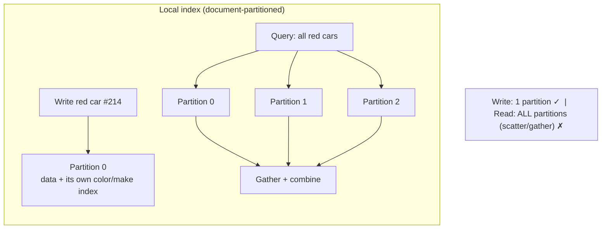
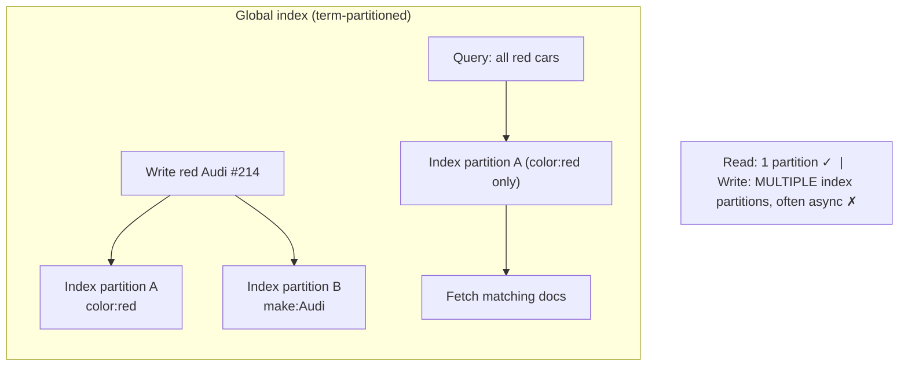

# 06 - Partitioning Secondary Indexes

**Prerequisites:** Topic 14 (partitioning strategies)
**Difficulty:** Advanced
**Interview importance:** High
**Source:** Chapter 6 — "Partitioning and Secondary Indexes"

---

## 1. What Is It?

A **secondary index** lets you find records by some attribute other than the primary key — "find all cars where `color = red`", "find all posts tagged `#coffee`". On a single machine this is routine.

Once the data is **partitioned**, the index itself must be partitioned too, and there are exactly **two ways to do it**, each with an unavoidable cost:

- **Document-partitioned (local) index** — each partition indexes only its own documents.
- **Term-partitioned (global) index** — the index is partitioned separately, by the indexed term.

There's no free option. One makes writes cheap and reads expensive; the other makes reads cheap and writes expensive. Choosing between them is the whole topic.

---

## 2. Why Does It Exist?

Partitioning by primary key (Topic 14) tells you which partition holds a *given key*. But real applications query by other attributes all the time. "Show me all red Hondas listed near me" isn't a primary-key lookup — it's a query on `color` and `make`.

The problem: a secondary index maps an attribute value (`red`) to the set of records having it — but those records are **scattered across all partitions**, because they were partitioned by primary key, not by color. So the index can't live neatly in one place the way the primary data does.

You have to decide: does each partition keep a **local** index of just its own records (simple writes, but a read must ask everyone), or do you build a **global** index partitioned by the term itself (a read asks one partition, but a write must update several index partitions)?

This is one of the cleaner "pick your poison" trade-offs in the book, and interviewers love it because it forces you to reason about read vs write cost explicitly.

---

## 3. Simple Explanation

**Local index (partition by document):** every partition maintains an index over *only the records it stores.* Writing is easy — you only touch the one partition the record lives on. Reading is expensive — since red cars could be anywhere, you must ask **every** partition and combine the answers. This asking-everyone pattern is called **scatter/gather.**

**Global index (partition by term):** you build one big index and partition *it* by the indexed value — all "red" entries on index-partition A, all "blue" on B. Reading is easy — a query for red cars goes to exactly one index partition. Writing is expensive — a single new car with a color and a make must update the color-index partition *and* the make-index partition, which may be different partitions on different machines.

**The trade in one line:** local = cheap writes, expensive reads (scatter/gather). Global = cheap reads, expensive writes (multi-partition update).

---

## 4. Real-World Analogy

**A chain of bookstores, each shelving books by ISBN (primary key), and you want to find all mystery novels.**

**Local index:** each store keeps its own "mysteries" list covering only its shelves. Adding a book is easy — the store just updates its own list. But a customer asking "which stores have mysteries?" forces you to phone *every* store and collect answers. Scatter/gather.

**Global index:** head office keeps one master genre index — a "mysteries" ledger, a "sci-fi" ledger, etc. — and splits those ledgers across office locations (mysteries at office A, sci-fi at office B). A customer's genre query goes to one office. But when a store receives a new book, it must notify the mysteries office *and* possibly a separate "signed editions" office — several updates, across locations, for one book.

---

## 5. Technical Explanation

### Approach 1: Partitioning secondary indexes by document (local index)

Each partition maintains its **own** secondary indexes, covering **only the documents in that partition.** The book's example: a database of cars for sale, partitioned by document ID (`partition 0` holds IDs 0–499, etc.). To let users filter by color and make, you declare secondary indexes on `color` and `make`. Whenever a red car is added to a partition, the partition's own `color:red` index entry is updated automatically.

- **Writes are simple:** you only need to deal with the partition that contains the document you're writing. Adding, updating, or deleting a car touches exactly one partition's data and one partition's indexes.
- This is called a **local index** (a.k.a. document-partitioned index) because the secondary indexes only reflect the local partition's data. They don't know anything about other partitions' data.
- **Reads are expensive:** there's no reason a red car would be on the same partition as another red car — cars are partitioned by document ID, so red cars are scattered across all partitions. To find all red cars, you must send the query to **all** partitions and combine the results. This read approach is **scatter/gather.**

Scatter/gather can make read queries on secondary indexes **expensive.** Even if you query partitions in parallel, it's **prone to tail latency amplification** (Topic 2): the query is only as fast as the slowest partition. Nevertheless, it's widely used — MongoDB, Riak, Cassandra, Elasticsearch, SolrCloud, and VoltDB all use document-partitioned secondary indexes. The book's advice: **structure your partitioning scheme so that secondary index queries can be served from a single partition where possible**, but that's not always achievable, especially when filtering on multiple criteria at once.

### Approach 2: Partitioning secondary indexes by term (global index)

Rather than each partition having its own local index, construct a **global index** that covers data in all partitions. But a global index can't be stored on one node — it'd be a bottleneck and defeat the purpose of partitioning. So the **global index must itself be partitioned**, and it can be partitioned **differently from the primary key index.**

The global index is partitioned by the **term** you're searching for. The book's example: all cars with `color:black` are indexed under the term `color:black`; `color:red` under `color:red`; and so on. You then partition the *index* by these terms. Terms `a`–`r` might go on partition 0, terms `s`–`z` on partition 1. Similarly `make:Audi`, `make:BMW`, etc.

- **Reads are efficient:** rather than scatter/gather over all partitions, a client makes a request only to the partition **containing the term it wants.** A query for red cars goes to the one index partition holding `color:red`, gets the list of matching document IDs, then fetches those documents.
- This is a **term-partitioned index** (a.k.a. global index) because the term we're looking for determines the partition of the index.
- The term itself can be partitioned by **range** (allowing range queries on the index, e.g., numeric properties like asking price) or by **hash of the term** (giving more even distribution).

- **Writes are expensive and complicated:** writing a single document may now affect **multiple partitions of the index** — every term in the document might be on a different partition, on a different node. In the car example, all colors' indexes and all makes' indexes are spread across different index partitions. A single new car has a color *and* a make, so writing it requires updating (at least) two index partitions.

- In an ideal world the index would always be up to date, and every document written to the database would immediately be reflected in the index. But in a term-partitioned index, that requires a **distributed transaction across all partitions affected by the write**, which is not supported in all databases (Topics 25–26). **In practice, updates to global secondary indexes are often asynchronous** — meaning if you read the index shortly after a write, the change you just made may not yet be reflected. (Amazon DynamoDB, for example, states that its global secondary indexes are updated within a fraction of a second in normal circumstances, but may experience longer propagation delays under fault conditions.)

### The core trade-off, made explicit

| Dimension | Local (document-partitioned) | Global (term-partitioned) |
|---|---|---|
| Write path | One partition — simple, atomic | Several index partitions — complex, often async |
| Read path | Scatter/gather over **all** partitions | Single partition holding the term |
| Read latency | Tail-latency-amplified (slowest partition) | Fast, bounded |
| Consistency | Index always consistent with local data | Index often **eventually consistent** with data |
| Best when | Writes dominate; reads can tolerate scatter | Reads dominate; can tolerate async index |

The clean summary: **local index optimizes writes at the cost of reads; global index optimizes reads at the cost of writes.** There is no third option that's cheap on both.

---

## 6. Diagrams





---

## 7. Concrete Example

**A used-car marketplace, data partitioned by `listing_id`.**

Users filter constantly: `color`, `make`, `price range`, `location`. Writes happen when someone lists or edits a car — far less frequent than searches.

**If you choose local indexes:** every search ("red Audis under ₹15L in Pune") scatters across all data partitions, each filtering its own listings, then results merge. With 50 partitions, every search waits for the slowest of 50 — tail latency amplification. Search is the core user action, so this hurts the primary experience. Writes, though, are trivially cheap and always consistent.

**If you choose global indexes:** the `color:red` term lives on one index partition, `make:Audi` on another; a search hits few index partitions instead of all 50. Search is fast and bounded. The cost lands on writes: listing a car updates the color index, make index, price index, and location index — potentially four different partitions — and the marketplace accepts that these updates are **asynchronous**, so a just-listed car might not appear in search for a second or two. For a marketplace where reads vastly outnumber writes and a brief indexing delay on a new listing is acceptable, **global indexes are the right call** — you optimize the frequent, latency-sensitive operation (search) and pay on the rare one (listing).

This is the reasoning interviewers want: identify read:write ratio, map it to the trade-off, and accept the cost on the less-frequent, less-sensitive side.

---

## 8. When to Use / Not Use

**Use a local (document-partitioned) index when:** writes are frequent or must be immediately consistent with the index; you can often serve secondary queries from a single partition by choosing the partition key well; occasional slow scatter/gather reads are acceptable; you want operational simplicity (no cross-partition index writes).

**Use a global (term-partitioned) index when:** reads on the secondary attribute dominate and must be fast and bounded; you can tolerate the index being eventually consistent with the data; write amplification across index partitions is acceptable; you need range queries on the indexed term (partition the term by range).

**Avoid needing a distributed secondary index entirely when you can:** design the primary partition key so the common secondary query lands on one partition (Topic 14's "keep related data together").

---

## 9. Advantages & Disadvantages

**Local index — advantages:** simple, atomic writes (one partition); index always consistent with data; operationally simple.
**Local index — disadvantages:** scatter/gather reads across all partitions; tail latency amplification; read cost grows with partition count.

**Global index — advantages:** fast, bounded reads from a single index partition; supports range queries on terms; read cost independent of total partition count.
**Global index — disadvantages:** writes touch multiple index partitions; needs distributed transactions for consistency, so usually **asynchronous / eventually consistent**; more operationally complex; a term can itself become a hot index partition.

---

## 10. Trade-off Table

| Aspect | Local (document) | Global (term) | Implication |
|---|---|---|---|
| Write cost | Low (1 partition) | High (N index partitions) | Global bad for write-heavy |
| Read cost | High (scatter/gather) | Low (1 partition) | Local bad for read-heavy secondary queries |
| Consistency | Strong (local) | Usually eventual | Global reads may be stale right after a write |
| Tail latency | Amplified on reads | Bounded | Global better for latency SLOs |
| Complexity | Lower | Higher (cross-partition writes) | Local simpler to operate |
| Range on term | Not naturally | Yes (range-partition the term) | Global for numeric range indexes |
| Users | Mongo, Cassandra, ES, Riak, VoltDB | DynamoDB global secondary indexes | — |

---

## 11. Failure Scenarios

| Scenario | Consequence | Handling |
|---|---|---|
| One partition slow (local index read) | Whole scatter/gather query slow (tail amplification) | Bound with timeouts; return partial; choose partition key to localize |
| Global index write partially applied | Index inconsistent with data | Accept async/eventual; reconcile; or distributed txn (costly) |
| Read global index right after write | Stale — change not yet propagated | Design for eventual consistency; read-your-writes handling if needed |
| Hot term (e.g., `color:black` dominates) | One index partition overloaded | Partition the term by hash; split the hot term |
| Cross-partition index txn unavailable | Can't keep index synchronously consistent | Async index updates (the common real-world choice) |
| Adding partitions | Local: reads scatter wider. Global: index rebalancing | Plan rebalancing (Topic 16) |

---

## 12. Production Considerations

- **Start from the read:write ratio and latency SLO.** Read-heavy secondary queries with tight latency → global. Write-heavy or must-be-consistent → local.
- **Prefer designing the query away.** If you can pick a primary partition key that makes the common secondary query single-partition, you avoid the whole trade-off.
- **Expect global indexes to be eventually consistent.** Don't build correctness on the assumption that a just-written record is immediately searchable (DynamoDB explicitly warns of propagation delay under faults).
- **Watch for hot terms** in global indexes — a very common term concentrates load on one index partition; hash-partition or split it.
- **Bound scatter/gather** with timeouts and partial-result handling — one slow partition shouldn't hang the query.
- **Account for index write amplification** in capacity planning for global indexes — one write becomes several.

---

## ❌ 13. Common Mistakes

- **Assuming there's a free option.** Both approaches have a real cost; the skill is matching the cost to your workload.
- **Using local indexes for a read-heavy secondary-query workload** and being surprised by scatter/gather tail latency.
- **Using global indexes and assuming synchronous consistency** — they're usually async, so a just-written record may not appear immediately.
- **Ignoring hot terms** — a dominant term makes one index partition a bottleneck.
- **Not bounding scatter/gather** — the slowest partition dictates latency for the whole query.
- **Forgetting write amplification** on global indexes when sizing capacity.
- **Not trying to localize the query first** via a better primary partition key.

---

## 🧠 14. Think Like an Engineer

```
Can I choose a primary partition key that makes the common
secondary query hit ONE partition?  → if yes, do that; problem solved
        ↓ (if not)
What's the read:write ratio on this secondary query?
        ↓
Reads dominate + tight latency SLO?
   → GLOBAL (term-partitioned): fast single-partition reads,
     accept async/eventual index + write amplification
        ↓
Writes dominate OR index must be strongly consistent?
   → LOCAL (document-partitioned): cheap consistent writes,
     accept scatter/gather reads (bound them with timeouts)
        ↓
Any hot terms (global) → hash/split them
Any slow partitions (local) → timeouts + partial results
```

---

## 15. Mental Model

```
Data is partitioned by primary key → matching records for a
secondary attribute are SCATTERED. So the index can't sit in one place.

Local (by document):  write 1 partition (cheap) | read ALL (scatter/gather)
Global (by term):     read 1 partition (cheap)  | write MANY (async)

There is no cheap-on-both option.
Best move: choose the primary key so the query stays single-partition.
```

---

## 🔗 16. How This Connects to Other Concepts

- **Partitioning Strategies (Topic 14)** — the primary-key partitioning that scatters secondary-attribute matches; a good primary key can avoid this trade entirely.
- **Scalability / Tail Latency (Topic 2)** — scatter/gather on local indexes is a textbook cause of tail latency amplification.
- **Two-Phase Commit / Transactions (Topics 17, 25)** — keeping a global index synchronously consistent needs a distributed transaction, which is why it's usually async instead.
- **Replication Lag / Consistency (Topic 11)** — a global index being eventually consistent is the same "read may be stale after write" issue.
- **Rebalancing & Routing (Topic 16)** — both index types must be rebalanced as partitions move.

---

## 17. Interview Questions & Answers

**Beginner**

**Q: Why do secondary indexes get complicated when you partition?**
Because the data is partitioned by primary key, but a secondary index groups records by some other attribute — and those records are scattered across all partitions. So the index can't sit neatly in one partition like the primary data does. You end up choosing between keeping a local index per partition or building a global index partitioned by the indexed term, and each has a cost.

**Q: What's a scatter/gather query?**
It's the read pattern for a local secondary index: because matching records could be on any partition, you send the query to every partition, each searches its own local index, and you combine the results. It works, but the query is only as fast as the slowest partition, so it's prone to tail latency amplification.

**Intermediate**

**Q: Contrast document-partitioned and term-partitioned secondary indexes.**
A document-partitioned, or local, index has each partition index only its own records. Writes are cheap and consistent because you touch one partition, but reads scatter/gather across all partitions. A term-partitioned, or global, index partitions the index itself by the indexed value — all "red" entries on one index partition. Reads are cheap because a query goes to the single partition holding that term, but writes are expensive because one document has several indexed attributes that may live on different index partitions, and keeping them consistent would need a distributed transaction, so in practice global index updates are asynchronous. So local optimizes writes at the cost of reads, and global optimizes reads at the cost of writes.

**Q: Why are global secondary indexes usually eventually consistent?**
Because a single write can affect multiple index partitions — one per indexed attribute — potentially on different nodes. Updating all of them atomically with the data write would require a distributed transaction across those partitions, which many systems don't support or don't want to pay for. So they update the index partitions asynchronously instead, which means a record you just wrote might not appear in an index query for a short time. DynamoDB, for instance, says its global secondary indexes normally update within a fraction of a second but can lag under fault conditions.

**Advanced / Staff**

**Q: Design secondary indexing for a search-heavy marketplace partitioned by listing ID.**
Search is the dominant, latency-sensitive operation and listings are comparatively rare, so the read:write ratio points to global, term-partitioned indexes: a query on color or make hits the one index partition holding that term instead of scatter/gathering across all data partitions, which keeps search latency bounded regardless of how many partitions the data grows to. The cost lands on the write path — listing a car updates the color, make, price, and location index partitions separately — and I'd accept that those updates are asynchronous, so a new listing might not be searchable for a second or two, which is fine for a marketplace. I'd partition numeric terms like price by range so range queries work, and categorical terms by hash. The risk I'd watch is hot terms — if a huge fraction of listings are, say, white cars, that index partition overloads, so I'd split or hash-spread the hot term. Before all of this, though, I'd check whether any common query could be localized by choosing a better primary partition key, because avoiding the distributed index entirely is cheaper than either option.

**Q: When would you deliberately accept scatter/gather rather than build a global index?**
When writes dominate or the index must be strongly consistent with the data. A global index's asynchronous updates are unacceptable if, say, a compliance query must never miss a just-written record, and the cross-partition write amplification is a poor trade when writes are the frequent operation. In those cases a local index keeps writes cheap and the index always consistent, and I'd make scatter/gather tolerable by bounding it with timeouts, returning partial results where acceptable, and — most importantly — choosing the primary partition key so the common secondary query actually lands on a single partition, which removes the scatter entirely for the queries that matter. So I'd accept scatter/gather when consistency and write cost matter more than read latency, and I'd minimize its damage through partition-key design.

---

## 🎯 30-Second Interview Answer

> "When you partition data by primary key, records matching a secondary attribute are scattered across all partitions, so the index can't live in one place. There are exactly two options. A local, document-partitioned index has each partition index its own records — writes are cheap and consistent because you touch one partition, but reads scatter/gather across all partitions and suffer tail latency. A global, term-partitioned index partitions the index by the indexed value, so reads hit a single partition and are fast, but writes touch multiple index partitions and, because keeping them consistent would need a distributed transaction, are usually asynchronous and eventually consistent. So local optimizes writes, global optimizes reads, and there's no cheap-on-both option. The best move is often to design the primary partition key so the common secondary query stays single-partition and you avoid the trade-off entirely."

---

## ⚡ Quick Revision

- Partitioning by primary key **scatters** secondary-attribute matches → the index can't sit in one place.
- **Local (document-partitioned):** each partition indexes its own data. **Write: 1 partition (cheap, consistent). Read: scatter/gather over ALL** (tail latency). Used by Mongo, Cassandra, ES, Riak, VoltDB.
- **Global (term-partitioned):** index partitioned by the **term**. **Read: 1 partition (fast). Write: multiple index partitions → usually async/eventually consistent.** DynamoDB global secondary indexes.
- **Trade:** local = optimize writes/consistency, pay on reads. Global = optimize reads/latency, pay on writes.
- Global index term can be partitioned by **range** (range queries) or **hash** (even load).
- **Watch:** scatter/gather tail latency (local), hot terms + async staleness (global).
- **Best move:** pick a primary partition key that makes the common secondary query **single-partition**, avoiding the trade-off.
