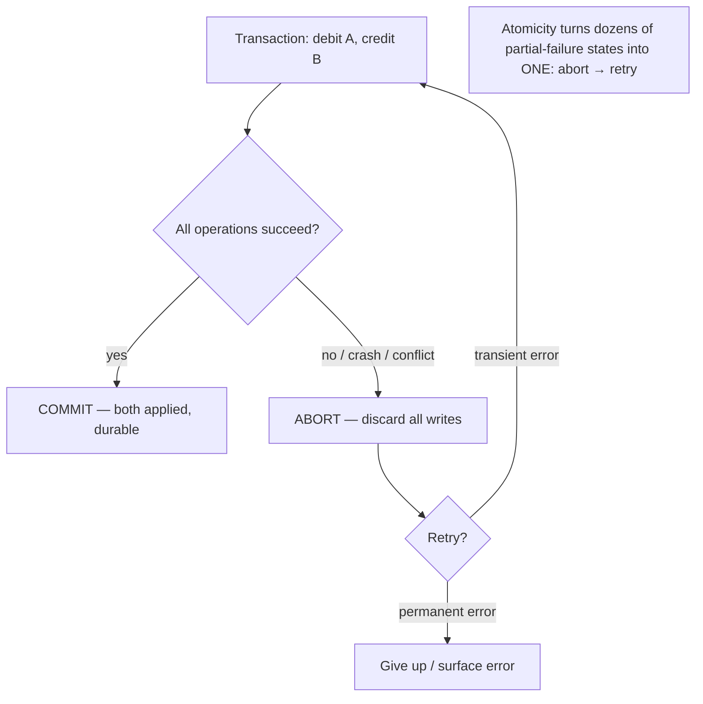
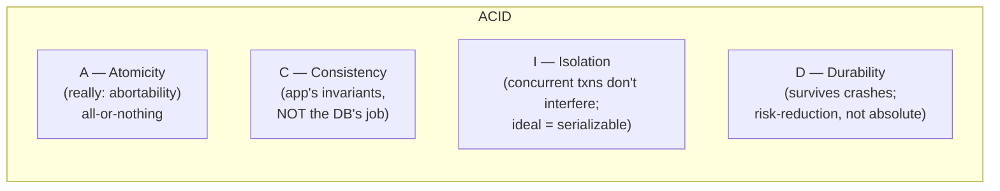

# 08 - Transactions & ACID

**Prerequisites:** none (helps to know Topic 1)
**Difficulty:** Intermediate
**Interview importance:** ⭐ **Critical**
**Source:** Chapter 7 — "The Slippery Concept of a Transaction", "The Meaning of ACID"

---

## 1. What Is It?

A **transaction** groups several reads and writes into one logical unit. The whole unit either **commits** (all its writes take effect) or **aborts/rolls back** (none do). There's no in-between where half the writes happened.

The book's one-sentence framing is the best definition:

> A transaction is an **abstraction layer that lets an application pretend that certain concurrency problems and certain kinds of hardware and software faults don't exist.** A large class of errors is reduced to a simple **abort**, and the application just retries.

**ACID** — Atomicity, Consistency, Isolation, Durability — is the marketing term for the guarantees transactions provide. As the book stresses, the term is far less precise than it sounds.

---

## 2. Why Does It Exist?

Consider everything that can go wrong writing to a database:

- The database or application **crashes mid-operation** (power loss, bug), leaving some writes applied and others not.
- A **network interruption** cuts off the application mid-request.
- **Multiple clients write concurrently**, overwriting each other.
- A client reads **partially-updated** data that doesn't make sense.
- **Race conditions** between clients cause subtle bugs.

Without transactions, every one of these is *your* problem to handle, individually, everywhere. Denormalized data goes out of sync. Concurrent access corrupts state. Reasoning about "what could go wrong when these accesses interleave" becomes intractable.

Transactions exist to **collapse all of that into one outcome you can handle: the abort.** Instead of enumerating dozens of partial-failure states, you get "it worked" or "it didn't; retry." That's a massive reduction in complexity, and it's why transactions were one of the most important abstractions databases ever provided.

The counterpoint the book raises: transactions aren't free (performance, availability), and in the distributed-systems era some databases abandoned them, claiming they don't scale. That claim is partly true and often overstated — which is what Chapters 7–9 unpack.

---

## 3. Simple Explanation

**All or nothing, and don't let others' half-done work confuse you.**

- **Atomicity:** if anything in the group fails, the whole group is undone. You're never left with a half-transfer.
- **Consistency:** the transaction takes the database from one valid state to another (defined by *your* rules) — but note this one is mostly the application's job, not the database's.
- **Isolation:** concurrent transactions don't step on each other; each runs as if it were alone.
- **Durability:** once committed, it survives crashes.

The classic example: transfer ₹100 from account A to B. Debit A, credit B. **Atomicity** ensures you never debit A without crediting B (money vanishing) or credit B without debiting A (money appearing). Two operations, one indivisible unit.

---

## 4. Real-World Analogy

**A bank teller processing a transfer.**

You hand over a slip: "move ₹100 from savings to checking." The teller either does *both* the debit and the credit, or — if anything goes wrong (system down, insufficient funds) — does *neither* and hands your slip back saying "couldn't process, try again." What the teller will *never* do is take ₹100 from savings, then get interrupted, and leave you with the money simply gone. That's atomicity.

Meanwhile, other tellers serving other customers don't let you see your account mid-transfer with the debit done but the credit missing (isolation), and once the teller stamps "done," a power cut in the building doesn't undo it (durability). The bank's rule that your total balance can't go negative — that's consistency, and it's a rule the *bank* defines, not a property the transaction machinery provides on its own.

---

## 5. Technical Explanation — ACID, precisely

The book is pointed that ACID means different things in different databases (especially "isolation" and "consistency"), and that "ACID-compliant" is more marketing than specification. Systems that don't meet ACID are sometimes called **BASE** — Basically Available, Soft state, Eventual consistency — which is even vaguer, meaning little more than "not ACID."

### Atomicity — "abortability"

Atomicity here does **not** mean "concurrency isolation" (that's the "A" in a different sense used elsewhere). In ACID, atomicity means: if a transaction's writes are grouped together and something goes wrong partway (a fault, a crash, a network failure), **the whole transaction is aborted and any writes it already made are discarded.** The database can safely throw away the partial work.

The book's better name for it: **abortability.** The point of atomicity is that if you can't complete, you can **abort and retry cleanly**, without worrying that half your changes are stuck. Without atomicity, a failed multi-write leaves you unsure which writes succeeded, and retrying might double-apply some.

### Consistency — the odd one out

Consistency in ACID means the database is always in a "good state" satisfying certain **invariants** — statements about your data that must always be true (e.g., in accounting, credits and debits balance).

But here's the book's sharp observation: **this is a property of the application, not the database.** The application defines what a valid state is; the database only stores what you tell it. If you write data that violates your own invariants, the database can't stop you (beyond a few things it *can* enforce, like foreign-key or uniqueness constraints). So the C in ACID is arguably in the wrong place — it depends on the application's notion of invariants using the database's A, I, and D. Joe Hellerstein has noted the C was "tossed in to make the acronym work."

### Isolation — concurrency, hidden

Isolation means **concurrently executing transactions are isolated from each other** — each can pretend it's the only one running. The classic formalization is **serializability:** the database guarantees that when transactions commit, the result is the same *as if* they had run **one at a time (serially)**, even though in reality they ran concurrently.

This is the ideal. But — and this is the whole of Topic 18 — **serializable isolation is expensive, so databases offer weaker levels** (read committed, snapshot isolation) that permit certain race conditions in exchange for performance. So "isolation" in practice usually means "some level weaker than serializable," and you must know which anomalies your level allows.

The book's concrete race condition: two clients both increment the same counter from 42. Each reads 42, adds 1, writes 43. Final value: 43, when it should be 44. One increment was lost. This **lost update** (Topic 18) is exactly what isolation is supposed to prevent — and weak isolation doesn't.

### Durability — it survives

Durability means: once a transaction commits successfully, **the data won't be lost even if there's a hardware fault or the database crashes.** On a single node, this means writing to nonvolatile storage (disk/SSD), usually with a write-ahead log (Topics 6, 7) so data can be recovered even if the write to the main data structures was interrupted. In a replicated database, durability may mean the data is copied to some number of nodes before commit is reported.

The book's honest caveat: **perfect durability doesn't exist.** Disks can fail even after a successful write; fsync can lie; firmware bugs exist; a crash after write-but-before-flush loses data; replicas can all be corrupted by the same bug. Durability is a matter of *reducing risk*, not eliminating it — which is why you combine multiple techniques (disk + WAL + replication + backups).

### Single-object and multi-object operations

- **Single-object writes** (updating one row/document) get atomicity and isolation from the storage engine itself — e.g., via a log for crash recovery and a lock on the object. Some databases offer richer single-object operations like atomic increment (avoiding read-modify-write races) and compare-and-set (write only if the value hasn't changed). These are useful but are **not** full transactions.

- **Multi-object transactions** (coordinating writes across several objects) are what people usually mean by "transactions." **Why do you need them?** The book's examples: a foreign-key reference must stay valid across two rows; denormalized data in a document model must be updated together to stay in sync; a secondary index must be updated together with the primary data (or the index points to nonexistent or wrong records). Many distributed datastores abandoned multi-object transactions because they're hard to implement across partitions — but nothing prevents them in principle, and they're valuable regardless of data model.

- **Handling errors and aborts.** A key philosophy: transactions are built to be **safely retried on abort.** ACID databases are based on this — if the database is in danger of violating a guarantee, it abandons the transaction entirely rather than leaving it half-done. But retrying an aborted transaction isn't perfect either: if the transaction actually succeeded but the *acknowledgment* was lost (network), retrying performs it twice (unless you deduplicate); if the error is due to overload, retrying makes it worse (use exponential backoff, limit retries); retrying is pointless for permanent errors (constraint violation); and if the transaction has **side effects outside the database** (sending an email), you don't want those repeated on retry (needs idempotence — Topic 9). Leaderless stores (Topic 13) famously don't offer this "retry on abort" model, pushing error recovery to the application.

---

## 6. Diagrams





---

## 7. Concrete Example

**A ledger for a billing platform: charge a customer and record the invoice line.**

The operation: (1) decrement the customer's prepaid balance, (2) insert an invoice line item, (3) update the running invoice total. Three writes across three tables that must be consistent.

- **Without a transaction:** a crash after step 1 leaves the balance decremented but no invoice line — the customer paid for nothing. A crash after step 2 leaves a line with no total update — the invoice doesn't add up. Concurrent charges race on the running total and lose updates. You'd have to detect and repair each of these by hand.
- **With a transaction:** all three commit together or none do (**atomicity**). Concurrent charges don't corrupt the total (**isolation**, assuming a strong enough level — see Topic 18). Once committed, a crash can't lose it (**durability**). Your invariant "balance decremented ⟺ invoice line exists ⟺ total reflects it" holds (**consistency** — which *you* defined and the transaction machinery helps you maintain).

If the transaction aborts (deadlock, conflict), you **retry** — but carefully: if the charge partially went through externally (say you already told a payment gateway), a naive retry double-charges. That external side effect is exactly the case where retry-on-abort isn't enough and you need idempotency keys (Topics 9, 35). This is the reasoning a staff interviewer wants: transactions handle the *database* cleanly, but side effects outside the database need extra care.

---

## 8. When to Use / Not Use

**Use transactions when:** multiple objects must change together to preserve an invariant (transfers, ledgers, foreign keys, denormalized data, secondary indexes); concurrent access could corrupt state; you want to reduce the space of failure cases to "retry the abort."

**You can often skip them when:** access patterns are very simple — reading and writing a single record — where the storage engine's single-object atomicity suffices; the operations are naturally idempotent and independent; you're using atomic single-object primitives (increment, compare-and-set) that cover your need.

**Reconsider / they get hard when:** the data is partitioned and the transaction spans partitions (distributed transactions — Topic 25 — are costly and can block); extreme write throughput makes coordination the bottleneck; you're in a leaderless store that doesn't offer the retry-on-abort model.

---

## 9. Advantages & Disadvantages

**Advantages**
- Collapse many failure cases into one retryable outcome (**abort**) — huge complexity reduction.
- Maintain invariants across multiple objects.
- Make concurrency reasoning tractable (with strong isolation).
- Durability of committed data.

**Disadvantages**
- **Performance cost** — locking, coordination, logging.
- **Availability cost** — strong isolation can force blocking or aborts under contention.
- **Hard across partitions** — distributed transactions can block on coordinator failure (Topic 25).
- **Weak isolation levels** (the common default) still let subtle anomalies through (Topic 18).
- Retry-on-abort has sharp edges: duplicate acks, overload amplification, external side effects.

---

## 10. Trade-off Table

| Approach | Advantages | Disadvantages | When to Use |
|---|---|---|---|
| Full multi-object transactions | Invariants preserved; simple failure model | Cost; hard across partitions | Ledgers, transfers, anything with cross-object invariants |
| Single-object atomic ops (increment, CAS) | Fast; no full-transaction cost; avoids read-modify-write races | Only one object; not general | Counters, flags, optimistic updates |
| No transactions (application-managed) | Max performance/availability | You handle every partial-failure case; error-prone | Simple, independent, idempotent single-record ops |
| Leaderless / BASE | Availability, scale | No retry-on-abort; app owns consistency | High-availability, eventually-consistent workloads |

---

## 11. Failure Scenarios

| Scenario | Consequence | How transactions help / caveat |
|---|---|---|
| Crash mid multi-write | Half-applied state | **Atomicity** discards the partial work; retry |
| Concurrent writes to same data | Lost update / corruption | **Isolation** prevents it (if level is strong enough — Topic 18) |
| Commit acked, then crash | Was it durable? | **Durability** guarantees committed data survives (risk-reduced, not absolute) |
| Abort acked but txn actually committed | Retry double-applies | Deduplicate; idempotency keys |
| Overload causes aborts | Retry storm worsens it | Exponential backoff; retry limits |
| Permanent error (constraint violation) | Retry loops forever | Don't retry permanent errors |
| Txn has external side effect (email/charge) | Repeated on retry | Idempotence outside the DB (Topics 9, 35) |
| Transaction spans partitions | Distributed commit can block | 2PC (Topic 25); or design to stay single-partition |

---

## 12. Production Considerations

- **Know your isolation level** — the default is often *not* serializable (Topic 18). "We use transactions" doesn't mean "we're safe from race conditions."
- **Keep transactions single-partition where possible.** Cross-partition transactions are where cost and blocking appear.
- **Make retry-on-abort real** — retriable errors, exponential backoff with jitter, retry caps, and idempotency for anything with external side effects.
- **Understand durability isn't absolute** — combine disk + WAL + replication + tested backups.
- **Don't over-scope transactions** — long transactions hold locks and increase contention and abort rates.
- **Prefer single-object atomic primitives** (increment, CAS) for the cases they cover — cheaper than a full transaction.

---

## ❌ 13. Common Mistakes

- **Assuming "transactions" means "serializable."** Most databases default to a weaker level that allows real anomalies (Topic 18).
- **Thinking the database enforces consistency (C).** It mostly doesn't — invariants are your job; the DB gives you A, I, D to maintain them.
- **Naive retry after a lost commit ack** → double execution.
- **Retrying permanent errors** or **retrying under overload without backoff** → loops and storms.
- **Putting external side effects inside a transaction** and repeating them on retry.
- **Treating durability as absolute** — fsync can lie, disks fail, replicas share bugs.
- **Wrapping too much in one transaction** → lock contention, deadlocks, high abort rates.

---

## 🧠 14. Think Like an Engineer

```
Do multiple objects need to change together to keep an invariant?
   no  → maybe a single-object atomic op (increment/CAS) is enough
   yes → use a multi-object transaction
        ↓
What isolation level does this actually need? (Topic 18)
   (default is often NOT serializable — check!)
        ↓
Is this single-partition or cross-partition?
   (cross-partition = costly, can block → design to avoid if possible)
        ↓
On abort, is retry safe?
   transient → backoff + retry
   lost ack  → dedupe / idempotency key
   external side effect → make it idempotent (Topics 9, 35)
   permanent → don't retry
        ↓
How durable do I actually need this? (disk + WAL + replication + backups)
```

---

## 15. Mental Model

```
Transactions turn a mess of partial-failure states into ONE: abort → retry
      ↓
A — all or nothing (really: abortability)
C — YOUR invariants (not the DB's job)
I — as if run one at a time (ideal = serializable; usually weaker)
D — survives crashes (risk-reduced, not absolute)
      ↓
Retry-on-abort is powerful but has edges: lost acks, overload, external side effects
```

---

## 🔗 16. How This Connects to Other Concepts

- **Weak Isolation (Topic 18)** — the immediate sequel: since serializable is expensive, what do the weaker levels let through?
- **Serializability (Topic 19)** — how to actually achieve the ideal "as if run one at a time."
- **Two-Phase Commit (Topic 25)** — atomicity across partitions/systems; where transactions get hard and can block.
- **Encoding / RPC (Topic 9)** — idempotence, needed for safe retry when acks are lost or side effects are external.
- **End-to-End Correctness (Topic 35)** — the modern view: strong invariants without distributed transactions, using idempotence and async checks.
- **Reliability (Topic 1)** — transactions are a fault-tolerance abstraction: they convert faults into retryable aborts.

---

## 17. Interview Questions & Answers

**Beginner**

**Q: What is a transaction?**
A group of reads and writes treated as one unit that either fully commits or fully aborts — never half. Its purpose is to let the application pretend that concurrency problems and certain faults don't exist, by collapsing a whole space of partial-failure states into a single outcome: the abort, which you just retry.

**Q: What does ACID stand for?**
Atomicity — all or nothing; Consistency — the database moves between valid states as defined by the application's invariants; Isolation — concurrent transactions don't interfere; Durability — committed data survives crashes. It's worth knowing the term is looser than it sounds, and that Consistency is really the application's responsibility, not something the database provides on its own.

**Intermediate**

**Q: Which letter of ACID is the odd one out, and why?**
Consistency. Atomicity, isolation, and durability are properties the database provides. Consistency — keeping invariants like "credits equal debits" true — is defined by the application; the database only stores what you tell it and can enforce a few things like uniqueness or foreign keys. So the C depends on the application using the database's A, I, and D correctly. It's often said the C was included mainly to make the acronym pronounceable.

**Q: Why is atomicity better described as "abortability"?**
Because the real value isn't the "atom" metaphor — it's that if a transaction can't complete, the database discards everything it did so far and you can retry from a clean state. Without that, a failed multi-write leaves you unsure which writes landed, so retrying might double-apply some and leave others missing. Atomicity guarantees there's no partial state to untangle: it either all happened or none did, so retry is always safe with respect to the database.

**Q: When do you actually need a multi-object transaction?**
When multiple objects have to change together to preserve an invariant. A foreign key requires the referenced row to exist. Denormalized data in a document model has to be updated in sync or it drifts. A secondary index must be updated together with the primary data or it points to wrong or missing records. If you're only ever reading and writing a single record, the storage engine's single-object atomicity is usually enough and you don't need a full transaction.

**Advanced / Staff**

**Q: What are the pitfalls of retry-on-abort?**
The model assumes retrying an aborted transaction is safe, and mostly it is with respect to the database, but there are sharp edges. If the transaction actually committed and only the acknowledgment was lost to a network failure, retrying runs it twice unless you deduplicate with an idempotency key. If the abort was caused by overload, blind retries add load and worsen it, so you need exponential backoff with jitter and a retry cap. Retrying a permanent error like a constraint violation just loops. And the worst case is a side effect outside the database — sending an email, calling a payment gateway — which retry repeats, so those operations have to be made idempotent separately. So retry-on-abort is powerful but it's only clean inside the transactional boundary; anything crossing that boundary needs its own idempotence story.

**Q: A distributed database advertises "we dropped transactions because they don't scale." How do you evaluate that?**
I'd treat it as partly true and often overstated. It's true that multi-object transactions across partitions are genuinely hard and that distributed commit protocols like two-phase commit can block on coordinator failure and hurt availability. But "don't scale" is too strong — nothing prevents multi-object transactions in a partitioned system in principle, and many systems provide them within a partition cheaply. So the right question is what the workload actually needs. If the invariants are all within a single object or a single partition, you can keep strong transactions and scale fine by choosing the partition key well. If you genuinely need cross-partition invariants, dropping transactions doesn't make the problem go away — it pushes the consistency burden into application code, which usually handles it worse. The modern middle path, from Chapter 12, is to keep operations idempotent and check constraints asynchronously, getting strong integrity without holding distributed locks. So I'd want to see whether they replaced transactions with a disciplined alternative or just removed the guarantee and hoped.

---

## 🎯 30-Second Interview Answer

> "A transaction groups reads and writes into a unit that either fully commits or fully aborts. Its real purpose is to let the application pretend concurrency problems and faults don't exist by collapsing a huge space of partial-failure states into one outcome — the abort — which you retry. ACID is the guarantee set: atomicity, which is really abortability, all-or-nothing; consistency, which is actually the application's job, not the database's; isolation, ideally serializable but usually weaker; and durability, which is risk-reduction, not absolute. You need multi-object transactions when several objects must change together to keep an invariant — transfers, foreign keys, secondary indexes. The one thing I'd flag is that retry-on-abort is only clean inside the database; a lost commit ack or an external side effect like a payment call needs idempotency on top, or you double-charge."

---

## ⚡ Quick Revision

- **Transaction:** group of reads/writes; **commit all or abort all**. Purpose: turn many partial-failure states into **one outcome (abort → retry)**.
- **ACID** = **A**tomicity, **C**onsistency, **I**solation, **D**urability — but the term is loose/marketing.
- **A = abortability** (all-or-nothing; discard partial work → clean retry).
- **C is the odd one out** — it's the **application's invariants**, not the DB's job.
- **I = concurrency isolation**; ideal is **serializable** (as if run one at a time), but the default is usually weaker → anomalies (Topic 18).
- **D = durability**; **risk-reduction, not absolute** (fsync lies, disks fail, replicas share bugs).
- **Single-object** atomicity is free from the storage engine; **atomic increment / compare-and-set** cover simple cases without a full txn.
- **Multi-object txns** needed for: foreign keys, denormalized data, secondary indexes.
- **Retry-on-abort edges:** lost ack → dedupe/idempotency; overload → backoff; permanent error → don't retry; external side effect → idempotence (Topics 9, 35).
