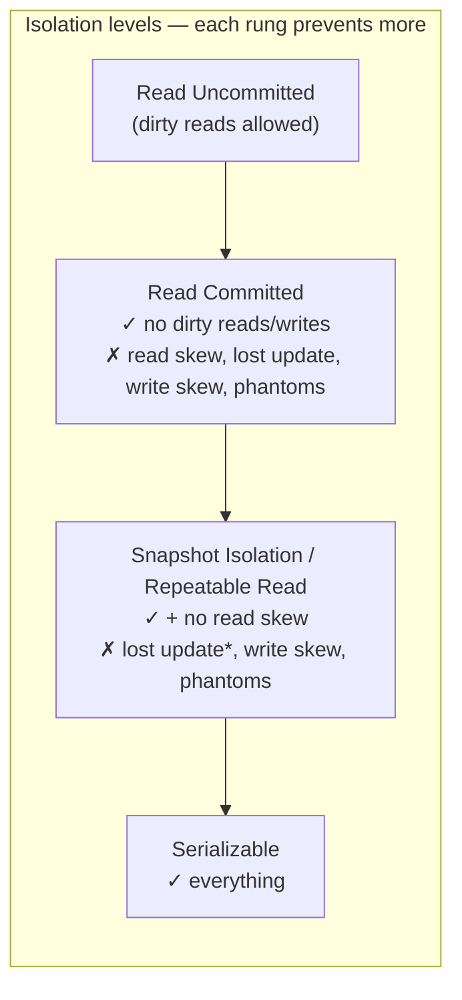
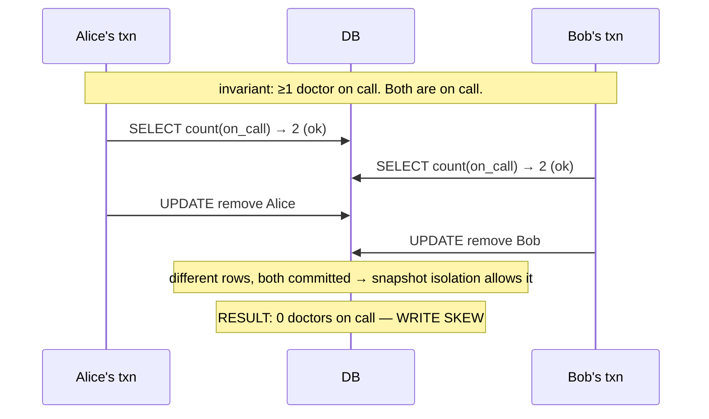

# 09 - Weak Isolation Levels & Race Conditions

**Prerequisites:** Topic 17 (transactions & ACID)
**Difficulty:** Advanced
**Interview importance:** ⭐ **Critical** (write skew is a favourite staff-level question)
**Source:** Chapter 7 — "Weak Isolation Levels"

---

## 1. What Is It?

Isolation (the "I" in ACID) is supposed to make concurrent transactions behave as if they ran one at a time. The strongest form, **serializable**, guarantees exactly that — but it's expensive.

So databases offer **weaker isolation levels** that permit certain **race conditions** (concurrency anomalies) in exchange for better performance. This file is a catalogue of those anomalies and the levels that do — or don't — prevent them:

- **Read Committed** (the common default)
- **Snapshot Isolation** (a.k.a. Repeatable Read)

And the anomalies: **dirty reads, dirty writes, read skew, lost updates, write skew, and phantoms.**

The single most important thing this file teaches: **your database's default isolation level is probably not serializable, so subtle bugs are possible, and you must know which ones.**

---

## 2. Why Does It Exist?

Serializable isolation would make life easy — just pretend concurrency doesn't exist. But it has a real performance cost (locking, aborts, coordination), and for decades most databases didn't offer it, or offered it only as a slow option that people avoided.

So the industry settled on weaker levels that are fast and prevent *some* problems. The catch: these anomalies are **hard to find**. They only manifest under concurrency, which is timing-dependent and rare in testing. A bug caused by weak isolation might occur once in ten thousand transactions — invisible in tests, catastrophic at scale. Databases have shipped with serious concurrency bugs for years.

The book's stance: don't blindly rely on tools. Understand the anomalies, know which your level prevents, and reason about your specific access patterns. Financial damage, data corruption, and audits force this understanding.

---

## 3. Simple Explanation

Isolation levels are a ladder. Each rung prevents more anomalies and costs more:

| Level | Prevents | Still allows |
|---|---|---|
| Read Uncommitted | (almost nothing) | dirty reads, everything below |
| **Read Committed** | dirty reads, dirty writes | read skew, lost updates, write skew, phantoms |
| **Snapshot Isolation** | + read skew | lost updates*, write skew, phantoms |
| **Serializable** | everything | — |

The anomalies, in one line each:

- **Dirty read:** you see another transaction's uncommitted write.
- **Dirty write:** you overwrite another transaction's uncommitted write.
- **Read skew:** you read different parts of the database at different points in time (an inconsistent snapshot).
- **Lost update:** two read-modify-write cycles clobber each other; one update vanishes.
- **Write skew:** two transactions read the same thing, then write to *different* objects based on it, and together violate an invariant.
- **Phantom:** a write in one transaction changes the *result of a search* in another.

---

## 4. Real-World Analogy

**A shared shopping list app used by two flatmates.**

- **Dirty read:** flatmate A is *mid-edit*, hasn't saved, and B sees the half-written entry. Then A cancels — B acted on data that never officially existed.
- **Dirty write:** both edit the same item at once; A's unsaved change gets overwritten by B's, interleaved wrongly.
- **Read skew:** you glance at the "milk" item (present) and then, a moment later, the "total items" counter (already decremented because someone removed milk in between). The two readings don't correspond to any single real state.
- **Lost update:** both see "eggs: buy 6," both change it — A to 12, B to 3 — and one edit silently wins; the other is lost.
- **Write skew:** the rule is "at least one flatmate must be on grocery duty this week." Both check, both see the other is on duty, both remove *themselves*. Each write is to a different record (their own status), each was individually fine, but together they broke the invariant — nobody's on duty.

Write skew is the subtle one, and it's the one interviews probe, because it slips past everything short of serializable.

---

## 5. Technical Explanation

### Read Committed — the common default

The most basic useful level. Two guarantees:

1. **No dirty reads:** you only ever see data that has been **committed.** A transaction's writes are invisible to others until it commits. This prevents seeing a partial update (some writes visible, others not) and prevents acting on a value that later rolls back.
2. **No dirty writes:** you only **overwrite** data that has been committed. If two transactions try to update the same object, the second's write is delayed until the first commits or aborts. This prevents two transactions' writes from being interleaved in a way that mixes them. (Note: read committed does *not* prevent lost updates — that's a different problem.)

**Implementation:** dirty writes are prevented with **row-level locks** — a transaction takes a lock on an object before writing, holds it until commit/abort, so only one transaction can hold it at a time. Dirty reads *could* use read locks too, but that hurts performance (one long write transaction blocks all readers). So instead, databases **remember both the old committed value and the new uncommitted value**, and serve the old value to any reader until the write commits. Most databases (PostgreSQL, Oracle, SQL Server, etc.) use this default or offer it.

### Read skew (nonrepeatable read) → motivates Snapshot Isolation

Read committed still allows a nasty anomaly. Alice has ₹1,000 across two accounts (₹500 each). She reads account 1 (₹500), then a transfer of ₹100 from account 1 to account 2 commits, then she reads account 2 (now ₹600). She sees ₹500 + ₹600 = ₹1,100 — money that doesn't exist. A moment later it's fine, so it's a temporary anomaly, but it's a real inconsistency: **she read different parts of the database at different points in time.**

This is **read skew** (or nonrepeatable read). For Alice it's harmless (refresh fixes it), but it's **unacceptable** for: **backups** (you'd copy an inconsistent snapshot, permanently baking in the inconsistency), and **analytic queries / integrity checks** (which scan large parts of the database and would return nonsense).

### Snapshot Isolation (Repeatable Read)

The fix for read skew: **each transaction reads from a consistent snapshot of the database** — it sees all the data as it was at the moment the transaction started. Even if the data changes, the transaction sees the old, consistent snapshot throughout. This is **snapshot isolation.** It's a boon for long-running read-only queries like backups and analytics.

**Implementation — MVCC (Multi-Version Concurrency Control):** the database keeps **multiple committed versions** of an object side by side, because different in-flight transactions may need to see the state at different points in time. Read committed uses a separate snapshot per *query*; snapshot isolation uses the same snapshot for the whole *transaction*.

Mechanically: each transaction gets a unique, always-increasing **transaction ID (txid)**. Every write is tagged with the txid that made it. Rows carry a `created_by` and (on deletion) a `deleted_by` txid. **Visibility rules** determine what a transaction sees: it sees a row only if the row was created by a transaction that had already committed when this transaction started, and was not deleted by a transaction that had committed by then — plus it always sees its own writes. Deletes are just marked with `deleted_by` (and garbage-collected later); updates are a delete + create internally.

**Indexes and snapshot isolation:** one approach is to have the index point to all versions and filter by visibility. Another (PostgreSQL) avoids index updates when versions fit on the same page. Some (CouchDB, Datomic) use append-only/copy-on-write B-trees, creating a new root for each write, so each snapshot is just the root as of its txid — no overwriting, background compaction cleans up.

**A naming mess to know:** the same level is called different things. Oracle calls snapshot isolation "serializable" (it isn't). IBM DB2 and SQL Server call it "repeatable read." The SQL standard's "repeatable read" is poorly defined, and different databases implement it differently. So **don't trust the level name — check what anomalies are actually prevented.**

### Preventing Lost Updates

Snapshot isolation prevents read skew but **not lost updates.** The lost update problem: two transactions do a **read-modify-write** cycle concurrently, and one silently overwrites the other's change. Examples: incrementing a counter (both read 42, both write 43, should be 44); making a local change to a complex value (two edits to a JSON document, one lost); two users editing a wiki page at once.

Solutions:

- **Atomic write operations.** Many databases provide atomic update primitives — `UPDATE counters SET value = value + 1 WHERE key = 'x'`. These are safe from lost updates because the database takes an exclusive lock on the object during the read-modify-write, so no other transaction can read it in between (**cursor stability**). Use them where you can — but not all operations fit (e.g., editing a wiki page). Watch out for ORMs that turn atomic operations into unsafe read-modify-write in application code.
- **Explicit locking.** The application explicitly locks the objects it will update using `SELECT ... FOR UPDATE`, forcing other transactions to wait. Needed when the logic is too complex for a built-in atomic operation. Correct, but you must remember to lock the right things — easy to miss.
- **Automatically detecting lost updates.** Let transactions run concurrently, and if the transaction manager detects a lost update, **abort and force a retry.** PostgreSQL's repeatable read, Oracle's serializable, and SQL Server's snapshot isolation levels automatically detect lost updates; MySQL/InnoDB's repeatable read **does not.** Advantage: works even with application-side read-modify-write; requires no special application code.
- **Compare-and-set (CAS).** Update only if the value hasn't changed since you read it: `UPDATE ... SET content = 'new' WHERE id = 1 AND content = 'old'`. If someone else changed it, your update matches nothing and fails; retry. **But beware:** if the WHERE clause reads from an old snapshot (under snapshot isolation), the compare may not actually protect you — check whether your database's CAS is safe under its snapshot behaviour.
- **Conflict resolution and replication.** In replicated (multi-leader/leaderless) databases, locks and CAS don't work because there are multiple copies on different nodes. As covered in Topics 12–13, you allow concurrent writes to create siblings and use application code or special data structures (CRDTs) to merge. LWW is the common default and it's **prone to lost updates** — so it's a poor choice where losing data matters.

### Write Skew and Phantoms — the subtle killer

**Write skew** is a generalization of lost update. Two transactions **read the same objects, then update different objects.** (Lost update is the special case where they update the *same* object.)

The book's example: a hospital on-call scheduling system with an invariant "**at least one doctor must be on call.**" Alice and Bob are both on call and both feel unwell. Each transaction: check how many doctors are on call (both see 2 ≥ 2, fine), then remove *themselves*. Alice's transaction removes Alice; Bob's removes Bob. Each write is to a *different* row, each transaction individually preserved the invariant *as it saw it* — but concurrently, they've left **zero doctors on call.** The invariant is violated.

Why weaker levels miss it: there's no dirty read (both committed), no dirty write (different rows), no lost update (different objects). Snapshot isolation doesn't help because each read a valid snapshot; the problem is the **combination** of two writes that each looked safe in isolation.

Other write skew examples: two people booking the same meeting room concurrently (each checks it's free, each books); claiming the same username (each checks it's taken, each inserts); double-spending (two concurrent transactions each check the balance is sufficient).

**Phantoms.** Write skew often follows a pattern: a `SELECT` checks a requirement (are there ≥2 doctors on call? is the room free?), then the application acts on the result with a write, and that write **changes the result the earlier query would now return.** This effect — where a write in one transaction changes the result of a search query in another — is a **phantom.** Snapshot isolation prevents phantoms in read-only queries, but in read-write transactions leading to write skew, phantoms are the mechanism.

**Materializing conflicts.** One workaround: if the phantom is because there's no object to lock (you're checking for the *absence* of rows), you can artificially introduce lockable rows — e.g., pre-create rows for all possible time-slot/room combinations, so a booking locks a concrete row. This "materializing conflicts" is ugly and error-prone, and the book says it should be a last resort. **The clean solution is serializable isolation (Topic 19).**

---

## 6. Diagrams





---

## 7. Concrete Example

**A booking system for meeting rooms, on PostgreSQL default (read committed) — then repeatable read — then serializable.**

Operation: "book room 5 from 2–3pm if it's free." Two users click at the same instant.

- **Read committed / snapshot isolation:** both transactions run `SELECT` and find no conflicting booking (each reads a snapshot without the other's write), both `INSERT` their booking into *different* rows. Result: **double-booked room.** This is write skew via a phantom — each write changed what the other's check *would* now return, but neither saw it. No amount of snapshot isolation fixes this, because there was no shared row to conflict on.
- **Workaround (materializing conflicts):** pre-create a row per (room, time-slot). A booking does `SELECT ... FOR UPDATE` on that concrete row, so the second booking blocks. Works, but you've polluted the schema and it's fragile.
- **Serializable isolation (Topic 19):** the database detects that the two transactions' reads and writes can't be serialized (one read what the other wrote), and **aborts one**, which retries and now sees the booking. Clean, correct, no schema hacks.

The interview lesson: recognizing this as **write skew**, explaining *why* snapshot isolation doesn't catch it (different rows, valid snapshots), and reaching for serializable rather than a lock hack — that's the staff-level answer.

---

## 8. When to Use / Not Use Each Level

**Read Committed:** the sensible default for most workloads. Use when you can tolerate read skew and your write patterns don't have lost-update or write-skew hazards (or you handle those explicitly with atomic ops / locks).

**Snapshot Isolation (Repeatable Read):** when you need consistent reads — backups, long analytic queries, integrity checks, or any transaction that reads many rows and must see a coherent picture. Also prevents lost updates *if* your database's implementation detects them (Postgres yes, MySQL/InnoDB no).

**Serializable (Topic 19):** when write skew or phantoms would violate a real invariant (on-call scheduling, booking, uniqueness, balance checks) and you can't easily encode the constraint another way. Accept the performance cost for correctness.

**Explicit locking / atomic ops / CAS:** targeted fixes for lost updates when you don't want full serializability.

---

## 9. Advantages & Disadvantages

**Weak isolation — advantages:** high performance and concurrency; fewer aborts; less locking; the default for good throughput.
**Weak isolation — disadvantages:** permits anomalies that are timing-dependent and nearly invisible in testing; you must reason about them per access pattern; write skew is easy to miss; naming confusion means the level label doesn't tell you what's prevented.

**Serializable — advantages:** eliminates all anomalies; no need to reason about race conditions.
**Serializable — disadvantages:** performance cost; more aborts under contention (Topic 19).

---

## 10. Trade-off Table

| Level | Dirty read | Dirty write | Read skew | Lost update | Write skew / phantom | Cost |
|---|---|---|---|---|---|---|
| Read Uncommitted | ✗ allowed | ✗ | ✗ | ✗ | ✗ | Lowest |
| Read Committed | ✓ prevented | ✓ | ✗ allowed | ✗ | ✗ | Low |
| Snapshot Isolation / RR | ✓ | ✓ | ✓ | ~ (detected in some DBs) | ✗ allowed | Medium |
| Serializable | ✓ | ✓ | ✓ | ✓ | ✓ | Highest |

| Lost-update fix | Works with app-side RMW? | Notes |
|---|---|---|
| Atomic write op | N/A (DB does it) | Best when it fits; beware ORM turning it into RMW |
| Explicit `FOR UPDATE` lock | Yes | Must lock the right objects |
| Automatic detection + retry | **Yes** | Postgres RR / Oracle serial. / SQL Server SI do it; **MySQL InnoDB RR does not** |
| Compare-and-set | Yes | Check it's safe under snapshot isolation |

---

## 11. Failure Scenarios

| Anomaly | Real-world consequence | Fix |
|---|---|---|
| Dirty read | Act on data that gets rolled back | Read committed (default) |
| Dirty write | Interleaved writes corrupt state | Read committed (row locks) |
| Read skew | Backup/analytics capture inconsistent state | Snapshot isolation |
| Lost update | Counter/edit silently overwritten | Atomic op / lock / detect+retry / CAS |
| Write skew | On-call empty; room double-booked; balance overdrawn; duplicate username | Serializable (or materialize conflicts as last resort) |
| Phantom | A check passes, then a concurrent write invalidates it | Serializable; index-range locks (Topic 19) |

---

## 12. Production Considerations

- **Check your actual default isolation level** — and what it *actually* prevents, not what it's named. "Repeatable read" means different things across databases.
- **MySQL InnoDB's repeatable read does NOT auto-detect lost updates** — a common trap. PostgreSQL's does.
- **Enumerate your write-skew risks:** any transaction that reads a condition and then writes based on it is suspect (bookings, scheduling, uniqueness, balance checks).
- **Use atomic operations** for counters and simple updates instead of read-modify-write; audit ORMs for silently unsafe patterns.
- **Use snapshot isolation for backups and long analytic reads**, always.
- **For real invariants that weak isolation can't protect, use serializable** rather than fragile lock hacks — measure the cost, but prefer correctness.
- **These bugs won't show in tests.** They're timing-dependent and rare. Reason about them; don't rely on catching them empirically.

---

## ❌ 13. Common Mistakes

- **Assuming the default is serializable.** It's usually read committed or snapshot isolation, which allow real anomalies.
- **Trusting the level name.** Oracle's "serializable" is snapshot isolation; "repeatable read" varies by database.
- **Missing write skew** because each write looked individually correct.
- **Read-modify-write in application code** where an atomic operation would be safe (often introduced by ORMs).
- **Relying on MySQL InnoDB RR to catch lost updates** — it doesn't.
- **Compare-and-set that reads a stale snapshot**, so the compare doesn't actually protect you.
- **Copying a backup under read committed**, permanently capturing an inconsistent snapshot.
- **Reaching for lock hacks / materializing conflicts** when serializable would be cleaner and correct.

---

## 🧠 14. Think Like an Engineer

```
Does this transaction read a condition and then write based on it?
   yes → WRITE SKEW risk. Weak isolation won't save you.
        ↓
Is it a read-modify-write on the SAME object?
   yes → LOST UPDATE risk → atomic op / lock / detect+retry / CAS
        ↓
Does it scan many rows and need a coherent picture? (backup/analytics)
   yes → SNAPSHOT ISOLATION
        ↓
Is there a real invariant that must hold across concurrent txns?
   yes → SERIALIZABLE (don't hack it with pre-created lock rows unless forced)
        ↓
What does my DB's default level ACTUALLY prevent? (check, don't trust the name)
   (MySQL InnoDB RR ≠ Postgres RR for lost-update detection!)
```

---

## 15. Mental Model

```
Serializable is ideal but expensive → weaker levels allow anomalies
      ↓
Read Committed: no dirty reads/writes (but read skew, lost update, write skew)
Snapshot Isolation: + consistent snapshot (but lost update*, write skew)
Serializable: all anomalies gone
      ↓
Lost update  = two RMW on the SAME object clobber each other
Write skew   = two txns read same thing, write DIFFERENT objects, break invariant
Phantom      = a write changes what another txn's SELECT would return
      ↓
The level NAME lies — check what's actually prevented.
```

---

## 🔗 16. How This Connects to Other Concepts

- **Transactions & ACID (Topic 17)** — isolation is the "I"; this file is what happens when it's weakened for performance.
- **Serializability (Topic 19)** — the level that eliminates write skew and phantoms; the clean fix.
- **Leaderless / Multi-Leader (Topics 12–13)** — lost updates via LWW; locks/CAS don't work across replicas, so you merge (CRDTs).
- **B-Trees (Topic 7)** — index-range locks (Topic 19) attach to B-tree nodes; MVCC keeps multiple versions.
- **Replication Lag (Topic 11)** — read skew is the single-node cousin of the cross-replica staleness anomalies.
- **End-to-End Correctness (Topic 35)** — uniqueness and balance checks (write-skew cases) fundamentally need consensus/serialization.

---

## 17. Interview Questions & Answers

**Beginner**

**Q: What does Read Committed guarantee?**
Two things: no dirty reads, meaning you only see committed data, never another transaction's uncommitted writes; and no dirty writes, meaning you only overwrite committed data, so two transactions' writes to the same object can't interleave. It's the common default. Crucially, it does *not* prevent read skew, lost updates, or write skew.

**Q: What is a dirty read?**
Reading data that another transaction has written but not yet committed. It's a problem because that write might roll back, so you acted on a value that never officially existed, and because you might see a partial update — some of a transaction's writes visible and others not. Read committed prevents it by serving the last committed value until the writer commits.

**Intermediate**

**Q: What's the difference between lost update and write skew?**
Lost update is when two transactions read-modify-write the *same* object concurrently and one silently overwrites the other — like two increments of a counter both writing 43 when it should be 44. Write skew is the generalization: two transactions read the same data but then write to *different* objects, and the combination violates an invariant. The on-call example is canonical — two doctors each check that enough doctors are on call, then each removes themselves, writing different rows, and together they leave nobody on call. Lost update is the special case of write skew where the writes hit the same object.

**Q: Why doesn't snapshot isolation prevent write skew?**
Because snapshot isolation gives each transaction a consistent view as of its start, but it doesn't stop two transactions from each reading a valid snapshot, making decisions, and writing to different objects. There's no dirty read, no dirty write since the rows differ, and no lost update since the objects differ — so none of snapshot isolation's protections apply. The invariant breaks only because of the *combination* of two individually-safe writes, and detecting that requires reasoning about how the transactions would serialize, which is what serializable isolation does.

**Q: You need a unique username. Why is a check-then-insert unsafe under snapshot isolation?**
Because it's a write-skew pattern via a phantom. Two transactions both run "does this username exist?", both read a snapshot where it doesn't, both insert it into different rows, and now there are two users with the same name. Snapshot isolation doesn't catch it because each read was a valid snapshot and the writes are separate rows. The clean fix is a database uniqueness constraint, which enforces it at a lower level, or serializable isolation. Uniqueness fundamentally requires the two transactions to agree on who inserted first, which is why it ultimately reduces to consensus.

**Advanced / Staff**

**Q: Walk me through choosing isolation for a seat-booking system.**
The core operation is check-then-book, which is a textbook write-skew and phantom scenario — two users check a seat is free and both book it into separate rows. So I'd start by ruling out the weak levels: read committed and snapshot isolation both allow the double-booking, because the reads are valid snapshots and the writes are different rows. My preferred fix is serializable isolation, because it detects that the two transactions can't be serialized and aborts one to retry, and it does so without polluting the schema. If serializable's cost were prohibitive under measured contention, my fallbacks in order would be a database uniqueness constraint on (seat, showing) so the second insert fails cleanly, or explicit `SELECT ... FOR UPDATE` locking on a concrete row representing the seat — which is really "materializing the conflict." I'd avoid application-level check-then-insert entirely, since that's the pattern that fails. And I'd verify what my database's isolation level actually prevents rather than trusting its name, because "repeatable read" doesn't mean the same thing everywhere.

**Q: A counter is undercounting under load. Diagnose it.**
That's the lost-update signature: concurrent read-modify-write cycles clobbering each other, so two increments that both read the same starting value both write the same result and one is lost. The first thing I'd check is whether the increment is done as an atomic database operation — `SET value = value + 1` — or as read-in-app, add-one, write-back, because the latter is unsafe under most isolation levels and is often introduced silently by an ORM. If it's application-side, the fixes are: switch to an atomic operation, which lets the database lock the row for the read-modify-write; or use explicit `FOR UPDATE` locking; or rely on automatic lost-update detection, but only if the database supports it — Postgres repeatable read does, MySQL InnoDB repeatable read does not, which is a very common trap; or compare-and-set with retry, checking it's safe under the snapshot behaviour. For a hot counter I'd also consider sharding it into sub-counters to avoid making one row a contention point, which is the same skew idea as hot keys elsewhere.

---

## 🎯 30-Second Interview Answer

> "Serializable isolation is expensive, so databases default to weaker levels that allow specific race conditions. Read committed prevents dirty reads and dirty writes but still allows read skew, lost updates, and write skew. Snapshot isolation adds a consistent snapshot per transaction — great for backups and analytics — but still allows lost updates and write skew. The one that catches people is write skew: two transactions read the same condition, then write to *different* objects, and together break an invariant — like two doctors each seeing coverage is fine and both removing themselves from on-call, leaving nobody. Snapshot isolation misses it because the reads are valid snapshots and the writes are separate rows. The clean fix is serializable isolation. And two practical traps: the level *name* lies — Oracle's 'serializable' is snapshot isolation — and MySQL InnoDB's repeatable read doesn't detect lost updates while Postgres's does."

---

## ⚡ Quick Revision

- Serializable is expensive → weak levels allow **race conditions**; the bugs are timing-dependent and **invisible in tests**.
- **Read Committed** (common default): **no dirty reads, no dirty writes**. Still allows read skew, lost update, write skew, phantoms. Uses row locks + remembering old/new values.
- **Read skew:** read different parts of the DB at different times → inconsistent snapshot. Deadly for **backups and analytics**.
- **Snapshot Isolation (Repeatable Read):** each txn reads a **consistent snapshot** (MVCC, txids, visibility rules). Prevents read skew; **not** write skew.
- **Lost update:** two RMW on the **same object** clobber. Fixes: **atomic op / `FOR UPDATE` / auto-detect+retry / CAS**. (Postgres RR detects; **MySQL InnoDB RR does not**.)
- **Write skew:** two txns read same thing, write **different objects**, break an invariant (on-call, booking, uniqueness, balance). Snapshot isolation misses it → needs **serializable**.
- **Phantom:** a write changes what another txn's `SELECT` would return. Mechanism behind write skew.
- **The level NAME lies** — check what's actually prevented (Oracle "serializable" = snapshot isolation).
