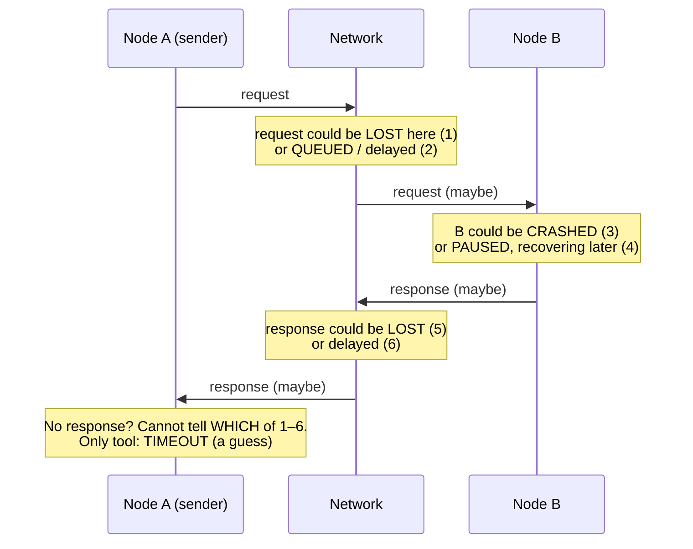
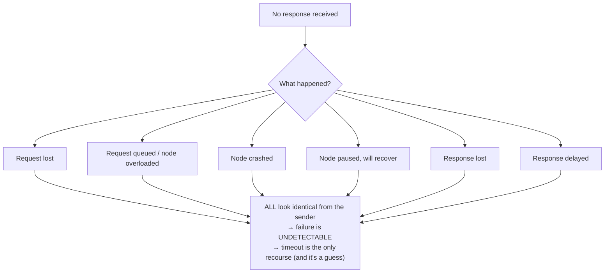
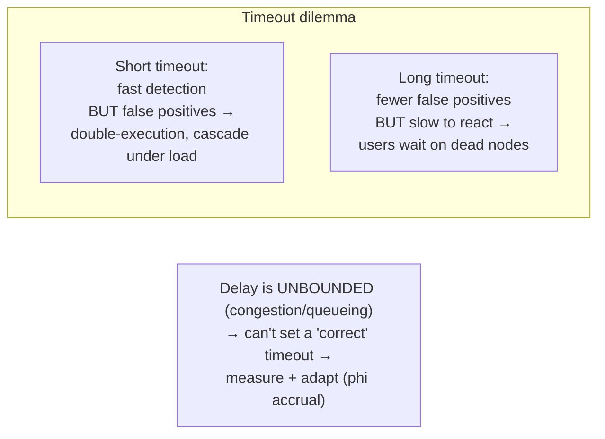

# 11 - The Trouble with Distributed Systems: Unreliable Networks

**Prerequisites:** Topic 10 (replication/failover), Topic 1 (reliability)
**Difficulty:** Intermediate
**Interview importance:** ⭐ **Critical** — this is the conceptual pivot of Part II
**Source:** Chapter 8 — "Faults and Partial Failures", "Unreliable Networks", "Detecting Faults", "Timeouts and Unbounded Delays"

---

## 1. What Is It?

This is the file where the book stops describing mechanisms and confronts *reality*: in a distributed system, **things fail in partial, non-deterministic, undetectable ways.** The network in particular is **asynchronous and unreliable** — it can lose messages, delay them arbitrarily, deliver them out of order, or duplicate them, and **when you send a message and get no reply, you cannot tell why.**

The single organizing idea, which the whole of Part II has been building toward:

> **A partial failure is one where some parts of the system work while others are broken, in ways the working parts cannot reliably detect. Because a timed-out request is indistinguishable from a slow one, you can never *know* that another node has failed — you can only *suspect* it.**

---

## 2. Why Does It Exist?

On a single computer, operations are **deterministic**: if the hardware is working, the same operation gives the same result; if the hardware is broken, the whole machine crashes (a clean, total failure — the book calls this the design philosophy of "a computer should crash rather than return a wrong result"). There's no in-between.

Distributed systems break this. Now you have:

- **Partial failure:** one node is down, or one network link is broken, while everything else runs. The system as a whole is neither up nor down.
- **Nondeterminism:** a request may succeed, may fail, or may hang — and the *same* request might behave differently each time depending on transient network and load conditions.
- **No shared fate:** on one machine, if the CPU is fine your memory is fine. Across a network, the node you're talking to might be dead, alive-but-slow, or perfectly fine with only the reply lost — and you can't tell which.

This isn't a flaw to be engineered away; it's **fundamental** to networked systems built from commodity machines (the "cloud computing" philosophy, versus supercomputers/HPC that treat any partial failure as total and reboot). Since we build large systems from cheap unreliable parts, we must **build reliability from unreliable components** — and that starts with accepting, and reasoning about, partial failure.

---

## 3. Simple Explanation

You send someone a letter asking a question and get no reply. What happened? It could be:

1. Your letter got lost in the mail.
2. They received it but are still thinking / too busy to answer.
3. They wrote a reply and *that* got lost.
4. They're unreachable (moved, ill, dead).

**From your side, all four look identical: silence.** You cannot distinguish "my message never arrived" from "their reply never arrived" from "they're just slow" from "they're gone." That's the entire problem of distributed systems in a sentence.

Your only tool is a **timeout** — "if no reply in X minutes, assume something's wrong." But a timeout can't tell you *what's* wrong, and choosing X is a genuine dilemma: too short and you give up on healthy-but-slow nodes; too long and you wait forever to react to real failures.

---

## 4. Real-World Analogy

**Sending a courier to deliver a package and waiting for a signed receipt.**

The receipt doesn't come back. You have no idea whether: the courier never reached the address, reached it but the recipient was out, delivered it but the signed receipt got lost on the way back, or the courier had an accident en route. The absence of a receipt is *consistent with all of these*.

If you resend the package (retry), and the *original* was actually delivered, the recipient now has two packages (duplicate — why network operations need **idempotence**, Topic 9). If you wait longer before resending, you tolerate slow couriers but react slowly to genuinely lost packages. There is no setting of "how long to wait" that's right in all cases, because you fundamentally **cannot see** what happened on the other end.

---

## 5. Technical Explanation

### The network is asynchronous and packet-based

Most distributed systems use **asynchronous packet networks.** A node sends a message (packet) and the network gives **no guarantee** of when, or whether, it arrives. When you send a request and expect a response, many things can go wrong:

1. Your request may have been **lost** (cable unplugged, switch dropped it).
2. Your request may be **queued** and delivered later (the recipient is overloaded).
3. The **remote node may have failed** (crashed or powered down).
4. The remote node may have **temporarily stopped responding** (a long GC pause — Topic 21) but recover later.
5. The remote node **processed your request**, but the **response was lost** on the network.
6. The remote node processed your request, but the response is **delayed** and will arrive later.

**The sender can't even tell whether the message was delivered.** The only way to know a request succeeded is to receive a response — and if you don't get one, you cannot distinguish which of the six happened. The usual (only) recourse is a **timeout**: give up after some time and assume failure — but you *still* don't know whether the remote node got the request.

### Network faults happen in practice

The book cites studies: even in well-managed datacenters, network problems are common. Adding machines and network gear frequently causes issues; a study found ~12 network faults per month in a medium datacenter; a networking-equipment upgrade can trigger failures; sharks have bitten undersea cables. **Network partitions** — one part of the network cut off from another — happen. The point isn't that networks are terrible; it's that **you must know how your software reacts to network problems and be able to recover.** Deliberately triggering network faults (like Chaos Monkey does for nodes) is a way to test this. Handling network faults doesn't mean *tolerating* them all — if it's rare, showing an error to users may be acceptable — but you must know what your system *does* when they occur.

### Detecting faults — you mostly can't

Many systems need to automatically detect failed nodes: a load balancer must stop sending to a dead node; a single-leader database must promote a follower if the leader dies (Topic 10). But **the network's uncertainty makes it hard to tell if a node is working.** In *some* specific cases you get a signal:

- If you can reach the machine but no process is listening on the port, the OS sends a **RST or FIN** (connection refused). But if the node crashed *while* processing your request, you don't know how much it processed.
- A script can notify other nodes on crash (so they don't wait for a timeout) — but not if the node died abruptly (power loss).
- Router / switch management can confirm a link is down at the network level — but not if the problem is elsewhere.

Bottom line: you might get lucky with a fast failure signal in some cases, but **in general you must assume you'll get no response and rely on retries plus a timeout.** Even a "the node is dead" belief is a *guess*; the node might respond just after you gave up.

### Timeouts and unbounded delays — the core dilemma

A timeout is the main fault-detection tool, but **how long should it be?** There's no simple answer, and the trade-off is fundamental:

- **A long timeout** means a long wait before a node is declared dead — during which users see delays or errors.
- **A short timeout** detects faults faster but risks **prematurely declaring a node dead** when it's merely slow (a temporary spike, a GC pause). Declaring a live node dead is **dangerous**:
  - If the node was actually alive and performing an action (e.g., sending an email), and the task is handed to another node, **it may get done twice.**
  - Declaring a node dead shifts its load to others. **If the system is already under high load, prematurely declaring nodes dead makes it worse** — the extra load can cause more nodes to be declared dead, **cascading** until the whole system collapses.

Ideally a timeout would be set just above the "normal" round-trip time. But **you can't**, because packet delay is **unbounded** — the network gives no guarantee of maximum latency:

- **Network congestion and queueing** is the dominant cause of variable delay. If several nodes send to one destination at once, the switch **queues** the packets; if the queue fills, packets are dropped and must be resent. At the destination, if all CPU cores are busy, the request is **queued by the OS** until the application can handle it. In virtualized environments, a running VM can be **paused** while another VM uses the CPU, queueing incoming data (adding to network delay variability). TCP applies **backpressure/flow control**, adding queueing at the sender. TCP also **retransmits lost packets**, so the application sees delay from retransmission. All of this means the delay a packet experiences depends on the *entire system's* current load, and there's no upper bound.

So in most systems, timeouts must be chosen **experimentally**: measure the distribution of round-trip times over an extended period across many machines, and set the timeout accordingly — or better, have systems **continuously measure response times and their variability (jitter)** and **automatically adjust timeouts** (as Akka and Cassandra's *phi accrual* failure detector do). TCP's own retransmission timeout works this way.

### Synchronous vs asynchronous networks — why can't delays be bounded?

Why not build networks with predictable, bounded delay like the traditional **telephone network**? A phone call establishes a **circuit** — a fixed, reserved amount of bandwidth along the whole route for the call's duration. This is a **synchronous** network: the data has a guaranteed maximum end-to-end latency (**bounded delay**), because the bandwidth is reserved and can't be taken by anyone else.

Datacenter networks and the internet use **packet switching**, not circuits, because they're **optimized for bursty traffic** — request/response, file transfers, web pages — which have no fixed bandwidth requirement, just a desire to complete quickly. A circuit would waste reserved capacity while idle; packet switching lets traffic **use whatever bandwidth is available**, maximizing utilization. The price of that efficiency is **variable, unbounded delay** — there's no reservation, so your packet waits behind everyone else's during congestion.

There are hybrids (ATM; InfiniBand has some circuit-like behaviour with bounded delay and admission control that can achieve bounded latency by limiting queueing) — but on multi-tenant datacenters and the public internet, with bursty shared traffic, **you get variable delay, and you cannot rely on bounded latency.** Quality of Service (QoS) and admission control *could* emulate circuits statistically, but they aren't generally deployed. **Latency guarantees are therefore not achievable in current environments** — you must design for unbounded delay.

### The consequence for everything in Part II

This is why:

- **Failover is hard** (Topic 10): detecting the leader is dead means a timeout, which can be wrong, causing split brain or spurious failover cascades.
- **Auto-rebalancing is dangerous** (Topic 16): a slow node looks dead, rebalancing away from it worsens overload.
- **You need fencing tokens** (Topic 22): a node wrongly declared dead might still be acting, so you must stop its stale actions.
- **Consensus is necessary and hard** (Topic 26): getting nodes to agree on anything (like who the leader is) despite undetectable failures is the central problem.
- **Idempotence matters** (Topic 9): because you retry on timeouts without knowing if the original succeeded.

Partial failure and its undetectability is the root; all the machinery of Part II grows from it.

---

## 6. Diagrams







---

## 7. Concrete Example

**A load balancer deciding whether a backend is dead.**

The load balancer sends health checks and stops routing to a backend that "fails." Consider a backend under a momentary CPU spike (or a GC pause — Topic 21): it's alive, but its health-check response is queued behind real work and arrives 5 seconds late.

- **Short timeout (1s):** the load balancer declares it dead and reroutes its traffic to the *other* backends. But those backends were already handling the same spike — now they get extra load, slow down, and start failing *their* health checks. The load balancer declares *them* dead too. **Cascade.** The system removes healthy capacity precisely when it's most needed, and collapses. This is the "premature declaration under high load makes it worse" failure, made concrete.
- **Long timeout (30s):** the load balancer keeps sending to a backend that might be genuinely dead for up to 30 seconds, so users hit errors during that window.
- **Adaptive (phi accrual):** the load balancer continuously measures each backend's response-time distribution and computes a *suspicion level* rather than a hard alive/dead flag, adjusting to observed jitter. A backend that's a bit slow raises suspicion gradually rather than being instantly killed — which absorbs transient spikes without ignoring real failures.

The interview point: the naive "ping, timeout, mark dead" design has a catastrophic failure mode under load, and understanding *why* (undetectable partial failure + unbounded delay + load coupling) is what separates a senior answer from a junior one.

---

## 8. When This Matters / Design Responses

**Always assume, when building anything distributed:** messages can be lost, delayed, reordered, duplicated; no reply means "unknown," not "failed"; any node you depend on may be dead, slow, or fine-with-lost-reply, indistinguishably.

**Design responses:**
- **Retries + idempotence** (Topic 9) — retry on timeout, but make operations safe to run twice.
- **Adaptive timeouts / failure detectors** (phi accrual) instead of fixed thresholds.
- **Backpressure and load shedding** so overload doesn't trigger death cascades.
- **Fencing tokens** (Topic 22) so a wrongly-declared-dead node can't corrupt state when it resurfaces.
- **Consensus** (Topic 26) for decisions that must be agreed despite undetectable failure (leadership, uniqueness).
- **Human-gated automation** (Topics 10, 16) where a wrong automatic decision cascades.
- **Test with injected network faults** (Chaos-style) — know what your system does.

**When you can accept it:** if network faults are rare for your use case, surfacing an error to the user may be a perfectly fine response — you don't have to tolerate every fault, but you must know what happens.

---

## 9. Advantages & Disadvantages (of the packet-switched, asynchronous model)

**Advantages**
- **High utilization** — bandwidth is shared and used wherever needed (great for bursty traffic).
- **Cheap, commodity hardware** — no reserved circuits; build big systems from inexpensive parts.
- **Flexibility** — no need to predeclare bandwidth needs.

**Disadvantages**
- **Unbounded delay** — no latency guarantee; timeouts can't be set "correctly."
- **Undetectable partial failure** — can't distinguish dead/slow/lost-reply.
- **Congestion collapse risk** — queueing under load couples nodes' fates.
- Forces all the hard machinery (idempotence, fencing, consensus) onto everything above it.

---

## 10. Trade-off Table

| Choice | Advantages | Disadvantages | When |
|---|---|---|---|
| Packet switching (async) | High utilization, cheap, flexible | Unbounded/variable delay | Datacenters, internet — the norm |
| Circuit switching (sync, telephone) | Bounded delay, predictable | Wastes reserved bandwidth; inflexible | Not used for datacenter data |
| Short timeout | Fast fault detection | False positives → double-exec, cascade | Rarely safe alone |
| Long timeout | Fewer false positives | Slow reaction; user-visible errors | When false positives are costly |
| Adaptive (phi accrual) | Balances both; absorbs jitter | More complex | Production failure detection (Akka, Cassandra) |
| Retry without idempotence | Simple | Duplicates on lost-reply retries | Never for non-idempotent ops |
| Retry with idempotence | Safe under uncertainty | Requires idempotent design | The correct default |

---

## 11. Failure Scenarios

| Scenario | Consequence | Handling |
|---|---|---|
| Request lost | No response; unknown state | Retry + idempotence |
| Response lost (request succeeded) | Retry double-executes | Idempotency keys / dedup |
| Node slow (GC/spike), not dead | Timeout → wrongly declared dead | Adaptive timeouts; fencing; suspicion levels |
| Premature death declaration under load | Load shifts → more deaths → cascade | Backpressure, load shedding, human-gated failover |
| Network partition | Two sides can't communicate | Consensus (quorum), fencing; decide CAP trade-off (Topic 23) |
| Congestion / queueing | Unbounded latency spikes | Can't prevent; measure + adapt; QoS if available |
| Duplicate delivery | Operation applied twice | Idempotence |
| Reordered delivery | Out-of-order application (e.g. update before insert) | Sequence numbers; causal ordering (Topic 24) |

---

## 12. Production Considerations

- **Never treat "no response" as "failed."** Treat it as "unknown" and design for all six possibilities.
- **Make network operations idempotent** so timeout-driven retries are safe (Topic 9).
- **Use adaptive failure detectors** (phi accrual) and measured RTT distributions, not hardcoded timeouts.
- **Protect against death cascades** with backpressure, load shedding, and circuit breakers; don't let overload trigger mass "node dead" decisions.
- **Gate cascading automation with humans** (failover, rebalancing) — Topics 10, 16.
- **Inject network faults in testing** — partitions, delays, drops — so you *know* your behaviour rather than guessing.
- **Decide explicitly what happens on a partition** — error to user, degrade, or block — rather than discovering it in an incident.

---

## ❌ 13. Common Mistakes

- **Assuming a timed-out request failed.** It may have succeeded with a lost reply — retrying non-idempotently double-executes.
- **Hardcoding a timeout** as if network delay were bounded. It isn't; measure and adapt.
- **Naive "ping → timeout → mark dead"** with no thought to the under-load cascade.
- **Retrying without idempotence.** Duplicates, double charges.
- **Fully automatic failover/rebalancing** that treats a slow node as dead and cascades (Topics 10, 16).
- **Believing the datacenter network is reliable.** Studies say otherwise; partitions happen.
- **Not testing network-fault behaviour** until it happens in production.
- **Ignoring queueing** as the real source of latency variability — it's not usually the wire, it's the queues.

---

## 🧠 14. Think Like an Engineer

```
I sent a message and got no reply. What do I actually know?
   → almost nothing. Could be lost req / queue / crash / pause / lost resp / delay.
        ↓
Treat "no response" as UNKNOWN, never as "failed."
        ↓
My only tool is a timeout — and it's a guess. Delay is UNBOUNDED.
   → measure RTT distribution; use adaptive detectors (phi accrual)
        ↓
If I retry, is the operation idempotent? (if not, I risk double-execution)
        ↓
If I declare a node dead, what breaks if I'm WRONG?
   → double execution? split brain? → need fencing (Topic 22)
   → will shifting its load cascade under high load? → backpressure/human gate
        ↓
Does this decision need agreement despite undetectable failure?
   → consensus (Topic 26)
```

---

## 15. Mental Model

```
One machine: works or crashes (clean, total, detectable)
Distributed: PARTIAL failure — some parts broken, undetectably
      ↓
Send message, no reply → cannot tell dead vs slow vs lost-reply
      ↓
Only tool = timeout, but delay is UNBOUNDED (queueing/congestion)
   → no "correct" timeout → measure + adapt
      ↓
Wrong "dead" guess is dangerous: double-execution, cascade under load
      ↓
Everything in Part II (fencing, consensus, idempotence, careful failover)
grows from: "you cannot detect failure, only suspect it."
```

---

## 🔗 16. How This Connects to Other Concepts

- **Single-Leader / Failover (Topic 10)** — "why failover is hard" gets its real answer here: undetectable failure + timeouts.
- **Rebalancing (Topic 16)** — auto-rebalancing's cascade risk is the slow-vs-dead problem.
- **Clocks & Pauses (Topic 21)** — the *other* source of undetectable slowness (GC pauses, clock skew); the direct sequel.
- **Truth & Fencing (Topic 22)** — since you can't detect failure, you must fence wrongly-declared-dead nodes.
- **Linearizability & CAP (Topic 23)** — network partitions force the consistency-vs-availability choice.
- **Ordering & Causality (Topic 24)** — reordering/duplication motivates sequence numbers and causal order.
- **Consensus (Topic 26)** — agreement despite undetectable failure is the culminating problem.
- **Encoding / RPC (Topic 9)** — idempotence, the practical antidote to timeout-driven retries.

---

## 17. Interview Questions & Answers

**Beginner**

**Q: What is a partial failure?**
It's when some parts of a distributed system are working while others are broken, and — critically — the working parts can't reliably tell which is which. It's unlike a single machine, which either works or crashes completely. Partial failure is nondeterministic and often undetectable, and it's the root difficulty of distributed systems.

**Q: If you send a request and get no response, what do you know?**
Almost nothing. The request might have been lost, or queued at an overloaded node, or the node might have crashed, or paused and will recover, or it processed the request and the response was lost or delayed. All of these look identical from the sender — silence. So "no response" means "unknown," not "failed," and your only recourse is a timeout, which is itself a guess.

**Intermediate**

**Q: Why can't you just set a good timeout for detecting dead nodes?**
Because network delay is unbounded — there's no maximum. Delay is dominated by queueing: packets queue in congested switches, requests queue behind busy CPUs, VMs get paused, TCP retransmits lost packets. All of that depends on the whole system's current load, with no upper limit. So a timeout tuned to normal latency will fire spuriously during a spike, and a timeout safe against spikes reacts slowly to real failures. The practical answer is to measure the round-trip-time distribution continuously and use an adaptive failure detector like phi accrual that outputs a suspicion level rather than a hard alive/dead flag.

**Q: Why is prematurely declaring a node dead dangerous?**
Two reasons. If the node was actually alive and mid-action — say sending an email or writing data — and you hand that work to another node, it can be done twice. And declaring a node dead shifts its load onto the others, so if the system is already under high load, killing off a slow-but-alive node piles its load onto nodes that are also struggling, which makes *them* slow enough to be declared dead, and the failure cascades until the system collapses. So the failure detector's mistakes are coupled to load in a way that can bring everything down.

**Q: Why do datacenter networks have unbounded delay when telephone networks don't?**
Telephone networks are circuit-switched: a call reserves a fixed amount of bandwidth end-to-end for its duration, so it has a guaranteed maximum latency — bounded delay. Datacenter networks and the internet are packet-switched, because they're optimized for bursty request/response traffic that has no fixed bandwidth need and just wants to finish quickly. Packet switching lets traffic use whatever bandwidth is free, which maximizes utilization and keeps hardware cheap, but the price is that your packets queue behind everyone else's during congestion with no reservation and no upper bound on the wait. It's a deliberate efficiency-for-predictability trade, and it's why you must design for variable, unbounded delay.

**Advanced / Staff**

**Q: How does the undetectability of failure ripple through the rest of a distributed system's design?**
It's the root cause of most of the hard machinery. Failover is hard because detecting a dead leader means a timeout that can be wrong, producing split brain or spurious failovers. Auto-rebalancing is dangerous because a slow node looks dead and rebalancing away from it worsens overload. You need fencing tokens because a node you wrongly declared dead might still be acting on shared state when it resurfaces, so storage must reject its stale writes. You need idempotence because you retry on timeouts without knowing whether the original succeeded. And you need consensus because getting nodes to agree on something like who the leader is, despite not being able to detect failures, is genuinely hard — it's the culminating problem of the whole section. So I'd frame almost every Part II mechanism as a response to "you cannot detect failure, you can only suspect it."

**Q: Design a failure detector for a service mesh. What are the pitfalls?**
I'd avoid a fixed timeout and instead continuously measure each instance's response-time distribution, including jitter, and compute a graded suspicion level rather than a binary alive/dead — a phi-accrual-style detector — so a transient spike raises suspicion gradually instead of instantly evicting a healthy instance. The biggest pitfall is the under-load cascade: if eviction shifts load onto already-stressed peers, they slow down and get evicted too, so I'd couple the detector with backpressure and load shedding, and cap how much capacity can be evicted in a window, so the mesh can't remove most of its own healthy capacity during a spike. I'd make retries idempotent so that when I retry against a different instance after a timeout, a request that actually succeeded doesn't double-execute. For actions that must not double-execute or that mutate shared state, I'd add fencing so a wrongly-evicted instance's late work is rejected. And I'd test all of this by injecting partitions, delays, and drops, because the whole point is that I need to *know* the mesh's behaviour under these conditions rather than discovering it in an incident. The mental frame throughout is that the detector's output is a suspicion, never a fact.

---

## 🎯 30-Second Interview Answer

> "The core reality of distributed systems is partial failure that you can't detect. On one machine, it works or it crashes. Across a network, when you send a request and get no reply, it could be a lost request, an overloaded node queuing it, a crash, a pause that'll recover, or a lost or delayed response — and all of them look identical, just silence. So 'no response' means 'unknown,' not 'failed,' and your only tool is a timeout, which is a guess. You can't even set a good timeout, because network delay is unbounded — it's dominated by queueing under load with no maximum — so you measure the latency distribution and use adaptive detectors like phi accrual. And declaring a node dead prematurely is dangerous: it can cause double-execution, and under high load, shifting a slow node's load onto struggling peers cascades into collapse. This undetectability is the root that fencing tokens, idempotence, careful failover, and consensus all exist to address."

---

## ⚡ Quick Revision

- **Partial failure:** some parts broken, others fine, **undetectably** — unlike a single machine (works or crashes cleanly).
- **No reply = UNKNOWN, not failed.** Six possibilities: lost request / queued / crashed / paused / lost response / delayed — **all look identical**.
- **Only tool: timeout** — and it's a **guess**.
- **Delay is UNBOUNDED** — dominated by **queueing/congestion** (switches, busy CPUs, paused VMs, TCP retransmits), depends on whole-system load. No "correct" timeout.
- **Fix:** measure RTT distribution; **adaptive failure detectors (phi accrual)** output suspicion, not binary dead/alive.
- **Premature "dead" is dangerous:** double-execution; under high load, load-shift **cascades** into collapse.
- **Packet switching** (async, unbounded delay) chosen over **circuit switching** (telephone, bounded delay) for **utilization + bursty traffic + cheap hardware**.
- **This undetectability is the root** of: hard failover (10), risky auto-rebalancing (16), fencing (22), consensus (26), idempotence (9).
- Networks fail in practice (~12 faults/month in one study); **test with injected faults**; you needn't tolerate every fault but must **know your behaviour**.
