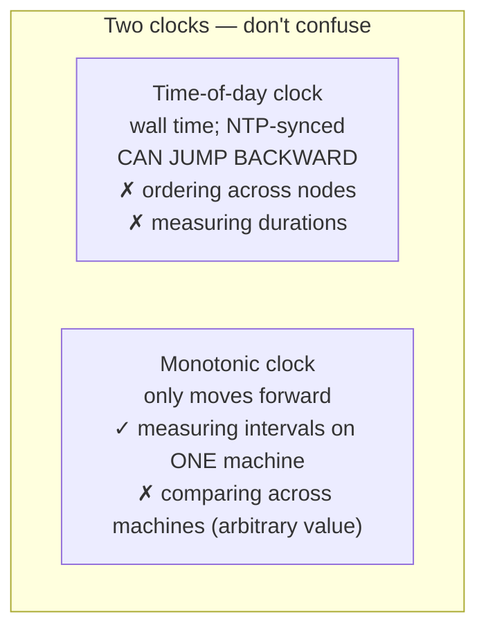
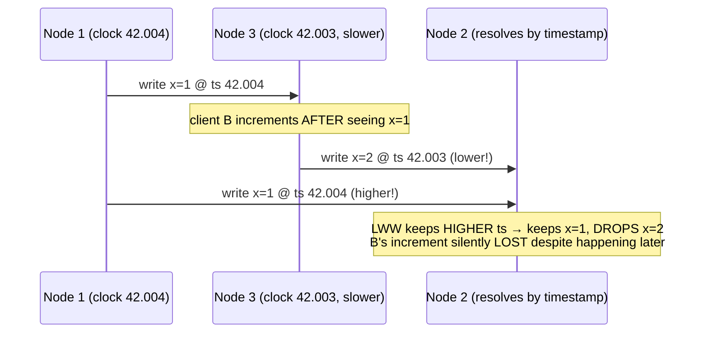
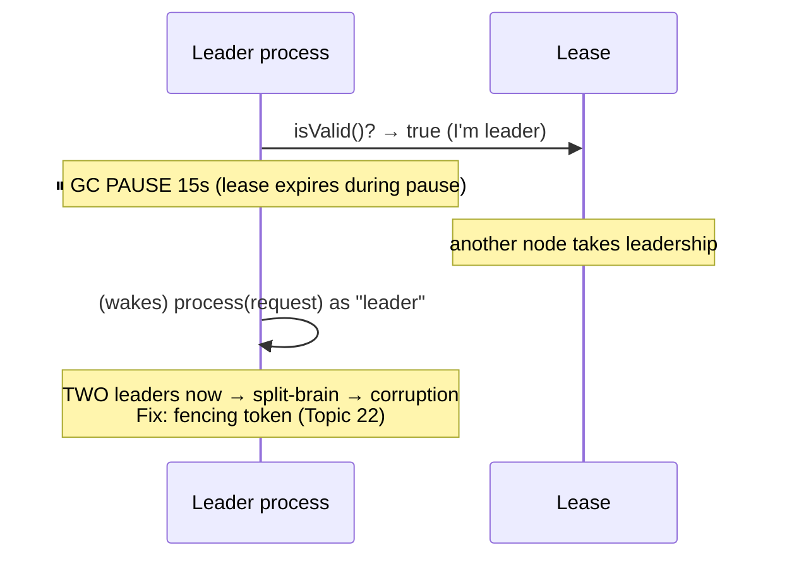

# Unreliable Clocks & Process Pauses

**Prerequisites:** Topic 20 (unreliable networks)
**Difficulty:** Advanced
**Interview importance:** High
**Source:** Chapter 8 — "Unreliable Clocks", "Process Pauses"

---

## 1. What Is It?

The second and third members of the distributed-systems "unreliability" trio (after unreliable networks):

- **Unreliable clocks:** the time a machine reports is neither perfectly accurate nor consistent with other machines' clocks. Clocks drift, jump, and disagree — so you **cannot use timestamps to reliably order events across nodes.**
- **Process pauses:** a running process can be **frozen for an arbitrary length of time** (a GC pause, a paused VM, disk I/O) with no warning and no awareness that it happened. So a node can *think* it's still doing its job while, from the outside, it's been unresponsive for seconds.

Both attack the same false assumption: that a node has a trustworthy sense of *time* and of *how much time has passed*. It doesn't.

---

## 2. Why Does It Exist?

Topic 20 established you can't trust the network. This topic establishes you can't trust **time** either — which matters because the natural workaround for network uncertainty is often "use timestamps to figure out ordering / expiry," and that workaround is itself broken.

Two temptations the book dismantles:

1. **"Just timestamp each write and keep the latest"** (last-write-wins). Broken because clocks disagree, so "latest" is a lie — you silently drop data.
2. **"Just check if my lease hasn't expired before I act as leader."** Broken because a process pause can freeze you *past* the expiry without you noticing, so you act as leader when you're not — causing split-brain.

The deeper reason both fail: **incorrect clocks and pauses go unnoticed.** A broken CPU or network fails loudly and gets fixed. A drifting clock or an occasional pause lets everything *seem* to work while silently corrupting ordering or safety. Silent, subtle failures are the worst kind.

---

## 3. Simple Explanation

**Two kinds of clock, don't confuse them:**

- **Time-of-day clock** ("what time is it?") — wall-clock calendar time, synced by NTP. Can **jump backward** or forward when NTP corrects it. **Useless for measuring durations** or ordering events across machines.
- **Monotonic clock** ("how much time has passed?") — always moves forward, good for measuring intervals (timeouts, latencies) on *one* machine. But its absolute value is meaningless, and you **can't compare it across machines.**

**Clocks lie** in many ways: quartz drift, NTP resets that jump time backward, leap seconds, congested-network sync errors, paused VMs making the clock leap, untrusted client devices. So a timestamp is really a **range** (confidence interval), not a point — but almost no API tells you the width of that range.

**Process pauses:** your code can stop between any two lines for seconds — GC, VM pause, disk swap — and you won't know. So any logic of the form "I checked the time, therefore it's still safe to act" is wrong, because an arbitrary pause can happen *after* the check and *before* the action.

---

## 4. Real-World Analogy

**Timestamps:** two people in different time zones, each with a slightly wrong watch, mail each other letters stamped with their local time. Trying to figure out which letter was written "first" from the stamps is hopeless — one watch is 4 minutes fast, the other lost time overnight, and one was reset backward. The stamps *look* precise ("10:42:03") but the precision is fake; the real uncertainty is minutes. Basing a decision on "whose stamp is later" silently loses information.

**Process pause:** you're a security guard told "your shift lasts until you're relieved; keep guarding as long as your badge is valid." You check your badge (valid), then — without realizing — you fall into a deep sleep for an hour. Your replacement arrived, saw you unresponsive, and took over. You wake, glance at your badge (still says valid, because *you* didn't notice the hour pass), and resume guarding — now there are two guards, both sure they're on duty. That's a process pause causing split-brain.

---

## 5. Technical Explanation

### Time-of-day vs monotonic clocks

**Time-of-day clock** (`clock_gettime(CLOCK_REALTIME)`, `System.currentTimeMillis()`): seconds since the epoch, synced to NTP so a timestamp *ideally* means the same across machines. But: if the local clock drifts too far from NTP, it can be **forcibly reset and jump backward**; it usually ignores leap seconds; historically coarse resolution. **Unsuitable for measuring elapsed time** — an interval computed across a backward jump can be negative or wrong.

**Monotonic clock** (`clock_gettime(CLOCK_MONOTONIC)`, `System.nanoTime()`): guaranteed to only move forward; ideal for durations (timeouts, response times). But its absolute value is arbitrary (e.g., nanoseconds since boot), so **comparing monotonic values across machines is meaningless.** NTP can *slew* it (speed up/slow down by ≤0.05%) but never make it jump. Good resolution (microseconds). **Use monotonic clocks for measuring elapsed time; never time-of-day.**

### Clock synchronization is unreliable

Getting a time-of-day clock to tell the *correct* time is harder than you'd hope:

- **Quartz drift** — clocks run fast/slow, varying with temperature. Google assumes **200 ppm** drift: ~6 ms per 30 s between syncs, or **17 seconds per day** if synced daily.
- **Forcible resets** — a clock too far from NTP gets reset, so observers see time **jump backward or forward.**
- **Firewalled-off NTP** — misconfiguration silently leaves a node's clock adrift.
- **Network-limited accuracy** — NTP is only as good as network delay; ~35 ms minimum error over the internet, spiking to ~1 s under congestion.
- **Wrong NTP servers** — some report time off by hours (clients query several and drop outliers, but still).
- **Leap seconds** — a 59- or 61-second minute has crashed many large systems; best handled by "smearing" the adjustment across a day.
- **Virtual machines** — a paused VM makes the guest clock **suddenly jump forward** tens of ms.
- **Untrusted devices** — mobile/embedded clocks may be set to arbitrary past/future times by users.

You *can* get excellent accuracy (GPS, PTP, atomic clocks — MiFID II requires HFT firms within 100 µs of UTC), but it takes serious effort. **The danger: incorrect clocks fail silently** — everything seems to work while a drifting clock causes subtle data loss. So if you rely on synced clocks, **monitor clock offsets and evict any node that drifts too far.**

### Timestamps for ordering events — why LWW loses data

The tempting-but-dangerous use: order writes across nodes by timestamp. The book's multi-leader example: client A writes `x=1` on node 1 (timestamp 42.004s); it replicates to node 3; client B increments to `x=2` on node 3 (timestamp 42.003s — node 3's clock is slightly behind). B's write **unambiguously happened after** A's, but its timestamp is *lower*. When node 2 receives both, **last-write-wins keeps `x=1` and silently drops `x=2`** — client B's increment is lost, with no error. And here the clock skew was <3 ms, better than you'll usually get.

Three fundamental problems with LWW-by-timestamp:

1. **Writes silently disappear** — a node with a lagging clock can't overwrite values from a node with a fast clock until the skew elapses; arbitrary amounts of data dropped, no error.
2. **Can't distinguish sequential from concurrent** — LWW can't tell "B definitely after A" from "truly concurrent." You need **causality tracking (version vectors)** to prevent causality violations.
3. **Identical timestamps** — two nodes can generate the same millisecond timestamp; you need a tiebreaker (random number), which can itself violate causality.

Even with tight NTP: you could send a packet at sender-time 100 ms and have it arrive at recipient-time 99 ms — appearing to arrive *before it was sent*. NTP can't fix this, because its accuracy is bounded by network round-trip time — and to order events correctly you'd need a clock **more accurate than the thing you're measuring** (network delay), which you don't have. **The safe alternative is logical clocks** (incrementing counters — happens-before, version vectors; Topic 24), which order events *relative to each other* rather than by physical time.

### Clock readings have a confidence interval

A clock reading isn't a point — it's a **range.** You might read microseconds of resolution, but the *accuracy* is milliseconds (drift + NTP error + network delay). So a reading is really "95% confident it's between 10.3 and 10.5 s." If you only know time ±100 ms, the microsecond digits are meaningless. **Most systems don't expose this uncertainty** — `clock_gettime()` gives you a number, not an error bar, so you can't tell if the confidence interval is 5 ms or 5 years.

**Google's TrueTime (Spanner)** is the exception: it returns `[earliest, latest]` — an explicit interval the true time lies within. This enables **global snapshots without a coordination bottleneck:** if two intervals don't overlap (`A.latest < B.earliest`), then B *definitely* happened after A. To guarantee causality, Spanner **deliberately waits out the confidence interval** before committing a read-write transaction, so no later reader's interval overlaps. To keep that wait short, Google keeps uncertainty small with GPS/atomic clocks in every datacenter (~7 ms). This is elegant but Google-specific — not in mainstream databases.

### Process pauses — the lease example

The scenario: a single-leader-per-partition database. A node holds a **lease** (a lock with a timeout) proving it's the leader; it must renew before expiry. The naive request loop:

```
while (true) {
  request = getIncomingRequest();
  if (lease.expiryTimeMillis - System.currentTimeMillis() < 10000) {
    lease = lease.renew();
  }
  if (lease.isValid()) {
    process(request);   // ← we believe we're still leader
  }
}
```

Two bugs:

1. **It compares a remote-set expiry against the local time-of-day clock** — if the clocks are out of sync by seconds, the logic misfires.
2. **The deeper bug — an arbitrary pause between the check and the action.** Suppose the process **pauses for 15 seconds** right after `lease.isValid()` returns true but before `process(request)`. During the pause the lease expires, another node becomes leader — but this process, oblivious, wakes and **processes the request as if it were still leader.** Two leaders → split-brain → corruption.

**Why would a process pause for 15 seconds?** Many reasons, all real:

- **Garbage collection** — a "stop-the-world" GC pause can freeze all threads for seconds (occasionally minutes for large heaps).
- **Paused virtual machine** — the hypervisor suspends the VM (e.g., for live migration) with the guest unaware.
- **Suspended laptop / OS context switch / disk swap (thrashing)** — the thread is descheduled arbitrarily.
- **Synchronous disk I/O** where you didn't expect it (even class loading in Java can hit disk).
- **SIGSTOP** (someone hits Ctrl-Z or an operations tool pauses the process).

The unifying point: **a node cannot assume that time it perceives as instantaneous was actually short.** Any thread can be paused at any point for an unbounded duration and resume as if nothing happened, with its local clock having jumped forward.

This is exactly like **multi-threaded code on one machine** — you can't assume any timing, you need locks/mutexes — except a distributed system is *worse* because there's no shared memory, only unreliable messages, and every node pauses independently.

### Response-time guarantees and limiting GC impact

You *can* bound pauses if you must: **real-time systems** (RTOS) provide guaranteed maximum response times, but require enormous effort (special runtimes, no unbounded GC, extensive analysis) and sacrifice throughput — worthwhile only for safety-critical systems (aircraft, cars). For most server software, real-time guarantees aren't justified, so pauses must be tolerated, not eliminated.

Practical GC mitigations the book mentions: treat GC pauses like brief planned outages — **stop sending requests to a node that's about to GC, let it finish in-flight work, GC while idle,** then resume. Or **restart processes** proactively before old-generation GC, routing traffic away first. These reduce but don't eliminate the problem.

### The conclusion this drives toward

Since a node **cannot trust its own judgment** of whether it still holds a role (its clock may be wrong, it may have paused past its lease), correctness **cannot depend on a node self-certifying.** The truth must be decided by **agreement among a majority** of nodes, and a node's authority must be enforced by something external that a paused/stale node can't override — a **fencing token** (Topic 22). That's the bridge to the next topic.

---

## 6. Diagrams







---

## 7. Concrete Example

**A distributed lock protecting writes to a shared storage system (the book's canonical setup, developed fully in Topic 22).**

A client acquires a lock/lease to get exclusive write access to a file in object storage. Its code checks the lease is valid, then writes.

- **Clock version of the bug:** the lease expiry was set by the lock server's clock; the client compares it to its own clock. The client's clock is 8 seconds behind (drift + missed NTP sync), so it believes the lease is still valid for 8 seconds after it has actually expired — and writes during that window, after another client has taken the lock. Two writers, corrupted file.
- **Pause version of the bug:** the client checks the lease (valid), then hits a **12-second stop-the-world GC pause.** The lease expires mid-pause; the lock server grants it to client 2, which starts writing. Client 1 wakes from GC with no idea time passed and completes *its* write to the same file. Two writers, corrupted file.

Neither client did anything "wrong" in its own frame of reference — each checked and believed it held the lock. **The failure is structural: a node cannot reliably know whether it still holds a lock, because its clock can be wrong and it can be paused past expiry.** The fix isn't better clocks or shorter pauses — it's **fencing** (Topic 22): the storage system rejects any write carrying an out-of-date fencing token, so a stale writer is refused regardless of what it believes.

---

## 8. When This Matters / Design Implications

**Clocks matter for:** LWW conflict resolution (avoid it for mutable data — it loses writes), event ordering across nodes (use logical clocks, not timestamps), lease/lock expiry (don't trust local time; use fencing), distributed snapshots (needs coordination or TrueTime-style intervals), and any audit/debugging that assumes cross-node timestamp comparability.

**Pauses matter for:** anything where "I checked a condition, so it's still safe to act" — leader leases, locks, timeouts measured across the pause. A pause invalidates the check.

**Design responses:** use monotonic clocks for durations; use logical clocks / version vectors for ordering; never use LWW-by-timestamp for data you can't afford to lose; monitor clock offsets and evict drifting nodes; enforce authority with fencing tokens, not self-certification; treat GC as a planned brief outage (drain, then collect); and accept that you cannot eliminate pauses, only tolerate them.

---

## 9. Advantages & Disadvantages (of relying on physical clocks)

**Advantages of physical timestamps:** cheap, no coordination, human-readable, "good enough" for coarse purposes (logging, TTLs with slack, rough metrics).

**Disadvantages:** drift and jumps make them unreliable for ordering; LWW silently loses data; precision is fake (real accuracy is ms, not µs); no exposed confidence interval (except TrueTime); leases based on them break under skew; and none of it accounts for process pauses. For correctness, **logical clocks + fencing + majority agreement** are required instead.

---

## 10. Trade-off Table

| Mechanism | Good for | Bad for / danger |
|---|---|---|
| Time-of-day clock | Human calendar time, logs | Ordering, durations (jumps backward) |
| Monotonic clock | Durations/timeouts on one machine | Cross-machine comparison (meaningless) |
| LWW by timestamp | Simple convergence, immutable keys | **Silent data loss** on mutable data; can't tell sequential from concurrent |
| Logical clocks / version vectors | Correct causal ordering | Don't give wall-clock time |
| TrueTime (interval + wait) | Global snapshots without a coordination bottleneck | Needs GPS/atomic clocks; Google-specific |
| Lease + local-clock check | (nothing safe) | Skew + pause → split-brain |
| Lease + **fencing token** | Safe mutual exclusion | Requires resource-side token enforcement (Topic 22) |

---

## 11. Failure Scenarios

| Scenario | Consequence | Handling |
|---|---|---|
| NTP resets clock backward | Interval math wrong; time goes back | Use monotonic clock for durations |
| Node clock drifts (firewalled NTP) | Silent LWW data loss; wrong ordering | Monitor offsets; evict drifting nodes |
| LWW with skewed clocks | Later write dropped silently | Don't use LWW for mutable data; version vectors |
| Two nodes, identical timestamp | Ambiguous order | Tiebreaker (but can violate causality) → logical clocks |
| GC pause past lease expiry | Two leaders → split-brain | **Fencing tokens** (Topic 22); drain-then-GC |
| Paused VM jumps clock forward | Lease/timeout logic misfires | Don't trust local clock for authority |
| Fake precision (µs on ms-accurate clock) | Decisions on meaningless digits | Treat readings as intervals; expose uncertainty |
| Leap second | Timing assumptions break, crashes | Smear the leap second over a day |

---

## 12. Production Considerations

- **Use monotonic clocks for all elapsed-time measurements** (timeouts, latencies). Never compute durations from time-of-day clocks.
- **Never use LWW-by-timestamp for mutable data you can't afford to lose.** Use version vectors for causality; reserve LWW for immutable/write-once keys.
- **Monitor clock offset across the fleet** and evict nodes whose clocks drift beyond a threshold — broken clocks fail silently and cause subtle data loss.
- **Don't base correctness on lease/lock self-checks.** A pause or skew defeats them. Enforce with **fencing tokens** at the resource (Topic 22).
- **Treat GC as a planned outage:** drain traffic, let in-flight work finish, GC while idle, or restart before old-gen GC. Reduces (not eliminates) pause impact.
- **Assume any thread can pause for seconds at any point.** Audit "check-then-act" logic for pause-safety.
- **Remember timestamps are ranges.** Only TrueTime-style APIs expose the interval; elsewhere, don't trust sub-millisecond precision.

---

## ❌ 13. Common Mistakes

- **Using time-of-day clocks to measure durations** — a backward NTP jump gives negative or wrong intervals.
- **Ordering events across nodes by timestamp** — clocks disagree; use logical clocks.
- **LWW-by-timestamp on mutable data** — silently drops the "later" write when clocks skew.
- **Trusting timestamp precision** — µs resolution on a ms-accurate clock is fake precision.
- **Lease/lock logic that trusts the local clock** — skew makes an expired lease look valid.
- **Assuming code runs without pausing** — a GC pause between check and act causes split-brain.
- **Not monitoring clock drift** — it fails silently; you find out via corrupted data.
- **Trying to fix ordering with "better NTP"** — accuracy is bounded by network RTT; it can't be accurate enough.

---

## 🧠 14. Think Like an Engineer

```
Am I measuring a DURATION? → monotonic clock (never time-of-day)
        ↓
Am I ORDERING events across nodes? → logical clocks / version vectors
   (NEVER physical timestamps — clocks disagree)
        ↓
Am I resolving conflicts by "keep the latest"? → LWW loses data on skew
   (only safe for immutable/write-once keys)
        ↓
Does correctness depend on "I still hold the lock/lease"?
   → a PAUSE or clock SKEW can make that false without my knowing
   → don't self-certify; enforce with FENCING TOKENS (Topic 22)
        ↓
Am I trusting timestamp precision? → it's really a ± interval; most APIs hide it
        ↓
Am I monitoring clock offset + evicting drifting nodes? (silent failure otherwise)
```

---

## 15. Mental Model

```
A node cannot trust its sense of TIME:
  - clocks DRIFT and JUMP (backward on NTP reset) → can't order across nodes
  - a timestamp is a RANGE, not a point (fake precision)
  - LWW-by-timestamp SILENTLY LOSES the later write
  - a process can PAUSE (GC/VM) for seconds → "check then act" breaks
      ↓
So: monotonic clocks for durations, logical clocks for ordering,
    version vectors for conflicts, and correctness enforced by
    MAJORITY AGREEMENT + FENCING, never by a node self-certifying.
```

---

## 🔗 16. How This Connects to Other Concepts

- **Unreliable Networks (Topic 20)** — the first unreliability; clocks and pauses are *why* a node can look dead while alive, deepening the "can't detect failure" problem.
- **Truth & Fencing (Topic 22)** — the direct sequel: since a node can't self-certify (clock skew + pauses), truth is by majority and enforced by fencing tokens.
- **Multi-Leader / Leaderless (Topics 12–13)** — LWW's data loss and the need for version vectors come straight from unreliable clocks.
- **Ordering & Causality (Topic 24)** — logical clocks (the safe alternative to timestamps) are developed fully there.
- **Weak Isolation / Snapshots (Topic 18)** — distributed global snapshots need coordination or TrueTime-style intervals; the txid ordering problem is a clock problem.
- **Consensus (Topic 26)** — leases, leadership, and "who decides" all resolve into consensus once you accept nodes can't trust their own clocks.

---

## 17. Interview Questions & Answers

**Beginner**

**Q: What's the difference between a time-of-day clock and a monotonic clock?**
A time-of-day clock reports wall-clock calendar time and is synced by NTP, but it can jump backward when NTP corrects it, so it's unsuitable for measuring durations. A monotonic clock only ever moves forward and is ideal for measuring intervals like timeouts on a single machine, but its absolute value is arbitrary, so you can't compare monotonic readings across machines. The rule of thumb is: durations use monotonic, and never use either for ordering events across nodes.

**Q: Why can't you order events across nodes using timestamps?**
Because clocks on different machines disagree — they drift, get reset, and sync imperfectly — so a write that genuinely happened later can carry an earlier timestamp. The book's example has a write that's unambiguously later end up with a lower timestamp because that node's clock was a few milliseconds behind, and last-write-wins then drops the later write. Even with tight NTP, a packet can appear to arrive before it was sent. For correct ordering you use logical clocks, which track relative order rather than physical time.

**Intermediate**

**Q: Why does last-write-wins lose data?**
Because "last" is decided by timestamp, and timestamps come from clocks that disagree. A node with a lagging clock produces lower timestamps, so its writes can be silently discarded in favor of a fast-clocked node's writes, even when they happened later — and no error is reported. LWW also can't distinguish writes that were truly concurrent from writes that were sequential, so it can violate causality. It's only safe when a key is written once and never updated, so there are no concurrent updates to lose; for mutable data you need version vectors to track causality instead.

**Q: What is a process pause and why is it dangerous?**
It's when a running process is frozen for an arbitrary length of time with no awareness that it happened — most commonly a stop-the-world garbage collection pause, but also a paused VM, disk swapping, or a suspended thread. It's dangerous because it breaks any "check then act" logic: a node can verify it still holds a lease, then pause for fifteen seconds during which the lease expires and another node takes over, then wake up and act as if it were still the leader. Now there are two leaders and you get split-brain corruption. The node never notices the pause — its own clock simply jumped forward.

**Q: How does Google Spanner use clocks safely?**
Through the TrueTime API, which, unlike normal clock APIs, returns time as an interval — an earliest and latest possible timestamp — rather than a single value, explicitly representing the uncertainty. Spanner uses the rule that if two intervals don't overlap, one event definitely happened before the other. To guarantee that transaction timestamps reflect causality, it deliberately waits out the width of the confidence interval before committing a read-write transaction, so no later reader's interval can overlap. To keep that wait short, Google minimizes clock uncertainty with GPS and atomic clocks in every datacenter, getting synchronization to around seven milliseconds. It's elegant but depends on special hardware and isn't available in mainstream databases.

**Advanced / Staff**

**Q: A distributed lock is supposed to give exclusive access, but you're seeing corrupted writes from two clients. What's happening and how do you fix it?**
This is the classic clock-and-pause failure. Two things can make a client act on a lock it no longer holds. First, clock skew: the lease expiry is set by the lock server's clock but checked against the client's clock, so if the client's clock is behind, it thinks the lease is still valid after it has actually expired and writes during that window. Second, and more fundamental, a process pause: the client checks the lease, then a stop-the-world GC pause freezes it past the expiry, another client acquires the lock, and the first client wakes and completes its write with no idea time passed. In both cases each client believes in good faith that it holds the lock. The fix is not better clocks or shorter GC pauses — those only narrow the window. The fix is fencing: the lock server issues a monotonically increasing fencing token with each grant, the client includes it on every write, and the storage system records the highest token it has seen and rejects any write with a lower token. So a stale writer is refused by the resource itself, regardless of what it believes, which makes correctness independent of clocks and pauses.

**Q: Why is monitoring clock drift important, and what do you do about a drifting node?**
Because incorrect clocks fail silently. A broken CPU or network card stops things working and gets noticed and fixed quickly, but a clock that's quietly drifting lets everything appear to function while it causes subtle, hard-to-trace problems — dropped writes under LWW, wrong event ordering, misfiring leases. So you monitor the clock offset between every node and a trusted source, and you set a threshold beyond which a node's clock is considered untrustworthy. A node that drifts past that threshold should be declared dead and removed from the cluster, exactly as you'd remove a node that failed a health check, because a node with a bad clock can corrupt shared state more insidiously than one that's simply down. The general principle is to convert a silent failure mode into a loud one you can act on.

---

## 🎯 30-Second Interview Answer

> "After unreliable networks, the second and third unreliabilities are clocks and process pauses. Clocks drift and jump — a time-of-day clock can reset backward — so you can't order events across nodes by timestamp, and last-write-wins silently drops the later write when clocks disagree. Use monotonic clocks for durations, logical clocks and version vectors for ordering. A timestamp is really a confidence interval, not a point; Spanner's TrueTime is the rare API that exposes that interval and waits it out to order transactions. Process pauses are the other trap: a stop-the-world GC pause or a paused VM can freeze a node for seconds, so any 'I checked my lease, so I'm still the leader' logic breaks — the node pauses past expiry, another takes over, and you get two leaders and split-brain. The deep lesson is that a node can't trust its own sense of time or self-certify that it still holds a role, so correctness has to come from majority agreement and be enforced externally with fencing tokens, not from a node checking its own clock."

---

## ⚡ Quick Revision

- **Two clocks:** **time-of-day** (wall time, NTP-synced, **can jump backward** — bad for durations/ordering) vs **monotonic** (only forward, good for **intervals on one machine**, meaningless across machines).
- **Clocks are unreliable:** quartz drift (~200 ppm → 17 s/day if synced daily), NTP resets/jumps, leap seconds, congested-sync error (~tens of ms), paused-VM jumps, untrusted device clocks. **They fail SILENTLY.**
- **A timestamp is a RANGE, not a point** (fake precision). Only **TrueTime** exposes the interval `[earliest, latest]` → Spanner waits it out for global snapshots.
- **LWW-by-timestamp silently loses data** — lagging clock → later write dropped; can't tell sequential from concurrent. Safe only for **immutable keys**. Use **logical clocks / version vectors** for ordering (Topic 24).
- **Process pauses:** GC stop-the-world, paused VM, swap, SIGSTOP → a node freezes for **seconds** unaware. Breaks **"check-then-act"** (lease still valid? → pause → expired → act → split-brain).
- **Can't self-certify** holding a lock (skew + pauses) → truth by **majority agreement**, enforced by **fencing tokens** (Topic 22), never by local-clock check.
- **Monitor clock offset, evict drifting nodes.** Use **monotonic** for durations. Treat GC as a **drain-then-collect** planned outage.
