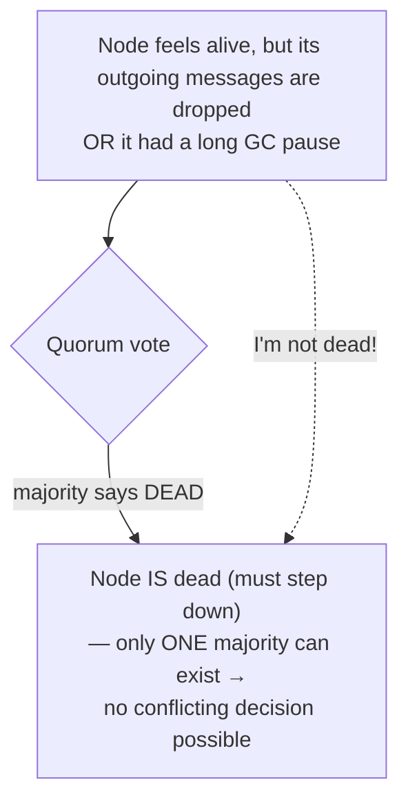
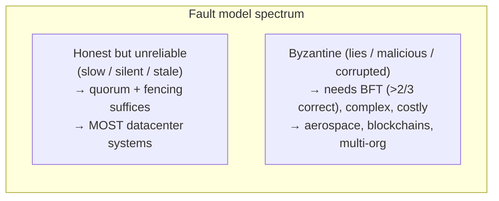

# Knowledge, Truth & Fencing (Byzantine Faults)

**Prerequisites:** Topics 20, 21 (unreliable networks, clocks & pauses)
**Difficulty:** Advanced
**Interview importance:** High
**Source:** Chapter 8 — "The Truth Is Defined by the Majority", "Byzantine Faults", "System Model and Reality"

---

## 1. What Is It?

The synthesis of Chapter 8. Given that networks lose messages, clocks lie, and processes pause (Topics 20–21), how does a distributed system establish **what is true** — who is the leader, who holds the lock, is a node alive?

Three ideas:

- **Truth is defined by the majority (quorum).** No single node's opinion counts — not even its opinion about *itself*. A node can be declared dead by a majority even while it feels perfectly alive, and it must abide.
- **Fencing tokens.** Since a node may act on a stale belief (a paused leader that doesn't know it was demoted), the *resource* it touches must reject stale actors using a monotonically increasing token — enforcing safety at the resource, not trusting the client.
- **Byzantine faults.** The above assumes nodes are *honest but unreliable*. If nodes can *lie* (send arbitrary/malicious messages), the problem becomes far harder — Byzantine fault tolerance — which most datacenter systems can safely ignore, but some (aerospace, blockchains) can't.

---

## 2. Why Does It Exist?

Topics 20–21 left us with a crisis: **a node cannot trust its own judgment.** It can't tell if the network dropped its messages, if its clock is right, or whether it paused past a deadline. If every node's self-assessment is untrustworthy, how does the system agree on anything?

The book's three "nightmare" scenarios motivate it:

1. **Asymmetric network fault** — a node receives everything but its *outgoing* messages are dropped. It works perfectly, but nobody hears it, so it's declared dead. It's "dragged to the graveyard kicking and screaming 'I'm not dead!'" — and can do nothing about it.
2. **Semi-disconnected node** notices its messages aren't acknowledged, realizes there's a fault — but is still wrongly declared dead and is powerless.
3. **Long GC pause** — a node freezes for a minute, is declared dead, then wakes "as if nothing happened," not even realizing time passed, and cheerfully resumes — potentially as a second leader.

The moral: **a node cannot rely on its own view; the system cannot rely on any single node.** So decisions — including "who is alive" and "who is leader" — must come from **voting among many nodes**, and safety must be enforced so a node acting on a stale belief can't corrupt anything. That's why quorums and fencing exist.

---

## 3. Simple Explanation

**Majority rules, even over your own protests.** If more than half the nodes vote that you're dead, you're dead — you must step down, even if you feel fine. This works because **there can only ever be one majority**, so two conflicting decisions can't both win.

**But a demoted node might not have gotten the memo.** A paused leader wakes up still believing it's leader. Telling it "please check whether you're still leader" doesn't help — it *thinks* it is. So you don't trust the actor; you make the **resource** enforce the rule. Every time the lock is granted, it comes with an ever-increasing number (a **fencing token**). The resource remembers the highest token it has seen and **rejects anything with a lower number.** A stale actor's old token is refused, no matter what it believes.

**All of this assumes nodes are honest** (just possibly slow, stale, or silent). If nodes can actively **lie** — that's a Byzantine fault, a much harder problem you usually don't have inside your own datacenter, but do have in aerospace (radiation-corrupted memory) or blockchains (mutually distrusting parties).

---

## 4. Real-World Analogy

**A committee deciding whether a member has resigned.**

A member is unreachable (out of contact). The committee, by **majority vote**, declares the seat vacant and appoints a replacement. When the original member reappears insisting "I never resigned!", it doesn't matter — the majority already decided, and there can only be one majority, so there's no competing decision. The member must accept it.

**Fencing:** the committee issues each chairperson a numbered gavel — gavel #33, then #34 for the replacement. The bank (the resource) that honors the committee's cheques only accepts instructions signed with the *highest-numbered gavel it has seen.* When the old chair returns and tries to issue instructions with gavel #33, the bank refuses, because it already honored gavel #34. The old chair's sincere belief that they're still in charge is irrelevant — the bank enforces the ordering.

**Byzantine:** the analogy assumes members are honest. If some members are **traitors** actively forging messages and lying about votes, the committee needs a far more elaborate protocol to reach a correct decision despite the liars — that's the Byzantine Generals Problem.

---

## 5. Technical Explanation

### The truth is defined by the majority

A distributed system **cannot exclusively rely on a single node**, because that node may fail at any time and leave the system stuck. So distributed algorithms rely on a **quorum** — voting among nodes — so decisions require a minimum number of votes and don't depend on any one node.

This includes **decisions about declaring nodes dead.** If a quorum declares a node dead, it must be considered dead, **even if it still feels alive** — the node must abide and step down. Most commonly the quorum is an **absolute majority** (more than half). A majority quorum:

- **Tolerates failures:** 3 nodes tolerate 1 failure; 5 tolerate 2.
- **Is safe:** there can only be **one majority** in the system at a time — you cannot have two majorities making conflicting decisions simultaneously. This is the property that prevents split-brain *at the decision level*.

### The leader and the lock — where it goes wrong

Systems frequently need **only one of something:**

- Only one **leader** per partition (avoid split brain).
- Only one client holding a **lock** on a resource (avoid concurrent corruption).
- Only one user with a given **username** (uniqueness).

The hazard: **a node believing it's "the chosen one" doesn't mean a quorum agrees.** It may have *been* the leader, then been declared dead during a network blip or GC pause, and another leader elected — while it, oblivious, keeps acting as leader. If other nodes or resources believe its stale claims, the system does something incorrect.

The book's concrete, non-theoretical bug (HBase had exactly this): a lock service grants a client a lease for exclusive file access. The client **pauses too long, its lease expires, another client acquires the lease and starts writing.** The paused client wakes, still believing its lease is valid, and **also writes** — the writes clash and **corrupt the file.** This is the Topic 21 pause problem, now framed as a truth problem: the client's belief about holding the lock is stale, and nothing stopped it from acting.

### Fencing tokens — the fix

**Fencing** ensures a node under the false belief of being "the chosen one" can't disrupt the system. Mechanism:

1. Every time the lock server grants a lock/lease, it also returns a **fencing token** — a number that **increases every time a lock is granted.**
2. Every write request to the protected resource **must include the client's current fencing token.**
3. The resource **remembers the highest token it has processed** and **rejects any write with a lower token.**

The book's walkthrough: client 1 acquires the lease with **token 33**, then pauses; the lease expires; client 2 acquires it with **token 34** and writes to storage including token 34. Later client 1 wakes and writes with token 33 — but the storage server has already seen 34, so it **rejects token 33.** The stale writer is fenced out.

**Critical properties:**

- **The resource must actively check tokens** — rejecting lower ones. It is **not sufficient for clients to check their own lock status;** the whole point is that a client's self-check is unreliable (it's paused/stale). Safety must be enforced by the resource.
- If ZooKeeper is the lock service, its **`zxid` (transaction ID) or node `cversion`** works as a fencing token — both are monotonically increasing.
- For resources that don't natively support tokens, you can sometimes work around it (e.g., embed the token in the filename), but **some server-side check is necessary.**
- Server-side checking is a *feature*, not a burden: **it's unwise to assume clients are well-behaved** — they're often run by people with different priorities. A service should protect itself from accidentally-abusive clients.

### Byzantine faults — when nodes lie

Fencing handles a node acting in **honest error** (hasn't learned its lease expired). But if a node **deliberately** wanted to subvert the system, it could send a **fake fencing token.** The book's operating assumption throughout is that **nodes are unreliable but honest:** they may be slow, silent, or stale, but if they respond, they're telling the truth as they know it, playing by the protocol.

A **Byzantine fault** is when a node may **lie** — send arbitrary, faulty, or maliciously deceptive messages (e.g., claim to have received a message it didn't). Reaching agreement despite such nodes is the **Byzantine Generals Problem:** *n* generals must agree on a plan, but some are **traitors** sending fake messages, and you don't know who. (The name means "excessively complicated/devious," not a slur on Byzantium; Lamport picked a nationality that would offend no one.)

A system is **Byzantine fault-tolerant** if it keeps working correctly even when some nodes malfunction, disobey the protocol, or are maliciously attacking. When does this matter?

- **Aerospace:** radiation can corrupt memory/registers, making a node behave arbitrarily; a crash is catastrophic (aircraft, spacecraft), so flight control tolerates Byzantine faults.
- **Multi-organization systems / blockchains:** participants may cheat; peer-to-peer systems like Bitcoin get **mutually distrusting parties** to agree whether a transaction happened, without a central authority — inherently Byzantine.

But **in most datacenter systems, you can safely assume no Byzantine faults:** all nodes are controlled by your organization (trusted), and radiation isn't corrupting memory. Byzantine-tolerant protocols are **complex and expensive**, so they're usually impractical server-side.

Key limits the book stresses:

- **A software bug deployed to all nodes is not solved by BFT** — most BFT algorithms need a **supermajority (>2/3) correct**, so you'd need *multiple independent implementations* and hope a bug hits only one. Impractical.
- **BFT doesn't protect against a compromised system** — if an attacker breaks into one node, they can probably break all of them (same software). **Traditional security** (authentication, access control, encryption, firewalls) remains the main defense.
- **Web apps must expect malicious clients** (browsers under user control) — hence input validation, sanitization, output escaping — but the fix isn't BFT; it's making the **server the authority** on what's allowed.

### Weak forms of lying — pragmatic partial protection

Even assuming honest nodes, it's worth guarding against **weak "lying"** from hardware faults, bugs, and misconfiguration — not full BFT, but cheap and pragmatic:

- **Corrupted packets:** TCP/UDP checksums catch most, but some evade detection → add **application-level checksums.**
- **Input sanitization:** validate ranges, limit string sizes (prevent memory-exhaustion DoS), even for internal services.
- **Multiple NTP servers:** query several, treat a wrong one as an outlier and exclude it (majority agreement on time) — more robust than a single server.

### System models — how we reason about all this (brief)

To design algorithms that survive these faults, we define **system models** — assumptions about timing and node behavior:

- **Timing:** *synchronous* (bounded delay — unrealistic), *partially synchronous* (usually bounded, occasionally not — realistic for most systems), *asynchronous* (no timing assumptions at all — very restrictive).
- **Node failure:** *crash-stop* (a node fails by halting, forever), *crash-recovery* (may recover with stable storage surviving), *Byzantine* (arbitrary/malicious).

The most useful model for real systems is usually **partially synchronous + crash-recovery.** Correctness is defined by **safety** ("nothing bad happens" — must *always* hold) and **liveness** ("something good eventually happens" — may be delayed). Algorithms are designed so **safety always holds even when timing assumptions are violated**, while liveness may depend on timing (e.g., eventual message delivery). This framing underpins consensus (Topic 26).

---

## 6. Diagrams



```mermaid
sequenceDiagram
    participant C1 as Client 1
    participant Lock as Lock server
    participant S as Storage (checks tokens)
    participant C2 as Client 2
    C1->>Lock: acquire → token 33
    Note over C1: ⏸ long pause; lease expires
    C2->>Lock: acquire → token 34
    C2->>S: write (token 34)
    S->>S: highest seen = 34 ✓ accept
    Note over C1: wakes, still believes it holds lock
    C1->>S: write (token 33)
    S->>S: 33 < 34 → REJECT (fenced out)
    Note over S: resource enforces safety — NOT the client's self-check
```



---

## 7. Concrete Example

**A leader-election + shared-storage system (the HBase-style bug, and its fix).**

A partitioned database elects one leader per partition via a quorum (say, ZooKeeper). The leader writes checkpoint files to shared object storage.

- **The bug (no fencing):** leader A is elected, starts a long GC pause. The quorum stops hearing A's heartbeats, declares it dead, and elects leader B. B begins writing checkpoints. A finishes GC, unaware it was demoted — from A's perspective "hardly any time passed" — and writes its own checkpoint to the same file. **Two leaders write concurrently → corrupted checkpoint.** A did nothing dishonest; it simply held a stale belief, and nothing stopped it.
- **The fix (fencing):** ZooKeeper issues a fencing token with leadership — A gets token 33, B gets token 34 on election. The storage service records the highest token it has accepted. When A wakes and writes with token 33, storage has already accepted B's token 34 and **rejects A's write.** Correctness no longer depends on A knowing it was demoted (it can't) or on A's clock (unreliable) — it depends only on the **monotonic token order enforced by the resource.**
- **What if A were malicious** and forged token 99? Fencing wouldn't stop it — that's a Byzantine fault. But since all nodes are ours and trusted, we assume A is honest-but-stale, so fencing is exactly the right, proportionate tool. If this were a blockchain with untrusted participants, we'd need full BFT instead.

This example is the spine of Chapter 8: unreliable network + clocks + pauses → a node can't trust its own status → truth by quorum → but a stale actor must still be stopped → **fencing at the resource** → and all of this holds only under the honest-node assumption, beyond which lies Byzantine territory.

---

## 8. When This Matters / Design Implications

**Use quorum-based truth** for any "only one of X" decision: leader election, lock ownership, membership (who's alive). Never let a single node — especially about itself — be the authority.

**Use fencing tokens** whenever a lock/lease protects a resource from concurrent corruption, i.e., essentially always for distributed locks. The token must be checked *by the resource.*

**Consider Byzantine tolerance only** in genuinely adversarial or radiation-prone settings (multi-org consensus, blockchains, aerospace). In a trusted datacenter, don't pay for it — use quorums, fencing, and traditional security instead.

**Always add weak-lying protection** (app-level checksums, input sanitization, multi-server NTP) — cheap insurance against hardware faults and misconfiguration, even among honest nodes.

---

## 9. Advantages & Disadvantages

**Quorum truth — advantages:** no single point of failure in decisions; provably one majority → no conflicting decisions; tolerates minority failures.
**Disadvantages:** needs a majority available (a partition that splits off a minority can't make progress there); requires the coordination machinery of consensus (Topic 26).

**Fencing — advantages:** makes safety independent of unreliable clocks, pauses, and client honesty; simple monotonic-token check; protects the service from misbehaving clients.
**Disadvantages:** the resource must support token checking (or you hack it in); adds a token to every request.

**BFT — advantages:** survives malicious/arbitrary nodes.
**Disadvantages:** complex, expensive, needs >2/3 honest, doesn't help against shared-software bugs or full compromise; overkill for trusted datacenters.

---

## 10. Trade-off Table

| Mechanism | Protects against | Assumes | Cost |
|---|---|---|---|
| Quorum / majority | Single-node failure; conflicting decisions | Honest nodes; majority reachable | Coordination (consensus) |
| Fencing token | Stale actor (paused/demoted) corrupting a resource | Honest-but-stale nodes; resource checks tokens | Token on every write |
| Byzantine fault tolerance | Lying/malicious/corrupted nodes | >2/3 correct | High complexity/cost; rarely justified server-side |
| Weak-lying guards (checksums, sanitization, multi-NTP) | Hardware faults, bugs, misconfig | Honest nodes | Cheap |
| Traditional security (authn/z, encryption, firewalls) | Attackers/compromise | — | Standard; the real defense against malice |

---

## 11. Failure Scenarios

| Scenario | Consequence | Handling |
|---|---|---|
| Asymmetric network fault (node's replies dropped) | Live node declared dead | Quorum decides; node must step down; fencing protects resources |
| GC pause → demoted leader wakes and acts | Split-brain, corruption | **Fencing tokens** rejected at the resource |
| Client self-checks its own lock only | Stale client still writes | Resource must check tokens, not trust client |
| Malicious node forges token | Fencing bypassed | BFT (only if adversarial); else trust boundary + security |
| Corrupted packet evades TCP checksum | Silent bad data | App-level checksums |
| Misconfigured NTP server | Wrong time | Multiple NTP servers; outlier exclusion |
| Minority partition | Can't make progress on that side | Accept unavailability of minority (safety > liveness) |

---

## 12. Production Considerations

- **Make quorum the authority** for leadership, locks, and liveness — never a single node's self-report. Use an established coordination service (ZooKeeper/etcd) rather than rolling your own.
- **Always fence distributed locks**, and **enforce the token at the resource.** A lock without fencing is unsafe the moment a holder pauses — which it will.
- **Use ZooKeeper's `zxid`/`cversion`** as ready-made monotonic fencing tokens.
- **Design services to distrust clients** — validate tokens and inputs server-side; clients are run by people with different priorities.
- **Skip BFT in trusted datacenters** — it's expensive and doesn't fix shared-software bugs or compromise; invest in traditional security instead.
- **Add cheap weak-lying guards** — app-level checksums, input sanitization/size limits, multi-server NTP.
- **Reason with a partially-synchronous, crash-recovery model** and design so **safety holds even when timing assumptions break** (liveness may wait).

---

## ❌ 13. Common Mistakes

- **Letting a node decide it's still the leader/lock-holder on its own.** Its belief can be stale; only a quorum is authoritative.
- **Using a distributed lock without fencing tokens.** A GC pause turns it into a two-writer corruption bug (HBase had exactly this).
- **Checking the lock only on the client side.** The client is the unreliable party; the *resource* must reject stale tokens.
- **Reaching for Byzantine fault tolerance in a trusted datacenter.** Complex, costly, unjustified — and useless against shared-software bugs or compromise.
- **Thinking BFT protects against attackers.** If they own one node, they likely own all; use authn/z, encryption, firewalls.
- **Trusting a single NTP server** or skipping application-level checksums — cheap guards left on the table.
- **Assuming there can be two majorities.** There can't — that's the whole safety argument; don't design as if a minority partition can also "win."

---

## 🧠 14. Think Like an Engineer

```
Do I need "only one of X" (leader / lock / unique name)?
   → decide by QUORUM, never by a node's self-assessment
        ↓
Does a lock/lease protect a resource from concurrent corruption?
   → issue a monotonically increasing FENCING TOKEN
   → the RESOURCE checks it and rejects lower tokens
     (client self-checks are useless — the client may be paused/stale)
        ↓
Could nodes LIE (malicious / radiation / mutual distrust)?
   datacenter, all mine → NO → quorum + fencing + normal security is enough
   aerospace / blockchain / multi-org → YES → Byzantine fault tolerance
        ↓
Add cheap guards anyway: app checksums, input sanitization, multi-NTP.
        ↓
Design so SAFETY holds even when timing breaks (liveness may wait).
```

---

## 15. Mental Model

```
Nodes can't trust their own status (network drops, clock skew, pauses)
      ↓
TRUTH = majority vote. Only ONE majority exists → no conflicting decisions.
A node declared dead by quorum IS dead, even if it feels alive.
      ↓
But a stale actor (paused, demoted) may still try to act →
   FENCING: monotonic token, checked BY THE RESOURCE, rejects the stale one.
      ↓
All of this assumes nodes are HONEST-but-unreliable.
If nodes LIE → Byzantine → BFT (costly; only aerospace/blockchain/multi-org).
```

---

## 🔗 16. How This Connects to Other Concepts

- **Unreliable Networks & Clocks/Pauses (Topics 20–21)** — the reasons a node can't trust its own status; this topic is their resolution.
- **Single-Leader Failover (Topic 10)** — split-brain is the failure this prevents; fencing stops a resurrected old leader.
- **Leaderless Quorums (Topic 13)** — the same majority principle (`w + r > n`, one-majority safety) applied to reads/writes.
- **Distributed Locks / ZooKeeper (Topic 26)** — ZooKeeper provides both the quorum and the fencing tokens (`zxid`); it *is* the consensus system that makes truth-by-majority practical.
- **Consensus (Topic 26)** — quorum decisions, safety/liveness, and system models all feed directly into consensus algorithms.
- **Correctness / Integrity (Topic 35)** — fencing and monotonic tokens are precursors to end-to-end idempotence and integrity.

---

## 17. Interview Questions & Answers

**Beginner**

**Q: What does "the truth is defined by the majority" mean?**
It means no single node's opinion is authoritative — decisions are made by a quorum, usually a majority vote. That includes deciding whether a node is alive: if a majority declares a node dead, it's dead and must step down, even if it feels perfectly fine. This works because there can only be one majority at a time, so you can never have two conflicting decisions, which is what keeps the system safe.

**Q: What is a fencing token?**
It's a number that a lock server hands out with each lock grant and that increases every time. The client must include its token on every write to the protected resource, and the resource remembers the highest token it has seen and rejects any write with a lower one. It exists to stop a client that wrongly believes it still holds the lock — say, after a pause — from corrupting the resource, because its old, lower token gets refused.

**Intermediate**

**Q: Why isn't it enough for a client to check that it still holds the lock before writing?**
Because the client is exactly the unreliable party. It might check the lock, then hit a long GC pause during which the lease expires and another client takes over, then wake up still believing the lock is valid and write — it has no way to know time passed. Its self-check reflects a stale belief. So safety has to be enforced by the resource, which sees writes from everyone and can reject any carrying an out-of-date fencing token. The resource is the only place that has the authoritative, current view.

**Q: What is a Byzantine fault, and do you usually need to handle it?**
A Byzantine fault is when a node doesn't just fail or lag but actively lies — sends arbitrary, faulty, or maliciously deceptive messages, like claiming to have received something it didn't. Tolerating that is the Byzantine Generals Problem, and it's much harder than tolerating honest failures. In most datacenter systems you don't need it, because all the nodes are yours and trusted and memory corruption from radiation isn't a concern, so you assume nodes are honest-but-unreliable and use quorums and fencing. You do need Byzantine tolerance in specific settings: aerospace, where radiation corrupts hardware, and blockchains or multi-organization systems, where participants are mutually distrusting.

**Q: Why can't Byzantine fault tolerance protect you from a software bug?**
Because most Byzantine-tolerant algorithms require more than two-thirds of nodes to be functioning correctly, and if you deploy the same buggy software to every node, the bug manifests everywhere at once, not in an isolated minority. To use BFT against bugs you'd need several independent implementations of the same system and hope a given bug only appears in one of them, which is wildly impractical. Similarly it doesn't protect against a security compromise, because an attacker who can break one node running your software can probably break them all. So BFT addresses arbitrary node behavior, not correlated failures from shared code or shared vulnerabilities.

**Advanced / Staff**

**Q: Walk me through why a distributed lock needs fencing, using a concrete failure.**
Take a lock protecting a file in shared storage so only one client writes at a time. Client 1 acquires the lease and starts writing, then suffers a long stop-the-world GC pause. The lock service stops hearing from it, the lease expires, and client 2 acquires the lease and begins writing. Client 1 finishes GC completely unaware that a minute passed and that it was demoted, and continues its write to the same file. Now two clients write concurrently and corrupt it — and this isn't hypothetical, HBase had exactly this bug. Neither client misbehaved; client 1 simply acted on a stale belief. Fencing fixes it structurally: the lock service issues an increasing token — 33 to client 1, 34 to client 2 — and the storage service records the highest token it has accepted. When client 1 wakes and writes with token 33, storage has already accepted 34 and rejects it. Correctness now depends only on the monotonic token order enforced at the resource, not on client 1 knowing it was demoted, which it can't, or on any clock, which is unreliable. The key design principle is that the resource must do the checking, because the client's self-assessment is precisely what we can't trust.

**Q: How do you decide whether a system needs Byzantine fault tolerance?**
I start from the trust boundary. If every node is controlled by my own organization inside a datacenter, I can assume nodes are honest-but-unreliable — they may be slow, silent, or stale, but they won't forge messages — so quorums and fencing handle the real failure modes and I protect against malice with ordinary security: authentication, authorization, encryption, firewalls. BFT there would be expensive complexity for no benefit, and it wouldn't even help against my most likely correlated failure, a bug in the shared software. I reach for Byzantine tolerance only when the environment is genuinely adversarial or arbitrary: multiple mutually distrusting organizations agreeing without a central authority, which is what blockchains are; or safety-critical hardware where radiation can make a node behave arbitrarily, like flight control. Even then I'd weigh the heavy cost — needing over two-thirds correct, complex protocols, sometimes hardware support — against the consequence of failure. The short version is: honest-but-unreliable is the datacenter default and quorum-plus-fencing is proportionate; Byzantine tolerance is for when you cannot trust the participants or the hardware itself.

---

## 🎯 30-Second Interview Answer

> "Because networks drop messages, clocks lie, and processes pause, a node can't trust its own judgment about whether it's alive or still the leader. So truth is defined by the majority: decisions, including declaring a node dead, come from a quorum, and since there can only be one majority, you can't get two conflicting decisions. But a node acting on a stale belief — a leader that paused and got demoted without knowing — can still cause damage, so you use fencing tokens: the lock service hands out an increasing number with each grant, and the resource rejects any write with a lower token than it has already seen. Crucially the resource does the checking, because the client's self-check is exactly what's unreliable. All of this assumes nodes are honest-but-unreliable; if they can actively lie, that's a Byzantine fault, which needs much more expensive protocols and is only worth it for blockchains, multi-org systems, or aerospace — in a trusted datacenter you assume no Byzantine faults and rely on quorums, fencing, and normal security."

---

## ⚡ Quick Revision

- **Truth = majority (quorum).** No single node is authoritative — not even about itself. Quorum can declare a live-feeling node **dead**; it must step down. **Only one majority exists** → no conflicting decisions (3 nodes tolerate 1 failure, 5 tolerate 2).
- **"Only one of X"** (leader / lock / username) is dangerous: a node may **believe** it's the chosen one while a quorum has demoted it (network blip / GC pause).
- **Fencing tokens:** lock grant returns a **monotonically increasing** number; every write includes it; the **resource** stores the highest seen and **rejects lower** ones. Client 1 (token 33, paused) is fenced out by client 2 (token 34). **HBase had this exact corruption bug.**
- **The resource must check tokens** — client self-checks are useless (the client is the stale one). ZooKeeper `zxid`/`cversion` work as tokens.
- **Assumption: nodes are HONEST-but-unreliable** (slow/silent/stale). **Byzantine fault** = nodes **lie**/malicious. BFT needs **>2/3 correct**, is complex/costly; **doesn't fix shared-software bugs or compromise**.
- **BFT only for:** aerospace (radiation), blockchains, multi-org (mutual distrust). **Datacenter → assume no Byzantine faults**; use quorum + fencing + traditional security.
- **Weak-lying guards (cheap):** app-level checksums, input sanitization/size limits, **multi-server NTP** (outlier exclusion).
- **System model:** partially-synchronous + crash-recovery; design so **safety always holds** even when timing breaks (**liveness** may wait).
