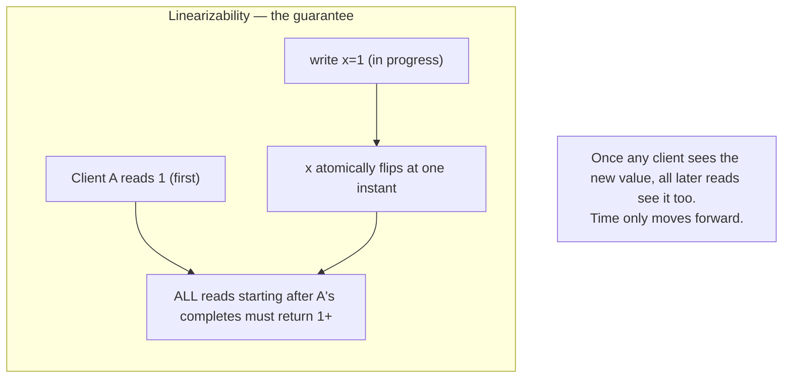
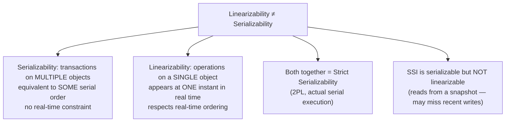
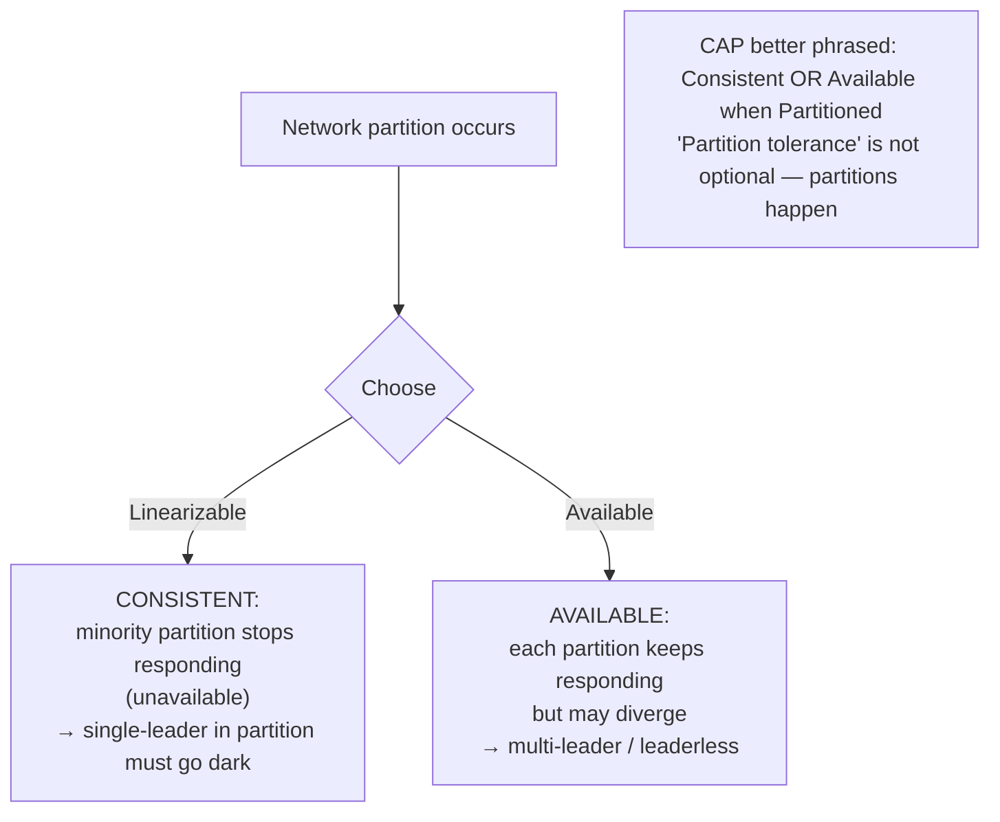

# Linearizability & the CAP Trade-off

**Prerequisites:** Topics 10–13 (replication), Topic 20 (unreliable networks)
**Difficulty:** Advanced
**Interview importance:** ⭐ **Critical** — the staff differentiator is *why* CAP is a bad frame
**Source:** Chapter 9 — "Linearizability", "The Cost of Linearizability", "The CAP Theorem"

---

## 1. What Is It?

**Linearizability** (also called *atomic consistency* or *strong consistency*) is the strongest consistency guarantee for distributed data: it makes a system appear as if there is **only one copy** of the data, and **all operations on it are atomic**.

Formally: once any client has read a new value, all subsequent reads by any client must also return that value (or a later one). Operations appear to take effect at a single, instantaneous point in time, and time only moves forward. It's the guarantee you get from a single-machine, single-threaded, fully in-memory register.

**CAP theorem:** a widely cited result saying a distributed system can't be *Consistent* (linearizable), *Available*, and *Partition tolerant* all at once. The book's message: CAP is a **poor frame** — partitions aren't optional, the term "available" is defined idiosyncratically, and the theorem is too narrow to guide system design. **A better phrasing: when a partition occurs, choose Consistent or Available.**

---

## 2. Why Does It Exist?

Topic 11 introduced read-after-write, monotonic reads, consistent prefix. Those are targeted patches for specific anomalies. Linearizability is the nuclear option — the single guarantee that eliminates *all* anomalies, making the distributed system behave exactly like a single-copy, single-threaded one.

Why not always use it? **Performance.** Linearizability is provably slow: the response time of linearizable reads and writes is *at least proportional* to the uncertainty of network delays (Attiya & Welch). On a network with variable delays, that means high, unpredictable latency — all the time, not just during faults. So most databases that forgo it do so for **performance**, not for some sophisticated architectural reason.

This also means the "CAP" trade-off (consistency vs availability under partition) is *also* a performance trade-off in practice — linearizability costs you latency even when there are no partitions.

---

## 3. Simple Explanation

**Linearizability in one line:** once any client sees a new value, everyone sees it. Time only moves forward. There's no "I saw it but you didn't yet," no "I saw 5, then 3." A single, universal, monotonically advancing timeline.

**The CAP truth in two sentences (better phrasing):** partitions will happen — you don't get to avoid them. When one occurs, you must choose: stay **consistent** (some nodes stop responding to stay in sync) or stay **available** (nodes respond but may disagree). CAP says you can't have both under a partition.

**Why CAP is unhelpful:** because "partition tolerance" isn't a knob you can turn off. Partitions happen whether you like it or not; you're always *already* making the consistent-or-available choice; and "available" in CAP means something narrower than what people mean in practice. So CAP gives you a *name* for a choice you'd make anyway, but doesn't help you *how* to make it.

---

## 4. Real-World Analogy

**A live sports scoreboard posted simultaneously in two airport terminals separated by a network outage.**

- **Linearizable:** when the final score is posted in one terminal, the other terminal must either show the same score or refuse to show any score until it can sync. If you see "Team A wins" anywhere, everyone sees it. But: during the network outage, one terminal goes dark (unavailable) rather than show potentially stale results.
- **Non-linearizable (available):** both terminals keep showing scores, even if they diverge. You might check the score on your gate screen (showing old data) then walk to another gate (showing the real result). The screens are always responsive, but they don't agree.

The point: linearizability guarantees one single truth visible to everyone simultaneously, at the cost of going dark when you can't confirm the truth.

---

## 5. Technical Explanation

### What makes a system linearizable

The formal requirement: every operation appears to **take effect atomically at a single point in time**, and that point falls within the operation's real-world time interval (between when the request was sent and when the response was received). After the point when any operation's effect becomes visible to any reader, all subsequent readers must see that effect (or a later one) — **no going backward.**

This is stricter than just "consistent snapshot at transaction start" (which is snapshot isolation / SSI). It's about the **recency** of reads: a linearizable system makes every read return the most recently written value, from a global perspective.

The book's clearest illustration: if client A reads value 1 (the result of a concurrent write), then any client B whose read *starts after* A's read *completes* must also return 1 or later — even if the write is still "in progress" from C's point of view. Once the new value is seen by anyone, it must be seen by everyone thereafter.

**Compare-and-set (CAS)** is the canonical linearizable operation — it atomically reads and conditionally writes, and this works correctly only if the system is linearizable.

### Linearizability vs serializability — the crucial distinction

Often confused; very different:

- **Serializability** (Topic 19): a property of *transactions* (multiple objects, multiple operations). The result is equivalent to *some* serial ordering of transactions. Says nothing about *which* serial order, nor about the relationship to real-time.
- **Linearizability**: a property of *individual operations on a single object*. Every operation takes effect at a *specific instant* in real time. Real-time ordering is respected — if operation A completes before B starts, A is ordered before B.

A database can have:
- Both (strict serializability = 2PL, actual serial execution) — the strongest.
- Serializability without linearizability — SSI; reads from a consistent snapshot that may not be the most recent.
- Linearizability without serializability — a single register, one object.
- Neither — eventual consistency.

**Interview hook:** SSI is **not linearizable** by design — it reads from a consistent snapshot, which intentionally excludes more recent writes.

### When linearizability is actually needed

The book names exactly three situations that *require* linearizability:

1. **Locking and leader election.** A distributed lock or leader election requires that all nodes agree on who holds it. That agreement is, by definition, linearizable — all nodes must see the same (and current) holder. ZooKeeper and etcd provide linearizable operations via consensus to power distributed locks and leader election. Without linearizability, two nodes can each believe they hold the lock (split-brain).

2. **Uniqueness constraints.** A unique username or bank account that can't go negative requires all nodes to agree on the current value *at the moment of write*. Claiming a username is atomic compare-and-set — "if not taken, take it" — which is linearizable. Without it, two users can simultaneously claim the same name and both succeed. (Some constraints can be relaxed — if a flight overbooking is acceptable, linearizability isn't strictly needed.)

3. **Cross-channel timing dependencies.** If two different communication channels carry related information, linearizability prevents race conditions. The book's example: a photo upload service writes the photo to file storage, then queues a resize job. If the file storage isn't linearizable, the resizer might process the job before the photo is replicated to the storage node it reads from — returning a permanently stale thumbnail. The message queue was faster than internal replication.

### Implementing linearizable systems

Which replication methods *can* provide linearizability?

- **Single-copy (no replication):** trivially linearizable, but not fault-tolerant.
- **Single-leader, reads from leader only:** potentially linearizable — the leader has the authoritative value. But if reads are served from followers, linearizability is lost (followers may lag).
- **Consensus algorithms (Raft, Zab — ZooKeeper, etcd):** linearizable, because a read from the leader is guaranteed to be up to date (the leader knows it's still leader).
- **Multi-leader:** **not linearizable** — concurrent writes to different leaders can conflict, and different clients can see different orders.
- **Leaderless (Dynamo-style quorums):** **not safely linearizable** — even with `w + r > n`, network delays can cause a situation where B reads an older value after A has already read the newer one (a race on concurrent quorum reads during a write). To make leaderless linearizable requires synchronous read repair before returning results, which Riak doesn't do, and Cassandra loses it with LWW under concurrent writes. **Safest assumption: leaderless is not linearizable.**

### The cost of linearizability — the CAP trade-off (properly framed)

Consider two datacenters with a single-leader database (leader in datacenter 1). A network partition cuts the link between them.

- Datacenter 1 (has the leader): continues to serve both reads and writes normally.
- Datacenter 2 (followers only): any read from a follower may be stale, so it's not linearizable. If the application *requires* linearizability, datacenter 2 **must stop serving requests** (or return errors) until the network is repaired. It becomes **unavailable**.
- If you used **multi-leader** instead, both datacenters can keep serving writes independently — remaining **available** — but they may diverge, so you lose **linearizability**.

This is the CAP trade-off: under a partition, choose consistency (linearizability) or availability (continued responding), but not both.

### Why CAP is an unhelpful frame — the staff differentiator

The book is unusually pointed here:

1. **"Partition tolerance" is not a choice.** Network partitions *will* happen — hardware fails, cables get cut, misconfigured routers split the network. You cannot opt out. So "pick 2 of 3 from {C, A, P}" is wrong — you're always stuck with P, and the choice is really between C and A *under* P.

2. **"Available" means something weird in CAP.** In CAP, available means "every request to a non-failed node must receive a response." Many systems that practitioners call "highly available" or "fault tolerant" don't meet this strict definition. CAP's definition of available is too narrow to match engineering usage.

3. **CAP only covers one consistency model (linearizability) and one fault type (partition).** It says nothing about network delays, dead nodes, or the many consistency models weaker than linearizability. Real system design involves far more dimensions.

4. **CAP encourages a false binary.** Systems exist on a spectrum — you might serve stale reads under a partition (partially available) or require writes to use a consensus protocol (partially linearizable). CAP's binary doesn't capture this.

5. **Linearizability is costly even without partitions.** The performance cost of linearizability — provably proportional to network delay uncertainty (Attiya & Welch) — exists all the time. Many databases that skip linearizability do so **primarily for performance**, not for fault tolerance. CAP only points to the partition scenario.

**Better phrasing (from the book):** *"Consistent OR Available when Partitioned."* Not three things, two; and the partition is a when, not a knob.

**Better question than "are you CAP-consistent?":** "What consistency guarantees do you actually need for this specific workload, and what is the cost of providing them?"

### Linearizability and network delays — the fundamental constraint

Even on a multi-core CPU, RAM is **not linearizable**: each core has its own cache, and writes are asynchronously propagated to main memory and other cores' caches. You *can* enforce CPU linearizability with memory barriers (fences), but they're expensive — which is why compilers and CPUs reorder memory operations for performance.

The analogy is direct: distributed systems make the same trade-off, at larger scale. The cost is not optional — Attiya & Welch prove it is inherent. Weaker consistency models can be much faster. The design question is which operations *really* need the full guarantee, and pay for it only there.

---

## 6. Diagrams







---

## 7. Concrete Example

**A distributed username-claim system.**

Two users, Alice and Bob, both try to claim the username "alice" at the same millisecond, each sending to a different datacenter.

- **Non-linearizable system** (e.g., multi-leader): both datacenters process the claim locally and succeed — both Alice and Bob are told "username claimed." Each datacenter replicates asynchronously. Now two accounts have the same username; the uniqueness constraint is violated.
- **Linearizable system** (e.g., single-leader via ZooKeeper's compare-and-set): the claim is a linearizable atomic compare-and-set: "if username not taken, take it." Only one node is the authority. One request arrives first, claims it, sets the value; the other sees the value is taken, returns an error. Exactly one winner.

The uniqueness constraint is *only* correct in the linearizable system. And during a network partition, the minority datacenter must refuse the claim (unavailable) rather than risk issuing a duplicate. That's the CAP trade-off: correctness at the cost of availability.

The interview version of this: "uniqueness constraints require linearizability because they're fundamentally atomic compare-and-set operations, which require agreement on the *current* value, which requires a single authoritative copy or consensus."

---

## 8. When to Use / Not Use

**Use linearizability (or a consensus service that provides it) when:**
- Distributed locks / leader election (split-brain prevention).
- Uniqueness / mutual-exclusion constraints where a violation is unacceptable.
- Cross-channel coordination where a race between two communication paths must be prevented.
- Any "read must see the latest write, globally" invariant.

**Avoid linearizability (accept weaker consistency) when:**
- Stale reads are acceptable (recommendation feeds, cached data, non-critical counters).
- You need maximum availability or low latency under partitions.
- Analytical/batch reads that can tolerate a consistent snapshot that's not the absolute latest.
- Performance requirements exceed what linearizability's provable latency bound allows.

---

## 9. Advantages & Disadvantages

**Advantages of linearizability:** eliminates all read anomalies; enables distributed locks, leader election, uniqueness constraints; simplest programming model — reason about the system as a single machine.
**Disadvantages:** provably slow (proportional to network delay uncertainty); unavailable in the partitioned minority; essentially requires consensus (expensive coordination); single-threaded CPU caches aren't linearizable by default — you pay the same trade-off at every level.

---

## 10. Trade-off Table

| System type | Linearizable? | Why / trade-off |
|---|---|---|
| Single-leader, reads from leader | Yes (if reads to leader only) | Leader is the authoritative copy |
| Single-leader, reads from followers | No | Followers may lag |
| Multi-leader | No | Concurrent writes at different leaders |
| Leaderless (Dynamo-style) | **Not safely** (even with quorums) | Network delay races; LWW loses it |
| Consensus algorithms (Raft / ZK / etcd) | Yes | Designed to be; basis of distributed locks |
| SSI | No (by design) | Reads from a snapshot — intentionally not the most recent |
| CPU RAM (single core) | Yes | No concurrency |
| CPU RAM (multi-core, no barrier) | **No** | Each core has a cache; async to main memory |

| CAP angle | Correct framing | Why "pick 2 of 3" is wrong |
|---|---|---|
| Under a partition | Choose C or A | Partitions happen; you can't opt out of P |
| "Available" in CAP | Every request to a non-failed node answers | Too narrow — most "HA" systems don't meet this |
| What CAP covers | Only linearizability + only partitions | Doesn't cover delays, dead nodes, or weaker models |
| Primary cost of linearizability | **Performance (always)** | Not just under partitions — response time ∝ delay uncertainty |

---

## 11. Failure Scenarios

| Scenario | With linearizability | Without |
|---|---|---|
| Network partition (minority) | Minority stops responding (unavailable) | Minority responds but may return stale/conflicting data |
| Concurrent username claim | One succeeds, one fails (correct) | Both succeed (uniqueness violated) |
| Photo resize race (cross-channel) | No race; resizer always sees the photo | Resizer may process a stale or missing photo |
| Two leaders elect simultaneously | Impossible (consensus prevents) | Split-brain; both act as leader |
| Read after partition heals | Returns the latest committed value | May return stale until sync completes |

---

## 12. Production Considerations

- **Use ZooKeeper / etcd** (consensus-backed, linearizable) for distributed locks, leader election, and configuration — not a leaderless datastore.
- **Don't assume leaderless quorums are linearizable.** They're not, and assuming so can lead to subtle correctness bugs.
- **Single-leader reads from the leader** for operations that need linearizability; route everything else to followers.
- **Don't cargo-cult "CP vs AP."** Ask: what specific consistency property does this operation need? Pay for linearizability only where it matters.
- **Avoid CAP as a design guide** — use it to name a trade-off in retrospect, not to make architectural decisions. The real question is "what anomalies can the application tolerate?"
- **Be explicit about which operations are linearizable** in your documentation, because "consistent" is ambiguous.

---

## ❌ 13. Common Mistakes

- **Confusing linearizability with serializability.** Different dimensions: linearizability is one object in real time; serializability is multiple objects in some logical order. SSI is serializable but not linearizable.
- **Thinking quorums (w + r > n) guarantee linearizability.** They don't — network delay races can still produce stale reads.
- **Saying "we're CP so we sacrifice availability under partitions."** Implies the trade-off is only under partitions; the performance cost is constant, always.
- **Using "CAP" as an explanation** for design decisions in interviews without noting its limitations — a senior/staff interviewer will push back.
- **Assuming "highly available" implies not linearizable.** Some consensus systems are both highly available (fault-tolerant) and linearizable.
- **Implementing a distributed lock without a consensus-backed linearizable service.** Leaderless locks don't work correctly.
- **Not routing correctness-critical reads to the leader** in a single-leader setup, thereby losing linearizability.

---

## 🧠 14. Think Like an Engineer

```
Does this operation require that all nodes agree on the CURRENT value?
   (distributed lock, uniqueness, leader election, cross-channel timing)
   → LINEARIZABILITY needed → use consensus service (ZooKeeper/etcd)
        ↓
Can stale reads be tolerated, or is this analytics / caching / feed?
   → weaker consistency is fine → followers, leaderless, eventual
        ↓
Am I under a network partition? (or designing for when I will be)
   → choose: consistent (minority goes dark) OR available (may diverge)
   → NOT "pick 2 of 3" — partitions aren't optional
        ↓
Am I paying the linearizability cost ALL the time, even without partition?
   (latency ∝ network delay uncertainty — yes, always)
        ↓
Is SSI sufficient? (serializable but not linearizable — reads from snapshot)
   → fine for transactions, NOT fine for "read the absolute latest value"
```

---

## 15. Mental Model

```
Linearizability = "only one copy, one instant" — the strongest single-object guarantee
      ↓
Once ANY client sees the new value, ALL later reads must too.
Time only moves forward. No going back to stale.
      ↓
Price: proportional to network delay uncertainty (provably) — always slow.
Under partition: minority must go dark (unavailable) or risk stale/conflicting.
      ↓
CAP: partitions happen. Choose Consistent OR Available when they do.
"Pick 2 of 3" is wrong. "Available" means something odd. CAP is narrow.
Avoid using it to make decisions — use it to name a trade-off.
      ↓
Use linearizability only where you need it: locks, leader election, uniqueness.
Everything else: weaker, faster, more available.
```

---

## 🔗 16. How This Connects to Other Concepts

- **Replication Lag (Topic 11)** — read-your-writes and monotonic reads are weaker guarantees; linearizability is the one that subsumes them all.
- **Single-Leader (Topic 10)** — reads from the leader can be linearizable; reads from followers are not.
- **Leaderless (Topic 13)** — Dynamo-style quorums are NOT safely linearizable despite `w + r > n`.
- **Serializability (Topic 19)** — serializable but not linearizable (SSI); the difference is crucial.
- **Truth & Fencing (Topic 22)** — distributed locks and leader election *require* linearizability, which is why ZooKeeper (a consensus system) is used.
- **Ordering & Causality (Topic 24)** — linearizability is stronger than causal consistency; causality can be provided more cheaply.
- **Consensus (Topic 26)** — consensus algorithms (Raft, ZooKeeper's Zab) are what provides linearizability in fault-tolerant systems; linearizable compare-and-set reduces to consensus.

---

## 17. Interview Questions & Answers

**Beginner**

**Q: What is linearizability?**
Linearizability makes a distributed system appear as if there's only one copy of the data and all operations on it are atomic. Once any client reads a new value, all subsequent reads by any client must also return that value or a later one — time only moves forward. It's the guarantee you'd get from a single-machine, single-threaded register.

**Q: What is the CAP theorem, in simple terms?**
When your distributed system experiences a network partition — nodes that can't reach each other — you must choose between staying consistent (returning only confirmed, up-to-date values, which may mean refusing requests) or staying available (continuing to respond, even if that means returning potentially stale or conflicting data). You can't have both. But it's worth noting that the theorem is more limited than it's often presented as, and "partition tolerance" isn't really a knob you can turn — partitions happen regardless.

**Intermediate**

**Q: Why is CAP a poor frame for distributed system design?**
Three reasons. First, "partition tolerance" isn't a choice — network partitions will happen whether you like it or not, so you're always making the consistent-or-available choice; calling it "pick 2 of 3" is misleading. Second, "available" in CAP means something narrow and idiosyncratic — every request to a non-failed node must receive a response — which most systems people call "highly available" don't actually satisfy. Third, CAP only covers linearizability and network partitions; it says nothing about network delays, dead nodes, or the many weaker consistency models that are more practically relevant. A better way to phrase the actual trade-off is: when a partition occurs, you can be consistent or available. And a more useful question than "is this a CP or AP system" is "what consistency anomalies does this operation actually need to prevent, and what does that cost?"

**Q: Can Dynamo-style quorums provide linearizability?**
Not safely, even with `w + r > n`. Network delays can create race conditions: two clients can do concurrent quorum reads during a write, and due to variable delays, one sees the new value while the other sees the old value — and the one with the old value can start its read *after* the other finishes, violating linearizability. You can force linearizability by making readers do synchronous read repair before returning results, but the performance cost removes the main advantage of the leaderless model, and Riak doesn't do this, and Cassandra loses it under concurrent writes with LWW. The practical answer is: assume leaderless systems are not linearizable.

**Q: When do you actually need linearizability?**
Three specific situations. Distributed locks and leader election — all nodes must agree on who holds the lock at any moment, which requires everyone to agree on the current value, which is linearizability. Uniqueness constraints — claiming a username, preventing a double-spend, not overbooking a seat — these are atomic compare-and-set operations and require agreement on the current value. And cross-channel timing dependencies — when a write goes through one path and a notification goes through another, and the receiver of the notification must see the completed write, so the write store must be linearizable to prevent a race condition.

**Advanced / Staff**

**Q: A colleague says "we're a CP system so we sacrifice availability under network partitions." Is that a complete and accurate statement?**
It's not wrong exactly, but it's incomplete in a way that matters. The framing treats the cost of linearizability as though it only shows up during partitions, and that's false. Attiya and Welch proved that linearizable reads and writes have response time at least proportional to the uncertainty of network delays — and that cost is present all the time, not only during faults. So many databases that forgo linearizability do so primarily for performance — lower latency always — not primarily for partition tolerance. The partition-availability trade-off is real, but it's the visible, dramatic version of a cost that's actually paid continuously. The other limitation of saying "CP" is that CAP only covers one consistency model and one fault type, so it doesn't tell you much about what the system actually guarantees under other conditions. I'd describe the system more precisely: "we use single-leader with reads routed to the leader, so we're linearizable; under a network partition, the minority side stops serving requests to maintain that guarantee, which means some fraction of clients experience unavailability during the partition window."

**Q: Design a distributed counter where you can guarantee no two increments are lost. What does it need?**
If by "no two increments lost" I mean the final value must reflect every increment exactly, then I need every increment to be applied exactly once, which means some form of at-most-once or exactly-once protection. For a highly-contended counter, a single linearizable register is the simplest answer — route all increments to a single authoritative node or use a consensus-backed compare-and-set, and each increment atomically reads then writes. The cost is throughput: a single node is the bottleneck. For higher throughput I'd shard the counter into N sub-counters, each independently linearizable, and increment a randomly chosen sub-counter per operation — reads sum all N. This spreads the hot spot without losing correctness, because each sub-counter is still linearizable. If occasional consistency is acceptable — for example, an approximate view counter — I'd use a CRDT counter (logically a grow-only set of increments, merged at read time), which is leaderless, highly available, and eventually consistent, but doesn't guarantee you see the total inclusive of concurrent increments from all nodes in real time. The choice comes down to whether the application needs an exact, real-time-consistent count (linearizable) or an approximate, highly-available one (CRDT).

---

## 🎯 30-Second Interview Answer

> "Linearizability makes a distributed system appear as if there's one copy of the data and all operations are atomic — once any client reads a new value, all subsequent reads anywhere must also see it. It's what enables distributed locks, leader election, and hard uniqueness constraints, because all of those require every node to agree on the *current* value. The cost is provably proportional to network delay uncertainty — it's slow all the time, not just during faults. Under a network partition, the minority side must go dark to maintain the guarantee. That's the CAP trade-off, but CAP is a poor frame: partitions aren't optional so 'pick 2 of 3' is wrong, 'available' means something odd in CAP, and it only covers linearizability and partitions — not delays or the many weaker consistency models. Better phrasing: when a partition occurs, choose consistent or available. And the right question isn't 'CP or AP' but 'what anomaly does this operation actually need to prevent, and what does it cost?' Also critical: leaderless quorums are *not* safely linearizable despite the quorum rule, and SSI is serializable but *not* linearizable because it reads from a snapshot."

---

## ⚡ Quick Revision

- **Linearizability = "one copy, one instant"**. Once ANY client sees the new value, ALL later reads must too. Time only moves forward.
- **Not the same as serializability:** serializability = multiple objects, some logical order, no real-time constraint. Linearizability = one object, real-time ordering. **SSI is serializable but NOT linearizable** (reads from a snapshot).
- **Three real uses:** distributed locks/leader election, uniqueness constraints (hard), cross-channel timing (photo resize race).
- **Who provides it:** single-leader (reads to leader only), consensus algorithms (Raft/ZooKeeper/etcd). **Multi-leader: no. Leaderless: not safely** (even with quorums — network delay races).
- **Cost: always slow** (latency ∝ network delay uncertainty, Attiya & Welch); minority partition must go dark.
- **CAP is a poor frame:** partitions aren't optional (P is not a knob); "available" is defined oddly; only covers one model + one fault. Better: "Consistent **OR** Available **when Partitioned**." Most systems skip linearizability for **performance**, not partition tolerance.
- **Multi-core CPU RAM is not linearizable** (per-core cache, async to main) — same trade-off at smaller scale.
- Avoid using "CP/AP" as a design rationale — name the specific guarantees and costs instead.
