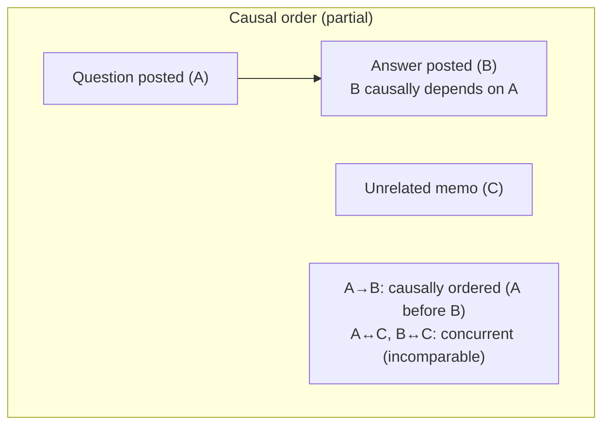
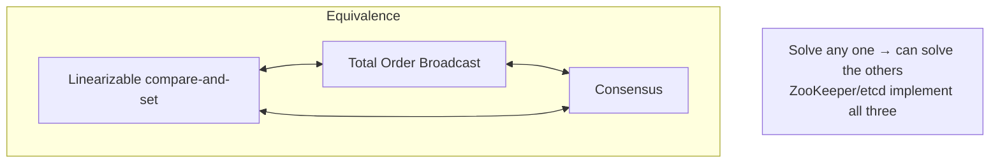

# Ordering & Causality

**Prerequisites:** Topics 13 (leaderless), 21 (clocks)
**Difficulty:** Advanced
**Interview importance:** High
**Source:** Chapter 9 — "Ordering and Causality", "Sequence Number Ordering", "Total Order Broadcast"

---

## 1. What Is It?

**Causality** is the relationship "cause comes before effect." In distributed systems, if operation A causally preceded operation B (B depended on, built on, or read from A), then any correct system must reflect that ordering — B cannot be visible without A.

**Ordering** is the problem of establishing *which operations happened before which* across a distributed system with no shared clock or memory.

This file covers four building blocks:

- **Happens-before / causal ordering** — when two events are causally related vs concurrent.
- **Causal consistency** — the strongest consistency model that doesn't slow with network delays and remains available under partitions.
- **Lamport timestamps** — a simple algorithm for a total order consistent with causality (but with a key limitation).
- **Total order broadcast** — the stronger primitive that enables atomic commit and linearizable storage; equivalent to consensus.

---

## 2. Why Does It Exist?

Causality keeps coming up everywhere in the book:

- **Consistent prefix reads (Topic 11):** an answer visible before its question — a causality violation.
- **Multi-leader / leaderless (Topics 12–13):** an update visible before the insert it updates — a causality violation.
- **Snapshot isolation (Topic 18):** "consistent" means causally consistent — a snapshot must contain the question if it contains the answer.
- **Write skew (Topic 18):** SSI detects it by tracking causal dependencies between transactions.
- **LWW with clock skew (Topic 21):** a causally-later write gets a lower timestamp, and is silently dropped.

**Why not just use linearizability?** Linearizability implies causality — a linearizable system is automatically causally consistent. But linearizability is expensive (Topic 23). The key insight is: **causal consistency is the strongest consistency model that doesn't slow down due to network delays and remains available during partitions.** Many systems that appear to need linearizability actually only need causal consistency, which can be implemented far more cheaply.

---

## 3. Simple Explanation

**Causality:** A caused B if B saw or depended on A. Cause must come before effect — everywhere, for everyone.

**Partial order vs total order:**
- Real life is **partially ordered**: some events have a clear before/after (A sent the question; B answered it — A is before B), but some are **incomparable** (two people wrote something simultaneously without seeing each other's — concurrent, no ordering).
- **Linearizability is a total order**: every operation is before or after every other, with no concurrency. Strict, powerful, expensive.
- **Causal consistency is a partial order**: concurrent operations can be in any order, but causally-related ones must be ordered correctly. Cheaper, more available, usually sufficient.

**Lamport timestamps:** a compact way (a counter + node ID) to produce a **total** order consistent with causality — but they can't tell you whether two operations are concurrent or causally related.

**Total order broadcast:** a protocol where every node delivers the same messages in the same order, with no gaps. This is stronger than Lamport timestamps, equivalent to consensus, and is what ZooKeeper actually implements.

---

## 4. Real-World Analogy

**A law firm routing email chains.**

- If partner A writes a memo and associate B responds to it, B's response *causally depends* on A's memo — you must see the memo to understand the response. That's a causally-ordered pair.
- If A and B simultaneously draft *different* memos about *different* matters, those are **concurrent** — neither depends on the other, and the order you read them doesn't matter for understanding.
- **Partial order:** memos in the same chain are ordered; memos in different chains are incomparable (concurrent).
- **Total order:** imagine a partner who reads every memo ever written and assigns a number to each. That's expensive (requires one global authority) but gives a single definitive sequence.
- **Lamport timestamps:** each attorney stamps their memo with a number, bumped whenever they see a higher number from anyone else. Guarantees that a reply has a higher number than the memo it replies to — causality honored — but two memos with adjacent numbers might be from independent chains: you can't tell from the numbers alone.

---

## 5. Technical Explanation

### Why ordering keeps coming up

The book traces causality through every chapter of Part II:

- Consistent prefix reads: answer before question is a causality violation.
- Multi-leader updates before inserts: causality violation.
- Snapshot isolation "consistency": a snapshot is causally consistent — it contains all effects of operations that causally preceded the snapshot timestamp.
- Write skew: the on-call decision is causally dependent on reading the roster; SSI tracks this.
- LWW + clock skew (Topic 21): a causally-later write has a lower timestamp → dropped.

**Causal consistency** = the system respects causal order. When you read something, you can also see everything that causally preceded it. Operations that are causally related appear in the right order. Concurrent operations may appear in any order (they're incomparable — there's no defined ordering needed).

### Partial order vs total order

**Total order:** any two elements comparable — given any two operations, you can always say which came first. Linearizability gives a total order. So does Lamport timestamps (once all messages are collected).

**Partial order:** some pairs are incomparable — two concurrent operations can't be said to be in any particular order; they simply coexisted. Version vectors (Topic 13) distinguish concurrent from causally-related pairs. The causal order is a partial order.

**Causal consistency is the strongest model possible without slowing down under network delays** (Shapiro et al., Attiya & Welch). This is the key research insight: if you want something stronger (linearizability), you must pay the latency cost proportional to network delay. Causal consistency costs nothing extra in latency.

### Sequence number ordering and Lamport timestamps

**Why simple sequence number generators aren't causally consistent:**

- **Odd/even per node:** if node 1 generates odd numbers and node 2 even, a causally-later operation on node 2 might have a lower even number than a causally-earlier operation on node 1 with a higher odd number. You can't compare them reliably.
- **Physical timestamps:** clock skew (Topic 21) means a causally-later write can have an earlier timestamp — exactly the LWW problem.
- **Block allocation (node A gets 1–1000, node B gets 1001–2000):** a causally-later operation from block 1–1000 might have a lower number than an earlier operation from 1001–2000. Not consistent with causality.

All three generate unique sequence numbers, but **none is causally consistent.**

**Lamport timestamps — Leslie Lamport, 1978, one of the most-cited papers in distributed systems:**

Each node has a unique ID and a counter. The Lamport timestamp is a pair `(counter, node_ID)`. Comparison: higher counter wins; ties broken by node ID.

The **critical rule:** every node and every client tracks the *maximum counter value seen* and includes it on every request. When a node receives a request or response with a higher counter value than its own, it **immediately updates its own counter to that maximum** (then increments for the next operation).

This rule ensures: if operation A causally precedes B (B has seen A or A's effects), then A's counter will have propagated to B's node before B runs, and B will have a strictly higher counter than A. Causality ⟹ higher Lamport timestamp. The ordering is consistent with causality.

**Lamport timestamp vs version vectors:** often confused, different purposes. Version vectors can **distinguish** whether two operations are concurrent or causally related (A's vector compared to B's vector: if one dominates, they're causally ordered; if incomparable, concurrent). Lamport timestamps **cannot** make this distinction — they enforce a total order, but two operations with adjacent Lamport timestamps might be concurrent or causally related, you can't tell. Lamport timestamps are more compact; version vectors carry more information.

### Why total ordering isn't enough — the username problem

Suppose you want unique usernames. Lamport timestamps give you a total order. Can you use them?

You can determine the winner *after the fact* — once all operations are collected, compare timestamps, pick the lower one as the claimed username. But **you can't decide immediately** whether to accept or reject a request as it arrives. You'd need to know if any other node is concurrently claiming the same username with a lower timestamp — which requires checking every other node. If any node is unreachable, you're stuck. This is not fault-tolerant.

**The problem:** the total order only emerges after all operations are collected. You can't enforce a constraint (uniqueness) in real-time without knowing the complete order. Lamport timestamps establish *which* order, but not *when* that order is finalized.

### Total order broadcast (atomic broadcast)

**Definition:** a protocol that guarantees every node delivers the same set of messages in the same order, and every message is either delivered to all nodes or to none. Two safety properties:

- **Reliable delivery:** if a message is delivered to one node, it is delivered to all.
- **Totally ordered delivery:** messages are delivered to every node in the same order.

Crucially: **the order is fixed at delivery time.** A node cannot retroactively insert a message earlier in the sequence. This is stronger than timestamp ordering (where messages could in principle be reordered once you learn of a later timestamp).

Total order broadcast can be thought of as creating a **log**: delivering a message is like appending to a log. All nodes read the same log in order.

**Why is it powerful?**

- **Database replication:** if every write is a message in the log, and all replicas apply writes in the same order, they remain consistent. This is the core of state machine replication (and what the replication log in Topic 10 actually implements).
- **Serializable transactions:** if every message is a deterministic transaction, applying them in the same order across all partitions keeps the database consistent (used in actual serial execution systems).
- **Fencing tokens (Topic 22):** every request for a lock is appended to the log; the log sequence number *is* a fencing token — monotonically increasing, exactly the right property.
- **Uniqueness constraints:** to claim a username atomically — append a "I want username X" message, wait for it to be delivered, check if any earlier message claimed X; if yours is first, you win.

**Implementing linearizable storage with total order broadcast:**

To claim a username atomically, using total order broadcast as an append-only log:
1. Append a message "I want username X" to the log.
2. Read the log, wait for your message to appear.
3. If your message is the **first** message claiming X in the log → success. Otherwise → fail.

Because all nodes receive messages in the same order, they'll all agree on who came first.

This gives **linearizable writes** (sequential writes on the log) but not necessarily linearizable reads (readers might be behind the log head). To make reads linearizable too: either sequence the read through the log (like etcd's quorum reads), fetch the latest log position before reading (ZooKeeper's `sync()`), or read from a synchronously-updated replica.

**Implementing total order broadcast with linearizable storage:**

If you have a linearizable integer that supports atomic increment-and-get: for each message, atomically increment-and-get to get a unique sequence number; attach it to the message; resend if lost. Recipients deliver messages in sequence-number order, waiting if there are gaps. This gives total order broadcast.

**The equivalence:** linearizable compare-and-set register ≡ total order broadcast ≡ consensus.

All three are different facets of the same problem. Solve one and you've solved the others. This is the deep insight the book builds to: **consensus, total order broadcast, and linearizable operations are equivalent in power.** ZooKeeper and etcd implement total order broadcast (and hence consensus), and that's what makes everything else (distributed locks, leader election, fencing) built on them work correctly.

---

## 6. Diagrams



```mermaid
flowchart LR
    subgraph "Lamport timestamp rule"
        N1["Node 1, counter=1"] -->|send request, counter=1| N2["Node 2, counter=5"]
        N2 -->|update: max(1,5)+1 = 6| N2b["Node 2, counter=6"]
        N2b -->|reply, counter=6| N1b["Node 1: update counter to 6"]
    end
    note2["Causality ⟹ higher timestamp\nbut equal/adjacent timestamps may be concurrent OR causal"]
```



---

## 7. Concrete Example

**A chat application with message ordering (consistent prefix reads problem).**

Alice posts a question; Bob replies. If the system is not causally consistent, a new observer C might see Bob's answer before Alice's question — nonsensical.

- **Version vectors approach:** each message carries a vector. C's client sees the answer's vector, knows it depends on the question's position, waits until the question is visible before displaying the answer. Causality guaranteed, no global synchronization needed.
- **Lamport timestamps approach:** Alice's question gets timestamp (3, node1). Bob's reply runs: he's seen timestamp (3, node1), so his counter becomes 4, and the reply gets (4, node2). Any observer that sees (4, node2) must have seen or will eventually see (3, node1). Causal ordering assured.
- **Total order broadcast:** the chat messages are appended to a shared log in total order. Every client reads the log in order. No client ever sees the answer before the question, because the log is the single fixed order.

The important nuance: for a **two-party conversation** (Alice–Bob), causal consistency (Lamport / version vectors) is sufficient and cheap. For a **global constraint** (uniqueness, transactions), you need total order broadcast / consensus — the finalized order matters, not just relative ordering.

---

## 8. When to Use What

**Causal consistency (version vectors / Lamport timestamps):** when operations depend on each other and you need the causal chain respected, but you can tolerate concurrent operations in any order. More available than linearizability, immune to CAP's partition/availability trade-off, and more efficient.

**Total order broadcast:** when you need a global, finalized order — uniqueness constraints, serializable transactions, fencing tokens, state machine replication. Requires consensus (expensive, blocks in some failure modes) but is what ZooKeeper/etcd provide.

**Linearizability:** when you need the recency guarantee on reads (always return the latest value) *and* a total order. Total order broadcast gives linearizable *writes* but needs an extra step for linearizable reads.

---

## 9. Advantages & Disadvantages

**Causal consistency — advantages:** the strongest model without performance degradation from network delays; available under partitions (CAP doesn't apply); usually sufficient when you don't need a global constraint.
**Disadvantages:** doesn't prevent all anomalies (no uniqueness, no total finalized order without consensus); Lamport timestamps don't tell you if two events are concurrent; harder to implement correctly than eventual consistency.

**Total order broadcast — advantages:** enables uniqueness constraints, serializable transactions, and fencing; equivalent to consensus; all nodes see the same history.
**Disadvantages:** requires consensus, which can block when a leader is unavailable or under partition; throughput limited by the log's throughput; ordering latency.

---

## 10. Trade-off Table

| Mechanism | What it provides | What it can't do | Cost |
|---|---|---|---|
| Version vectors | Detect concurrent vs causally-ordered; prevent lost updates | Total order | Per-key tracking; size grows with replica count |
| Lamport timestamps | Total order consistent with causality | Distinguish concurrent from causal; real-time finalization | Very cheap (one counter) |
| Total order broadcast | Finalized total order; uniqueness; state machine rep. | Linearizable reads without extra step | Consensus required; latency |
| Linearizability | Recency + total order; simplest mental model | Anything during partition (minority goes dark) | Always proportional to delay uncertainty |
| Causal consistency | Strong, available, no CAP trade-off | Uniqueness constraints; finalized order | Tracking causal dependencies across DB |

---

## 11. Failure Scenarios

| Scenario | Consequence | Fix |
|---|---|---|
| Consistent prefix violation | Effect visible before cause (answer before question) | Causal consistency; deliver in causal order |
| LWW drops causally-later write (clock skew) | Silent data loss | Version vectors (Topic 21) |
| Lamport timestamps used for uniqueness | Can't decide in real-time; requires checking all nodes | Total order broadcast / consensus |
| Total order broadcast leader fails | Log delivery pauses | Consensus with leader election (ZooKeeper/etcd fault tolerance) |
| Concurrent conflicting operations | Need to know which was "first" in finalized total order | Total order broadcast; consensus |
| Node lags behind log | Reads are stale | Synchronous log delivery before reads; `sync()` |

---

## 12. Production Considerations

- **Use causal consistency (version vectors)** for operations that need causal ordering without global synchronization — it's available under partitions and has no CAP cost.
- **Use Lamport timestamps** when you need a compact, causal-consistent total order for debugging, audit logs, or approximate ordering — not for enforcing real-time uniqueness constraints.
- **Use total order broadcast (ZooKeeper/etcd)** for uniqueness constraints, leader election, fencing tokens, and any state machine replication — understand you're paying consensus costs.
- **Don't confuse Lamport timestamps with version vectors** — the former gives total order but can't distinguish concurrent from causal; the latter can.
- **The replication log in a single-leader database is total order broadcast** — the leader sequences all writes, and replicas apply them in that order. This is why single-leader replication can provide causal consistency.
- **Remember FLP:** in a purely asynchronous model, consensus is provably impossible. In practice, with timeouts or randomization, it's solvable — which is what Raft and Zab implement.

---

## ❌ 13. Common Mistakes

- **Using physical timestamps (LWW) for causal ordering** — clock skew means a causally-later write can have an earlier timestamp. Use Lamport timestamps or version vectors.
- **Confusing Lamport timestamps with version vectors.** Lamport: total order but can't tell concurrent from causal. Version vectors: can distinguish, but don't give total order.
- **Trying to enforce uniqueness constraints with Lamport timestamps alone.** The total order isn't finalized in real-time — you'd have to check all nodes, which blocks on any fault.
- **Assuming causal consistency and linearizability are the same.** Linearizability implies causality but is stronger (and more expensive); causal consistency is achievable without linearizability's costs.
- **Not realizing the replication log is total order broadcast.** State machine replication (all replicas apply the same log in order) IS total order broadcast.
- **Forgetting that total order broadcast requires consensus** — and that consensus can block under certain failure modes (the 2PC and Raft leader-election issues).

---

## 🧠 14. Think Like an Engineer

```
Does this operation depend on another having happened first?
   → need CAUSAL CONSISTENCY (version vectors / Lamport timestamps)
   → stronger than eventual consistency, available under partitions
        ↓
Do I need to enforce a REAL-TIME constraint (uniqueness, transactions)?
   → total order must be FINALIZED when decision is made
   → need TOTAL ORDER BROADCAST (ZooKeeper/etcd) = consensus
        ↓
Do I also need reads to see the latest written value?
   → LINEARIZABILITY (total order broadcast + linearizable reads)
   → costs proportional to network delay uncertainty (Attiya & Welch)
        ↓
Lamport timestamps:
   ✓ cheap total order consistent with causality
   ✗ can't distinguish concurrent from causal
   ✗ can't enforce real-time uniqueness
Version vectors:
   ✓ distinguish concurrent from causal
   ✗ don't give total order
        ↓
The equivalence: CAS register ≡ total order broadcast ≡ consensus
   → solve one, you've solved the others
```

---

## 15. Mental Model

```
Causality = cause before effect. Must be respected everywhere.
      ↓
Causal order = PARTIAL (some ops incomparable/concurrent)
Linearizable = TOTAL (every op before or after every other — expensive)
      ↓
Causal consistency = the strongest model without network-delay penalty
(CAP doesn't apply! Available under partitions.)
      ↓
Lamport timestamps: total order consistent with causality (cheap)
   but can't tell concurrent from causal, and can't finalize in real-time
      ↓
Total order broadcast: finalized total order, enables uniqueness + state machine replication
   = consensus (ZooKeeper/etcd implement this)
      ↓
CAS register ≡ total order broadcast ≡ consensus — three faces of the same thing
```

---

## 🔗 16. How This Connects to Other Concepts

- **Replication Lag (Topic 11)** — consistent prefix reads is a causality problem; version vectors from leaderless (Topic 13) are causal tracking.
- **Leaderless (Topic 13)** — version vectors introduced there are the causal tracking mechanism generalized here.
- **Clocks (Topic 21)** — LWW's data loss is a causality violation; Lamport timestamps are the logical-clock alternative.
- **Linearizability (Topic 23)** — linearizability implies causality but is stronger and more expensive; causal consistency is the cheap middle ground.
- **Two-Phase Commit (Topic 25)** — atomic commit requires a finalized total order, which requires total order broadcast (consensus).
- **Consensus (Topic 26)** — the culmination: CAS, total order broadcast, and consensus are equivalent; ZooKeeper implements them all.

---

## 17. Interview Questions & Answers

**Beginner**

**Q: What is causality in distributed systems?**
Causality is the relationship where one operation happened before another and the second might have depended on or built upon the first — cause before effect. If B reads data written by A, B causally depends on A. A causally consistent system always reflects this ordering: you'll never see B without first having seen A. Operations that are concurrent — neither saw the other — have no required ordering.

**Q: What is a Lamport timestamp?**
A pair of a counter and a node ID. The rule is that every time a node sends a message, it includes the highest counter it has seen, and any node that receives a higher counter value updates its own to match. This ensures that if operation A causally preceded B, A has a strictly lower Lamport timestamp than B — causality implies a higher timestamp. They're useful for getting a total order consistent with causality from a distributed system with no shared clock.

**Intermediate**

**Q: What's the difference between Lamport timestamps and version vectors?**
Both track ordering, but they answer different questions. A version vector has one entry per replica and can tell you whether two operations are concurrent (neither's vector dominates the other) or causally related (one dominates). Lamport timestamps can only give you a total order — they can tell you which of two operations has the higher timestamp, but not whether they were concurrent or causally related. Version vectors carry more information; Lamport timestamps are more compact. For conflict detection (Topic 13), you need version vectors. For total ordering in a log, Lamport timestamps suffice.

**Q: Why aren't Lamport timestamps enough for enforcing uniqueness constraints?**
Because the total order Lamport timestamps define only becomes *known* after you've collected all operations. When a request arrives to claim a username, you'd need to know if any other node is concurrently claiming the same name with a lower timestamp — which means checking every other node. If any node is unreachable, you're stuck. The root problem is that the ordering is not finalized in real-time; you can determine who won after the fact but not at the moment of the request. What you need is total order broadcast, which delivers messages in a fixed, finalized order that all nodes observe before it's relevant.

**Q: What is total order broadcast and why is it powerful?**
It's a protocol guaranteeing all nodes deliver the same messages in the same order, reliably. It's powerful because it's the foundation for several important things: database state machine replication (all replicas apply the same writes in the same order, so they stay consistent), serializable transactions, fencing tokens (the log sequence number is monotonically increasing), and linearizable uniqueness constraints (the first message in the log to claim a username wins). It's also equivalent to consensus — if you can implement one, you can implement the others.

**Advanced / Staff**

**Q: A colleague says "causal consistency is weaker than linearizability, so we should just use linearizability." How do you respond?**
I'd push back on the framing. Causal consistency is weaker in the sense that it doesn't give you a recency guarantee on reads — you might read a value that's not the absolute latest, as long as you see everything that causally preceded what you do read. But that's often all the application needs. The important point is that causal consistency is the strongest model that doesn't incur network-delay-proportional latency costs and that remains available during network partitions — CAP's trade-off doesn't apply to it. Linearizability costs you latency all the time and makes your minority partition go dark. So if you don't actually need to enforce "every read returns the globally latest value" — and many applications don't — you're paying real performance and availability costs for a guarantee you're not using. I'd want to identify specifically which operations require linearizability (distributed locks, hard uniqueness constraints) and pay for it narrowly there, using causal consistency elsewhere.

**Q: How does ZooKeeper's design relate to the equivalence between consensus, total order broadcast, and linearizable compare-and-set?**
ZooKeeper implements total order broadcast via the Zab protocol (Zookeeper Atomic Broadcast), which is a consensus algorithm. Because these three things are equivalent — you can build each from the other — ZooKeeper's total order broadcast capability is what powers everything else built on top of it: the `zxid` (ZooKeeper transaction ID) serves as a monotonically increasing fencing token; linearizable compare-and-set operations (like claiming a path or setting an ephemeral node) are implemented by appending to the log and checking that your message comes first; and leader election is just one node being the first to successfully claim a particular ZooKeeper node. All of these are the same underlying primitive — total order broadcast — wearing different clothes. When you use ZooKeeper for distributed coordination, you're using a consensus system, which is why it gives the strong guarantees it does, and why it can block during leader election when a quorum isn't available.

---

## 🎯 30-Second Interview Answer

> "Causality is the relationship 'cause before effect' — if B depends on A, every node must see A before B. Causal consistency is the strongest consistency model that doesn't pay a latency penalty from network delays and stays available under partitions — the CAP trade-off doesn't apply, which is why it's often sufficient where linearizability seems required. For ordering, Lamport timestamps give a total order consistent with causality (each node carries the max counter it's seen and bumps it on every message), but they can't distinguish concurrent from causally-related operations, and crucially they can't finalize the total order in real-time, so you can't use them alone for uniqueness constraints. Version vectors can distinguish concurrent from causal but don't give total order. When you need a *finalized* total order — for uniqueness, serializable transactions, fencing tokens — you need total order broadcast, which is the guarantee that every node delivers the same messages in the same order with no gaps. And the deep point: linearizable compare-and-set, total order broadcast, and consensus are equivalent — solve any one and you can build the others. ZooKeeper implements total order broadcast via consensus, and that's what makes everything layered on top of it work."

---

## ⚡ Quick Revision

- **Causality** = cause before effect. Causally-related operations must be ordered everywhere. Concurrent operations (neither saw the other) have no required order.
- **Causal consistency** = system respects causal order. **Strongest model without network-delay cost. Available under partitions (no CAP trade-off).** Often sufficient where linearizability seems needed.
- **Causal order = partial order** (some ops incomparable/concurrent). **Linearizable = total order** (every op before/after every other — expensive).
- **Lamport timestamps:** `(counter, node_ID)`; each node tracks max seen counter and bumps it on every message. Causality ⟹ higher timestamp. **Can't distinguish concurrent from causal; can't finalize in real-time.**
- **Version vectors:** distinguish concurrent from causally-related. **Can't give total order.** More info, more space.
- **Lamport ≠ version vectors:** total order vs. concurrent/causal detection.
- **Total order broadcast:** all nodes deliver same messages in same **finalized** order; no gaps. = creating a shared **log**. Enables state machine replication, serializable transactions, fencing tokens, uniqueness constraints.
- **Key equivalence: linearizable CAS register ≡ total order broadcast ≡ consensus.** Solve one, solve all. ZooKeeper (Zab) implements all three.
- **FLP impossibility:** consensus impossible in pure async model. Solvable with timeouts/randomization → Raft, Zab work in practice.
