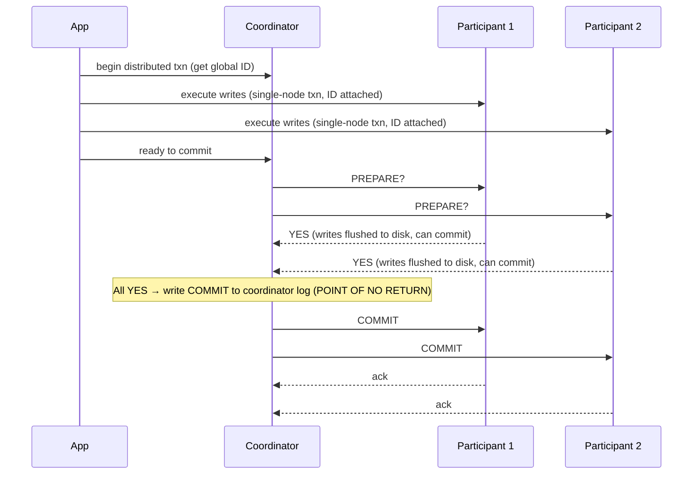
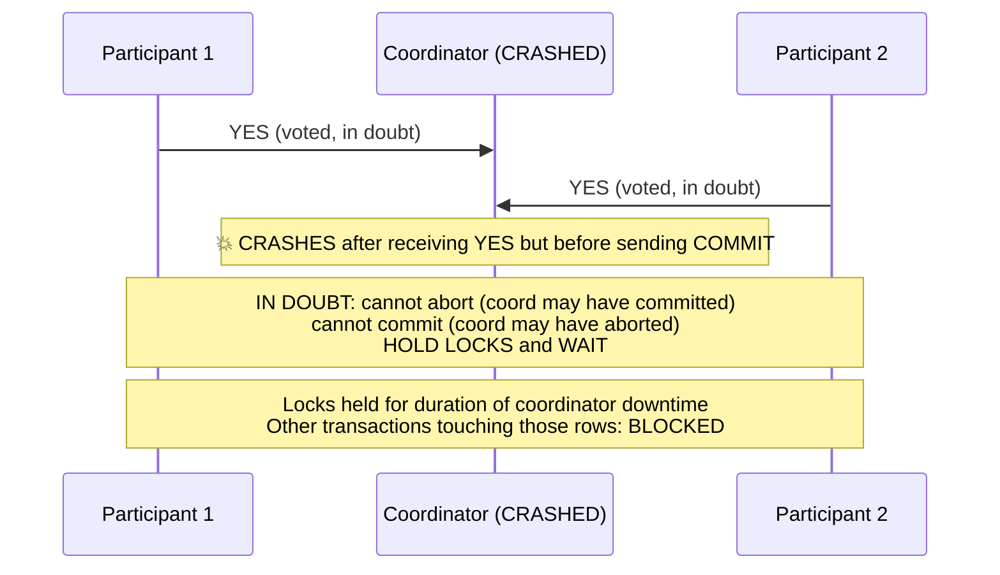
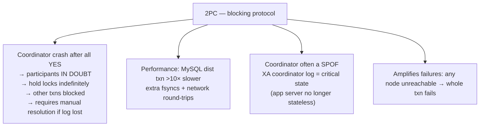

# Two-Phase Commit (2PC) & Distributed Transactions

**Prerequisites:** Topic 17 (transactions & ACID), Topic 19 (serializability), Topic 20 (unreliable networks)
**Difficulty:** Advanced
**Interview importance:** High
**Source:** Chapter 9 — "Atomic Commit and Two-Phase Commit", "Distributed Transactions in Practice"

---

## 1. What Is It?

**Two-phase commit (2PC)** is the standard algorithm for achieving **atomic commit across multiple nodes** — ensuring that either all participants commit a transaction or all abort, with no possibility of some committing while others abort.

**⚠️ Do not confuse with 2PL.** Two-phase *locking* (Topic 19) is for serializability; two-phase *commit* is for distributed atomicity. Same "two-phase" name, completely unrelated things. The book stresses this repeatedly.

2PC is used in distributed relational databases (internally), in XA transactions (the cross-technology standard), and via the Java Transaction API (JTA). It is the dominant solution to distributed atomic commit — and also a deeply flawed one, as this file explores.

---

## 2. Why Does It Exist?

A single-node commit is simple: atomically write the data and a commit record to disk; if the node crashes mid-way, the WAL tells you whether to commit or roll back on recovery. **One node decides atomically.**

**Distributed commit is harder** because naïvely sending a commit request to all nodes independently fails:

- Some nodes may encounter constraint violations or conflicts and need to abort while others are ready to commit.
- Commit requests may be lost in the network — some nodes commit, others time out and abort.
- Some nodes may crash before writing the commit record.

If some nodes commit and others abort, **the nodes become permanently inconsistent** — and once committed, a transaction cannot be retroactively aborted (other transactions have already read its data). For this reason, **a node must only commit once it is certain that all other nodes will also commit.**

2PC exists to enforce this cross-node "all commit or all abort" guarantee.

---

## 3. Simple Explanation

Two rounds of messages, two "points of no return":

**Phase 1 (Prepare):** the coordinator asks every participant "Can you commit?" Each participant writes all its changes to disk, checks for violations, and responds "yes" or "no." **Saying "yes" is a promise: you will commit if told to, you surrender the right to abort unilaterally.**

**Phase 2 (Commit/Abort):** if all said "yes," the coordinator writes "commit" to its log (the point of no return), then tells all participants to commit. If anyone said "no" (or timed out), the coordinator writes "abort" and tells all to abort.

The analogy from the book: a marriage ceremony. The minister (coordinator) asks bride and groom (participants) "Do you take this person?" Each must answer "I do" (yes). If both say "I do," the marriage is committed; the minister pronounces them married. If either says no — abort. Saying "I do" is the moment you surrender the right to abort.

---

## 4. Real-World Analogy

**A multi-party contract signing.** A lawyer (coordinator) prepares the contract and sends copies to all parties (participants). Each party reviews it and either signs (yes/prepared) or refuses (no/abort). If all parties have signed their copy, the lawyer officially registers the contract (commit point) and informs everyone it's binding. If any party refuses, the lawyer tears up all copies (abort). The point of no return is the registration — after that, the contract is law, even if a party later changes their mind.

The flaw: if the lawyer disappears after all parties have signed but before the registration, everyone is stuck — they've signed (promised), but the contract isn't official. They can't simply sign a new contract among themselves (that's not part of the protocol). They must wait for the lawyer to return or have a disaster recovery plan.

---

## 5. Technical Explanation

### Single-node atomic commit — why it's easy

On one node: write data to WAL, then write the commit record. The commit record is the atomic flip — before it's written, the transaction can still be aborted; after, it's committed. A crash after the commit record is written: the node commits on recovery. Before: it aborts. **One device, one decision point.**

### Why distributing this is hard

With multiple nodes, you can't just commit independently on each. The problems are:

- **Constraint violations:** a constraint check might fail on node 3 after nodes 1 and 2 have already committed — now you need to retroactively abort committed data, which violates the commit-is-irrevocable rule.
- **Lost messages:** commit message to node 2 arrives; to node 1 is lost and it times out and aborts.
- **Crash timing:** node 1 commits, node 3 crashes before committing and rolls back on recovery.

The result: **partially committed state across nodes** — some committed, some aborted. This is permanent inconsistency, because committed data is already visible to other transactions.

### Two-phase commit — step by step

**Setup:** a **coordinator** (transaction manager) manages the protocol. Participants are the database nodes touched by the transaction.

**Phase 1 — Prepare:**
1. Application requests a globally unique transaction ID from the coordinator.
2. Application runs the transaction on each participant (single-node transactions with that ID).
3. When ready to commit, coordinator sends a **prepare request** to all participants.
4. Each participant: writes all changes to disk (ensuring it *can* commit, even through a crash), checks all constraints. If it can commit → responds **"yes" (vote: commit)**, thereby **surrendering the right to abort unilaterally.** If it cannot → responds **"no" (vote: abort)**, and aborts its local transaction.

**Phase 2 — Commit or Abort:**
5. If **all voted "yes":** coordinator writes **commit decision to its log on disk** (the **commit point** — the point of no return), then sends commit request to all participants. **If any commit request fails or times out, the coordinator retries indefinitely until it succeeds.**
6. If **any voted "no" (or timed out):** coordinator writes abort decision to its log, sends abort to all.

**Two irrevocable commitments:**
- A participant that votes "yes" **cannot abort** — it must commit when the coordinator says so, no matter what. (It can crash and recover from its log, but it will commit on recovery.)
- Once the coordinator writes its commit decision, **there is no going back.** Even if it crashes, on recovery it reads its log and continues retrying commits.

**Why phase 1 before phase 2?** Because phase 1 collects all promises before anyone commits. The coordinator only commits once it knows everyone is ready — so the decision is safe.

### Coordinator failure — the fundamental problem with 2PC

**Before prepare requests are sent:** if the coordinator fails, participants can safely abort. Nothing has happened yet.

**After a participant has voted "yes" but before the coordinator's decision arrives:** the participant is **in doubt** (uncertain). It cannot:
- Abort unilaterally — the coordinator may have committed (and other nodes may have committed based on that).
- Commit unilaterally — the coordinator may have aborted.

The participant must wait for the coordinator. If the coordinator is down, **it may wait for minutes, hours, or forever.** This is 2PC's defining problem: it is a **blocking protocol.** The participant holds its locks (preventing other transactions from modifying those rows) for the entire duration of the uncertainty.

**What happens to locks while in doubt?** A 2PC transaction holds row-level locks (from isolation) until it commits or aborts. While in doubt, those locks are held. The coordinator's crash can hold those locks for the duration of the coordinator's downtime — potentially minutes. If the coordinator's log is lost, those locks are held until **manual intervention by an administrator.**

This means a coordinator crash can make large parts of the application unavailable — not just for the transaction itself, but for any other transaction that wants to read or write those rows.

### Coordinator recovery

When the coordinator restarts, it reads its log:
- Transactions with a commit record in the log → send commit to all participants (retry until acknowledged).
- Transactions without a commit record → abort (participants that voted "yes" are also told to abort).

The commit point is a **single-node atomic commit on the coordinator** — which is why the coordinator's log is critical, and why 2PC merely pushes the "one atomic decision point" problem up from the database to the coordinator.

### Three-phase commit (3PC) — why it doesn't help in practice

3PC is a nonblocking variant that avoids the "in-doubt wait" problem. But it assumes **bounded network delays and bounded response times.** In real systems (Topic 20: unbounded network delay, process pauses), it cannot guarantee atomicity — a timeout during 3PC might indicate a slow node, not a dead one, and acting on that wrong guess breaks atomicity. 3PC is theoretically interesting but practically unused; **2PC persists despite its flaw, because correctly handling the "in-doubt" case requires something that correctly detects failure — which requires a perfect failure detector, which requires bounded delays, which we don't have.**

### Distributed transactions in practice

Two types:

1. **Database-internal transactions** (e.g., distributed transactions within a VoltDB or MySQL Cluster cluster): all participants are the same database system, so the protocol can be optimized, and SSI-style conflict detection is possible. These work reasonably well.

2. **Heterogeneous distributed transactions** (XA): across different technologies (e.g., a database AND a message broker). The **XA standard** (eXtended Architecture, 1991) defines a C API for a transaction coordinator to call participants across different technology stacks. XA is supported by PostgreSQL, MySQL, DB2, SQL Server, Oracle, ActiveMQ, IBM MQ, and others. Java exposes it via JTA (Java Transaction API) + JMS/JDBC.

**XA limitations:**
- **Lowest common denominator:** must work across all technologies, so it can't detect deadlocks across different systems (no standardized protocol for cross-system lock information), and doesn't work with SSI.
- **Coordinator is embedded in the application server:** the coordinator is usually a library in the application process. If the application crashes, the coordinator's log (and all in-doubt transactions) goes with it. Those participants are now stuck holding their locks until the application is restarted and the coordinator reads its log. **The application server is no longer stateless** — its coordinator log is now critical durable state, as important as the database.
- **Coordinator is usually a single point of failure:** many coordinator implementations are not highly available.
- **Performance:** distributed transactions in MySQL are reported to be >10× slower than single-node transactions. The overhead comes from additional fsync (write durability) requirements and extra network round-trips.

**Amplifying failures:** 2PC requires all participants to respond. If any part of the system is broken, the entire transaction fails. This **amplifies failures** — a single unreachable node blocks the whole transaction. This runs counter to the goal of fault-tolerant systems.

**Heuristic decisions (emergency escapes):** some XA implementations allow a participant to unilaterally commit or abort an in-doubt transaction (without coordinator authorization). The book is blunt: *"heuristic" here is a euphemism for "probably breaking atomicity."* These exist only for catastrophic situations (e.g., the only way to release locks during a production outage), not regular use.

### The alternative

2PC's problems are real enough that many distributed systems avoid it. The book's direction (Chapters 11–12): **idempotent operations, event logs, compensating transactions, and exactly-once message processing** can achieve the *effects* of distributed transactions without the blocking/locking/coordinator-SPOF hazards. We'll get there in Part III.

---

## 6. Diagrams







---

## 7. Concrete Example

**Billing platform: charge a customer and record the invoice, spanning a payments DB and an orders DB.**

The transaction: debit the customer's balance in the payments DB partition A, and insert an invoice record in the orders DB partition B. Both must happen or neither.

- **Without 2PC (independent commits):** the application commits to partition A successfully; the commit message to partition B is lost in a network blip. Result: money debited, no invoice. Permanently inconsistent, no error surfaced.
- **With 2PC:** coordinator prepares both. A says "yes" (writes durably). B says "yes." Coordinator writes commit to its log. Sends commit to both. If the commit to B is temporarily lost, the coordinator retries — B will commit. Atomicity guaranteed.
- **Coordinator failure mid-commit:** coordinator crashes after A commits but before B gets the commit message. B is now in doubt. B holds row-level locks on the invoice table, blocking other invoice operations. The on-call engineer must restart the coordinator, which reads its log, finds a commit decision, and retries sending commit to B. This may take minutes. During those minutes, parts of the billing service are unavailable.

This example captures the real tension: 2PC gives you the guarantee (A and B are consistent) at the cost of the coordinator being a single point of failure that can hold up your entire system.

---

## 8. When to Use / Not Use

**Use 2PC when:** you genuinely need atomic commit across multiple nodes or systems; you can tolerate the performance cost; your workload tolerates the coordinator SPOF risk (or you've mitigated it with HA coordinator); you need cross-system atomicity (database + message broker together).

**Avoid 2PC when:** you can design operations to be single-partition (best option); you can use idempotent operations with at-least-once delivery and deduplication (Part III); the performance cost is unacceptable; the coordinator SPOF is unacceptable; you're crossing heterogeneous systems and XA's lowest-common-denominator limitations bite you.

---

## 9. Advantages & Disadvantages

**Advantages**
- Provides true atomic commit across multiple nodes/systems — no partial commits.
- Well-established, widely implemented (XA, JTA, internal DB protocols).
- Enables exactly-once message processing when combined with message broker + database.

**Disadvantages**
- **Blocking:** coordinator failure leaves participants in doubt indefinitely, holding locks.
- **Performance:** 10× slower in practice (MySQL benchmark); extra fsyncs and network RTTs.
- **Coordinator is SPOF** (unless replicated — many implementations aren't by default).
- **Amplifies failures:** any participant unreachable → whole transaction fails.
- **XA limitations:** lowest-common-denominator, no cross-system SSI, no cross-system deadlock detection.
- **Heuristic decisions** (emergency exits) break atomicity.
- **Application servers become stateful** when the coordinator log is embedded in them.

---

## 10. Trade-off Table

| Aspect | 2PC | Alternative (idempotent + at-least-once + dedup) |
|---|---|---|
| Correctness | Atomic on all-or-nothing (blocking) | Eventual consistency + compensation |
| Performance | >10× slower (extra fsyncs, round-trips) | Much faster (no distributed coordination) |
| Blocking | Yes (coordinator failure blocks) | No |
| Coordinator | Required, often SPOF | Not needed |
| Cross-system | XA (broad support, limited) | Per-system idempotence + dedup |
| Operational complexity | High (coordinator state, manual resolution) | Medium (idempotency key management) |

| 2PC vs 2PL | Meaning | Different? |
|---|---|---|
| 2PL (two-phase locking) | Serializability | YES — completely unrelated |
| 2PC (two-phase commit) | Distributed atomic commit | YES — completely unrelated |

---

## 11. Failure Scenarios

| Scenario | 2PC consequence | Handling |
|---|---|---|
| Participant crashes during Phase 1 | Coordinator can abort (no "yes" received) | Abort, retry from scratch |
| Participant crashes after voting "yes" | Must commit when it recovers (promised) | Recover from its own WAL; coordinator retries commit |
| Coordinator crashes before Phase 2 | Participants IN DOUBT; hold locks; wait | Restart coordinator; it reads log and retries |
| Coordinator log lost | In-doubt transactions stuck forever | Manual resolution; heuristic decision as last resort |
| Network partition during Phase 2 | Coordinator retries until it reaches participant | May hold locks for partition duration |
| All participants crash and recover | Each reads its own log; coordinator retries | Eventually resolves |
| Heuristic decision | Atomicity violated | Only in catastrophic emergencies |

---

## 12. Production Considerations

- **Design to stay single-partition.** 2PC is the last resort, not the first tool.
- **Replicate the coordinator.** Many 2PC coordinator implementations are not HA by default. A crashed coordinator blocks the entire cluster until manual intervention.
- **Treat coordinator logs as first-class critical state.** If it's embedded in the application server, the application server is no longer stateless — its logs must be backed up and recoverable.
- **Monitor in-doubt transactions.** Set up alerting; don't wait for a lock buildup to discover them.
- **Test coordinator failure regularly.** Kill the coordinator and confirm participants are stuck, coordinator recovers and resolves, and you know the manual resolution process.
- **Avoid XA for new systems** where possible. Use database-internal distributed transactions (if the same DB system), or redesign for idempotent operations + at-least-once delivery.
- **Prefer idempotent + deduplication** for message processing over XA, since it's faster, doesn't block, and doesn't require cross-technology 2PC.

---

## ❌ 13. Common Mistakes

- **Confusing 2PC with 2PL.** Different acronyms, completely different things. 2PL = serializability (locking). 2PC = distributed atomic commit.
- **Using 2PC as the default solution for cross-partition operations.** Often, designing the partition key to keep operations single-partition is better.
- **Not replicating the coordinator** — a single coordinator failure blocks the entire application.
- **Not treating coordinator state as critical durable state** — losing the coordinator log means manual intervention to resolve stuck transactions.
- **Relying on heuristic decisions** as a normal operation, not an emergency escape — they break atomicity.
- **Not testing coordinator failure recovery** — it's the scenario that causes the most pain in production.
- **Assuming 3PC solves the blocking problem** — it requires bounded network delays, which you don't have.

---

## 🧠 14. Think Like an Engineer

```
Do I need ALL these nodes to commit or ALL abort (no partial)?
   no → single-partition design or idempotent + dedup
   yes → consider 2PC, but count the costs:
        ↓
Is the coordinator replicated and its log backed up?
   (if not, coordinator failure blocks the cluster)
        ↓
Can I tolerate the 10× performance cost?
   (extra fsyncs + network RTTs)
        ↓
Is any participant heterogeneous (different technology)? → XA
   (lowest-common-denominator: no SSI, no cross-system deadlock detection)
        ↓
What is my manual resolution process for in-doubt transactions?
   (coordinator log lost → manual intervention required)
        ↓
Would idempotent operations + at-least-once + deduplication achieve the same outcome?
   (usually yes, and much cheaper — see Part III)
```

---

## 15. Mental Model

```
Single-node commit: one atomic flip (commit record to disk). Simple.
      ↓
Distributed commit: can't just commit independently (some commit, some abort → inconsistent)
      ↓
2PC: Phase 1 = everyone promises (votes yes, surrenders right to abort)
     Phase 2 = coordinator decides (writes commit/abort to log = POINT OF NO RETURN)
               then tells everyone
      ↓
Coordinator failure after all YES but before Phase 2 → participants IN DOUBT:
   cannot commit, cannot abort, HOLD LOCKS, wait forever
      ↓
2PC is BLOCKING — this is the defining flaw
3PC requires bounded delays (we don't have them)
Alternative: idempotent + at-least-once + dedup (Part III)
```

---

## 🔗 16. How This Connects to Other Concepts

- **Transactions & ACID (Topic 17)** — 2PC extends atomicity to multiple nodes; the same "abort = retry cleanly" model.
- **Serializability / 2PL (Topic 19)** — 2PL and 2PC are unrelated; 2PL provides isolation within a node, 2PC provides atomicity across nodes; combined in distributed serializable systems.
- **Unreliable Networks (Topic 20)** — coordinator failure and participant blocking are the network-uncertainty problem at the commit protocol level.
- **Ordering & Causality (Topic 24)** — total order broadcast is equivalent to consensus; 2PC is a weak consensus algorithm (blocking), while Raft/Paxos are fault-tolerant.
- **Consensus (Topic 26)** — 2PC is a consensus variant but not fault-tolerant (blocks on coordinator failure); Raft/Paxos fix this by using a majority quorum.
- **Messaging & CDC (Topics 30–31)** — the Part III alternative to 2PC: idempotent message processing, at-least-once with deduplication.

---

## 17. Interview Questions & Answers

**Beginner**

**Q: What problem does two-phase commit solve?**
The problem of atomically committing a transaction across multiple nodes. If you just send independent commit requests to each node, some might succeed and others fail — leaving the system permanently inconsistent, since you can't retroactively abort a committed transaction. 2PC ensures all nodes commit or all abort by using a coordinator that collects votes before deciding, and by making the commit decision irrevocable once it's written to the coordinator's log.

**Q: What are the two phases?**
Phase 1 is prepare: the coordinator asks every participant "can you commit?" Each participant writes its changes durably to disk, checks for violations, and responds yes or no. Saying yes is a binding promise — the participant surrenders the right to abort unilaterally. Phase 2 is commit or abort: if all said yes, the coordinator writes "commit" to its own log (the point of no return) and tells all participants to commit; if any said no, it aborts. If any commit or abort message is lost, the coordinator retries indefinitely.

**Intermediate**

**Q: What is the "in-doubt" problem in 2PC?**
If the coordinator crashes after collecting all "yes" votes but before its phase 2 commit decision reaches the participants, those participants are stuck in doubt: they've promised to commit (they can't unilaterally abort) but haven't heard the decision (they can't unilaterally commit). So they hold their row-level locks and wait. If the coordinator takes 20 minutes to restart, those locks are held for 20 minutes, blocking any other transaction that needs those rows. If the coordinator's log is lost, the administrator must manually determine the outcome and force it on each participant. This is 2PC's fundamental flaw — it's a blocking protocol.

**Q: Why doesn't three-phase commit fix the blocking problem?**
Because 3PC assumes bounded network delays and bounded processing time — guarantees that real systems don't provide. With unbounded delays and process pauses (GC, VM suspension), 3PC can misinterpret a slow node as a failed one and proceed, breaking atomicity. A nonblocking atomic commit protocol fundamentally requires a perfect failure detector, which requires bounded delays, which we don't have. So 3PC remains theoretical for practical systems.

**Q: What makes XA transactions specifically limited?**
XA is a standard designed to work across heterogeneous technologies, so it's necessarily the lowest common denominator. It can't detect deadlocks across different systems because there's no standard protocol for sharing lock information. It doesn't work with serializable snapshot isolation because there's no cross-system protocol for conflict detection. The coordinator is usually embedded in the application process, which means its log becomes critical durable state and the application server is no longer stateless — and the coordinator is often a single point of failure that many implementations don't replicate. Plus the performance cost from additional disk flushes and network round-trips.

**Advanced / Staff**

**Q: We're building a payments service that must atomically update a customer balance in one database partition and publish an event to Kafka. Would you use 2PC?**
I'd avoid it if at all possible. Cross-system XA transactions that span a relational database and Kafka are supported but carry all the XA limitations — the coordinator becomes a single point of failure, and Kafka's support for transactions is its own implementation that may not interact well with database XA. More practically, the pattern I'd reach for first is the transactional outbox: write the balance update and a corresponding "event to be published" record to the database in a single local transaction (no 2PC needed). A separate process reads the outbox table — or better, uses change data capture on the database's write-ahead log — and publishes to Kafka. Because publishing is idempotent and at-least-once, any retry is safe. This gives you the effective atomicity you need without the coordinator, without the blocking, and without the 10× performance hit. If I genuinely needed atomic cross-system commits (both the balance and the Kafka publish must be atomic, no outbox retry acceptable), I'd look at whether the database supports its own exactly-once semantics with Kafka's transactional API, which is a narrower, more optimized form than generic XA. But the outbox pattern eliminates the need in most real cases.

**Q: You mention 2PC is "a kind of consensus algorithm — but not a very good one." What does that mean?**
Every commit decision is a form of consensus: all participants must agree, and the decision is final. But 2PC has a critical weakness that good consensus algorithms (Raft, Paxos, ZooKeeper's Zab) don't: it requires the coordinator to be available. If the coordinator fails, the protocol blocks. Fault-tolerant consensus algorithms use a majority quorum instead — they can make progress as long as more than half the nodes are alive, because any majority overlaps with any previous majority and can reconstruct the prior state. 2PC requires all participants, so any single failure blocks everything. And 2PC's coordinator is typically a single node, making it a SPOF. Raft and Paxos elect a new leader from the remaining majority and continue. So 2PC buys you distributed atomicity but gives it back in coordinator availability — not a good trade for a highly-available system.

---

## 🎯 30-Second Interview Answer

> "Two-phase commit solves the problem of atomically committing across multiple nodes — some committing while others abort leaves permanent inconsistency, which you can't fix after the fact. The algorithm: a coordinator sends prepare to all participants, collects their votes, and if all say yes, writes 'commit' to its log — the point of no return — then tells everyone to commit. Saying yes is an irrevocable promise to commit if asked. The fatal flaw is the in-doubt problem: if the coordinator crashes after collecting all yes votes but before its decision reaches participants, they hold their locks and wait forever — 2PC is a blocking protocol. 3PC theoretically fixes this but requires bounded network delays, which we don't have. In practice, the coordinator is often an unplicated SPOF, XA has lowest-common-denominator limitations, and MySQL distributed transactions are over ten times slower. And importantly, don't confuse 2PC with 2PL — two-phase locking gives you serializability inside a node; two-phase commit gives you atomicity across nodes. Completely different things."

---

## ⚡ Quick Revision

- **2PC ≠ 2PL.** 2PL = serializability (isolation). 2PC = distributed atomic commit. **Completely different things.**
- **Problem it solves:** atomic commit across nodes (all commit or all abort). Independent commits risk "some committed, some aborted" → permanent inconsistency.
- **Two points of no return:**
  - Participant votes **"yes"** → surrenders right to abort unilaterally.
  - Coordinator writes **commit to its log** → decision is irrevocable; retries until all commit.
- **Phase 1:** coordinator → all: PREPARE? Each participant: writes to disk, checks constraints → YES/NO.
- **Phase 2:** all YES → coordinator writes commit, sends COMMIT; any NO → writes abort, sends ABORT. Retries if messages fail.
- **The flaw: IN-DOUBT problem.** Coordinator crashes after all YES but before Phase 2 reaches participants → participants cannot commit OR abort (holds locks, wait forever). **2PC is BLOCKING.**
- **Locks held while in doubt** → other transactions blocked → application unavailable for coordinator downtime.
- **3PC:** nonblocking in theory, requires bounded delays → **doesn't work in practice.**
- **XA:** cross-technology standard. Coordinator embedded in app server (now stateful), often SPOF, lowest-common-denominator, 10× slower.
- **Heuristic decisions** = emergency escape = **breaks atomicity.**
- **Alternative:** idempotent + at-least-once + dedup / transactional outbox (Part III).
- **2PC is weak consensus** — blocks on coordinator failure; Raft/Paxos use majority quorum, don't block.
