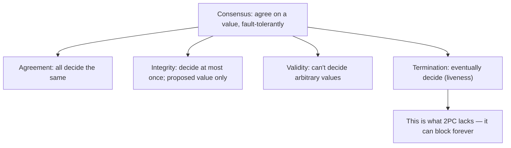
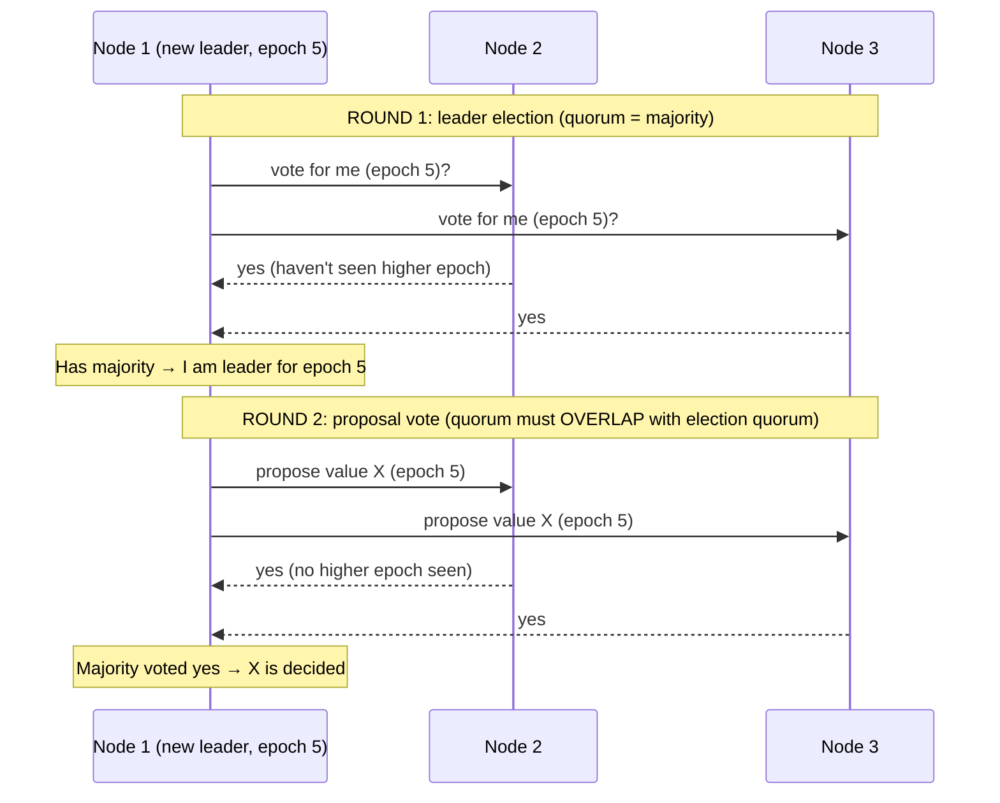
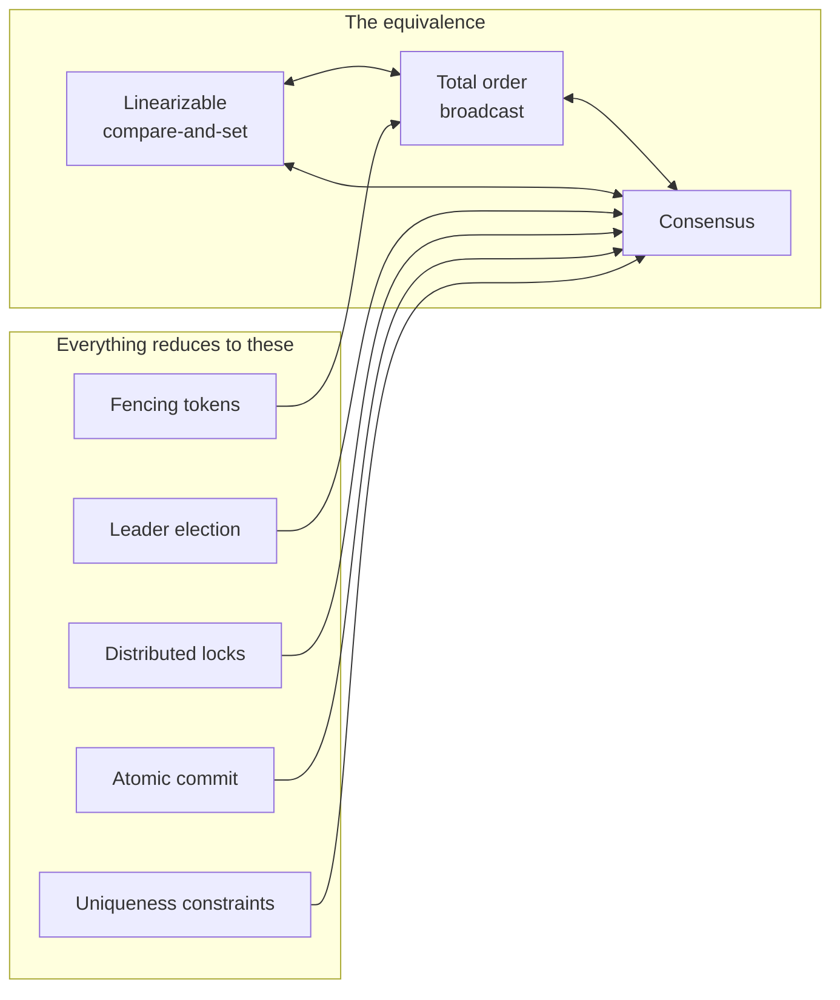

# Fault-Tolerant Consensus

**Prerequisites:** Topics 22 (truth/fencing), 24 (total order broadcast), 25 (2PC)
**Difficulty:** Advanced
**Interview importance:** ⭐ **Critical** — the intellectual climax of Part II
**Source:** Chapter 9 — "Fault-Tolerant Consensus", "Membership and Coordination Services"

---

## 1. What Is It?

**Consensus** is getting several nodes to agree on a value, in a fault-tolerant way.

Formally, a consensus algorithm satisfies four properties:
- **Agreement:** every node that decides, decides the same value.
- **Integrity:** no node decides twice; a decided value must have been proposed by some node.
- **Validity:** if all nodes propose the same value, that value is decided.
- **Termination:** every node that has not crashed eventually decides some value (the liveness / fault-tolerance property).

2PC (Topic 25) satisfies Agreement, Integrity, and Validity — but **not Termination**, because it blocks when the coordinator fails. Fault-tolerant consensus algorithms (Paxos, Raft, Zab, Viewstamped Replication) satisfy all four.

The reason this topic appears late in the book: you need replication, transactions, system models, linearizability, and total order broadcast as prerequisites to appreciate what consensus is actually solving and why it's hard.

---

## 2. Why Does It Exist?

The entire architecture of Part II has been building to this. Everywhere the book has said "the system must agree on X" — who is the leader, who holds the lock, which value was committed, what happened first — it was describing consensus in disguise.

Problems that reduce to consensus:
- **Leader election** (split-brain prevention — Topic 10): who is the one true leader?
- **Atomic commit** (2PC — Topic 25): should this distributed transaction commit or abort?
- **Distributed locks** (Topic 22): who holds the lock?
- **Uniqueness constraints** (Topic 23): who got the username?
- **Fencing tokens** (Topic 22): what is the authoritative current token value?
- **Total order broadcast** (Topic 24): what is the next message in the global log?

The book's striking insight: **all of these are the same problem.** Solve consensus, and you have a general solution to all of them. This is not just organizational tidiness — it's a mathematical equivalence. A linearizable compare-and-set register, total order broadcast, and consensus are all provably equivalent; each can be built from the others.

2PC provided atomicity but blocked on coordinator failure. Fault-tolerant consensus provides atomicity *and* keeps making progress as long as a **majority** of nodes are alive.

---

## 3. Simple Explanation

**The idea in one sentence:** use a majority vote — because any two majorities must share at least one node, there can never be two conflicting decisions.

**Epoch numbers:** each "era" of leadership gets a monotonically increasing epoch number. If two leaders ever conflict, the one with the higher epoch number wins. So a resurrected old leader with a lower epoch number cannot override the current leader.

**Two rounds of votes:** (1) vote for a leader; (2) vote on the leader's proposals. **The quorums for these two votes must overlap.** This overlap guarantees: if a proposal passes, at least one node in the second vote was also in the first vote (the leader election), so that node knows the current epoch, and would not have voted for a leader with a lower epoch.

**How it differs from 2PC:** 2PC requires all participants to say yes; consensus only requires a majority. 2PC's coordinator is not elected; a consensus leader is. 2PC blocks when the coordinator fails; consensus elects a new leader from the remaining majority and continues.

---

## 4. Real-World Analogy

**A parliament electing a prime minister and passing bills.**

- Each election cycle is an epoch — "Parliament #42."
- A PM is elected by majority vote (first round).
- Any bill the PM wants to pass must also get a majority vote (second round).
- The two majorities must overlap — at least one MP voted for this PM *and* is being asked to pass the bill. So if a new PM were somehow elected simultaneously (a constitutional crisis), at least one MP would know about both elections and would not approve the new PM's conflicting bill.
- If the PM resigns or dies, parliament calls an election (#43), the remaining MPs elect a new PM with a higher epoch number, and that new PM's bills supersede the old PM's proposals. The old PM, even if they recover, loses — their epoch is lower.
- **Unlike 2PC (a one-person coordinator):** losing the PM doesn't block everything — parliament still has a majority of members and can elect a new PM and continue passing bills.

---

## 5. Technical Explanation

### The formal properties

- **Agreement:** all nodes decide the same outcome (no split decisions).
- **Integrity:** a node decides at most once; the decided value must have been proposed (no fabrication).
- **Validity:** a trivial algorithm that always decides "null" satisfies agreement and integrity, but not validity. Validity rules out nonsense.
- **Termination** (liveness): the algorithm cannot stall forever — some node must eventually decide. This is what distinguishes fault-tolerant consensus from 2PC: 2PC can stall forever when the coordinator fails.

**FLP impossibility:** Fischer, Lynch, and Paterson proved in 1985 that in a purely asynchronous system (no clocks, no timeouts), no deterministic consensus algorithm can guarantee termination even if only one node can crash. This sounds alarming. But real systems use timeouts and randomization, which break the assumptions. Practical consensus algorithms (Raft, Paxos) work by being allowed to suspect nodes via timeouts — the suspicion may be wrong (false positives), but it doesn't break safety; it only delays liveness. Thus consensus is solvable in practice.

### Consensus algorithms and total order broadcast

The best-known fault-tolerant consensus algorithms: **Paxos** (Lamport), **Multi-Paxos**, **Raft** (Ongaro & Ousterhout), **Zab** (ZooKeeper Atomic Broadcast), **Viewstamped Replication** (Liskov & Cowling).

Importantly, most of these don't implement the "propose one value, decide once" formalism directly. They implement **total order broadcast** — deciding on a *sequence* of values. Total order broadcast = repeated rounds of consensus (each round decides the next message in the log). Due to the four properties, total order broadcast delivers the same messages in the same order to all nodes, with no duplicates, no fabrication, and no permanent loss.

**Total order broadcast implements all of:**
- **Database replication:** every write is a message in the log; replicas apply them in the same order → consistent.
- **Serializable transactions:** deterministic stored procedures applied in the same order → serializable (actual serial execution model).
- **Linearizable storage:** by log-ordering compare-and-set operations (Topic 24).
- **Fencing tokens:** the log sequence number is monotonically increasing, making it a perfect fencing token (ZooKeeper's `zxid`).
- **Leader election:** the first to successfully append "I am leader" to the log wins.

### The chicken-and-egg problem — and the solution

An apparent paradox: to have single-leader replication, you need a leader; to elect a leader, you need consensus; to run consensus, you need a leader. Circular dependency.

The resolution: consensus algorithms use a **weaker leadership guarantee** than single-leader replication. They don't guarantee the leader is unique at all times — they guarantee uniqueness *within each epoch.* Every time the current leader is suspected of failure, a **new epoch number** (ballot number in Paxos, term number in Raft, view number in VR) is issued via a leader election. Epoch numbers are monotonically increasing. If two leaders exist (one from an old epoch, one from the new), the higher epoch wins.

**Two rounds of quorum voting:**

1. **Leader election vote:** a candidate proposes itself; nodes vote for it if they haven't voted for a higher epoch. The winner gets a majority.
2. **Proposal vote:** the new leader proposes a value (e.g., the next message to deliver); nodes vote to accept it if they haven't seen a higher epoch leader. The proposal is decided if a majority vote yes.

**The critical overlap:** the quorum for the election and the quorum for the proposal must intersect in at least one node. So at least one node that voted for the current leader also votes on the proposal — this node knows the current epoch and will reject any proposal from a lower-epoch leader. This ensures no two concurrent leaders can both get proposals accepted.

**Before deciding, a leader must verify no higher-epoch leader exists:** it asks a quorum "do you know of a higher epoch?" If none does, the leader knows it's safe to proceed. It's not just voting for the proposal — it's checking that no election happened in the meantime. Exactly the fencing logic from Topic 22, now embedded in the protocol itself.

### How this differs from 2PC — key distinctions

| Dimension | 2PC | Fault-tolerant consensus (Raft/Paxos) |
|---|---|---|
| Requires all participants? | **Yes** — any one failure stalls | **No** — majority suffices |
| Coordinator elected? | No — hardcoded / external | Yes — via epoch election |
| Blocks on coordinator failure? | **Yes** — indefinitely | No — new leader elected |
| Recovery on new leader | No defined recovery | Yes — safe recovery process |
| Safety on coordinator failure | May violate termination | Safety always preserved |
| Good consensus algorithm? | No ("not a very good one") | Yes |

### Limitations of consensus

Consensus is powerful but not free:

1. **Requires a strict majority.** Minimum 3 nodes to tolerate 1 failure (2 of 3 = majority), 5 to tolerate 2. A network partition that isolates a minority half blocks that half permanently (it can't make progress without a majority).

2. **Fixed membership is the simple case.** Adding or removing nodes requires **dynamic membership** (Raft joint consensus, etc.) — much harder to implement correctly. Most discussions assume a fixed node set.

3. **Performance cost.** Every proposal requires a round of voting (network round-trips). Consensus is like synchronous replication — it's waiting for a quorum before committing. Many databases use async replication for performance, at the cost of potential data loss on failover. With consensus, you don't lose committed data, but you pay the latency.

4. **Leader election thrashing under variable network delays.** Consensus algorithms use timeouts to detect failed leaders. Under high network jitter (especially in geographically distributed systems), nodes may falsely believe the leader has failed and trigger elections. Repeated elections are expensive and produce no useful work. Raft has known edge cases where a particular unreliable link can cause leadership to bounce continuously.

5. **FLP in fully async systems.** Not relevant in practice (timeouts fix it), but important theoretically: consensus is provably impossible in a fully asynchronous, deterministic model even with one possible crash.

### ZooKeeper and etcd — consensus-as-a-service

Because implementing consensus correctly is extremely hard (a "poor success record" outside of specialists), most applications don't implement it directly. Instead, they use **ZooKeeper** (uses Zab — ZooKeeper Atomic Broadcast) or **etcd** (uses Raft) as coordination services.

ZooKeeper/etcd provide:
- **Linearizable atomic operations** (compare-and-set, atomic increment-and-get)
- **Total order of operations** (every write gets a `zxid` / Raft index)
- **Failure detection via sessions and ephemeral nodes:** a client's session has a timeout; if the client dies (stops sending heartbeats), its ephemeral nodes are automatically deleted. Other nodes are notified (watches). This provides distributed failure detection without a centralized authority.
- **Watch notifications:** nodes can subscribe to changes on a key; they're notified when the value changes. This is how ZooKeeper-based leader election works — clients watch the current leader's ephemeral node and are notified when it disappears (leader died → trigger election).
- **Service discovery:** when a service starts, it registers its endpoint in ZooKeeper; clients look it up there.
- **Membership services:** ZooKeeper can maintain the authoritative list of which nodes are alive, combining failure detection with consensus ("node X is declared dead" is agreed upon by the cluster, even if X disagrees).

ZooKeeper runs on a **fixed small cluster** (3 or 5 nodes) and performs majority votes among those nodes, while supporting **many clients** — it "outsources" coordination to a small specialist cluster so the main application doesn't have to implement consensus.

**ZooKeeper is not a general-purpose database:** it holds small amounts of data (configuration, cluster state — things that change on a timescale of minutes or hours, not millions of times per second). Its consensus-backed storage is only for coordination state. Application runtime state belongs elsewhere.

### What uses ZooKeeper in practice

**HBase, Kafka, Hadoop YARN, OpenStack Nova** — all rely on ZooKeeper. Use cases:
- **Leader election:** each candidate creates an ephemeral ZooKeeper node; the one that succeeds first (compare-and-set) is the leader; others watch and take over when it dies.
- **Partition assignment:** which node owns which partition is stored in ZooKeeper; reassignment after failure triggers a watch and rebalancing.
- **Fencing tokens:** ZooKeeper's `zxid` is the monotonically increasing token; Kafka's partition leader check validates the token before accepting writes.
- **Configuration distribution:** cluster-wide configuration stored in ZooKeeper is read by all nodes; a watch fires when it changes.

### The full map of equivalences

The book closes Chapter 9 with this insight:

> Linearizable compare-and-set ≡ Total order broadcast ≡ Consensus

All three are equivalent. If you can implement any one, you can implement the others. ZooKeeper (Zab) and etcd (Raft) implement all three, and everything — distributed locks, leader election, uniqueness constraints, exactly-once processing — builds on top.

This is the payoff of the entire Part II: every hard distributed systems problem, from failover to write conflicts to uniqueness, is really the consensus problem in disguise. Now you have a tool that solves it.

---

## 6. Diagrams







---

## 7. Concrete Example

**Kafka's leader election for partition leadership.**

Kafka uses ZooKeeper (and more recently its own KRaft, a Raft implementation) for partition leadership. For each partition, one broker is the leader (accepts all writes); followers replicate. If the leader broker dies, ZooKeeper detects it (the broker's ephemeral node is deleted when its session times out), and the watchers (Kafka controller) are notified. The controller runs a leader election: it picks the new leader from the in-sync replicas and updates ZooKeeper atomically (compare-and-set to claim the leadership znode). All brokers watching that znode are notified, and the new leader begins accepting writes. The ZooKeeper `zxid` from this operation becomes the fencing token — any message from the old leader with a lower `zxid` is rejected.

This sequence — ephemeral nodes for failure detection, watches for notification, compare-and-set for atomic election, `zxid` for fencing — is the textbook ZooKeeper-based consensus use case, and it illustrates all the concepts of this chapter in one practical flow.

---

## 8. When to Use / Not Use

**Use consensus (via ZooKeeper/etcd) when:**
- Leader election / distributed locking.
- Uniqueness constraints that must be enforced in real-time.
- Fencing tokens for authority enforcement.
- Configuration that all nodes must agree on.
- Any "only one of something" problem.

**Do not use it for:**
- Storing high-volume application runtime data — consensus has throughput limits and is not a general-purpose database.
- Situations where eventual consistency is sufficient — consensus adds latency and coordination costs.
- Cross-system distributed transactions — 2PC (with all its limitations) or idempotent + at-least-once is usually better.

**Do not implement consensus yourself** — even expert teams have high failure rates. Use ZooKeeper, etcd, or Consul.

---

## 9. Advantages & Disadvantages

**Advantages**
- Safety properties (Agreement, Integrity, Validity) always hold, even during failures.
- Fault-tolerant: progress as long as a majority is alive (unlike 2PC which blocks).
- Provides total order broadcast → linearizable storage, leader election, distributed locks, fencing.
- Equivalent to a rich family of distributed primitives.
- ZooKeeper/etcd outsource this complexity to a small specialist cluster.

**Disadvantages**
- Requires a strict majority — partition blocking is structural.
- Fixed membership (dynamic membership is complex).
- Performance cost: synchronous quorum round-trip on every proposal.
- Leader election thrashing under network jitter; geographically distributed systems suffer.
- Sensitive to particular network problems (Raft edge cases with unreliable single links).
- Not suitable for high-throughput runtime data.

---

## 10. Trade-off Table

| Mechanism | Fault tolerance | Blocking? | Overhead | Use case |
|---|---|---|---|---|
| Single-node commit | Low (one node dies → done) | Never (no coordinator) | Minimal | Purely single-node |
| 2PC | None on coordinator failure | **Yes — indefinitely** | Medium | Cross-system atomicity (reluctantly) |
| Fault-tolerant consensus (Raft/Paxos/Zab) | Tolerates < half nodes failing | No (elects new leader) | Quorum round-trip | Leader election, locks, config, ordering |
| ZooKeeper (Zab) / etcd (Raft) | Yes (3/5 node cluster) | No | Small | Coordination-as-a-service |
| Async replication | Tolerates failures | No | Minimal | High throughput, accepts potential data loss |

---

## 11. Failure Scenarios

| Scenario | 2PC | Fault-tolerant consensus |
|---|---|---|
| Coordinator/leader crashes | **Blocks indefinitely** | Elects new leader (epoch++), continues |
| Minority partition | **All blocked** (can't reach all) | Majority continues; minority blocked (safety preserved) |
| Old leader returns | Split brain risk (no fencing in 2PC) | Lower epoch → rejected by quorum |
| Network jitter causes false leader detection | N/A | Spurious election (safe but slow); may thrash |
| All nodes crash | Nothing works | Nothing works (below majority threshold) |
| One node slow (GC pause) | All blocked if it's coordinator | Others form majority and continue |

---

## 12. Production Considerations

- **Run ZooKeeper/etcd on 3 or 5 nodes** (not 2, not 4 — odd numbers for clear majority with minimum overhead).
- **Never implement consensus yourself** unless you have published a peer-reviewed paper on it. Use ZooKeeper (Zab), etcd (Raft), or Consul.
- **ZooKeeper/etcd for coordination only**, not for application state — throughput is too low for high-volume data.
- **Use ephemeral nodes + watches** for failure detection and leader election in ZooKeeper.
- **Apache Curator** provides higher-level recipes (distributed locks, leader election) on top of ZooKeeper's raw API; use it rather than rolling your own.
- **Use `zxid` / Raft index as fencing tokens** — they're monotonically increasing by construction.
- **Monitor leader election frequency** — frequent elections indicate network problems or timeout misconfiguration.
- **Tune election timeouts** for your network characteristics — too short triggers spurious elections under jitter; too long slows recovery.
- **For geographically distributed clusters**, be aware that consensus latency is bounded by inter-region round-trip time — plan accordingly.

---

## ❌ 13. Common Mistakes

- **Implementing consensus yourself.** High failure rate, subtle edge cases, known hard. Use ZooKeeper/etcd.
- **Treating ZooKeeper as a general-purpose database.** It's for small, slow-changing coordination data only.
- **2-node ZooKeeper clusters.** No majority possible if one fails — the remaining node can't make progress alone. Use 3 or 5.
- **Confusing 2PC with consensus.** 2PC satisfies 3 of 4 consensus properties; it blocks because it lacks termination. Raft/Paxos satisfy all 4.
- **Assuming consensus is cheap.** A quorum round-trip on every write adds significant latency — it's essentially synchronous replication.
- **Not accounting for leader election thrashing.** Under network jitter, frequent elections can make the system effectively unavailable (more time electing than working).
- **Storing high-volume runtime data in ZooKeeper.** It's designed for slow-changing data (minutes/hours), not millions of writes per second.
- **Not using Curator or equivalent.** Raw ZooKeeper API is low-level; leader election recipes have subtle edge cases.

---

## 🧠 14. Think Like an Engineer

```
Do I need multiple nodes to AGREE on something (leader / lock / value)?
   → this is consensus
   → use ZooKeeper/etcd — don't implement it yourself
        ↓
Which consensus use case?
   Leader election → ephemeral nodes + watches (ZooKeeper/etcd)
   Distributed lock → ZooKeeper lock recipe (Curator) with fencing token
   Uniqueness constraint → linearizable CAS on ZooKeeper/etcd
   Fencing token → use the zxid / Raft index directly
   Config broadcast → store in ZooKeeper/etcd, watch for changes
        ↓
How many nodes?
   Tolerate 1 failure → 3 nodes (minimum)
   Tolerate 2 failures → 5 nodes
        ↓
Consensus is NOT for:
   High-throughput runtime data (use an actual database)
   Eventual-consistency workloads (consensus adds unnecessary cost)
   Cross-system distributed transactions (use idempotent + at-least-once)
        ↓
Remember: any two majorities overlap → one majority can't contradict another
   → safety always holds even under partition
   → only liveness (termination) requires > half alive
```

---

## 15. Mental Model

```
Consensus = "get nodes to agree, fault-tolerantly"
      ↓
Four properties: Agreement + Integrity + Validity (safety) + Termination (liveness)
2PC has the first three but NOT termination (blocks on coordinator failure)
      ↓
Key mechanism: epoch numbers + two overlapping majority votes
   Any two majorities share ≥1 node → no two decisions can conflict
   Higher epoch always wins → old leader can't override new one
      ↓
Total order broadcast ≡ Consensus ≡ Linearizable CAS
   All the same problem in different clothes
      ↓
ZooKeeper (Zab) / etcd (Raft) implement all of these
   → leader election, distributed locks, fencing, config, service discovery
   → small cluster (3/5 nodes), coordination only, not runtime data
      ↓
Don't implement consensus yourself.
```

---

## 🔗 16. How This Connects to Other Concepts

- **Single-Leader Replication (Topic 10)** — leader election IS consensus; manual failover "works" but doesn't satisfy termination (needs human). Auto-failover approaches consensus.
- **Truth & Fencing (Topic 22)** — quorum-based truth and fencing tokens are consensus primitives; ZooKeeper's `zxid` is the fencing token.
- **Linearizability (Topic 23)** — consensus algorithms provide linearizable operations; the CAP partition trade-off is encoded in the "majority must be reachable" requirement.
- **Ordering & Causality (Topic 24)** — total order broadcast ≡ consensus; the equivalence proven there is the heart of this topic.
- **Two-Phase Commit (Topic 25)** — the weak, blocking precursor; lacks termination; consensus is the non-blocking replacement.
- **Batch Processing / Stream Processing (Topics 27–32)** — Part III builds on these guarantees: exactly-once stream processing uses consensus-backed logs (Kafka with Raft).

---

## 17. Interview Questions & Answers

**Beginner**

**Q: What is consensus in distributed systems?**
Getting several nodes to agree on a value, in a fault-tolerant way. Formally it must satisfy: all nodes decide the same value (agreement), a node decides at most once on a proposed value (integrity), a trivial "always null" algorithm is ruled out (validity), and every non-crashed node eventually decides (termination — the fault-tolerance property). Leader election, distributed locks, atomic commit, and uniqueness constraints all reduce to consensus.

**Q: What's the difference between 2PC and fault-tolerant consensus?**
Both try to get nodes to agree, but 2PC blocks when the coordinator fails — it doesn't satisfy termination. It requires all participants to vote yes; losing even one stalls the protocol indefinitely. Fault-tolerant consensus algorithms like Raft and Paxos require only a majority vote, so they can continue as long as more than half the nodes are alive. When a leader fails, they elect a new leader from the remaining majority using an epoch number that increments monotonically, so the old leader's stale decisions are safely overridden.

**Intermediate**

**Q: How do epoch numbers prevent split-brain in consensus?**
Every leader is associated with a monotonically increasing epoch number. If two nodes both think they're leader — say because of a network partition — the one with the higher epoch wins. Before a leader can commit a proposal, it must get a majority to vote in favor, and those voters will reject any proposal from a lower-epoch leader. The key is that the quorums for leader election and proposal voting must overlap — at least one node in the proposal quorum also participated in electing the current leader, so it knows the current epoch and will refuse to vote for a stale leader's proposals.

**Q: What is ZooKeeper actually used for, and why does it use consensus?**
ZooKeeper provides coordination primitives: distributed locks, leader election, failure detection, service discovery, and configuration. These all require that all participants agree on the same state — who holds the lock, who is the leader, which nodes are alive. That agreement is consensus. ZooKeeper implements it via Zab (ZooKeeper Atomic Broadcast), which gives total order broadcast: all nodes see the same events in the same order. It runs on a small cluster (3 or 5 nodes) and serves many application clients, so you "outsource" the consensus problem to a specialist service rather than embedding it in every application. It's not for high-volume application data — it's for slow-changing coordination state like cluster membership or partition assignments.

**Q: What problems reduce to consensus?**
Leader election, distributed locking, atomic commit across nodes, uniqueness constraints (claiming a username is a compare-and-set which requires consensus), fencing token generation (the total-order log sequence number is the token), and total order broadcast itself. The deep insight is that linearizable compare-and-set, total order broadcast, and consensus are all provably equivalent — solve any one and you can build the others. ZooKeeper and etcd implement all three, which is why everything else builds on them.

**Advanced / Staff**

**Q: Walk me through how Kafka's partition leader election works using ZooKeeper, and identify each consensus primitive involved.**
When Kafka uses ZooKeeper for coordination, each broker creates an ephemeral node in ZooKeeper when it starts — ephemeral because ZooKeeper automatically deletes it when the broker's session expires, which happens when the broker dies or becomes unreachable. For each partition, there's a leadership path in ZooKeeper. The Kafka controller (itself elected via ZooKeeper) watches partition leadership nodes. When a leader broker's ephemeral node disappears, ZooKeeper fires a watch event to the controller. The controller then runs leader election: it selects from the in-sync replica list and performs a compare-and-set to claim the partition's leader path — this is a linearizable atomic operation, backed by Zab consensus, so only one controller wins even if two run concurrently. It writes the new leader assignment, which propagates to all brokers via total order broadcast (also Zab). The ZooKeeper transaction ID (`zxid`) that results from this write is the fencing token — any write from the old leader with a lower zxid is rejected by the brokers. The primitives: ephemeral nodes for failure detection, watches for notification, compare-and-set for atomic election, total order broadcast for consistent state propagation, and the zxid for fencing. All of these are consensus in different clothes.

**Q: Why is it said "never implement consensus yourself"?**
Because the algorithms are notoriously subtle, and even expert teams have produced incorrect implementations. The history of consensus is full of papers that described algorithms which were later found to have correctness bugs, and of database systems that claimed to be consistent and weren't. Raft was designed specifically to be easier to understand and implement than Paxos, and even it has known edge cases where a specific unreliable network link can cause continuous leadership bouncing that makes the system effectively unavailable. The failure modes of a broken consensus implementation are exactly the silent, hard-to-reproduce, data-corrupting bugs that only appear under unusual network conditions or at scale. ZooKeeper, etcd, and Consul have been tested at scale by thousands of organizations. Unless you're writing a dissertation or working at the handful of companies that build infrastructure products, the cost-benefit calculation is overwhelmingly in favor of using a proven library. And Apache Curator provides higher-level recipes (leader election, distributed locks) on top of ZooKeeper's raw API, reducing the surface area for application-level mistakes.

---

## 🎯 30-Second Interview Answer

> "Consensus is getting nodes to agree on a value fault-tolerantly: agreement (all decide the same), integrity (decide once on a proposed value), validity (no arbitrary values), and termination (eventually decide — the property 2PC lacks, which is why it blocks). The mechanism is epoch numbers plus two overlapping majority votes: elect a leader per epoch, then vote on proposals; any two majorities share at least one node, so conflicting decisions are impossible, and a higher epoch always overrides a lower one, preventing a resurrected stale leader. This is equivalent to total order broadcast and to linearizable compare-and-set — solve one, you've solved all three. Everything hard in distributed systems reduces to this: leader election, distributed locks, uniqueness constraints, atomic commit, fencing tokens. ZooKeeper (Zab) and etcd (Raft) implement consensus as a coordination service on 3 or 5 nodes, and every other system builds on top. Don't implement consensus yourself — the failure rate is high even for experts. And the key difference from 2PC: 2PC requires all participants, so any one failure blocks it; consensus requires only a majority, so it continues as long as half plus one nodes are alive."

---

## ⚡ Quick Revision

- **Consensus = nodes agree on a value, fault-tolerantly.** Four properties: Agreement, Integrity, Validity (safety); **Termination** (liveness — this is what 2PC lacks).
- **FLP:** consensus impossible in pure-async deterministic model. Solvable in practice with timeouts/randomization → Raft, Paxos, Zab.
- **Algorithms:** **Raft** (etcd, KRaft), **Zab** (ZooKeeper), **Paxos/Multi-Paxos**, Viewstamped Replication.
- **Epoch numbers:** monotonically increasing per leadership era. Higher epoch wins. Old leader returns → lower epoch → rejected.
- **Two overlapping majority votes:** (1) elect leader; (2) vote on proposal. Overlap guarantees no conflicting decisions. Any two majorities share ≥1 node.
- **Differs from 2PC:** consensus = majority (not all), leader is elected, doesn't block on leader failure, defined recovery process.
- **The equivalence:** Linearizable CAS ≡ Total order broadcast ≡ Consensus. Solve one → solve all.
- **Everything reduces to consensus:** leader election, distributed locks, atomic commit, uniqueness constraints, fencing tokens.
- **ZooKeeper (Zab) / etcd (Raft):** 3 or 5 nodes, consensus-as-a-service. Provides: linearizable ops, total order (`zxid`), ephemeral nodes (failure detection), watches (notification), service discovery.
- **Limitations:** requires majority alive; fixed membership (dynamic is hard); quorum latency; election thrashing under jitter.
- **Don't implement consensus yourself.** Use ZooKeeper/etcd. Use Apache Curator for recipes.
- **ZooKeeper ≠ general-purpose DB:** small, slow-changing coordination data only.
