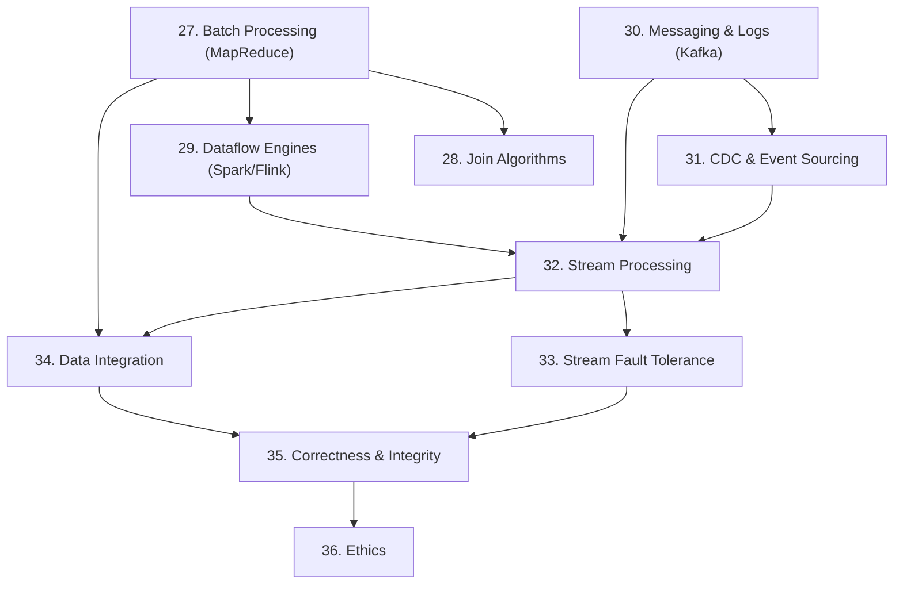

# Part III — Derived Data

**Covers:** Chapters 10–12 of DDIA
**Scope:** what to do once you accept that no single data system does everything well, and how to compose systems that are both correct and scalable.

---

## The Shift in Thinking

Parts I and II asked: "How does a data system work inside?" — storage engines, replication, partitioning, transactions, consensus.

Part III steps back and asks: "How do you compose *multiple* systems to build something greater?" It confronts the reality that every production data architecture involves several different systems — a primary database, a search index, a cache, an analytics store, a message queue — and grapples with the consequences of that heterogeneity.

The central organizing insight, stated in the Part III introduction:

> **Systems of record vs derived data.** A *system of record* (source of truth) holds the authoritative, primary representation of data. *Derived data* is the result of transforming or processing the system-of-record data — a cache, a search index, a materialized view, an ML model's training set. If derived data is lost, it can be recomputed from the system of record.

This distinction is architectural: it determines the direction of data flow, which systems you can afford to lose and rebuild, and how you reason about correctness across the whole system.

---

## The Unifying Theme: The Immutable Log

Part III reveals that a single idea runs through the whole book, appearing in different forms:

| Chapter | Where you saw it |
|---|---|
| Part I, Topic 6 (LSM-Trees) | The log-structured storage engine — append-only log, compacted on read |
| Part I, Topic 9 (Encoding) | The replication log as a stream of change events |
| Part II, Topic 10 (Single-Leader) | The replication log broadcasts writes to followers |
| Part III, Topic 30 (Messaging) | A Kafka-style log: durable, replayable, partitioned |
| Part III, Topic 31 (CDC/Event Sourcing) | The database write-ahead log as a stream of events |
| Part III, Topic 24 (Total Order Broadcast) | The consensus log that underlies ZooKeeper |

**The same idea, from storage engine to distributed coordination to streaming platform:** an immutable, append-only log of events is the canonical representation of change. Views (the current state, a search index, a cache) are derived from the log, not the other way around. This composability — derive as many views as you want from one stream of facts — is what makes modern data architectures scalable, evolvable, and correct.

---

## Chapter Summaries

### Chapter 10 — Batch Processing

How to process large amounts of data *offline* — not latency-sensitive, but high throughput and correct. MapReduce, dataflow engines (Spark, Flink, Tez), join algorithms, and the output types of batch jobs. Key principle: batch jobs read immutable input, produce immutable output, and can be retried without side effects.

### Chapter 11 — Stream Processing

How to process events as they arrive, in near-real-time. Message brokers (traditional queues), log-based message brokers (Kafka), change data capture (CDC), event sourcing, stream joins, time semantics (event time vs processing time), and fault tolerance in stream processing. Key principle: streaming is batch processing with smaller batches and a notion of time; the same correctness ideas apply.

### Chapter 12 — The Future of Data Systems

The synthesis chapter. How to compose specialized tools using derived data flows — "unbundling the database." End-to-end correctness without distributed transactions (idempotence + deduplication). Enforcing constraints on streams. Dataflow programming models. The timeliness/integrity distinction. A vision of data systems as programs over event logs.

---

## Topics

| # | File | Difficulty | Interview Importance |
|---|------|------------|---------------------|
| 27 | `01-batch-processing.md` | Intermediate | High |
| 28 | `02-join-algorithms.md` | Advanced | High |
| 29 | `03-dataflow-engines.md` | Intermediate | High |
| 30 | `04-messaging-and-logs.md` | Intermediate | **Critical** |
| 31 | `05-cdc-and-event-sourcing.md` | Advanced | **Critical** |
| 32 | `06-stream-processing.md` | Intermediate | **Critical** |
| 33 | `07-stream-fault-tolerance.md` | Advanced | High |
| 34 | `08-data-integration.md` | Intermediate | High |
| 35 | `09-correctness.md` | Advanced | **Critical** |
| 36 | `10-ethics.md` | Introductory | Medium |

---

## Concept Dependency Diagram

---

## Prerequisites

All of Part II, especially:
- Replication logs (Topic 10) — the same structure as a Kafka log.
- Transactions & ACID (Topic 17) — the baseline correctness model; Part III's goal is to achieve the same guarantees more cheaply.
- Two-Phase Commit (Topic 25) — Part III's derived-data approach is the alternative.
- Total Order Broadcast / Consensus (Topics 24, 26) — the theoretical foundation for Kafka-style logs.
- Encoding & Evolution (Topic 9) — schemas for events, forward/backward compatibility.

---

## The "Unbundled Database" Vision

The book's final argument: a traditional monolithic database does many things — store data, index it, join it, stream changes, enforce constraints, provide transactions. Each component is optimized for everything at once, which means it's not optimal for anything specifically.

The alternative, which Part III develops: **decompose these functions**. Use the right tool for each job, connected by immutable event logs:

- A transactional database as the system of record (writes go here first).
- Derived views (search indexes, caches, materialized aggregates) built by consuming that database's change stream.
- Stream processors computing joins, aggregations, and transformations on the event log.
- Correctness enforced not by distributed transactions but by idempotent operations and deduplication.

The cost is increased operational complexity (more systems to run). The benefit is that each system is best-of-breed for its job, the data flow is explicit and auditable, and reprocessing (replaying the log to rebuild a derived view from scratch) is a first-class operation — enabling schema migrations, algorithm changes, and recovery from bugs.

---

## Part III in Seven Lines

1. Batch jobs process immutable input to immutable output — simple, retry-safe, high throughput.
2. Dataflow engines (Spark, Flink) pipeline the same ideas with less disk I/O by keeping data in memory.
3. Kafka-style logs give you durable, replayable, ordered streams — the streaming analog of the replication log.
4. CDC and event sourcing tap the database's changelog as the authoritative stream of facts.
5. Stream processing is batch processing with smaller windows and a notion of time; the same join and aggregation algorithms apply.
6. Correctness without distributed transactions: idempotent writes + at-least-once delivery + deduplication gives you exactly-once semantics for most real needs.
7. The future is dataflow: compose specialized systems via immutable event logs, with each derived view rebuilt from the stream on demand.
