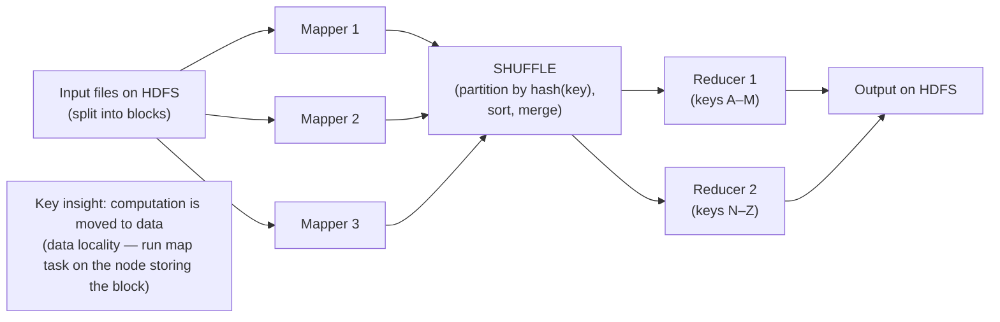
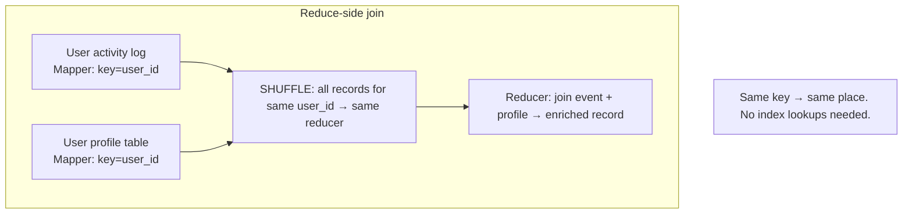

# Batch Processing & MapReduce

**Prerequisites:** Topic 6 (log-structured storage — same sequential I/O ideas), Topic 14 (partitioning — MapReduce uses hash partitioning), Topic 8 (OLAP / column stores)
**Difficulty:** Intermediate
**Interview importance:** High
**Source:** Chapter 10 — "Batch Processing with Unix Tools", "MapReduce and Distributed Filesystems", "Reduce-Side Joins and Grouping", "The Output of Batch Workflows"

---

## 1. What Is It?

**Batch processing** is computing over large, bounded datasets *offline* — not latency-sensitive, but designed for correctness and high throughput. The job reads all its input, processes it, and writes all its output. Classic examples: computing daily analytics, building search indexes, training ML models, generating recommendation sets.

**MapReduce** is the programming model that brought batch processing to distributed clusters. A job is expressed as two functions — **map** and **reduce** — which the framework runs in parallel across thousands of machines, handling fault tolerance, data movement, and parallelism automatically.

The chapter opens with Unix pipes as the intellectual ancestor: both are batch processing systems, both treat input as immutable, and both compose simple functions into powerful pipelines.

---

## 2. Why Does It Exist?

Three tiers of data processing by latency:

| Type | Latency | Example |
|---|---|---|
| OLTP (online transaction processing) | Milliseconds | User logs in, order is placed |
| Batch processing | Minutes to hours | Nightly analytics, index build |
| Stream processing (Topic 32) | Milliseconds to seconds | Real-time fraud detection, feed ranking |

Batch processing exists because many valuable computations are too large for a single machine and not latency-sensitive enough to require real-time systems. HDFS + MapReduce (or modern dataflow engines — Topic 29) scale these to petabytes of data across thousands of nodes, cheaply, on commodity hardware.

The key enabling principle: **treating input as immutable, and output as a pure function of the input.** This makes batch jobs safe to restart, safe to parallelize, and easy to reason about. No locks, no distributed transactions, no partial states to clean up.

---

## 3. Simple Explanation

**Unix philosophy → MapReduce:**

Unix pipes: `cat log | awk '{print $7}' | sort | uniq -c | sort -rn | head -5`

Each command does one thing; the output of one is the input to the next; data flows left to right; input is immutable; if it fails, just rerun.

MapReduce does the same at cluster scale:

- **Map phase:** each record is processed by a mapper function that emits zero or more key-value pairs. (Like `awk '{print $7}'` — extract the URL, output `(url, 1)`.)
- **Shuffle:** all key-value pairs with the same key are routed to the same reducer (sorted, repartitioned across the network).
- **Reduce phase:** the reducer receives all values for a key and produces the output. (Like `uniq -c` — count all the `1`s for each URL.)

**The framework handles everything else:** reading blocks from HDFS in parallel, partitioning map output by key hash, network-shuffling data to reducers, merging sorted files, writing output. You write two functions; it does the distributed computing.

---

## 4. Real-World Analogy

**A large tax office processing returns.**

Each tax inspector (mapper) takes a pile of paper forms (one input partition), extracts key information from each — taxpayer ID and amount owed — and stacks them by ID range in outgoing trays (shuffle to reducer partitions). The sorting team (shuffle) moves each tray to the right calculator room (reducer), sorted by taxpayer ID. Each calculator room (reducer) takes all forms for a given ID, sums the amounts, and writes the final bill. The whole office works in parallel; no inspector waits for another; the only synchronization point is the shuffle.

The analogy extends to fault tolerance: if an inspector drops their pile mid-processing, give the pile to another inspector (rerun the map task). If a calculator room catches fire, redo that partition. The piles (input files) were never modified.

---

## 5. Technical Explanation

### The Unix foundation

The top-5-URLs shell pipeline is the book's motivating example:

```bash
cat /var/log/nginx/access.log \
  | awk '{print $7}' \
  | sort \
  | uniq -c \
  | sort -r -n \
  | head -n 5
```

Key properties:
- **Immutable input:** `cat` reads the log file but doesn't change it. You can rerun anytime.
- **Uniform interface:** everything is a stream of bytes (text lines), so any tool can pipe into any other.
- **Separation of logic from wiring:** each tool knows nothing about its neighbors; `bash` wires them together. (Inversion of control — loose coupling.)
- **Transparency:** you can terminate the pipeline anywhere and inspect intermediate output with `less`.

**In-memory aggregation vs sort-based:** a Ruby hash table approach keeps all distinct URLs in memory (fast but bounded by RAM). The Unix `sort | uniq -c` approach sorts to disk, leveraging sequential I/O — the same merge-sort idea as LSM-trees (Topic 6). For large datasets, sort-based wins: it handles data larger than memory gracefully, and `sort` on Linux automatically spills to disk and uses multiple cores.

**Unix's big limitation:** single machine. MapReduce is "Unix tools, but distributed."

### MapReduce execution

**Four logical steps (two written by the programmer, two by the framework):**

1. **Input format parsing (framework):** split the input files into records. Each input file block in HDFS → one map task; the framework tries to run each map task on the machine storing that block (**data locality** — moves code to data, not data to code).

2. **Map (programmer):** extract key-value pairs from each record. Output: any number of `(key, value)` pairs. Mappers run in parallel across all blocks; no map task needs to see another's output.

3. **Shuffle (framework):** the magic step. All mapper outputs are partitioned by `hash(key)` to the appropriate reducer, **sorted**, and merged. This is the only network transfer step; it's the bottleneck. Multiple sorted files from all mappers for one reducer are merge-sorted into a single sorted stream.

4. **Reduce (programmer):** receives all values for a given key (in sorted key order) via an iterator. Produces zero or more output records.

**Output** is written to HDFS (replicated). A job's output is valid only if the job succeeds — failed jobs leave no partial output.

### MapReduce workflows

A single MapReduce job is limited. Complex processing chains jobs: job 1's output directory becomes job 2's input. Unlike Unix pipes (streamed, in-memory buffer), chained MapReduce jobs **materialize intermediate state to HDFS** — each job writes its full output to distributed storage before the next job reads it. This is expensive (multiple network transfers, disk writes) but gives **fault tolerance** (any job can be restarted independently) and **reusability** (multiple downstream jobs can read the same intermediate output). Tool support: Oozie, Azkaban, Luigi, Airflow for workflow orchestration.

### Reduce-side joins and grouping

MapReduce has **no indexes** — it scans the entire input. This is acceptable at scale because it parallelizes the scan across thousands of machines, and for analytic queries a full scan is reasonable.

**The core join challenge:** when you need to join two large datasets (e.g., user events with user profiles), you can't look up the profile in a database per event — the latency per lookup × millions of events is untenable, and it puts unbounded load on the profile database. Instead:

**Sort-merge join (reduce-side):** both datasets are processed by the same mapper, keyed by the join key (e.g., user ID). The shuffle routes all records with the same user ID to the same reducer — both the event and the profile arrive together. The reducer processes them in a known order (events and profile for user 123 all arrive together) and produces the joined output. **Bringing related data together in the same place** is the key idea — the same principle as co-locating related records in a partition (Topic 14).

**GROUP BY** works similarly: each record is mapped to `(group_key, value)`, shuffled to the same reducer per group, and the reducer aggregates.

**Handling skew (hot keys):** a popular key (a celebrity, a hot product) sends all its records to one reducer, creating a hot partition — the same hot-key problem as Topic 14. Hive's **skew join optimization** and Pig's **skewed join** detect hot keys and spread their records across multiple reducers (sampling, or explicit declaration). This trades off shuffling more data for parallelizing the hot key.

### Map-side joins (broadcast hash join)

When **one dataset is small enough to fit in memory**: load the small dataset into a hash table in every mapper, and look up each record from the large dataset directly. No shuffle needed — the join happens entirely in the map phase. This is called a **broadcast hash join** (the small dataset is "broadcast" to all mappers). Very fast; limited by the small dataset fitting in RAM.

**Partitioned hash joins:** if both datasets are partitioned in the same way and by the same key, then each mapper only needs the partition of the small dataset corresponding to its own partition of the large dataset. Still no reducer needed.

### The output of batch workflows

Batch jobs don't just print reports — they build things:

- **Search indexes:** a Google-style web search index (a sorted-by-term inverted index) is built by a batch job. Mappers extract (term, document) pairs; reducers aggregate document lists per term; output is written as an SSTable-format file that the search servers serve directly. Reindexing = just rerun the job, then swap in the new index.
- **Key-value stores from batch jobs:** the output is written in a bulk-load format, then imported directly into a production key-value store (e.g., HBase, Voldemort, Cassandra). The batch job builds the final data structure offline; the store just loads it. **Far more efficient than writing individual records via normal API** (which would be millions of small writes going through all the regular code paths).
- **Recommendation systems, ML model training, analytics aggregates.** All are batch outputs consumed by other systems.

**Philosophy of batch outputs:**

- Batch jobs can write to databases that serve read requests — but doing so record-by-record inside the reducer is dangerous: it creates network connections to the database (which may not scale), and if the job is rerun (after partial failure), it may write duplicates. **Better: write the output to files, then do a bulk-load atomically** — or make the individual writes idempotent.
- By treating output as a transformation of immutable input, batch jobs can be rerun, debugged, and reasoned about cleanly. The input is never modified; the output is either complete and valid or discarded on failure.

### Comparing Hadoop to distributed databases

**Hadoop vs MPP databases (Vertica, Teradata, Redshift):**

- **Storage diversity:** Hadoop (HDFS) stores data in any format — CSV, JSON, Avro, Parquet, custom binary. It reads the raw files and interprets them at read time ("schema on read"). MPP databases require data to be imported in a specific format with a defined schema upfront ("schema on write"). Hadoop is much more flexible for messy, evolving data.
- **Processing diversity:** Hadoop MapReduce can run arbitrary code (ML training, graph processing, custom data transformations). MPP databases primarily execute SQL. Many ETL workflows, ML training runs, and custom transformations don't map cleanly to SQL — MapReduce (or dataflow engines) handles them.
- **Fault tolerance philosophy:** Hadoop was designed for large clusters of commodity machines with frequent failures. Map tasks can be retried independently; the job simply reruns failed tasks. MPP databases typically restart the entire query on any node failure — fine for a 5-minute query, catastrophic for an 8-hour query. Hadoop's design for frequent faults is what enables very large-scale, very long-running jobs.
- **Agility:** HDFS is like a distributed filesystem — you can dump raw data there and figure out the schema later. MPP databases need the schema decided upfront. For data exploration and evolving workloads, Hadoop's flexibility is a significant advantage.

---

## 6. Diagrams





---

## 7. Concrete Example

**Building a personalized recommendation list (batch job pipeline):**

Job 1 (map): read all purchase events; emit `(user_id, product_id)` pairs.
Job 1 (reduce): per user, collect list of purchased products.

Job 2 (map): read all products bought; for each pair `(product_A, product_B)` purchased by the same user, emit `(product_A, product_B, 1)`.
Job 2 (reduce): sum co-occurrence counts → "users who bought A also bought B."

Job 3 (broadcast hash join map): load the product catalog into memory; for each co-occurrence record, enrich with product name and category.

Job 3 output: bulk-load into a key-value store keyed by `user_id` → ranked recommendation list.

This pipeline of 3 jobs, each immutable input→output, produces a personalized recommendation store serving millions of reads/second — entirely offline, entirely restartable, and rebuilt nightly by simply rerunning the workflow.

---

## 8. When to Use / Not Use

**Use batch processing when:** data volumes require distributing across many machines; latency is not critical (minutes to hours is acceptable); the computation is naturally expressible as transformation of immutable data; fault tolerance of individual tasks is important (very long jobs on commodity hardware); output will be bulk-loaded (indexes, stores, reports).

**Avoid (prefer streaming) when:** you need results within seconds; input data arrives continuously; the cost of recomputing from scratch is too high.

**Avoid (prefer OLTP / indexed access) when:** you need to look up individual records quickly; the data fits in one machine.

---

## 9. Advantages & Disadvantages

**Advantages**
- **Scalability:** trivially parallelizes to thousands of nodes; scales to petabytes.
- **Fault tolerance:** failed tasks are retried independently; long jobs survive node failures.
- **Simplicity of the programming model:** two functions, the rest is the framework.
- **Immutable input, pure output:** easy to reason about, rerun, debug.
- **Flexibility:** arbitrary code, any file format (vs SQL-only MPP databases).

**Disadvantages**
- **High latency:** minutes to hours before output is available.
- **Materialization overhead:** intermediate state written to disk between jobs — expensive in I/O (dataflow engines fix this — Topic 29).
- **No incrementalism:** the whole job reruns even if one input record changes.
- **Operational complexity:** cluster management, workflow scheduling, shuffle tuning.
- **Shuffle is the bottleneck:** all map output crosses the network; network and disk I/O dominate job time.

---

## 10. Trade-off Table

| Dimension | MapReduce | MPP database | Stream processing |
|---|---|---|---|
| Latency | Minutes–hours | Seconds–minutes | Milliseconds–seconds |
| Fault tolerance | Excellent (task retry) | Fair (restart query) | Variable |
| Data format flexibility | High (schema on read) | Low (schema on write) | Medium |
| Processing model | Arbitrary code | SQL-primary | Event-by-event |
| Best for | Large offline ETL, ML, index builds | Structured analytics SQL | Low-latency continuous processing |

| Join type | When to use | Cost |
|---|---|---|
| Sort-merge (reduce-side) | Both datasets large | Shuffle of both datasets |
| Broadcast hash join | One dataset fits in memory | No shuffle; very fast |
| Partitioned hash join | Both partitioned the same way | Only one partition of small dataset per mapper |

---

## 11. Failure Scenarios

| Scenario | MapReduce handling |
|---|---|
| Map task crashes | Framework retries the task on another node (input is still on HDFS) |
| Reduce task crashes | Retry from the shuffle output (mappers already wrote their sorted files) |
| Entire job fails | Discard all output; rerun from beginning; input was never modified |
| Straggler (slow map task) | **Speculative execution:** launch a duplicate task on another node; use whichever finishes first |
| Corrupt output written mid-job | Discarded — job is atomic: output is valid only on successful completion |
| Database writes inside reducer fail | Dangerous if non-idempotent; better to write to files and bulk-load |

---

## 12. Production Considerations

- **Write output to HDFS, bulk-load to stores** — don't write individual records to a database from reducers; it's slow, and reruns cause duplicates unless writes are idempotent.
- **Design workflows for idempotence** — every job should produce the same output if rerun on the same input, so reruns are safe.
- **Watch the shuffle** — it's the bottleneck. Minimize data volume leaving mappers (filter early, aggregate in the mapper before the reduce).
- **Handle skew explicitly** — hot keys cause reducer stragglers; use sampling-based skew handling in frameworks or pre-aggregate hot keys in the mapper.
- **Speculative execution** handles stragglers automatically in MapReduce; leave it on.
- **Use modern dataflow engines (Spark, Flink)** for new development — they keep intermediate state in memory and pipeline stages, avoiding the HDFS I/O overhead of MapReduce (Topic 29).
- **Workflow schedulers** (Airflow, Oozie) are essential for managing dependency graphs of 10+ jobs.

---

## ❌ 13. Common Mistakes

- **Writing to the database record-by-record inside a reducer** — slow, causes duplicate writes on rerun, and hammers the database.
- **Ignoring skew** — if a hot key sends all its records to one reducer, that task becomes the bottleneck for the entire job.
- **Not understanding that MapReduce jobs are purely functional** — no side effects on input; failed tasks can always be rerun cleanly.
- **Using MapReduce when a simpler in-memory job would work** — if data fits in one machine, use pandas or SQL; MapReduce is for distributed scale.
- **Forgetting that intermediate output goes to HDFS** — this is much more expensive than pipelined in-memory computation (dataflow engines avoid it).
- **Choosing MapReduce over a modern dataflow engine for new work** — Spark/Flink obsolete raw MapReduce for most use cases (Topic 29).

---

## 🧠 14. Think Like an Engineer

```
Is this computation on a bounded, large dataset where latency isn't critical?
   → batch processing
        ↓
Does the whole thing fit on one machine? → use pandas/SQL, not distributed
        ↓
What are the joins? (where does data need to come together?)
   small table + large table → BROADCAST HASH JOIN (no shuffle)
   two large tables on same key → SORT-MERGE (shuffle both)
        ↓
Are there hot keys? → detect and split them
        ↓
What's the output format?
   search index → SSTable format
   key-value store → bulk-load format (not individual writes)
   report → files, then downstream consumption
        ↓
Is the job idempotent? (safe to rerun on failure?) → it must be
        ↓
Modern: use Spark/Flink (avoid MapReduce's HDFS intermediate materialization)
```

---

## 15. Mental Model

```
Batch processing = Unix pipes at cluster scale
  Immutable input → parallel map → shuffle (sort + network) → reduce → output
      ↓
Key properties:
  Data locality: move code to data, not data to code
  Shuffle is the bottleneck: minimize data leaving mappers
  Output is atomic (valid only on success)
  Failed tasks retry cleanly (input never modified)
      ↓
Join = bring related data to the same reducer
  Sort-merge: shuffle both datasets by join key
  Broadcast hash: load small dataset to all mappers
      ↓
Output → HDFS files → bulk-load to serving stores (never write record-by-record)
```

---

## 🔗 16. How This Connects to Other Concepts

- **Log-Structured Storage (Topic 6)** — SSTable merge-sort is exactly the shuffle merge; batch processing reuses the same sequential-I/O ideas.
- **OLAP / Column Storage (Topic 8)** — batch processing feeds the analytical stores covered there; Parquet/ORC are the column formats used in batch pipelines.
- **Partitioning (Topic 14)** — shuffle uses hash partitioning; skew (hot keys) is the same problem as hot partitions.
- **Dataflow Engines (Topic 29)** — the evolution that fixes MapReduce's HDFS materialization overhead; Spark/Flink keep intermediate state in memory.
- **Messaging & Logs (Topic 30)** — streaming is the continuous version of batch; Kafka provides the unbounded input stream.
- **Data Integration (Topic 34)** — batch jobs build derived data (search indexes, caches) from systems of record; the same data-integration architecture.

---

## 17. Interview Questions & Answers

**Beginner**

**Q: What is MapReduce and what problem does it solve?**
MapReduce is a programming model for processing large datasets in parallel across a cluster of machines. You write two functions — a mapper that extracts key-value pairs from each input record, and a reducer that aggregates all values for each key — and the framework handles splitting the data across machines, sorting and shuffling mapper outputs to the right reducers, retrying failed tasks, and writing the output. It solves the problem of running computation on data volumes that exceed what one machine can handle.

**Q: What is the shuffle step?**
The shuffle is the framework-managed step between map and reduce: all key-value pairs emitted by mappers are partitioned by hash of the key, sorted, and routed to the right reducer so that all values for the same key end up together. It's the only step that involves network transfer and is typically the bottleneck of a MapReduce job.

**Intermediate**

**Q: How does MapReduce handle joins between large datasets?**
Through the sort-merge join on the reduce side. Both datasets are mapped with the join key as the output key, then the shuffle routes all records with the same key to the same reducer — both sides of the join arrive together. The reducer then processes them in sorted order, emitting joined records. This avoids any index lookups and works even when both datasets are huge. If one dataset is small enough to fit in memory, a broadcast hash join is more efficient: load the small dataset into a hash table in every mapper and do the join entirely in the map phase with no shuffle needed.

**Q: Why does MapReduce write intermediate output to HDFS between jobs, and what's the cost?**
MapReduce chains jobs by having each job write its full output to HDFS, which the next job reads as input. The benefit is fault tolerance: any job can restart independently, and multiple downstream jobs can read the same intermediate output. The cost is significant: every intermediate result crosses the network (replication) and hits disk multiple times. Modern dataflow engines like Spark and Flink fix this by keeping intermediate state in memory and pipelining stages, dramatically reducing I/O and runtime for multi-stage computations.

**Advanced / Staff**

**Q: You're building a batch pipeline to enrich user events with profile data for 100M users and 10B events. Walk through the design.**
The core challenge is the join at scale. Both datasets are too large for an in-memory broadcast join. So I'd use a sort-merge join on the reduce side: for the events, the mapper emits `(user_id, event_record)` tagged as type "event"; for the user profiles, the mapper emits `(user_id, profile_record)` tagged as type "profile." The shuffle routes all records for a given user_id to the same reducer. The reducer first collects the profile (it's one record per user), then emits each event enriched with that profile. Secondary sort ensures the profile record arrives before the events.

For skew: if a small number of user IDs have vastly more events (company accounts, bots), those reducers become stragglers. I'd handle this by sampling the events data first to identify hot user IDs, then for hot users I'd replicate the profile to multiple reducers and distribute the events across them, merging the results afterward — the same key-splitting idea from partitioning.

For output: I wouldn't write individual records to the serving database from the reducer — that causes slow, potentially non-idempotent writes. Instead I'd write to HDFS in a bulk-load format and atomically import into the serving store. This makes the job idempotent: rerun it and it produces the same output, which you swap in atomically.

---

## 🎯 30-Second Interview Answer

> "Batch processing runs large computations offline on immutable input, producing immutable output — no latency requirement, but high throughput and correct. MapReduce is the canonical model: mappers extract key-value pairs from input records in parallel across all input file blocks, the shuffle routes and sorts all output by key so values for the same key arrive at the same reducer, and reducers aggregate or join them. Crucially, input is never modified and a failed task just retries on another node — the job is idempotent by design. The core join technique is the sort-merge join: both datasets are keyed by the join key so the shuffle brings related records together in one reducer; for a small dataset, you broadcast it as a hash table to all mappers instead. The output typically goes to HDFS files and then bulk-loads into serving stores — never write individual records from a reducer, it's slow and causes duplicates on rerun. For new work I'd use Spark or Flink over raw MapReduce, because they pipeline stages in memory and avoid the expensive HDFS materialization between every job."

---

## ⚡ Quick Revision

- **Batch processing:** large, bounded, offline computation. Immutable input → computation → immutable output. Retry-safe, not latency-sensitive.
- **MapReduce:** (1) **Map**: each record → (key, value) pairs; runs in parallel on every input block; data locality (code moved to data). (2) **Shuffle**: partition by `hash(key)`, sort, network-transfer to reducers — the bottleneck. (3) **Reduce**: aggregate/join all values per key.
- **Fault tolerance:** failed tasks retry (input never modified); entire job discards output on failure (atomic).
- **Workflows:** chain jobs via HDFS directories; each job materializes full output to disk (expensive; dataflow engines fix this — Topic 29).
- **Joins:**
  - **Sort-merge (reduce-side):** both large datasets keyed by join key → same reducer.
  - **Broadcast hash join:** small dataset loaded as hash table in every mapper — no shuffle.
  - **Hot keys:** spread records across multiple reducers, merge results.
- **Output:** write to HDFS files, **bulk-load** to stores. **Never write record-by-record from reducers** (slow, non-idempotent).
- **Hadoop vs MPP:** Hadoop = schema on read, arbitrary code, excellent fault tolerance for long jobs, commodity hardware. MPP = SQL, schema upfront, restarts on failure, faster for structured analytics.
- **Speculative execution:** duplicate straggler tasks on another node; use whichever finishes first.
