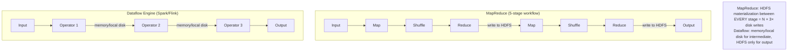
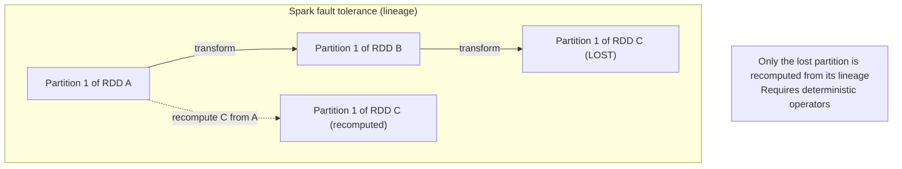

# Dataflow Engines (Spark, Flink, Tez)

**Prerequisites:** Topic 27 (batch processing / MapReduce)
**Difficulty:** Intermediate
**Interview importance:** High
**Source:** Chapter 10 — "Materialization of Intermediate State", "Dataflow Engines", "Fault Tolerance", "High-Level APIs"

---

## 1. What Is It?

**Dataflow engines** (Spark, Flink, Tez) are the next-generation batch (and stream) processing frameworks that fix MapReduce's fundamental inefficiency: writing *all* intermediate state to HDFS between every job stage.

Instead of a fixed map → shuffle → reduce → HDFS → repeat cycle, dataflow engines model the entire workflow as a **directed acyclic graph (DAG) of operators**, keep intermediate state in **memory or local disk** (not replicated to HDFS), and **pipeline** operators so they start as soon as any input is ready — rather than waiting for the preceding stage to fully complete.

The result: the same MapReduce-style computations, but typically **10–100× faster** due to reduced I/O.

---

## 2. Why Does It Exist?

MapReduce's full-materialization of intermediate state has three concrete costs:

1. **Barrier synchronization:** each job stage can't start until all tasks in the prior stage finish. A single straggler task delays the entire next stage.
2. **Redundant mappers:** in a multi-stage job, the first thing a mapper often does is read the output of the previous reducer. Those mapper reads are wasted I/O — the reducer could have written directly to the next stage.
3. **HDFS replication of temporary data:** intermediate state gets written to disk and replicated to 3 nodes, even though it's short-lived. That's 3× the disk I/O and 3× the network for data you discard after the next stage.

Dataflow engines fix all three by treating the entire workflow as one job and keeping intermediate data local or in memory.

---

## 3. Simple Explanation

MapReduce is like a factory assembly line where every station's output is boxed up, shipped to a warehouse, unboxed, and re-shipped to the next station — even for temporary parts.

Dataflow engines are like a continuous assembly line where parts flow directly from one workstation to the next on a belt, only going to the warehouse (HDFS) when they're a finished product or need long-term storage.

The key changes:
- **Operators** (not rigid map/reduce) — you assemble a pipeline of arbitrary transformations.
- **Intermediate data stays local** — in memory or on local disk, not replicated to HDFS.
- **Pipelining** — operator 2 starts processing as soon as operator 1 produces the first output batch; no waiting for the full stage.
- **Smarter scheduling** — the scheduler sees the whole DAG and can optimize data locality.

---

## 4. Real-World Analogy

**MapReduce:** each department (HR, Finance, Legal) fully processes their stack, files a report in the central filing room (HDFS), and only then does the next department go fetch it and start. Central filing is replicated to 3 offices "for safety."

**Dataflow engine (Spark):** departments share a rolling tray: HR sends each completed form directly across the hall to Finance, who passes it along to Legal. The central filing room is only used for the final signed contract, not every intermediate memo. Processes run in parallel; nobody waits for the whole pile to be done.

---

## 5. Technical Explanation

### The materialization problem (recap)

In a 10-stage MapReduce workflow:
- 9 sets of intermediate files written to HDFS (replicated × 3).
- 9 rounds of "write entire output, then read entire output again" across the cluster.
- Between every pair of stages: the later stage can't start until all tasks in the prior stage complete.

For a job with 50 MapReduce stages (common for recommendation pipelines), this materialisation overhead is enormous — potentially hours of wasted I/O.

### Dataflow engines: the fix

**One job, not many.** The entire workflow is submitted as a single job. The framework sees the whole DAG, schedules all operators, and manages data movement.

**Operators, not mappers and reducers.** Operators are generalizations. They can:
- Repartition and sort by key (like the shuffle — needed for sort-merge joins and group-by).
- Repartition by key *without* sorting (for hash joins where sort order is irrelevant).
- Broadcast output to all partitions (for broadcast hash joins).
- Simply filter, project, or transform each record in place (no repartitioning).

No redundant mappers: if a reducer's output is already partitioned the right way for the next stage's operator, the next operator just reads it directly — no extra pass needed.

**Intermediate state stays local.** Between most operator pairs, data passes through a shared memory buffer or is written to local disk on the machine running those operators — not to HDFS. No replication. Only the final output (and checkpoints) go to HDFS.

**Pipelining.** Operator A produces record 1, passes it immediately to operator B, which processes it. No waiting for A to finish all records. (Exception: operators that require their entire input — like a full sort — must consume all input first before producing output. Spark and Flink are selective about where they pipeline.)

**Better locality.** Because the scheduler sees the whole DAG and knows which operator consumes which partition, it can schedule consumers on the same machine as producers. Data moves through shared memory rather than the network. MapReduce's scheduler saw only one map stage at a time.

**JVM reuse.** MapReduce launches a new JVM per task (expensive startup). Spark and Flink reuse long-lived executor JVM processes across tasks, amortizing the startup cost.

### Spark specifically: RDDs and lazy evaluation

Spark models data as **Resilient Distributed Datasets (RDDs)** — immutable, partitioned collections with a lineage (how they were computed). Transformations on RDDs (map, filter, join, groupBy) are **lazy**: they don't execute until an action (count, collect, write) is called. This allows Spark to optimize the entire computation graph before running anything.

**DataFrame / Dataset API:** higher-level API that expresses operations relationally (like SQL), allowing Spark's **Catalyst optimizer** to perform cost-based optimization — choosing join algorithms, reordering operations, pushing down filters to the scan.

### Flink: true streaming + batch unified

Flink is built around true streaming (operator-level pipelining) from the ground up. It processes each record as it arrives through the operator pipeline. Batch processing is treated as streaming over a bounded input. Flink's **checkpoint mechanism** periodically snapshots operator state, enabling recovery to the last checkpoint rather than full recomputation.

### Fault tolerance in dataflow engines

MapReduce's fault tolerance was simple: write everything to HDFS, retry any failed task. Dataflow engines keep intermediate state in memory/local disk, which is lost if the node dies. Two recovery approaches:

- **Recomputation from lineage (Spark):** RDD lineage tracks how each partition was derived. On node failure, recompute only the lost partitions from the prior stage (or original input). Correct if operators are **deterministic** — same input always produces same output. Nondeterministic operators (using random numbers, system clocks, unordered hash iteration) must be handled carefully: if a lost partition is recomputed differently from the original, downstream operators that already processed the original output get inconsistent inputs.
- **Checkpointing (Flink):** periodically snapshot all operator state to durable storage. On failure, restore from the last checkpoint and replay input since then. More expensive (writes to disk periodically) but handles nondeterminism cleanly.

**The recovery trade-off:** if intermediate data is much smaller than the source, or the computation is CPU-intensive, it may be cheaper to **checkpoint intermediate data** than to recompute it. The framework (or developer) makes this call per stage.

### Graph processing: Pregel / BSP

Many graph algorithms (PageRank, shortest paths, connected components) require **iterative processing**: run one step, check convergence, repeat. MapReduce handles this badly — each iteration reads and writes the entire graph, even if only a few vertices changed.

**Pregel / Bulk Synchronous Parallel (BSP)** model (used by Apache Giraph, Spark GraphX, Flink Gelly):
- Each iteration: every active vertex processes incoming messages from the prior iteration, updates its state, sends messages to neighbors.
- Between iterations: **barrier synchronization** — all messages from this iteration are delivered before the next begins.
- Vertex state is **kept in memory** across iterations — only new messages trigger processing (inactive vertices do nothing).

This is much more efficient than re-scanning the whole graph each iteration.

**Key limitation:** graph algorithms communicate along edges, and edges can connect vertices on different machines — a lot of cross-machine message traffic. Practical implication: if the graph fits in one machine's memory, a single-machine algorithm (even single-threaded) often **outperforms a distributed approach** due to avoided network overhead. Only reach for distributed graph processing when the graph is genuinely too large for one machine.

### High-level APIs and the move toward declarative

Raw MapReduce is verbose (a Java class per mapper, per reducer). High-level APIs — **Hive, Pig** (for MapReduce), **Spark SQL / DataFrames, Flink Table API** (for dataflow engines) — express operations declaratively:

- Join two datasets on a key.
- Group by a field and aggregate.
- Filter, project, order.

The framework's **query optimizer** then chooses *how* to execute it — which join algorithm (sort-merge, broadcast hash, etc.), which order, which columns to read from disk. Same as a relational database query optimizer, but at batch scale.

**Vectorized execution:** Spark, Impala, and Flink generate tight inner loops (JVM bytecode or LLVM native code) that process many records per CPU instruction, using CPU cache efficiently and avoiding per-record function call overhead. This brings performance close to hand-optimized C.

---

## 6. Diagrams





---

## 7. Concrete Example

**A Spark job computing "daily active users by country" from 1TB of event logs:**

```
events.read("s3://logs/2024-01-15/")       -- read from S3/HDFS
     .filter(event_type == "login")         -- operator 1: filter
     .join(users, on="user_id", "broadcast") -- operator 2: broadcast hash join (users table is small)
     .groupBy("country")                    -- operator 3: repartition by country
     .agg(countDistinct("user_id"))         -- operator 4: count distinct per country
     .write("s3://results/dau_by_country/") -- write output
```

In MapReduce: 2–3 jobs, each writing full output to HDFS, total I/O = 3–4 TB.

In Spark:
- Filter happens in memory during the read — no extra I/O.
- The users table (small) is broadcast to all executors — no shuffle for the join.
- GroupBy shuffles only the filtered/joined data across the network — much smaller than the raw 1TB.
- Output written once to S3.
- If one executor fails, Spark recomputes only that executor's partitions from the lineage.

Result: the same output in minutes rather than hours, with a fraction of the disk I/O.

---

## 8. When to Use / Not Use

**Use dataflow engines (Spark/Flink) when:** you're doing multi-stage batch processing — any MapReduce workflow with more than one or two stages; when intermediate state doesn't need to be published between teams (no need for HDFS materialization for its own sake); when performance matters; for ML training, complex ETL, multi-join analytics.

**Stick with HDFS materialization when:** intermediate results need to be reused by multiple downstream teams or jobs; the intermediate dataset is large and recomputation would be more expensive than storing it; checkpointing for genuinely nondeterministic operators.

**Use a graph processing framework (Pregel/GraphX)** only when the graph is too large for one machine — single-machine graph libraries (igraph, NetworkX, GraphChi) often outperform distributed frameworks due to network overhead.

**Prefer SQL/MPP** for pure analytical SQL queries where data fits in a managed warehouse — the optimizer is already tuned and the operational overhead is lower than running Spark.

---

## 9. Advantages & Disadvantages

**Dataflow engines — advantages**
- Dramatically less I/O than MapReduce (no HDFS writes for intermediate state).
- Pipelining — operators start as soon as input is ready; no full-stage barrier.
- Flexible operator assembly (not just map + reduce).
- Better locality optimization (scheduler sees the whole DAG).
- JVM reuse reduces task startup overhead.
- High-level APIs with cost-based query optimization.

**Disadvantages**
- Fault recovery is more complex (recomputation or checkpointing vs simple HDFS retry).
- Nondeterminism in operators can complicate recovery.
- Higher memory pressure (intermediate data stays in RAM); GC tuning is important.
- More complex to debug than MapReduce (in-memory state is ephemeral).
- Overkill for simple, single-stage jobs.

---

## 10. Trade-off Table

| Dimension | MapReduce | Spark | Flink |
|---|---|---|---|
| Intermediate state | HDFS (replicated) | Memory / local disk | Memory / local disk |
| Pipelining | No (full stage barrier) | Partial (within a stage) | Full (true streaming) |
| Fault recovery | HDFS re-read (simple) | Lineage recomputation | Checkpoint + replay |
| Streaming support | No | Micro-batch (Spark Streaming) | Native streaming |
| API | Java classes (verbose) | RDD, DataFrame, SQL | DataStream, Table API, SQL |
| Query optimizer | None (hand-coded) | Catalyst (cost-based) | Flink optimizer |
| Graph processing | Poorly (iterative = many jobs) | GraphX (BSP/Pregel) | Gelly (BSP/Pregel) |
| Best for | Legacy; publish intermediate data | Unified batch + ML + SQL | Unified batch + streaming + low-latency |

---

## 11. Failure Scenarios

| Scenario | MapReduce | Dataflow engine |
|---|---|---|
| Node fails mid-stage | Retry only that task (HDFS reread) | Recompute lost partitions from lineage, or restore from checkpoint |
| Nondeterministic operator fails | Retry is safe (output is idempotent, written to HDFS) | Must be careful: recomputed output may differ; may need to kill downstream operators too |
| Straggler task | Speculative execution | Speculative execution |
| Full cluster restart | Each job restarts from HDFS | Spark: recompute from source; Flink: restore from last checkpoint |
| Checkpoint overhead | N/A | Must balance checkpoint frequency vs. recovery cost |

---

## 12. Production Considerations

- **Make operators deterministic** to simplify fault recovery in Spark (avoids recomputing different outputs, which confuses downstream operators).
- **Checkpoint expensive or nondeterministic stages** explicitly — don't rely on full lineage recomputation if the source data scan is itself expensive.
- **Tune memory carefully** — Spark GC pauses are a major source of job instability; use off-heap memory (Tungsten) for serialized data.
- **Broadcast joins for small lookup tables** — loading a reference table as a broadcast variable avoids a full shuffle; a very common optimization.
- **Prefer DataFrames/SQL over raw RDDs** — the Catalyst optimizer can do things (predicate pushdown, column pruning, join reordering) that raw RDD code can't.
- **Monitor shuffle read/write bytes** — the shuffle is usually the bottleneck; reducing data volume before the shuffle is the highest-leverage optimization.
- **For graph algorithms: try single-machine first** — NetworkX or GraphChi on a powerful single machine often beats a distributed Pregel job for graphs up to hundreds of millions of edges.

---

## ❌ 13. Common Mistakes

- **Using Spark for a job that fits in memory on one machine** — pandas/DuckDB will be faster and much simpler.
- **Writing to HDFS between every Spark stage** — negates the whole point; let Spark handle intermediate data in memory.
- **Not making operators deterministic** — random seeds, system clocks, and unordered hash iteration all cause non-reproducible failures.
- **Using raw RDDs when DataFrames would work** — losing out on the Catalyst optimizer's significant performance improvements.
- **Neglecting shuffle size** — transformations that reduce data volume should happen *before* the shuffle (filter early, aggregate before join).
- **Distributed graph processing when single-machine would work** — network overhead makes distributed graph algorithms slower for graphs that fit on one machine.
- **Over-partitioning or under-partitioning** — too many small partitions → task scheduling overhead; too few → cores sit idle.

---

## 🧠 14. Think Like an Engineer

```
Is this a multi-stage computation where intermediate data is only needed by the next stage?
   → use a dataflow engine (Spark/Flink), not raw MapReduce
        ↓
What does the DAG look like?
   → identify which stages require a shuffle (join by key, group-by, sort)
   → minimize the data volume going INTO the shuffle (filter/aggregate before)
        ↓
Are any operators nondeterministic?
   → make them deterministic, OR checkpoint the output of those stages
        ↓
Is there a small lookup table in a join?
   → broadcast hash join — load it once to all executors, no shuffle
        ↓
Is this a graph algorithm?
   → does the graph fit in one machine? → single-machine library
   → genuinely too large? → BSP (Spark GraphX / Flink Gelly)
        ↓
Use DataFrame/SQL API, not raw RDDs
   → Catalyst optimizer does predicate pushdown, column pruning, join reordering
```

---

## 15. Mental Model

```
MapReduce: write → HDFS → read → write → HDFS → read (for EVERY stage)
      ↓
Dataflow engine: operators in a DAG, pass data in memory/local disk between stages
   Only write to HDFS at the beginning (input) and end (output)
      ↓
Key gains:
   No redundant mappers
   No HDFS replication of temp data
   Pipelining: downstream operators start immediately
   Whole-DAG scheduling → better locality
      ↓
Fault tolerance: lineage recomputation (Spark) or checkpointing (Flink)
   Requires deterministic operators for lineage to work correctly
```

---

## 🔗 16. How This Connects to Other Concepts

- **Batch Processing / MapReduce (Topic 27)** — the predecessor; dataflow engines solve its materialization overhead.
- **Join Algorithms (Topic 28)** — the same sort-merge, broadcast hash, and partitioned hash joins are implemented as dataflow operators.
- **Stream Processing (Topic 32)** — Flink unifies batch and streaming; the operator model is the same, the input is unbounded for streaming.
- **Messaging & Logs (Topic 30)** — Spark Streaming and Flink read from Kafka; the streaming input is the dataflow engine's unbounded input source.
- **Consistency / Fault Tolerance (Topic 33)** — exactly-once processing in stream engines uses the same checkpoint / lineage ideas.
- **Column Storage / OLAP (Topic 8)** — DataFrames use column-oriented formats (Parquet) and vectorized execution, bridging batch and analytical database ideas.

---

## 17. Interview Questions & Answers

**Beginner**

**Q: What's wrong with MapReduce, and what do dataflow engines fix?**
MapReduce writes all intermediate state to HDFS between every stage — replicated to 3 nodes. Each subsequent stage can't start until the preceding one fully completes, so a single straggler task stalls everything. Dataflow engines like Spark and Flink keep intermediate state in memory or local disk, pipeline operators so they start as soon as any input is ready, and see the entire computation as one job rather than many sequential ones. The result is dramatically less I/O and faster execution.

**Q: What is an RDD in Spark?**
A Resilient Distributed Dataset — an immutable, partitioned collection of records with a lineage that tracks how it was derived from its parent RDD. Transformations on RDDs are lazy (nothing runs until an action like write or count is called), which lets Spark optimize the whole computation graph. The lineage enables fault recovery: if a node fails and a partition is lost, Spark can recompute just that partition from its lineage rather than re-running the whole job.

**Intermediate**

**Q: How do dataflow engines handle fault tolerance differently from MapReduce?**
MapReduce writes everything to HDFS, so a failed task just re-reads its input and retries — simple. Dataflow engines keep intermediate state in memory and local disk, which is lost on node failure. Spark recovers by recomputing lost partitions from their RDD lineage — walking back through the transformation graph to the last checkpoint or original HDFS input. This requires operators to be deterministic; a nondeterministic operator recomputed differently could produce inconsistent data for downstream operators. Flink takes a different approach: periodically checkpointing all operator state to durable storage, then replaying input since the last checkpoint on failure. Checkpointing is more expensive but handles nondeterminism correctly.

**Q: When would you use a broadcast hash join in Spark?**
When one side of the join is small enough to fit in memory on every executor — a configuration table, a reference dataset, a small dimension table. Instead of shuffling both datasets across the network by join key, you load the small dataset once as a broadcast variable (sent to all executors), and each executor does a local hash table lookup for every record in its partition of the large dataset. No shuffle needed, much faster. In Spark SQL, the optimizer does this automatically when the small table is below the broadcast threshold (default 10MB, configurable).

**Advanced / Staff**

**Q: You have a Spark job that's slow due to shuffle. Walk me through debugging and fixing it.**
First I'd look at the Spark UI — specifically the number of shuffle read/write bytes per stage and per task skew. High shuffle bytes tell me the pre-shuffle stages aren't reducing data enough. Task skew (one task taking 10× longer than others) tells me hot keys are concentrating data on one executor.

For high shuffle volume: I'd look for opportunities to filter and aggregate earlier. If there's a join where one side has redundant records, I'd filter before the join not after. If there's a group-by with an aggregation, I can push a partial aggregation (combiner) into the map side with `reduceByKey` instead of `groupByKey` in RDD API, or Spark SQL does this automatically for most aggregate functions.

For skew: I'd identify the hot keys (sample the join key distribution). For a join, I can salt the hot keys — append a random suffix to create N sub-keys, replicate the small-side records for those keys N times, join on the salted key, then drop the suffix. Or use Spark's AQE (adaptive query execution) which auto-detects and handles skew partitions by splitting them.

For general optimization: use DataFrames not RDDs (Catalyst optimizer does predicate pushdown and filter-before-join reordering automatically), persist intermediate results that are used multiple times (to avoid recomputation), and ensure the number of partitions is in the right range for your cluster (200 is the default shuffle partition count — often too low for large jobs).

---

## 🎯 30-Second Interview Answer

> "Dataflow engines like Spark and Flink fix MapReduce's core inefficiency: writing all intermediate state to HDFS between every stage, with full-stage barriers. Instead, they model the whole computation as a DAG of operators, pass intermediate data in memory or local disk between operators, and pipeline stages so downstream operators start as soon as any input is ready. No redundant mappers, no HDFS replication of temporary data, better locality. Fault tolerance shifts from simple HDFS re-read to either lineage recomputation (Spark's RDDs — replay the transformation chain, requires deterministic operators) or periodic checkpointing (Flink — snapshot state, replay from checkpoint on failure). The high-level DataFrame/SQL APIs add cost-based query optimization — the Catalyst optimizer chooses join algorithms, pushes down filters, and prunes columns automatically, bringing performance close to MPP databases while retaining the flexibility to run arbitrary code on any format."

---

## ⚡ Quick Revision

- **MapReduce's problem:** writes ALL intermediate state to HDFS (replicated 3×) between every stage. Full-stage barriers = one straggler blocks the next stage.
- **Dataflow engines:** whole workflow = **one job, DAG of operators**. Intermediate state in **memory / local disk** (not HDFS). **Pipelining** — downstream starts when first input ready.
- **Benefits:** no redundant mappers, no HDFS temp-data replication, better scheduler locality (sees whole DAG), JVM reuse.
- **Spark:** RDDs (immutable, partitioned, lineage). Lazy evaluation. **Lineage-based fault recovery** (recompute lost partitions) — requires **deterministic operators**.
- **Flink:** true streaming from ground up. **Checkpoint-based recovery** (snapshot + replay). Handles nondeterminism.
- **Operator types:** repartition+sort (sort-merge join, group-by), repartition-only (hash join), broadcast (small table → all executors, no shuffle), simple filter/map.
- **High-level APIs:** Spark SQL/DataFrames, Flink Table API. **Catalyst optimizer** → predicate pushdown, column pruning, join algorithm choice, join reordering. **Vectorized execution** (JVM bytecode / LLVM native).
- **Graph processing (Pregel/BSP):** iterative, vertex-centric, state in memory across iterations. **Single-machine often faster** than distributed for graphs that fit in memory.
- **Key optimization:** minimize shuffle volume → filter/aggregate BEFORE the shuffle.
