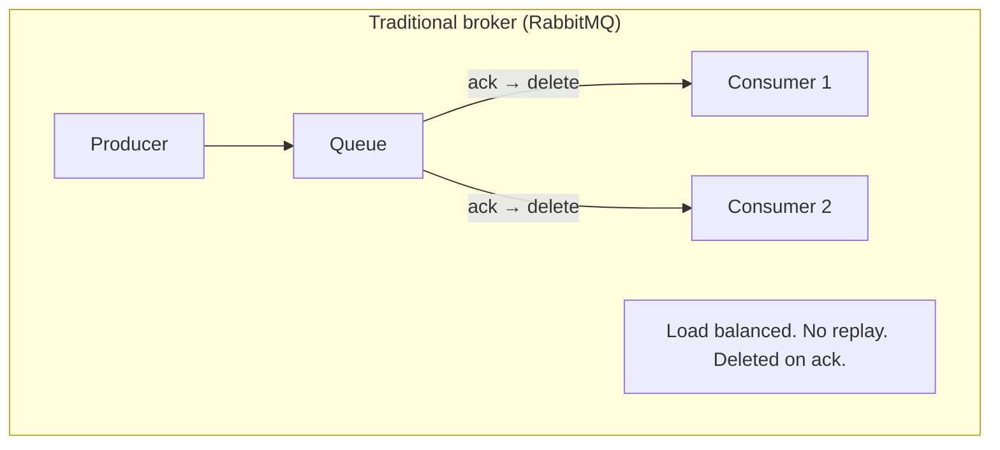
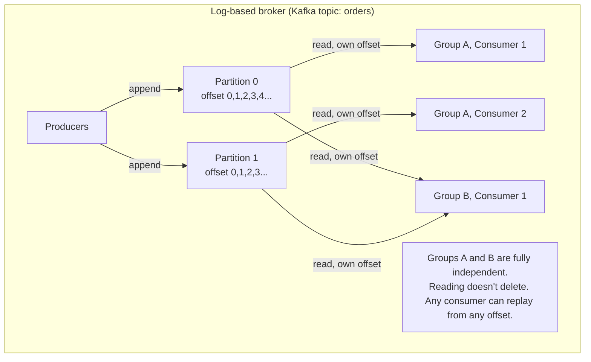

# Messaging Systems & Log-Based Brokers (Kafka)

**Prerequisites:** Topic 9 (encoding/RPC — async dataflow), Topic 10 (replication log)
**Difficulty:** Intermediate
**Interview importance:** ⭐ **Critical**
**Source:** Chapter 11 — "Transmitting Event Streams", "Messaging Systems", "Partitioned Logs"

---

## 1. What Is It?

A **messaging system** decouples producers (who generate events/data) from consumers (who process them). Instead of a direct connection, a producer sends a message to an intermediary (a **broker** or **queue**), which delivers it to one or more consumers.

Two architectures:

- **Traditional message brokers** (RabbitMQ, ActiveMQ, IBM MQ, Azure Service Bus): AMQP/JMS-style queues where messages are deleted after acknowledgment. Designed for work distribution.
- **Log-based message brokers** (Apache Kafka, Amazon Kinesis, Twitter DistributedLog): an **append-only, partitioned log** on disk. Consumers track their own position (offset). Messages are retained for a configurable window — not deleted on consumption. Designed for durable, replayable event streams.

Kafka is the canonical example of the log-based model and is the primary subject of this file.

---

## 2. Why Does It Exist?

**The problem with direct communication** (HTTP calls, RPC, database polling): producers must know where consumers are, both must be online simultaneously, and a consumer crash loses in-flight work.

**The problem with traditional queues:** once a consumer acknowledges a message, it's gone. You can't add a new consumer and replay history. You can't reprocess after finding a bug. You can't run a consumer in test mode against production data.

**The log-based broker addresses all of these:** consuming a message is a **read**, not a destructive operation. The log retains messages for days or weeks. A new consumer can start from any point — yesterday, a month ago, the very beginning. And because multiple consumer groups each maintain their own offset, they're fully independent — one slow consumer doesn't affect others.

This is the hybrid the book describes: "durable storage like a database, low-latency notification like a messaging system."

---

## 3. Simple Explanation

**Traditional broker:** like a task queue at a restaurant. The kitchen (producer) puts an order ticket on the board (queue). A waiter (consumer) takes it, serves the table, and discards the ticket. Nobody can look up past orders; the ticket is gone. Load-balanced: multiple waiters share tickets.

**Log-based broker (Kafka):** like a newspaper on a doorstep. The publisher (producer) prints today's paper and leaves copies. Every subscriber (consumer group) reads from their own copy. Yesterday's paper is still on the shelf — a new subscriber can read it from issue 1. Multiple people can read independently; reading doesn't destroy the paper. The publisher doesn't care how many people read it or at what pace.

Key Kafka concepts:
- **Topic:** a named category of events (like a newspaper title).
- **Partition:** a topic is split into ordered sub-logs; each partition lives on one broker.
- **Offset:** a monotonically increasing sequence number per message within a partition.
- **Consumer group:** multiple consumers sharing the load of one topic; each partition assigned to one consumer in the group.
- **Retention:** messages kept for a configurable time window (days/weeks/indefinitely with compaction), not deleted on read.

---

## 4. Real-World Analogy

**A national wire service (Kafka) vs a task dispatcher (RabbitMQ).**

**Task dispatcher (RabbitMQ):** AP's photo desk sends photos to the first available photo editor. Each photo goes to exactly one editor. Once an editor finishes and marks it done, it's removed from the queue. Fast, load-balanced, but if you need to re-edit yesterday's photos, they're gone.

**Wire service (Kafka):** AP broadcasts stories over its wire. The New York Times, BBC, and Reuters each have their own subscription — they each receive every story. Each news organization reads at its own pace. Today's stories are available on the wire for several days; a subscriber can rewind to Tuesday to pick up anything they missed. AP doesn't need to know who's subscribing or whether they're keeping up.

Kafka is the wire service: many consumers, durable, replayable, independent.

---

## 5. Technical Explanation

### Two messaging patterns

**Fan-out (publish-subscribe):** every consumer gets every message. Good for broadcasting events to many services (e.g., a "user signed up" event goes to the email service, analytics, onboarding flow, fraud detection — independently). Log-based brokers support this trivially — each consumer group maintains its own offset.

**Load balancing (competing consumers / work queue):** multiple consumers share a single queue; each message goes to exactly one consumer. Good for distributing work (parallel order processing). Traditional brokers do this naturally; log-based brokers do it by assigning entire partitions to consumers in a group.

The two patterns **can be combined**: multiple separate consumer groups each receive all messages (fan-out between groups), but within each group, consumers share the load (load balancing by partition assignment).

### Traditional message brokers: AMQP/JMS

Message brokers like RabbitMQ, ActiveMQ, IBM MQ run as a server; producers and consumers connect as clients.

**Acknowledgments:** a consumer receives a message and sends an acknowledgment when it's done. Until acked, the broker considers the message in-flight. If the consumer crashes, the broker redelivers to another consumer (at-least-once delivery). **Consequence:** with multiple competing consumers, messages can arrive out of order — consumer 1 is processing message m3 while consumer 2 processes m4; m3 gets redelivered to consumer 2 after consumer 1 crashes; consumer 2 now processes m4, m3, m5 — not the original order.

**Key properties:**
- Messages deleted after acknowledgment — not suitable for long-term storage.
- Working set assumed small (queue should stay short).
- Supports complex routing via exchange types (direct, topic, fanout).
- **Cannot replay** past messages — a new consumer only sees messages sent after it subscribes.

**When it fits:** work queues where messages are expensive to process, need message-by-message load balancing, and ordering isn't critical. Email delivery, background job queues, task dispatch.

### Log-based message brokers: Kafka

**The structure:** a topic is divided into partitions. Each partition is an **append-only log on disk**, with messages assigned monotonically increasing offsets. A broker holds a subset of partitions. Topics are replicated across brokers for fault tolerance (Kafka replication factor).

**Consumer offsets:** instead of per-message acknowledgment, each consumer group maintains a single current offset per partition. "I've processed everything up to offset 47." The broker records this offset periodically (Kafka commits offsets back to a Kafka topic). On consumer crash, the restarted consumer reads from its last committed offset — messages between the last offset and the crash point are **reprocessed** (at-least-once semantics). The consumer must handle duplicates (make processing idempotent or deduplicate by a message ID).

**Ordering:** within a partition, messages are strictly ordered. Across partitions, there is no ordering guarantee. To ensure causally-related messages (e.g., all events for one user) are processed in order, **route them to the same partition** using the user ID as the partition key — this is exactly the partitioning-by-key idea from Topic 14.

**Retention and disk buffering:** Kafka writes all messages to disk (sequential writes — fast). A typical 6TB drive at 150MB/s = ~11 hours of headroom. In practice, with many drives and lower write rates, **retention of days or weeks** is common. Disk buffering means throughput remains constant regardless of how much history is retained (unlike in-memory queues that slow down when they spill to disk). Old segments are deleted or archived when space is needed.

**Fan-out for free:** reading a message doesn't delete it. Ten consumer groups each reading the same topic each see every message, each advancing their own offset independently. No coordination needed.

**Replaying messages:** because consumption is a **read**, the offset is just a number the consumer controls. To reprocess yesterday's events: reset the offset to yesterday's starting position and rerun the consumer. This makes Kafka the ideal data source for batch processing jobs (feed last week's events to a Spark job), for debugging (replay events into a test environment), and for rebuilding derived data stores from scratch.

**Consumer can't keep up:** if a slow consumer falls so far behind that its offset points to a log segment that has been deleted, it misses those messages — the log is a circular buffer of fixed size. But crucially, **only that one consumer is affected** — the other consumer groups continue normally. This is a major operational advantage over traditional queues, where a slow consumer can cause the queue to grow indefinitely, consuming memory and slowing the whole broker.

**Backpressure:** Kafka doesn't apply backpressure to producers — it buffers on disk. Producers can always write; the risk is that a consumer falls too far behind.

### Logs compared to traditional messaging

| Dimension | Traditional broker (RabbitMQ) | Log-based broker (Kafka) |
|---|---|---|
| Message persistence | Until acknowledged, then deleted | Until retention expires (days/weeks) |
| Fan-out | Requires multiple queues / subscriptions | All consumer groups share one topic, own offsets |
| Load balancing | Per-message (any consumer gets any message) | Per-partition (whole partition assigned to one consumer) |
| Message ordering | Not guaranteed under rebalancing/crash | Guaranteed within a partition |
| New consumer can read history | No (starts at subscription time) | Yes (from any offset, including offset 0) |
| Replay / reprocess | No | Yes (reset offset) |
| Head-of-line blocking | Less (consumer 2 takes the next message while consumer 1 is slow) | Yes within a partition (slow message blocks the partition) |
| Throughput | Good for variable load, short queues | Excellent and constant (disk, sequential) |
| Best for | Work queues, job dispatch, variable processing time | Event streams, replayable pipelines, CDC, high throughput |

### Kafka and databases: the deep connection

The replication log (Topic 10) is a stream of database write events. Kafka is an externalized, durable version of the same idea. The replication log sequence number (LSN) is exactly the Kafka offset. The book makes this connection explicit:

> "The message broker behaves like a leader database, and the consumer like a follower."

**Change data capture (CDC)** (Topic 31) formalizes this: tap the database's WAL/binlog as a Kafka topic, and all downstream systems (search indexes, caches, analytics warehouses) become followers of the database, consuming the same ordered event stream. This enables **keeping multiple systems in sync** without dual writes.

### Consumer group mechanics

Within a consumer group, partitions are assigned to consumers by a group coordinator (a Kafka broker). When a consumer joins or leaves (or crashes), a **rebalance** occurs — partitions are redistributed. During rebalance, no messages are processed. Key points:

- **Max parallelism = number of partitions.** A consumer group can have at most as many active members as partitions; extra members sit idle.
- **Head-of-line blocking within a partition.** If one message is slow to process, all subsequent messages in that partition wait. For highly variable processing times, traditional competing-consumer queues are better.

---

## 6. Diagrams





---

## 7. Concrete Example

**An e-commerce "order placed" event pipeline.**

When a user places an order:
1. The order service publishes an `order_placed` event to a Kafka topic with `order_id` as the partition key.
2. **Inventory service** (consumer group A) reads the event, decrements stock.
3. **Email service** (consumer group B) reads the event, sends a confirmation email.
4. **Analytics service** (consumer group C) reads the event, increments the daily order counter.
5. **Fraud detection** (consumer group D) reads the event, runs a risk model.

All four are fully independent — one can be slow, crash, or be redeployed without affecting the others. The email service that was down for maintenance comes back, resets to its last committed offset, and processes the events it missed. A bug in the analytics service is discovered — it resets to last week's offset and replays, rebuilding correct counts.

Using the same `order_id` as the partition key ensures all events for one order go to the same partition, preserving order for any consumer that needs to process `order_placed` → `order_shipped` → `order_delivered` in sequence.

---

## 8. When to Use / Not Use

**Use Kafka when:** high throughput event streams (millions of messages/second); fan-out to many consumer groups; replay and reprocessing are needed; events need to be durable for days/weeks; you're building CDC pipelines or event sourcing; ordering within a key matters; you want to decouple producers from many independent consumers.

**Use traditional queues (RabbitMQ) when:** tasks have highly variable processing time and you want fine-grained load balancing (one message to the fastest available worker); message ordering is less important; you need complex routing logic (topic exchanges, fanout exchanges); you don't need replay.

**Avoid Kafka when:** the operational overhead of running a Kafka cluster (ZooKeeper / KRaft) isn't justified — for small workloads with simple queuing needs, a managed SQS or RabbitMQ is simpler.

---

## 9. Advantages & Disadvantages

**Log-based (Kafka) advantages**
- Durable retention — replay, reprocess, debug from history.
- Constant throughput (disk-based, sequential writes).
- Fan-out to many independent consumer groups at zero marginal cost.
- Consumer offset is simple — no per-message ack tracking at broker.
- Decouples producers from consumers in time and space.
- Causally-related events can be ordered (partition by key).

**Log-based (Kafka) disadvantages**
- Head-of-line blocking within a partition (slow message stalls the whole partition).
- Max parallelism per group = number of partitions (must pre-provision partition count).
- Slow consumers don't automatically cause backpressure to producers.
- Consumer falls too far behind → misses messages (must monitor lag).
- Operationally more complex than a managed SQS/RabbitMQ.

---

## 10. Trade-off Table

| Question | Traditional broker answer | Kafka answer |
|---|---|---|
| Producer faster than consumer? | Buffer in memory (up to config), then drop or backpressure | Buffer on disk (bounded by retention, not memory) |
| Consumer crashes? | Broker redelivers unacked messages (at-least-once) | Consumer restarts from last committed offset (at-least-once) |
| New consumer needs history? | No — only future messages | Yes — seek to any offset |
| Load balancing granularity? | Per message (any available consumer) | Per partition (whole partition to one consumer) |
| Message ordering? | Not guaranteed under rebalancing | Guaranteed within a partition |
| Fan-out cost? | Each subscriber needs a separate queue | Zero — consumer groups are free |

---

## 11. Failure Scenarios

| Scenario | Kafka handling |
|---|---|
| Consumer crashes | Partitions reassigned to remaining consumers in group; restart from last committed offset (may reprocess some messages) |
| Producer bursts beyond consumer rate | Messages buffer on disk (large buffer, constant throughput); alert on consumer lag |
| Consumer falls far behind (offset → deleted segment) | Misses messages; only that consumer group affected; others unaffected |
| Broker crashes | Partition leaders fail over to replicas (configured replication factor); brief unavailability |
| Slow message in a partition | Head-of-line blocking — all subsequent messages in that partition wait; consider dedicated partitions for slow message types |
| Need to reprocess after a bug | Reset consumer group offset to a prior point; replay |
| Many consumers added | Each new consumer group gets independent access for free; no coordination with existing groups |

---

## 12. Production Considerations

- **Number of partitions = max parallelism per consumer group** — choose at setup time (can increase later but it's disruptive). Size for your peak throughput, not current load.
- **Replication factor** — typically 3 for production; a topic with RF=3 tolerates 2 broker failures.
- **Commit offsets carefully** — commit after successful processing, not before. If you commit before processing, a crash loses those messages. If you commit after, a crash causes reprocessing (at-least-once). For exactly-once, see Topic 33.
- **Monitor consumer lag** — offset behind the log head. Alert before the lag exceeds retention window.
- **Use the `order_id` / user ID as partition key** for events that must be ordered relative to each other.
- **Make consumer processing idempotent** — at-least-once delivery means duplicates happen; design downstream writes to be safe to repeat.
- **Retention policy:** default 7 days is a starting point; tune based on replay needs and storage cost. Log compaction (keeping only the latest value per key) is useful for maintaining current state.
- **KRaft mode** (Kafka 3.x+) removes the ZooKeeper dependency — use for new deployments.

---

## ❌ 13. Common Mistakes

- **Treating Kafka like a database** — it's not designed for arbitrary reads, queries, or updates. It's a streaming log.
- **Too few partitions** — limits parallelism; can't add consumers beyond partition count.
- **Committing offsets before processing** — crashes lose messages.
- **No idempotence in consumers** — reprocessing after crash causes duplicate side effects.
- **Not monitoring consumer lag** — a consumer silently falling behind eventually falls off the retention window.
- **Using Kafka for small-scale work queues** — operational overhead isn't justified for a few messages/second; use SQS or RabbitMQ.
- **Expecting ordering guarantees across partitions** — there are none. Use partition keys to ensure causal ordering within a key.
- **Rebalancing surprises** — when a consumer joins or leaves, all partitions in the group may be reassigned, causing a brief pause. Incremental cooperative rebalancing (Kafka 2.4+) reduces this.

---

## 🧠 14. Think Like an Engineer

```
Do I need multiple independent consumers to all receive every event?
   → fan-out → log-based (Kafka)
        ↓
Do I need to replay past events (new consumer, reprocessing after bug)?
   → log-based (Kafka)
        ↓
Is throughput high (millions/sec) and processing per message fast?
   → log-based (Kafka) — constant-throughput disk buffering
        ↓
Is processing time per message highly variable, ordering not critical?
   → traditional broker (RabbitMQ/SQS) — per-message load balancing
        ↓
For Kafka:
   Choose partition key to group causally-related events in the same partition
   #partitions = expected max parallelism × some growth headroom
   Replication factor = 3 for production
   Commit offsets AFTER successful processing (at-least-once)
   Make consumer idempotent (at-least-once delivery means duplicates)
   Monitor consumer lag — alert before it exceeds retention window
```

---

## 15. Mental Model

```
Traditional broker: work queue — assign messages to workers, delete on ack.
      ↓
Log-based (Kafka): append-only log — consumers track their own position (offset).
   Reading doesn't delete. Multiple groups, zero marginal cost.
      ↓
Kafka offset ≅ database replication LSN ≅ fencing token (monotonically increasing)
      ↓
Key properties: durable, replayable, ordered within partition, constant throughput
      ↓
At-least-once delivery: consumer crash → replay from last committed offset
   → make consumer processing idempotent / deduplicate
      ↓
Fan-out: consumer groups are independent.
Ordering: use partition key to route related events together.
Lag: monitor it; a consumer behind the retention window loses messages.
```

---

## 🔗 16. How This Connects to Other Concepts

- **Replication Log (Topic 10)** — Kafka is the externalized version of the replication log; the offset is the LSN.
- **Encoding (Topic 9)** — Avro / Protobuf schemas for Kafka messages; schema evolution in the event log.
- **Partitioning (Topic 14)** — Kafka partitioning by key is the same hash partitioning; same hot-key risks.
- **CDC & Event Sourcing (Topic 31)** — Kafka is the standard durable log for CDC pipelines; the database WAL publishes to Kafka.
- **Stream Processing (Topic 32)** — Kafka is the input/output for stream processors (Flink, Kafka Streams, Spark Streaming).
- **Stream Fault Tolerance (Topic 33)** — exactly-once semantics over Kafka requires careful offset + transaction management.
- **Correctness (Topic 35)** — idempotency and deduplication (crucial for at-least-once Kafka) are the foundation of end-to-end correctness.

---

## 17. Interview Questions & Answers

**Beginner**

**Q: What is Kafka and what problem does it solve?**
Kafka is a log-based message broker — it stores events as an ordered, append-only log partitioned across brokers. It solves the problem of reliably transmitting events from producers to many independent consumers with different speeds, allowing replay of past events, at high throughput. Unlike a traditional queue, reading a message doesn't delete it, so multiple consumer groups each get every event independently, and you can reprocess history by resetting a consumer's offset.

**Q: What is a consumer offset in Kafka?**
A monotonically increasing sequence number per message within a partition. A consumer group tracks its position in each partition using the offset — "I've processed everything up to offset 47." Instead of per-message acknowledgments at the broker, the consumer commits its offset periodically. If the consumer crashes, it restarts from the last committed offset and reprocesses any messages since then (at-least-once delivery).

**Intermediate**

**Q: How does Kafka achieve fan-out to multiple consumers?**
Each consumer group maintains its own offset per partition, independently. Reading a message doesn't delete it, so ten consumer groups can each read every message in a topic without coordinating with each other. The broker just serves each group's reads from the log. Adding a new consumer group has zero impact on existing ones. This is fundamentally different from traditional queues, where a separate queue per subscriber is needed.

**Q: How does Kafka handle a consumer that's slower than the producer?**
Kafka buffers messages on disk. Since it writes all messages to disk anyway (sequential writes — fast), the buffer size is limited only by disk space and the retention window, not memory. A typical deployment retains days or weeks of messages, giving a large cushion. The consumer falls behind (increasing lag), and the system continues normally — other consumer groups are unaffected. If the consumer falls behind so far that its offset points to a deleted segment, it misses those messages. Monitoring consumer lag and alerting before this happens is a production requirement.

**Q: Why is ordering only guaranteed within a partition, not across partitions?**
Because messages in different partitions are written and read independently, on different brokers, by different consumers. There's no global ordering protocol across partitions. Within a partition, messages are strictly ordered by offset. The design pattern is to route causally related events to the same partition using a partition key — for example, all events for a given order ID or user ID hash to the same partition, so they're always processed in order.

**Advanced / Staff**

**Q: Design a system where a database change in the payments service must be reflected in a search index, a fraud analytics warehouse, and a cache, without dual writes or 2PC.**
The core pattern is Change Data Capture (CDC): the payments service writes only to its own database, and the database's WAL / binlog is published to a Kafka topic (one event per row change, in commit order). The search index consumer group, the analytics consumer group, and the cache invalidation consumer group each independently read from that topic. They maintain their own offsets, process at their own pace, and can replay from any point. No dual writes: the database is the single system of record; Kafka is the ordered, durable distribution mechanism. No 2PC: each consumer independently processes and commits its offset; failures cause at-most reprocessing, not partial application across systems. The key requirements are that each consumer's write is idempotent (reprocessing a message produces the same result) — for the search index, upsert by document ID handles this naturally; for the cache, set-on-key is idempotent; for the analytics warehouse, deduplication by event ID handles it. This pattern is exactly CDC + Kafka fan-out, and it's the standard architecture for keeping derived data stores in sync with a primary database.

**Q: Kafka's at-least-once delivery means duplicates. How do you handle that in a payment processing consumer?**
For payment processing, duplicates are catastrophic — a duplicate means double-charging. The fix is making the consumer idempotent using a unique idempotency key embedded in the Kafka event. For payment events, this would be the payment transaction ID. The consumer, before applying a payment, checks whether a record with that transaction ID already exists in its store; if so, it skips the write (it's a duplicate). This check-then-skip must be atomic with the write — typically by using a database `INSERT ... ON CONFLICT DO NOTHING` or a Redis `SET NX`. If you need true exactly-once semantics, Kafka Transactions (Topic 33) can be used to atomically commit both the output write and the Kafka offset commit, but the idempotency-key approach is simpler and sufficient for most cases. The important principle is that the responsibility for exactly-once lies with the application, not Kafka, because Kafka guarantees at-least-once — it's the application's idempotent consumer that makes the end-to-end result exactly-once.

---

## 🎯 30-Second Interview Answer

> "Kafka is a log-based message broker — events are appended to partitioned, durable, ordered logs on disk. Unlike traditional queues where messages are deleted on acknowledgment, Kafka's consumer groups each maintain their own offset, so reading doesn't delete. You get fan-out for free — ten consumer groups each see every event independently. You get replay — reset the offset and reprocess history. You get constant high throughput because sequential disk writes are fast regardless of queue depth. Within a partition, messages are ordered; you partition by key to keep causally-related events together. Delivery is at-least-once: a consumer crash resets to the last committed offset and replays, so consumers must be idempotent. The offset is directly analogous to a database replication log sequence number, and the connection is real — CDC pipelines tap the database WAL and publish it as a Kafka topic, turning Kafka into the synchronization bus between a primary database and all its derived stores: search indexes, caches, analytics warehouses — each independently consuming the same ordered stream of changes."

---

## ⚡ Quick Revision

- **Traditional broker (RabbitMQ/SQS):** messages deleted on ack. Per-message load balancing. No replay. Good for variable-time work queues.
- **Log-based broker (Kafka):** append-only partitioned log. Consumer **offsets**. Reading ≠ deleting. Durable retention (days/weeks). **Replay from any offset.**
- **Topic → partitions → offsets**. Within a partition: total order. Across partitions: none.
- **Fan-out:** each consumer group has its own offset → zero marginal cost to add groups.
- **Load balancing:** entire partitions assigned to consumers in a group. Max parallelism = number of partitions. **Head-of-line blocking** within a partition.
- **At-least-once:** crash → restart from last committed offset → reprocessing. **Make consumers idempotent.**
- **Slow consumer:** buffers on disk (constant throughput). Misses messages only if it falls past the **retention window** — monitor consumer lag.
- **Kafka offset ≈ replication LSN** — same idea: Kafka is the externalized replication log.
- **Partition key:** route related events to same partition for ordering (user_id, order_id).
- **Monitor consumer lag.** Commit offsets AFTER processing. Idempotent consumers. RF=3 for production.
