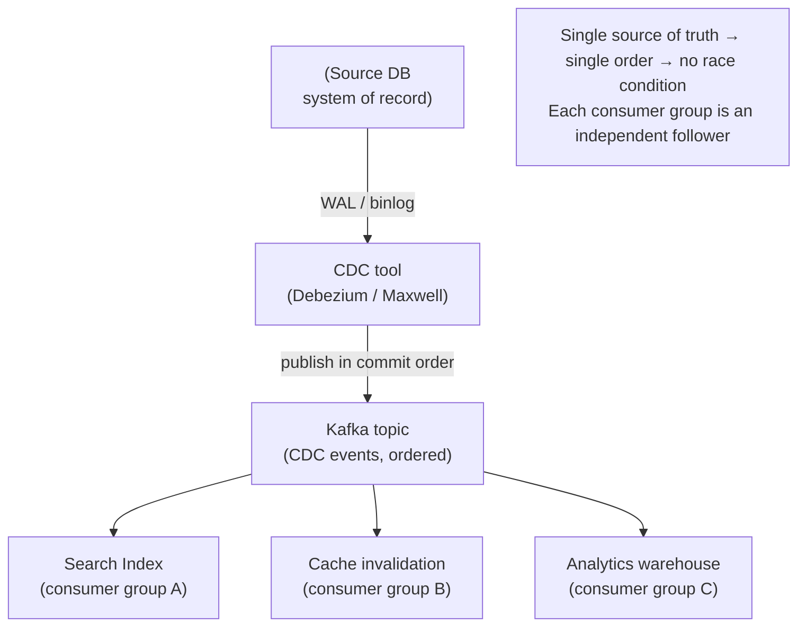
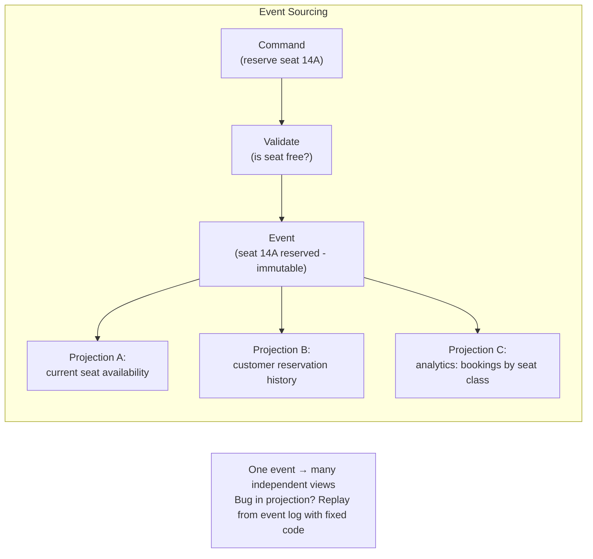

# Change Data Capture & Event Sourcing

**Prerequisites:** Topic 10 (replication log), Topic 30 (messaging/Kafka)
**Difficulty:** Advanced
**Interview importance:** ⭐ **Critical** — CDC is a standard architecture pattern in staff-level design
**Source:** Chapter 11 — "Keeping Systems in Sync", "Change Data Capture", "Event Sourcing", "State, Streams, and Immutability"

---

## 1. What Is It?

**Change Data Capture (CDC)** is the process of observing all changes written to a database and publishing them as an ordered stream of events, so that other systems can consume those changes and stay in sync. The source database is the system of record (leader); downstream systems (search index, cache, analytics warehouse) become followers, consuming the change stream.

**Event Sourcing** is an application design pattern where the primary representation of state is an **immutable, append-only log of events** (things that happened), not a mutable table of current state. Current state is a derived view — computed by replaying the event log from the beginning (or from a snapshot).

Both ideas share a common core: **mutable state and an immutable log of events are two sides of the same coin.** The log is the truth; current state is just the most recent materialization of it.

---

## 2. Why Does It Exist?

### The dual-write problem

Modern systems combine many specialized stores: an OLTP database + a search index + a cache + an analytics warehouse. Each holds its own representation of the same data. Keeping them in sync is the problem.

**Naive approach — dual writes:** the application writes to the database, then explicitly updates the search index, then invalidates the cache. Two hard problems:

1. **Race condition:** two concurrent clients each write to the database, then to the search index. The database sees writes in order A→B (B wins). The search index sees them in order B→A (A wins). Two systems are **permanently inconsistent** — no error, no detection. The lack of a single leader means there's no single ordering authority.

2. **Partial failure:** the database write succeeds but the search index write fails (network issue). Without an atomic commit protocol (2PC — expensive), one system has the update and the other doesn't.

**CDC solution:** treat the source database as the **single leader**. Tap its ordered write-ahead log (WAL / binlog). Publish that stream to Kafka. Every downstream system consumes the same ordered stream. Because all consumers see changes in the same order (the database's commit order), the race condition is structurally impossible — there's only one timeline.

### Event sourcing motivation

A mutable database records *state* — the current value of each row. It doesn't record *why* the state is what it is, or what path it took to get there. When you update a row, the history is gone.

Event sourcing records *facts* — things that happened — in an immutable log. State is a projection. This enables:
- Full audit trail (every action is recorded).
- Time travel (replay the log to any point in time).
- Multiple derived views (replay the same log into different representations: an event like "user added item to cart" can produce a cart view, a purchase-propensity view, and an A/B testing event).
- Bug recovery (the buggy application wrote incorrect state; replay the log with fixed code to produce correct state).

---

## 3. Simple Explanation

**CDC:** the database keeps a diary (WAL). CDC reads that diary and broadcasts each entry as an event. Downstream systems (search index, cache, warehouse) receive those diary entries in order and apply them — they become synchronized followers. The application doesn't need to know about them; it just writes to the database normally.

**Event sourcing:** instead of storing "Alice's balance is ₹1,000," store "Alice deposited ₹500" and "Alice withdrew ₹200." The balance (₹1,000) is derived by replaying the events. The events are never deleted — they are facts. If you need to know Alice's balance at any historical point, replay to that point.

**The connection:** CDC captures low-level storage changes (row updates, deletes) from the database internals. Event sourcing records high-level, intentional, domain events ("order placed," "enrollment cancelled") designed at the application level. Both use an append-only log as the source of truth.

---

## 4. Real-World Analogy

**CDC:** a bank's main ledger is updated by tellers. A stenographer (CDC) sits beside every teller and writes down every transaction in a separate notebook (the change stream). Other departments — the credit team, the fraud department, the quarterly reports team — each get a copy of the notebook and stay current by reading it. They never need to bother the teller directly; the notebook keeps them synchronized.

**Event Sourcing:** accounting double-entry bookkeeping. Every transaction is recorded as an immutable journal entry ("debit accounts receivable ₹1,000 / credit revenue ₹1,000"). The balance sheet and income statement are derived reports — computed from the journal. The journal is never overwritten; corrections are new entries. This is exactly event sourcing, centuries old in accounting.

---

## 5. Technical Explanation

### Change Data Capture

**Implementation methods:**

1. **Database triggers:** register triggers on tables that insert into a changelog table on every write. Fragile, high overhead, hard to maintain. Generally avoided.

2. **Log-based CDC (preferred):** parse the database's internal replication log — PostgreSQL WAL (via `pgoutput` or `wal2json`), MySQL binlog (via Debezium, Maxwell), MongoDB oplog (via Mongoriver). The CDC tool reads the log *exactly as the replication follower would*, ensuring the change stream matches the database's actual commit order. Tools: **Debezium** (open source, supports Postgres, MySQL, MongoDB, Oracle, SQL Server), **Maxwell** (MySQL), LinkedIn's **Databus**, Facebook's **Wormhole**.

3. **First-class API:** some databases expose change streams directly — RethinkDB, CouchDB change feeds, MongoDB change streams, Firebase Realtime Database, VoltDB export streams. These are more reliable than log-parsing.

**CDC topology:** source database → CDC tool → Kafka topic (one event per row change, in commit order) → multiple consumer groups (search indexer, cache invalidation, analytics ETL, etc.).

Because Kafka preserves order within a partition and CDC partitions by primary key, all changes to a given record arrive at the same consumer in the order they were committed. The race condition of dual writes is impossible.

**Initial snapshot:** a new derived system can't just start consuming changes from now — it needs the full current state first. The standard procedure: take a consistent database snapshot (a full dump, coordinated with the CDC log position), import it into the derived system, then start consuming the CDC stream from that log position. Some CDC tools (Debezium) automate this.

**Log compaction for CDC:** in Kafka, a **compacted topic** retains only the most recent event per key (primary key). This means a new consumer starting from offset 0 on a compacted CDC topic gets the full current state without needing a separate snapshot — Kafka itself becomes a queryable current-state store. Old events for a key are garbage-collected automatically, keeping disk usage proportional to the current database size rather than cumulative change volume. Deletions are represented as **tombstones** (a message with a null value for the key), which compaction eventually removes.

**Asynchronous nature:** CDC is usually asynchronous — the source database commits and moves on; the CDC pipeline delivers changes to consumers shortly after but not synchronously. All the replication-lag issues from Topic 11 apply: a consumer may be seconds or minutes behind the source, and reads from a derived system right after a write may return stale data.

### Event Sourcing

**The core design:** the application stores events — intentional, domain-level records of things that happened — in an append-only log. Events are facts; they cannot be deleted or modified. The application state (what users see) is a **projection** — a view derived by replaying events through a deterministic function.

Examples of event-level modeling:
- Instead of: `UPDATE enrollments SET status='cancelled' WHERE id=42`
- Store: `{type: "EnrollmentCancelled", enrollment_id: 42, reason: "schedule conflict", at: ...}`

This captures intent rather than mechanism. If a new business rule says "when an enrollment is cancelled, offer the spot to the waitlist," that new behavior is just another consumer of the `EnrollmentCancelled` event — the existing event log doesn't need to change.

**Deriving current state:** applications need to show users the current state (e.g., current cart contents, not a history of add/remove events). Projections are built by replaying events. For performance, **snapshots** of the current state are taken periodically; on restart, load the snapshot and replay only events since that snapshot.

**Commands vs events — a crucial distinction:**

- A **command** is a request that might fail (e.g., "reserve seat 14A"). It must be validated first (is the seat available?). If validation succeeds, it becomes an event.
- An **event** is a fact that already happened (e.g., "seat 14A reserved for customer 789"). Events are immutable. Consumers cannot reject them.

This distinction matters for uniqueness constraints: you can't just log an event "username X registered" without first checking that username X doesn't exist. Validation must happen synchronously (using a serializable transaction or linearizable compare-and-set) before the event is committed. The event log itself has no uniqueness semantics — that's the application's job before writing.

**Deriving multiple views from the same event log:** because the event log is the source of truth, you can build multiple different read-optimized views (projections) from the same events. A social network might have: a timeline view (fan-out by follower), a user profile view (denormalized card), an analytics view (engagement metrics per post), an ML training dataset — all derived by replaying the same event log through different transformation functions. This is **CQRS** (Command Query Responsibility Segregation) in its natural expression: writes go to the event log; reads come from purpose-built projections.

**Advantages of immutability:**

- **Audit trail:** every change is recorded — critical for finance, compliance, debugging.
- **Bug recovery:** buggy code wrote incorrect state; replay the event log with fixed code → correct state. Without the log, you'd have to restore a backup and reapply all subsequent changes manually.
- **Analytical richness:** the event "added to cart then removed" is richer than the derived state "item not in cart" — you can build abandonment-rate analysis from events that a mutable database would discard.
- **Evolutionary schema:** add a new derived view (new index, new projection) without changing the event schema or existing projections.
- **Concurrency simplification:** if the event log and application state are co-partitioned (events for customer 42 go to partition 42; state for customer 42 is in partition 42), a single-threaded consumer processes events serially — no concurrency control needed. The log defines the total order.

**Limitations of immutability:**

- **High-churn workloads:** if the same key is updated millions of times, the log grows unboundedly; compaction helps for CDC events (keep latest per key) but for event-sourced designs where every event matters, the full log must be kept. Performance of compaction and GC becomes critical.
- **Privacy / right to erasure:** GDPR and similar regulations may require deleting a user's personal information. A truly immutable log makes this hard. Solutions: encrypt events with per-user keys and delete the key (cryptographic erasure); or use a "selective delete" (Datomic's excision, Fossil's shunning) — but deleting from a distributed log that has been replicated and backed up is notoriously difficult. The honest answer is: immutable logs and the right to be forgotten are in tension, and there's no clean solution.

### The deep connection: state as an integral of events

The book's beautiful framing:

> **Application state = integral of the event stream over time.**
> **Change stream = derivative of the application state over time.**

Mutable state and an immutable event log are mathematically dual. Current state is just the compact, read-optimized form of the event history. The event log is the full, time-indexed form of the state.

This is also why the replication log (Topic 10), Kafka (Topic 30), WAL-based CDC, event sourcing, and total order broadcast (Topic 24) are all the same fundamental idea: an ordered, immutable record of changes, from which any view can be derived deterministically.

---

## 6. Diagrams





---

## 7. Concrete Example

**E-commerce system: keeping product catalogue consistent across Elasticsearch, Redis, and Redshift.**

Without CDC, each product update requires writing to MySQL, then Elasticsearch, then invalidating Redis, then streaming to Redshift. Race conditions and partial failures corrupt data.

With CDC:
1. The application writes to MySQL only.
2. Debezium reads MySQL's binlog and publishes a Kafka message per change (`product_id` as partition key — all changes to the same product arrive in order).
3. **Elasticsearch consumer group:** reads Kafka, performs Elasticsearch upsert for changed products.
4. **Redis consumer group:** reads Kafka, invalidates or overwrites the Redis cache key.
5. **Redshift consumer group:** reads Kafka, appends to an S3 staging file, periodically `COPY` into Redshift.

When a new **mobile search service** is added, it creates a new consumer group, seeks to offset 0 of the compacted Kafka topic, and gets the full current product catalogue — no snapshot required from MySQL.

The MySQL database, Elasticsearch, Redis, and Redshift can all drift slightly (asynchronous replication lag), but they're eventually consistent. There are no race conditions: all four systems see MySQL's commit order. The approach to consistency is the same as follower replication from Topic 10 — and for the same reason.

---

## 8. When to Use / Not Use

**Use CDC when:** you need multiple stores (database + search + cache + warehouse) in sync; you want to decouple the application from downstream systems; you're replacing dual writes with a reliable pipeline; you need reprocessing capability (replay to rebuild an index from scratch); you want event streaming without changing application code.

**Use Event Sourcing when:** audit trail is required; you need time-travel / point-in-time queries; the domain has natural, intentional events worth capturing at the application level; you want schema evolution flexibility (new projections without schema migration); rebuilding state from scratch after bugs is important.

**Avoid Event Sourcing when:** the event log would grow extremely large (high-churn, small dataset); GDPR/right-to-erasure requirements conflict with immutability; the team isn't experienced with the pattern — it takes discipline to design events correctly, and mistakes in the event schema are hard to fix in an immutable log.

**Avoid CDC when:** latency requirements are strict (CDC is asynchronous — seconds of lag); transactional consistency across the source and derived system in the same request is required (use 2PC or same-transaction writes instead); the source database doesn't support reliable log-based CDC.

---

## 9. Advantages & Disadvantages

**CDC advantages**
- Single source of truth → single ordering → no dual-write race conditions.
- Application code stays simple (just writes to the DB).
- Adding new consumers (new search index, new analytics tool) doesn't touch the application.
- Log compaction provides full-state bootstrap without snapshots.
- Reprocessing: replay the CDC stream to rebuild any derived system from scratch.

**CDC disadvantages**
- Asynchronous → eventual consistency between source and derived systems.
- CDC pipeline is operational overhead to manage and monitor.
- Log-based CDC is tied to database internals; schema changes require CDC tool reconfiguration.
- No guarantee of consistency within a single request across systems.

**Event Sourcing advantages**
- Full audit trail; debugging by replaying history.
- Multiple independent projections from one event log.
- Schema evolution: new projections without schema migration.
- Concurrency simplification for partitioned single-threaded consumers.
- Richer data: captures intent, not just state.

**Event Sourcing disadvantages**
- Commands need synchronous validation before becoming events (uniqueness, constraints).
- Read-after-write lag if projections are async.
- Log grows indefinitely for high-churn data without compaction.
- Tension with GDPR / right to erasure.
- Design discipline required: poorly designed events in an immutable log are painful to fix.

---

## 10. Trade-off Table

| Approach | Sync guarantee | Application coupling | Replay | Complexity |
|---|---|---|---|---|
| Dual writes | None (race conditions) | High (app writes to all) | None | Low (simple but broken) |
| CDC (async) | Eventual consistency | Low (app writes DB only) | Yes (from Kafka) | Medium (CDC tool + Kafka) |
| CDC (sync, 2PC) | Strong | High | Yes | High (2PC overhead) |
| Event sourcing | Eventual (async projections) | Event-driven (app writes events) | Yes (full replay from log) | High (discipline + tooling) |

---

## 11. Failure Scenarios

| Scenario | CDC handling | Event sourcing handling |
|---|---|---|
| Search indexer crashes | Kafka offset preserved; restart from last offset; replay missed changes | Same (Kafka-backed event log) |
| Source DB WAL truncated before CDC consumed | Derived systems fall behind; must re-snapshot and replay | N/A (event log is the DB) |
| Buggy code writes bad data to the source DB | CDC propagates bad data to all derived systems; need to correct source and re-derive | Replay event log with corrected projection code; bad events may still be in the log (insert compensating events) |
| GDPR deletion request | Must delete from source DB AND all derived systems AND Kafka log — hard | Cryptographic erasure (delete the encryption key) or platform-specific excision |
| New consumer added | Seek to offset 0 of compacted topic → full current state | Seek to offset 0 → replay all events → current projection |
| Schema change in source DB | CDC tool may need reconfiguration; downstream consumers may need schema evolution | New event types can coexist; old event types should still be processable |

---

## 12. Production Considerations

- **Use Debezium for most SQL databases** — it's the mature, battle-tested open-source CDC tool; supports Postgres, MySQL, Oracle, SQL Server, MongoDB, and more.
- **Partition CDC Kafka topics by primary key** — ensures all changes to the same entity arrive in order at the same consumer partition.
- **Use a compacted Kafka topic** for CDC state — enables bootstrapping new consumers without DB snapshots.
- **Monitor consumer lag per consumer group** — if the analytics consumer falls 2 hours behind, it's at risk of missing messages if the topic retention expires.
- **Design consumers to be idempotent** — CDC is at-least-once; a crash may replay events.
- **Handle schema changes carefully** — coordinate between the source DB schema change and the CDC consumer schema update; use Avro + schema registry for type safety.
- **For event sourcing:** snapshot state periodically — replaying 5 years of events on every restart is impractical. Snapshot + replay-since-snapshot is the standard.
- **Validate commands synchronously before appending events** — uniqueness constraints and cross-entity invariants must be checked before writing to the event log, not after.
- **Consider the right-to-erasure problem before committing to event sourcing** — if you're in a GDPR-relevant domain, plan the deletion strategy upfront.

---

## ❌ 13. Common Mistakes

- **Dual writes instead of CDC** — the race condition is real and silent; it will bite you in production under concurrency.
- **CDC via database triggers** — fragile, high overhead, hard to maintain. Use log-based CDC (Debezium).
- **Not monitoring consumer lag** — consumers silently falling behind is the most common operational failure in CDC pipelines.
- **Mixing commands and events in event sourcing** — a command ("register username X") is not yet an event; it must be validated first. Skipping validation before writing to the event log means you'll have invalid events that consumers must somehow handle.
- **Assuming immutable events can always be fully deleted** — they can't (backups, replicas, consumers that have already processed them). Plan for GDPR upfront.
- **Not snapshotting projections** — full replay from offset 0 for large event logs is slow. Snapshot + replay-since-snapshot is required.
- **Using event sourcing when a mutable database with CDC would suffice** — event sourcing adds significant complexity; don't use it unless the audit trail and multi-projection benefits are genuinely needed.

---

## 🧠 14. Think Like an Engineer

```
Need multiple stores (DB + search + cache + warehouse) in sync?
   → CDC: app writes DB only; CDC publishes to Kafka; consumers follow
        ↓
Is dual writes causing race conditions or partial failures?
   → YES — replace with CDC (Debezium → Kafka)
        ↓
Do I need audit trails, time-travel, multiple projections?
   → Event sourcing worth considering
        ↓
For CDC:
   Partition by primary key → ordered per entity
   Compacted topic → full bootstrap without snapshot
   Monitor consumer lag → alert before falling off retention window
   Idempotent consumers → safe reprocessing
        ↓
For event sourcing:
   Validate commands synchronously before they become events
   Snapshot projections periodically (don't full-replay on every restart)
   Plan right-to-erasure strategy upfront if GDPR-relevant
        ↓
Both: asynchronous → eventual consistency. Accept read-after-write lag or mitigate (route own-writes back to source).
```

---

## 15. Mental Model

```
Dual writes: application writes to N systems → race conditions + partial failures
      ↓
CDC: one system of record → one ordered change stream → N followers
   = database replication, but across different storage technologies
      ↓
Event sourcing: events (facts) are primary; state is a derived projection
   = the immutable log IS the truth; projections are views
      ↓
Both: mutable state ↔ immutable log of changes are dual representations
   State = integral of events
   Change stream = derivative of state
      ↓
Log compaction: keep only the latest event per key → current state without full replay
Snapshots: periodic current-state saves for fast restart
```

---

## 🔗 16. How This Connects to Other Concepts

- **Replication Log (Topic 10)** — CDC is the externalization of the replication log to other systems (Debezium reads the WAL exactly as a follower would).
- **Messaging & Kafka (Topic 30)** — Kafka is the durable transport for CDC events; log compaction is the same idea as LSM-tree compaction.
- **Log-Structured Storage (Topic 6)** — LSM-tree compaction = Kafka log compaction = event sourcing snapshot — the same idea at three different levels.
- **Read-After-Write (Topic 11)** — CDC's asynchronous replication means the same read-lag anomalies; same mitigations.
- **2PC (Topic 25)** — CDC avoids it by making the source DB the single authority (no cross-system atomic writes needed).
- **Stream Processing (Topic 32)** — CDC events flowing through Kafka are the input to stream processors.
- **Correctness (Topic 35)** — idempotent consumers and deduplication are the mechanism for end-to-end correctness in CDC pipelines.

---

## 17. Interview Questions & Answers

**Beginner**

**Q: What is change data capture?**
It's the process of observing every change written to a database and publishing those changes as an ordered event stream, so downstream systems can consume them and stay in sync. The source database is the single system of record and leader; derived systems like search indexes, caches, and analytics stores are followers, consuming the change stream exactly as database replicas consume a replication log.

**Q: What's wrong with dual writes?**
Two problems. Race conditions: if two clients concurrently update the same record, the database may see them in one order and the search index in the other — both systems silently diverge, with no error. Partial failures: the database write succeeds but the cache update fails — now they're inconsistent, and making both succeed or both fail requires 2PC, which is expensive. CDC avoids both by making the database the single authority; all downstream systems see changes in database commit order.

**Intermediate**

**Q: How does log compaction in Kafka relate to CDC?**
In a CDC Kafka topic, each message represents a row change, keyed by the row's primary key. Kafka log compaction keeps only the most recent message per key, discarding older values. The result is that the compacted topic contains the full current state of the source database — the latest value of every key. A new consumer starting from offset 0 on the compacted topic gets the entire current database state without needing a separate snapshot from the source, and then continues consuming new changes as they arrive. This makes the Kafka topic itself a usable current-state store for CDC bootstrapping.

**Q: What's the difference between CDC and event sourcing?**
CDC works at a lower level of abstraction — it captures raw storage changes (row inserts, updates, deletes) from the database's internal write-ahead log, without the application being aware of it. The application writes to the database normally; CDC taps the log. Event sourcing works at the application level — the application explicitly stores domain events ("enrollment cancelled") in an append-only log, and mutable state is a derived projection. CDC is about keeping derived systems in sync with an existing database. Event sourcing is a design pattern where the event log is the primary representation of data and state is a view of it.

**Advanced / Staff**

**Q: Design a system to keep an Elasticsearch search index synchronized with a PostgreSQL database for a product catalogue.**
I'd use CDC via Debezium, which reads PostgreSQL's WAL using logical decoding and publishes a Kafka message for every row change in the products table, partitioned by product_id. Partitioning by product_id ensures all changes to the same product arrive in order at the same Elasticsearch indexer partition, so there are no out-of-order updates. The Elasticsearch consumer group reads the Kafka topic and performs upserts (idempotent by product_id) — so at-least-once Kafka delivery is safe. For initial load, I'd use a Kafka compacted topic: Debezium will include the initial snapshot as a series of "create" events starting from offset 0; the compacted topic retains the latest state for each key, so a fresh Elasticsearch index can be built by consuming from offset 0 without a separate dump from Postgres. For lag monitoring, I'd alert if the consumer group falls more than a configurable number of messages or minutes behind. The one thing I'd accept is that after a product update in Postgres, the search index may be a few seconds behind — if the application needs read-after-write consistency for the user who made the update, I'd route their immediate search to Postgres or add the updated product to a per-user cache that the search result merges from.

**Q: Explain how event sourcing simplifies concurrency control compared to a mutable database.**
In a traditional mutable system, concurrent writes to the same or related entities require concurrency control — locking, optimistic concurrency, or serializable transactions. In event sourcing with a partitioned architecture, events for a given entity (say, customer ID 42) all go to the same log partition. The consumer for partition 42 processes events for customer 42 sequentially — by construction, it sees them one at a time in the committed order. No locks needed for that entity's state. The log itself defines the total serial order within a partition, replacing the role that transaction ordering plays in a database. The downside is that events touching multiple entities (two partitions) need additional coordination — you might use the two-step command/event approach: validate cross-entity invariants synchronously before writing the event, or use a saga/process manager that sequences multiple single-entity events. But for the common single-entity update, the single-threaded log consumer gives you effectively serializable behavior with no concurrency overhead.

---

## 🎯 30-Second Interview Answer

> "Change data capture taps the database's write-ahead log, publishes every change as a Kafka event in commit order, and lets downstream systems — search indexes, caches, analytics stores — consume that stream as followers. This replaces dual writes, which suffer from race conditions (the database and search index can see two concurrent writes in different orders) and partial failures, with a single system of record whose commit order is the one truth. Kafka log compaction lets a new consumer rebuild the full current state without a database snapshot. Event sourcing is a higher-level pattern where the primary representation is an immutable event log — domain events like 'order placed' or 'enrollment cancelled' — and current state is a derived projection. The event log can produce many independent views, enables full audit trails, and makes bug recovery easy — replay with fixed code. The deep connection: mutable state and an immutable event log are dual: state is the integral of the event stream. Both CDC and event sourcing face the same eventual-consistency issue — async consumers may lag — and both require idempotent downstream writes because Kafka delivers at-least-once."

---

## ⚡ Quick Revision

- **Dual writes' two problems:** (1) **race condition** — DB and search index see concurrent writes in different orders → silent permanent divergence; (2) **partial failure** — one write succeeds, other fails → inconsistency.
- **CDC:** source DB (leader) → WAL/binlog → CDC tool (Debezium) → Kafka → downstream consumers (followers). **Single ordering → no race condition.** App only writes to DB.
- **CDC implementation:** log-based (Debezium parsing WAL/binlog) preferred over triggers (fragile/slow). Some DBs have first-class APIs (Mongo change streams, RethinkDB).
- **Initial snapshot:** take a consistent DB snapshot at a known log position, import to the derived system, then consume CDC from that position.
- **Kafka log compaction for CDC:** keeps latest value per key → full current state from offset 0 → no snapshot needed for new consumers. Deletions = tombstones.
- **CDC is async** → eventual consistency → same read-lag issues as follower replication (Topic 11).
- **Event sourcing:** primary representation = immutable **event log** (things that happened). State = **projection** (replay of events). Events are facts; they cannot be rejected by consumers.
- **Command vs event:** command = request that might fail (must validate first). Event = fact (already happened, immutable). Uniqueness must be checked synchronously before writing the event.
- **Advantages:** audit trail, time-travel, multiple projections, bug recovery (replay with fixed code), concurrency simplification per partition.
- **Limitations:** right-to-erasure tension (GDPR), log growth for high-churn data, projection lag (eventual consistency).
- **Snapshots** for projections — full replay at startup is impractical for large logs.
- **Deep connection:** state = integral(events), change stream = derivative(state). Same idea as: replication log, Kafka, WAL, event sourcing, total order broadcast.
