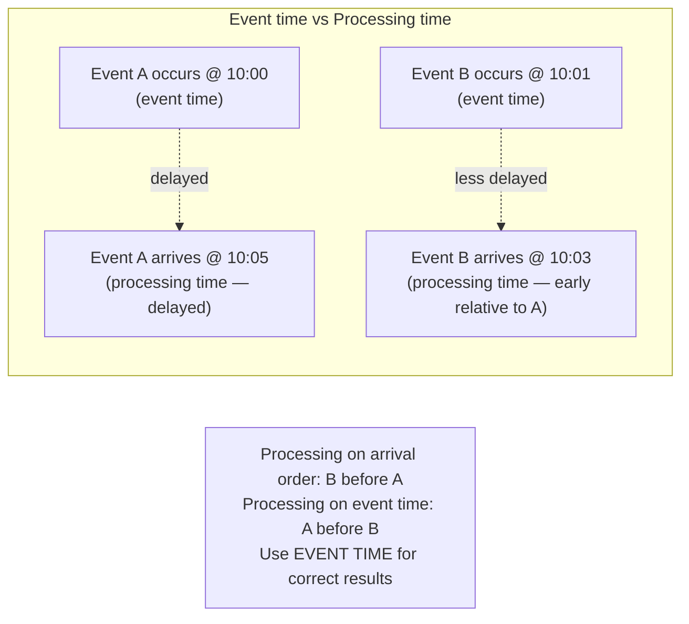
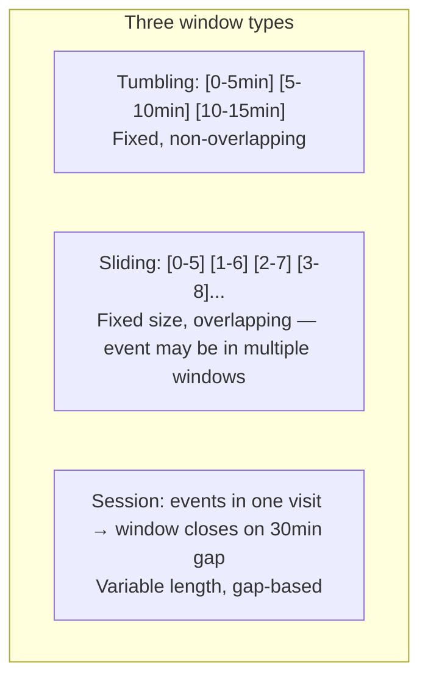
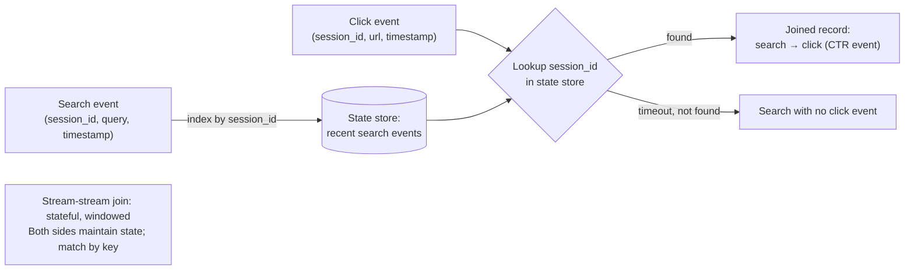

# Stream Processing

**Prerequisites:** Topics 27 (batch processing), 30 (messaging/Kafka), 31 (CDC/event sourcing)
**Difficulty:** Intermediate
**Interview importance:** ⭐ **Critical**
**Source:** Chapter 11 — "Processing Streams", "Reasoning About Time", "Stream Joins"

---

## 1. What Is It?

**Stream processing** is computing over a continuous, unbounded sequence of events — processing each event (or small window of events) as it arrives, rather than accumulating a full dataset first.

Where batch processing reads a bounded input, computes, and writes output (Topic 27), stream processing works on an **infinite, append-only input stream** and continuously produces output. It generalizes batch processing to the case where the input never ends.

The primary use cases: **fraud detection, real-time analytics, maintaining materialized views, search-on-streams (CEP), stream joins, and driving notifications/alerts.**

---

## 2. Why Does It Exist?

Batch processing is right for the daily analytics report or the weekly ML model retraining. But many valuable computations need results within **seconds**, not hours:

- Fraud detection can't wait until end-of-day to flag a stolen card.
- A site reliability team needs to know when error rate crosses 5% *now*, not tomorrow.
- A recommendation engine that updates only nightly misses the user's current session context.

Stream processing is the answer: the same transformation logic as batch, applied continuously to an unbounded input. The key insight the book states: **streaming is batch processing with smaller and smaller batches**, eventually converging to one event at a time. All the same ideas apply — joins, aggregations, filters — over a sliding or tumbling window of time rather than over a fixed dataset.

---

## 3. Simple Explanation

**Batch:** "Process all of last month's transactions, produce a fraud report."
**Stream:** "For every transaction that arrives, check it against recent history; if suspicious, alert immediately."

Three core concepts:
- **Event time vs processing time** — the clock the computation uses matters enormously.
- **Windows** — how you group a stream into chunks to aggregate over (tumbling, sliding, session).
- **Stream joins** — joining two or more streams, which is harder than batch joins because the streams are infinite and events can arrive late.

---

## 4. Real-World Analogy

**Batch processing:** a bank that processes all ATM transactions at midnight, then mails out a daily fraud report.

**Stream processing:** a bank that, for every ATM swipe as it happens, checks it against the cardholder's last 24 hours of activity and their location history, and declines it in real-time if it looks fraudulent.

The same "check against history" logic, the same joins against customer profiles — but applied incrementally as events arrive, with a result in milliseconds rather than 12 hours. The complication: the stream processor must maintain running state (the last 24 hours of activity) across an infinite stream, and must handle events that arrive out of order.

---

## 5. Technical Explanation

### Uses of stream processing

**Complex event processing (CEP):** detecting patterns across multiple events — "a login, followed by a password change, followed by a large transfer within 10 minutes" is a fraud pattern. CEP engines store long-running queries and match incoming events against those patterns. The data flows past stored queries (opposite of a database, where queries flow past stored data). Examples: Esper, IBM InfoSphere Streams.

**Stream analytics:** computing metrics continuously — requests per second, 99th-percentile latency over the last 5 minutes, rolling average throughput. Uses **windows** for aggregation. Probabilistic approximations (HyperLogLog for cardinality, Bloom filters, T-Digest for percentiles) reduce memory while accepting small error bounds — useful because exact computation is often too expensive for real-time.

**Materialized view maintenance:** keeping a derived data system (cache, search index, denormalized read table) continuously up to date as source data changes. Unlike windowed analytics, this needs **all events since the beginning of time** — an infinite window. CDC (Topic 31) feeds these.

**Search on streams:** storing search queries and matching each incoming document against all stored queries. The Elasticsearch percolator does this — you register a query ("alert me for any article mentioning 'merger talks' and 'Acme Corp'") and it matches new articles as they're indexed.

### Event time vs processing time — the critical distinction

**Processing time:** the clock on the machine running the processor when an event is processed. Simple — just use `System.currentTimeMillis()`. But misleading: if the processor restarts and processes a backlog, all those events appear to arrive "now" — a 5-minute window on processing time would spike during the catchup, even though the actual event rate was steady.

**Event time:** the timestamp embedded in the event — when the event actually occurred. Correct for analysis. But: events arrive **late** and **out of order**. A mobile device offline for an hour produces events with timestamps from an hour ago when it reconnects. A server B processes a request and emits an event that reaches the broker before the earlier request from server A, reversing their order.

**The Star Wars analogy from the book:** Episode IV was released in 1977, Episode I in 1999. If you watch them in release order, processing time order ≠ narrative (event time) order. Stream processors must be designed for this.

Using **processing time for analytics is usually wrong.** Use event time and accept the complexity of late arrivals.

### Knowing when you're ready (watermarks and stragglers)

When aggregating by event time (e.g., "count events per 1-minute window"), you need to know when you've received all events for a window. You can never be certain — a network blip could delay events indefinitely. Two strategies:

- **Watermarks:** a progress signal that says "I'm confident no more events with a timestamp before T will arrive." Watermarks advance as newer events arrive; they're typically set slightly behind the latest event timestamp to accommodate typical delays. When the watermark passes the end of a window, that window is closed and emitted. Flink's mechanism.
- **Stragglers:** events that arrive after the window's watermark has already passed. Two options: (1) ignore them (track dropped count, alert if significant); (2) emit a correction — update the window's result when the straggler arrives. The correction may require retracting the previous result (negative contribution first, then new total).

Choosing the watermark lag is a **bias-variance trade-off:** aggressive watermark (small lag) → windows close quickly but may miss late events. Conservative watermark (large lag) → catches more stragglers but increases output latency.

### Window types

**Tumbling window:** fixed-size, non-overlapping buckets. A new window every 5 minutes: events go in the bucket for their event-time minute, bucket closes and emits at the end. Good for: "total events per minute," "hourly reports."

**Sliding window:** fixed-size, overlapping buckets. "Average over the last 5 minutes, updated every 1 minute." Each event may belong to multiple windows. More expensive. Good for: "rolling average," "is the rate too high right now?"

**Session window:** groups events by inactivity gap. A session ends when no event has been seen for (e.g.) 30 minutes. Session length is variable. Good for: "page views per user session," "time spent on site."

**Global window:** no time-based boundary — accumulates all events since the beginning. Useful for maintaining running totals or materialized views (e.g., Kafka Streams for CDC-driven state).

### Stream joins — three types

Stream joins are harder than batch joins because both inputs are infinite and events can arrive in any order. The processor must maintain **state** (a window of recent events or the full history of one side) to do the join.

**Stream-stream join (window join):** joining two streams where related events occur close in time. Example: join a search event with its corresponding click event (by session ID) to compute click-through rate. The processor maintains a window of recent search events in a state store (e.g., last 1 hour), indexed by session ID. When a click arrives, it looks up the matching search in the state store. When a search times out without a click, emit a "no click" record. Complexity: the click may arrive before the search (network delay), the window may be too short, and "close in time" must be defined.

**Stream-table join (stream enrichment):** enriching a stream of events with data from a slowly-changing table. Example: enrich user activity events with user profile data. Instead of querying the remote user database per event (slow, overloads the DB), the stream processor loads the table into local state and updates it by subscribing to the table's CDC stream. Now every profile update also flows through as events, keeping the local copy current. The processor joins against local state — fast, no network call.

**Table-table join (materialized view):** maintaining a denormalized materialized view that joins two tables, updating continuously. The Twitter timeline example: tweets and follows are two tables; the timeline cache is the join result. When a new tweet arrives, look up who follows the author and fan-out the tweet to each follower's timeline. When a user follows someone, add their recent tweets to the new follower's timeline. This is the streaming equivalent of materializing a JOIN query result, updated event-by-event.

**Time-dependence of joins:** if a user updates their profile, which activity events join the old profile and which the new? This ordering is nondeterministic when events from different streams interleave. In data warehousing this is the **slowly changing dimension (SCD)** problem. One solution: assign a unique version ID to each state of the table, and embed the version ID in the fact event — the join is then point-in-time correct and deterministic. But this prevents log compaction (you need all historical versions).

### Stream processing frameworks

**Apache Flink:** true event-by-event pipelining. Stateful processing with checkpointing. First-class event-time support with watermarks. Low latency (milliseconds). The most sophisticated production stream processor.

**Apache Kafka Streams:** a library (not a cluster) for building stream processors that read from and write to Kafka. Easy to deploy — it's just a Java application. Good for stateful stream processing close to Kafka.

**Apache Spark Streaming:** micro-batch — splits the stream into small batches (e.g., 1-second intervals) and processes each as a mini Spark job. Easier to reason about; higher latency than Flink (seconds, not milliseconds). Structured Streaming (newer Spark API) adds event-time support.

**Apache Storm:** early streaming system; low-latency but at-least-once only by default.

**Samza:** Kafka-native stream processor from LinkedIn.

---

## 6. Diagrams







---

## 7. Concrete Example

**Real-time fraud detection for a payments platform.**

Events: every card transaction arrives on a Kafka topic.

Stream processor (Flink):
1. **Stream-table join (enrichment):** enrich each transaction with the cardholder's recent history — their usual merchant categories, typical geographic range, average transaction size. The card profile table is loaded into Flink's local state store via CDC.
2. **Sliding window aggregation:** for each card, compute aggregate features over the last 1 hour (event time): number of transactions, total amount, distinct merchant categories, distinct countries.
3. **Pattern matching:** emit a fraud alert if: same card used in two countries within 20 minutes, or total amount in last 5 minutes exceeds the card's 90th percentile, or 5+ transactions in 1 minute.

Event time is essential: a transaction that happened at 14:00 but arrived at the processor at 14:05 (network delay) must be placed in the 14:00 window, not the 14:05 window, or the "two countries in 20 minutes" check fires on incorrect data.

Late events (offline mobile device payments from 2 hours ago): the watermark is set to "3 minutes behind latest event time," so most card-present delays are handled. Mobile offline payments are stragglers — they're flagged as late and logged but not used for real-time decisions (too stale).

---

## 8. When to Use / Not Use

**Use stream processing when:** latency matters — results needed in seconds, not hours; the input is a continuous stream of events; you need real-time alerting, monitoring, or materialized view maintenance; you need streaming ETL (enrich and write to another store continuously).

**Use batch processing when:** latency isn't critical; you want simpler fault tolerance; the input is bounded (a file, a day's log); you're doing complex ML training or full-graph analysis.

**Use a database with materialized views** when the logic is expressible in SQL and a dedicated stream processor would be overkill.

---

## 9. Advantages & Disadvantages

**Stream processing advantages**
- Low latency — results within milliseconds to seconds.
- Continuous output — always current, not just at the end of a batch.
- Handles unbounded inputs naturally.
- CDC + streaming = derived data stores always nearly-in-sync with the source.

**Stream processing disadvantages**
- Event time complexity (late events, out-of-order, watermarks, stragglers).
- Stateful joins require maintaining potentially large state stores.
- Fault tolerance is harder than batch (can't just retry from HDFS).
- Exactly-once semantics requires careful engineering (Topic 33).
- Debugging is harder — the state at the time of failure is ephemeral.

---

## 10. Trade-off Table

| Dimension | Batch | Micro-batch (Spark Streaming) | True streaming (Flink) |
|---|---|---|---|
| Latency | Minutes–hours | Seconds (batch interval) | Milliseconds |
| Event time support | Natural (timestamps in data) | Added (Structured Streaming) | First-class (watermarks) |
| Fault tolerance | Simple (HDFS rereads) | Checkpoint-based | Checkpoint-based |
| Late event handling | Natural (bounded input) | Supported | First-class (watermarks) |
| Stateful joins | Via shuffle | Via state | Via state + checkpoints |
| Complexity | Low | Medium | High |

| Window type | Shape | Good for |
|---|---|---|
| Tumbling | Fixed, non-overlapping | Hourly reports, rate-per-period |
| Sliding | Fixed, overlapping | Rolling averages, "over last N mins" |
| Session | Variable, gap-based | User sessions, activity grouping |
| Global | Infinite | Materialized views, running totals |

---

## 11. Failure Scenarios

| Scenario | Stream processing consequence | Mitigation |
|---|---|---|
| Processing time used for event-time windows | Backlog catchup → apparent spike | Use event-time timestamps in events |
| Late event arrives after window closes | Straggler — may be ignored or cause correction | Watermarks with defined straggler handling |
| Out-of-order events | Wrong window placement if using arrival order | Sort by event time per partition; watermarks |
| Stream-stream join: one side delayed | Unpaired events expire without a match | Widen the join window; handle unpaired events |
| State store grows unboundedly | OOM or slow joins | Bound state with retention (TTL per key) |
| Processor crashes mid-window | State lost → window incomplete | Checkpoint state periodically (Topic 33) |
| Mobile device events arrive hours late | Stragglers violate watermark assumptions | Log and discard (or handle with a late-data side output) |

---

## 12. Production Considerations

- **Always use event time for any time-based analytics** — processing time produces incorrect results on backlog processing or reprocessing.
- **Tune watermark lag carefully** — too aggressive and you drop real late events; too conservative and you add unnecessary latency.
- **Handle stragglers explicitly** — decide upfront: drop them and alert on count, or emit corrections. Don't silently lose data.
- **Bound state stores with TTL** — stream-stream join windows and other stateful operators accumulate unbounded state unless you explicitly expire old keys.
- **Checkpoint frequently for fast recovery** — the trade-off is checkpoint overhead vs recovery time. Flink's default is every 10 seconds; tune to your latency and recovery SLA.
- **Partition by the join/aggregate key** — all events for a given user or session must go to the same partition so the state store for that key lives on one machine.
- **Make downstream writes idempotent** — at-least-once delivery means the processor may emit duplicate records; idempotent writes prevent duplication.
- **Implement at-least-once first** and upgrade to exactly-once (Topic 33) only where the business requires it — exactly-once adds significant complexity.

---

## ❌ 13. Common Mistakes

- **Using processing time instead of event time** — real-time metrics go haywire during backlog processing or redeployment.
- **Ignoring late events** without monitoring how many are dropped — could be losing significant data.
- **Unbounded state in stateful operators** — a stream-stream join with no window expiry will eventually run out of memory.
- **Not partitioning by the key that drives joins/aggregations** — stateful operators across partitions don't share state; the join won't work.
- **Assuming watermarks eliminate late events** — they define a confidence threshold, not a guarantee; stragglers still arrive.
- **Stream-table joins against a live remote database** — per-event remote DB calls are slow and overload the DB; use local state updated via CDC.
- **Complicated exactly-once before you need it** — start with at-least-once + idempotent consumers (usually sufficient), escalate to Kafka Transactions only where necessary.

---

## 🧠 14. Think Like an Engineer

```
Is this computation time-sensitive (seconds, not hours)?
   → stream processing
        ↓
What's my time semantics?
   "When did this event OCCUR?" → event time (always prefer for analysis)
   "When did this event ARRIVE?" → processing time (only for true real-time monitoring)
        ↓
What kind of aggregation?
   Fixed period reports → tumbling window
   Rolling average ("last 5 min") → sliding window
   User sessions → session window
   Running total / materialized view → global window
        ↓
What joins do I need?
   Two event streams, close in time → stream-stream join (define time window; handle unpaired)
   Enrichment from a table → stream-table join (local state store, updated via CDC)
   Denormalized materialized view → table-table join (maintain per event)
        ↓
How do I handle late events?
   → watermarks (define confidence threshold)
   → stragglers: drop + alert, or emit correction
        ↓
State management:
   Bound all stateful operators with TTL
   Checkpoint frequently (Flink) or choose micro-batch (Spark Streaming)
```

---

## 15. Mental Model

```
Stream processing = batch processing with smaller and smaller batches → zero latency
      ↓
Unbounded input + stateful operators + time windows = stream processing
      ↓
Event time ≠ processing time:
   Use event time → watermarks → close windows → handle stragglers
      ↓
Three joins:
   Stream-stream: both sides in state; windowed match
   Stream-table: table in local state; updated via CDC (no remote DB calls)
   Table-table: materialized view; updated event-by-event
      ↓
Fault tolerance = checkpoint state + at-least-once delivery
   → idempotent downstream writes → effectively-once results
```

---

## 🔗 16. How This Connects to Other Concepts

- **Batch Processing (Topic 27)** — stream is the generalisation of batch to unbounded input; same join and aggregation logic.
- **Messaging & Kafka (Topic 30)** — Kafka is the input/output for stream processors; at-least-once Kafka delivery drives the fault-tolerance design.
- **CDC & Event Sourcing (Topic 31)** — CDC streams are the primary input for materialized-view maintenance; event sourcing projections are stream processors over the event log.
- **Clocks & Pauses (Topic 21)** — the event-time vs processing-time problem is the same clock unreliability problem; mobile device clock skew creates stragglers.
- **Stream Fault Tolerance (Topic 33)** — exactly-once semantics in stream processors: checkpointing + Kafka transactions.
- **Correctness (Topic 35)** — idempotent consumers and deduplication are the end-to-end correctness mechanism for stream output.

---

## 17. Interview Questions & Answers

**Beginner**

**Q: What is stream processing?**
Processing events as they arrive on a continuous, unbounded stream rather than accumulating a full dataset first. It generalises batch processing to inputs that never end, enabling low-latency results — seconds instead of hours — for things like fraud detection, real-time metrics, and keeping derived data stores continuously up to date.

**Q: What is the difference between event time and processing time?**
Event time is when the event actually occurred, recorded in a timestamp embedded in the event. Processing time is when the machine processes it, which may be much later — due to network delays, backlog, or a processor restart. Using processing time for time-based analytics is usually wrong: if you restart a processor and it processes a backlog, all those events appear to arrive "now," creating a false spike. Event time gives correct results but requires handling late-arriving and out-of-order events.

**Intermediate**

**Q: How do watermarks work in stream processing?**
A watermark is a progress signal saying "I'm confident no more events with a timestamp earlier than T will arrive." The watermark advances as new events arrive — typically set a bit behind the latest event timestamp to accommodate normal delays. When the watermark passes the end of a window, that window is closed and its result emitted. Events that arrive after the watermark has already passed their window are stragglers; you either ignore them (monitoring the drop count) or emit a correction. Setting the watermark lag is a trade-off: too aggressive misses late events, too conservative adds latency.

**Q: What are the three types of stream joins and when do you use each?**
A stream-stream join matches events from two streams that occur close in time — like joining search events with click events by session ID within a one-hour window, to compute click-through rate. The processor maintains both sides in state and looks for matches within the time bound. A stream-table join enriches a stream with data from a slowly-changing table — like adding user profile data to activity events. Instead of querying the database per event (slow), you load the table into local state and update it via CDC; it's effectively a join between the activity stream and the changelog stream for the profile table. A table-table join maintains a denormalized materialized view that joins two tables continuously — like the Twitter timeline cache, which is the join result of tweets and follows, updated event-by-event whenever a new tweet or a follow/unfollow event arrives.

**Advanced / Staff**

**Q: Design a real-time leaderboard for a gaming platform that shows each user's score ranking, updated within 2 seconds of any score event.**
I'd use Flink as the stream processor, reading score events from Kafka. Each score event contains a user ID, game ID, and score delta. For the leaderboard I need two pieces of state: first, each user's total score (a running sum, keyed by user ID, updated with each score event); second, the global ranking. The ranking is the hard part — comparing all users' scores requires global state. I'd handle this by maintaining a sorted set of (score, user_id) in a state store, updating it on each score event (remove the user's old entry, add the updated one). For a global leaderboard this global state lives on one partition, which limits parallelism but keeps the sorted structure consistent. For very high event rates, I'd use approximate ranking — maintain the exact top-N and use probabilistic structures for the rest. The output is written to a Redis sorted set (ZADD — idempotent) after each update, from which the application reads. At-least-once delivery means a score event might be processed twice, so I'd include an event deduplication key (user_id + event_id) and check before applying. Event time: score events include a timestamp; I'd use event time to correctly sequence events that arrive out of order (from different game servers), applying a 3-second watermark for the expected network delay between game server and Kafka.

---

## 🎯 30-Second Interview Answer

> "Stream processing applies batch-style transformations — joins, aggregations, filters — to a continuous, unbounded input, producing low-latency results. The key complication is time: event time, when the event happened, is what you want for correct analytics, but events arrive out of order and late. Watermarks express confidence that no earlier events will arrive, used to close time windows and emit results; stragglers arrive after the watermark and are either dropped or trigger corrections. The three stream join types are stream-stream (both sides windowed in state, e.g., join search and click events), stream-table (enrich the stream from a locally cached table updated via CDC — never query the live database per event), and table-table (maintain a materialized join result event-by-event, like Twitter timelines). Fault tolerance is harder than batch — you can't just retry from HDFS since state is in memory — so stream processors checkpoint state periodically and use at-least-once delivery, relying on idempotent downstream writes for correct output."

---

## ⚡ Quick Revision

- **Stream processing** = batch processing with unbounded input. Same logic (joins, aggregations), applied continuously.
- **Event time** (when event occurred) ≠ **processing time** (when processor sees it). **Always use event time** for analytics; processing time → wrong results on reprocessing.
- **Late events / out-of-order:** caused by network delays, mobile offline, server skew. Unavoidable.
- **Watermarks:** progress signal — "no events before timestamp T will arrive." Closes windows. **Straggler** = event arriving after its watermark. Options: drop + alert count, or **emit correction**.
- **Window types:** tumbling (fixed, non-overlapping), sliding (fixed, overlapping — events in multiple windows), session (variable, gap-based), global (infinite — materialized views).
- **Three stream joins:**
  - **Stream-stream:** both in windowed state, match by key and time. Unmatched → emit "no match" on timeout.
  - **Stream-table:** table in local state store, updated via CDC. Never query remote DB per event.
  - **Table-table:** materialized view, updated event-by-event (Twitter timeline = tweets ⋈ follows).
- **SCD / time-dependence of joins:** which version of a table does an event join? Use versioned IDs for determinism.
- **Frameworks:** Flink (true streaming, event-time first-class, checkpointing), Kafka Streams (library, close to Kafka), Spark Streaming (micro-batch, seconds latency).
- **Fault tolerance:** checkpoint state + at-least-once delivery → idempotent consumers → effectively-once. Exactly-once (Topic 33) adds more machinery.
- **Bound all state stores with TTL** — unbounded state = OOM.
