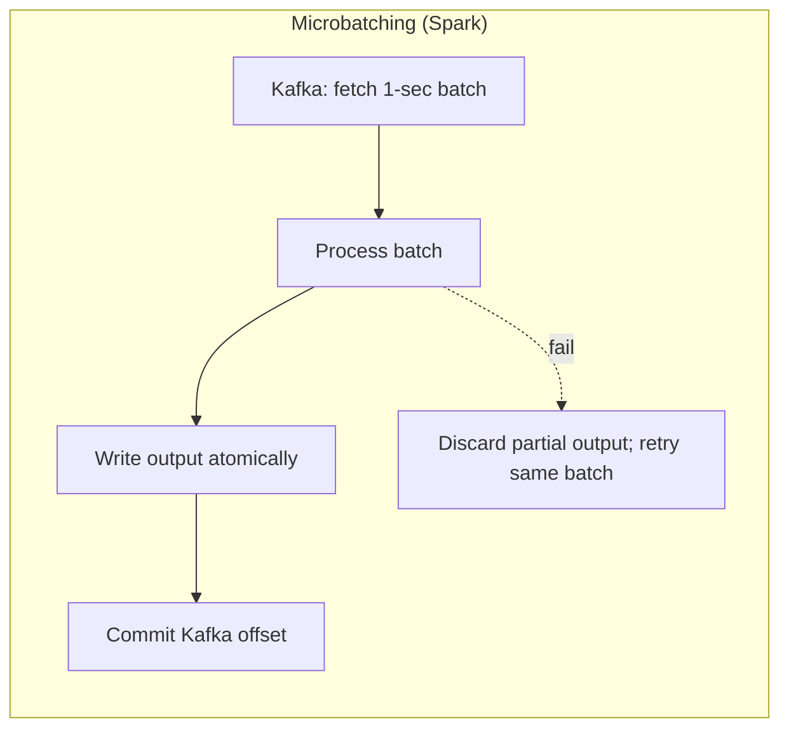
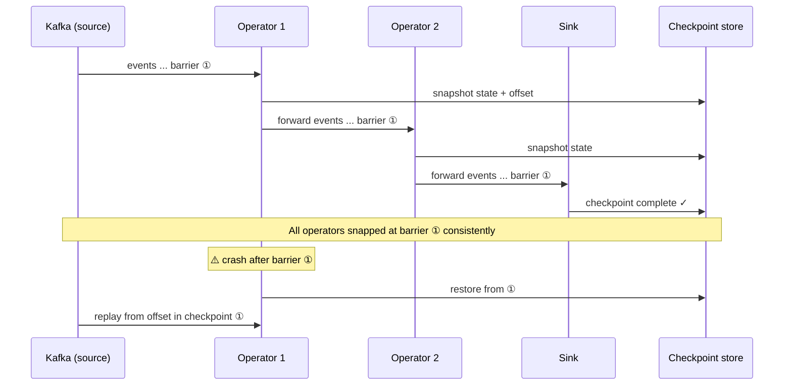
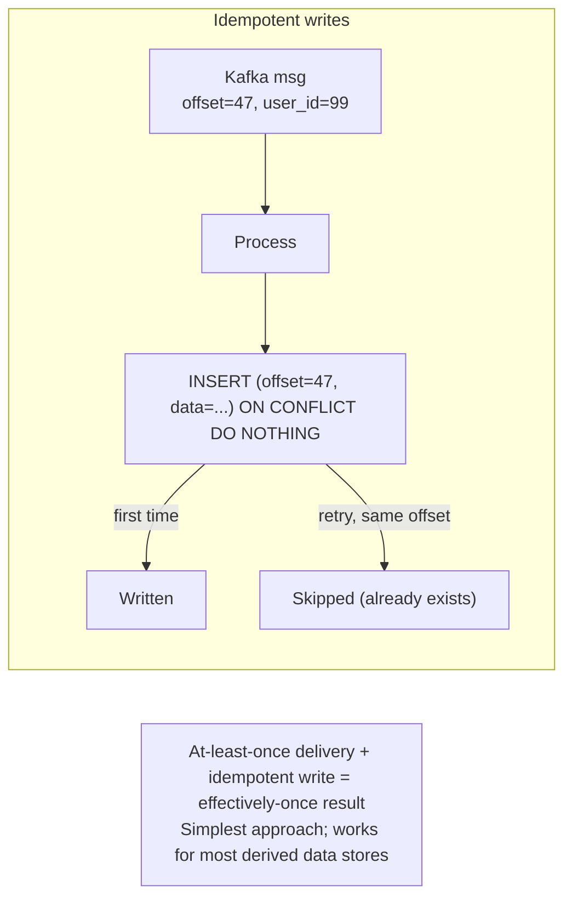

# Stream Fault Tolerance & Exactly-Once Semantics

**Prerequisites:** Topics 27 (batch fault tolerance), 30 (Kafka/at-least-once), 32 (stream processing)
**Difficulty:** Advanced
**Interview importance:** High
**Source:** Chapter 11 — "Fault Tolerance" (stream section)

---

## 1. What Is It?

**Exactly-once semantics** in stream processing means that even if there are failures — crashed processors, network partitions, retries — each input event has the same *effect* as if it were processed exactly once. No duplicates in the output, no missing events.

Batch processing gets this essentially for free: failed tasks re-read immutable input from HDFS and overwrite partial output atomically. Stream processing is harder: the stream is infinite, so you can never "wait until the job is done" before making output visible.

Three mechanisms for stream fault tolerance:
1. **Microbatching** (Spark Streaming)
2. **Checkpointing with barriers** (Flink)
3. **Idempotent writes** — the simpler, usually-sufficient alternative

---

## 2. Why Does It Exist?

In batch processing, the retry model is clean: re-read the same input from HDFS, recompute, overwrite output. Because input is immutable and output is atomic (visible only when the whole job succeeds), the result is exactly-once.

In stream processing:
- The stream is **infinite** — you can't wait for "the job to finish."
- Output is **continuous** — results flow out constantly; you can't discard them all and restart.
- State is **in-memory** — a crashed processor loses its window accumulators, join state, and aggregation buffers.

So after a failure and restart, the processor must:
1. Restore its **state** to a consistent point in time.
2. Replay **input events** from that point.
3. Ensure any **output** it already emitted isn't duplicated downstream.

Getting all three right simultaneously is exactly-once semantics.

---

## 3. Simple Explanation

**Batch approach (why it's easy):** read immutable input → compute → write output atomically. Crash mid-way? Just redo it; the input is unchanged, the partial output is discarded.

**Microbatching (Spark Streaming):** cut the infinite stream into tiny batches (1 second each). Process each batch like a mini-batch job. If the batch fails, retry it. Pros: simple, inherits batch's exactly-once. Cons: latency = batch interval (seconds, not milliseconds).

**Checkpointing with barriers (Flink):** let the stream run freely (true pipelining, low latency). Periodically inject a "checkpoint marker" into the stream. Every operator: when the marker arrives, snapshot its state to durable storage and forward the marker. When all operators have checkpointed, the checkpoint is complete. If a crash occurs, restore all operators from the last checkpoint and replay input events from the Kafka offset recorded in that checkpoint. Pros: low latency (milliseconds between checkpoints), handles arbitrary operator state. Cons: checkpoint interval = recovery granularity; output between last checkpoint and crash must be handled.

**Idempotent writes:** the simplest approach when it fits. Make every output write idempotent — if the same event is written twice, the second write is a no-op. Then at-least-once delivery + idempotent writes = effectively-once results. No complex coordination needed.

---

## 4. Real-World Analogy

**Microbatching:** a typist who saves their work every sentence by printing it and putting it in a completed tray. If the computer crashes, redo the last sentence. The tray already holds all the safe work.

**Checkpointing (Flink):** a typist who saves (checkpoints) automatically every 10 seconds. If the computer crashes, restore from the last save and re-type whatever was done in those 10 seconds. Better: a supervisor walks through and snaps a photo of everyone's screen at exactly the same moment (the barrier snapshot), so all typists are consistent with each other.

**Idempotent writes:** a typist who numbers each sentence. If a sentence is re-submitted, the filing system checks: "do I already have sentence 47?" If yes, it ignores it. So even if the typist accidentally submits sentence 47 twice, the filing room only holds one copy.

---

## 5. Technical Explanation

### The exactly-once problem for streams

When a stream processor fails and restarts from a checkpoint or replays from Kafka, it reprocesses events from the checkpoint/offset. If the processor had already written some results before the crash, it now writes them again. This causes **duplicate output** downstream. To avoid this, the processor needs **exactly-once delivery** of outputs — but this requires coordination across:

- The state of all operators (restored from checkpoint)
- The input position (Kafka offset to replay from)
- The output destination (what was already written)

All three must be consistent. If the checkpoint recorded state as of offset 100 but the processor already committed its offset to Kafka at 110 and wrote some output for events 101–110, those events get reprocessed. The output for 101–110 appears twice unless you have idempotence or transactions.

### Mechanism 1: Microbatching (Spark Streaming)

Break the infinite stream into small, discrete batches — typically 0.5–2 seconds. Process each as a mini Spark batch job:
1. Fetch one batch of messages from Kafka.
2. Process them through all transformations.
3. Write output atomically (Spark writes to HDFS, making the output visible only on success).
4. Commit the Kafka offset after successful output write.

If the batch fails, discard its partial output (never made visible) and retry from the same Kafka offset. This is exactly the batch retry model, applied at 1-second granularity.

**Exactly-once guarantee:** because output is only committed atomically after processing succeeds, and input offset is only committed after output is committed, a retry processes the same events and produces the same output (assuming deterministic transformations). The output overwrites any partial write.

**Latency cost:** you can never have sub-second latency — the best case is one batch interval. For fraud detection requiring 200ms response, microbatching is wrong.

**Implicit window:** the batch interval defines a tumbling window with processing-time semantics. Sliding or session windows must carry state across batches.

### Mechanism 2: Checkpointing with barriers (Flink)

Flink's approach provides true millisecond latency with exactly-once semantics through **distributed snapshots** (the Chandy-Lamport algorithm adapted for streaming).

**Barriers:** Flink periodically injects special "checkpoint barrier" markers into each input stream partition. These barriers flow through the operator DAG alongside normal events.

**Operator behavior on receiving a barrier:**
1. Wait until barriers from all input channels have arrived (for operators with multiple inputs — aligns barriers across streams).
2. **Snapshot all operator state** to durable storage (e.g., HDFS, S3, RocksDB).
3. Record the current Kafka offset for each partition.
4. Forward the barrier to downstream operators.

**Checkpoint complete:** when the sink operator (output) has received and processed barriers from all paths, the checkpoint is globally complete. All operator states and the input offset are consistently snapshotted at the same logical point in time.

**Recovery:** on failure, restore each operator's state from the last complete checkpoint and replay events from the Kafka offsets recorded in that checkpoint. Because all operators' states are consistent with each other (they all snapped at the same barrier), recovery is correct.

**Output problem:** if the sink has already written some output between the last checkpoint and the crash, replaying will write it again — duplicates. Solutions:
- **Idempotent sinks:** sink writes are idempotent (upsert by key). The duplicate write is a no-op.
- **Transactional sinks:** buffer output; commit it atomically only when the checkpoint completes. If a crash occurs before commit, the buffered output is discarded. This gives true exactly-once to external systems — but requires the sink to support transactions (e.g., Kafka transactions, a transactional database).

**Kafka Transactions for exactly-once:** Kafka's transaction API (added in Kafka 0.11) allows a producer to atomically:
1. Write messages to multiple topic partitions.
2. Commit or abort the offset (consumer's acknowledgment).

A stream processor can use this to atomically: (a) commit output messages to Kafka, and (b) update its input offset — in one transaction. If the processor crashes, either both happen or neither does. This enables true exactly-once from Kafka input to Kafka output, without any external transaction coordinator.

### Mechanism 3: Idempotent writes (the simpler path)

For many real-world cases, you don't need full Kafka transactions or atomic commit protocols. If your output writes are naturally idempotent, at-least-once delivery produces effectively-once results:

**Naturally idempotent operations:**
- `SET key = value` in a key-value store — overwriting with the same value is harmless.
- `INSERT ... ON CONFLICT DO NOTHING` in PostgreSQL.
- `PUT` to an S3 object — overwrites the same content.
- Elasticsearch `index` by document ID — idempotent by key.

**Made idempotent with a message ID:**
If the write is not naturally idempotent (e.g., incrementing a counter, appending to a list), include the Kafka **offset** (or a unique message ID) alongside the write. The destination checks: "have I already processed this offset/ID?" If yes, skip. If no, apply and record.

```
// Example: stream processor writing to Postgres
INSERT INTO processed_events (kafka_offset, result_data)
VALUES (47, {...})
ON CONFLICT (kafka_offset) DO NOTHING;
```

A retry with the same offset finds the row and skips the insert — exactly-once effect.

**Requirements for idempotence to work:**
1. **Deterministic processing:** same input event always produces the same output. No random values, no `currentTime()` in the transformation.
2. **Replay in the same order:** at-least-once delivery from Kafka preserves order within a partition — replays are in order.
3. **Exclusive write access:** no other node concurrently writes the same key with different data (else the dedup check may pass when it shouldn't).

**Why this is usually enough:** most derived data stores (search indexes, caches, analytical stores) are naturally idempotent for writes keyed by the record's primary key. The complexity of Flink checkpoints + transactional sinks is only needed when:
- The output has side effects that can't be made idempotent (sending emails, making API calls, charging payments).
- The output is an increment or other non-idempotent operation.

### Rebuilding state after failure

For stateful operators (aggregations, join state stores), options for recovery:

1. **Remote replicated state store:** keep state in a distributed database (e.g., Redis, Cassandra). Slow per-event access (network round-trip for every message), but trivially recoverable on failure.
2. **Local state + periodic remote snapshot (Flink):** keep state local (in-process, e.g., RocksDB embedded). Periodically checkpoint to HDFS/S3. On recovery, restore from snapshot + replay input since snapshot. Fast access (local disk), moderate recovery time.
3. **Local state + changelog to Kafka (Kafka Streams, Samza):** replicate state changes to a Kafka compacted topic. On failure, a new node replays that changelog to rebuild its local state. Recovery time proportional to state size.
4. **Rebuild from input events:** if state covers a short window (e.g., last 5 minutes), on recovery simply replay the last 5 minutes of input events and let the window refill. Works for time-windowed aggregations; doesn't work for global materialized views.

---

## 6. Diagrams







---

## 7. Concrete Example

**Flink job computing "total sales per product per hour" written to a PostgreSQL table.**

The Flink job reads sales events from Kafka (partitioned by product_id), aggregates by product and 1-hour tumbling window (event time), and writes the result to Postgres.

- **Checkpointing:** every 30 seconds, Flink injects barriers. Each operator snapshots its in-memory aggregation state to S3. The checkpoint records the Kafka offset for each partition.
- **On failure:** restore operators from the last checkpoint (30 seconds ago at most), replay Kafka events since that offset.
- **Duplicate output problem:** the aggregation result for window [14:00–15:00] may have been written to Postgres before the crash. On recovery, Flink writes it again. **Solution:** use `INSERT ... ON CONFLICT (product_id, window_start) DO UPDATE SET total_sales = EXCLUDED.total_sales` — idempotent upsert. The second write updates the row to the same value (because the aggregation is deterministic over the same input). No duplicate in Postgres.

If the job were sending emails on each sale event instead of writing to Postgres, idempotency wouldn't work — you'd need Kafka Transactions or at-most-once semantics (accept occasional loss) for that output path.

---

## 8. When to Use Which

**Microbatching (Spark Streaming):** when latency of a few seconds is acceptable; when you want simple exactly-once without complex checkpoint coordination; when the processing logic is naturally expressed as batch transforms.

**Checkpointing (Flink):** when you need millisecond latency with exactly-once; when state is complex and long-lived; when you have multiple operators that must snapshot consistently.

**Idempotent writes:** when downstream stores support idempotent writes (upsert by key), which is most derived data stores; when processing is deterministic; the simplest path to effectively-once semantics. Prefer this over Kafka Transactions unless you have a specific reason.

**Kafka Transactions:** when both input and output are Kafka topics and you need true exactly-once (not just idempotency); for financial/payment stream processing where duplicates are genuinely catastrophic.

---

## 9. Advantages & Disadvantages

**Microbatching** — advantages: simple; inherits batch exactly-once; easy to reason about. Disadvantages: latency = batch interval (seconds); implicit processing-time windows.

**Checkpointing + transactional sinks** — advantages: low latency + exactly-once; handles complex state. Disadvantages: checkpoint overhead; complexity; recovery time proportional to checkpoint interval; sink must support transactions.

**Idempotent writes** — advantages: simple; no framework coordination; fast. Disadvantages: only works when output is deterministic and idempotent; doesn't help for side effects.

**Kafka Transactions** — advantages: true exactly-once Kafka-to-Kafka. Disadvantages: reduced throughput; complexity; only for Kafka-to-Kafka; adds latency.

---

## 10. Trade-off Table

| Mechanism | Latency | Complexity | True exactly-once | Best for |
|---|---|---|---|---|
| Microbatching | Seconds | Low | Yes (within framework) | Sub-second latency not required |
| Checkpointing | Milliseconds | High | Yes (with transactional sinks) | Complex state, low latency |
| Idempotent writes | Milliseconds | Low | Effectively-once | Most derived data stores |
| Kafka Transactions | Low (amortised) | Medium | Yes (Kafka-to-Kafka) | Financial, Kafka-native pipelines |

---

## 11. Failure Scenarios

| Scenario | Consequence | Fix |
|---|---|---|
| Processor crashes mid-window | Window state lost | Checkpoint state periodically; restore from last checkpoint |
| Kafka offset advanced before output written | Replay skips those events (at-most-once) | Commit offset AFTER writing output |
| Output written before Kafka offset committed | Replay reprocesses → duplicate output | Idempotent writes OR transactional commit of both together |
| Non-deterministic operator | Recomputed output differs → inconsistency | Make operators deterministic (no random(), no currentTime() in processing) |
| Transactional sink unavailable | Can't commit → blocks recovery | Design for idempotent fallback or accept at-least-once |
| State store too large to checkpoint | Long checkpoint time, large storage | Scope state with TTL; incremental checkpointing |
| Two processors both think they're active | Duplicate output (split brain) | Fencing tokens (Topic 22); Kafka consumer group ensures single active consumer per partition |

---

## 12. Production Considerations

- **Prefer idempotent writes** as the first approach — most analytical and derived data stores support upsert-by-key; this is simpler than full exactly-once framework machinery.
- **Commit Kafka offset AFTER writing output** — offset-before-output means lost events on crash (at-most-once). Output-before-offset means reprocessing on crash (at-least-once). At-least-once + idempotent = effectively-once.
- **Tune checkpoint interval** — shorter checkpoint interval = faster recovery but more overhead. 10–60 seconds is typical for Flink.
- **Use incremental checkpointing** in Flink (default with RocksDB state backend) — only changed state is snapshotted, reducing checkpoint overhead for large state.
- **Keep operators deterministic** — random seeds must be fixed; system clock calls must not appear in transformation logic; unordered hash iteration must be avoided.
- **Monitor checkpoint size and duration** — a checkpoint that takes longer than the interval causes checkpoint buildup; tune state size with TTLs.
- **For Kafka Transactions:** batch multiple events per transaction (amortize the protocol overhead); use `transaction.timeout.ms` carefully — too short and transactions abort under load.

---

## ❌ 13. Common Mistakes

- **Committing Kafka offset before writing output** — at-most-once: crash after offset commit but before write loses data.
- **Non-deterministic transformations** — the "same" input event produces different output on replay, causing divergence downstream.
- **No idempotence in the output write** — at-least-once delivery + non-idempotent writes = duplicates accumulate silently.
- **Checkpoint interval longer than recovery SLA** — if recovery must complete in 30 seconds but the checkpoint interval is 5 minutes, SLA is breached.
- **Huge state stores without TTL** — checkpoint time grows unboundedly; eventually checkpoints fail or take hours.
- **Assuming Flink/Spark's "exactly-once" guarantee extends to external side effects** (emails, API calls) — it doesn't. Only the framework's internal state and writes to supported transactional sinks are exactly-once. External side effects must be made idempotent separately.
- **Using Kafka Transactions without understanding the throughput impact** — each transaction commit adds latency; batching events per transaction is essential.

---

## 🧠 14. Think Like an Engineer

```
Does the output support idempotent writes? (upsert by key)
   YES → use at-least-once + idempotent writes → effectively-once. STOP HERE.
        ↓ (no, output is non-idempotent)
Is latency requirement seconds? → microbatching (Spark Streaming) — simple
Is latency requirement milliseconds? → Flink checkpointing
        ↓ (Flink)
Are both input and output Kafka topics?
   YES → Kafka Transactions (true exactly-once Kafka-to-Kafka)
   NO  → transactional sink if available, else idempotent writes
        ↓
Checkpoint interval = recovery granularity. Tune it.
Make operators DETERMINISTIC (no random(), no currentTime()).
Commit offset AFTER output is written.
Monitor checkpoint duration and state size.
```

---

## 15. Mental Model

```
Batch fault tolerance: re-read immutable input, discard partial output → simple
      ↓
Stream fault tolerance: infinite input, continuous output → must preserve mid-flight state
      ↓
Three approaches:
  Microbatching: slice stream → mini-batches → batch retry semantics (seconds latency)
  Checkpointing: snapshot state + replay from offset (milliseconds latency)
  Idempotent writes: make output writes safe to duplicate (simplest, usually sufficient)
      ↓
Exactly-once requires:
  Consistent state snapshot (all operators at same logical time)
  Correct Kafka offset (replay from right position)
  Idempotent or transactional output (no duplicate effects)
      ↓
For external side effects (email, payments): idempotency keys are the only safe option
```

---

## 🔗 16. How This Connects to Other Concepts

- **Batch Fault Tolerance (Topic 27)** — the baseline; streaming inherits its ideas but can't use atomic job-level output.
- **Messaging & Kafka (Topic 30)** — at-least-once delivery and offset management are the foundation of stream fault tolerance.
- **Stream Processing (Topic 32)** — this topic is the fault tolerance layer on top of stream processing.
- **Truth & Fencing (Topic 22)** — fencing tokens prevent two processors from both thinking they're active (split-brain in stream processing).
- **Transactions & ACID (Topic 17)** — Kafka Transactions are a lightweight transactional mechanism; same atomic-commit idea, restricted scope.
- **Correctness (Topic 35)** — idempotency keys and end-to-end deduplication are the same mechanism as in end-to-end correctness.

---

## 17. Interview Questions & Answers

**Beginner**

**Q: Why is fault tolerance harder in stream processing than batch processing?**
Batch processing can retry failed tasks by re-reading immutable input from HDFS and discarding partial output — input and output are both atomic. Streams are infinite, so you can never wait for the job to finish before making output visible. A crashed stream processor has lost its in-memory state (window accumulators, join buffers) and must restore it, then replay events from the right position, without duplicating what it already wrote to downstream systems.

**Q: What is idempotent processing and why is it useful for fault tolerance?**
An idempotent operation produces the same result whether you perform it once or many times. For stream fault tolerance, if output writes are idempotent — like an upsert by primary key — then at-least-once Kafka delivery (which may replay events after a crash) produces the same result as exactly-once. The second identical write is a no-op. This is simpler than full checkpoint coordination and works for most derived data stores where writes are keyed.

**Intermediate**

**Q: How does Flink's checkpointing provide exactly-once semantics?**
Flink periodically injects checkpoint barrier markers into each input stream partition. These barriers flow through the operator DAG. When an operator receives barriers from all inputs, it snapshots its in-memory state to durable storage and records the current Kafka offset, then forwards the barrier. When the sink operator acknowledges the barrier, the checkpoint is complete — all operators' states and the Kafka offset are consistent. On failure, all operators restore from the last complete checkpoint and Kafka replays events from the recorded offset. For exactly-once output, the sink must either support idempotent writes (so replaying produces the same result) or use Kafka Transactions to atomically commit output and offset.

**Q: What's the difference between microbatching and checkpointing for stream fault tolerance?**
Microbatching cuts the stream into small time intervals and processes each as a mini-batch job. Exactly-once is inherited from batch semantics — if a batch fails, retry it; the output is only committed on success. Latency is bounded by the batch interval, typically seconds. Checkpointing lets the stream run continuously (true pipelining, millisecond latency) and takes periodic snapshots of all operator state. Recovery restores from the snapshot and replays input. Checkpointing is more complex but achieves much lower latency. Flink uses checkpointing; Spark Streaming uses microbatching.

**Advanced / Staff**

**Q: Design exactly-once semantics for a Flink job that reads from Kafka and writes totals to a PostgreSQL table.**
The key insight is that exactly-once in this context means: each input event's effect on the Postgres table is the same as if it had been processed exactly once, even under failures and retries. I'd enable Flink checkpointing at, say, 30-second intervals with RocksDB as the state backend (for large state, incremental checkpoints reduce overhead). Flink snapshots state and the Kafka offset consistently at each checkpoint barrier. For the Postgres write, I'd use an idempotent upsert: `INSERT INTO sales_totals (product_id, window_start, total) VALUES (...) ON CONFLICT (product_id, window_start) DO UPDATE SET total = EXCLUDED.total`. Because the aggregation is deterministic over the same input events, replaying from the checkpoint produces the same aggregated value, and the upsert overwrites the row with that same value. The write is effectively idempotent — a retry produces no different result in Postgres. This avoids needing a distributed transaction across Flink and Postgres (which would require XA and all its limitations). I'd monitor checkpoint duration and size, alert if either exceeds thresholds, and TTL any stateful operators that don't need unbounded history. For the Kafka offset commit, Flink manages this automatically — it commits the offset only after the checkpoint completes, ensuring that a crash before the checkpoint doesn't advance the offset past unprocessed events.

---

## 🎯 30-Second Interview Answer

> "Stream fault tolerance is harder than batch because you can't wait for the job to finish before making output visible — the stream is infinite. Three approaches: microbatching slices the stream into tiny batches and uses batch retry semantics — simple but latency is the batch interval, typically seconds. Flink checkpointing lets the stream run continuously with millisecond latency — Flink injects barrier markers that trigger consistent state snapshots across all operators plus the Kafka offset, and on failure everything restores from the last complete checkpoint. The output problem — avoiding duplicates on replay — is solved either with idempotent sink writes (upsert by key, so replaying writes the same value) or Kafka Transactions which atomically commit output and offset. Idempotent writes are almost always the right first choice — most derived data stores support upsert-by-key and it avoids all the transaction coordination complexity. The one case where idempotency isn't enough is non-idempotent external side effects like sending emails or charging payments — those need idempotency keys at the application level."

---

## ⚡ Quick Revision

- **Why stream fault tolerance is hard:** can't retry from scratch + discard all output (stream is infinite, output is continuous). State is in-memory → lost on crash.
- **Three mechanisms:**
  - **Microbatching (Spark Streaming):** slice stream into small batches → batch retry. Latency = batch interval (seconds). Simple. Exactly-once within framework.
  - **Checkpointing with barriers (Flink):** snapshot all operator state + Kafka offset consistently. Millisecond latency. On failure: restore from checkpoint, replay from offset. Complex.
  - **Idempotent writes:** make output writes safe to duplicate (upsert by key). **Simplest and usually sufficient.** At-least-once + idempotent = effectively-once.
- **Kafka Transactions:** atomically commit output and offset — true Kafka-to-Kafka exactly-once. Reduced throughput; use batching per transaction.
- **Commit offset AFTER writing output** (not before): before = at-most-once (data loss); after = at-least-once (duplicates → handle with idempotency).
- **Operators must be deterministic:** no random(), no currentTime() in transformations. Same input → same output → replay is safe.
- **State recovery options:** remote state store (slow), local state + checkpoint to HDFS (Flink default), local state + changelog to Kafka (Kafka Streams / Samza), replay window from input (short windows only).
- **Exactly-once doesn't extend to external side effects** (emails, API calls, payments) — requires idempotency keys at the application level.
- **Tune checkpoint interval:** shorter = faster recovery + more overhead. Monitor checkpoint duration and state size; apply TTL to bound state.
