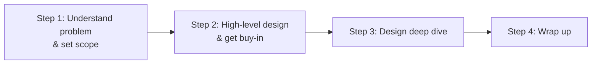
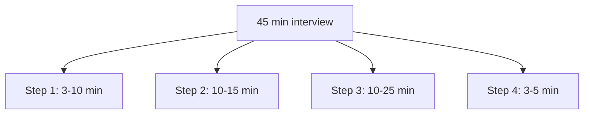

# A Framework for System Design Interviews · Vol 1 Ch 3

> A simple 4-step process for handling open-ended system design interview questions, plus what interviewers look for and how to budget your time.

## 1. The Problem in Plain English

System design interviews feel scary because the question is vague ("design product X") and huge — something that took thousands of engineers years to build. The good news: **no one expects you to actually build it in an hour.** The interview simulates two coworkers solving an ambiguous problem together. The **final design matters less than the process** you show. There is no perfect answer.

## 2. What the Interviewer Is Really Assessing

The interview is not just about technical skill. It gives signals about your ability to:
- **Collaborate** (treat the interviewer as a teammate).
- **Work under pressure.**
- **Resolve ambiguity constructively.**
- **Ask good questions** (a skill many interviewers specifically look for).

**Red flags** to avoid:
- **Over-engineering** – obsessing over design purity and ignoring trade-offs and costs.
- **Narrow-mindedness** and **stubbornness.**

## 3. The 4-Step Framework

Every interview is different, but these four steps are common ground.

### Step 1 — Understand the problem and establish design scope
**Don't be like Jimmy** (the kid who blurts answers fast). Giving a quick answer without understanding requirements is a **huge red flag**. Slow down, think, and ask clarifying questions. When you ask, the interviewer either answers or tells you to assume — if so, **write your assumptions down**.

Good starter questions:
- What specific features are we building?
- How many users does the product have?
- How fast will it scale (3 months, 6 months, a year)?
- What is the company's tech stack? What existing services can I reuse?

**Example (news feed system):** the candidate asks whether it's mobile/web/both (both), the key features (post + see friends' feed), sort order (reverse chronological), max friends (5000), traffic (10 million DAU), and media support (images and videos).

### Step 2 — Propose high-level design and get buy-in
Build an initial blueprint and get the interviewer to agree. Collaborate — many interviewers love to get involved.
- Draw **box diagrams** with key components: clients (mobile/web), APIs, web servers, data stores, cache, CDN, message queue.
- Do **back-of-the-envelope calculations** to check the blueprint fits the scale. **Think out loud.**
- Go through a few **concrete use cases** — this helps frame the design and surface edge cases.
- Whether to include **API endpoints and DB schema** depends on the problem (too low-level for "Google search," fine for a poker game backend). Communicate.

**Example:** a news feed splits into two flows — **feed publishing** (a post is written to cache/DB and pushed into friends' feeds) and **news feed building** (aggregating friends' posts in reverse chronological order).

### Step 3 — Design deep dive
By now you've agreed on goals/scope, sketched the blueprint, and gotten feedback. Now work with the interviewer to **identify and prioritize components** to dig into. Every interview differs — some focus on high-level design, senior interviews may focus on **bottlenecks and resource estimation**, most want details on some component (e.g. the hash function for a URL shortener; latency and online/offline status for a chat system).

**Manage time** — don't get lost in minute details that don't showcase your skills (e.g. explaining Facebook's EdgeRank in depth wastes time and doesn't prove scalable-design ability).

### Step 4 — Wrap up
The interviewer may ask follow-ups or open the floor. Good directions:
- Identify **bottlenecks** and possible improvements — never say your design is perfect.
- Give a **recap** of your design (helpful after a long session).
- Discuss **error cases** (server failure, network loss).
- Mention **operations** (monitoring metrics/logs, rollout).
- Discuss the **next scale curve** (e.g. going from 1M to 10M users).
- Propose **further refinements** you'd make with more time.

## 4. Time Allocation (45-minute session)

A rough guide (actual split depends on the problem):

| Step | Time |
|------|------|
| Step 1 — Understand problem & set scope | 3–10 minutes |
| Step 2 — High-level design & get buy-in | 10–15 minutes |
| Step 3 — Design deep dive | 10–25 minutes |
| Step 4 — Wrap up | 3–5 minutes |

## 5. Deep Dive — Dos and Don'ts

**Dos:**
- Always ask for clarification; don't assume.
- Understand the requirements — a startup solution differs from a millions-of-users solution.
- Let the interviewer know your thinking; communicate.
- Suggest multiple approaches when possible.
- After agreeing on the blueprint, dive into details, **most critical components first**.
- Bounce ideas off the interviewer.
- Never give up.

**Don'ts:**
- Don't be unprepared for typical questions.
- Don't jump to a solution before clarifying requirements/assumptions.
- Don't over-detail one component early — give the high-level design first.
- If stuck, ask for hints.
- Don't think in silence — communicate.
- Don't assume you're done after giving the design — you're done when the interviewer says so. Ask for feedback early and often.

## 6. Trade-offs

- **Speed vs understanding** – answering fast is worse than answering after clarifying.
- **Depth vs breadth** – going deep on one component can cost you the time to show broad skill.
- **Purity vs pragmatism** – over-engineering is a red flag; balance design quality with cost.

## 7. Edge Cases to Discuss

Bring these up in the wrap-up to show critical thinking: **server failure, network loss, bottlenecks, monitoring, rollout, and the next order-of-magnitude of scale.**

## 8. Key Takeaways

- Follow the **4 steps**: understand scope → high-level design + buy-in → deep dive → wrap up.
- **Ask questions and communicate** constantly; collaborate like a teammate.
- **Manage time** with the rough 3–10 / 10–15 / 10–25 / 3–5 minute budget.
- Avoid **over-engineering, silence, and jumping to solutions**.
- There is no single right answer — the **process** is what's evaluated.

## 9. New Terms & Glossary

- **System design interview** – open-ended collaborative problem-solving session.
- **Design scope** – the agreed boundaries of what you're designing.
- **Buy-in** – the interviewer's agreement on your high-level design.
- **Deep dive** – detailed design of prioritized components.
- **Back-of-the-envelope calculation** – quick capacity math (Chapter 2).
- **Bottleneck** – the part of the system that limits overall performance.
- **Over-engineering** – adding needless complexity while ignoring trade-offs (a red flag).
- **DAU** – Daily Active Users.
- **Reverse chronological order** – newest items first.
