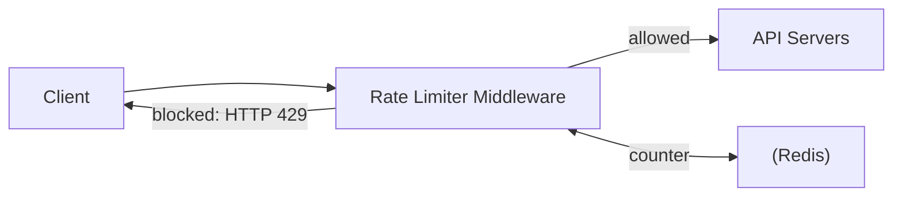
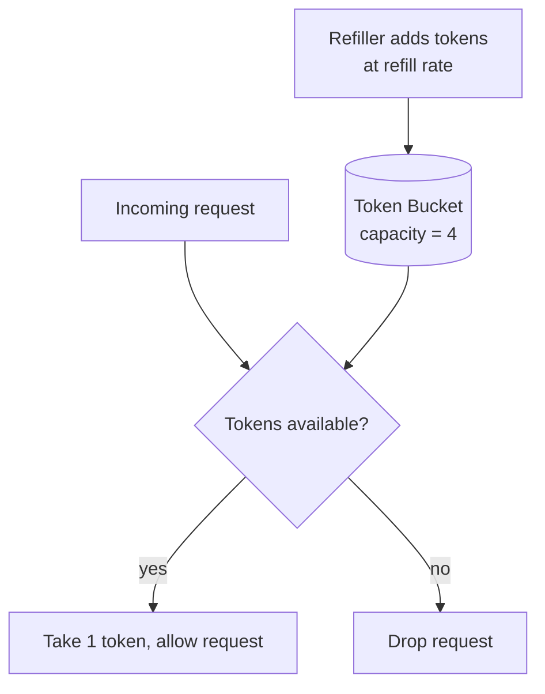
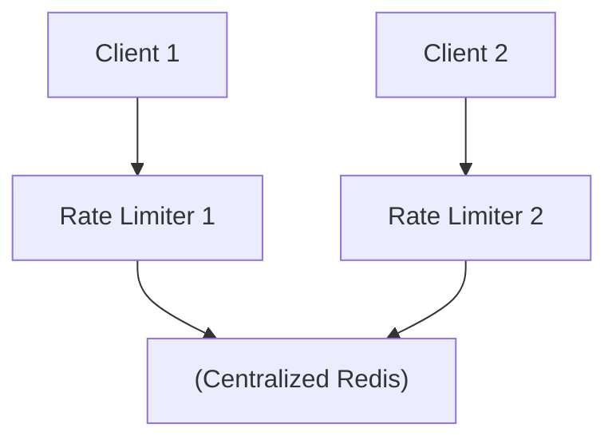

# Design a Rate Limiter · Vol 1 Ch 4

> How to design a system that controls how many requests a client can send in a time window, including five algorithms and how to make it work in a distributed environment.

## 1. The Problem in Plain English

A **rate limiter** controls how fast a client can send requests. In the HTTP world, it limits the number of client requests over a set period; excess calls are **blocked**. Examples:
- A user can write no more than **2 posts per second**.
- Max **10 accounts per day** from the same IP.
- Claim rewards no more than **5 times per week** from the same device.

**Why use one?**
- **Prevent DoS attacks** – block excess calls (intentional or not). Twitter limits tweets to **300 per 3 hours**; Google Docs API allows **300 reads per user per 60 seconds**.
- **Reduce cost** – fewer servers, and important when paying per-call for 3rd-party APIs (credit checks, payments, health records).
- **Prevent server overload** – filter out excess requests from bots or misbehaving users.

## 2. Requirements (Functional & Non-Functional)

Clarifying questions established: a **server-side** rate limiter (not client-side), **flexible** throttle rules (by IP, user ID, etc.), for a **large** system, in a **distributed** environment, and users **should be informed** when throttled.

Requirements summary:
- **Accurately** limit excessive requests.
- **Low latency** – must not slow down HTTP responses.
- **Little memory** usage.
- **Distributed** – shareable across multiple servers/processes.
- **Exception handling** – clear messages to throttled users.
- **High fault tolerance** – if the rate limiter (e.g. a cache server) fails, it must not take down the whole system.

## 3. Back-of-the-Envelope Estimation

This chapter is algorithm-focused rather than heavy on estimation, but the design assumes it must "handle a large number of requests," which is why counters live in **fast in-memory storage (Redis)** and the system spreads across **multiple data centers / edge servers** (Cloudflare had **194 edge servers** as of 5/20/2020).

## 4. High-Level Design

### Where to put the rate limiter?
- **Client-side** – unreliable; requests can be forged and you may not control the client.
- **Server-side** – place it on the API server.
- **Middleware** – a separate **rate limiter middleware** throttles requests before they reach the API. Example: API allows **2 requests/second**, client sends 3; the first two pass, the third gets **HTTP 429 (Too Many Requests)**.

In microservices, rate limiting usually lives in the **API gateway** (a managed middleware that also does SSL termination, authentication, IP whitelisting, static content). Whether to use server-side vs gateway depends on your tech stack, needed algorithm control, existing gateway, and engineering resources.

### High-level architecture
A **counter** tracks how many requests came from a user/IP. If it exceeds the limit, the request is blocked. Counters are stored in **in-memory cache (Redis)** — not a database (disk is too slow) — because it's fast and supports time-based expiration. Redis offers two key commands:
- **INCR** – increment the counter by 1.
- **EXPIRE** – set a timeout; when it expires, the counter is auto-deleted.

Flow: client → middleware fetches the bucket's counter from Redis → if limit reached, reject; otherwise forward to API servers and increment the counter.

## 5. Deep Dive — The Five Algorithms

### Token bucket
Widely used (Amazon and Stripe use it). A **bucket** has a fixed **capacity**; a refiller adds tokens at a preset **refill rate**; overflow tokens are discarded. Each request **consumes one token**; if none are left, the request is dropped. Example: capacity 4, refill 2 tokens/second.

Two parameters: **bucket size** and **refill rate**. Number of buckets varies: usually **one bucket per API endpoint per user** (e.g. 3 buckets if a user has 3 different limits), **one per IP**, or **one global bucket** (e.g. max 10,000 req/s).
- **Pros:** easy to implement, memory efficient, **allows short bursts** of traffic.
- **Cons:** the two parameters can be **hard to tune**.

### Leaking bucket
Like token bucket but requests are processed at a **fixed rate**, usually via a **FIFO queue**. On arrival: if the queue isn't full, add the request; otherwise drop it. Requests are pulled and processed at regular intervals. Shopify uses this. Two parameters: **bucket size** (queue size) and **outflow rate**.
- **Pros:** memory efficient; **stable, fixed outflow rate**.
- **Cons:** a burst fills the queue with old requests so recent ones get dropped; two parameters hard to tune.

### Fixed window counter
Divide time into **fixed windows**, each with a counter. Each request increments it; once it hits the threshold, new requests are dropped until the next window. Example: max 3 requests/second per window.
- **Major problem:** a **burst at the edges** of two windows lets more than the quota through. Example: max 5/min, but 5 requests at 2:00:00–2:01:00 plus 5 at 2:01:00–2:02:00 means **10 requests** pass in the window 2:00:30–2:01:30 (twice the limit).
- **Pros:** memory efficient, easy to understand.
- **Cons:** edge-of-window spikes exceed the quota.

### Sliding window log
Fixes the edge problem. It stores **request timestamps** (often in Redis **sorted sets**). On a new request: remove **outdated** timestamps (older than the current window start), add the new timestamp, and allow if the log size ≤ the allowed count, else reject. Example (2 req/min): requests at 1:00:01 and 1:00:30 are allowed (log size 2); 1:00:50 is rejected (size 3) but its timestamp is still stored; at 1:01:40 the two outdated ones are removed so the request is accepted.
- **Pros:** **very accurate** — never exceeds the limit in any rolling window.
- **Cons:** uses **a lot of memory** because even rejected requests' timestamps may be stored.

### Sliding window counter
A **hybrid** of fixed window counter and sliding window log. Formula for requests in the rolling window:

`requests in current window + requests in previous window × overlap % of the rolling window with the previous window`

Example: max 7/min, 5 requests in the previous minute, 3 in the current, new request at 30% into the current minute → `3 + 5 × 0.7 = 6.5`, rounded down to **6** → allowed (limit is 7).
- **Pros:** **smooths out spikes** (uses average of the previous window), memory efficient.
- **Cons:** only an **approximation** (assumes even distribution in the previous window), works only for not-too-strict windows. Cloudflare found only **0.003%** of 400 million requests were wrongly handled.

## 6. Scaling, Bottlenecks & Trade-offs (Distributed environment)

Single-server rate limiting is easy; distributed brings two challenges:

### Race condition
The flow (read counter → check counter+1 vs threshold → increment) can race. If Redis counter is 3 and two requests read it before either writes, both write 4 — but the correct value is 5. **Locks** fix it but slow the system. Better solutions: **Lua scripts** and Redis **sorted sets**.

### Synchronization issue
With multiple rate limiter servers, one server won't know another's data. **Sticky sessions** (forcing a client to one server) are **not advised** (not scalable/flexible). Better: use a **centralized data store like Redis** shared by all rate limiters.

### Performance optimization
- **Multi-data-center / edge servers** – route traffic to the nearest edge to cut latency (Cloudflare had 194 edge servers).
- **Eventual consistency** model to synchronize data across servers.

### Monitoring
Gather analytics to confirm the **algorithm** and **rules** are effective. If rules are too strict, valid requests get dropped (relax them). If the limiter fails during a spike (e.g. flash sales), switch to an algorithm that handles bursts — **token bucket** is a good fit.

## 7. Failure / Edge Cases

- **Request throttled** → return **HTTP 429 (Too Many Requests)**. May **enqueue** the request to process later (e.g. delayed orders during overload).
- **Rate limiter headers** tell the client its status:
  - `X-Ratelimit-Remaining` – remaining allowed requests in the window.
  - `X-Ratelimit-Limit` – how many calls allowed per window.
  - `X-Ratelimit-Retry-After` – seconds to wait before retrying.
- **Rules storage:** rules (e.g. Lyft's open-source format) are written in config files on disk; workers pull them into cache. Example rule: 5 marketing messages/day; or 5 logins/minute.
- **Fault tolerance:** if the cache/rate limiter fails, it must not bring the whole system down.

## 8. Scaling / Extra Talking Points (Wrap up)

- **Hard vs soft rate limiting** – hard: never exceed the threshold; soft: may exceed briefly.
- **Rate limiting at different layers** – this chapter is at the **application layer (HTTP, OSI Layer 7)**; you can also limit by IP with **Iptables** (**Layer 3**). (OSI has 7 layers: physical, data link, network, transport, session, presentation, application.)
- **Client best practices to avoid being limited:** use a client cache, understand the limits, catch exceptions gracefully, and add **back-off time** to retry logic.

## 9. Key Takeaways

- Prefer **server-side** or **API gateway** rate limiting over unreliable client-side.
- Store counters in **Redis** (INCR/EXPIRE), never a slow database.
- **Token bucket** allows bursts (used by Amazon/Stripe); **leaking bucket** gives a steady rate (Shopify); **fixed window** is simple but leaks at edges; **sliding window log** is accurate but memory-heavy; **sliding window counter** smooths spikes but approximates.
- In distributed setups, handle **race conditions** (Lua scripts, sorted sets) and **synchronization** (centralized Redis, not sticky sessions).
- Return **HTTP 429** with **X-Ratelimit-*** headers and stay **fault tolerant**.

## 10. New Terms & Glossary

- **Rate limiter** – controls the number of requests over a time period.
- **Throttle** – to block/slow requests that exceed the limit.
- **HTTP 429** – "Too Many Requests" status code.
- **API gateway** – managed middleware doing rate limiting, SSL termination, auth, IP whitelisting, etc.
- **Token bucket** – bucket of tokens refilled at a rate; each request spends one. Allows bursts.
- **Leaking bucket** – FIFO queue processed at a fixed outflow rate.
- **Fixed window counter** – a counter per fixed time window.
- **Sliding window log** – stores request timestamps for exact limiting.
- **Sliding window counter** – hybrid using a weighted formula across windows.
- **Redis** – in-memory store; **INCR** increments, **EXPIRE** sets a timeout.
- **Race condition** – concurrent reads/writes producing a wrong counter.
- **Sticky sessions** – pinning a client to one server (not advised here).
- **Eventual consistency** – data becomes consistent over time, not instantly.
- **Edge server** – geographically distributed server near users.
- **Hard vs soft limiting** – strict vs briefly-exceedable thresholds.
- **OSI model** – 7-layer network model; Layer 7 = application, Layer 3 = network.
- **Iptables** – Linux tool for IP-level (Layer 3) rate limiting.
- **Back-off** – waiting increasingly longer before retrying.
