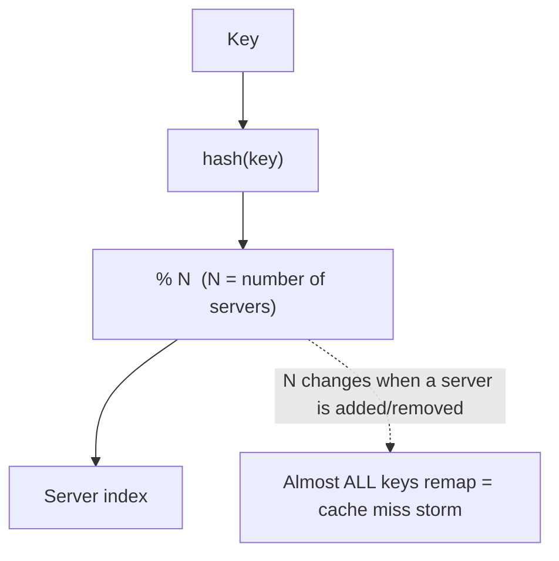
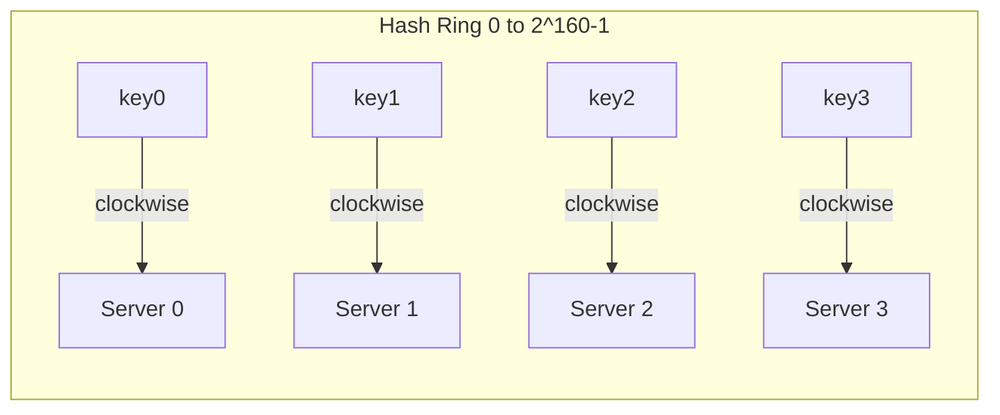
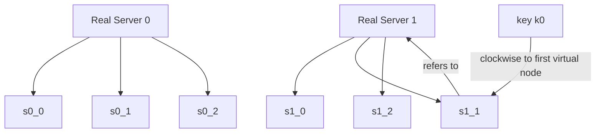

# Design Consistent Hashing · Vol 1 Ch 5

> A technique to spread data/requests evenly across servers so that adding or removing a server only moves a small fraction of keys, instead of nearly all of them.

## 1. The Problem in Plain English

To scale horizontally, you must spread data **evenly** across many servers. A naive way is `serverIndex = hash(key) % N` (N = number of servers). This works while N is fixed, but the moment you **add or remove a server**, N changes, so `% N` gives different results for **almost every key**. Most keys get remapped to the wrong server — causing a **storm of cache misses**. **Consistent hashing** fixes this.

### The rehashing problem
With 4 servers and 8 keys, `hash(key) % 4` distributes keys nicely. But if **server 1 goes offline**, N becomes 3, and `hash(key) % 3` reassigns **most keys**, not just the ones that were on server 1. Every client now looks in the wrong place.

## 2. Requirements (What consistent hashing must achieve)

- Distribute keys **evenly** across servers.
- When a server is **added or removed**, remap **as few keys as possible**.
- Enable easy **horizontal scaling**.
- Avoid **hotspot (celebrity) keys** overloading one server.

Formal definition (Wikipedia): with consistent hashing, when the hash table is resized, only **k/n keys** need remapping on average (k = number of keys, n = number of slots), versus nearly all keys in a traditional hash table.

## 3. Back-of-the-Envelope / Key Numbers

- **SHA-1** hash space runs from **0 to 2¹⁶⁰ − 1**.
- With **virtual nodes**, an experiment showed the standard deviation of key distribution is about **5% of the mean with 200 virtual nodes** and **10% with 100 virtual nodes** — more virtual nodes means more balanced distribution (smaller standard deviation), at the cost of more storage.

## 4. High-Level Design — The Hash Ring

### Hash space and hash ring
Using a hash function `f` (e.g. **SHA-1**) with output range 0 to 2¹⁶⁰ − 1, connect both ends of the line to form a **hash ring**.

### Hash servers
Map each server onto the ring by hashing its **IP or name**.

### Hash keys
Hash each key onto the ring too. **Important:** unlike the rehashing approach, there is **no modular (`% N`) operation** — the key just lands somewhere on the ring.

### Server lookup
To find which server holds a key, go **clockwise** from the key's position until you hit the **first server**. That server stores the key.

## 5. Deep Dive

### Adding a server
Only a **fraction** of keys move. When server 4 is added, only **key0** is redistributed (key0 now finds server 4 first when going clockwise); k1, k2, k3 stay put.

### Removing a server
Only a small fraction moves. When server 1 is removed, only **key1** is remapped (to server 2); the rest are unaffected.

### Two problems with the basic approach
The algorithm was introduced by **Karger et al. at MIT**. Basic steps: map servers and keys with a uniform hash function, then go clockwise from a key to the first server. Two issues:
1. **Unequal partition sizes** – a **partition** is the hash space between two adjacent servers. Servers can't keep equal partition sizes as servers are added/removed. E.g. if s1 is removed, s2's partition becomes **twice as large** as s0's and s3's.
2. **Non-uniform key distribution** – servers may cluster so that most keys land on one server (e.g. server 2 gets everything while servers 1 and 3 get nothing).

### Virtual nodes (the fix)
A **virtual node** points to a real server, and each server is represented by **multiple virtual nodes** on the ring. Example: server 0 becomes **s0_0, s0_1, s0_2** and server 1 becomes **s1_0, s1_1, s1_2** (3 is arbitrary; real systems use many more). Each server now manages **multiple partitions** scattered around the ring.

Lookup still goes clockwise to the **first virtual node** encountered, which maps back to a real server (e.g. k0 → s1_1 → server 1). More virtual nodes → smaller standard deviation → more balanced distribution (5% at 200 nodes, 10% at 100 nodes), but more storage. This is a **tunable trade-off**.

### Finding affected keys
When a server changes, only a range of keys must move:
- **Adding server s4:** the affected range starts at **s4** and goes **anticlockwise** until the previous server (**s3**). Keys between s3 and s4 move to s4.
- **Removing server s1:** the affected range starts at **s1** and goes **anticlockwise** to the previous server (**s0**). Keys between s0 and s1 are redistributed to the next server (s2).

## 6. Scaling, Bottlenecks & Trade-offs

Benefits of consistent hashing:
- **Minimal key redistribution** when servers are added/removed.
- **Easy horizontal scaling** because data is more evenly distributed.
- **Mitigates the hotspot (celebrity) key problem** – if Katy Perry, Justin Bieber, and Lady Gaga would otherwise all land on one shard, consistent hashing spreads the load more evenly.

Trade-off: **more virtual nodes** give better balance but consume **more memory/storage** to track them — tune the number to your needs.

## 7. Failure / Edge Cases

- **Basic ring without virtual nodes** → uneven partitions and skewed key distribution. Solved by virtual nodes.
- **Server goes offline** → only the keys in that server's range move to the next server clockwise, not the whole dataset.
- **Hotspot key** → still possible on a single shard, but virtual nodes reduce the chance by spreading data.

## 8. Real-World Usage

Consistent hashing is used in:
- **Amazon Dynamo** database (partitioning component)
- **Apache Cassandra** (data partitioning across the cluster)
- **Discord** chat application
- **Akamai** content delivery network
- **Maglev** network load balancer (Google)

## 9. Key Takeaways

- Naive `hash(key) % N` remaps **almost all keys** when N changes — a cache-miss disaster.
- Consistent hashing puts servers and keys on a **hash ring** (no modulo); a key belongs to the **first server clockwise**.
- Adding/removing a server moves only **k/n keys on average**.
- **Virtual nodes** solve uneven partitions and skewed distribution; more virtual nodes = more balance (5% std dev at 200 nodes) at the cost of storage.
- Widely used by Dynamo, Cassandra, Discord, Akamai, and Maglev.

## 10. New Terms & Glossary

- **Consistent hashing** – hashing where only k/n keys remap when servers change.
- **Rehashing problem** – with `% N`, changing N remaps almost all keys.
- **Hash ring / hash space** – the 0 to 2¹⁶⁰ − 1 range (for SHA-1) joined into a circle.
- **SHA-1** – hash function with a 0 to 2¹⁶⁰ − 1 output range.
- **Clockwise lookup** – find a key's server by moving clockwise to the first server.
- **Partition** – the hash space between two adjacent servers on the ring.
- **Virtual node (replica)** – multiple ring positions representing one real server, for balance.
- **Standard deviation** – measure of how spread out the key distribution is (smaller = more balanced).
- **Hotspot / celebrity key** – a key/shard hit so often it overloads a server.
- **Horizontal scaling** – adding more servers to share load.
