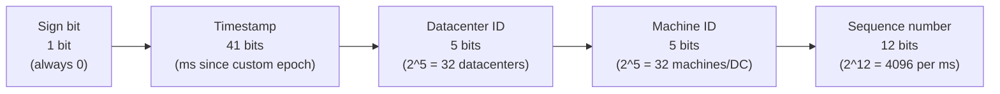

# Design a Unique ID Generator in Distributed Systems · Vol 1 Ch 7

> How to generate unique, time-sortable, 64-bit IDs across many servers — comparing multi-master, UUID, ticket server, and the winning Twitter Snowflake approach.

## 1. The Problem in Plain English

We need to create **unique IDs** for records in a system spread across many machines.

The obvious idea — a database primary key with **`auto_increment`** — does **not** work in a distributed setting because:
- A single database server isn't big enough for everything.
- Generating unique IDs across **multiple databases** with low delay is hard.

So we need a smarter scheme that works even when many servers create IDs at once.

## 2. Requirements (Functional & Non-Functional)

Clarified with the interviewer:

- IDs must be **unique**.
- IDs contain **numbers only** (numerical values).
- IDs fit into **64-bit**.
- IDs are **ordered by date/time** (IDs made in the evening are larger than those from the morning of the same day).
- The ID doesn't have to increment by exactly 1 — just increase over time.
- System must generate **over 10,000 unique IDs per second**.

## 3. Back-of-the-Envelope Estimation

- Throughput target: **≥ 10,000 IDs per second**.
- ID size budget: **64 bits**.
- Snowflake sequence capacity: **2^12 = 4096** IDs per millisecond per machine (far above the requirement).
- Timestamp capacity: **41 bits ≈ 69 years** of milliseconds before overflow.

## 4. High-Level Design

Four candidate approaches were considered: **Multi-master replication**, **UUID**, **Ticket server**, and the **Twitter Snowflake** approach.

### Multi-master replication

Uses the databases' `auto_increment`, but instead of increasing the next ID by 1, it increases by **k**, where **k = number of database servers**. So each server produces a non-overlapping series (e.g. next = previous + 2 when k=2). This lets IDs scale with the number of servers.

**Drawbacks:**
- Hard to scale across **multiple data centers**.
- IDs **do not go up with time** across servers.
- Doesn't scale well when a server is **added or removed**.

### UUID

A **UUID** is a **128-bit** number identifying information. Collision chance is tiny — per Wikipedia, generating **1 billion UUIDs per second for ~100 years** gives only a 50% chance of a single duplicate. Example: `09c93e62-50b4-468d-bf8a-c07e1040bfb2`. Each web server has its own generator and makes IDs independently.

**Pros:**
- Simple; **no coordination** between servers, so no sync issues.
- Easy to scale — ID generation scales with web servers.

**Cons:**
- **128 bits** long, but we need **64 bits**.
- IDs **do not go up with time**.
- IDs can be **non-numeric**.

### Ticket Server

Built by **Flickr**. Uses a **centralized `auto_increment`** feature in a **single** database server (the ticket server) to hand out IDs.

**Pros:**
- **Numeric** IDs.
- Easy to build; fine for small-to-medium scale.

**Cons:**
- **Single point of failure** — if the ticket server dies, everything depending on it breaks. Using multiple ticket servers fixes the SPOF but introduces **data synchronization** problems.

### Twitter Snowflake (the chosen approach)

None of the above meets all requirements, so we use **Twitter's Snowflake**. The trick is **divide and conquer**: instead of generating an ID as one number, split the 64-bit ID into sections.

Bit layout (total = **1 + 41 + 5 + 5 + 12 = 64 bits**):

- **Sign bit — 1 bit:** always 0, reserved for future use (could distinguish signed/unsigned).
- **Timestamp — 41 bits:** milliseconds since a custom epoch. Snowflake's default epoch is **1288834974657** (Nov 04, 2010, 01:42:54 UTC).
- **Datacenter ID — 5 bits:** gives **32 datacenters**.
- **Machine ID — 5 bits:** gives **32 machines per datacenter**.
- **Sequence number — 12 bits:** incremented by 1 for each ID made on that machine within the same millisecond; **reset to 0 every millisecond**.

## 5. Deep Dive

We settle on the Snowflake-based design.

- **Datacenter ID and Machine ID** are chosen at **startup** and are generally fixed while the system runs. Changing them needs careful review, because an accidental change can cause **ID conflicts**.
- **Timestamp and sequence number** are generated live, while the ID generator runs.

### Timestamp (41 bits)

Because the timestamp grows over time and sits in the high bits, IDs are naturally **sortable by time**. Max value:

- 2^41 − 1 = **2,199,023,255,551 ms**.
- Converting: 2,199,023,255,551 ms ÷ 1000 ÷ 3600 ÷ 24 ÷ 365 ≈ **69 years**.

So the generator works for **~69 years** from its epoch. Choosing a **custom epoch close to today** pushes the overflow date further out. After 69 years, we'd need a new epoch or a migration technique.

### Sequence number (12 bits)

12 bits = **2^12 = 4096** combinations. This field stays 0 unless more than one ID is created in the **same millisecond on the same server**. So one machine can produce up to **4096 IDs per millisecond**.

## 6. Scaling, Bottlenecks & Trade-offs

- **Snowflake scales horizontally**: 32 datacenters × 32 machines, each doing 4096 IDs/ms — far beyond 10,000 IDs/sec.
- **Section-length tuning:** you can rebalance bits. Fewer sequence bits + more timestamp bits suit **low-concurrency, long-lived** applications.
- **Multi-master** scales with servers but breaks time-ordering and multi-DC use.
- **UUID** scales best (no coordination) but violates the 64-bit, numeric, and time-sorted requirements.
- **Ticket server** is simple but centralizes into a bottleneck / SPOF.

## 7. Failure / Edge Cases

- **Clock synchronization:** the design assumes all ID servers share the same clock. This may fail across cores or machines. Fix is out of scope, but **Network Time Protocol (NTP)** is the common solution — important to know the problem exists.
- **Timestamp overflow:** after ~69 years the 41-bit timestamp runs out; need a new epoch or migration.
- **High availability:** the ID generator is mission-critical and must be highly available.
- **Datacenter/Machine ID conflicts:** accidental changes to these fixed IDs cause duplicate IDs.
- **Ticket server SPOF:** avoided only by adding servers, which brings sync issues.

## 8. Key Takeaways

- Plain `auto_increment` doesn't work distributed; four alternatives exist: **multi-master, UUID, ticket server, Snowflake**.
- **Snowflake wins** because it produces **unique, numeric, 64-bit, time-sortable** IDs and scales across data centers.
- Snowflake layout: **1 sign + 41 timestamp + 5 datacenter + 5 machine + 12 sequence bits**.
- 41-bit timestamp → **~69 years**; 12-bit sequence → **4096 IDs/ms/machine**.
- Datacenter and machine IDs are fixed at startup; timestamp and sequence are generated at runtime.
- Watch out for **clock sync (NTP)** and keep the generator **highly available**.

## 9. New Terms & Glossary

- **`auto_increment`:** a database feature that automatically increases the primary key by 1; doesn't work well distributed.
- **Multi-master replication:** many DB servers each own `auto_increment`, incrementing by k (number of servers) so ranges don't overlap.
- **UUID:** a 128-bit universally unique identifier generated without coordination; extremely low collision risk but not 64-bit/numeric/time-ordered.
- **Ticket server:** a single centralized DB (Flickr's design) that hands out incrementing numeric IDs; a single point of failure.
- **Twitter Snowflake:** a scheme that splits a 64-bit ID into sign, timestamp, datacenter, machine, and sequence sections.
- **Epoch (custom epoch):** the start time from which the timestamp is measured (Snowflake default 1288834974657 = Nov 4, 2010).
- **Sequence number:** counter (0–4095) distinguishing multiple IDs made in the same millisecond on one machine.
- **NTP (Network Time Protocol):** the standard way to keep servers' clocks in sync.
- **SPOF (single point of failure):** one component whose failure takes down the whole system.
