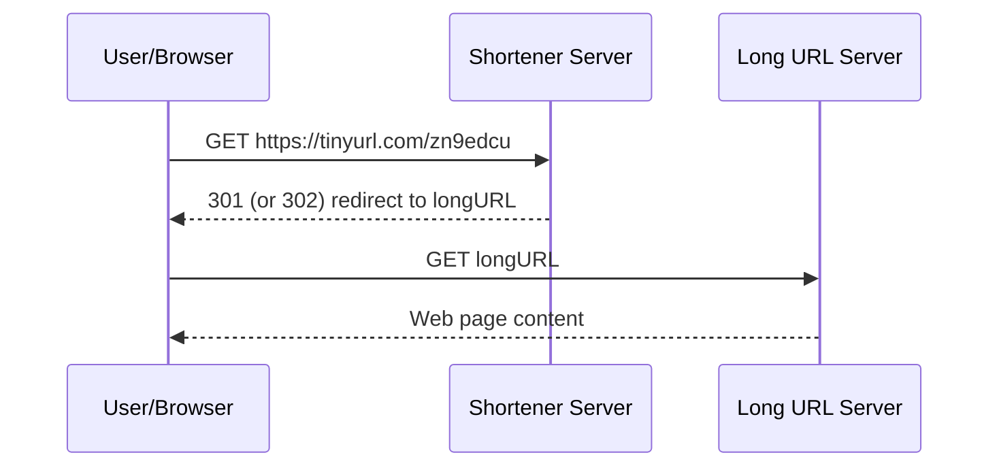
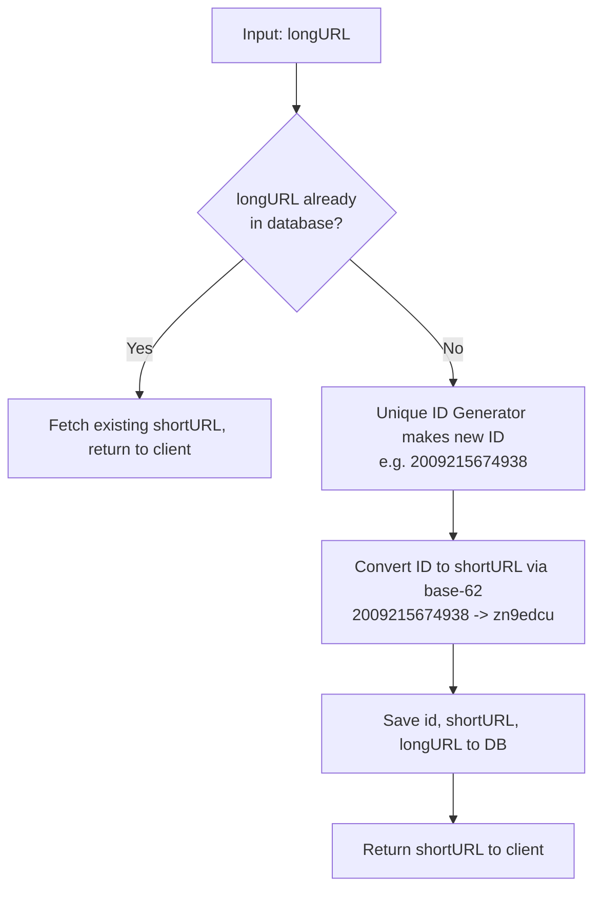
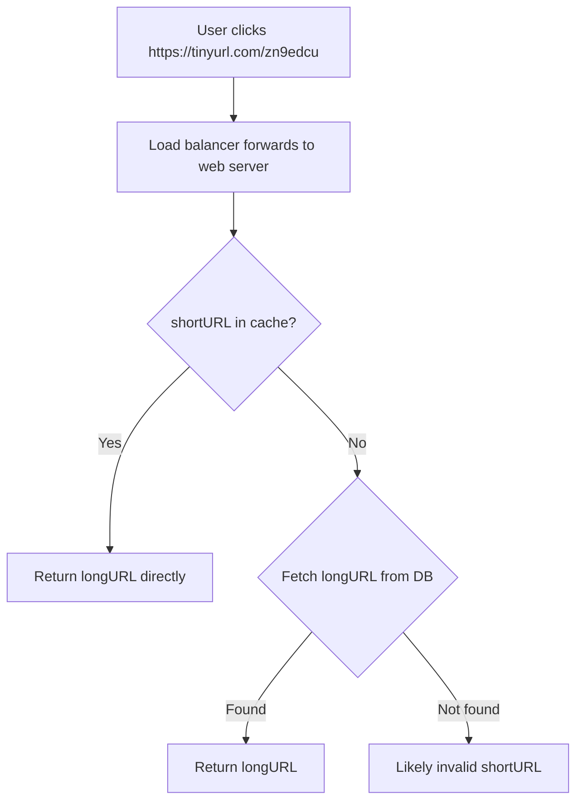

# Design a URL Shortener · Vol 1 Ch 8

> How to build a TinyURL-like service that turns long URLs into short ones and redirects back — covering base-62 vs hashing, 301 vs 302 redirects, and caching for reads.

## 1. The Problem in Plain English

A **URL shortener** (like TinyURL) takes a long web address and gives back a much shorter one. Clicking the short link **redirects** you to the original long URL.

Example:
- Long: `https://www.systeminterview.com/q=chatsystem&c=loggedin&v=v3&l=long`
- Short: `https://tinyurl.com/y7keocwj`

Two main jobs:
1. **URL shortening:** long URL → short URL.
2. **URL redirecting:** short URL → redirect to the original long URL.

## 2. Requirements (Functional & Non-Functional)

- **Traffic:** 100 million URLs generated per day.
- Short URL should be **as short as possible**.
- Allowed characters: numbers `0-9` and letters `a-z, A-Z`.
- For simplicity, short URLs **cannot be deleted or updated**.
- Must have **high availability, scalability, and fault tolerance**.

## 3. Back-of-the-Envelope Estimation

- **Writes:** 100 million URLs/day → 100,000,000 / 24 / 3600 ≈ **1160 writes per second**.
- **Reads:** assume read:write = **10:1** → 1160 × 10 ≈ **11,600 reads per second**.
- Over **10 years:** 100 million × 365 × 10 = **365 billion records**.
- Average URL length: **100 bytes**.
- Storage over 10 years: 365 billion × 100 bytes = **365 TB**.

## 4. High-Level Design

### API Endpoints (REST)

1. **Shortening** — `POST api/v1/data/shorten`
   - Request body: `{longUrl: longURLString}`
   - Returns: `shortURL`
2. **Redirecting** — `GET api/v1/shortUrl`
   - Returns the `longURL` for HTTP redirection.

### URL Redirecting: 301 vs 302

When the server receives a short URL, it returns a redirect to the long URL. Which redirect code?

- **301 (Permanent):** the short URL is permanently moved to the long URL. The **browser caches** it, so future requests for that short URL go **straight to the long URL server**, skipping our service. → **Reduces server load.**
- **302 (Temporary):** the short URL is temporarily moved. Future requests **still go to our service first**, then get redirected. → **Better for analytics** (we can track click rate and click source).

Choose **301** to minimize load, **302** if analytics matter.

The simplest implementation is a **hash table** storing `<shortURL, longURL>`: `longURL = hashTable.get(shortURL)`, then redirect.

### URL Shortening

Short URL looks like `www.tinyurl.com/{hashValue}`. We need a hash function `fx` that maps a long URL to a `hashValue`, where:
- Each long URL maps to one `hashValue`.
- Each `hashValue` maps back to its long URL.

## 5. Deep Dive

### Data Model

The in-memory hash table is only a starting point — memory is limited and expensive. In production, store `<shortURL, longURL>` in a **relational database**. A simple table has 3 columns: **`id`, `shortURL`, `longURL`**.

### Hash Function — Length

`hashValue` uses `[0-9, a-z, A-Z]` = **62 possible characters**. Find the smallest `n` where `62^n ≥ 365 billion`:
- At **n = 7**, `62^7 ≈ 3.5 trillion`, which comfortably covers 365 billion.
- So **hashValue length = 7**.

Two hash-function approaches are compared: **"hash + collision resolution"** and **"base-62 conversion."**

### Approach 1 — Hash + Collision Resolution

Use a known hash function (**CRC32, MD5, or SHA-1**) on the long URL. Problem: even the shortest (CRC32) output is **longer than 7 characters**.

Fix: take the **first 7 characters** of the hash. But this can cause **collisions** (two URLs get the same 7 chars). To resolve: **recursively append a predefined string** and re-hash until there's no collision.

This works but is **expensive** — every request must query the DB to check whether a short URL already exists. A **bloom filter** (a space-efficient probabilistic set-membership test) speeds this up.

### Approach 2 — Base-62 Conversion

Convert a number into base-62 using the 62 characters. Mapping: `0→0 … 9→9, 10→a … 35→z, 36→A … 61→Z` (so `a=10`, `Z=61`).

Example: convert `11157` (base 10) to base 62:
- `11157 = 2 × 62² + 55 × 62¹ + 59 × 62⁰` = `[2, 55, 59]` → `[2, T, X]`.
- Short URL: `https://tinyurl.com/2TX`.

### Comparison of the Two Approaches

- **Hash + collision resolution:** fixed 7-char length; needs a DB/bloom-filter lookup on every write to detect collisions; short URL isn't derived from a numeric ID.
- **Base-62 conversion:** short URL length **grows** as the ID grows (not fixed); does **not** need collision checks; requires a **unique ID generator** to produce the number first. The IDs are also predictable/enumerable.

**Base-62 is chosen** for the design.

### URL Shortening Flow (Base-62)

The **distributed unique ID generator** (from Chapter 7, e.g. Snowflake) produces globally unique IDs used as primary keys, which are then base-62 encoded.

### URL Redirecting Flow

Because reads far outnumber writes, `<shortURL, longURL>` is stored in a **cache** for speed.

## 6. Scaling, Bottlenecks & Trade-offs

- **Web tier is stateless** → easy to scale by adding/removing web servers behind a load balancer.
- **Database scaling:** use **replication and sharding**.
- **Caching** the read-heavy `<shortURL, longURL>` mapping cuts DB load (reads are ~10× writes).
- **301 vs 302** trade-off: fewer server hits (301) vs richer analytics (302).
- **Base-62 vs hashing** trade-off: no collision checks (base-62) vs fixed short length (hashing).

## 7. Failure / Edge Cases

- **Invalid short URL:** if it's not in cache and not in the DB, the user probably typed a bad short URL.
- **Duplicate long URL:** the flow first checks whether the long URL already exists to avoid making a second short URL for it.
- **Hash collisions** (Approach 1): resolved by appending a predefined string and re-hashing; bloom filter avoids costly repeated DB lookups.
- **Malicious flooding / abuse:** a **rate limiter** (from Chapter 4) filters excessive requests by IP or other rules.

## 8. Key Takeaways

- Two endpoints: **POST to shorten**, **GET to redirect**.
- Estimated scale: ~**1160 writes/s**, ~**11,600 reads/s**, **365 TB** over 10 years, **365 billion** records.
- Short code length is **7** because `62^7 ≈ 3.5 trillion > 365 billion`.
- **301** redirect reduces load (browser caches); **302** enables analytics (server sees every click).
- **Base-62 conversion** (chosen) needs a unique ID generator but avoids collision checks; **hash+collision** gives fixed length but needs lookups (helped by a bloom filter).
- Store mappings in a **relational DB** with `<id, shortURL, longURL>`; **cache** reads because reads dominate.

## 9. New Terms & Glossary

- **URL shortener:** service that maps long URLs to short aliases and redirects back.
- **hashValue:** the short code portion of the short URL, 7 characters from `[0-9, a-z, A-Z]`.
- **301 redirect (permanent):** browser caches it; later requests skip the shortener.
- **302 redirect (temporary):** every request goes through the shortener first (good for tracking).
- **Base-62 conversion:** encoding a number using 62 characters (0-9, a-z, A-Z) to form the short code.
- **Hash + collision resolution:** hashing (CRC32/MD5/SHA-1), taking the first 7 chars, and re-hashing on collisions.
- **CRC32 / MD5 / SHA-1:** common hash functions; their outputs are longer than 7 chars.
- **Bloom filter:** space-efficient probabilistic membership test used to avoid costly DB collision lookups.
- **Unique ID generator:** distributed component (Chapter 7) that produces globally unique numeric IDs used as primary keys.
- **Rate limiter:** component that blocks abusive request volumes.
