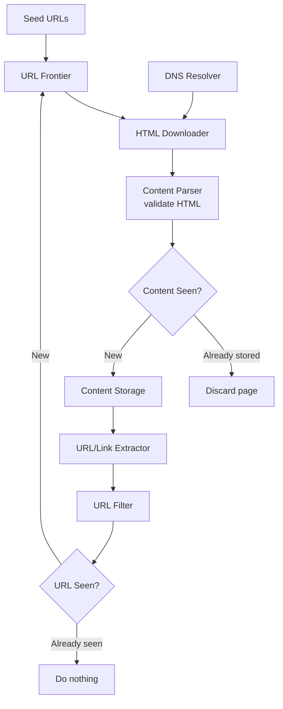
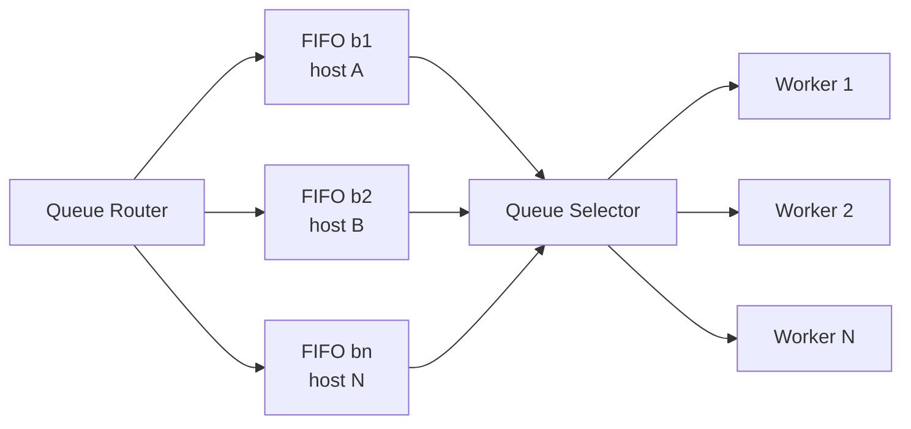

# Design a Web Crawler · Vol 1 Ch 9

> How to build a scalable, polite, robust web crawler for search-engine indexing — using BFS, a URL Frontier, robots.txt, content/URL dedup, and distributed downloading.

## 1. The Problem in Plain English

A **web crawler** (also called a **robot** or **spider**) automatically browses the web to discover new or updated content. Search engines use it to build their index. Content can be web pages, images, videos, PDFs, etc. (e.g. **Googlebot** powers Google search).

Basic algorithm:
1. Given some starting URLs, **download** all the pages.
2. **Extract URLs** (links) from those pages.
3. **Add new URLs** to the list to download, and repeat.

Sounds simple, but building a *massive*, scalable crawler is very hard because the web is huge and full of traps.

**Uses:** search-engine indexing (main one), web archiving (Library of Congress, EU Web Archive), web mining (financial firms downloading reports), and web monitoring (copyright/trademark infringement, e.g. Digimarc).

## 2. Requirements (Functional & Non-Functional)

Clarified with the interviewer:

- **Purpose:** search-engine indexing.
- **Scale:** collect **1 billion pages per month**.
- **Content type:** **HTML only**.
- Must handle **newly added or edited** pages.
- **Store** crawled HTML for up to **5 years**.
- **Ignore duplicate content**.

A good crawler must have:

- **Scalability:** use parallelization to handle billions of pages efficiently.
- **Robustness:** survive bad HTML, unresponsive servers, crashes, malicious links.
- **Politeness:** don't hit one website too many times in a short window.
- **Extensibility:** easy to add support for new content types (e.g. images) without a rewrite.

## 3. Back-of-the-Envelope Estimation

- **1 billion pages per month.**
- **QPS:** 1,000,000,000 / 30 / 24 / 3600 ≈ **400 pages/second**.
- **Peak QPS:** 2 × 400 = **800**.
- **Average page size:** 500 KB.
- **Monthly storage:** 1 billion × 500 KB = **500 TB per month**.
- **5-year storage:** 500 TB × 12 × 5 = **30 PB**.

## 4. High-Level Design

Key components and how they connect:

- **Seed URLs:** the starting points. To crawl the whole web, split the URL space smartly — by **locality** (different countries have different popular sites) or by **topic** (shopping, sports, healthcare, etc.).
- **URL Frontier:** stores URLs **to be downloaded** (a FIFO queue). Crawl state is split into "to download" (Frontier) and "already downloaded."
- **HTML Downloader:** downloads pages from URLs given by the Frontier.
- **DNS Resolver:** turns a URL into an IP address (e.g. `www.wikipedia.org` → `198.35.26.96`).
- **Content Parser:** parses and validates downloaded HTML (malformed pages waste storage). Kept as a **separate component** so parsing doesn't slow the crawl servers.
- **"Content Seen?":** detects duplicate content (about **29% of web pages are duplicates**). Instead of comparing pages character-by-character (slow), it compares **hash values** of the two pages.
- **Content Storage:** stores HTML. Mostly on **disk** (too big for memory); **popular content in memory** to cut latency.
- **URL Extractor:** pulls links out of HTML; converts relative paths to absolute URLs (adds the domain prefix).
- **URL Filter:** excludes certain content types, file extensions, error links, and blacklisted sites.
- **"URL Seen?":** tracks URLs already visited or already in the Frontier, so we don't add the same URL twice (avoids extra load and infinite loops). Implemented with a **bloom filter** and/or **hash table**.
- **URL Storage:** stores already-visited URLs.

### Crawler Workflow

Steps: (1) add seed URLs to Frontier → (2) Downloader fetches URLs → (3) gets IPs from DNS Resolver and downloads → (4) Parser checks for malformed pages → (5-6) "Content Seen?" discards duplicate content or (7) passes new content to Link Extractor → (8) links go to URL Filter → (9-10) "URL Seen?" drops already-processed URLs → (11) new URLs are added back to the Frontier.

## 5. Deep Dive

### DFS vs BFS

Think of the web as a **directed graph**: pages are nodes, hyperlinks are edges. Crawling = graph traversal.

- **DFS (depth-first)** is a **bad choice** — the depth can get extremely deep.
- **BFS (breadth-first)** is the standard, implemented with a **FIFO queue** (URLs come out in the order they went in).

But plain BFS has two problems:
1. **Impoliteness:** most links on a page point back to the **same host** (e.g. all Wikipedia links are internal), so parallel downloads flood that one server.
2. **No priority:** standard BFS treats every page equally, but pages differ in quality/importance (PageRank, traffic, update frequency).

### URL Frontier

The URL Frontier fixes both, ensuring **politeness**, **prioritization**, and **freshness**. It has two modules: **front queues** (manage priority) and **back queues** (manage politeness).

**Politeness** — download only one page at a time per host, with a delay between downloads:
- **Queue router:** ensures each queue holds URLs from only one host.
- **Mapping table:** maps each host to a queue.
- **FIFO queues (b1…bn):** each holds URLs from a single host.
- **Queue selector:** each **worker thread** is tied to one FIFO queue and downloads only from it (one host at a time), adding a delay between tasks.

**Priority** — a **Prioritizer** scores each URL by usefulness (**PageRank**, website traffic, update frequency). URLs go into priority queues (f1…fn); a queue selector **randomly picks a queue biased toward higher-priority ones**.

**Freshness** — pages change constantly, so the crawler **periodically recrawls**. To save resources: recrawl based on a page's **update history**, and recrawl **important pages first and more often**.

**Storage for the Frontier** — with hundreds of millions of URLs, all-memory isn't durable/scalable and all-disk is too slow. Use a **hybrid**: most URLs on **disk**, with in-memory **buffers** for enqueue/dequeue that are periodically flushed to disk.

### HTML Downloader & robots.txt

**Robots.txt (Robots Exclusion Protocol)** is a standard file websites use to tell crawlers which pages they may download. A crawler must **check robots.txt first** and follow its rules. To avoid re-downloading it every time, the file is **cached** and refreshed periodically. Example (Amazon disallows `/creatorhub/*` etc. for Googlebot).

### Performance Optimizations

1. **Distributed crawl:** spread crawl jobs over many servers, each running many threads; **partition the URL space** so each downloader owns a subset.
2. **Cache DNS Resolver:** DNS is a bottleneck (responses take **10ms–200ms** and many DNS interfaces are synchronous, blocking other threads). Keep our own **DNS cache** (domain → IP) refreshed by cron jobs.
3. **Locality:** place crawl servers geographically **close to the sites** they crawl; applies to servers, cache, queue, storage.
4. **Short timeout:** set a **max wait time**; if a host doesn't respond in time, skip it and crawl other pages.

### Robustness

- **Consistent hashing:** distribute load among downloaders so servers can be added/removed smoothly.
- **Save crawl states and data:** persist state so a disrupted crawl can restart from saved data.
- **Exception handling:** handle errors gracefully without crashing.
- **Data validation:** prevent system errors from bad data.

### Extensibility

Design so new modules **plug in** — e.g. a **PNG Downloader** module for images, or a **Web Monitor** module to catch copyright/trademark infringement.

## 6. Scaling, Bottlenecks & Trade-offs

- **DNS resolution** is a primary bottleneck → solved with a DNS cache.
- **URL Frontier storage** trades memory vs disk → solved with a hybrid disk+buffer design.
- **Politeness vs speed:** one-page-at-a-time per host limits speed but avoids DoS-like behavior.
- **Distributed crawl + horizontal scaling:** hundreds/thousands of stateless servers partition the URL space.
- **Database replication and sharding** improve the data layer's availability, scalability, reliability.
- **Freshness vs cost:** recrawling everything is expensive, so prioritize by importance and update history.

## 7. Failure / Edge Cases

- **Redundant/duplicate content** (~30% of pages): detect with **hashes or checksums** ("Content Seen?").
- **Spider traps:** pages that cause infinite loops, e.g. `www.spidertrapexample.com/foo/bar/foo/bar/…`. Mitigate by setting a **maximum URL length**; no perfect automatic detection — traps show up as an unusually huge number of pages on one site, and can be handled with manual verification or custom URL filters.
- **Data noise:** low-value content (ads, code snippets, spam URLs) should be excluded.
- **Bad HTML / unresponsive servers / crashes / malicious links:** handled by robustness measures (exception handling, short timeouts, data validation).
- **Server-side rendering:** sites using JavaScript/AJAX generate links dynamically; do **dynamic rendering** first before parsing to capture those links.
- **Spam pages:** an anti-spam component filters low-quality pages given finite storage.

## 8. Key Takeaways

- Crawling = **BFS traversal** of the web graph via a **FIFO queue**; **DFS is avoided** (too deep).
- The **URL Frontier** is the heart of the design: **front queues** for priority, **back queues** for politeness, plus freshness via recrawling.
- **Politeness** = one host per worker thread with delays; **priority** via **PageRank**/traffic/update frequency.
- Always obey **robots.txt** (cached).
- **Dedup twice:** "Content Seen?" (hash of page content) and "URL Seen?" (bloom filter / hash table).
- Key optimizations: **distributed crawl, DNS caching, locality, short timeouts**; robustness via **consistent hashing** and saved crawl state.
- Watch for **spider traps** and **duplicate content** (~29–30% of pages).

## 9. New Terms & Glossary

- **Web crawler / spider / robot:** program that automatically downloads web pages and follows their links.
- **Seed URLs:** starting URLs for a crawl, chosen by locality or topic.
- **URL Frontier:** data structure (FIFO-based) holding URLs still to be downloaded; manages politeness, priority, freshness.
- **BFS (breadth-first search):** graph traversal using a FIFO queue; the crawler's choice.
- **DFS (depth-first search):** traversal that goes deep first; avoided because depth can be huge.
- **DNS Resolver:** translates a domain name into an IP address.
- **Content Seen?:** dedup check comparing page **hash values** to skip duplicate content.
- **URL Seen?:** check (bloom filter / hash table) preventing the same URL from being queued twice.
- **robots.txt (Robots Exclusion Protocol):** file where a site declares what crawlers may fetch.
- **Politeness:** limiting request rate to a single host to avoid DoS-like overload.
- **Prioritizer / PageRank:** component/metric that ranks URL importance.
- **Freshness:** keeping the crawled data up to date via periodic recrawls.
- **Consistent hashing:** technique to distribute load across downloaders and add/remove them smoothly.
- **Spider trap:** a page structure that traps a crawler in an infinite loop.
- **Server-side / dynamic rendering:** running page scripts before parsing to capture dynamically generated links.
