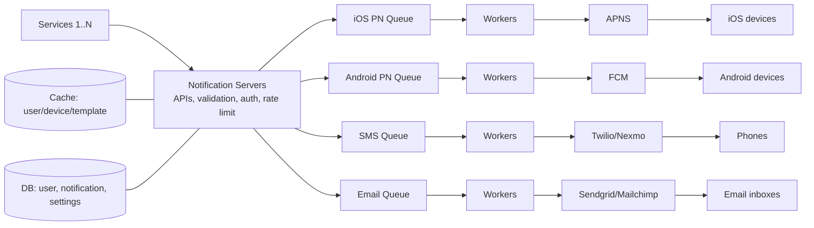

# Design a Notification System · Vol 1 Ch 10

> How to build a scalable system that sends millions of push notifications, SMS, and emails per day — using third-party providers (APNS/FCM/Twilio/Sendgrid), message queues, retries, and dedup.

## 1. The Problem in Plain English

A **notification system** alerts users with important information: breaking news, product updates, events, offers, payment reminders, etc.

A notification is more than mobile push. There are **three formats**:
1. **Mobile push notification** (iOS and Android)
2. **SMS message**
3. **Email**

We must design a system that can send **millions of notifications per day** across all three.

## 2. Requirements (Functional & Non-Functional)

Clarified with the interviewer:

- **Types supported:** push notification, SMS, and email.
- **Real-time?** It's a **soft real-time** system — deliver as fast as possible, but a slight delay is OK under heavy load.
- **Devices:** iOS, Android, and laptop/desktop.
- **Triggers:** notifications can be triggered by **client apps** or **scheduled on the server side**.
- **Opt-out:** yes — users who opt out stop receiving notifications.
- **Volume:** **10 million** push notifications, **1 million** SMS, **5 million** emails per day.

## 3. Back-of-the-Envelope Estimation

Daily volume drives the design:

- **Mobile push:** 10 million/day.
- **SMS:** 1 million/day.
- **Email:** 5 million/day.

The main challenge is scale + reliability (never lose a notification), not raw storage math.

## 4. High-Level Design

### How each notification type works

**iOS push notification** needs three parts:
- **Provider:** builds and sends notification requests to **APNS**. It supplies a **device token** (unique per device) and a **payload** (a JSON dictionary with the notification content).
- **APNS (Apple Push Notification Service):** Apple's remote service that pushes to iOS devices.
- **iOS Device:** the end client that receives the push.

**Android push** works the same way but uses **FCM (Firebase Cloud Messaging)** instead of APNS.

**SMS** uses third-party commercial services like **Twilio** or **Nexmo**.

**Email** uses commercial services like **Sendgrid** or **Mailchimp** (better delivery rates and analytics).

### Contact info gathering

When a user installs the app or signs up, **API servers collect contact info** and store it:
- **User table:** email addresses and phone numbers.
- **Device table:** device tokens (a user can have **multiple devices**, so one push can go to all of them).

### Initial (naive) design and its problems

Start simple: **one notification server** that provides APIs for services 1..N and builds payloads for third-party services.

Three problems:
- **Single point of failure (SPOF):** one server = SPOF.
- **Hard to scale:** everything (DB, cache, processing) is in one server and can't scale independently.
- **Performance bottleneck:** building HTML and waiting on third-party responses is heavy and can overload the server at peak.

### Improved design

Fixes:
- Move the **database and cache out** of the notification server.
- Add **more notification servers** with **automatic horizontal scaling**.
- Introduce **message queues** to decouple components.

Components (left to right):
- **Services 1..N:** any micro-service, cron job, or system that triggers notifications (e.g. billing service emailing payment reminders, shopping site texting delivery updates).
- **Notification servers:** provide send APIs (only accessible **internally / by verified clients** to prevent spam); do basic **validation** (verify emails, phone numbers); fetch data from cache/DB to render the notification; and **put notification data onto message queues** for parallel processing.
- **Cache:** user info, device info, notification templates.
- **DB:** user, notification, settings data.
- **Message queues:** decouple components and act as **buffers** during high volume. **Each notification type gets its own queue**, so an outage in one third-party service won't affect the other types.
- **Workers:** servers that pull events from the queues and send them to the right third-party service.
- **Third-party services:** deliver to users; must be easy to **plug/unplug** (extensibility) since a provider may be unavailable in some markets (e.g. **FCM is unavailable in China**, so alternatives like **Jpush** or **PushY** are used there).

Send flow: (1) service calls the notification API → (2) servers fetch metadata (user info, device token, settings) from cache/DB → (3) event is placed on the matching queue (e.g. iOS PN queue) → (4) workers pull events → (5) workers send to third-party services → (6) third-party services deliver to devices.

## 5. Deep Dive

### Reliability

**Preventing data loss** is the top requirement: notifications can be **delayed or reordered, but never lost**. To ensure this, the system **persists notification data in a database** (a **notification log** DB) and uses a **retry mechanism**.

**Exactly-once delivery?** No — the distributed nature can cause **duplicates**. To reduce duplicates, use a **dedupe mechanism**: when an event arrives, check its **event ID**; if it's been seen before, **discard** it; otherwise send it. (True exactly-once delivery is impossible.)

### Additional Components

- **Notification template:** a preformatted notification so you don't build each one from scratch. You customize parameters, styling, and tracking links. Benefits: **consistent format, fewer errors, saved time.** (Example push template with `[ITEM NAME]`, `[DATE]`, a body, and a CTA.)
- **Notification setting:** gives users fine-grained control. Stored in a table with fields:
  - `user_id` (bigInt)
  - `channel` (varchar — push, email, or SMS)
  - `opt_in` (boolean)

  Before sending, **check whether the user has opted in** for that channel.
- **Rate limiting:** cap how many notifications a user receives, so they don't get overwhelmed (and turn notifications off entirely).
- **Retry mechanism:** if a third-party service fails to send, put the notification **back on the message queue** to retry; if the problem persists, **alert developers**.
- **Security in push notifications:** use an **appKey / appSecret** pair so only **authenticated/verified clients** can call the push APIs.
- **Monitor queued notifications:** watch the **total number of queued notifications**. A large number means workers can't keep up → **add more workers** to avoid delivery delays.
- **Event tracking:** track metrics like **open rate, click rate, engagement** by integrating with an **analytics service**.

### Updated Design

The final design adds, on top of the improved design:
- **Authentication** and **rate-limiting** on the notification servers.
- A **retry mechanism** (failed sends go back to the queue; workers retry a predefined number of times).
- **Notification templates** for consistent, efficient creation.
- **Monitoring and tracking** systems for health checks and improvements.

## 6. Scaling, Bottlenecks & Trade-offs

- **Message queues** decouple components and buffer bursts; **one queue per notification type** isolates provider outages.
- **Horizontal auto-scaling** of notification servers and **more workers** handle load; DB and cache are separated so they scale independently.
- **Cache** (user/device/template data) reduces DB load when rendering notifications.
- **Soft real-time** trade-off: slight delay tolerated under heavy load, so throughput can be prioritized.
- **Duplicates vs loss:** the system chooses "never lose" (persist + retry) and accepts occasional duplicates (mitigated by dedup).

## 7. Failure / Edge Cases

- **Data loss:** prevented via **DB persistence (notification log)** + **retry**.
- **Duplicate delivery:** exactly-once is impossible; **dedupe by event ID** reduces duplicates.
- **Third-party outage:** per-type queues isolate the failure; retries re-queue failed sends; persistent failures alert developers.
- **Provider unavailable in a market** (e.g. FCM in China): swap in alternatives (Jpush, PushY) thanks to extensible integration.
- **User opted out:** always check `opt_in` in the notification setting table before sending.
- **Spam / unauthorized senders:** APIs are internal/verified-only, secured with **appKey/appSecret**, plus rate limiting.
- **Worker backlog:** monitored via queued-notification count; add workers when the backlog grows.

## 8. Key Takeaways

- Supports **three formats**: push (iOS via **APNS**, Android via **FCM**), **SMS** (Twilio/Nexmo), **email** (Sendgrid/Mailchimp).
- Daily scale: **10M push, 1M SMS, 5M email**.
- The naive single-server design has **SPOF, poor scaling, and bottlenecks**; fixed by **separating DB/cache, adding servers with auto-scaling, and inserting message queues**.
- **One message queue per notification type** so a provider outage stays contained; **workers** pull and deliver.
- **Reliability:** persist to a **notification log DB** + **retry**; never lose data (delays/reorders OK).
- **No exactly-once delivery** — **dedupe by event ID** to reduce duplicates.
- Extra features: **templates, opt-in settings, rate limiting, appKey/appSecret security, queue monitoring, event tracking**.

## 9. New Terms & Glossary

- **Provider:** builds and sends push requests (with device token + payload) to APNS/FCM.
- **Device token:** unique identifier for a device, used to target push notifications.
- **Payload:** JSON dictionary carrying the notification's content.
- **APNS (Apple Push Notification Service):** Apple's service that delivers push to iOS devices.
- **FCM (Firebase Cloud Messaging):** Google's service that delivers push to Android devices (unavailable in China → Jpush/PushY).
- **Twilio / Nexmo:** third-party SMS services.
- **Sendgrid / Mailchimp:** third-party email services.
- **Message queue:** buffer that decouples producers (notification servers) from consumers (workers); one per notification type.
- **Worker:** server that pulls events from a queue and sends them to a third-party service.
- **Notification log DB:** database that persists notifications so none are lost.
- **Retry mechanism:** re-queues failed notifications and alerts developers if failures persist.
- **Dedupe (event ID check):** discards already-seen events to reduce duplicate delivery.
- **Notification template:** reusable preformatted notification with customizable parameters.
- **Notification setting (opt_in):** per-user, per-channel preference checked before sending.
- **Rate limiting:** frequency cap on notifications per user.
- **appKey / appSecret:** credentials that authenticate clients calling push APIs.
- **Soft real-time:** deliver as fast as possible, but small delays are acceptable under load.
- **SPOF (single point of failure):** a component whose failure breaks the whole system.
