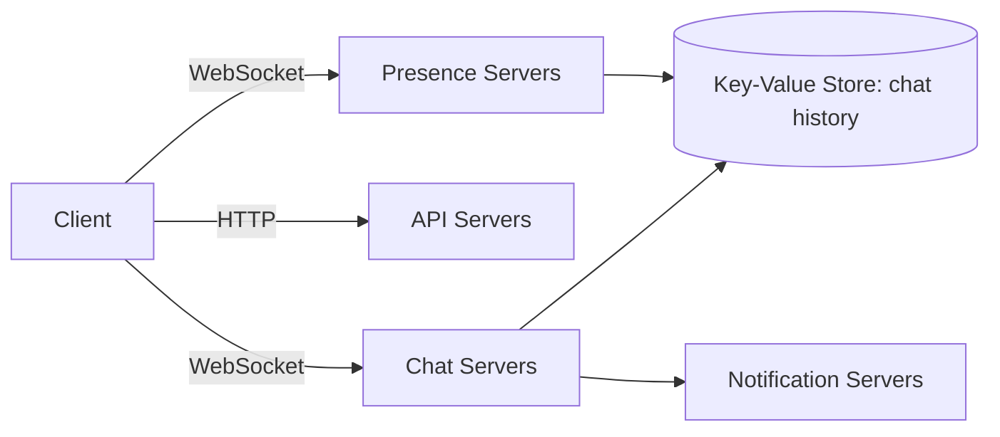
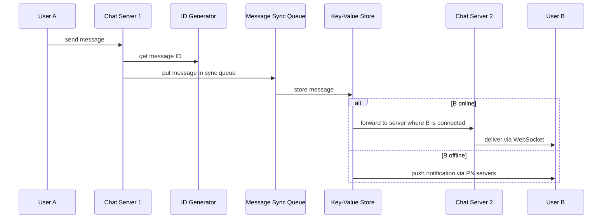

# Design a Chat System · Vol 1 Ch 12

> How to build a Facebook-Messenger-style chat app that delivers 1-on-1 and small-group messages in real time, tracks who is online, and works across multiple devices.

## 1. The Problem in Plain English

A chat app lets people send messages to each other instantly. Different apps focus on different things — WhatsApp/Messenger/WeChat are **1-on-1**, Slack is **group chat**, Discord is **large groups with low-latency voice**. So the first job is to nail down exactly what to build.

Clients never talk to each other directly. Each client connects to a **chat service**, which:
- receives messages from clients,
- finds the right recipient and relays the message,
- holds messages on the server if the recipient is offline until they come back online.

## 2. Requirements (Functional & Non-Functional)

**Functional**
- **1-on-1 chat** with low delivery latency.
- **Small group chat** (max **100 people**).
- **Online presence** (green dot showing who's online).
- **Multiple device support** — the same account logged in on several devices at once.
- **Push notifications**.
- **Text only** for now (no attachments). Message length **< 100,000 characters**.
- Store chat history **forever**.

**Non-Functional**
- Low latency, high availability, scalable.
- End-to-end encryption is **not required** now (discussed only if time allows).

**Scale**
- **50 million DAU**.

## 3. Back-of-the-Envelope Estimation

- **50 million DAU**.
- Real chat systems are enormous: Facebook Messenger and WhatsApp process **60 billion messages a day**.
- **Read-to-write ratio is about 1:1** for 1-on-1 chat apps.
- Connection memory: at **1M concurrent users**, if each connection needs ~**10 KB** of server memory, that's only about **10 GB** — technically one big box could hold them. But a single server is a **deal-breaker** because of the single point of failure; it's fine only as a starting point to discuss.

## 4. High-Level Design

### Choosing the network protocol
- **Sender side:** HTTP with **keep-alive** works fine (keeps a persistent connection, fewer TCP handshakes). Facebook used HTTP initially.
- **Receiver side is harder** because HTTP is client-initiated — the server can't easily push. Options to simulate server push:
  - **Polling** — client repeatedly asks "any messages?" Wastes resources answering "no" most of the time.
  - **Long polling** — client holds the connection open until a message arrives or a timeout. Drawbacks: sender and receiver may hit different (stateless) servers so the message server may not hold the receiver's connection; the server can't easily tell if a client disconnected; still inefficient for light users.
  - **WebSocket** — the chosen solution. Client-initiated, **bi-directional and persistent**. Starts as HTTP, then "upgrades" via a handshake. Works through firewalls (uses port 80/443). Used for **both** sending and receiving to simplify the design.

Because WebSocket connections are persistent, **efficient connection management on the server is critical**. Everything else (signup, login, profile) can still use plain HTTP request/response.

### Three categories of services
- **Stateless services** — login, signup, user profile, service discovery. Sit behind a load balancer that routes by request path.
- **Stateful service** — the **chat service** is the only stateful one, because each client keeps a **persistent connection** to a specific chat server and normally stays on that server. **Service discovery** coordinates with it to avoid overload.
- **Third-party integration** — **push notification** is the most important (tells users about new messages when the app isn't running).

### Adjusted high-level components
- **Chat servers** — send/receive messages (persistent WebSocket to clients).
- **Presence servers** — manage online/offline status.
- **API servers** — login, signup, profile, etc.
- **Notification servers** — send push notifications.
- **Key-value store** — stores chat history (an offline user sees history when back online).

### Storage: why key-value store
Two data types:
- **Generic data** (profiles, settings, friends list) → **relational databases** (with replication and sharding).
- **Chat history data** → **key-value store**, because:
  - enormous volume (60B messages/day),
  - only recent chats accessed often, but random access still needed (search, mentions, jump to a message),
  - KV stores scale horizontally and give very low latency,
  - relational DBs handle the **long tail** poorly (random access gets expensive as indexes grow),
  - proven in practice: **Facebook Messenger uses HBase**, **Discord uses Cassandra**.

### Data models
- **1-on-1 message table:** primary key is **`message_id`**, which decides message order. We can't use `created_at` because two messages can have the same timestamp.
- **Group chat message table:** composite primary key **`(channel_id, message_id)`**. `channel_id` is the **partition key** (all group queries operate within a channel). Channel = group.

**Message ID** must be (1) unique and (2) sortable by time (newer = higher). Three options:
1. **`auto_increment`** in MySQL — but NoSQL usually lacks it.
2. **Global 64-bit sequence generator** like **Snowflake** (Ch 7).
3. **Local sequence number generator** — IDs unique only within a group/channel, which is enough since order only matters per channel. Easier to implement.

## 5. Deep Dive

### Service discovery
Recommends the best chat server for a client based on **geographic location, server capacity**, etc. **Apache Zookeeper** is a popular choice — it registers available chat servers and picks the best one.
1. User A logs in.
2. Load balancer sends login to API servers.
3. Backend authenticates; service discovery picks the best chat server (e.g., server 2) and returns its info.
4. User A connects to chat server 2 via WebSocket.

### 1-on-1 message flow

### Message synchronization across devices
Each device keeps a variable **`cur_max_message_id`** = the latest message ID it has seen. A message is "new" for a device if:
- the recipient ID equals the logged-in user's ID, **and**
- the message ID in the KV store is **larger than** that device's `cur_max_message_id`.

Since each device tracks its own `cur_max_message_id`, every device can pull exactly the new messages it's missing.

### Small group chat flow
When User A sends to a group (say A, B, C), the message is **copied into each recipient's message sync queue** (one for B, one for C). The message sync queue is like an **inbox**. This is good for small groups because:
- each client only checks **its own inbox** for new messages,
- storing a copy per recipient is cheap when groups are small.

**WeChat uses a similar approach and caps groups at 500 members.** For very large groups, storing a copy per member is not acceptable. On the receiving side, one inbox holds messages from many different senders.

### Online presence
Presence servers manage status via WebSocket. Triggers:
- **Login:** after the WebSocket is built, user's status and `last_active_at` are saved in the KV store → shown online.
- **Logout:** status set to offline in KV store.
- **Disconnection:** naively marking offline on every drop is bad — people flicker on/off (e.g., driving through a tunnel). Solution: a **heartbeat** — the client sends a heartbeat every few seconds (example: every 5 seconds); if the server gets no heartbeat within **x seconds (example x = 30)**, mark offline.

**Online status fanout:** presence servers use a **publish-subscribe** model. Each **friend pair has a channel** (A-B, A-C, A-D). When A's status changes, it publishes to those channels; B, C, D are subscribed and get the update over WebSocket. Good for small groups (WeChat caps at 500). For huge groups (e.g., 100,000 members) each change would create 100,000 events — instead, **fetch online status only when a user enters a group or manually refreshes** the friend list.

## 6. Scaling, Bottlenecks & Trade-offs

- **Single server** is only a starting point — single point of failure kills it.
- **Concurrent connections** are the main limiting factor for chat servers.
- **Presence fanout** is a bottleneck for large groups → switch to on-demand fetching.
- **Copy-per-recipient inbox** works for small groups but doesn't scale to huge ones.
- Extra improvements: **client-side message caching** to reduce data transfer; Slack built a geographically distributed edge cache (**Flannel**) for faster load times.

## 7. Failure / Edge Cases

- **Chat server goes offline** — it may hold hundreds of thousands of connections. **Service discovery (Zookeeper)** gives clients a new chat server to reconnect to.
- **Message resend** — use **retry and queueing** to resend failed messages.
- **Frequent disconnect/reconnect** — solved by the heartbeat mechanism so presence doesn't flicker.
- **Offline recipient** — message held in KV store; push notification sent.

## 8. Key Takeaways

- **WebSocket** (bi-directional, persistent) is the core real-time protocol; use it for both send and receive. Everything else can be plain HTTP.
- Only the **chat service is stateful**; keep other services stateless behind a load balancer.
- **Key-value store** (HBase / Cassandra) for chat history; relational DB for generic data.
- **`message_id`** guarantees ordering; generate it globally (Snowflake) or locally per channel.
- **`cur_max_message_id`** per device makes multi-device sync simple.
- Small groups → **copy message into each recipient's inbox**; large groups need different strategies.
- **Heartbeat** for reliable presence; **pub-sub per friend pair** for status fanout, but fetch-on-demand for huge groups.

## 9. New Terms & Glossary

- **WebSocket** — a persistent, two-way connection between client and server that can be started from a normal HTTP connection.
- **Polling / Long polling** — techniques where the client repeatedly asks the server for new data; long polling holds the request open until data or timeout.
- **Keep-alive** — an HTTP feature that keeps a connection open so it can be reused.
- **Stateful service** — a service that remembers connection state (here, the chat server holding your WebSocket).
- **Service discovery** — a system (e.g., Zookeeper) that tells a client which server to connect to.
- **Zookeeper** — an open-source coordination/service-discovery tool.
- **Key-value store** — a fast, horizontally scalable database storing values by key (e.g., HBase, Cassandra).
- **Long tail** — the huge number of rarely-accessed items; relational DBs handle it poorly.
- **Snowflake** — Twitter's 64-bit distributed unique-ID generator.
- **Message sync queue / inbox** — a per-user queue holding incoming messages.
- **`cur_max_message_id`** — a per-device marker of the latest message that device has.
- **Heartbeat** — a periodic signal a client sends to prove it's still online.
- **Publish-subscribe (pub-sub)** — a pattern where publishers send events to channels and subscribers receive them.
- **Presence** — whether a user is online or offline.
