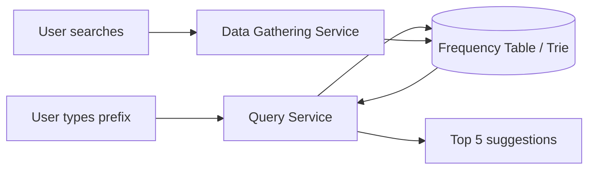

# Design a Search Autocomplete System · Vol 1 Ch 13

> How to build the "as-you-type suggestions" you see in Google or Amazon search — returning the top 5 most popular matching queries in under 100 ms.

## 1. The Problem in Plain English

When you type in a search box, the system instantly shows matching suggestions. This is called **autocomplete**, **typeahead**, **search-as-you-type**, or **incremental search**. In interviews it's also called **"design top k"** or **"design top k most searched queries."**

Type "dinner" and it shows a list of completed suggestions, ranked by how popular each query is.

## 2. Requirements (Functional & Non-Functional)

**Functional**
- Match **only at the beginning** of a query (prefix match, not middle).
- Return **5** suggestions.
- Ranking is by **popularity** (historical query frequency).
- **No spell check / autocorrect**.
- Queries are **English**, all **lowercase alphabetic** (no capitals or special characters). Multi-language discussed only if time allows.

**Non-Functional**
- **Fast response**: suggestions must appear within **100 milliseconds** (per a Facebook article) — otherwise typing stutters.
- **Relevant**, **sorted** by popularity, **scalable**, **highly available**.

**Scale**
- **10 million DAU**.

## 3. Back-of-the-Envelope Estimation

- **10M DAU**, each person does **10 searches/day**.
- **20 bytes per query** (ASCII, 1 char = 1 byte; ~4 words × 5 chars = 20 bytes).
- Every keystroke sends a request. Typing "dinner" sends 6 requests (`d`, `di`, `din`, `dinn`, `dinne`, `dinner`) — about **20 requests per query** on average.
- **QPS ≈ 24,000** = 10M users × 10 queries × 20 chars ÷ 24 ÷ 3600.
- **Peak QPS ≈ 48,000** (QPS × 2).
- Assume **20% of daily queries are new** → 10M × 10 × 20 bytes × 20% = **0.4 GB of new data per day**.

## 4. High-Level Design

Two parts:
- **Data gathering service** — collects user queries and aggregates their frequency.
- **Query service** — given a prefix, returns the **top 5** most frequent queries.

**Simple first version:** keep a **frequency table** (fields: `query`, `frequency`). As users search, increment the count. To get the top 5 for prefix "tw", run a SQL query that filters by prefix, orders by frequency, and limits to 5. This is **fine for small data but becomes a database bottleneck** at scale.



## 5. Deep Dive

### Trie (prefix tree) — the core data structure
Fetching top 5 from a relational DB is inefficient, so we use a **trie** (pronounced "try", from re**trie**val).
- Tree-like structure that compactly stores strings.
- **Root = empty string.**
- Each node stores a character and can have **26 children** (one per letter); empty links aren't drawn.
- Each node represents a **word or prefix**.
- To rank, store **frequency info in nodes**.

**Basic top-k algorithm** (terms: `p` = prefix length, `n` = total nodes, `c` = children of a node):
1. **Find the prefix node** — O(p).
2. **Traverse the subtree** to collect all valid children (queries) — O(c).
3. **Sort children, take top k** — O(c log c).

Total: **O(p) + O(c) + O(c log c)**. This is **too slow** because the worst case traverses much of the trie.

**Two optimizations:**
1. **Limit max prefix length** (say **50**). Users rarely type long queries, so "find the prefix" drops from O(p) to **O(1)**.
2. **Cache top k queries at each node.** Since 5–10 suggestions are enough, store the **top 5** at every node. Example: node with prefix "be" stores `[best:35, bet:29, bee:20, be:15, beer:10]`.

After both optimizations:
1. Find the prefix node → **O(1)**.
2. Return top k (already cached) → **O(1)**.

So retrieval becomes **O(1)** overall. This **trades space for time** (more memory, but very fast), which is worth it.

```mermaid
flowchart TD
    Root(()) --> t[t]
    Root --> w[w]
    t --> tr["tr top: true 35, try 29"]
    tr --> tree[tree 10]
    tr --> true[true 35]
    tr --> try[try 29]
```

### Data gathering service (redesigned)
Updating the trie on **every** query is impractical: billions of queries/day would slow the query service, and top suggestions rarely change once built. Data actually comes from **analytics/logging services**. Components:
- **Analytics Logs** — raw search-query data, **append-only** and not indexed.
- **Aggregators** — logs are huge and messy, so aggregate them. Real-time apps like Twitter aggregate in short intervals; many use cases are fine aggregating weekly. **The book assumes the trie is rebuilt weekly.**
- **Aggregated Data** — e.g., weekly table with `query`, `time` (start of week), `frequency` (sum of occurrences that week).
- **Workers** — servers running asynchronous jobs at intervals; they **build the trie** and store it in Trie DB.
- **Trie Cache** — distributed cache keeping the trie in memory for fast reads; takes a **weekly snapshot** of the DB.
- **Trie DB** — persistent storage. Two options:
  1. **Document store** (e.g., **MongoDB**) — serialize the weekly trie snapshot and store it.
  2. **Key-value store** — map every **prefix → key** and each node's data → value (trie as a hash table).

### Query service (improved)
1. Search query → **load balancer**.
2. Load balancer → **API servers**.
3. API servers get trie data from **Trie Cache** and build suggestions.
4. On a **cache miss** (cache server out of memory or offline), replenish data back into the cache so later requests hit it.

**Speed optimizations:**
- **AJAX requests** — fetch suggestions without reloading the whole web page.
- **Browser caching** — suggestions don't change much short-term, so cache in the browser. Google uses `cache-control: private, max-age=3600` (private = single user only, not a shared cache; max-age = valid for 3600 s = 1 hour).
- **Data sampling** — logging every query is expensive, so log only **1 in every N** requests.

### Trie operations
- **Create** — workers build the trie from aggregated Analytics Log/DB data.
- **Update** — Option 1: **rebuild weekly** and replace the old trie (preferred). Option 2: **update a node directly** (avoid — it's slow, and every **ancestor up to the root must be updated** because ancestors cache children's top queries; acceptable only for small tries). Example: changing "beer" from 10 → 30 updates the node and all its ancestors.
- **Delete** — remove hateful/violent/explicit/dangerous suggestions using a **filter layer in front of the Trie Cache**. Unwanted items are removed from the DB **asynchronously** so the next rebuild uses clean data.

### Scale the storage (sharding)
The trie may grow too big for one server.
- **Naive sharding by first character:** e.g., 2 servers = `a–m` and `n–z`; 3 servers = `a–i`, `j–r`, `s–z`; up to **26 servers** (one per letter), and further with second/third-level sharding (e.g., `a` split into `aa-ag`, `ah-an`, `ao-au`, `av-az`).
- **Problem:** uneven distribution — far more words start with `c` than `x`.
- **Solution:** a **shard map manager** that analyzes historical distribution and keeps a lookup DB mapping rows to shards. Example: if `s` alone has as many queries as `u–z` combined, make one shard for `s` and one for `u–z`.

## 6. Scaling, Bottlenecks & Trade-offs

- **DB read on every keystroke** is the original bottleneck → replaced by in-memory trie + cache.
- **Space vs time:** caching top-k at every node uses lots of memory but gives O(1) reads — a worthwhile trade.
- **Uneven shards** by first letter → use a shard map manager based on real data.
- **Rebuild frequency trade-off:** weekly is cheap and fine for stable queries; real-time apps need shorter intervals.

## 7. Failure / Edge Cases

- **Cache miss** (cache server out of memory/offline) → replenish from Trie DB.
- **Bad suggestions** → filter layer removes them; async DB cleanup for next build.
- **Trending / real-time queries** — the weekly rebuild can't react to breaking news. Ideas: shard to shrink the working set, weight recent queries more, and use stream-processing systems (**Hadoop MapReduce, Spark Streaming, Storm, Kafka**). Full real-time is beyond the book's scope.

## 8. Key Takeaways

- The **trie** is the core: prefix lookup + frequency in nodes.
- Make retrieval **O(1)** by **limiting prefix length** and **caching top-k at each node** (trade space for time).
- Build the trie **offline** from **analytics logs** via aggregators and workers; **rebuild weekly**.
- Store the trie in a **document store (MongoDB)** or **key-value store** (prefix→key).
- Speed up reads with **AJAX**, **browser caching** (1 hour), and **data sampling** (1 in N).
- **Shard** the trie with a **shard map manager** to handle uneven letter distribution.

## 9. New Terms & Glossary

- **Autocomplete / typeahead / typeahead / search-as-you-type** — suggestions shown as you type.
- **Top k** — the k most frequent/relevant results (here, top 5).
- **Trie (prefix tree)** — a tree that stores strings by character, great for prefix search.
- **Prefix** — the beginning part of a query (e.g., "tr" in "true").
- **Frequency table** — a table counting how often each query is searched.
- **Aggregator** — component that summarizes raw logs into usable counts.
- **Trie Cache / Trie DB** — in-memory cache and persistent store for the trie.
- **Document store** — a DB storing serialized documents (e.g., MongoDB).
- **AJAX** — a way for a browser to fetch data without reloading the page.
- **cache-control / max-age / private** — HTTP headers controlling browser caching duration and scope.
- **Data sampling** — logging only a fraction of requests to save resources.
- **Sharding** — splitting data across multiple servers.
- **Shard map manager** — a lookup service deciding which shard holds which data.
- **Stream processing** — handling continuously generated data (Hadoop, Spark, Storm, Kafka).
