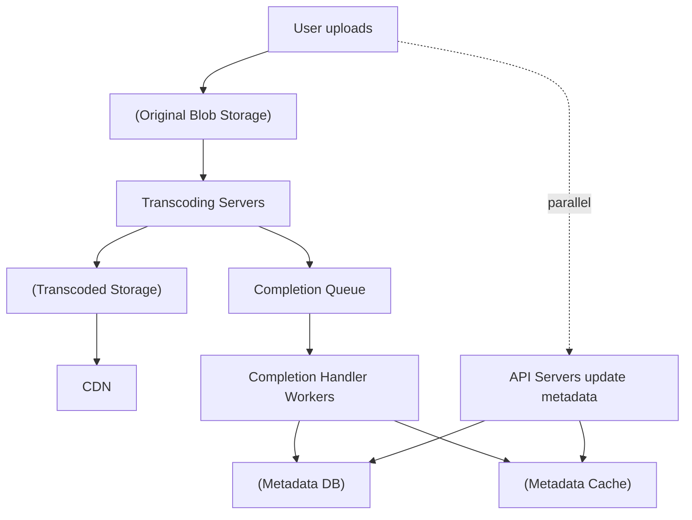
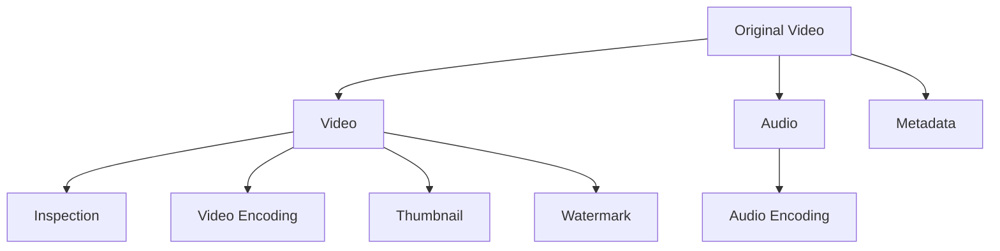

# Design YouTube · Vol 1 Ch 14

> How to build a video platform where creators upload videos fast and viewers stream them smoothly worldwide — using blob storage, CDN, and a parallel transcoding pipeline.

## 1. The Problem in Plain English

YouTube looks simple (upload a video, press play) but hides huge complexity. Some 2020 stats: **2 billion monthly active users**, **5 billion videos watched per day**, **50 million creators**, available in **80 languages**, ~**37% of all mobile internet traffic**.

We focus on just two flows: **uploading a video** and **watching (streaming) a video**. The same design applies to Netflix, Hulu, etc.

## 2. Requirements (Functional & Non-Functional)

**Functional**
- **Upload videos fast.**
- **Smooth video streaming.**
- **Change video quality** (resolution).
- Accept **most video resolutions and formats**.
- **Encryption required.**
- **Max video size: 1 GB** (focus on small/medium videos).
- Clients: **mobile apps, web browser, smart TV**.

**Non-Functional**
- **Low infrastructure cost**, high availability, scalability, reliability, international support.

**Key decision:** **leverage existing cloud services** (CDN + blob storage) instead of building from scratch — even Netflix uses AWS and Facebook uses Akamai's CDN.

**Scale**
- **5 million DAU**, 30 minutes/day average.

## 3. Back-of-the-Envelope Estimation

- **5M DAU**, users watch **5 videos/day**.
- **10% of users upload 1 video/day**; average video size **300 MB**.
- **Daily storage** = 5M × 10% × 300 MB = **150 TB/day**.
- **CDN cost** (you're charged for data transferred out): using AWS CloudFront at ~**$0.02/GB** (US traffic): 5M × 5 videos × 0.3 GB × $0.02 = **$150,000 per day** just for streaming. CDN is expensive → cost-saving becomes a deep-dive topic.

## 4. High-Level Design

Three top-level components:
- **Client** — computer, phone, smart TV.
- **CDN** — videos are stored/cached here; streaming comes from the CDN.
- **API servers** — everything except streaming (feed recommendation, generating upload URLs, updating metadata DB/cache, signup, etc.).

**Upload flow components:**
- **User**, **Load balancer** (spreads requests over API servers), **API servers**.
- **Metadata DB** — video metadata; **sharded and replicated**.
- **Metadata cache** — caches video metadata and user objects.
- **Original storage** — **blob storage** for raw uploaded videos (BLOB = Binary Large Object).
- **Transcoding servers** — convert video into other formats/resolutions (also called encoding).
- **Transcoded storage** — blob storage for transcoded files.
- **CDN** — caches videos for streaming.
- **Completion queue** — message queue holding "transcoding done" events.
- **Completion handler** — workers that pull from the queue and update metadata DB and cache.

**Two parallel processes on upload:** (a) upload the actual video, (b) update the metadata.

**Flow a (upload the video):** 1) video → original storage; 2) transcoding servers fetch it and transcode; 3) when done, in parallel: (3a) transcoded video → transcoded storage → distributed to CDN, and (3b) a completion event → completion queue → completion handler workers → update metadata DB and cache; 4) API servers tell the client it's uploaded and ready.

**Flow b (metadata):** while the file uploads, the client separately asks API servers to update metadata (file name, size, format, etc.); API servers update cache and DB.

### Video streaming flow
- **Streaming** = your device continuously receives a bit of video at a time (vs **downloading** the whole file first). This lets you watch immediately.
- **Streaming protocols** (standardized ways to control data transfer): **MPEG-DASH** (Dynamic Adaptive Streaming over HTTP), **Apple HLS** (HTTP Live Streaming), **Microsoft Smooth Streaming**, **Adobe HDS**. Different protocols support different encodings/players.
- Videos are **streamed directly from the CDN** — the **edge server closest to you** delivers it, so latency is very low.

## 5. Deep Dive

### Video transcoding (encoding)
Raw video is huge (an hour of HD at 60 fps can be hundreds of GB) and devices support only certain formats. Transcoding lets us: reduce size, match device formats, and serve higher resolution to fast connections / lower to slow ones, and switch quality automatically as network changes.

Encoding formats have two parts:
- **Container** — the "basket" holding video + audio + metadata (e.g., `.avi`, `.mov`, `.mp4`).
- **Codecs** — compression/decompression algorithms (most common: **H.264, VP9, HEVC**).

### DAG (Directed Acyclic Graph) model
Transcoding is expensive, and creators have different needs (watermarks, own thumbnails, HD or not). To support flexible pipelines with high parallelism, use a **DAG programming model** (like **Facebook's streaming video engine**) where tasks are defined in **stages** run sequentially or in parallel. The original video is split into **video, audio, metadata**, then tasks apply:
- **Inspection** — check quality / not malformed.
- **Video encodings** — different resolutions, codecs, bitrates.
- **Thumbnail** — uploaded by user or auto-generated.
- **Watermark** — image overlay identifying the video.

### Video transcoding architecture (6 components)
- **Preprocessor** — 4 jobs: (1) **video splitting** into **GOP** (Group of Pictures — a chunk of frames, a few seconds, independently playable); (2) split by **GOP alignment** for old clients that can't split; (3) **DAG generation** from client config files; (4) **cache data** — store GOPs and metadata in temporary storage so a failed encode can retry.
- **DAG scheduler** — splits the DAG into **stages of tasks** and puts them in the task queue. Example: stage 1 = video/audio/metadata; stage 2 = video encoding + thumbnail (from video) and audio encoding (from audio).
- **Resource manager** — manages efficient allocation with 3 queues + a scheduler: **Task queue** (priority queue of tasks), **Worker queue** (worker utilization info), **Running queue** (currently running tasks/workers), and a **Task scheduler** that picks the best task + best worker, tells the worker to run, records it in the running queue, and removes it when done.
- **Task workers** — run the DAG tasks (encoding, thumbnail, watermark, etc.).
- **Temporary storage** — multiple systems by data type: metadata in **memory cache** (small, frequently accessed), video/audio in **blob storage**. Freed once processing completes.
- **Encoded video** — the final output, e.g., `funny_720p.mp4`.

### System optimizations
**Speed:**
- **Parallelize uploading** — split the video into chunks by **GOP alignment** (done on the **client**) for fast **resumable uploads** after a failure.
- **Upload centers close to users** — set up multiple upload centers globally using **CDN as upload centers** (US users → North America center, China users → Asia center).
- **Parallelism everywhere** — the raw flow (original storage → CDN) has step-by-step dependencies that block parallelism. Introduce **message queues** so, e.g., the encoding module doesn't have to wait for the download module — it processes queued events in parallel. This creates a **loosely coupled** system.

**Safety:**
- **Pre-signed upload URL** — so only authorized users upload to the right place: client asks API servers for a pre-signed URL → API servers return it → client uploads using it. (AWS S3 calls it "pre-signed URL"; Azure calls it "Shared Access Signature".)
- **Protect videos** — **DRM systems** (Apple FairPlay, Google Widevine, Microsoft PlayReady), **AES encryption** (decrypted only on authorized playback), and **visual watermarking**.

**Cost-saving (CDN is expensive):** YouTube streams follow a **long-tail distribution** (a few videos are watched a lot, most rarely). So:
1. Serve only the **most popular videos from CDN**; serve others from **high-capacity storage video servers**.
2. For less popular content, store **fewer encoded versions**; short videos can be **encoded on-demand**.
3. Distribute **region-popular videos only to those regions**.
4. **Build your own CDN and partner with ISPs** (Comcast, AT&T, Verizon) — huge project, but worth it for large companies like Netflix.

## 6. Scaling, Bottlenecks & Trade-offs

- **CDN cost** is the biggest bottleneck (~$150k/day) → the long-tail-based optimizations above.
- **API tier** is **stateless** → easy horizontal scaling.
- **Database** → replication and sharding.
- **Transcoding** is the compute-heavy step → DAG + resource manager + message queues for parallelism.
- **Live streaming** (extra topic): shares upload/encode/stream steps but needs **lower latency** (maybe a different protocol), **less parallelism** (small real-time chunks), and **fast error handling**.

## 7. Failure / Edge Cases

Two error types: **recoverable** (e.g., a segment fails to transcode → **retry**; if still failing, return an error code) and **non-recoverable** (e.g., malformed format → **stop tasks**, return error code). Playbook:
- **Upload error** → retry.
- **Split video error** → if old clients can't split by GOP, send whole video; server does the splitting.
- **Transcoding error** → retry.
- **Preprocessor error** → regenerate DAG.
- **DAG scheduler error** → reschedule the task.
- **Resource manager queue down** → use a replica.
- **Task worker down** → retry on a new worker.
- **API server down** → stateless, so route to another API server.
- **Metadata cache server down** → data is replicated; read from other nodes and bring up a replacement.
- **Metadata DB** → **master down**: promote a slave to master; **slave down**: use another slave for reads and bring up a replacement.
- **Video takedowns** — remove copyright/illegal content, found during upload or via user flagging.

## 8. Key Takeaways

- **Don't build blob storage or CDN yourself** — leverage cloud (S3-style blob storage + CDN).
- **Two flows:** upload (video + metadata in parallel) and stream (directly from nearest CDN edge).
- **Transcoding** is essential and modeled as a **DAG** of staged, parallel tasks (inspection, encoding, thumbnail, watermark).
- The transcoding system = **preprocessor, DAG scheduler, resource manager (3 queues), task workers, temporary storage, encoded output**.
- Speed via **GOP chunking + resumable uploads**, **global upload centers**, and **message queues** for parallelism.
- Safety via **pre-signed URLs**, **DRM/AES encryption**, **watermarks**.
- Cut CDN cost using the **long-tail distribution** (CDN for popular, cheaper storage/on-demand encoding for the rest, regional distribution, own CDN + ISPs).

## 9. New Terms & Glossary

- **Blob storage (BLOB)** — storage for large binary objects (raw video files).
- **CDN (Content Delivery Network)** — geographically distributed servers that cache content near users.
- **Edge server** — the CDN server nearest to a given user.
- **Transcoding / encoding** — converting a video into other formats, resolutions, and bitrates.
- **Bitrate** — how many bits are processed per unit time; higher = better quality but heavier.
- **Container** — file wrapper holding video/audio/metadata (.mp4, .mov, .avi).
- **Codec** — compression/decompression algorithm (H.264, VP9, HEVC).
- **DAG (Directed Acyclic Graph)** — a task graph with no cycles, used to run steps in stages/parallel.
- **GOP (Group of Pictures)** — an independently playable chunk of video frames.
- **Streaming protocol** — standard controlling video data transfer (MPEG-DASH, HLS, Smooth Streaming, HDS).
- **Streaming vs downloading** — receiving video continuously vs copying the whole file first.
- **Resumable upload** — an upload that can continue from where it failed.
- **Pre-signed URL** — a temporary authorized URL to upload directly to storage.
- **DRM (Digital Rights Management)** — systems (FairPlay, Widevine, PlayReady) that protect content.
- **Long-tail distribution** — a few items are very popular, most are rarely accessed.
- **ISP (Internet Service Provider)** — companies (Comcast, AT&T) you can partner with for delivery.
