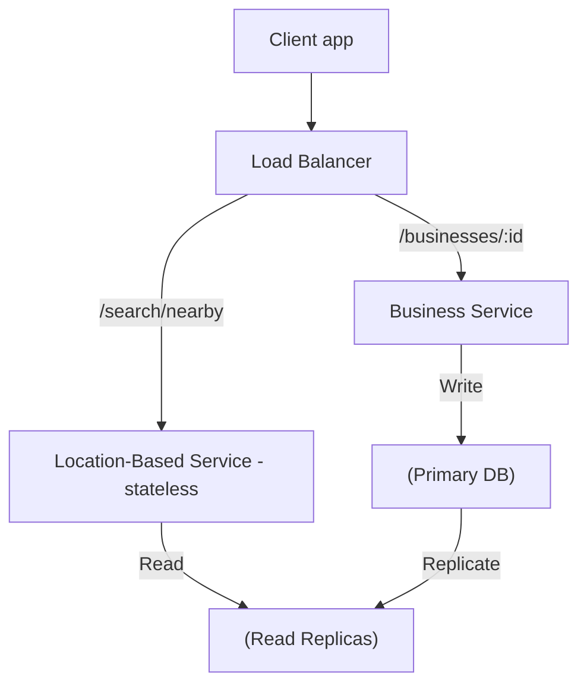
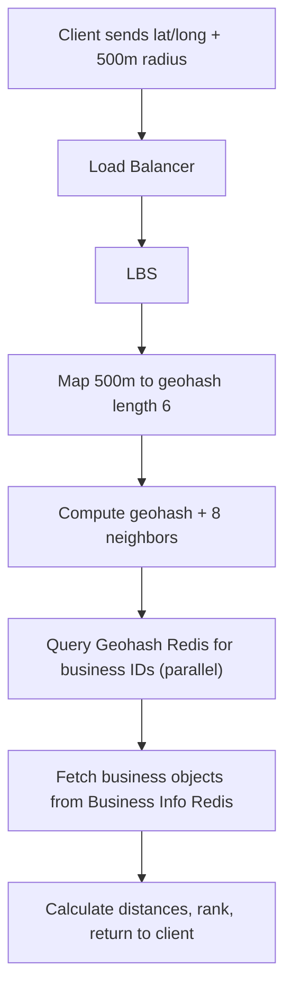

# Design a Proximity Service · Vol 2 Ch 1

> A service that finds nearby places (restaurants, hotels, gas stations) for a user's location + radius, powered by a geospatial index (geohash / quadtree / Google S2).

## 1. The Problem in Plain English

A proximity service answers: "What businesses are near me?" Think of Yelp showing nearby restaurants, or Google Maps showing the closest gas stations. The user gives their location (latitude, longitude) and a radius, and the system returns all matching businesses inside that circle.

The hard part is speed. A naive search would scan every business in the world, which is far too slow. The trick is a **geospatial index** — a clever way to organize places on a map so nearby ones can be found instantly.

## 2. Requirements (Functional & Non-Functional)

**Functional**
- Return all businesses within a given radius of a user's location (latitude/longitude).
- Business owners can add, delete, or update a business (does NOT need to appear in real time — the book assumes changes take effect the next day).
- Customers can view detailed information about a business.

**Clarified scope from the interview**
- Max radius: 20 km (12.42 miles).
- User can pick radius from a fixed list: 0.5 km, 1 km, 2 km, 5 km, 20 km.
- Users move slowly, so results don't need constant refresh.

**Non-Functional**
- **Low latency** — results must appear quickly.
- **Data privacy** — location is sensitive; must comply with laws like **GDPR** and **CCPA**.
- **High availability and scalability** — handle traffic spikes during peak hours in dense areas.

## 3. Back-of-the-Envelope Estimation

- 100 million daily active users (DAU), 200 million businesses.
- Seconds per day ≈ 10^5 (rounded from 86,400).
- Assume 5 searches per user per day.
- **Search QPS = (100 million × 5) / 10^5 = 5,000 QPS.**
- Read-heavy system (searches + viewing details are frequent); writes (add/edit/delete business) are rare.

## 4. High-Level Design

The system has two parts: **Location-Based Service (LBS)** and **Business Service**.

- **Load balancer** — single DNS entry point, routes API calls to the right service by URL path.
- **LBS** — the core. Finds nearby businesses. It is read-heavy, high-QPS, and **stateless** (easy to scale horizontally).
- **Business Service** — handles two things: owners adding/updating/deleting businesses (writes, low QPS), and customers viewing business details (reads, high QPS at peak).
- **Database cluster** — primary-secondary (primary handles writes, replicas handle reads). Some replication delay is acceptable because business data isn't real-time.

**APIs (RESTful):**
- `GET /v1/search/nearby` — params: latitude, longitude, radius (default 5000 m). Returns total + list of business objects. Paginated in real life.
- `GET /v1/businesses/:id`, `POST /v1/businesses`, `PUT /v1/businesses/:id`, `DELETE /v1/businesses/:id`.

**Data model:** a `business` table (primary key `business_id`, holds address/city/state/country/lat/long) and a `geo index` table for spatial queries. MySQL fits well because it's read-heavy.

### Algorithms to find nearby businesses

The book compares five options. Two broad families: **Hash** (even grid, geohash, cartesian tiers) and **Tree** (quadtree, Google S2, R-tree).

**Option 1 — Two-dimensional search (naive).** Draw a box around the user (`latitude BETWEEN ... AND longitude BETWEEN ...`). Problem: even with indexes on latitude and longitude separately, each dimension returns a huge dataset, and you must intersect two big lists. Inefficient because a DB index only speeds up one dimension. The insight: **map 2D data to 1D**.

**Option 2 — Evenly divided grid.** Split the world into equal squares. Problem: business distribution is uneven (downtown NYC vs. an ocean), so grids are unbalanced. Also hard to find neighboring grids.

**Option 3 — Geohash (the book's chosen example).** Converts 2D lat/long into a 1D string. It recursively divides the world into 4 quadrants, alternating longitude and latitude bits, using **base32**:
- Latitude [-90,0]→0, [0,90]→1; Longitude [-180,0]→0, [0,180]→1.
- Example: Google HQ = `9q9hvu`, Facebook HQ = `9q9jhr` (length 6).
- 12 precision levels. The design uses **lengths 4–6** (length 6 ≈ 1.2 km × 609.4 m; length 4 ≈ 39.1 km × 19.5 km). Radius→length map: 0.5 km→6, 1 km→5, 2 km→5, 5 km→4, 20 km→4.
- Property: the longer the shared prefix between two geohashes, the closer they are.

## 5. Deep Dive

### Geohash boundary problems

- **Boundary issue 1:** Two very close points can share NO prefix (opposite sides of the equator/prime meridian). Example in France: La Roche-Chalais (`u000`) is 30 km from Pomerol (`ezzz`) but the geohashes have no common prefix. So a simple `WHERE geohash LIKE '9q8zn%'` misses businesses.
- **Boundary issue 2:** Two points with a long shared prefix can still fall in different grids.
- **Fix:** Fetch businesses from the current grid AND its 8 neighbors (neighbor geohashes are computable in constant time).
- **Not enough results?** Remove the last digit of the geohash to enlarge the grid, and keep removing digits until enough businesses are returned (expanding search).

### Quadtree (Option 4)

An **in-memory tree** (not a database) built at server start-up, living on each LBS server. Recursively splits 2D space into 4 quadrants until each grid holds ≤ 100 businesses (number is configurable).

- **Memory math (200M businesses):** ~2 million leaf nodes (200M/100), ~0.67 million internal nodes (⅓ of leaves). Leaf node = 832 bytes, internal = 64 bytes → **~1.71 GB total**. Fits easily on one server.
- **Build time:** O((n/100) · log(n/100)); a few minutes for 200M businesses.
- **Query:** traverse from root to the leaf containing the search origin; if fewer than needed, add neighbors.
- **Operational care:** because start-up takes minutes and the server can't serve traffic while building, roll out incrementally (or use **blue/green deployment**). Update the tree via nightly rebuild (businesses take effect next day) or on-the-fly (needs locking, complex).

### Google S2 (Option 5)

In-memory, maps a sphere to a 1D index using the **Hilbert curve** (a space-filling curve where points close on the curve are close in 1D). Great for **geofencing** (arbitrary areas, varying levels) and has a flexible **Region Cover** algorithm (specify min level, max level, max cells). Used by Google Maps and Tinder. Too complex to explain in an interview — book recommends geohash or quadtree.

### Geohash vs Quadtree

| Geohash | Quadtree |
|---|---|
| Easy to implement, no tree | Harder — must build tree |
| Returns businesses within a radius | Returns **k-nearest** (good for "nearest gas stations") |
| Fixed grid size per precision | Grid size adapts to population density |
| Easy index update (remove a row) | Update is O(log n), needs locking + rebalancing |

Companies: geohash → Bing, Redis, MongoDB, Lyft; quadtree → Yext; both → Elasticsearch; S2 → Google Maps, Tinder.

### Scale the database

- **Business table:** shard by `business_id` (even distribution, easy to maintain).
- **Geospatial index table:** two options. **Option 1** stores a JSON array of business IDs per geohash (one row). **Option 2** stores one row per (geohash, business_id) compound key. **Book recommends Option 2** — adding/removing a business is trivial with no array scanning or row locking.
- **Scaling the geo index:** The whole index is small (~1.71 GB), fits in one server's working set. Don't jump to sharding (it forces sharding logic into the app layer). Instead, add **read replicas** — much simpler.

### Caching

- Ask first: do we even need it? The dataset is small and fits in memory, so DB queries are already fast; read replicas can handle read load. Benchmark before adding cache.
- **Cache key:** don't use raw coordinates (imprecise, change slightly). Use the **geohash** — small location changes still map to the same key.
- **What to cache:** (1) `geohash → list of business IDs` (precomputed, stored in Redis), cached at precisions 4, 5, 6. (2) `business_id → business object` for rendering pages.
- **Memory:** ~8 bytes × 200M × 3 precisions ≈ 5 GB (plus business objects) ≈ 6 GB total. One Redis server suffices, but deploy globally for availability and low latency.

### Region and availability zones

Deploy LBS to multiple regions/AZs to: (1) put users physically closer, (2) spread traffic evenly (dense areas like Japan/Korea get their own regions), (3) satisfy **privacy laws** (keep a country's data local via DNS routing).

### Final flow (get nearby businesses)

## 6. Scaling, Bottlenecks & Trade-offs

- LBS and Business Service are stateless → autoscale up at mealtimes, down at night.
- Prefer **read replicas over sharding** for the small geo index.
- **Quadtree trade-off:** faster adaptive grids and k-nearest, but complex updates/locking and slow start-up.
- **Cache trade-off:** may not be worth it since data is already small; nightly invalidation can invalidate tons of keys at once (heavy cache load).
- **Filtering** (open now / restaurants only): grids return small result sets, so it's fine to fetch IDs, hydrate objects, then filter by opening time or type in the business table.

## 7. Failure / Edge Cases

- **Geohash boundary misses** → query the 8 neighbor grids.
- **Too few results** → strip geohash digits to widen the search.
- **Quadtree server start-up** blocks traffic → incremental/blue-green rollout.
- **Replication delay** between primary and replicas → acceptable since business data isn't real-time.
- **Mass cache invalidation** from a nightly job → heavy load spike to plan for.

## 8. Key Takeaways

- The core idea of every geospatial index is the same: **divide the map into small areas and index them for fast search**, reducing 2D to 1D.
- **Geohash** = simple, prefix-based, radius search, easy updates. **Quadtree** = adaptive grids + k-nearest. **S2** = Hilbert curve + geofencing.
- Explain *how* the index works, not just database names.
- Don't over-engineer: the geo index is tiny — use **read replicas**, not sharding.
- Deploy across regions/AZs for latency, load balancing, and privacy compliance.

## 9. New Terms & Glossary

- **LBS (Location-Based Service):** the stateless service that finds nearby businesses.
- **Geospatial index:** a data structure that lets you find things by location quickly.
- **Geohash:** encoding that turns lat/long into a base32 string; shared prefix ⇒ closeness.
- **Base32:** the 32-character alphabet geohash uses.
- **Quadtree:** in-memory tree that splits 2D space into 4 quadrants recursively until a business-count threshold.
- **Google S2:** library mapping a sphere to 1D via the Hilbert curve.
- **Hilbert curve:** a space-filling curve preserving locality (nearby points stay nearby in 1D).
- **Geofence:** a virtual perimeter around a real-world area.
- **Region / Availability Zone (AZ):** geographic/data-center groupings for deployment.
- **GDPR / CCPA:** European and Californian data-privacy laws.
- **QPS:** queries per second.
