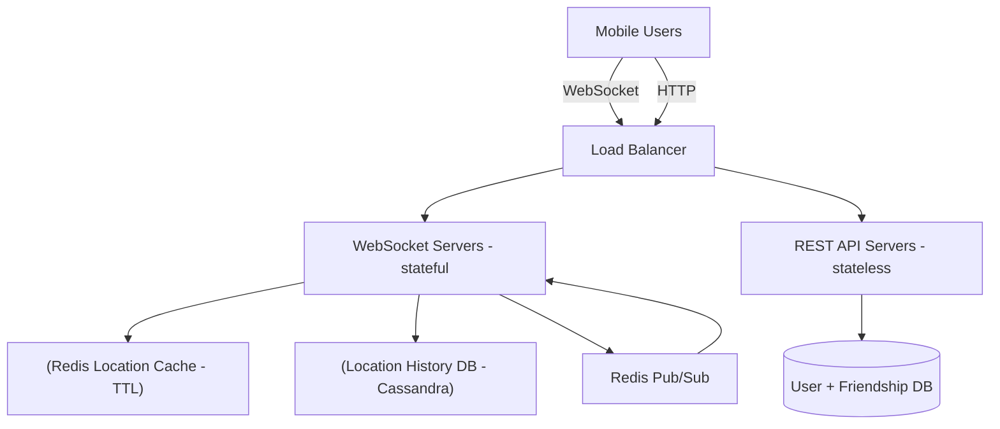
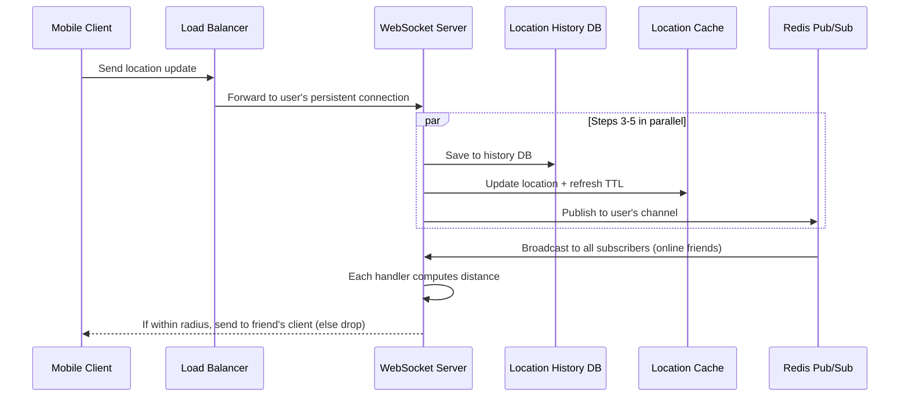
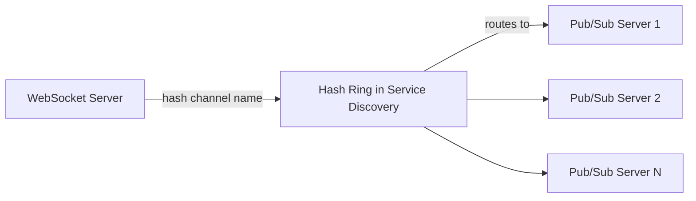

# Design Nearby Friends · Vol 2 Ch 2

> A backend that shows a mobile user which of their friends are geographically nearby (within 5 miles), updating every few seconds using WebSockets and Redis Pub/Sub.

## 1. The Problem in Plain English

"Nearby Friends" is a Facebook-style feature: if you opt in and share your location, the app shows a list of friends who are physically close to you, each with a distance and a "last updated" timestamp.

At first glance this looks like Chapter 1 (Proximity Service), but there's a **big difference**: business locations are **static** (they don't move), while **user locations change constantly**. This makes the data very dynamic and requires efficient, continuous message passing between users.

## 2. Requirements (Functional & Non-Functional)

**Functional**
- Users see nearby friends; each entry has a distance and a timestamp of when it was last updated.
- The nearby-friends list refreshes every few seconds.

**Clarified assumptions**
- "Nearby" = within a **5-mile** radius (configurable).
- Distance = straight-line distance (ignore rivers/roads).
- 1 billion total users, ~10% use the feature.
- Store location **history** (useful for ML).
- If a friend is inactive for > 10 minutes, they disappear from the list (no last-known-location fallback).
- Ignore privacy laws (GDPR/CCPA) for simplicity here.

**Non-Functional**
- **Low latency** — receive friends' updates without much delay.
- **Reliability** — overall reliable, but occasional lost data points are OK.
- **Eventual consistency** — location store doesn't need strong consistency; a few seconds' replica delay is fine.

## 3. Back-of-the-Envelope Estimation

- Location refresh interval: **30 seconds** (humans walk slowly, ~3–4 mph).
- 100 million DAU; concurrent users ≈ 10% of DAU = **10 million**.
- Average **400 friends** per user; assume ~10% of them are online and nearby.
- **Location update QPS = 10 million / 30 ≈ 334,000 QPS.**
- Forwarding load: 334K × 400 × 10% = **~14 million location updates forwarded per second.** (This is the real scaling challenge.)

## 4. High-Level Design

A pure peer-to-peer design (each user holds a connection to every nearby friend) is impractical for flaky mobile connections and battery limits. Instead, use a **shared backend** that: receives all location updates, and for each update finds active friends within range and forwards it to their devices.

**Components:**
- **Load balancer** — sits in front of stateless REST API servers and stateful WebSocket servers.
- **RESTful API servers** — handle normal request/response tasks (add/remove friends, profiles, auth). Stateless.
- **WebSocket servers** — stateful; each client keeps ONE persistent WebSocket connection. Deliver friends' location updates in near real-time and handle client initialization.
- **Redis location cache** — stores each active user's most recent location with a **TTL**. When TTL expires, the user is treated as inactive and purged. Every update refreshes the TTL.
- **User database** — user profiles + friendships (relational or NoSQL).
- **Location history database** — historical locations (write-heavy; **Cassandra** is a good fit, shard by user ID).
- **Redis Pub/Sub server** — a lightweight message bus. Channels are cheap; millions can fit in memory.

### How Redis Pub/Sub is used

Each user has their **own channel**. A location update from a user is published to that user's channel. Each of the user's active friends has a WebSocket connection handler **subscribed** to that channel. When an update is published, every subscriber's handler runs, recomputes the distance, and if within 5 miles, pushes the new location + timestamp to that friend's device (otherwise drops it).

### Periodic location update flow

Because a user has ~400 friends and ~10% are online+nearby, each location update fans out to ~40 forwards.

### APIs

Over **WebSocket**: (1) periodic location update (client sends lat/long/timestamp), (2) client receives friend location updates, (3) WebSocket initialization (client sends initial location, gets friends' locations back), (4) subscribe to a new friend, (5) unsubscribe a friend. Over **HTTP**: friend management, profile updates, auth.

### Data model

- **Location cache (Redis):** `user_id → {latitude, longitude, timestamp}`. Only the current location is needed, so one entry per user. Redis chosen for super-fast read/write and TTL auto-purge. Data need not be durable — if Redis dies, replace with an empty instance and let updates refill it (users miss an update cycle or two — acceptable).
- **Location history DB:** columns `user_id, latitude, longitude, timestamp`. Write-heavy → Cassandra (or sharded relational DB by user ID).

## 5. Deep Dive

### Scaling each component

- **API servers:** stateless → easy autoscale on CPU/load/IO.
- **WebSocket servers:** stateful. To remove a node, mark it **"draining"** at the load balancer (no new connections), let existing connections close, then remove. New software releases need the same care.
- **Client initialization:** on connect, the server (in the WS handler) updates the location cache, stores it in a handler variable, loads all friends from the user DB, batch-fetches friends' locations from the cache (inactive friends won't be there due to TTL), computes distances, returns nearby friends, and **subscribes to every friend's channel** (active or not — cheap), then publishes the user's own location.
- **User database:** shard by user ID; at scale, a dedicated team exposes it via internal API.
- **Location cache:** 10M active users × ~100 bytes fits one Redis server memory-wise, but 334K updates/sec is too high for one — **shard by user ID**, and replicate each shard to a standby for availability.

### How many Redis Pub/Sub servers?

- **Memory:** 100 million channels (1B × 10%), ~100 active friends each, ~20 bytes per subscriber → 100M × 20 × 100 / 10^9 ≈ **200 GB** → ~2 servers (100 GB each).
- **CPU:** ~14 million pushes/sec; assume a modern server handles ~100,000 pushes/sec conservatively → **14M / 100,000 = ~140 servers**.
- **Conclusion:** the **bottleneck is CPU, not memory**; need a **distributed Redis Pub/Sub cluster**.

### Distributed Pub/Sub cluster

Channels are independent, so shard them across servers using **consistent hashing (a hash ring)** keyed by the publisher's user ID. Introduce a **service discovery** component (etcd or ZooKeeper) — really just a small key-value store holding the hash ring (`key: /config/pub_sub_ring`, `value: ["p_1","p_2","p_3","p_4"]`). WebSocket servers cache a local copy of the ring and subscribe to updates.

To publish: the WebSocket server consults the ring to find the right Pub/Sub server for the user's channel, then publishes there. Subscribing works the same way.

### Scaling the Pub/Sub cluster (treat as stateful)

Messages aren't persisted (dropped if no subscribers) — that part is stateless. BUT the **subscriber list per channel IS state**. If a channel moves (server added/removed/replaced), every subscriber must unsubscribe from the old server and resubscribe to the new one. So treat the cluster like a **stateful storage cluster**: over-provision for peak, resize carefully during low-traffic hours.

- **Resizing:** pick new ring size, provision servers, update the ring keys; expect a CPU spike from mass resubscriptions and some missed updates.
- **Replacing a dead server** is much cheaper — only that server's channels move. On-call updates the ring key to swap the dead node for a standby; WebSocket handlers re-subscribe only the affected channels (each handler checks its channels against the ring).

### Adding/removing friends

The feature registers a callback in the mobile app. When a friend is added, the callback tells the WebSocket server to subscribe to that friend's channel (and returns the friend's latest location if active). When removed, it unsubscribes. Same mechanism for opt-in/opt-out of location sharing.

### Users with many friends

Assume a hard cap (Facebook = 5,000 friends); friendships are bi-directional (not a celebrity follower model). Subscribers are scattered across many WebSocket servers, so load spreads out — no hotspot. "Whale" users are distributed across 100+ Pub/Sub servers, so incremental load is fine.

### Nearby random person (extra credit)

Add **geohash-based channels**: divide an area into geohash grids, one channel per grid. When a user updates location, publish to their grid's channel; anyone subscribed nearby receives it. To handle grid borders, each client subscribes to its own geohash **plus the 8 surrounding grids** (9 total).

### Alternative to Redis Pub/Sub: Erlang

**Erlang** (with Elixir, the BEAM VM, and OTP libraries) is arguably better. Erlang processes are extremely lightweight (~300 bytes, millions per server, zero CPU when idle) — model each of the 10M users as an Erlang process that receives updates and subscribes to friends' processes. Downside: Erlang expertise is rare and hard to hire.

## 6. Scaling, Bottlenecks & Trade-offs

- **Pub/Sub CPU is the bottleneck** → ~140 distributed servers.
- **Simplicity vs memory trade-off:** subscribing to all friends (online or not) at init wastes some memory but avoids complex subscribe/unsubscribe-on-activity logic. Worth it.
- **Stateful Pub/Sub** → over-provision, resize only at low traffic.
- **Durability trade-off:** location cache is not durable — acceptable to lose a cycle or two on failure.

## 7. Failure / Edge Cases

- **Redis location cache dies** → replace with empty instance; users miss an update cycle or two.
- **Pub/Sub server dies** → swap in a standby via the hash ring; only affected channels resubscribe.
- **Cluster resize** → mass resubscriptions cause CPU spikes and some missed updates → do at lowest-traffic time.
- **Inactive friend** (>10 min) → TTL expires, drops off the list automatically.
- **Draining WebSocket nodes** → let connections finish before removal.

## 8. Key Takeaways

- Dynamic user locations make this fundamentally different from static business proximity.
- **WebSocket** for persistent bi-directional client links; **Redis Pub/Sub** as a cheap routing layer between friends.
- The real challenge is **fan-out** (~14M forwards/sec), solved by a **distributed, consistent-hashed Pub/Sub cluster** whose bottleneck is CPU.
- Treat Pub/Sub as **stateful** because of subscriber lists.
- Use **TTL** to auto-detect inactivity; store history separately in Cassandra.

## 9. New Terms & Glossary

- **WebSocket:** a persistent, bi-directional connection between client and server.
- **Redis Pub/Sub:** lightweight publish/subscribe message bus with cheap channels.
- **Channel / Topic:** a named stream subscribers listen to; here, one per user.
- **TTL (Time To Live):** expiry time on a cache entry; used to detect inactivity.
- **Consistent hashing / hash ring:** technique to spread channels across servers with minimal movement on resize.
- **Service discovery (etcd / ZooKeeper):** stores the hash ring and notifies servers of changes.
- **Draining:** letting existing connections close before removing a stateful node.
- **Eventual consistency:** replicas converge after a short delay; strong consistency not required.
- **Erlang / BEAM / OTP:** a concurrency-focused language/runtime with ultra-cheap processes.
- **Fan-out:** forwarding one update to many recipients.
