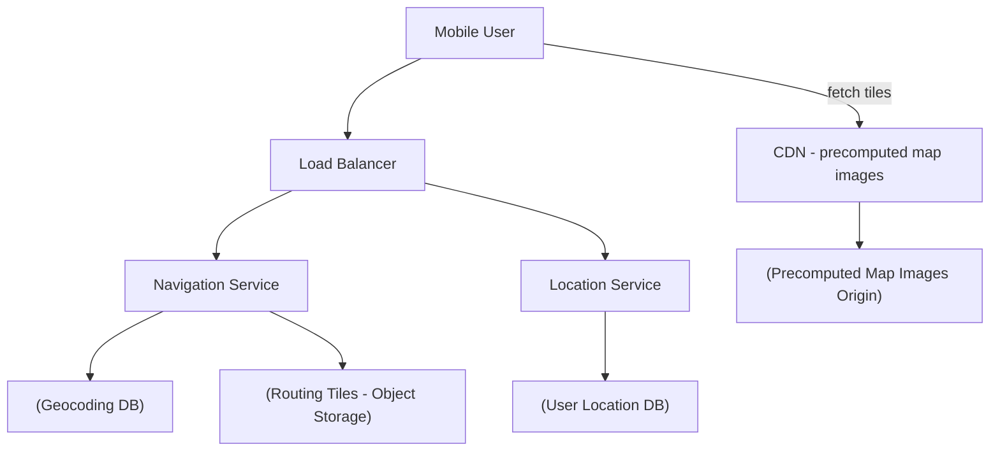
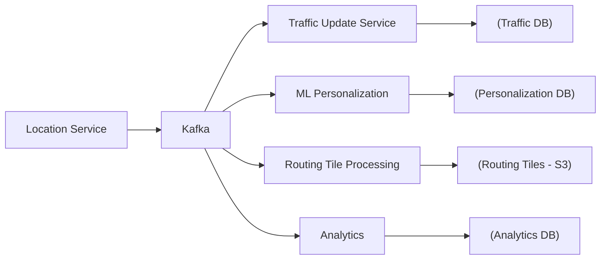

# Design Google Maps · Vol 2 Ch 3

> A simplified Google Maps supporting location updates, navigation with ETA, and map rendering — built on map tiles, routing tiles (road graphs), geocoding, and adaptive rerouting.

## 1. The Problem in Plain English

Google Maps helps you see a map, get directions from A to B, know your estimated time of arrival (ETA), and reroute when traffic changes. As of March 2021 it had 1 billion daily active users, covered 99% of the world, and got 25 million location updates daily.

We design three core features: **location update**, **navigation (with ETA)**, and **map rendering**, focused on mobile phones.

## 2. Requirements (Functional & Non-Functional)

**Functional (focus areas)**
- User location update.
- Navigation service, including ETA.
- Map rendering.
- Support different travel modes (driving, walking, bus). Multi-stop is nice-to-have, not focused.
- Consider traffic conditions for accurate time estimates.

**Non-Functional**
- **Accuracy** — never give wrong directions.
- **Smooth navigation** — very smooth map rendering on the client.
- **Low data and battery usage** — critical for mobile.
- General availability and scalability.

Road data (terabytes) is assumed already available from external sources.

## 3. Back-of-the-Envelope Estimation

**Storage — map of the world:**
- 21 zoom levels. Zoom level 21 has ~4.4 trillion tiles; each tile is a 256×256 compressed PNG ~100 KB → ~440 PB at the highest level alone.
- ~90% of Earth (oceans/deserts) is highly compressible → reduce by 80–90% → ~50 PB for the top level.
- Each lower zoom level has 4× fewer tiles (¼ the storage). Summing the series (50 + 12.5 + …) ≈ 67 PB. Round to **~100 PB total** for all map tiles.
- **Road info:** terabytes of raw data → transformed into terabyte-scale **routing tiles**.

**Server throughput:**
- 1 billion DAU, ~35 min navigation/user/week → 5 billion navigation-minutes/day.
- Sending GPS every second = 300 billion requests/day = 3 million QPS. Too much.
- **Batch GPS updates every 15 seconds** → QPS drops to **200,000**.
- Peak = 5× average = **1 million QPS** for location updates.

## 4. High-Level Design

Three services behind a load balancer: **Location Service**, **Navigation Service**, **Map Rendering** (via CDN).

### Map 101 (background concepts)

- **Positioning system:** latitude (north/south), longitude (east/west). Turning the 3D globe into a 2D plane is **map projection**; Google uses **Web Mercator** (a modified Mercator).
- **Geocoding:** converting an address to lat/long (e.g., "1600 Amphitheatre Parkway" → 37.423021, -122.083739). **Reverse geocoding** is the opposite. One method is **interpolation** using GIS data.
- **Geohashing:** encodes a geographic area into a short string by recursively subdividing grids (numbered 0–3). Used here for **map tiling**.
- **Map tiling:** instead of one giant image, the world is split into small **tiles**. The client downloads only the tiles it needs for its area/zoom and stitches them like a mosaic. Different tile sets exist per zoom level; zoomed all the way out = one 256×256 tile for the whole world.

### Routing tiles (road data for navigation)

Routing algorithms are variations of **Dijkstra's** or **A\*** pathfinding, which operate on a **graph** where intersections are nodes and roads are edges. The whole world's road graph is too big for memory, so the world is divided into grids called **routing tiles**. Each routing tile is a small road graph (nodes + edges) plus references to the tiles it connects to. Tiles load on demand, keeping memory low.

- Map tiles = PNG images; **routing tiles = binary files of road data**.
- **Hierarchical routing tiles:** three detail levels — small tiles (local roads), bigger tiles (arterial roads between districts), largest tiles (highways between cities/states). Edges connect levels (e.g., a local street connects to a freeway node in a bigger tile), so cross-country routing uses coarse tiles instead of millions of street-level tiles.

### Location service

Clients send location updates every *t* seconds. To save bandwidth/battery, updates are **buffered on the client and sent in batches every 15 seconds** (frequency can slow down if stuck in traffic). This data improves the map (new/closed roads), powers live traffic, and improves ETAs.

- Write volume is huge → use a high-write, horizontally scalable DB: **Cassandra**.
- Also log location data into **Kafka** for downstream processing.
- Protocol: HTTP with **keep-alive**. `POST /v1/locations` with a JSON array of (lat, long, timestamp) tuples.

### Navigation service

`GET /v1/nav?origin=...&destination=...`. Returns distance, duration, start/end location, polyline, geocoded waypoints, travel mode. A little latency is tolerable but accuracy is critical. Reroute and traffic changes are handled by the **Adaptive ETA service** in the deep dive.

### Map rendering

Since map tiles total ~100 PB, they can't live on the client. Two options:
- **Option 1 (rejected):** build tiles on the fly per location/zoom — huge server load, no caching benefit.
- **Option 2 (chosen):** serve **pre-generated static tiles** at each zoom level, each identified by its **geohash**, served from a **CDN**. On a cache miss the CDN fetches from origin, caches it, and returns it; later requests (even from other users) are served from the nearest **Point of Presence (POP)** — fast and highly cacheable.

**Data usage math:** at 30 km/h, at a zoom where each 256×256 image covers 200 m × 200 m (~100 KB), a 1 km × 1 km area = 25 images = 2.5 MB → ~75 MB/hour or ~1.25 MB/minute. CDN traffic: 5 billion minutes/day × 1.25 MB ≈ 6.25 billion MB/day ≈ 62,500 MB/sec; with ~200 POPs, each POP serves a few hundred MB/sec.

**How does the client know which tile URLs to fetch?** Convert (lat/long + zoom) → geohash → tile URL, e.g. `https://cdn.map-provider.com/tiles/9q9hvu.png`. This can be computed **on the client** (fast, but the algorithm is hardcoded across all platforms — risky to change) OR via a small **Map Tile Service** intermediary (more operational flexibility). The service returns **9 URLs** (current tile + 8 surrounding).

## 5. Deep Dive

### Data model (four data types)

- **Routing tiles:** produced by a periodic offline **routing tile processing service** that transforms raw road data into graph tiles (adjacency lists). Stored in **object storage (S3)**, organized by geohash, cached aggressively on the routing service. No DB features needed.
- **User location data:** write-heavy → **Cassandra**. Prioritize **availability + partition tolerance** (CAP) since locations go stale instantly. Key = (`user_id`, `timestamp`) where `user_id` is the partition key and `timestamp` is the clustering key — fast lookup of a user's latest position and time-range queries.
- **Geocoding database:** places → lat/long; frequent reads, infrequent writes → **Redis** (key-value).
- **Precomputed map images:** heavy to compute repeatedly, so precompute at each zoom level and cache in a **CDN backed by S3**.

### How location data is used

Beyond writing to the location DB, updates go into **Kafka**. Consumers include the **traffic update service** (updates live traffic DB), the **routing tile processing service** (detects new/closed roads, updates tiles), a **machine learning personalization service**, and **analytics**.

### Rendering optimization

- 21 zoom levels; level 0 = one 256×256 tile. Each zoom increment doubles tiles in both directions (4× the pixels), giving more detail without wasting bandwidth.
- **Vector tiles (WebGL):** send vector paths/polygons instead of raster images. Compresses far better (big bandwidth savings) and gives smoother zooming than rasterized images.

### Navigation deep dive

- **Shortest-path service:** takes origin + destination lat/long, converts to geohashes to load routing tiles, runs a variation of **A\*** against tiles in object storage. Starts at the origin tile, traverses the graph, hydrates neighboring tiles (or coarser-level tiles for highways) on demand until top-k routes are found. Ignores traffic (depends only on road structure), so routes are cacheable.
- **ETA service:** for each candidate route, uses **machine learning** on current + historical traffic to predict time — including predicting traffic 10–20 minutes ahead.
- **Ranker service:** applies user filters (avoid tolls, avoid freeways) and ranks routes fastest → slowest, returning top-k.
- **Updater services:** consume the Kafka stream to keep the traffic DB and routing tiles current.

### Adaptive ETA and rerouting

The server must track all actively navigating users and update ETAs when traffic changes.

- **Naive approach:** store each user's full list of routing tiles (`user_1: r_1, r_2, ... r_k`). When traffic hits tile `r_2`, scan every row to find affected users — **O(n × m)** (n users, m tiles/route). Too slow.
- **Better approach:** for each user, store the current tile plus its containing tiles at each **higher resolution level**, recursively up to the level that contains the destination (`user_1, r_1, super(r_1), super(super(r_1)), ...`). To check if a user is affected, just test whether the incident tile is inside that user's last (largest) tile — quickly filtering out most users.
- **When traffic clears:** keep all possible routes, recalculate ETAs regularly, notify the user if a shorter route appears.

### Delivery protocols (server → client push)

Options: mobile push notification, long polling, WebSocket, Server-Sent Events (SSE).
- Push notification — rejected (payload limited to 4,096 bytes on iOS, no web support).
- Long polling — rejected.
- **WebSocket chosen** over SSE because it's bi-directional and light on servers (useful for last-mile real-time communication).

## 6. Scaling, Bottlenecks & Trade-offs

- **Batch location updates** (every 15 s) cut QPS from 3M to 200K (peak 1M).
- **CDN + precomputed static tiles** offload ~100 PB of images to edge POPs.
- **Client-side geohash calculation vs Map Tile Service:** hardcoded client math is fast but risky to change; a service adds a hop but is flexible.
- **Vector vs raster tiles:** vectors save bandwidth and zoom better.
- **Hierarchical routing tiles** trade some precision for far less memory on long routes.
- **CAP choice:** availability + partition tolerance over consistency for location data.

## 7. Failure / Edge Cases

- **CDN cache miss** → fetch from origin, cache, then serve.
- **Traffic incident on a route** → efficiently find affected users via hierarchical tile containment.
- **Traffic clears** → recompute ETAs and notify users of faster routes.
- **Stuck in traffic** → client slows GPS update frequency to save battery/data.
- **New/closed roads** → detected from the Kafka location stream and folded into routing tiles.

## 8. Key Takeaways

- **Tiling** is the unifying idea: map tiles (images) for rendering, routing tiles (road graphs) for navigation.
- **Geohash** encodes both map tiles and routing tiles, giving fast lat/long → tile lookups.
- Navigation = **A\*/Dijkstra on hierarchical routing tiles** stored in object storage.
- **Batching + CDN** are the main levers for mobile data/battery and for serving petabytes of tiles.
- **Kafka** streams location data to many downstream consumers (traffic, ML, analytics, tile updates).
- Rerouting scales by storing routes as **nested higher-resolution tiles**.

## 9. New Terms & Glossary

- **Map tile:** a 256×256 PNG covering a fixed area at a zoom level.
- **Routing tile:** a binary road-graph grid (nodes = intersections, edges = roads) with references to neighboring tiles.
- **Map projection / Web Mercator:** turning the 3D globe into a 2D map.
- **Geocoding / reverse geocoding:** address ↔ lat/long conversion.
- **Geohashing:** encoding an area into a short string via recursive subdivision.
- **A\* / Dijkstra:** graph pathfinding algorithms for routing.
- **Adjacency list:** in-memory representation of a graph.
- **CDN / POP (Point of Presence):** edge network that caches and serves tiles near users.
- **ETA:** estimated time of arrival.
- **CAP theorem:** you can pick two of consistency, availability, partition tolerance.
- **Vector tiles / WebGL:** sending paths/polygons instead of images for better compression and zoom.
- **WebSocket / SSE / long polling:** server-to-client push options.
