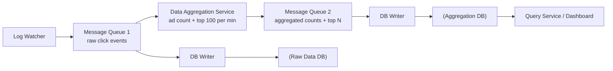
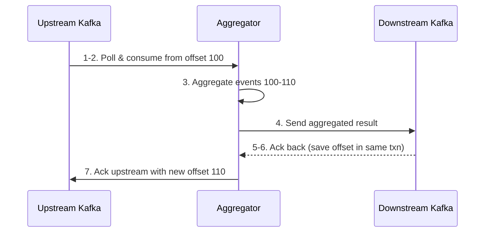

# Design an Ad Click Event Aggregation System · Vol 2 Ch 6

> Count huge streams of ad clicks in near real-time using Kafka + Flink-style stream processing, with exactly-once accuracy for billing.

## 1. The Problem in Plain English

When you see an ad on Facebook, YouTube, or TikTok and click it, that click is an "event." Advertisers pay based on clicks, so counting clicks correctly is very important (real money depends on it). We must build a system that takes in **1 billion clicks per day** and answers questions like "how many times was this ad clicked in the last few minutes?" and "what are the top 100 most clicked ads right now?"

Online ads use **Real-Time Bidding (RTB)**, where ad space is bought and sold in under a second. Two key metrics depend on click data: **click-through rate (CTR)** and **conversion rate (CVR)**. Note: RTB itself needs sub-second speed, but click *aggregation* only needs a few minutes of latency because it is used for billing and reports, not live bidding.

## 2. Requirements (Functional & Non-Functional)

**Input data:** a log file on many servers. Each ad click event has: `ad_id`, `click_timestamp`, `user_id`, `ip`, `country`. Events are appended to the end of the log file.

**Functional:**
- Aggregate the number of clicks of an `ad_id` in the last M minutes.
- Return the top 100 (top N) most clicked `ad_id` every minute (aggregation runs every minute).
- Support filtering by `ip`, `user_id`, or `country` on both queries.
- Handle Facebook/Google scale.

**Non-functional:**
- **Correctness** — data feeds RTB and billing, so it must be right.
- Handle **delayed** and **duplicate** events properly.
- **Robustness** — survive partial failures.
- **Latency** — end-to-end at most a few minutes.

## 3. Back-of-the-Envelope Estimation

- 1 billion DAU; each user clicks ~1 ad/day → **1 billion click events/day**.
- Average click **QPS = 10,000** (10^9 events / 10^5 seconds).
- Peak QPS = 5× average = **50,000 QPS**.
- One event ≈ 0.1 KB → daily storage 0.1 KB × 1 billion = **100 GB/day**, ~**3 TB/month**.
- 2 million ads in total; business grows ~30% year-over-year (traffic doubles every ~3 years).

## 4. High-Level Design

There are two kinds of data:
- **Raw data** — the individual click rows, scattered across app servers. Stored for backup and possible recalculation. Write-heavy (10K avg / 50K peak QPS), read-light.
- **Aggregated data** — per-minute counts, e.g. `(ad_id, click_minute, count)`. Time-series; both read-heavy (dashboards query every minute for 2M ads) and write-heavy. Filters use a `filter_id` grouped by `(ad_id, click_minute)` — this is the **star schema** technique, where filter fields are called **dimensions**.

**Database choice:** relational DBs struggle to scale writes, so use NoSQL optimized for writes and time-range queries — the book uses **Cassandra** (alternatives: InfluxDB, or S3 with columnar formats ORC/Parquet/AVRO). Same DB type stores both raw and aggregated data.

**Two APIs** (filtering is just extra query params):
- `GET /v1/ads/{ad_id}/aggregated_count` — params `from`, `to`, `filter`.
- `GET /v1/ads/popular_ads` — params `count` (top N), `window` (M minutes), `filter`.

The system is asynchronous. A synchronous pipeline is bad: if producers suddenly outpace consumers, consumers get out-of-memory errors, and one dead component stops everything. So we insert **message queues (Kafka)** to decouple producers and consumers.

- **Queue 1** holds `ad_id, click_timestamp, user_id, ip, country`.
- **Queue 2** holds two things: per-minute click counts `(ad_id, click_minute, count)`, and per-minute top-N ads `(update_time_minute, most_clicked_ads)`.
- **Why a second queue instead of writing straight to the DB?** To achieve **end-to-end exactly-once semantics (atomic commit)** between the aggregation step and the database.

**Aggregation service uses MapReduce (a DAG — Directed Acyclic Graph):**
- **Map node** — reads, cleans/normalizes, and routes events (e.g. `ad_id % 2`). Needed because we may not control how producers partition data, so same-`ad_id` events could land in different Kafka partitions.
- **Aggregate node** — counts clicks by `ad_id` in memory every minute; keeps a **heap** for top-N inside each node. (In MapReduce terms this is part of Reduce, so it's really map-reduce-reduce.)
- **Reduce node** — merges partial results from all Aggregate nodes into the final top-N.

## 5. Deep Dive

### Streaming vs batching (Lambda vs Kappa)
The design is a **stream processing** system (near real-time, unbounded input, example engine: **Flink**), contrasted with **batch** (bounded input, example: MapReduce) and online services.

- **Lambda architecture** = two paths, batch + streaming, running side by side. Downside: two codebases to maintain.
- **Kappa architecture** = one stream engine handles both real-time processing and reprocessing of historical data. The book chooses **Kappa**.

**Data recalculation (historical replay):** if a bug is found, a **recalculation service** reads raw data (a batch job), sends it to a *dedicated* aggregation service (so live traffic isn't disturbed), and the results flow through queue 2 into the aggregation DB.

### Time
- **Event time** = when the click happened. **Processing time** = when the server processed it. Because of network delay and queues, the gap can be huge (an event may arrive 5 hours late).
- Event time is more accurate but depends on the (possibly wrong or malicious) client clock; processing time is reliable but inaccurate for late events. The book **uses event time** because accuracy matters.

**Watermark** handles slightly-late events by extending the aggregation window by an extra (adjustable) ~15 seconds so late events still fall into the right window. Long watermark = more accurate but higher latency; short = faster but less accurate. Watermarks do **not** catch very-late events — those tiny errors are fixed by **end-of-day reconciliation**.

### Aggregation window
Four window types exist (per Kleppmann's *Designing Data-Intensive Applications*): tumbling, hopping, sliding, session. The book uses:
- **Tumbling (fixed) window** — non-overlapping equal chunks. Good for "count clicks every minute" (use case 1).
- **Sliding window** — overlapping window that slides. Good for "top N ads in the last M minutes" (use case 2).

### Delivery guarantees
Kafka offers **at-most-once**, **at-least-once**, **exactly-once**. At-least-once is usually fine, but here a few % error = millions of dollars, so the book recommends **exactly-once**.

**Deduplication:** duplicates come from client resends (handled by fraud/risk control) and server outages. Example: an Aggregator stores its Kafka **offset** upstream. If it sends results downstream but crashes before committing the new offset (step 6), a new Aggregator re-reads from the old offset and double-counts.
- Naive fix: save offset in external storage (HDFS/S3). But saving offset *before* sending downstream can cause **data loss**; saving *after* can cause **duplicates**.
- True fix: put "send result → save offset → ack" into one **distributed transaction** (roll back all if any step fails). Achieving exactly-once at scale is genuinely hard.

### Scaling
Three independent, separately-scalable parts: message queue, aggregation service, database.
- **Message queue:** producers scale freely; consumers scale via consumer-group **rebalancing** (but rebalancing hundreds of consumers is slow — do it off-peak). Use `ad_id` as the **hashing key** so same-ad events go to one partition. **Pre-allocate enough partitions** (changing count later remaps events). Shard topics by geography or business type for throughput.
- **Aggregation service:** horizontally scalable. Increase throughput by (1) multi-threading per `ad_id`, or (2) deploying on a resource provider like **Apache Hadoop YARN** (multi-processing — more widely used).
- **Database:** **Cassandra** scales horizontally via consistent-hashing-style **virtual nodes**; adding a node auto-rebalances, no manual resharding.

## 6. Scaling, Bottlenecks & Trade-offs

- **Hotspot:** big advertisers get far more clicks, overloading the node handling their `ad_id`. Fix: the overloaded node asks a **resource manager** for extra nodes, splits events into groups (e.g. 300 events → 3 nodes of 100), and writes results back. Advanced options: **Global-Local Aggregation** or **Split Distinct Aggregation**.
- **Exactly-once vs latency:** stronger guarantees and longer watermarks both add latency.
- **Lambda vs Kappa:** two codebases vs one; the book prefers Kappa for simplicity.
- **Star schema filtering:** pre-computed and fast, but creates many extra buckets/records when filters multiply.
- **Alternative design:** store clicks in **Hive** with an **ElasticSearch** layer for fast queries; aggregate in OLAP databases like **ClickHouse** or **Druid**.

## 7. Failure / Edge Cases

- **Late/delayed events:** watermark plus end-of-day reconciliation.
- **Duplicate events:** exactly-once via offsets in a distributed transaction.
- **Aggregation node crash (in-memory loss):** rebuild counts by replaying Kafka. Replaying from the beginning is slow, so periodically save a **snapshot** of "system status" (upstream offset *and* the top-N heap state). On failover, spin up a new node, restore from the latest snapshot, then replay only newer events from Kafka.
- **Monitoring:** track **latency** (timestamps at each stage), **message queue size** (Kafka records-lag metric), and node resources (CPU, disk, JVM).
- **Reconciliation:** no third party exists (unlike banking), so run an end-of-day **batch job** that sorts click events by event time per partition and compares against the real-time result. Batch and real-time results may still differ slightly due to late events.

## 8. Key Takeaways

- Use **Kafka message queues** to decouple producers/consumers and enable exactly-once.
- Aggregate with a **MapReduce/DAG** (Map → Aggregate → Reduce), keeping counts in memory with a heap for top-N.
- Choose **event time + watermark** for accuracy; fix leftover drift with reconciliation.
- Use **tumbling windows** for per-minute counts, **sliding windows** for top-N-over-M-minutes.
- Prefer **exactly-once** delivery when money is at stake; achieving it needs distributed transactions.
- **Kappa architecture** unifies real-time and historical reprocessing in one engine.
- Scale queue, aggregation, and DB independently; handle hotspots by adding nodes.
- Recover in-memory aggregators from **snapshots + Kafka replay**.
- This is a classic big-data pipeline — knowing **Kafka, Flink, Spark** helps a lot.

## 9. New Terms & Glossary

- **RTB (Real-Time Bidding):** sub-second buying/selling of ad inventory.
- **CTR / CVR:** click-through rate / conversion rate — key ad metrics.
- **QPS / TPS:** queries / transactions per second.
- **DAG:** Directed Acyclic Graph — model for breaking a job into small compute nodes.
- **MapReduce:** parallel distributed compute paradigm (Map, Aggregate/Reduce).
- **Tumbling window:** fixed, non-overlapping time chunks.
- **Sliding window:** overlapping window that slides across the stream.
- **Watermark:** small time extension of a window to catch slightly-late events.
- **Event time vs processing time:** when the click happened vs when it was processed.
- **Exactly-once / at-least-once / at-most-once:** message delivery guarantees.
- **Offset:** Kafka's marker of how far a consumer has read.
- **Lambda vs Kappa architecture:** dual batch+stream paths vs single unified stream path.
- **Star schema / dimensions:** data-warehouse layout where filter fields are dimensions.
- **Hotspot:** a shard/node getting disproportionately more traffic.
- **Reconciliation:** comparing data sets (batch vs real-time) to verify integrity.
- **Consistent hashing / virtual nodes:** Cassandra's method for even, rebalanceable data distribution.
