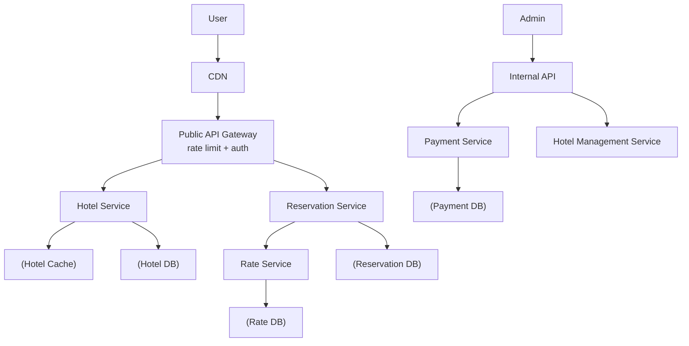
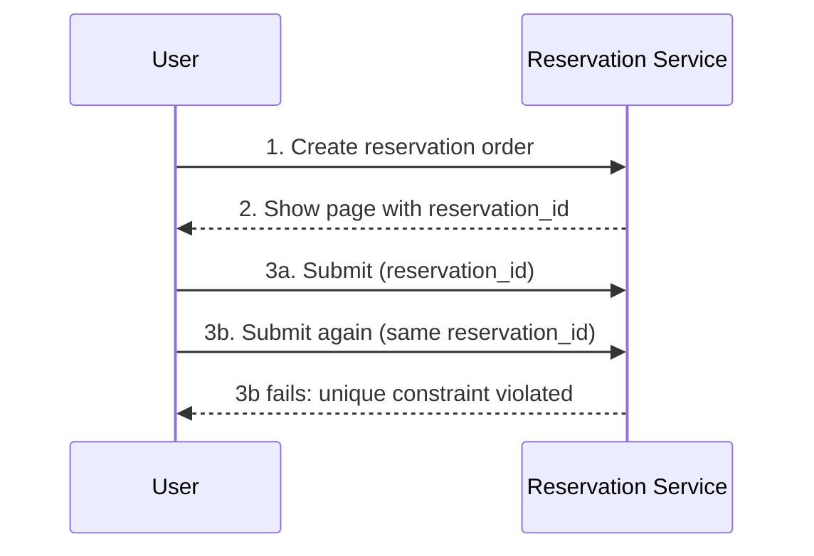
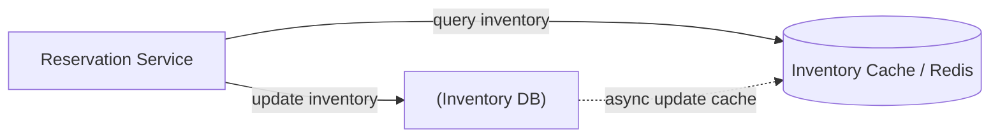

# Design a Hotel Reservation System · Vol 2 Ch 7

> Book a *type* of room (not a specific room) using a relational DB, prevent double-booking with idempotency keys and locking, and support 10% overbooking.

## 1. The Problem in Plain English

Design a hotel booking website for a chain like **Marriott International** with **5,000 hotels and 1 million rooms**. Customers browse hotels, view room details, and reserve a room (paying in full at booking time). They can cancel. Hotel staff (admins) can add/update/remove hotel and room info. The same design applies to **Airbnb, flight booking, and movie ticket** systems.

Two tricky twists: **hotel prices change every day** (based on how full the hotel is expected to be), and the system allows **10% overbooking** (selling more rooms than exist, betting some people cancel).

## 2. Requirements (Functional & Non-Functional)

**Functional:**
- Show hotel page and room-detail page.
- Reserve a room.
- Admin panel to add/remove/update hotels and rooms.
- Support the **overbooking** feature.
- (Room *search* is out of scope; dynamic daily pricing is in scope.)

**Non-functional:**
- **High concurrency** — during peak season / big events, many people fight for the same room.
- **Moderate latency** — a few seconds to process a reservation is acceptable.

## 3. Back-of-the-Envelope Estimation

- 5,000 hotels, 1 million rooms total.
- 70% occupancy, average stay 3 days → daily reservations = (1M × 0.7) / 3 ≈ **240,000**.
- Reservation **TPS ≈ 3** (240,000 / 10^5 s) — very low.
- Working backward through the funnel (assume ~10% advance to next step): **reserve = 3 QPS**, **order booking page = 30 QPS**, **hotel/room detail page = 300 QPS**.

The load is low, but must survive traffic surges during big events.

## 4. High-Level Design

**Database choice: relational database**, because:
- Workload is **read-heavy, write-light** (far more browsers than bookers); relational DBs handle this fine.
- **ACID** guarantees (atomicity, consistency, isolation, durability) prevent negative balances, double charges, and double reservations.
- The data (hotel, room, room_type, reservation) is clean and stable — easy to model relationally.

**APIs (RESTful):**
- Hotel: `GET/POST/PUT/DELETE /v1/hotels/{id}` (writes are staff-only).
- Room: `GET/POST/PUT/DELETE /v1/hotels/{id}/rooms/{id}` (writes staff-only).
- Reservation: `GET /v1/reservations`, `GET /v1/reservations/{id}`, `POST /v1/reservations`, `DELETE /v1/reservations/{id}`.

A new reservation POST includes `startDate`, `endDate`, `hotelID`, `roomTypeID`, and a `reservationID` used as the **idempotency key** to prevent double booking.

**Microservice architecture** (like Amazon, Netflix, Uber, Airbnb):

- **CDN** caches static assets. **Public API Gateway** does rate limiting, auth, routing. **Internal APIs** (staff-only, protected by VPN).
- **Hotel Service** (static, cacheable hotel/room info), **Rate Service** (daily room prices), **Reservation Service** (reserves rooms, tracks inventory), **Payment Service** (charges customer; sets status `paid` or `rejected`), **Hotel Management Service** (staff operations).
- Reservation Service queries Rate Service to compute total charge. Production inter-service calls often use **gRPC**.

**First-draft data model** has tables: `hotel`, `room`, `room_type_rate`, `guest`, `reservation`. The `reservation.status` follows a state machine: **pending → paid → refunded**, or → **canceled** / **rejected**.

**Problem with the first draft:** it uses `room_id`, which works for Airbnb (you book a specific listing) but not hotels — guests reserve a **room type** (standard, king, queen), and the actual room number is assigned at check-in.

## 5. Deep Dive

### Improved data model
Replace `roomID` with `roomTypeID` in the API. Add a key table **`room_type_inventory`** with composite primary key `(hotel_id, room_type_id, date)` — **one row per date**:
- `total_inventory` — total rooms minus rooms taken off market (e.g. maintenance).
- `total_reserved` — rooms booked for that hotel/room_type/date.

Rows are **pre-populated 2 years ahead**; a daily scheduled job adds more as dates advance. Storage: 5,000 hotels × 20 room types × 2 years × 365 days = **73 million rows** — small; a single DB suffices (replicate across regions/AZs for availability).

**Checking availability** for a date range: `SELECT` rows in range, then for each date check
`if (total_reserved + roomsToReserve) <= total_inventory`. To support **10% overbooking**, change the limit to `<= 110% * total_inventory`.

If reservation data grows too large: store only current/future reservations (archive history to cold storage), and **shard** by `hotel_id` since most queries filter by hotel — `hash(hotel_id) % number_of_servers`.

### Concurrency issue #1: same user double-clicks
Two identical `INSERT`s create two reservations. Fixes:
- **Client-side** (gray out / disable the submit button) — unreliable (users can disable JavaScript).
- **Idempotent API** — include an idempotency key. The `reservation_id` is generated by a globally-unique ID generator and returned when the order is created. It's the **primary key** of the reservation table, so a second submit hits a **unique-constraint violation** and fails.

### Concurrency issue #2: many users book the last room
With a non-serializable isolation level, two transactions both read `total_reserved = 99`, both see "1 room left," both reserve → both commit → oversold. Three solutions:

- **Pessimistic locking** — `SELECT ... FOR UPDATE` locks the rows; others wait. *Pros:* easy, avoids conflict, good under heavy contention. *Cons:* deadlocks, and long locks kill scalability. **Not recommended.**
- **Optimistic locking** — add a `version` column; read version, increment on write, validate new version = old + 1, abort and retry on mismatch. *Pros:* no DB locking, good when contention is low. *Cons:* poor under heavy contention (many retries, bad UX). **Good fit here** because reservation QPS is low.
- **Database constraint** — add `CHECK ((total_inventory - total_reserved) >= 0)`; a violating reservation rolls back. *Pros:* easy, works when contention is low. *Cons:* frustrating "no rooms" errors under heavy load, can't be version-controlled like code, not all DBs support constraints. **Also a good option** given low QPS.

### Scalability
Servers are stateless → scale by adding servers. The **database** holds all state and is the bottleneck. If this were Booking.com/Expedia scale (QPS ~1,000× higher):
- **Database sharding** by `hotel_id`. Example: 30,000 QPS across 16 shards ≈ ~1,870 QPS each — within a single MySQL server's capacity.
- **Caching with Redis:** only current/future inventory matters, so use **TTL** and **LRU** eviction. Move check-inventory and reserve-room logic to the cache; most ineligible requests are blocked before hitting the DB. Cache key: `hotelID_roomTypeID_{date}` → available rooms. **Still recheck at the DB** — the database is the source of truth.

**Cache consistency:** the DB is updated first, then the cache is updated asynchronously (via app code, or **Change Data Capture (CDC)** using **Debezium** → Redis). Cache/DB may briefly disagree, but that's fine because the **DB does the final validation** — a user might see a room, try to book, and get an "already booked" error; a refresh shows the corrected state.

## 6. Scaling, Bottlenecks & Trade-offs

- **Locking trade-off:** pessimistic = safe but slow/deadlock-prone; optimistic = fast but retry-heavy under contention; constraints = simple but bad UX under contention. Low QPS makes optimistic locking or DB constraints the pragmatic winners.
- **Cache trade-off:** big speedup and reduced DB load, but cache/DB consistency is hard (mitigated by DB-as-source-of-truth).
- **Data consistency across microservices:** a "pure" microservice design gives each service its own DB, so one logical operation spans multiple DBs and can't use a single transaction. Industry techniques:
  - **Two-phase commit (2PC):** atomic across nodes, but **blocking** and not performant.
  - **Saga:** a sequence of local transactions, each publishing a message to trigger the next; failures run **compensating transactions**. Relies on **eventual consistency**.
  - The book's pragmatic choice: put **reservation and inventory in the same relational DB** (a hybrid, with Reservation Service owning both) so ACID handles concurrency — the added complexity of 2PC/Saga wasn't judged worth it here.

## 7. Failure / Edge Cases

- **Double-click by one user:** blocked by the `reservation_id` unique constraint (idempotency).
- **Race for the last room:** blocked by optimistic locking / DB constraint / pessimistic locking.
- **Single DB is a single point of failure:** replicate across regions/availability zones.
- **Traffic surges during big events:** sharding + Redis cache.
- **Cache out of sync with DB:** DB revalidates every reservation.
- **Cross-service partial failure:** roll back via Saga compensations or keep data co-located.

## 8. Key Takeaways

- Reservations are made at the **room-type + date** level, not per specific room — model with `room_type_inventory` (one row per date, pre-populated 2 years out).
- Use a **relational DB** for its **ACID** guarantees; the workload is read-heavy.
- Prevent user double-submits with an **idempotency key** (`reservation_id` as primary key → unique constraint).
- Prevent the last-room race with **optimistic locking** or a **DB CHECK constraint** (both fine at low QPS); avoid pessimistic locking's deadlocks/scaling issues.
- Implement **10% overbooking** simply by comparing against `110% * total_inventory`.
- Scale with **sharding by `hotel_id`** and a **Redis cache** (TTL + LRU), with the DB as source of truth.
- For microservice data consistency, know **2PC** and **Saga**, but co-locating inventory + reservation data is often the pragmatic call.

## 9. New Terms & Glossary

- **Overbooking:** selling more rooms than exist, expecting cancellations.
- **Idempotency key:** a value making repeated identical requests produce one result (here, `reservation_id`).
- **ACID:** atomicity, consistency, isolation, durability — relational transaction guarantees.
- **room_type_inventory:** table tracking `total_inventory` and `total_reserved` per hotel/room_type/date.
- **Pessimistic locking:** lock rows on read (`SELECT ... FOR UPDATE`); others wait.
- **Optimistic locking:** no lock; use a `version` column and retry on conflict.
- **Database constraint:** a `CHECK` rule enforced by the DB to reject bad writes.
- **Isolation level / serializable:** how strictly concurrent transactions are separated.
- **Sharding:** splitting data across DBs (here by `hotel_id`).
- **TTL / LRU:** time-to-live expiry / least-recently-used cache eviction.
- **CDC (Change Data Capture):** streaming DB changes to another system (e.g. Debezium → Redis).
- **2PC (two-phase commit):** blocking protocol for atomic multi-node commits.
- **Saga:** sequence of local transactions with compensating rollbacks; eventual consistency.
- **gRPC:** high-performance RPC framework for inter-service calls.
