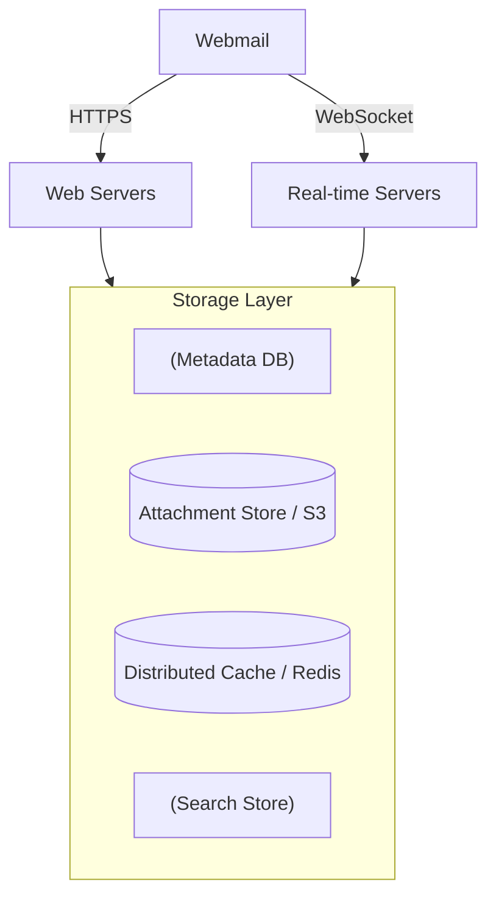
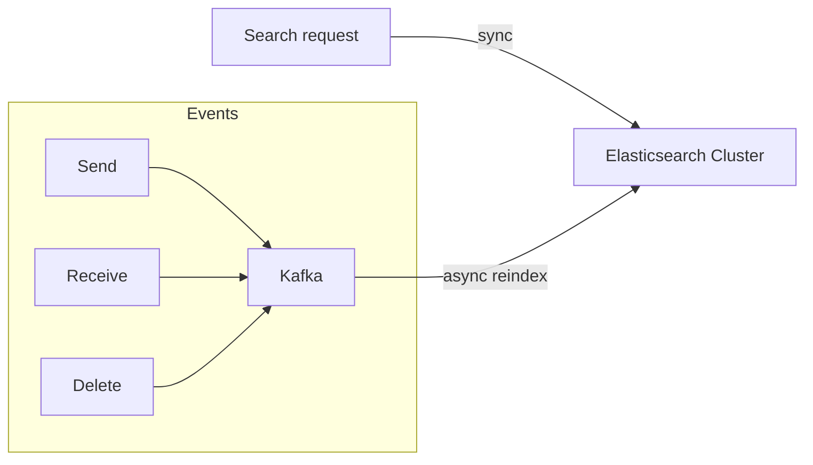

# Design a Distributed Email Service · Vol 2 Ch 8

> Build Gmail/Outlook-scale email: SMTP/IMAP/POP basics, a custom NoSQL metadata store with denormalization, S3 for attachments, and fast full-text search.

## 1. The Problem in Plain English

Design a huge email service like **Gmail (1B+ users), Outlook (400M+ users), or Yahoo Mail**. Users send and receive emails, fetch and filter them (read/unread), search by subject/sender/body, and get anti-spam/anti-virus protection. Emails can have attachments.

Traditionally, native clients talk to mail servers using **SMTP, POP, IMAP**, and vendor protocols. For this design, assume clients talk to servers over **HTTP** (web-based mail). Authentication is out of scope.

## 2. Requirements (Functional & Non-Functional)

**Functional:** send/receive email, fetch all emails, filter by read/unread, search by subject/sender/body, anti-spam & anti-virus, support attachments.

**Non-functional:**
- **Reliability** — never lose email data.
- **Availability** — replicate across nodes; keep working during partial failures.
- **Scalability** — handle growing users/emails without performance loss.
- **Flexibility/extensibility** — old protocols (POP, IMAP) are limited, so **custom protocols** may be needed to add features.

## 3. Back-of-the-Envelope Estimation

- **1 billion users.**
- Avg 10 emails sent/user/day → send **QPS = 100,000** (10^9 × 10 / 10^5).
- Avg 40 emails received/user/day; avg metadata size 50 KB.
- Metadata storage for 1 year: 1B × 40 × 365 × 50 KB = **730 PB**.
- 20% of emails have an attachment, avg 500 KB → attachment storage for 1 year: 1B × 40 × 365 × 20% × 500 KB = **1,460 PB**.

Email is **storage-heavy** — clearly needs a distributed database.

## 4. High-Level Design

### Email knowledge 101
- **SMTP** — Simple Mail Transfer Protocol; standard for *sending* email server-to-server.
- **POP** — downloads emails to one device and **deletes them from the server** (single-device, must download the whole email; RFC 1939).
- **IMAP** — downloads a message only when clicked, **keeps emails on the server** (multi-device; downloads only headers until opened; great on slow connections). Most popular for individuals.
- **HTTPS** — not a mail protocol but used for webmail (e.g. Outlook's **ActiveSync**).
- **DNS / MX records** — a sending server looks up the recipient domain's **MX record**; lower priority number = more preferred (tries the next-lowest on failure).
- **Attachments** — usually **Base64** encoded, sent via **MIME**; size limits (Outlook 20 MB, Gmail 25 MB, configurable).

### Traditional mail server (single-server era)
Alice → Bob flow: Outlook client sends via **SMTP** to the Outlook server → Outlook server does a DNS lookup and transfers via **SMTP** to Gmail's server → Gmail stores it → Gmail client fetches via **IMAP/POP**.

Old storage used local file directories (e.g. **Maildir**), one file per email. This fails at scale: disk I/O bottleneck, hard to back up billions of emails, no high availability. Old protocols weren't built for multimedia, threading, search, labels, or billions of users.

### Distributed mail server
Webmail APIs over HTTP:
- `POST /v1/messages` — send to To/Cc/Bcc.
- `GET /v1/folders` — list folders (defaults per RFC 6154: All, Archive, Drafts, Flagged, Junk, Sent, Trash).
- `GET /v1/folders/{folder_id}/messages` — list messages in a folder (needs pagination).
- `GET /v1/messages/{message_id}` — full message (from, to, subject, body, is_read, attachments).

Components:
- **Web servers** — stateless request/response for login, sending, loading folders/mails.
- **Real-time servers** — **stateful**, push new mail to online clients; use **WebSocket** (fall back to **long polling** for browser compatibility). Example: Apache James implements **JMAP over WebSocket**.
- **Metadata DB** — mail subject, body, from/to, etc.
- **Attachment store** — **Amazon S3** (attachments up to 25 MB; Cassandra is a poor fit because its practical blob limit is <1 MB and blobs kill the row cache).
- **Distributed cache** — **Redis** for recent emails (repeatedly loaded).
- **Search store** — distributed document store using an **inverted index** for fast full-text search.

### Email sending flow
User sends → load balancer (rate-limit) → web server does basic validation (size limit) and checks if recipient's domain equals sender's; if same domain and spam/virus-free, it writes directly to sender's Sent and recipient's Inbox. Otherwise: valid mail → **outgoing queue** (large attachments go to S3, reference in the message); invalid → **error queue**. **SMTP outgoing workers** pull from the queue, verify spam/virus-free, store in Sent, and send to the recipient server. Decoupling via the queue lets SMTP workers scale independently. Watch the queue size: if it grows, the recipient server may be down (retry with **exponential backoff**) or there aren't enough consumers.

### Email receiving flow
Incoming email → **SMTP load balancer** → SMTP servers (bounce invalid mail early) → large attachments to S3 → **incoming email queue** (buffer/decouple) → **mail processing workers** (spam filter, virus scan) → store in mail storage + cache + object store → if recipient online, push via **real-time (WebSocket) servers**; if offline, store, and the client pulls new mail via RESTful API when it reconnects.

## 5. Deep Dive

### Metadata database
Characteristics: headers are small and frequently accessed; bodies vary and are read once; almost all operations are **per-user** (a user's mail is only seen by that user); recency matters (**82% of read queries are for data <16 days old**); zero data loss allowed.

**Choosing a DB:** relational DBs aren't ideal (emails often >100 KB with HTML, and BLOB search is inefficient); pure object storage (S3) can't easily do read-marking/search/threading; **NoSQL** works — Gmail uses **Bigtable** (closed-source), Cassandra is possible. Big providers **build custom DBs**. The needed traits: a single column can be single-digit MB, **strong consistency**, designed to reduce disk I/O, highly available/fault-tolerant, easy incremental backups.

**Data model (NoSQL)** uses a **partition key** (distributes data across nodes) and a **clustering key** (sorts within a partition). `user_id` is the partition key so a user's data lives on one shard.
- **Query 1 — folders for a user:** `folders_by_user` (partition key `user_id`).
- **Query 2 — emails in a folder:** `emails_by_folder` with **composite partition key `<user_id, folder_id>`**; clustering key `email_id` is a **TIMEUUID** to sort chronologically.
- **Query 3 — get an email:** `emails_by_user` + `attachments` table (attachment keyed by `email_id` + `filename`).
- **Query 4 — read/unread:** NoSQL usually can't filter on a non-key column like `is_read`, so **denormalize** into two tables: **`read_emails`** and **`unread_emails`**. Marking read = delete from unread, insert into read. Denormalization complicates code but improves read performance at scale.

**Conversation threads (bonus):** rebuilt from email headers **Message-Id**, **In-Reply-To**, and **References** (e.g. JWZ algorithm).

**Consistency trade-off:** for correctness, keep a **single primary per mailbox**; during failover the mailbox is briefly unavailable — trading **availability for consistency**.

### Email deliverability
Getting mail into the inbox (not spam) is the hard part — **>50% of all email is spam**. New servers have no reputation. Techniques: **dedicated IPs**; **classify emails** (send marketing vs important from different IPs); **warm up new IPs slowly** (2–6 weeks per Amazon SES) to build **sender reputation**; **ban spammers quickly**; **feedback processing** with ISP feedback loops (separate queues for **hard bounce** = invalid address, **soft bounce** = temporary failure, **complaint** = user hit "report spam"). Authentication to fight phishing (phishing/pretexting = 93% of breaches): **SPF**, **DKIM**, **DMARC**.

### Search
Email search differs from Google search: scope is the user's own mailbox, sorted by attributes (time, has-attachment, unread), and needs **near-real-time, accurate** indexing. Search is **write-heavy** (reindex on every send/receive/delete) but read-light (only when the user searches).

- **Option 1 — Elasticsearch:** searches are synchronous; reindexing is async via **Kafka** (decouples the trigger from the reindex job). *Cons:* two systems to keep in sync, two copies of data, harder consistency; but no data loss (rebuildable from primary). Good for smaller scale.
- **Option 2 — Custom search engine:** built into the datastore. The main bottleneck is **disk I/O** (PB-level daily data, mailboxes with 500K+ emails). Use a **Log-Structured Merge-Tree (LSM)** to make writes sequential (new email → level-0 in-memory cache → merged down on threshold). LSM powers Bigtable, Cassandra, RocksDB, and lets you separate rarely-changing email data from frequently-changing folder info. Better at very large (Gmail/Outlook) scale, but needs a dedicated team.

### Scalability & availability
Because per-user access patterns are independent, most components scale **horizontally**. For availability, replicate data across **multiple data centers**; users hit the nearest one; during a **network partition** they can still read from other data centers.

## 6. Scaling, Bottlenecks & Trade-offs

- **Disk I/O** is the core bottleneck (huge storage, IOPS constraints) — the reason big providers build custom, I/O-minimizing databases and use LSM trees.
- **Elasticsearch vs custom search:** easy integration + two-system sync overhead vs single-system control + big engineering effort. Small scale → Elasticsearch; Gmail scale → native/custom search.
- **Consistency vs availability:** single primary per mailbox favors consistency.
- **Attachments:** stored in S3, not the metadata DB, because Cassandra blobs are impractical and eat memory.
- **Denormalization** trades code complexity for read speed (read/unread tables).

## 7. Failure / Edge Cases

- **Recipient server down:** retry from the outgoing queue with **exponential backoff**.
- **Not enough consumers:** outgoing queue grows → add workers.
- **Invalid recipient address:** hard bounce (bounce early at SMTP-connection level).
- **Temporary ISP issues:** soft bounce.
- **Spam complaints:** processed via feedback loops; ban spammers fast.
- **Node/network failure, event delays:** multi-data-center replication keeps mail readable during partitions.
- **Compliance:** handle EU **PII** per **GDPR**; support **legal intercept**.
- **Security:** phishing protection, safe browsing, encryption, confidential mode.
- **Optimization:** the same attachment sent to many recipients is stored once — check existence in S3 before the expensive save.

## 8. Key Takeaways

- Know the protocols: **SMTP** (send), **IMAP** (multi-device, keeps mail on server), **POP** (single-device, deletes from server); **MX records** route mail; attachments use **MIME/Base64**.
- Traditional single-server (Maildir) designs don't scale — need a distributed storage layer.
- Split storage: **metadata DB**, **S3** for attachments, **Redis** cache, **inverted-index** search store.
- Use **web servers** (stateless) + **real-time WebSocket servers** (stateful) with long-polling fallback.
- Model NoSQL with **partition + clustering keys**; **denormalize** read/unread tables since NoSQL can't filter non-key columns.
- Choose **strong consistency** (single primary per mailbox) over availability during failover.
- **Deliverability** is hard: dedicated IPs, IP warm-up, sender reputation, SPF/DKIM/DMARC, bounce/complaint handling.
- **Search is write-heavy**; Elasticsearch for small scale, a custom **LSM-tree** engine at Gmail scale.
- Scale horizontally and replicate across data centers.

## 9. New Terms & Glossary

- **SMTP / POP / IMAP:** send / single-device-download-and-delete / multi-device-keep protocols.
- **MX record:** DNS record naming a domain's mail servers (lower priority = preferred).
- **MIME / Base64:** attachment encoding/transport standards.
- **Maildir:** old scheme storing each email as a file.
- **WebSocket / long polling:** real-time push mechanisms.
- **JMAP:** JSON Meta Application Protocol (modern mail subprotocol).
- **Inverted index:** data structure mapping words → documents for fast full-text search.
- **Partition key / clustering key:** NoSQL keys for distribution / in-partition sorting.
- **TIMEUUID:** time-ordered UUID used to sort emails chronologically.
- **Denormalization:** duplicating data (read/unread tables) to speed reads.
- **LSM tree (Log-Structured Merge-Tree):** write-optimized on-disk structure (Bigtable, Cassandra, RocksDB).
- **SPF / DKIM / DMARC:** email-authentication standards against phishing.
- **Hard/soft bounce, complaint:** invalid address / temporary failure / user "report spam."
- **Exponential backoff:** increasing wait times between retries.
- **IP warm-up / sender reputation:** slowly building trust for new sending IPs.
- **GDPR / PII / legal intercept:** privacy regulation / personal data / lawful monitoring.
