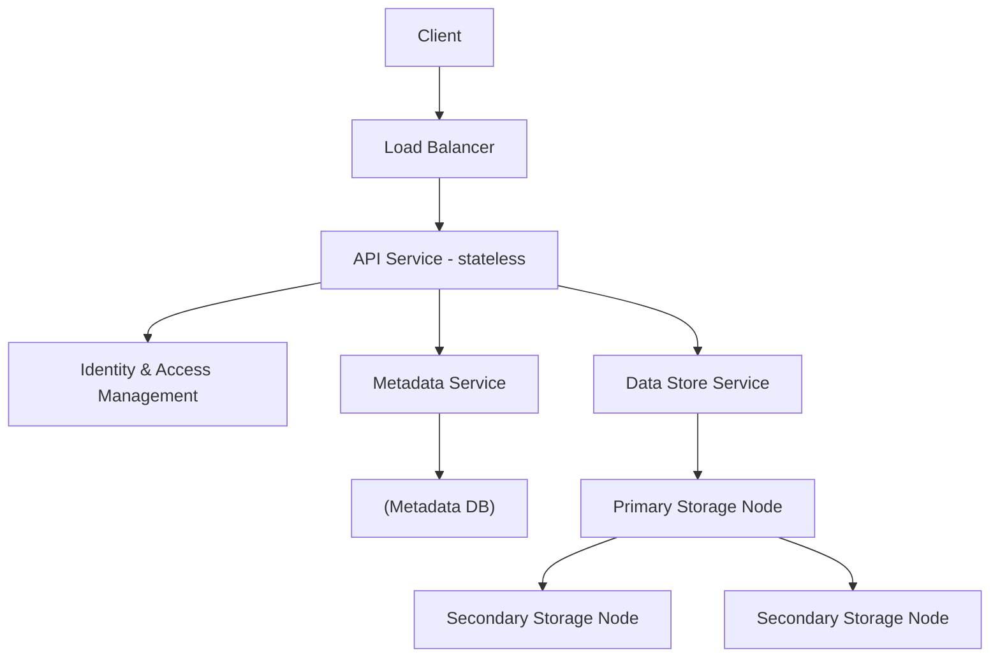
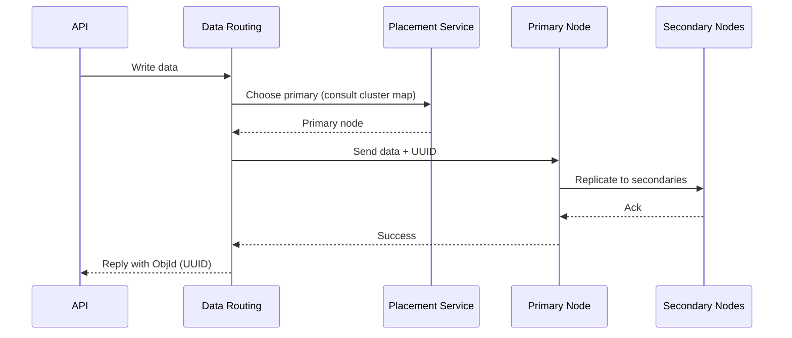
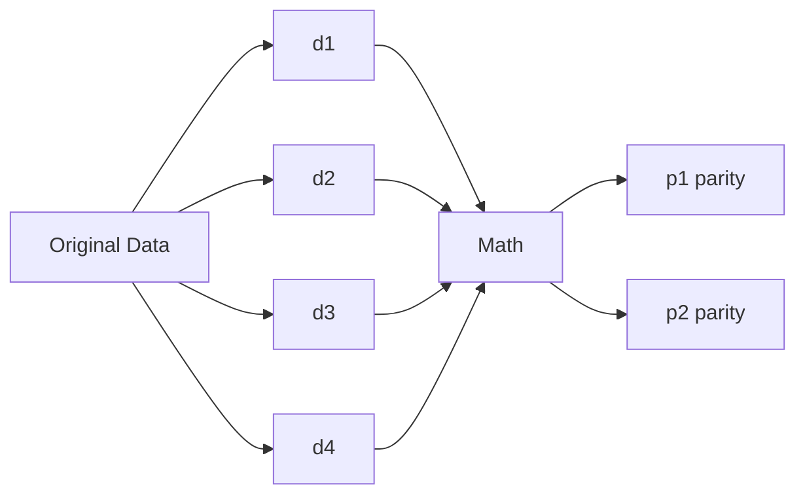

# Design an S3-like Object Storage · Vol 2 Ch 9

> Store 100 PB of immutable objects by separating a mutable metadata store from an immutable data store, using replication or erasure coding for durability, plus versioning, multipart upload, and garbage collection.

## 1. The Problem in Plain English

Design an object storage service like **Amazon S3**. You put files ("objects") into "buckets" and get them back over a **RESTful API**. Unlike a file system, there's **no folder hierarchy** — objects live in a **flat structure**. S3 launched in 2006 and by 2021 held **100+ trillion objects**. Objects are **immutable**: you can delete or fully replace them, but never edit part of one.

## 2. Requirements (Functional & Non-Functional)

### Storage System 101
Three kinds of storage:
- **Block storage** — raw blocks (HDD/SSD, or over Fibre Channel/iSCSI); most flexible/high-performance; used by databases and VMs.
- **File storage** — built on block storage; hierarchical files/directories over SMB/CIFS/NFS; general-purpose.
- **Object storage** — newest; sacrifices performance for **high durability, vast scale, low cost**; targets "cold" data (archival/backup); accessed via **RESTful API**; flat structure; strong consistency.

**Functional:** bucket creation; object upload/download; **object versioning**; **listing objects** in a bucket (like `aws s3 ls`).

**Non-functional:**
- **100 PB** of data.
- **Durability = 6 nines** (99.9999%).
- **Availability = 4 nines** (99.99%).
- **Storage efficiency** — cut cost while keeping reliability and performance.

### Key terminology
- **Bucket** — logical container for objects; name is **globally unique**.
- **Object** — data (payload) + **metadata** (name-value pairs); identified by a **URI**.
- **Versioning** — keeps multiple variants of an object (bucket-level).
- **SLA** — e.g. S3 Standard-IA: 11 nines durability across AZs, resilient to one AZ loss, 99.9% availability.

## 3. Back-of-the-Envelope Estimation

Object size distribution: **20% small** (<1 MB), **60% medium** (1–64 MB), **20% large** (>64 MB). One SATA disk (7200 rpm) does ~**100–150 IOPS**.

- 100 PB = 10^11 MB.
- Using median sizes (0.5 MB / 32 MB / 200 MB) and a 40% usage ratio:
  10^11 × 0.4 / (0.2×0.5 + 0.6×32 + 0.2×200) ≈ **0.68 billion objects**.
- Metadata ≈ 1 KB/object → **~0.68 TB** for all metadata.

Bottlenecks are **disk capacity** and **IOPS**.

## 4. High-Level Design

Key properties: **objects are immutable**; storage acts like a **key-value store** (object URI = key, data = value); **write once, read many** (**95% of requests are reads**, per LinkedIn); must support small and large objects.

**Core idea (like the UNIX file system):** UNIX stores the filename in an **inode** and the file data separately on disk, with block pointers linking them. Object storage does the same: a **metadata store** (like the inode) holds mutable metadata mapping object name → object ID; a **data store** (like the disk) holds the immutable object data, fetched by ID over the network. **Separating metadata (mutable) from data (immutable)** lets each be optimized independently.

- **Load balancer** spreads API requests. **API service** (stateless, scalable) orchestrates calls to IAM, metadata, and data stores.
- **IAM** — authentication (who you are) + authorization (what you may do).
- **Data store** — stores/retrieves actual data by **object ID (UUID)**.
- **Metadata store** — object metadata. (Data/metadata stores are logical; e.g. Ceph's Rados Gateway has no standalone metadata store.)

**Uploading an object (7 steps):** client `PUT`s to create a bucket → API checks IAM WRITE permission → metadata store creates bucket entry → client `PUT`s the object → API verifies permission → API sends data to the data store, which persists it and returns a **UUID** → API creates a metadata entry `(object_name, object_id=UUID, bucket_id)`.

**Downloading an object:** buckets have no hierarchy, but you simulate folders by naming objects `bucket-to-share/script.txt`. Client `GET`s → API checks IAM READ → API fetches the object's **UUID from the metadata store** → API fetches the data from the data store by UUID → returns it. (The data store knows nothing about names, only UUIDs.)

## 5. Deep Dive

### Data store internals
Three components:
- **Data routing service** — stateless REST/gRPC front to data nodes; asks the placement service where to store, reads/writes data.
- **Placement service** — decides which data nodes (primary + replicas) hold an object; maintains a **virtual cluster map** (physical topology) so replicas are physically separated. Monitors nodes via **heartbeats** (marks a node "down" after a ~15-second grace period). Built as a **5- or 7-node cluster using Paxos or Raft consensus** (tolerates failure of up to half minus one — 7 nodes tolerate 3 failures).
- **Data node** — stores actual data, replicated to a **replication group**; runs a daemon sending heartbeats (reporting drives and usage).

**Data persistence flow:** API sends data → routing service generates a **UUID** and asks placement for the **primary** node → sends data + UUID to primary → primary saves locally and **replicates to two secondaries**, responding only after all replicate → UUID returned. Lookup of the replication group from a UUID is **deterministic** and uses **consistent hashing** so it survives adding/removing groups.

**Consistency vs latency trade-off:** wait for all 3 nodes (best consistency, highest latency) / primary + 1 secondary (medium/medium) / primary only (worst consistency, lowest latency). Options 2 and 3 are **eventual consistency**; the design's default waits for all replicas (**strong consistency**).

**How data is organized:** storing each object as its own file wastes disk blocks (a <4 KB file still eats a full ~4 KB block) and exhausts **inodes**. Fix: **merge many small objects into one large file** like a **write-ahead log (WAL)** — append to a read-write file until it hits a threshold (a few GB), then mark it **read-only** and start a new one. Serialize writes to the read-write file; give each CPU core its **own** read-write file to keep throughput high.

**Object lookup:** an `object_mapping` table records `object_id`, `file_name`, `start_offset`, `object_size`. Storage choice: **RocksDB** (SSTable-based, fast writes/slow reads) vs a **relational DB** (B+ tree, fast reads/slow writes). Since the pattern is write-once-read-many, use a relational DB — specifically a small **SQLite** file-based DB **on each data node** (the mapping is local; no need to share it).

### Durability
- **Replication:** replicate **3 times**. With ~0.81% annual disk failure rate, 3 copies give ~**6 nines**. Consider **failure domains** — node-level, rack-level (shared switch/power), and **Availability Zones (AZs)** (independent power/networking). Replicate across AZs so a power outage, cooling failure, or disaster doesn't take out all copies.
- **Erasure coding:** split data into chunks and compute **parities**. E.g. **(4+2)**: 4 data chunks d1–d4 plus 2 parities p1,p2 (via math formulas); if 2 chunks are lost, reconstruct from the survivors. **(8+4)** spreads 12 equal pieces across 12 failure domains and survives up to 4 losses → **11 nines** durability.

**Replication vs erasure coding:**
| | Replication | Erasure coding |
|---|---|---|
| Durability | 6 nines (3 copies) | 11 nines (8+4) — wins |
| Storage overhead | 200% | 50% — wins |
| Compute | none — wins | heavier (parity math) |
| Write perf | faster — wins | slower (parity first) |
| Read perf (normal & failure) | wins | must read from multiple nodes; slow under failure |

Replication suits latency-sensitive apps; erasure coding minimizes storage cost. **This design mainly uses replication** (simpler).

**Correctness verification (data corruption):** disk failures can be reconstructed via erasure coding, but **in-memory corruption** also happens. Detect it with **checksums** (a small block computed from the data; different checksums = corruption). Algorithms: MD5, SHA1, HMAC — the book uses **MD5**. Append a checksum after each object and a whole-file checksum before marking a file read-only. On read: fetch data + checksum, recompute; if they differ, recover from another failure domain, then reconstruct.

### Metadata data model
Two tables: **bucket** (`bucket_name`, `bucket_id`, `owner_id`, `enable_versioning`) and **object** (`bucket_name`, `object_name`, `object_version`, `object_id`).
- **Scale the bucket table:** small (1M customers × 10 buckets × 1 KB ≈ 10 GB) — fits one server; spread reads across **replicas**.
- **Scale the object table:** must **shard**. Sharding by `bucket_id` causes **hotspots** (a bucket may hold billions of objects); by `object_id` distributes load but breaks URI-based queries. **Choose `hash(<bucket_name, object_name>)`** since most operations are URI-based.

### Listing objects in a bucket
Objects use paths like `s3://mybucket/abc/d/e/f/file.txt` where the **prefix** (`abc/d/e/f/`) mimics a directory (but prefixes aren't real directories). `aws s3 ls` supports: list all buckets; list objects at the same level as a prefix (deeper names **rolled up** into common prefixes); recursive listing.
- **Single DB:** `SELECT * FROM object WHERE bucket_id=... AND object_name LIKE 'abc/%'`; pagination via `OFFSET`/`LIMIT` and a **cursor** encoding the offset.
- **Sharded DB:** listing is hard — you must query every shard, aggregate, and sort; pagination is messy because each shard has a different offset (hundreds of offsets to track). Since object storage isn't tuned for listing performance, **denormalize listing data into a separate table sharded by bucket ID** used only for listing — isolating listing to one DB.

### Object versioning
Keeps multiple versions so accidental deletes/overwrites can be recovered. On upload with versioning enabled, instead of overwriting, **insert a new row** with the same `bucket_id`/`object_name` but a new `object_id` and a new **`object_version` (a TIMEUUID)**. The **current version = the largest TIMEUUID**. **Deleting** inserts a **delete marker** (a new version that becomes current); a `GET` then returns **404 Object Not Found**, while old versions remain.

### Optimizing large-file uploads (multipart upload)
Uploading a multi-GB file at once is slow and restarts on failure. Instead, split it and upload parts independently:
1. Client initiates → data store returns an **uploadID**.
2. Client splits the file (e.g. 1.6 GB into 8 parts of 200 MB) and uploads each part with the uploadID.
3. Each uploaded part returns an **ETag** (the MD5 checksum of that part).
4. After all parts, the client sends a **complete** request with uploadID, part numbers, and ETags.
5. The data store **reassembles** the object by part number and returns success. Old parts become useless afterward — cleaned up by garbage collection.

### Garbage collection
Reclaims unused space. Garbage arises from **lazy object deletion** (marked deleted but not removed), **orphan data** (half-finished/abandoned multipart uploads), and **corrupted data** (failed checksum). GC uses a **compaction** mechanism: copy still-valid objects from an old read-only file into a new file (skipping objects whose delete flag is true), then update `object_mapping` (`file_name`, `start_offset`) inside a **DB transaction**. For replication it deletes from primary + backups; for (8+4) erasure coding, from all 12 nodes. GC waits until many read-only files accumulate, then compacts them into a few large files to avoid creating many small files.

## 6. Scaling, Bottlenecks & Trade-offs

- **Bottlenecks:** disk capacity and IOPS; too many small files waste blocks/inodes (solved by merging into large WAL-style files).
- **Replication vs erasure coding:** cost/durability vs compute/latency — the central trade-off; the book leans on replication for simplicity.
- **Consistency vs latency:** strong (wait for all replicas) vs eventual (primary-only).
- **Metadata sharding:** `hash(bucket_name, object_name)` balances load while keeping URI queries efficient.
- **Listing performance** is deliberately deprioritized; a denormalized per-bucket table makes it acceptable.
- **Placement service** must stay available → Paxos/Raft consensus cluster.

## 7. Failure / Edge Cases

- **Disk/node failure:** detected by lost heartbeats (15 s grace); reconstruct via replication or erasure coding.
- **In-memory/transmission corruption:** caught by **checksums**; recover from another failure domain.
- **AZ-level disaster:** cross-AZ replication survives loss of a whole AZ.
- **Placement service node failures:** consensus tolerates up to (N−1)/2 failures.
- **Interrupted large upload:** multipart upload retries only the failed parts.
- **Accidental delete/overwrite:** versioning restores prior versions; delete markers hide (not erase) data.
- **Abandoned/corrupted/deleted data:** reclaimed by GC compaction.

## 8. Key Takeaways

- **Separate metadata (mutable) from data (immutable)** — the inode analogy is the whole design.
- Objects are **immutable**, accessed like a **key-value store** by URI/UUID, with a **write-once-read-many** (~95% reads) pattern.
- **Merge small objects into large WAL-style files** to avoid wasting blocks/inodes; track them with an `object_mapping` table (SQLite per data node).
- **Durability:** 3× replication ≈ 6 nines; **(8+4) erasure coding** ≈ 11 nines at 50% overhead vs replication's 200%.
- Use a **placement service** (Paxos/Raft, virtual cluster map, heartbeats) and **consistent hashing** for deterministic node lookup.
- Verify integrity with **checksums (MD5)**; respect **failure domains** (node/rack/AZ).
- **Shard object metadata by `hash(bucket_name, object_name)`**; denormalize a per-bucket table for listing.
- Support **versioning** (new TIMEUUID rows + delete markers), **multipart upload** (uploadID + per-part ETags), and **garbage collection** via compaction.

## 9. New Terms & Glossary

- **Block / file / object storage:** raw blocks / hierarchical files / flat REST-accessed objects.
- **Bucket / object / URI:** container / stored data+metadata / unique resource identifier.
- **Durability vs availability:** chance data survives vs chance the service is reachable ("nines").
- **Metadata store vs data store:** mutable name→ID map vs immutable object bytes.
- **UUID:** unique object identifier used by the data store.
- **Placement service / virtual cluster map:** decides node placement / physical topology map.
- **Heartbeat:** periodic health signal from data nodes.
- **Paxos / Raft:** consensus protocols keeping the placement cluster consistent.
- **Consistent hashing:** deterministic, rebalance-friendly node lookup.
- **Replication group / replica:** set of nodes holding copies of an object.
- **Erasure coding / parity:** split-plus-parity scheme for cheap high durability.
- **Failure domain / Availability Zone (AZ):** blast radius of a shared component / isolated data-center section.
- **Checksum (MD5/SHA1/HMAC):** small hash for detecting corruption.
- **WAL (write-ahead log):** append-only file pattern used to pack small objects.
- **inode:** UNIX structure storing file metadata + block pointers (design analogy).
- **object_mapping / SSTable / B+ tree:** lookup table / write-optimized (RocksDB) / read-optimized (relational) storage.
- **Prefix / rollup / cursor:** name prefix simulating folders / grouping deeper names / pagination pointer.
- **TIMEUUID:** time-ordered UUID marking object versions.
- **Delete marker:** version signaling deletion (GET returns 404).
- **Multipart upload / uploadID / ETag:** split-file upload / upload identifier / per-part MD5 checksum.
- **Garbage collection / compaction:** reclaiming unused space / rewriting files to drop dead data.
