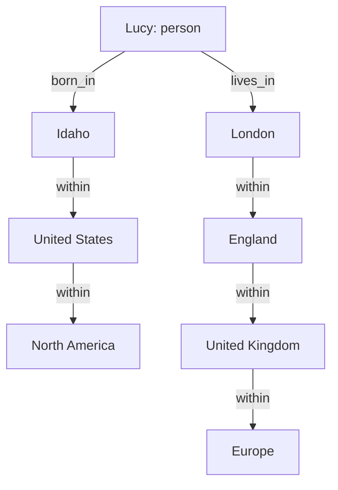

# Graph Models & Query Languages

**Prerequisites:** Topic 4 (Relational vs Document)
**Difficulty:** Intermediate
**Interview importance:** Medium — but decisive when it comes up
**Source:** Chapter 2 — "Query Languages for Data" and "Graph-Like Data Models"

---

## 1. What Is It?

A **graph model** stores data as **vertices** (nodes, entities) and **edges** (relationships, arcs). It's the natural fit when *anything can potentially relate to anything*.

Alongside this, Chapter 2 covers **query languages**: the distinction between declarative and imperative querying, which turns out to be one of the quietly important ideas in the whole book.

---

## 2. Why Does It Exist?

Two separate problems.

**The graph problem.** Document models handle one-to-many well. Relational models handle many-to-many well — up to a point. That point is **variable-length traversal**.

Ask: "find everyone who emigrated from the US to Europe." In SQL you must know in advance how many joins you need — but the path from a location to "Europe" might be *city → state → country → continent* for one person and *town → region → country → continent* for another. The number of hops varies per row. SQL can express this with recursive common table expressions, but the query is long and awkward compared to a graph query.

Graph databases were built for exactly this: **traversals of unknown or variable depth.**

**The query language problem.** IMS and CODASYL used **imperative** query APIs — application code iterated over records one at a time, in COBOL. Relational databases introduced **declarative** querying, and that single change unlocked query optimization, parallel execution, and storage-layer evolution without rewriting application code.

---

## 3. Simple Explanation

**Imperative:** tell the computer *how*. Loop, check condition, append to list.
**Declarative:** tell the computer *what you want*. Let it figure out how.

The consequence is large. If you specify how, the database is stuck with your algorithm. If you specify what, the database can change its index, reorder joins, or parallelize across cores — and your code doesn't change.

The book uses CSS and XPath as an illuminating non-database example: `li.selected > p` is declarative. Writing the equivalent as imperative JavaScript that walks the DOM works, but breaks if the page changes structure, can't be optimized by the browser, and is far longer.

**Declarative languages have a further advantage: they lend themselves to parallel execution.** Imperative code specifies a particular order of operations, which is hard to parallelize. Declarative code specifies only the pattern of results, so the database is free to use whatever cores it has.

---

## 4. Real-World Analogy

**Ordering food.**

Declarative: "I'd like the chicken biryani." The kitchen decides which pan, which burner, what order. If they get a faster rice cooker, your order doesn't change.

Imperative: "Take pan three, heat to 180°C, add oil for 40 seconds…" You now own the recipe. If the kitchen gets better equipment, they can't use it without your permission. And you can't ask two cooks to work on it in parallel, because you specified an order.

That's the relational-vs-CODASYL argument in one image.

---

## 5. Technical Explanation

### The property graph model

Each **vertex** has a unique identifier, a set of outgoing edges, a set of incoming edges, and a collection of key-value properties.
Each **edge** has a unique identifier, a tail vertex (where it starts), a head vertex (where it ends), a label describing the relationship, and a collection of key-value properties.

Two features follow, and they're the reason the model is flexible:

1. **Any vertex can have an edge to any other vertex.** No schema restricts which kinds of things can connect.
2. **Given any vertex, you can efficiently traverse both its incoming and outgoing edges**, so you can walk the graph in either direction.

Using different labels for different relationship types lets you store several kinds of information in one graph while keeping a clean model.

You can represent a property graph in a relational schema with two tables — vertices and edges — but querying it in SQL requires recursive CTEs, which is where it gets painful.

### The Cypher query language

Cypher is Neo4j's declarative language for property graphs. The idea is pattern matching: you describe a shape of vertices and edges, and the database finds all the places that shape occurs. The key expressiveness is that a traversal can be written to follow an edge type *zero or more times* — which is exactly the variable-depth case SQL struggles with.

The book's point is comparative: the same query is a few lines in Cypher and a substantial recursive CTE in SQL. Both work; one is far more readable for this class of problem.

### Triple-stores and SPARQL

A **triple-store** stores everything as three-part statements: **(subject, predicate, object)**. For example: *(Jim, likes, bananas)*.

The subject is always a vertex. The object is either a primitive value — in which case the triple is a property of the subject — or another vertex, in which case the triple is an edge, with the predicate as its label.

Formats: **Turtle** (readable), **RDF/XML** (verbose), and the query language **SPARQL**. These came out of the **semantic web** movement — the idea that websites should publish machine-readable data so that an "internet of data" could be queried. That vision was over-hyped in the 2000s and hasn't been realized, but the underlying technology is sound and usable independently.

### Datalog

Datalog is older (1980s) and is the foundation the others build on. Data is written as facts: `within(idaho, usa)`. Rules are defined in terms of other rules, and rules can be **recursive**, which is what makes variable-depth traversal expressible.

Datalog is less convenient for simple one-off queries but scales better to complex data, because you can build rules on rules and compose them — the same reason you break complex code into functions.

---

## 6. How Does It Work? — variable-depth traversal



The query "people who emigrated from the US to Europe" must:

1. Find vertices with a `born_in` edge, then follow `within` edges **repeatedly** until reaching a vertex named "United States."
2. Independently, follow `lives_in`, then `within` **repeatedly** until reaching "Europe."
3. Return vertices satisfying both.

**The number of `within` hops differs per person.** Lucy's birthplace is two hops from the US; her residence is three hops from Europe. That variability is what makes SQL awkward and graph queries natural.

---

## 7. Concrete Example

**Fraud detection at a payments company.**

You want: "find accounts within three degrees of a known fraudulent account, connected by shared device fingerprints, IP addresses, or bank accounts."

In a relational model this is a self-join of unknown depth across several relationship types. In a graph model it's a single traversal pattern, and it stays readable as you add relationship types.

This is a genuinely good use of a graph database, and worth having in your pocket for interviews because it's concrete: fraud rings, social recommendations ("people you may know"), and network topology are the canonical cases where graphs earn their keep.

---

## 8. When to Use / Not Use

**Use a graph model when:** relationships are as important as entities; you need traversals of variable or unknown depth; relationship types are heterogeneous and will grow; the data is a genuine network (social, fraud, dependency, routing).

**Don't use when:** relationships are shallow and fixed-depth (a normal join does this better); your data is really tabular and someone is excited about Neo4j; you need heavy aggregate analytics (column stores win); your team has no experience and the operational maturity of your graph database is unproven.

The honest position: most systems that "have a graph" don't need a graph database. Two joins in Postgres handles the vast majority of relationship queries. Reach for a graph database when the *depth is variable*, which is a much narrower condition than "my data has relationships."

---

## 9. Advantages & Disadvantages

**Graph model — advantages:** natural for interconnected data; variable-depth traversal is expressible and efficient; schema-flexible — new relationship types don't require migrations; queries stay readable as complexity grows.
**Graph model — disadvantages:** smaller ecosystem and less mature tooling; unfamiliar query languages; poor fit for aggregate analytics; harder to partition, since graphs resist clean cuts — an edge that crosses partitions is expensive.

**Declarative queries — advantages:** the optimizer can change strategy without code changes; parallelizable; concise; storage layer can evolve underneath.
**Declarative — disadvantages:** less control when you need it; performance can be surprising; you're dependent on the optimizer's quality.

---

## 10. Trade-off Table

| Model / Language | Advantages | Disadvantages | Best Use Case |
|---|---|---|---|
| Property graph (Cypher) | Intuitive; strong tooling for traversal | Vendor-specific language | Social networks, fraud, recommendations |
| Triple-store (SPARQL/RDF) | Standardized; good for merging data from many sources | Verbose formats; semantic-web baggage | Data integration across organizations |
| Datalog | Composable rules; recursion; scales to complex queries | Less convenient for simple queries; unfamiliar | Complex derived rules built on rules |
| Relational + recursive CTE | No new system; ACID; existing ops knowledge | Verbose for traversal; can be slow at depth | Occasional graph queries in a mostly-relational system |
| Imperative (MapReduce, app code) | Full control; arbitrary logic | No optimization; hard to parallelize; verbose | When the logic genuinely can't be expressed declaratively |

---

## 11. Failure Scenarios

| Scenario | Consequence | Mitigation |
|---|---|---|
| Traversal has no depth bound | Query walks the entire graph; timeout | Always bound traversal depth; set query timeouts |
| Supernode (a vertex with millions of edges) | One traversal step explodes | Special-case high-degree vertices — the same idea as Twitter's celebrity handling |
| Graph partitioned across machines | Every traversal becomes a network call | Keep graphs on one machine where possible; partition by community |
| Query optimizer picks a bad plan | Sudden latency cliff after data growth | Monitor plans; maintain statistics; be ready to hint |
| Recursive CTE in production RDBMS | Runaway CPU | Depth limits; `LIMIT`; timeouts |

The supernode problem is worth internalizing — it's structurally the same as the hot-key problem in partitioning (Topic 14) and the celebrity fan-out problem in Topic 2. Skewed degree distributions break naive algorithms, everywhere.

---

## 12. Production Considerations

- **Bound every traversal.** Unbounded depth queries are the primary operational hazard.
- **Watch degree distribution**, not just vertex count. A few supernodes dominate cost.
- **Graphs partition badly.** If it fits on one machine, keep it there — this is the strongest practical constraint on graph databases.
- **Backups and operational tooling** are typically less mature than for relational databases. Verify before committing.
- **Consider a graph as a derived view** built from a relational system of record, rather than a system of record itself — you get traversal power without betting durability on a less mature system.

That last suggestion isn't from the book, but it follows naturally from Chapter 12's derived-data argument and is what most mature teams actually do.

---

## ❌ 13. Common Mistakes

- **Using a graph database because relationships exist.** Everything has relationships. The trigger is *variable-depth traversal*.
- **Unbounded traversals in production.** They will find the supernode.
- **Ignoring the supernode problem** until a celebrity node melts a query.
- **Assuming graph databases scale out like key-value stores.** They don't — cutting a graph is expensive by nature.
- **Confusing "graph processing" with "graph database."** Pregel-style batch graph processing (Topic 29) is a different tool for a different job.
- **Writing imperative code where declarative would do**, and losing the optimizer's ability to improve.

---

## 🧠 14. Think Like an Engineer

```
Are relationships central, or incidental?
        ↓
Is traversal depth FIXED or VARIABLE?
   fixed → normal joins are fine
   variable → graph territory
        ↓
Will relationship types grow over time?
        ↓
Does the graph fit on one machine? (if not, think hard)
        ↓
What's the degree distribution? Where are the supernodes?
        ↓
Could this be a derived view over a relational source of truth?
```

---

## 15. Mental Model

```
Fixed-depth relationships  → relational joins
Variable-depth traversal   → graph model
Self-contained trees       → documents
Everything connected       → graph
      +
Declarative wherever possible — it's what lets the
database get faster without you rewriting anything
```

---

## 🔗 16. How This Connects to Other Concepts

- **Relational vs Document (Topic 4)** — completes the triangle of data models.
- **Partitioning (Topic 14)** — supernodes are hot keys; graphs are the hardest thing to partition.
- **Batch Processing (Topic 29)** — the Pregel model handles offline graph computation at scale, which is a different problem from online traversal.
- **Column Storage (Topic 8)** — declarative querying is what allows the storage layer to change radically (row → column) with no application change. That's the payoff of Codd's original bet.

---

## 17. Interview Questions & Answers

**Beginner**

**Q: What's the difference between declarative and imperative query languages?**
Imperative says how — loop over records, test each one, build a result. Declarative says what — describe the result you want and let the database choose the strategy. The practical consequence is that with declarative queries the database can change its access path, add an index, or parallelize across cores without you changing any code, whereas imperative code locks in one algorithm.

**Q: When would you use a graph database?**
When I need traversals whose depth I don't know in advance — friend-of-friend to arbitrary depth, fraud rings, dependency chains. If the depth is fixed, a normal join does the job and I wouldn't add a new system. The distinguishing feature is variable-length traversal, not just the presence of relationships.

**Intermediate**

**Q: Why can't SQL handle graph queries well?**
It can, via recursive common table expressions, but the query becomes long and hard to read because SQL's join syntax assumes you know how many joins you need at write time. In a graph, the number of hops varies per row — one person's location is two levels from their country, another's is four. Graph query languages let you express "follow this edge type zero or more times" directly, which is exactly the thing SQL has to simulate with recursion.

**Q: What's a triple-store?**
A model where everything is a three-part statement: subject, predicate, object. If the object is a primitive value the triple represents a property of the subject; if it's another vertex, the triple is an edge with the predicate as its label. It came out of the semantic web movement, which didn't pan out as envisioned, but the model itself is useful — particularly for integrating data from many independent sources, since a triple is a very low-commitment unit of information.

**Advanced / Staff**

**Q: How would you handle supernodes in a graph traversal system?**
Supernodes are the same structural problem as hot keys and celebrity fan-out: a skewed degree distribution that breaks algorithms designed for the average case. I'd first measure the degree distribution, because the fix depends on how extreme the tail is. Then I'd bound traversals by depth and by breadth, so a single step can't expand into millions of edges. For known supernodes I'd special-case them — either exclude them from generic traversals, since a vertex connected to everything usually carries no signal, or handle them with a separate precomputed path, which is exactly what Twitter does for celebrity tweets. And at the query layer I'd enforce timeouts and result limits so that an unbounded query degrades into an error rather than an outage.

**Q: Would you make a graph database your system of record?**
Usually not. I'd rather keep the system of record in a mature relational database with well-understood durability, backup, and recovery properties, and maintain the graph as a derived view fed from the change log. That way the traversal capability is available, but if the graph store is lost or corrupted I rebuild it rather than losing data. It also means I can change the graph schema freely by rederiving, which is much cheaper than migrating a system of record. The exception would be a product where the graph *is* the domain and the traversal is the core write path — but that's rarer than the number of graph databases in production would suggest.

---

## 🎯 30-Second Interview Answer

> "Graph models store data as vertices and edges, and they earn their keep specifically when traversal depth is variable — friend-of-friend to unknown depth, fraud rings, dependency chains. If the depth is fixed, ordinary joins are better and I wouldn't add a system. The other idea in this chapter is declarative versus imperative querying: declarative languages like SQL and Cypher let the database choose the access path and parallelize, which is why the relational model beat the network model — CODASYL made applications navigate access paths by hand, so changing a query meant changing code. The main operational hazards with graphs are unbounded traversals and supernodes, which are the same skew problem you see with hot keys everywhere else."

---

## ⚡ Quick Revision

- **Property graph:** vertices + edges, each with properties; edges have labels; traverse both directions efficiently.
- **Graph's killer feature:** **variable-depth traversal**. That's the trigger, not "we have relationships."
- **Triple-store:** (subject, predicate, object). Query with **SPARQL**. From the semantic web movement.
- **Datalog:** recursive rules built on rules; composable; the foundation of the others.
- **Declarative > imperative** because the optimizer can change strategy and parallelize without code changes.
- Network model (CODASYL) required **manual access-path navigation** — this is what relational replaced.
- **Supernodes** = hot keys. Same problem as celebrity fan-out.
- **Graphs partition badly.** Keep on one machine if you can.
- Common mature pattern: graph as a **derived view**, relational as system of record.
